# Module 1: LPP Basics and Simplex (Lectures 1-14)

- L1: What is OR, optimization model components, LPP definition, 5 formulation examples
- L2: More OR models (transportation, TSP, capital budgeting, cargo loading, caterer)
- L3: Graphical method for 2-variable LPP and 4 cases
- L4: Convex sets — definitions and theorems 1-13, link to LPP
- L5: Simplex method — standard form, basic solutions, tableau algorithm, worked example
- L6: Big-M method — worked example
- L7: Two-phase method — worked example on same problem
- L8: Big-M vs Two-phase; multiple (alternate) optima — graphical + tableau detection
- L9: Unbounded solution — detection; unbounded region vs unbounded value
- L10: Infeasible solution, degeneracy, unrestricted variables, tips, quiz 1
- L11: Revised simplex and simplex multipliers
- L12-14: Case studies (transport, diet, infeasibility proofs, Big-M multiple solution) + Module-1 quiz bank
- Key exam takeaways and tableau reading checklist

Notation used throughout: decision variables $x_1, x_2, \dots, x_n$; objective coefficients $c_j$; constraint matrix $a_{ij}$; RHS $b_i$; deviation (reduced cost) row $\bar{c}_j = c_j - \pi P_j$ where $\pi = c_B B^{-1}$. All $\leq$/$\geq$ signs have been corrected from transcript artifacts.

---

## 1. Introduction to OR and LPP formulation (Lec 1)

*What/why: this section teaches how to turn a real story into decision variables, constraints and an objective — the skill every later method assumes.*

### 1.0 OR sub-areas and LPP solution workflow

- OR sub-areas named in Lec 1: linear programming, nonlinear programming, queuing theory [bank/computer queues], reliability theory [mechanical/civil systems], game theory [decisions with competitors], network analysis [e.g. ISP networks], inventory control [warehouse stock vs holding cost].
- Workflow overview:

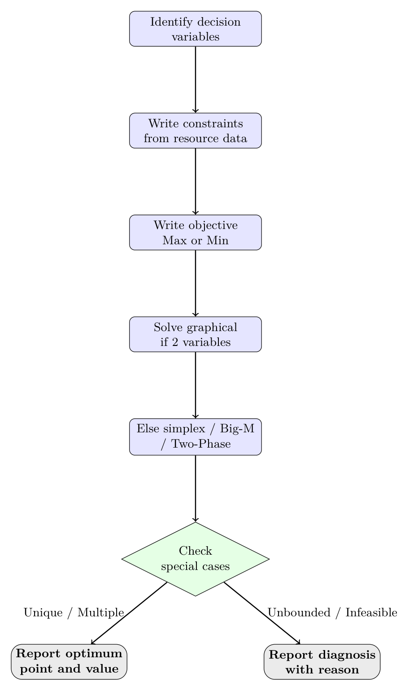

### 1.1 What is Operations Research

- OR = branch of mathematics for modelling real-life decision problems and finding the optimum decision (min cost / max profit), applicable to engineering, science, management, finance, business.
- Course scope (noc26_ma85): LPP and variants, multi-objective and goal programming, transportation and assignment, sequencing/scheduling, game theory.

### 1.2 General optimization model

- Minimize or maximize $f(X)$, $X = (x_1,\dots,x_n) \in S \subseteq R^n$, subject to:
  1. $g_k(X) \geq 0$, $k=1,\dots,m$ (inequality constraints),
  2. $h_j(X) = 0$, $j=1,\dots,l$ (equality constraints),
  3. $a_i \leq x_i \leq b_i$ (bounds).
- Components: (1) decision variables, (2) objective function, (3) constraints.
- Classifications taught:
  - By functions: linear (all $f, g_k, h_j$ linear) vs nonlinear (any one nonlinear); unconstrained vs constrained.
  - By variables: dynamic (stage/time-dependent), geometric (negative powers allowed), integer (only integer values), quadratic (quadratic objective + linear constraints), separable ($f = \sum f_i(x_i)$), stochastic (random data).
  - By objectives: multi-objective, goal programming (target goals), multilevel; fuzzy/stochastic; evolutionary computation (GA, DE, memetic) and swarm intelligence (PSO, ACO, ABC, bacterial foraging).

### 1.3 LPP: scalar and matrix form

- Max/Min $z = c_1 x_1 + \dots + c_n x_n$ s.t. $a_{i1}x_1+\dots+a_{in}x_n \leq (\text{or }\geq, =)\, b_i$, $x_i \geq 0$. In matrix form: Max/Min $C^T X$ s.t. $AX \leq B$, $X \geq 0$. All $a_{ij}, c_j, b_i$ real; $m, n$ positive integers, generally $m \neq n$.
- Definitions:
  1. Feasible solution: any $X$ satisfying all constraints.
  2. Feasible region: set of all feasible solutions.
  3. Optimum solution: best feasible solution (max or min as asked).
  4. Optimum value: objective value at optimum.

### 1.4 Three-step formulation recipe

1. Identify decision variables (with units; state integer requirement only if physically indivisible).
2. Identify constraints from resource/demand data (watch units, e.g. hours to minutes).
3. Identify objective (max or min) from profit/cost data.

### 1.5 Worked formulation example (profit maximization, condensed)

- Models A, B, C. Labour hrs/unit: 7, 3, 6 (supply 150 h). Material kg/unit: 4, 4, 5 (supply 200 kg). Profit Rs/unit: 4, 2, 3.
- Let $x_1, x_2, x_3$ = units of A, B, C (integer, $\geq 0$).
- Max $z = 4x_1 + 2x_2 + 3x_3$ s.t. $7x_1+3x_2+6x_3 \leq 150$, $4x_1+4x_2+5x_3 \leq 200$.

### 1.6 Other Lec-1 models (statements condensed)

- Work scheduling (post office): $x_i$ = employees starting day $i$ ($i=1..7$, integer $\geq 0$). Min $\sum x_i$ s.t. 7 covering constraints, e.g. day 1: $x_1+x_4+x_5+x_6+x_7 \geq 17$ (those on duty Monday given 5-consecutive-day, 2-off rule), etc.
- Product-mix (suiting/shirting/woollen, minutes; capacities 60/40/80 h = 3600/2400/4800 min; profits 2/4/3): Max $2x_1+4x_2+3x_3$ s.t. $3x_1+4x_2+3x_3 \leq 3600$, $2x_1+x_2+3x_3 \leq 2400$, $x_1+3x_2+3x_3 \leq 4800$ (no integer restriction — metres can be fractional).
- Advertising (magazines A/B/C; readers 100000/60000/40000; principal-buyer % 20/15/8; cost 8000/6000/5000; budget 100000; $x_1 \leq 15$, $x_2, x_3 \geq 8$ approx per lecture): $x_i$ = insertions; Max exposure $(0.20 \times 100000)x_1 + (0.15 \times 60000)x_2 + (0.08 \times 40000)x_3$ s.t. budget $\leq 100000$ + insertion bounds, integer.
- Portfolio: $x_1, x_2$ = Rs in portfolios 1, 2. Max $0.10x_1+0.20x_2$ s.t. $x_1+x_2 \leq 100000$, each $\leq 75000$, return $\geq 12\%$ of invested, risk $\leq 6$ ($4x_1+9x_2 \leq 6(x_1+x_2)$), continuous.
- Trim-loss exercise (paper rolls 180 cm; demands 200/120/130 of widths 80/45/27): patterns $x_j$, Min wastage $\sum w_j x_j$ (e.g. $20x_1+10x_2+\dots$) s.t. width-wise demand coverage, $x_j \geq 0$ integer. Lecture hint table: pattern $80+80$ in 180 cm roll leaves wastage $20$; each column of the pattern table gives how many 80/45/27 cm pieces one roll yields. Model shown in slides: Min $20x_1+10x_2+x_3+19x_4+18x_6+9x_7+18x_9$ s.t. three demand-covering rows for 80/45/27 cm rolls.

### 1.7 Lec-1 take-home exercises with answers where given

- Hat profit exercise [formulate only]: company makes two hat types; type-1 needs twice the labour of type-2; all-type-2 capacity is 500 hats/day; sales limits 150 [type-1] and 250 [type-2]; profits Rs 8 and Rs 5. Given $\to$ Steps $\to$ Answer: Given above data; Steps: let $x_1,x_2$ = hats of type 1,2 per day; labour constraint from $2x_1+x_2 \leq 500$; bounds $x_1 \leq 150$, $x_2 \leq 250$; Max $8x_1+5x_2$. Answer: formulation as stated [lecture leaves solving to student].
- Trim-loss: use pattern table in Sec. 1.6 to write Min-wastage model; check lec1 slides `lec1.pdf-0026-03.png` and `lec1.pdf-0027-00.png` for the full 9-pattern table.

---

## 2. More OR models (Lec 2)

*What/why: five reusable LPP templates — transport, TSP, budgeting, cargo, caterer — so you recognise the same structure in case studies.*

- Slide-image reference for the generic transportation cost table:
- The table below shows sources, destinations, unit costs, supply column and demand row.

- Slide-image reference for the TSP cost matrix with blanks on the diagonal and missing links:
- The matrix below shows asymmetric costs, blank diagonal entries, and no link between city 1 and city 5.

### 2.1 Transportation problem

- $x_{ij}$ = units from source $i$ to destination $j$ ($\geq 0$, integer). Min $\sum c_{ij}x_{ij}$ s.t. row (supply) sums = supply $s_i$ (e.g. $x_{11}+x_{12}+x_{13}+x_{14} = 70$), column (demand) sums = demand $d_j$ (e.g. $x_{11}+x_{21}+x_{31} = 40$). Full Lec-12 wheat example is in Sec. 12.

### 2.2 Travelling salesman (0-1 model sketch)

- $x_{ij} \in \{0,1\}$: 1 if salesman goes $i \to j$, else 0. Min $\sum c_{ij}x_{ij}$ (skip missing links / diagonal) s.t. each row and column sums to 1. (Full subtour-elimination constraints beyond this lecture's scope.)
- Lecture details: cost matrix is generally asymmetric [$c_{ij}$ need not equal $c_{ji}$]; diagonal blank [no $i \to i$ travel]; some pairs blank [e.g. no link $C_1 \leftrightarrow C_5$]; those $x_{ij}$ are simply omitted from objective and constraints. Model type is 0-1 programming.

### 2.3 Capital budgeting (Remco, 3 years, funds 1 lakh, projects A-E + 8% money market)

- Decision: $X_A,\dots,X_E$ = Rs in each project; $S_0,S_1,S_2$ = surplus parked at 8%.
- Logic per stage: funds available at stage $t$ = returns from earlier projects + $1.08 \times S_{t-1}$; investment $\leq$ available; surplus = available $-$ invested. Max cash on hand at time 3. Each project $\leq 75000$, all $\geq 0$. (Lecture derives $S_0 = 100000-(X_A+X_C+X_D)$, stage-1 availability $0.5X_A+1.2X_C+1.08S_0 \geq X_B$, etc.)
- Stage table as taught:

| Stage | Funds available | Amount invested | Surplus definition |

|---|---|---|---|

| 0 | Rs 100000 | $X_A+X_C+X_D$ | $S_0 = 100000 - X_A - X_C - X_D$ |

| 1 | $0.5X_A+1.2X_C+1.08S_0$ | $X_B$ | $S_1 =$ available $-$ invested |

| 2 | returns at year 2 $+ 1.08S_1$ | $X_E$ | $S_2 =$ available $-$ invested |

| 3 | returns at year 3 $+ 1.08S_2$ | none, objective Max cash on hand | — |

- Assumptions stated: no borrowing; uninvested funds earn 8 percent in money market; returns are immediately reinvestable [e.g. project C returns at time 1 can fund project B].

### 2.4 Cargo loading

- $u_i$ = units of item $i$ loaded. Data: weights 2,3,1; revenues 31,47,14 (Rs thousand); capacity 4 t. Max $z = 31u_1+47u_2+14u_3$ s.t. $2u_1+3u_2+u_3 \leq 4$, $u_i \geq 0$ integer.

### 2.5 Caterer / napkin scheduling (7 days)

- $x_j$ = new napkins bought day $j$; $y_j$ = sent for express wash (Rs 1, 2-day return); $z_j$ = ordinary wash (Rs 0.60, 4-day return); $v_j$ = soiled held over. Min $3\sum x_j + 1\sum y_j + 0.6\sum z_j$ s.t. daily fresh-napkin coverage (e.g. $x_1=160, x_2=120, \dots$, $x_4+y_1 \geq 90$, etc. per return-lag table) + dirty-napkin balance $y_j+z_j+v_j = $ used$_j + v_{j-1}$ (many $y_j, z_j = 0$ in early days). All integer $\geq 0$.
- Demands used in lecture: 160, 120, 80, 90, 110, 100, 120 for days 1-7. Early-day logic: days 1-3 must buy new [$x_1=160, x_2=120, x_3=60$ per transcript table] since no washed napkins have returned yet.

### 2.6 Lec-2 sari exercise [formulate only, from transcript]

- Given: lady needs saris over 6 months [given monthly requirements table]; new sari Rs 500; a worn sari cannot repeat in same or next month; it can re-wear in 3rd-6th month at cost Rs 100, 80, 60, 50 [dry-cleaning plus loss-of-face]; all saris rejected after August.
- Steps: define purchase variables per month plus re-wear assignment variables with 2-month gap; objective Min purchase cost plus re-wear costs; constraints monthly demand coverage plus no-repeat gap plus non-negativity and integer.
- Answer: formulation left as student exercise in lecture; use caterer napkin lag logic as template.

---

## 3. Graphical method for 2-variable LPP (Lec 3)

*What/why: the only method you can draw — plot lines, shade the feasible region, read corners, and classify into the 4 outcomes.*

- Slide-image reference for the unique-solution plot with shaded region and iso-lines:
- The graph below shows lines through 0 5 and 5 0 plus 0 3 and 8 0, shaded feasible region OABC, and parallel objective lines farthest at C.

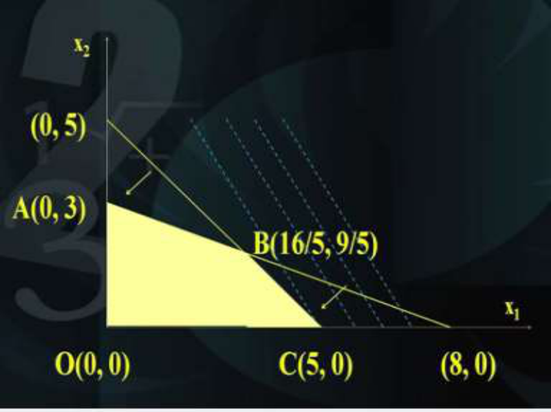
- Slide-image reference for the multiple-solution plot where objective lines overlap edge AB:
- The graph below shows the same region with objective family parallel to the second constraint, optimum on segment AB.

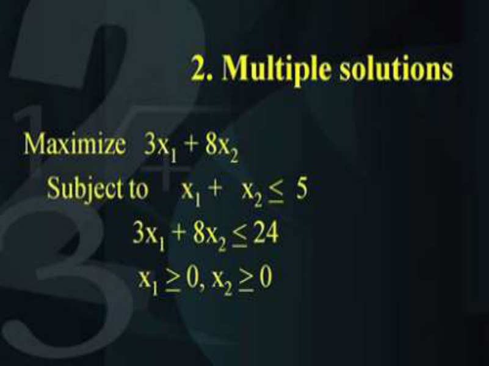
- Slide-image reference for the unbounded plot open to the right:
- The graph below shows region O A B C open in plus x1 direction with improving objective lines.

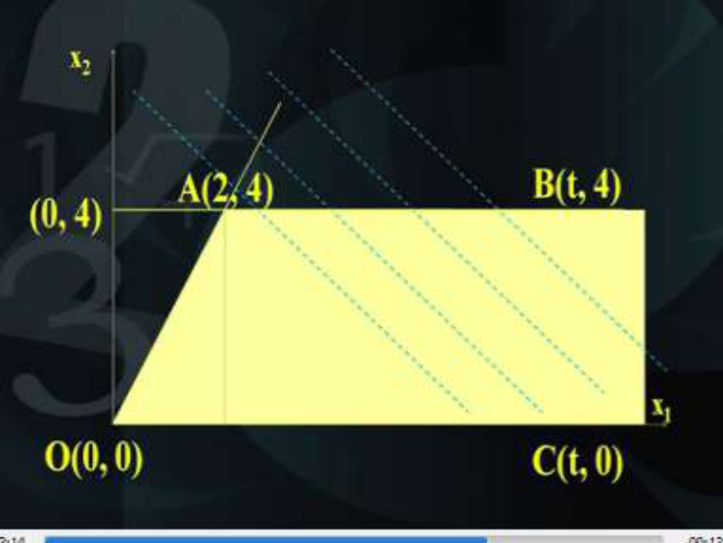
- Slide-image reference for the infeasible plot with parallel non-overlapping strips:
- The graph below shows line below x1 plus x2 equals 5 and line above x1 plus x2 equals 6 with no overlap.

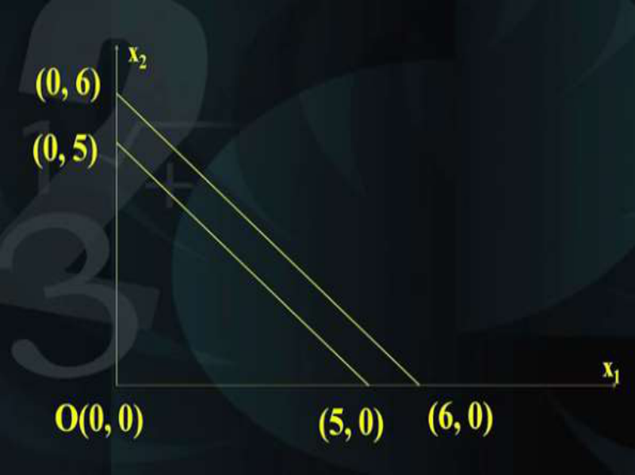

### 3.1 Procedure

1. Plot each constraint as equality line (two intercepts). Shade feasible side: substitute origin $(0,0)$; if it satisfies the inequality, feasible side contains origin (if line passes through origin, use another test point e.g. $(5,0)$).
2. Intersection of all shadings (+ first quadrant if $x_1,x_2 \geq 0$) = feasible region. Shade it, list corner points (solve line pairs).
3. Evaluate $z$ at each corner; or draw objective iso-lines (parallel family) and pick farthest from origin (max) / nearest (min) line touching the region.
4. Four possible outcomes: unique optimum, multiple (alternate) optima, unbounded, infeasible.

### 3.2 Worked example — unique solution

- Max $z = 5x_1+3x_2$ s.t. $x_1+x_2 \leq 5$, $3x_1+8x_2 \leq 24$, $x_1,x_2 \geq 0$.
- Lines: $x_1+x_2=5$ through $(0,5),(5,0)$; $3x_1+8x_2=24$ through $(0,3),(8,0)$. Both feasible-below. Corners: $O(0,0)$, $A(0,3)$, $B(16/5,9/5)$, $C(5,0)$.
- $z$: $0, 9, 21.4, 25$. Optimum $x_1=5, x_2=0$, $z^\*=25$ at $C$.

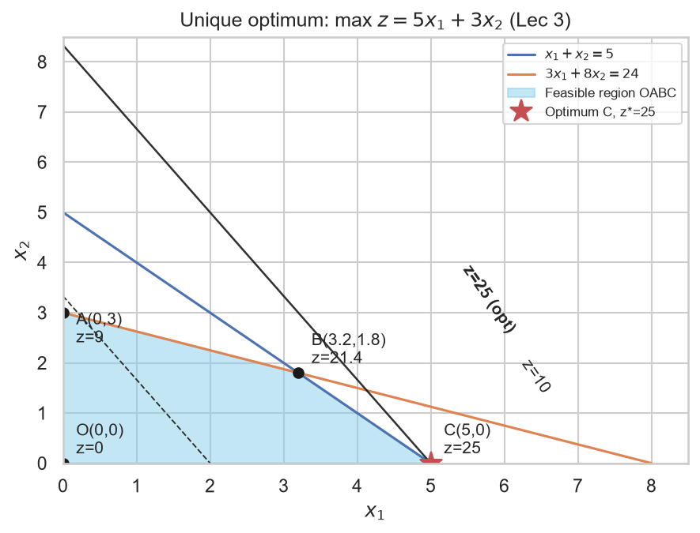

### 3.3 Worked example — multiple solutions (same region, changed objective)

- Max $z = 3x_1+8x_2$ with same constraints. Objective slope now equals second constraint slope.
- Corner values: $0, 24, 24, 15$. Max 24 attained at both $A(0,3)$ and $B(16/5,9/5)$ — hence on the whole segment $AB$ (verify: any point on $AB$ gives $z=24$). Infinitely many optima.

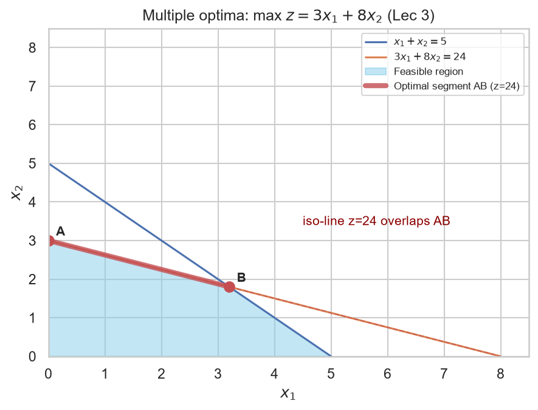

### 3.4 Worked example — unbounded

- Max $z = 3x_1+8x_2$ s.t. $2x_1-x_2 \geq 0$, $x_2 \leq 4$, $x_1,x_2 \geq 0$.
- Region: $O(0,0), A(2,4), B(t,4), C(t,0)$ with $t>2$ — open to the right. $z(B) = 6+8t \to \infty$ as $t \to \infty$. Unbounded (for a min problem the origin would be optimal — direction matters).

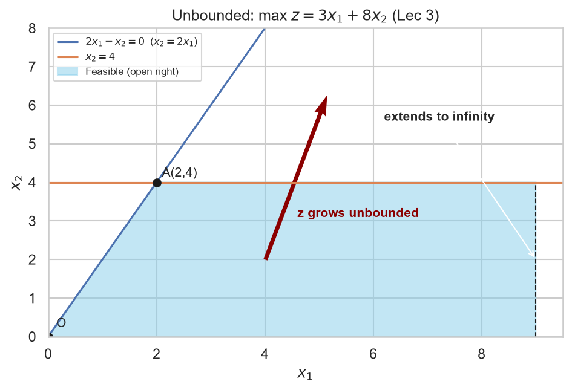

### 3.5 Worked example — infeasible

- Max $3x_1-2x_2$ s.t. $x_1+x_2 \leq 5$, $x_1+x_2 \geq 6$, $x_1,x_2 \geq 0$. First strip below line through $(0,5),(5,0)$; second above parallel line through $(0,6),(6,0)$. No overlap: no feasible point regardless of objective.

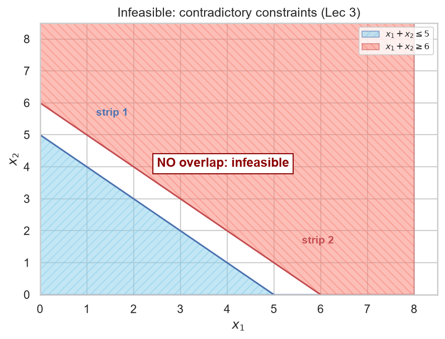

### 3.6 Lecture exercises with answers (for practice)

1. Max $5x+8y$ s.t. $3x+2y \leq 36$, $3x+4y \geq 24$: answer $(0,18)$.
2. Min $5x+2y$ s.t. $x+4y \geq 4$, $5x+2y \geq 10$: multiple optima on segment $(0,5)$-$(16/9,5/9)$ (objective parallel to 2nd constraint).
3. Max $5x-y$ s.t. $2x+3y \geq 12$, $x-3y \geq 0$: unbounded.

---

## 4. Convex sets and LPP theory (Lec 4)

*What/why: convexity explains why the simplex only needs to check vertices — learn the definitions, the 13 theorems, and the two LPP theorems.*

- Slide-image reference for convex-set examples:
- The slide below shows six shapes where every segment between two points stays inside.

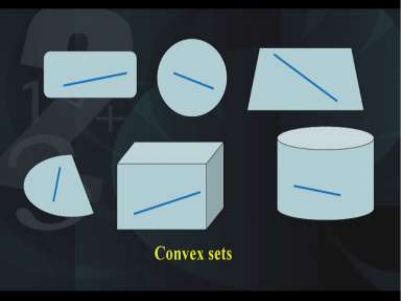
- Slide-image reference for non-convex examples:
- The slide below shows shapes where one segment leaves the set.

- Slide-image reference for convex hull of an L-shaped non-convex set:
- The slide below shows an L-shape on the left and its smallest convex cover on the right.

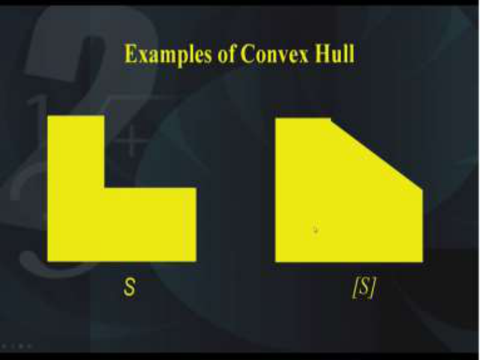

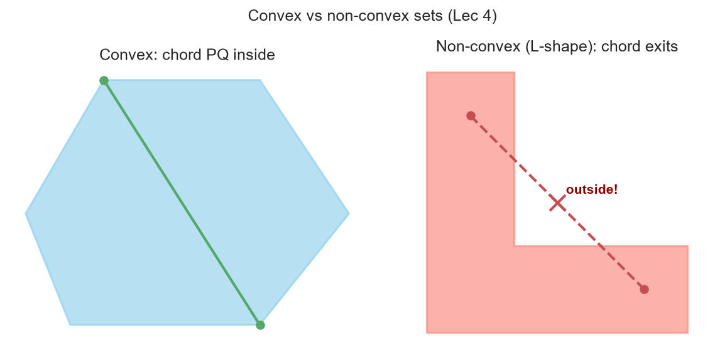

### 4.1 Core definitions

1. Convex set: $S \subseteq R^n$ is convex if $\forall X,Y \in S$, $\lambda X + (1-\lambda)Y \in S$ for $0 \leq \lambda \leq 1$ (segment joining any two points lies wholly in $S$).
2. Convex linear combination: $X = \sum_{i=1}^m \lambda_i X_i$ with $\lambda_i \geq 0$, $\sum \lambda_i = 1$.
3. Convex hull $[S]$: intersection of all convex sets containing $S$; smallest convex set containing $S$. If $S$ convex, $[S]=S$.
4. Extreme point (vertex): $X \in S$ that cannot be written as $(1-\lambda)X_1+\lambda X_2$ for distinct $X_1,X_2 \in S$, $0<\lambda<1$. Boundary point but not all boundary points are vertices (e.g. every point of a circle's circumference is boundary, none is a vertex). Non-vertex points are internal points.
5. Convex polyhedron: set of all convex combinations of finitely many points $X_1,\dots,X_m$.
6. Hyperplane: $\{X : C^T X = \alpha\}$, $C \neq 0$ row vector, $\alpha$ real. Closed half-spaces $C^T X \leq \alpha$ / $\geq \alpha$; open with strict inequalities. A hyperplane splits space into two half-spaces.
7. Polytope: intersection of finitely many closed half-spaces. Generating hyperplanes = those producing the half-spaces.
8. Cone: polytope whose generating hyperplanes meet in exactly one point (that point is the vertex). Edge: a line in the polytope that is the sole intersection of the generating hyperplanes containing it.

### 4.2 Theorems (as stated in lecture)

- T1: $S$ convex iff every convex linear combination of points of $S$ lies in $S$ (necessary and sufficient).
- T2: Intersection of two (hence finitely many) convex sets is convex. Union need not be (two overlapping discs counterexample). Proof sketch: take $X_1,X_2$ in intersection; their combination lies in each set, hence in intersection.
- T3: Convex hull of $S$ = set of all convex linear combinations of points of $S$.
- T4: If $S$ closed and bounded, $[S]$ is closed and bounded.
- T5 (Caratheodory-type): Every point of $[S]$, $S \subseteq R^n$, is a combination of at most $n+1$ points of $S$ (e.g. in $R^2$ at most 3: quadrilateral hull vs triangle).
- T6: Internal points ($S$ minus vertices) form a convex set.
- T7/T8: Convex polyhedron is convex; its vertices are a subset of its spanning points (interior spanning point e.g. $D$ inside triangle $ABC$ is not a vertex).
- T9 + Corollary: $X_v$ of a polytope is a vertex iff it is the unique point of the intersection of all generating hyperplanes containing it. Hence a polytope has finitely many vertices.
- T10: Nonempty closed convex set bounded from below/above has at least one vertex.
- T11: Nonempty closed bounded convex $S$: (i) has a vertex; (ii) every point is a convex combination of its vertices.
- T12 (key for OR): If an LPP optimum exists, it lies on a vertex or an edge of the feasible region. (Lecture illustrates unique case max $3x_1+5x_2$ and multiple case max $2.5x_1+x_2$ with edge $5x_1+2x_2=10$ between $(1,2.5),(2,0)$, every point $(t,(10-5t)/2)$ giving $z=5$.)
- T13: Feasible domain of an LPP (if nonempty) is always convex. (NLPP feasible sets may or may not be convex; annulus $1 < x_1^2+x_2^2 < 4$ style example is non-convex; a disc is convex.)
- Theorem coverage check: T1, T2, T3, T4, T5, T6, T7, T8, T9 plus Corollary, T10, T11, T12, T13 are all present above. Union-convexity question from lecture: union of two convex sets is convex only in special cases [e.g. one contains the other or they overlap so every cross-segment stays inside]; in general it need not be convex.

### 4.3 Standard convexity proofs used in class

- $S_1 = \{X:|X| \leq 1\}$ convex: $|\lambda X_1+(1-\lambda)X_2| \leq \lambda|X_1|+(1-\lambda)|X_2| \leq 1$.
- $S_2 = \{X:|X| = 1\}$ not convex: strict triangle inequality for distinct $X_1,X_2$ gives norm $<1$, so midpoint leaves the set.
- LPP feasible set $\{X:AX \leq b, X \geq 0\}$ convex (see Lec-12 proof in Sec. 12).
- Line segment $AB$ is convex: any $C = \lambda A + (1-\lambda)B$, $0 \leq \lambda \leq 1$, lies on it. Unbounded LPP feasible domain is still convex; e.g. exterior of a circle [NLPP unbounded] need not be convex.

### 4.4 Lec-4 convexity exercises [statements from transcript, answers sketched]

1. $S = \{(x,y):3x^2+2y^2 \leq 6\}$ — ellipse interior, convex.
2. $S = \{(x,y):6x+2y = 5\}$ — straight line, convex.
3. $S = \{(x_1,x_2,x_3):x_1+2x_2 \leq 5;\, x_1-x_2+x_3 \geq 6;\, x_1 \geq 2;\, x_2 \geq 0,\, x_3 \geq 0\}$ — intersection of half-spaces, convex [polytope type].
4. $S = \{(x_1,x_2):x_2 \leq -\lvert x_1\rvert\}$ — downward V region, convex.
5. $S = \{(x_1,x_2):x_1^2+x_2^2 \leq 4,\, (10,10)\}$ — disc plus isolated far point, not convex [segment from disc to $(10,10)$ leaves set].

---

## 5. Simplex method (Lec 5)

*What/why: the general n-variable solver — convert to standard form, start at a vertex BFS, then pivot to better vertices until deviations say stop.*

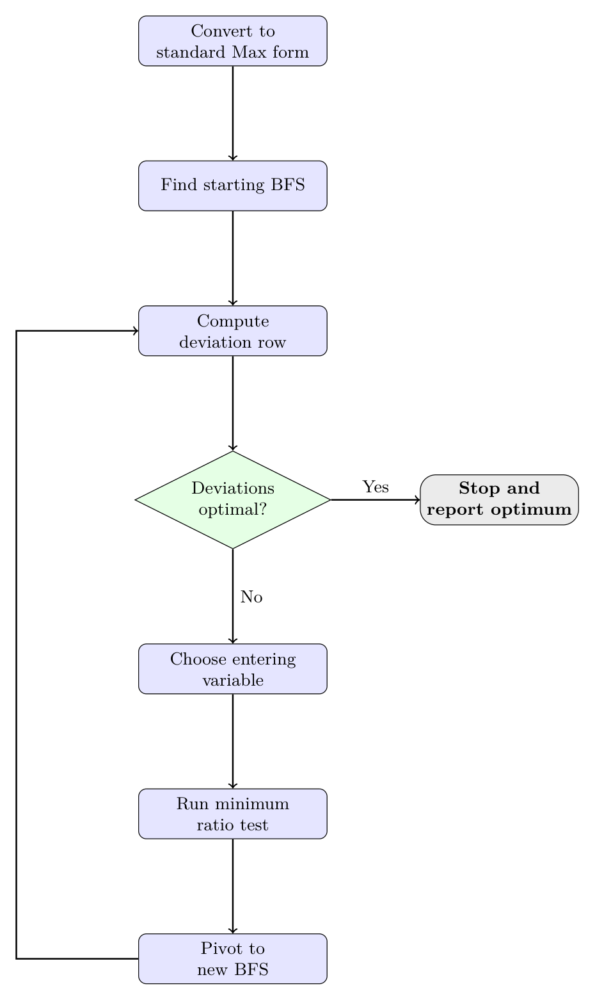

- Slide-image reference for the initial simplex tableau layout:
- The slide below shows basis column, top c row, constraint block, RHS, and deviation row.

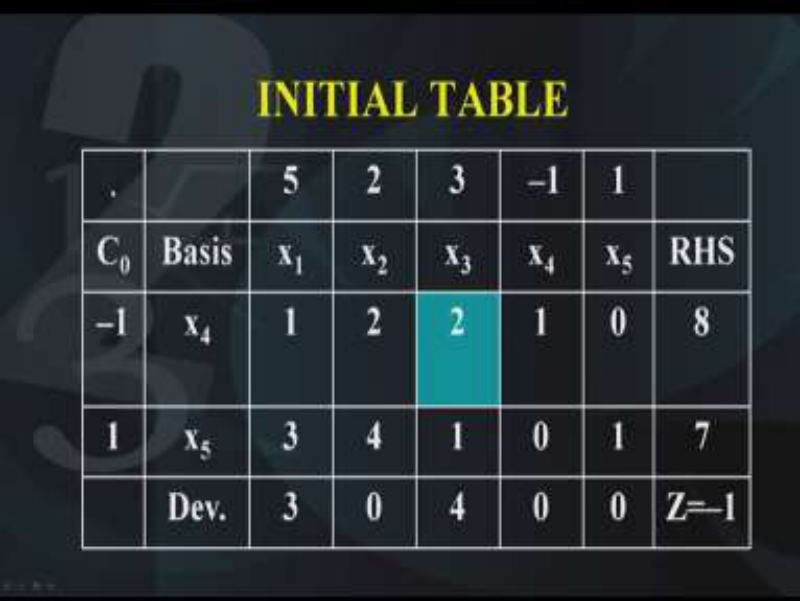

### 5.1 Standard form

- Max $z = \sum c_j x_j$ s.t. $\sum_j a_{ij}x_j = b_i$, $x_j \geq 0$, with $b_i \geq 0$. Differences from general form: (1) Max only (Min $\to$ Max by negating), (2) all equalities, (3) all $b_i \geq 0$.

### 5.2 Conversion rules

1. $\leq$ constraint: add slack variable ($x_1 \leq 10 \to x_1+x_2=10$, $x_2 \geq 0$).
2. $\geq$ constraint: subtract surplus variable ($x_1 \geq 57 \to x_1-x_2=57$, $x_2 \geq 0$).
3. Unrestricted $x_1$: substitute $x_1 = x_2 - x_3$ with $x_2,x_3 \geq 0$ everywhere.
4. Negative RHS: multiply whole constraint by $-1$.
- Example: Max $4x_1+2x_2$ s.t. $7x_1-3x_2 \leq 15 \to +x_3$; $3x_1+4x_2 \geq 20 \to -x_4$; $5x_1-4x_2=-60 \to -5x_1+4x_2=60$.

### 5.3 Canonical system, BFS vocabulary

- Elementary row ops: (i) multiply row by nonzero scalar, (ii) add/subtract rows, (iii) swap rows.
- By row ops any system can be brought to canonical form where some variables appear as $(1,0,\dots)$ columns.
- Basic variable: unit coefficient in its own equation, 0 elsewhere. Non-basic: others. Basic solution: set non-basics $=0$, solve basics (= RHS). Basic feasible solution (BFS): basic solution with all basics $\geq 0$ (needs $b_i \geq 0$). Geometrically each BFS is a vertex (intersection of constraints).
- Pivot operation: row ops making a chosen non-basic column into a unit column (i.e. bringing it into basis).

### 5.4 Simplex tableau algorithm (max problem)

1. Start from a canonical system with a BFS; tabulate: basis column, $c_B$, all $a$-columns, RHS; top row $c_j$.
2. Deviation row: $\bar{c}_j = c_j - c_B^T P_j$ (for basic $j$ this is automatically 0). Current $z = c_B^T b$. Stop if all $\bar{c}_j \leq 0$ (optimal).
3. Entering variable: largest positive $\bar{c}_j$ (tie: smallest subscript).
4. Leaving variable: minimum-ratio test $\min\{b_i/p_{ik} : p_{ik} > 0\}$ on pivot column $k$ only (ignore $\leq 0$ entries). Row giving min leaves.
5. Pivot: row ops to make pivot column a unit vector; update $c_B$; repeat from step 2. Each iteration moves to an adjacent BFS with improved (non-worse) $z$.

### 5.5 Fully worked simplex example (condensed from lecture)

- Given: Max $z = 5x_1+2x_2+3x_3-x_4+x_5$ s.t. $x_1+2x_2+2x_3+x_4 = 8$, $3x_1+4x_2+x_3+x_5 = 7$.
- Steps: start BFS $x_4=8,x_5=7$, $z=-1$; Iter 1 enter $x_3$ leave $x_4$ giving $z=15$; Iter 2 enter $x_1$ leave $x_5$ giving $z=81/5$ with all deviations non-positive.
- Answer: Optimum: $x_1=6/5, x_3=17/5$, others 0, $z^\*=81/5$.
- Pre-example used in lecture: system $S_1$: $x_1-2x_2+x_3-4x_4+2x_5=2$, $x_1-x_2-x_3-3x_4-x_5=4$. Steps: $R_2 \leftarrow R_2-R_1$ gives $S_2$; $R_1 \leftarrow R_1+2R_2$ gives canonical $S_3$: $x_1-3x_3-2x_4-4x_5=6$, $x_2-2x_3+x_4-3x_5=2$. Answer: basic solution $x_1=6,x_2=2$, rest 0; $x_1,x_2$ are basic, rest non-basic; pivot operation converts any chosen variable into basic form.

### 5.6 Lec-5 exercises [statements from transcript]

1. Convert to standard form: Given Min $x_1-3x_2+3x_3$ s.t. $3x_1-x_2+2x_3 \leq 7$, $2x_1+4x_2 \geq -12$, $-4x_1+3x_2+8x_3 \leq 10$, $x_1,x_2 \geq 0$, $x_3$ unrestricted. Steps: negate objective to Max; multiply second constraint by $-1$ for positive RHS; add slack to rows 1 and 3; subtract surplus in row 2; replace $x_3 = x_4-x_5$, $x_4,x_5 \geq 0$. Answer: Max form with equalities and RHS non-negative as above.
2. Solve by simplex: Given Max $x_1+x_2+x_3$ s.t. $3x_1+2x_2+x_3 \leq 3$, $2x_1+x_2+2x_3 \leq 2$, $x \geq 0$. Steps: add slacks $x_4,x_5$ for initial BFS; iterate entering largest positive deviation and minimum-ratio leaving; stop when deviations non-positive. Answer: run procedure to optimum [lecture hint: two slacks give starting BFS].

---

## 6. Big-M method (Lec 6)

*What/why: use when surplus or equality rows leave you with no starting BFS — add artificials with a big penalty so they are forced out.*

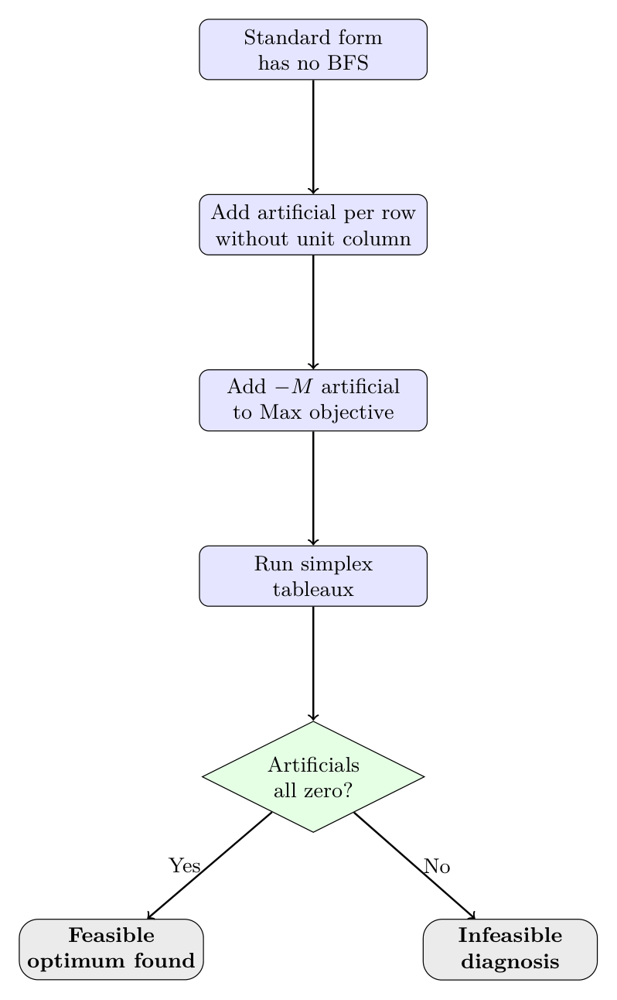

### 6.1 When and how

- Needed when a $\geq$ or $=$ constraint leaves an equation with no unit (basic) column after adding slack/surplus.
- Add one artificial variable per such equation; penalize it in a Max objective by $-M$ ($M \to +\infty$), so the optimizer drives it to 0. Initial BFS = slacks + artificials.
- Same tableau steps as simplex; success = all artificials leave basis (become 0). If an artificial stays positive at optimum, problem is infeasible (see Sec. 9).

### 6.2 Fully worked Big-M example (running example of Lec 6/7/11)

- Given: Min $z = -3x_1+x_2+x_3$ s.t. $x_1-2x_2+x_3 \leq 11$, $-4x_1+x_2+2x_3 \geq 3$, $2x_1-x_3 = -1$, $x \geq 0$.
- Standard (Max): Max $3x_1-x_2-x_3$ s.t. $x_1-2x_2+x_3+x_4 = 11$; $-4x_1+x_2+2x_3-x_5 = 3$; $-2x_1+x_3 = 1$. Add artificials $x_6$ (eq.2), $x_7$ (eq.3). Max $3x_1-x_2-x_3-Mx_6-Mx_7$. BFS: $x_4=11,x_6=3,x_7=1$.
- T1 deviations: $(3-6M,\, M-1,\, 3M-1,\, 0,\, -M,\, 0,\, 0)$; enter $x_3$; ratios $11/1, 3/2, 1/1 \to$ leave $x_7$.
- T2 (basis $x_4,x_6,x_3$): deviations $(1,\, M-1,\, 0,\, 0,\, -M,\, 0,\, 1-3M)$; enter $x_2$; pivot column $(-2,1,0)$, only positive ratio $1/1 \to$ leave $x_6$.
- T3 (basis $x_4,x_2,x_3 = 12,1,1$): deviations $(1,\,0,\,0,\,0,\,-1,\,1-M,\,-1-M)$; enter $x_1$; only positive pivot entry $3 \to$ leave $x_4$.
- T4: basis $x_1=4,x_2=1,x_3=9$, all deviations $\leq 0$. Optimum of Max is $z=3(4)-1-9=2$, i.e. Min value $-2$. Artificials $x_6=x_7=0$, out of basis — feasible.
- Slide-image reference for the Big-M initial tableau:
- The slide below shows basis x4 x6 x7, top costs with minus M, and first deviation row.

### 6.3 Lec-6 exercises [statements from transcript]

1. Given Min $x_1+2x_2+x_3$ s.t. $2x_1+x_2+x_3 \leq 2$, $3x_1+4x_2+2x_3 \geq 16$, $x \geq 0$. Steps: convert to Max; add slack in row 1; subtract surplus plus artificial in row 2; penalise artificial by $-M$; run simplex. Answer: student drill [same structure as running example].
2. Thought question: during simplex or Big-M tables, how do you recognise unique vs multiple vs infeasible vs unbounded? Answer: use the special-case fingerprints in Key takeaways [non-basic zero deviation means multiple; ratio test fails means unbounded; artificial positive at stop means infeasible; else unique].

---

## 7. Two-phase method (Lec 7)

*What/why: same no-BFS fix as Big-M but cheaper for large problems — first drive artificials to zero, then drop them and optimise the real objective.*

### 7.1 Idea and steps

- Alternative to Big-M for the same no-BFS situation.
- Phase 1: set aside original $z$; Min $W = \sum$ artificials (i.e. Max $-W$); solve by simplex. If min $W > 0$ (artificial still in basis at end), problem infeasible — stop. If $W=0$, drop artificial columns and go to Phase 2.
- Phase 2: restore original objective with the Phase-1 end BFS; run ordinary simplex to optimum.
- Same running example: Phase-1 objective Max $-x_6-x_7$ from BFS $(x_4=11,x_6=3,x_7=1)$. T1 deviations $(-6,1,3,0,-1,0,0)$: enter $x_3$, leave $x_7$. T2 (basis $x_4,x_6,x_3$): enter $x_2$, leave $x_6$. T3: $(x_4=12,x_2=1,x_3=1)$, $W=0$ — Phase 1 done. Drop $x_6,x_7$. Phase-2 T1 deviations $(1,0,0,0,-1)$: enter $x_1$, leave $x_4$. Phase-2 T2: basis $(x_1=4,x_2=1,x_3=9)$, all deviations $\leq 0$ — same optimum as Big-M.

### 7.2 Big-M vs Two-phase (Lec 8 summary)

- Similarities: constraint block entries, pivot rows/columns, BFS at each iteration, and final solution are identical.
- Differences: top ($c_j$) row differs (Big-M carries $-M$; Phase 1 uses $0/-1$ temporary costs); hence deviation rows differ.
- Advantage of Two-phase: artificials dropped after Phase 1, so Phase-2 tableaux are smaller — fewer computations, better for large problems and computers.
- Comparison table:

| Item | Big-M | Two-phase |

|---|---|---|

| Objective used | Original plus minus M per artificial | Phase 1 Min sum of artificials, then original |

| Top $c_j$ row | Contains $-M$ | Phase 1 contains $0$ and $-1$ only |

| Deviation row | Contains $M$ terms throughout | Phase 2 has no $M$ terms |

| Tableau size | Keeps artificial columns till end | Drops artificial columns after Phase 1 |

| BFS path and final answer | Same | Same |

### 7.3 Lec-7 exercise [statement from transcript]

- Given the same Min $x_1+2x_2+x_3$ problem as Sec. 6.3. Steps: solve once by Big-M and once by Two-phase side by side; compare constraint blocks, BFS sequence, deviation rows and final solution. Answer: BFS path and optimum match; only top row and deviations differ; Phase-2 tables are smaller.

---

## 8. Multiple (alternate) optima (Lec 8 + Lec 14)

*What/why: learn the parallel-slope warning sign and the zero-deviation tableau signal, then get the whole optimal edge as a convex combination.*

- Slide-image reference for the multiple-solution feasible region with five vertices:
- The graph below shows feasible polygon with vertices A B C D E and optimum edge BC.

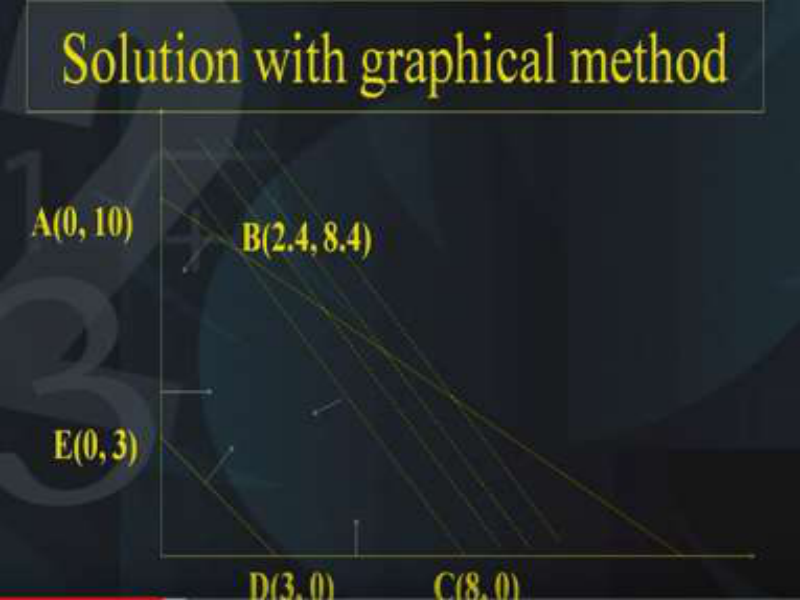
- Slide-image reference for the vertex value table:
- The table below shows objective values 40 at A, 48 at B, 48 at C, 18 at D, 12 at E.

### 8.1 Recognition

- Graphical: objective iso-line parallel to a binding constraint edge; optimum attained on whole edge. Pre-check: compare slopes of $z$ and constraints.
- Tableau: at optimum (all $\bar{c}_j \leq 0$), some non-basic variable has $\bar{c}_j = 0$. To get the second corner, bring that variable in (one more pivot); all convex combinations of the two corners are also optimal (infinitely many).

### 8.2 Worked example (Lec 8, condensed)

- Given: Max $6x_1+4x_2$ s.t. $2x_1+3x_2 \leq 30$, $3x_1+2x_2 \leq 24$, $x_1+x_2 \geq 3$, $x \geq 0$. Objective slope = slope of 2nd constraint: expect multiples.
- Steps: standard form $+x_3$, $+x_4$, $-x_5$ plus artificial $x_6$; BFS path $O(0,0) \to D(3,0) \to C(8,0)$; at $C$ non-basic $x_2$ deviation $0$; pivot $x_2$ in to reach $B(2.4,8.4)$ with same $z=48$.
- Answer: vertex table $A(0,10)=40$, $B(2.4,8.4)=48$, $C(8,0)=48$, $D(3,0)=18$, $E(0,3)=12$; general solution $P = \lambda B + (1-\lambda)C$, $0 \leq \lambda \leq 1$ [e.g. $P=(2.4\lambda+8(1-\lambda),\, 8.4\lambda)$], infinitely many optima with $z=48$.

### 8.3 Second multiple-solution drill (Lec 14 Big-M)

- Max $2x_1+x_2$ s.t. $2x_1+x_2 \leq 50$, $2x_1+5x_2 \geq 100$ (objective parallel to 1st constraint). Standard $+x_3$, $-x_4$+artificial $x_5$. Optimum table gives $(x_1=75/4,x_2=25/2)$, $z=50$, with non-basic $x_4$ deviation 0. Pivoting $x_4$ in gives second corner $(x_2=50,x_4=150)$. All $\lambda X+(1-\lambda)Y$ optimal.

### 8.4 Lec-8 exercise [statement from transcript]

- Given Max $2x_1+x_2$ s.t. $2x_1+x_2 \leq 50$, $2x_1+5x_2 \leq 100$, $2x_1+3x_2 \leq 90$, $x_1,x_2 \geq 0$. Steps: note objective slope equals first-constraint slope so multiples expected; solve graphically and by simplex; track BFS-to-vertex movement; at final table find non-basic zero deviation; pivot it in for second corner. Answer: multiple optima on the first-constraint edge [lecture leaves arithmetic to student].

---

## 9. Unbounded solution (Lec 9)

*What/why: distinguish an open region from an infinite optimum — the ratio-test failure is the tableau proof.*

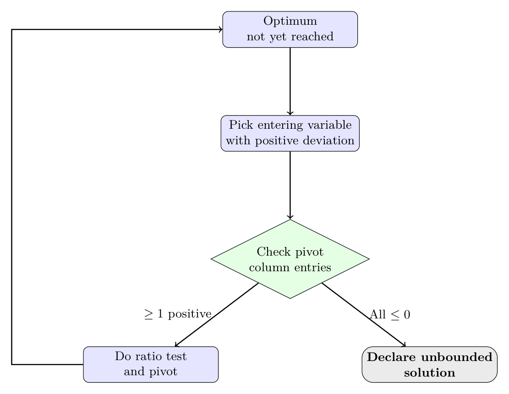

- Slide-image reference for the unbounded graph and corner table:
- The slide below shows open region with vertices A 0 4 and B 5 two thirds and parametrised edge points.

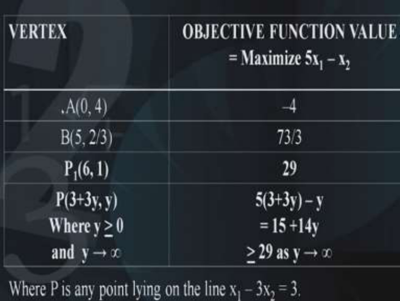
- Slide-image reference for unbounded region with finite value:
- The slide below shows open-upward region with constant value 12 on edge through B 5 halves 3 halves.

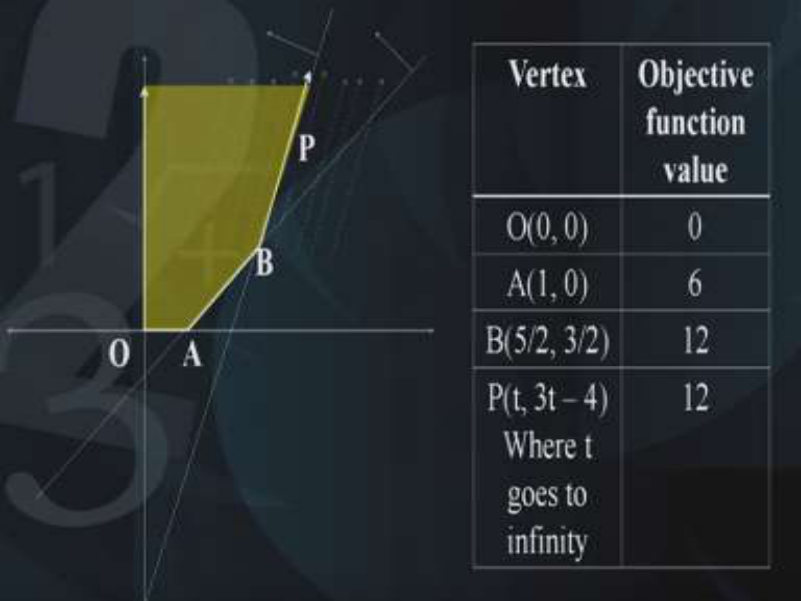

### 9.1 Recognition

- Graphical: feasible region open in the improving direction; iso-lines can be pushed to $\infty$. Corner table: a point $P(t)$ on the open edge gives $z(t) \to \infty$.
- Tableau: for the entering variable (positive $\bar{c}_k$), every pivot-column entry is $\leq 0$ — minimum-ratio test fails (no leaving variable). That is the stopping signal for unboundedness. (Do not confuse with $RHS=0$ cycling case, excluded here.)

### 9.2 Fully worked unbounded example

- Given: Max $5x_1-x_2$ s.t. $2x_1+3x_2 \geq 12$, $x_1-3x_2 \leq 3$. Steps: standard form $2x_1+3x_2-x_3+x_5=12$, $x_1-3x_2+x_4=3$; Phase 1 ends at $A(0,4)$; Phase 2 enter $x_1$ leave $x_4$ to $B(5,2/3)$; next entering $x_3$ has pivot column $(-5/9,-1/3)^T$, all non-positive so ratio test fails.
- Answer: Unbounded. Graph values: $A(0,4)=-4$, $B(5,2/3)=73/3$, $P(6,1)=29$; general edge point $(3+3y,y)$ gives $z = 15+14y \to \infty$ as $y \to \infty$.

### 9.3 Unbounded region but finite value (exam trap)

- Max $6x_1-2x_2$ s.t. $x_1-x_2 \leq 1$, $3x_1-x_2 \leq 6$ (region open upward) has finite optimum $z^\*=12$ on edge through $B(5/2,3/2)$: points $(t,3t-6)$ all give 12. Objective parallel to binding constraint + open region = multiple optima with unbounded region but bounded value. Moral: unbounded region does not imply unbounded solution.
- Corner values: $O(0,0)=0$, $A(1,0)=6$, $B(5/2,3/2)=12$; every $P(t,3t-6)$ gives $12$.

### 9.4 Lec-9 exercise [statement from transcript]

- Given Max $3x_1+2x_2$ s.t. $-2x_1+3x_2 \leq 9$, $x_1-5x_2 \geq -20$, $x_1,x_2 \geq 0$. Steps: multiply second constraint by $-1$ to make RHS positive; add slacks or surplus plus artificial as needed; run simplex or two-phase. Answer: student drill [lecture hint about negative RHS].

---

## 10. Infeasible solution, degeneracy, unrestricted variables, tips (Lec 10)

*What/why: three diagnoses that look confusing in tables — artificials stuck means infeasible, zero RHS means degenerate, free variable means split it.*

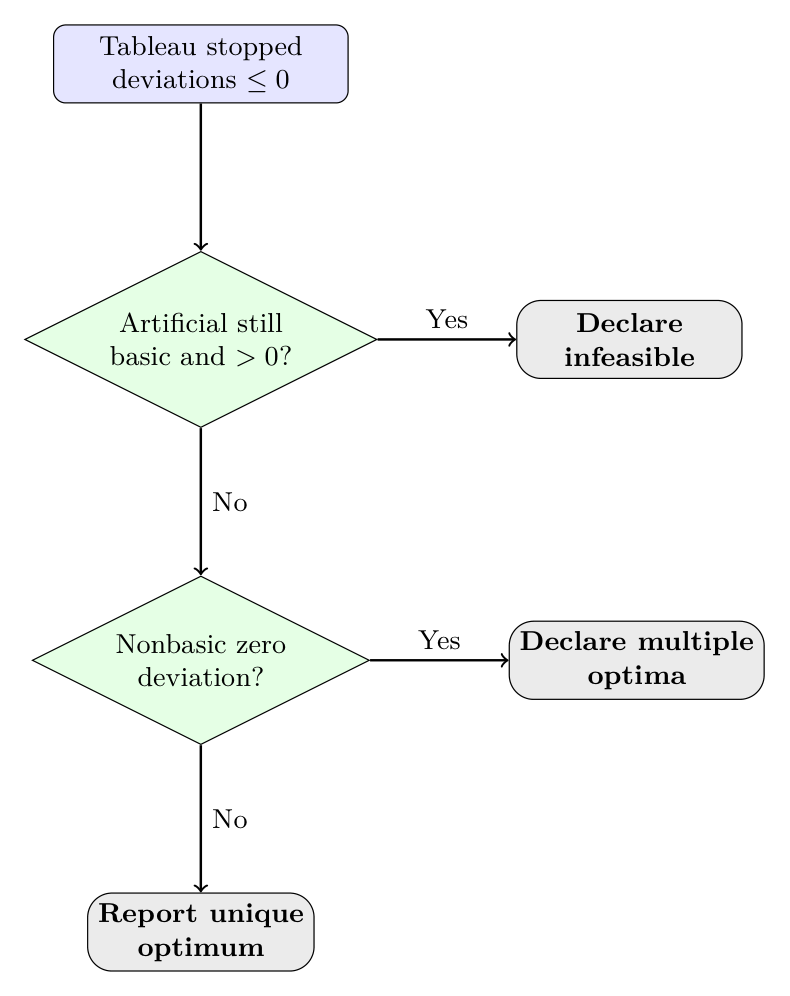

- Slide-image reference for the degeneracy plot with three lines through B:
- The graph below shows constraints x1 plus x2 equals 5, 3x1 plus 8x2 equals 24, 9x1 plus 34x2 equals 90 concurrent at B.

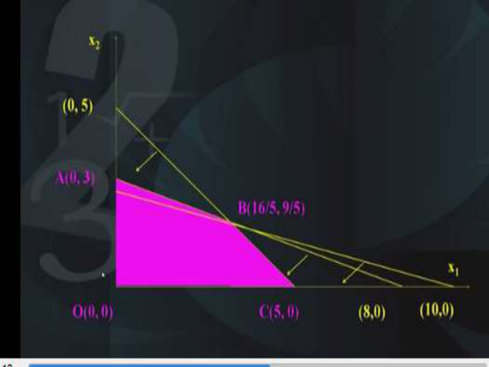

### 10.1 Infeasible — recognition

- Graphical: constraint half-spaces do not overlap (e.g. $x_1+x_2 \leq 5$ vs $\geq 6$).
- Tableau (Two-phase/Big-M): optimum/stopping reached but an artificial variable is still in basis with positive value ($>0$).
- Worked example: Max $5x_1-x_2$ s.t. $2x_1+3x_2 \leq 6$, $5x_1+4x_2 \geq 20$. Standard $+x_3$, $-x_4$+artificial $x_5$. Phase 1: enter $x_1$, leave $x_3$; next deviations $(0,-7/2,-5/2,-1,0)$ all $\leq 0$ (stop) but $x_5=5$ still basic. No feasible point. Lec-13 twin: Min $3x_1+2x_2$ s.t. $2x_1+x_2=2$, $3x_1+4x_2 \geq 12$ ends Phase 1 with $a_2=4$ basic — infeasible (graph: line segment $AB$ misses half-space above second line). Exercise: Max $x_1+x_2$ s.t. $x_1+x_2 \leq 1$, $-3x_1+x_2 \geq 3$ — show infeasible.

### 10.2 Degeneracy

- Graphical: three or more constraints pass through one vertex (example Max $5x_1+3x_2$ with $x_1+x_2 \leq 5$, $3x_1+8x_2 \leq 24$, $9x_1+34x_2 \leq 90$ concurrent at $B$).
- Tableau: a 0 appears on the RHS. (Can cause cycling/ties; tie-breaking below.)

### 10.3 Unrestricted variables

- If $x$ free in sign, put $x = x' - x''$ with $x',x'' \geq 0$ in objective and every constraint (adds one variable). If non-negativity $x,y \geq 0$ is explicitly given, use it directly.

### 10.4 Practical tips (from lecture)

1. Tie in deviation row (two equal largest $\bar{c}$): enter smallest subscript (fewer iterations).
2. Tie in ratio test: choose arbitrarily (solution same, iteration count may differ).
3. LPPs can solve equation systems: add artificials, run Phase 1; if they vanish, system consistent (example $2x+3y=8$, $3x-y=1$).

### 10.5 Lec-10 self-quiz (answers)

1. Feasible domain may be unbounded — True. 2. Feasible region always convex — True. 3. Slack added for $\leq$ — slack variables. 4. Big-M optimum never unique — False. 5. Two-phase used when BFS — not readily available. 6. Non-basic zero deviation means unbounded — False (it means multiple). 7. Optimum in interior — False (vertex/edge). 8. Ratio test fails — unbounded solution. 9. Make any variable basic by — elementary row operations. 10. Convex combination of optima is optimal — True.

---

## 11. Revised simplex (Lec 11)

*What/why: a memory-light simplex that tracks only the basis inverse and multipliers — same pivots, less work, plus dual-ready numbers.*

- Slide-image reference for the basis-inverse observation:
- The slide below shows the pink initial basis matrix and blue final matrix whose product is identity.

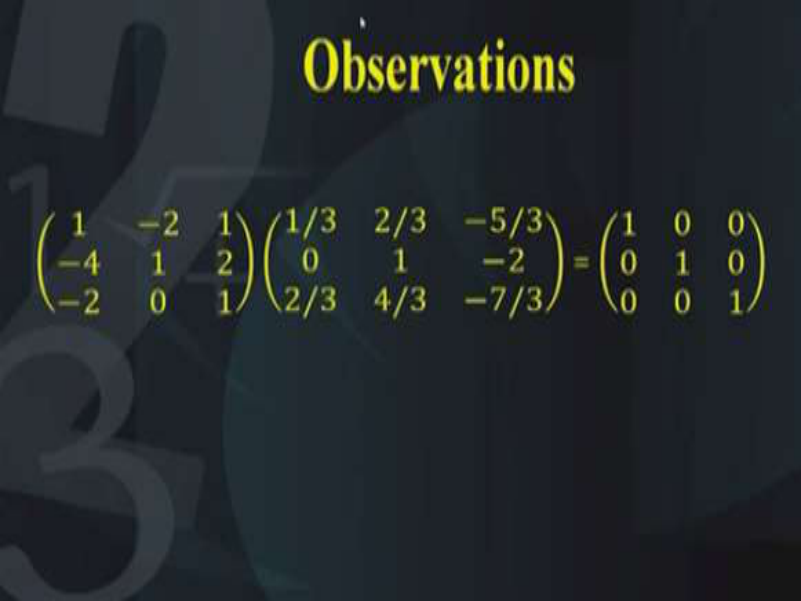

### 11.1 Idea

- Full tableau recomputes many columns; only $B^{-1}$, RHS, and entering column are needed. Keep basis inverse explicitly: $\bar{b} = B^{-1}b$, $\bar{P}_k = B^{-1}P_k$, deviations $\bar{c}_j = c_j - \pi P_j$ with simplex multipliers $\pi = c_B B^{-1}$. Less memory/computation; $\pi$ later solves the dual and drives sensitivity analysis.
- Key observation on running example: the $3\times3$ block of basis columns at start vs end are inverses (product = $I$).

### 11.2 Condensed run (same Lec-6 problem, Big-M form)

- $P_1=(1,-4,-2)^T, P_2=(-2,1,0)^T, P_3=(1,2,1)^T, P_4=(1,0,0)^T, P_5=(0,-1,0)^T, P_6=(0,1,0)^T, P_7=(0,0,1)^T$, $b=(11,3,1)^T$. Start $B=[P_4,P_6,P_7]=I$, $B^{-1}=I$, $c_B=(0,-M,-M)$, $\pi=(0,-M,-M)$.
- Iter 1: $\bar{c}_1=3-6M, \bar{c}_2=M-1, \bar{c}_3=3M-1, \bar{c}_5=-M$; enter $x_3$, $\bar{P}_3=(1,2,1)^T$, ratios $11,3/2,1 \to$ leave $x_7$. New $B^{-1}=[[1,0,0],[0,1,0],[-1,-2,1]]$.
- Iter 2: $c_B=(0,-M,-1)$, $\pi=(0,-M,2M-1)$; non-basic $\bar{c}_1=1,\bar{c}_2=M-1$; enter $x_2$, $\bar{P}_2=(-2,1,0)^T \to$ leave $x_6$. Artificial $x_7$ already out so $\bar{c}_7$ is no longer computed.
- Iter 3: $c_B=(0,-1,-1)$, $\pi=(0,-1,1)$; enter $x_1$, $\bar{P}_1=(3,0,-2)^T \to$ leave $x_4$.
- Iter 4: basis $(x_1,x_2,x_3)=(4,1,9)$, $B^{-1}=[[1/3,0,2/3],[2/3,1,4/3],[-5/3,-2,-7/3]]$, $\pi=(1/3,-1/3,2/3)$, all $\bar{c} \leq 0$. Optimal. Record $\pi$ each iteration.
- Iteration summary table:

| Iter | $c_B$ | Basis | $B^{-1}$ | RHS $\bar{b}$ | $\pi = c_B B^{-1}$ |

|---|---|---|---|---|---|

| 1 | $(0,-M,-M)$ | $x_4,x_6,x_7$ | $I$ | $(11,3,1)$ | $(0,-M,-M)$ |

| 2 | $(0,-M,-1)$ | $x_4,x_6,x_3$ | row3 $[-1,-2,1]$ | $(10,1,1)$ | $(0,-M,2M-1)$ |

| 3 | $(0,-1,-1)$ | $x_4,x_2,x_3$ | see Sec. 11.2 | $(12,1,1)$ | $(0,-1,1)$ |

| 4 | $(3,-1,-1)$ | $x_1,x_2,x_3$ | matrix above | $(4,1,9)$ | $(1/3,-1/3,2/3)$ |

- Advantages: needs only $\bar{b}$, $\bar{P}_k$ and $\pi$ instead of full tableau [less memory and computation]; $\pi$ at each iteration is recorded; final $\pi$ solves the dual and is used in sensitivity analysis [duality and sensitivity come in later modules].

### 11.3 Lec-11 exercise [statement from transcript]

- Given Min $x_1+2x_2+x_3$ s.t. $2x_1+x_2+x_3 \leq 2$, $3x_1+4x_2+2x_3 \geq 16$, $x \geq 0$. Steps: add slack in row 1; subtract surplus plus artificial in row 2; run revised simplex tracking $B^{-1}$, $\bar{b}$, $\bar{P}_k$, $\bar{c}_j$ and $\pi$ each iteration. Answer: student drill [lecture hint as above].

---

## 12. Case studies and drill solutions (Lec 12-14, condensed)

*What/why: exam-style drills that reuse every method — transport and diet formulation, convexity proofs, quadrant flips, and infeasibility certificates.*

- Slide-image reference for the wheat transportation cost table:
- The table below shows Phillor Hoshiarpur Nakodar supplies 7 9 2 and Delhi Mumbai Chennai Calcutta demands.

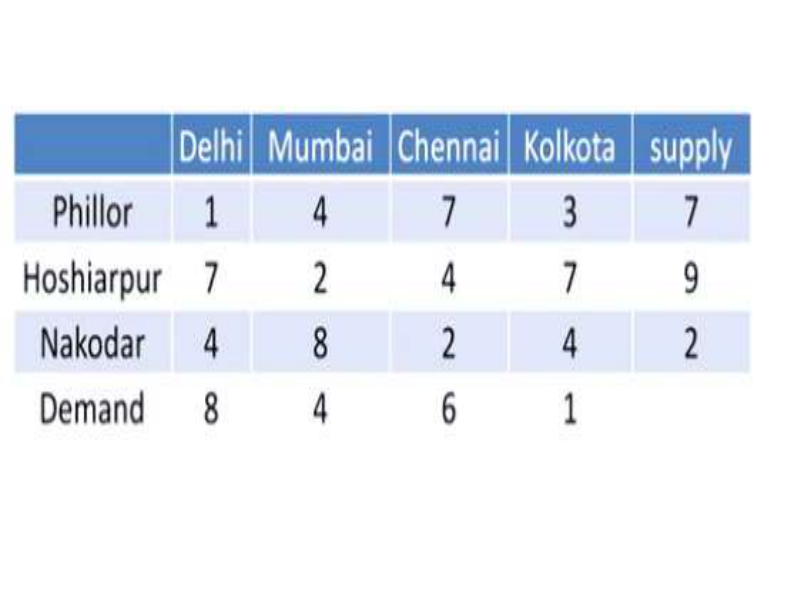
- Slide-image reference for the dog-feed graphical solution:
- The graph below shows constraints 4x1 plus 5x2 equals 16, 2x1 plus x2 equals 4, x2 equals 2x1, with corners A B C.

### 12.1 Transportation LP — wheat (Lec 12)

- $x_{ij}$ = quintals from $\{Phillor, Hoshiarpur, Nakodar\}$ to $\{Delhi, Mumbai, Chennai, Calcutta\}$. Min $\sum c_{ij}x_{ij}$ (e.g. $x_{11}+4x_{12}+7x_{13}+3x_{14}+7x_{21}+2x_{22}+\dots$ from cost table) s.t. supply rows $\leq$ (or $=$) availability $(7,9,2)$, demand columns $\geq$ requirements $(7/8,4,6,1$ per slide/table$)$, $x_{ij} \geq 0$. 12 variables.

### 12.2 Diet LP with graphical solve — dog feed (Lec 12)

- $x_1,x_2$ = kg of A,B. Min $10x_1+20x_2$ s.t. $2000x_1+2500x_2 \geq 8000$ (i.e. $4x_1+5x_2 \geq 16$), $350x_1+175x_2 \geq 700$ (i.e. $2x_1+x_2 \geq 4$), toxic $x_1 \leq (x_1+x_2)/3$ (i.e. $x_2 \geq 2x_1$), $x \geq 0$.
- Given $\to$ Steps $\to$ Answer: Given calorie, vitamin and toxic data above; Steps: plot $4x_1+5x_2=16$ through $(0,16/5),(4,0)$, $2x_1+x_2=4$ through $(0,4),(2,0)$, $x_2=2x_1$ through $(1,2),(2,4)$; origin fails the first two so feasible side is above; corners $A(0,4), B(2/3,8/3), C(8/7,16/7)$; costs $80, 60, 400/7 \approx 57.14$. Answer: Optimum $C$: $x_1=8/7, x_2=16/7$ [transcript writes 400/4 in one line, corrected to $400/7$].

### 12.3 Convexity drills

- (a) $X=(-1/2,1/2,7/4)$ as combination of $(-1,0,2),(0,1,2),(0,1,1)$: solve $-\alpha_1=-1/2$, $\alpha_2+\alpha_3=1/2$, $2\alpha_1+2\alpha_2+\alpha_3=7/4 \to \alpha=(1/2,1/4,1/4)$, sum 1, all $\geq 0$. Yes.
- (b) $S=\{X:AX \leq b, X \geq 0\}$ convex: for $X_1,X_2 \in S$, $A(\lambda X_1+(1-\lambda)X_2)=\lambda AX_1+(1-\lambda)AX_2 \leq \lambda b+(1-\lambda)b=b$, and $\geq 0$ preserved. This is exactly LPP feasibility (T13).
- (c) Lec-14 Q14: disjoint $A$ non-convex (L-shape) $+$ $B$ convex can still have $A \cup B$ convex (sketch given in slides); but in general subsets of convex sets need not be convex (False).

### 12.4 Sign-flipped quadrants (Lec 12/13 Ex. 5)

- Min $f=-4x_1+x_2$ s.t. $x_1-2x_2 \leq 2$, $-2x_1+x_2 \leq 2$. With $x_1,x_2 \leq 0$ (third quadrant): corners $(0,0), A(0,-1), B(-2,-2), C(-1,0)$; values $0,-1,6,4$; min at $(0,-1)$, $f=-1$. With $x_1,x_2 \geq 0$: corners $O, P(0,2), Q(2,0)$; values $0,2,-8$; min at $(2,0)$, $f=-8$.

### 12.5 Two-phase feasibility proofs (Lec 13)

- Ex. 6 (infeasible, see Sec. 10.1). Given Min $3x_1+2x_2$ s.t. $2x_1+x_2=2$, $3x_1+4x_2 \geq 12$. Steps: Max $-3x_1-2x_2$; add artificials $a_1,a_2$ plus surplus $x_3$; Phase-1 Max $-a_1-a_2$ deviations $(5,5,-1)$; enter $x_1$ pivot $2$; next deviations $(0,5/2,-1,-5/2,0)$ enter $x_2$; final deviations $(-5,0,-1,-5,0)$ stopped but $a_2=4$ basic. Answer: infeasible, verified graphically by line segment $AB$ through $(0,2),(1,0)$ missing the half-space above second line through $(0,3),(4,0)$.
- Ex. 7: Min $3x_1+2x_2+x_3$ s.t. $x_1+x_2+x_3=4$, $2x_1+5x_2-2x_3=3$. Add $A_1,A_2$; Phase 1 ends with basis $(x_3,x_2)$, $W=0$; Phase 2 gives $(x_1,x_2,x_3)=(11/4,0,5/4)$, $z=19/2$. Steps: Phase-1 deviations $(3,6,-1)$ enter $x_2$ pivot $5$ to basis $(A_1,x_2)$; deviations $(8/5,0,7/5,0,-6/5)$ pivot $7/5$ to basis $(x_3,x_2)$ with deviations $(0,0,0,-1,-1)$; drop $A_1,A_2$; Phase-2 deviations $(10/7,0,0)$ enter $x_1$ to final basis $(x_3,x_1)$ with all deviations non-positive.

## 13. Module-1 quiz bank (Lec 10 plus Lec 14 answers)

1. Feasible domain may be unbounded — True (bounded and unbounded examples exist).
2. Feasible region always convex — True (T13).
3. Feasible domain cannot be a single point — False (a point is possible).
4. All subsets of convex sets are convex — False (non-convex subset inside convex set).
5. Optimum cannot be at more than one vertex — False (multiple-optima edge has two vertices optimal).
6. Artificials added to turn $\geq$ into equality — False (surplus subtracted for that; artificials supply the BFS).
7. Big-M solution never unique — False (uniqueness depends on problem, not method).
8. Two-phase used when BFS — not readily available.
9. Non-basic zero deviation at optimum — multiple solutions.
10. Optimum lies on a vertex or an edge.
11. Ratio test fails — unbounded solution.
12. Standard-form RHS — $\geq 0$.
13. Make any variable basic by — elementary row operations.
14. See Sec. 12.3(c). 15. Convex combination of $X_1,X_2,X_3$: $aX_1+bX_2+cX_3$, $a,b,c \geq 0$, $a+b+c=1$.

---

## Key exam takeaways

- Identify type before solving: compare objective slope with constraint slopes — parallel binding constraint signals multiple optima; contradictory half-spaces ($\leq$ small vs $\geq$ large) signal infeasibility; open improving direction signals possible unboundedness.
- Standard form checklist: Max only; $=$ only (slack $+$ for $\leq$, surplus $-$ for $\geq$); RHS $\geq 0$ (multiply by $-1$ if needed); free variable $= $ difference of two $\geq 0$; one artificial per $\geq$/$=$ row lacking a unit column.
- Tableau reading checklist: (1) deviation $\bar{c}_j = c_j - c_B^T P_j$, basics give 0; (2) all $\bar{c} \leq 0$ = optimal — stop; (3) positive $\bar{c}$ = enter largest (tie: smallest index); (4) ratios $b_i/p_{ik}$ over $p_{ik}>0$ only — min leaves (tie: arbitrary); (5) pivot to unit column, update $c_B$, recompute.
- Special-case fingerprints: non-basic $\bar{c}=0$ at optimum = multiple (pivot once more for 2nd corner; answer = segment); pivot column all $\leq 0$ = unbounded; stop with artificial $>0$ in basis = infeasible; RHS $0$ = degenerate (concurrent constraints).
- Big-M vs Two-phase traps: final BFS identical; never leave artificials in Phase-2 tables; Min problems must be negated to Max first; infeasibility is about artificials, not about $z$ value; unbounded region $\neq$ unbounded value (check edge parametrize e.g. $(t,3t-6)$).
- Theory one-liners: LPP feasible set convex; optimum (if any) at vertex/edge; convex hull = all convex combinations; at most $n+1$ points needed in $R^n$; intersection of convex is convex, union need not be; revised simplex $\pi = c_B B^{-1}$ is the dual solution preview.
