# Module 2: Duality and Sensitivity (Lectures 15-23)

- Symmetric primal-dual form and construction rules (Lec 15)
- Asymmetric cases: equality constraints and unrestricted variables (Lec 16)
- Weak duality theorem, proof, and corollaries (Lec 16)
- Optimality criterion, strong (main) duality, complementary slackness (Lec 17)
- Simplex multipliers and reading the dual optimum from the primal tableau (Lec 18)
- Dual simplex method: when it applies and full algorithm with worked example (Lec 19)
- Sensitivity analysis I: changes in $c_j$ and $b_i$, shadow prices, ranges (Lec 20)
- Sensitivity analysis II: changes in $a_{ij}$, new/deleted variables and constraints (Lec 21)
- Case studies, quiz problems, and exam traps (Lec 22-23)
- Key exam takeaways

## 1. Primal-Dual Construction (Lec 15)

What this section is: how to write the dual LP from a given primal LP.
Why it matters: the dual gives optimality certificates, economic price interpretations, and the foundation for sensitivity analysis and dual simplex.

### 1.1 Symmetric form

An LP pair is in **symmetric form** if in both primal and dual all variables are $\geq 0$ and all constraints are inequalities (no equalities, no unrestricted variables). Convention:

- Maximization primal goes with $\leq$ constraints.
- Minimization primal (or dual) goes with $\geq$ constraints.

Vector notation (symmetric pair):

- Primal (max): $\max f(X) = C^T X$ subject to $AX \leq B$, $X \geq 0$.
- Dual (min): $\min \phi(Y) = B^T Y$ subject to $A^T Y \geq C$, $Y \geq 0$.

Equivalently the labels can be swapped: a minimization problem with $\geq$ constraints may be called the primal and its maximization counterpart the dual. Only the max/$\leq$ and min/$\geq$ pairing matters.

### 1.2 Observations connecting primal and dual

For the symmetric example in the lecture ($\max 7x_1+2x_2-3x_3+4x_4$ subject to two $\leq$ constraints, $x \geq 0$; dual $\min 25y_1+15y_2$ subject to four $\geq$ constraints, $y \geq 0$):

1. Max becomes min (optimization direction reverses).
2. Primal objective coefficients become dual right-hand sides.
3. Primal right-hand sides become dual objective coefficients.
4. Constraint matrix is transposed: each primal column becomes a dual row.
5. Inequality directions reverse ($\leq$ becomes $\geq$ and vice versa).
6. Number of dual constraints = number of primal variables; number of dual variables = number of primal constraints.
7. Dual of the dual is the primal.

Second worked symmetric example in Lec 15 (min orientation):

- Given: a minimization primal with $\geq$ constraints.
- Steps: apply the same six rules with directions swapped.
- Answer: a maximization dual with $\leq$ constraints, transposed matrix, swapped cost and RHS vectors.

### 1.3 Six construction rules (symmetric case)

1. Define one non-negative dual variable for each primal constraint.
2. Make the primal cost vector the dual right-hand-side vector.
3. Make the primal right-hand-side vector the dual cost vector.
4. Transpose the primal coefficient matrix $A$ to get the dual matrix $A^T$.
5. Reverse all inequality directions.
6. Reverse the optimization direction (max $\leftrightarrow$ min).

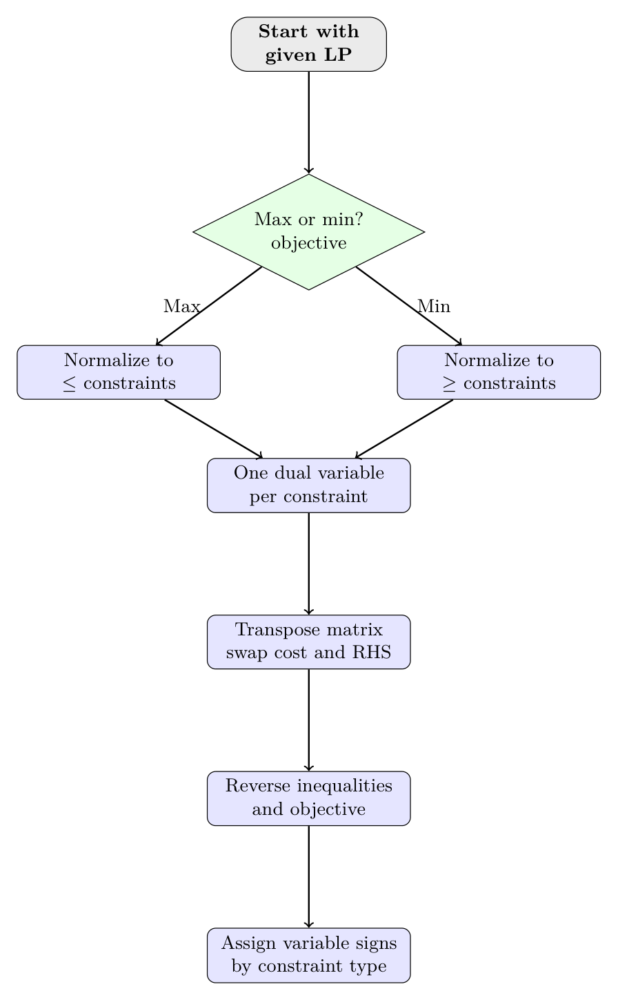

### 1.4 General (asymmetric) conversion table

| Primal (given row) | Dual (corresponding element) |
|---|---|
| $\max$ objective | $\min$ objective |
| $\min$ objective | $\max$ objective |
| Constraint $i$ is $\leq$ (in a max problem) | Dual variable $y_i \geq 0$ |
| Constraint $i$ is $\geq$ (in a max problem) | Dual variable $y_i \leq 0$ |
| Constraint $i$ is $=$ | Dual variable $y_i$ unrestricted in sign |
| Variable $x_j \geq 0$ | Dual constraint $j$ is $\geq$ type (for min dual) |
| Variable $x_j \leq 0$ | Dual constraint $j$ is $\leq$ type (for min dual) |
| Variable $x_j$ unrestricted | Dual constraint $j$ is $=$ |
| RHS $b_i$ | Objective coefficient of $y_i$ |
| Objective coefficient $c_j$ | RHS of dual constraint $j$ |
| Matrix $A$ | Transposed matrix $A^T$ |

Practical procedure for mixed problems: first convert the problem to a consistent symmetric shape (e.g. for a min problem make every constraint $\geq$ by multiplying $\leq$ rows by $-1$; split each $=$ row into one $\leq$ and one $\geq$ row), then apply the six symmetric rules, then simplify (see Lec 16 examples below).

### 1.5 Economic interpretation (Rajan/Parveen transport example)

- Given: ship goods from 2 warehouses (supplies 300, 600) to 3 retail outlets (demands 200, 300, 400) at minimum cost with six variables $x_{ij}$; unit costs 2, 4, 3, 5, 3, 4.
- Steps: write supply rows as $\leq$ and demand rows as $\geq$; multiply supply rows by $-1$ so every constraint is $\geq$; write the dual mechanically (a max problem with 5 variables $y_1,\dots,y_5$ and 6 $\leq$ constraints).
- Answer: dual objective $\max -300y_1-600y_2+200y_3+300y_4+400y_5$ with 6 $\leq$ constraints from $A^T$.

Interpretation: a middleman (Parveen) offers to buy all warehouse stock at prices $y_1,y_2$ per unit and resell required quantities at outlets at prices $y_3,y_4,y_5$. The dual constraints (e.g. $y_3 - y_1 \leq 2$ for the $W_1 \to R_1$ route costing 2) say the middleman's margin on each route cannot exceed the direct shipping cost; otherwise Rajan would ship directly. The dual objective maximizes the middleman's profit subject to remaining competitive. Hence duality has a real pricing/bidding meaning, not just algebraic value.

### 1.6 Lec 15 homework exercise (from transcript)

- Given: $\max 3x_1+4x_2$ subject to $7x_1-2x_2 \geq 4$, $-3x_1+x_2 \leq 3$, $x_1,x_2 \geq 0$.
- Steps: normalize the max problem so all constraints are $\leq$ (multiply the $\geq$ row by $-1$), then apply the six rules.
- Answer task: write the dual and prove the dual of the dual is the primal.

Key slide figures:

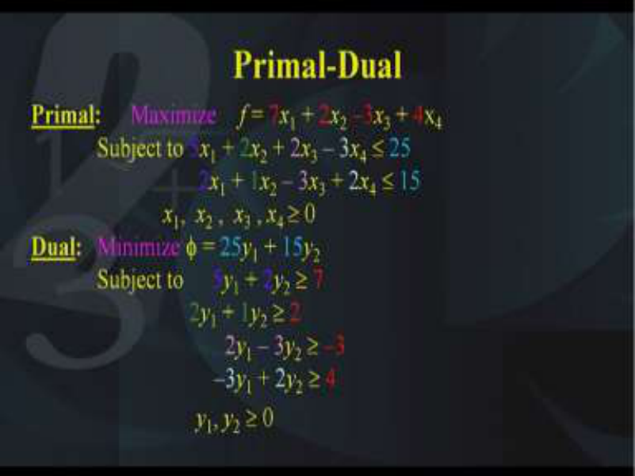
*Color-coded max primal and min dual showing swapped cost and RHS.*

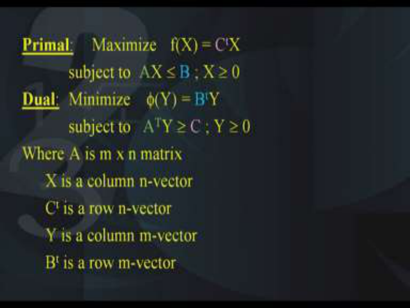
*Vector form max C transpose X with AX LE B and min B transpose Y with AT Y GE C.*

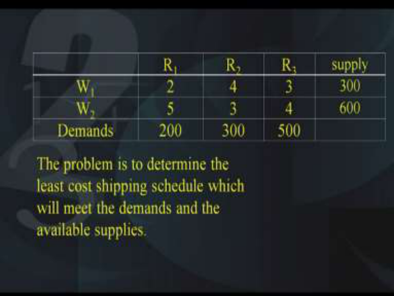
*Supply demand and unit cost table for 2 warehouses and 3 outlets.*

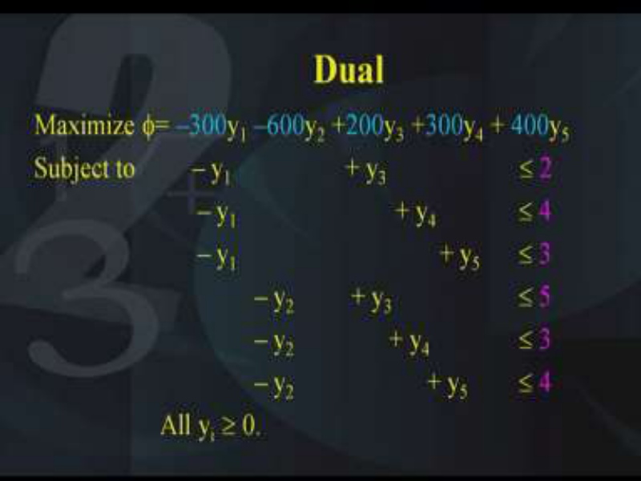
*Five-variable max dual with six LE constraints from the transport primal.*

## 2. Asymmetric Primal-Dual and Weak Duality (Lec 16)

What this section is: conversion shortcuts when equalities or unrestricted variables appear, plus the weak duality bound.
Why it matters: lets you write duals without expanding variables, and gives quick infeasibility and unboundedness tests.

An **asymmetric** pair is one where at least one equality constraint or one unrestricted variable appears. The shortcuts below avoid keeping the expanded 3-variable form.

### 2.1 Equality constraint in primal becomes unrestricted dual variable

- Given: $\min -2x_1-3x_2+4x_3$ subject to $3x_1+6x_2-7x_3 \geq 2$, $2x_1+5x_2+4x_3 = 4$, $x \geq 0$.
- Steps: write $=$ as two inequalities ($\leq$ and $\geq$); flip the $\leq$ one by multiplying by $-1$ so all three rows are $\geq$; write the 3-variable dual mechanically with variables $y_1,y_2,y_3 \geq 0$ and objective $2y_1-4y_2+4y_3$; observe $y_2,y_3$ always appear as $y_2-y_3$ with identical coefficients, so substitute $y^* = y_2 - y_3$.
- Answer: dual collapses to $\max 2y_1+4y^*$ subject to three $\leq$ constraints (lecture writes the $y^*$ coefficient as $-4$ before collecting terms; the simplified net coefficient follows the $y_2-y_3$ substitution), $y_1 \geq 0$, $y^*$ unrestricted. Lesson: **primal $=$ constraint $\rightarrow$ unrestricted dual variable**.

### 2.2 Unrestricted primal variable becomes equality dual constraint

- Given: $\min -2x_1-3x_2$ subject to two $\geq$ constraints, $x_1 \geq 0$, $x_2$ unrestricted.
- Steps: substitute $x_2 = x_3 - x_4$ with $x_3,x_4 \geq 0$; write the 3-variable dual; the two constraints coming from $x_3,x_4$ are negatives of each other.
- Answer: they merge into one equality $6y_1+5y_2 = -3$. Lesson: **unrestricted primal variable $\rightarrow$ equality dual constraint**.

### 2.3 Weak duality theorem

Statement (min primal / max dual convention). Let primal be $\min f(X) = C^T X$ subject to $AX \geq B$, $X \geq 0$ and dual be $\max w(Y) = B^T Y$ subject to $A^T Y \leq C$, $Y \geq 0$. Then for **any** primal-feasible $X$ and **any** dual-feasible $Y$:

$$f(X) \geq w(Y).$$

So every feasible dual value lower-bounds the primal minimum, and every feasible primal value upper-bounds the dual maximum. In the max-primal/min-dual orientation the same idea reads: primal feasible values bound the dual optimum from below and dual feasible values bound the primal optimum from above; in the min/max orientation above, $\min f \geq \max w$.

Proof sketch (both scalar and vector versions given). Add surplus variables to primal ($AX - X_s = B$) and slack variables to dual ($A^T Y + Y_s = C$). Take any feasible pair $X, Y$; multiply primal rows by $y_i$, dual rows by $x_j$, add each set, and subtract:

$$f - w = \sum_j x_j y_{m+j} + \sum_i y_i x_{n+i} \geq 0,$$

since every variable is $\geq 0$. Hence $f \geq w$. The vector proof is identical with $AX_0 - X_1 = B$, $AY_0 + Y_1 = C$, giving $f-w = Y_1X_0+X_1Y_0 \geq 0$.

### 2.4 Corollaries

1. Any primal feasible objective value bounds the dual optimum from one side (lower bound in max-primal language); any dual feasible value bounds the primal optimum from the other side (upper bound).
2. If primal is feasible and $f \to +\infty$ (unbounded), the dual is **infeasible**. Lecture verifies graphically with $\min 2x_1-11x_2$ subject to $2x_1+3x_2 \geq 6$, $-x_1 \geq -5$: primal feasible region unbounded with objective $\to +\infty$, dual ($\max 6y_1-5y_2$ with $2y_1-y_2 \leq 2$, $3y_1 \leq -11$) infeasible.
3. If dual is feasible and unbounded ($w \to -\infty$), the primal is **infeasible** (mirror example: dual $\max 3x_1+8x_2$ with $-2x_1+x_2 \leq 2$, $x_2 \leq 4$ unbounded toward $-\infty$ in lecture orientation; corresponding primal $\min 2y_1+4y_2$ with $-2y_1 \geq 3$, $y_1+y_2 \geq 8$ infeasible).
4. Converses: primal feasible + dual infeasible implies primal unbounded; dual feasible + primal infeasible implies dual unbounded.

### 2.5 Lec 16 homework exercise (from transcript)

- Given: $\max z = 3x_1+4x_2$ subject to $7x_1-2x_2 \geq 4$, $-3x_1+x_2 \leq 3$, $x_1 \geq 0$, $x_2$ unrestricted.
- Steps: normalize, write the dual with one unrestricted dual variable and one equality dual constraint, then solve both graphically.
- Answer task: state the primal-dual solution relationship using the corollaries above.

Key slide figures:

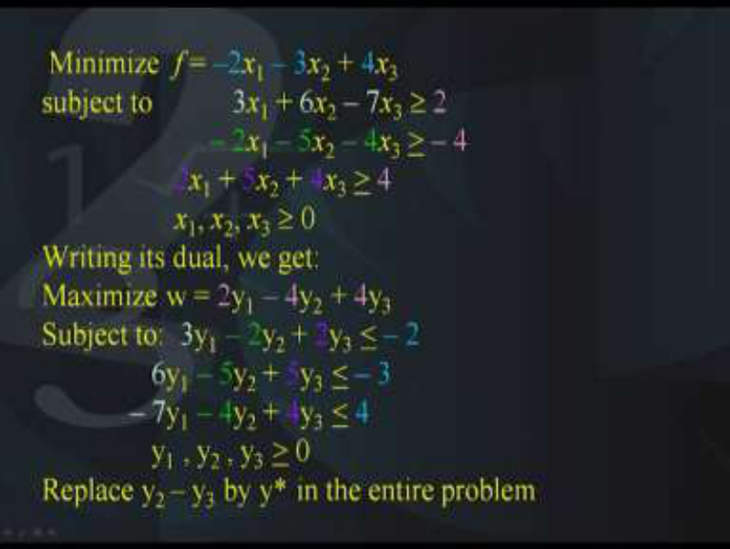
*Equality split into two rows and normalized to GE form before dual writing.*

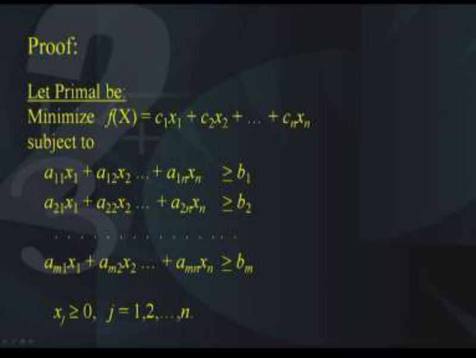
*Min primal feasible value GE max dual feasible value for any feasible pair.*

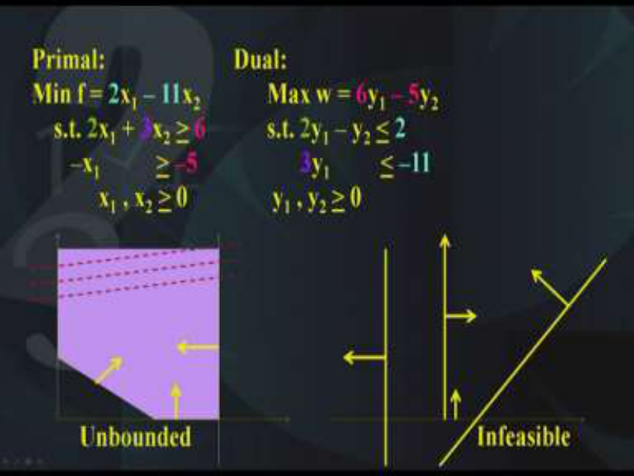
*Primal feasible but objective going to plus infinity.*

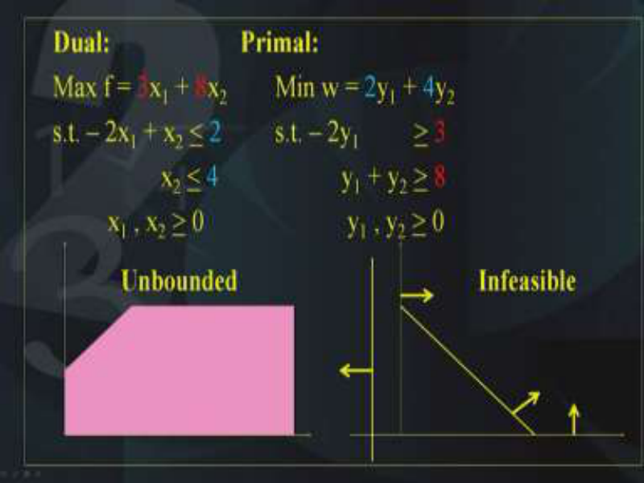
*Corresponding dual with no feasible point.*

## 3. Optimality Criterion, Strong Duality, Complementary Slackness (Lec 17)

What this section is: three theorems that turn bounds into optimality tests.
Why it matters: equal values prove optimality, and slackness lets you recover one solution from the other without simplex.

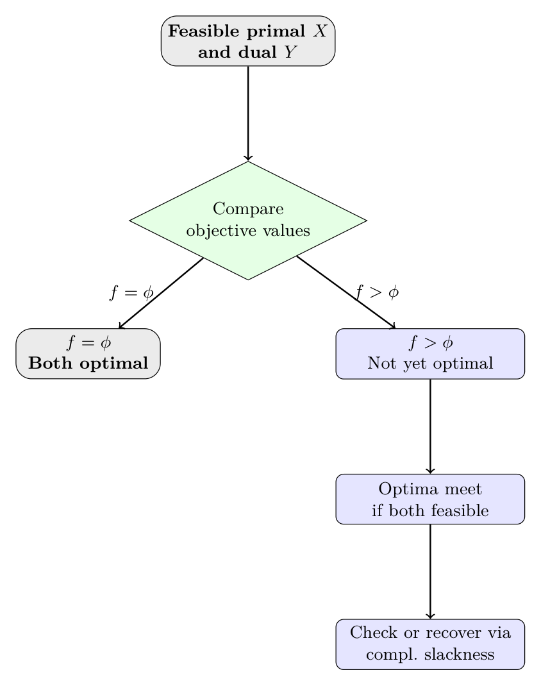

### 3.1 Optimality criterion theorem

For a **symmetric** primal-dual pair: if there exist feasible $X$ (primal) and $Y$ (dual) with equal objective values, $f(X) = \phi(Y)$, then $X$ and $Y$ are optimal for their respective problems.

Illustration:

- Given: primal $\max x_1+2x_2+3x_3+4x_4$ with two $\leq$ constraints (RHS 20, 20); dual $\min 20y_1+20y_2$ with four $\geq$ constraints.
- Steps: check feasibility of $X=(0,0,4,4)$ and $Y=(1.2,0.2)$ by substitution; evaluate both objectives.
- Answer: both give value 28, hence both are optimal.

### 3.2 Main (strong) duality theorem

If both primal and dual are feasible, then both have optimal solutions and their optimal objective values are equal.

### 3.3 Complementary slackness theorem

For symmetric pair $\max f(X)=CX$, $AX \leq B$, $X \geq 0$ and $\min \phi(Y)=BY$, $YA \geq C$, $Y \geq 0$: feasible-optimal $X_0, Y_0$ satisfy, if and only if,

$$(Y_0 A - C)X_0 + Y_0(B - AX_0) = 0.$$

The lecture verifies both bracket terms are zero for the $(0,0,4,4)$ / $(1.2,0.2)$ example by direct matrix substitution:

- First part $(Y_0A-C)X_0$: $Y_0=(1.2,0.2)$, $A$ the $2 \times 4$ coefficient matrix, $C=(1,2,3,4)$, $X_0=(0,0,4,4)^T$; product equals 0.
- Second part $Y_0(B-AX_0)$: $B=(20,20)^T$; product equals 0.

### 3.4 Four working complementary-slackness conditions

At the optimum only (not for general feasible points), for max-primal/min-dual:

1. If a primal variable $x_j > 0$, the corresponding dual constraint $j$ holds as an **equality**. (Verified: $x_3 = 4 > 0$ forces $2y_1+3y_2 = 3$ at $(1.2,0.2)$.)
2. If a primal constraint is a **strict** inequality at optimum, the corresponding dual variable is $0$.
3. If a dual variable $y_i > 0$, the corresponding primal constraint holds as an **equality**. (Verified: $y_1 = 1.2 > 0$ forces the first primal constraint tight at $(0,0,4,4)$.)
4. If a dual constraint is a **strict** inequality at optimum, the corresponding primal variable is $0$. (Verified: $y_1+2y_2 > 1$ strict forces $x_1 = 0$.)

### 3.5 Full asymmetric summary table (from Lec 17 closing slide)

- If primal constraint $i$ is $=$, dual variable $y_i$ is unrestricted.
- If primal variable $x_j$ is unrestricted, dual constraint $j$ is $=$.
- If primal constraint $i$ is $\leq$ (max form), $y_i \geq 0$; if $\geq$, $y_i \leq 0$.
- If $x_j \geq 0$, dual constraint $j$ is $\geq$ type (min dual); if $x_j \leq 0$, dual constraint $j$ is $\leq$ type.

### 3.6 Lec 17 homework exercise (from transcript)

- Given: $\max z = 3x_1+4x_2$ subject to $7x_1-2x_2 \geq 4$, $-3x_1+x_2 \leq 3$, $x_1 \geq 0$, $x_2$ unrestricted.
- Steps: write the dual using Section 3.5 rules, then apply the theorems above.
- Answer task: state what can be said about primal and dual solutions.

Key slide figures:

*Four-variable primal and two-variable dual with equal value 28.*

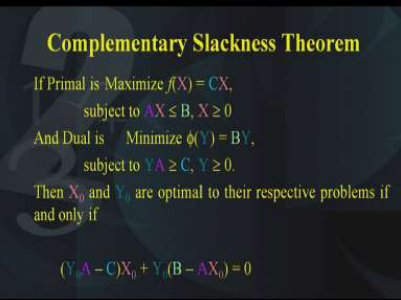
*Matrix condition for symmetric optimal pair.*

*Complete constraint-to-variable and variable-to-constraint sign map.*

## 4. Simplex Multipliers and Primal-Dual Solution Correspondence (Lec 18)

What this section is: reading the dual optimum directly from the primal final tableau.
Why it matters: you never need to solve the dual separately; multipliers give its solution and prove strong duality computationally.

### 4.1 Simplex multipliers

- Canonical form: for basis $B$ with basic solution $X_B = B^{-1}b$, $X_N = 0$ and value $Z = c_B B^{-1}b$.
- Multiplier vector: $\pi = c_B B^{-1}$.
- Deviation entries: $\Delta_j = c_j - \pi P_j$, where $P_j$ is column $j$ of $A$.
- A primal feasible basis ($B^{-1}b \geq 0$) is optimal for a min problem when all $\Delta_j \geq 0$ (sign convention flips for max, but the lecture works the min form).
- Primal feasible basis definition: $B$ is primal feasible iff $B^{-1}b \geq 0$.
- Dual feasible basis idea: $\pi$ satisfies $YP_j \leq c_j$.

Key link: checking $\Delta_j \geq 0$ is exactly checking that $\pi$ satisfies the dual constraints $YP_j \leq c_j$. Hence if $B$ is primal-optimal, $\pi = c_B B^{-1}$ is dual-feasible with the same objective value $W = \pi b = c_B B^{-1} b = Z$, and by the duality theorem $\pi$ is dual-optimal. **The dual optimum can be read from the primal final tableau without solving the dual.**

Mechanically: $B^{-1}$ is the matrix sitting under the initial identity/slack columns in the final tableau; multiply $c_B$ by it. Equivalently (max problems), the dual values are the negatives of the deviation entries under the initial slack columns — see the Lec 22 example below.

### 4.2 Worked correspondence example

- Given: primal $\max 3x_1+5x_2$ subject to $x_1+2x_2 \leq 20$, $x_1+x_2 \leq 15$, $x \geq 0$; dual $\min 20y_1+15y_2$ with $y_1+y_2 \geq 3$, $2y_1+y_2 \geq 5$.
- Steps: solve graphically (primal optimum $(10,5)$, value 55; dual optimum $(2,1)$, value 55); solve primal by simplex with slacks $x_3,x_4$ through three tableaux; track multipliers $(0,0) \to (5,0) \to (2,1)$.
- Answer: final RHS $(10,5)$ is the primal optimum; final multipliers $(2,1)$ are the dual optimum.

### 4.3 Lec 18 $A_0^{-1}$ demo (two-phase example)

- Given: $\max -4x_1-5x_2$ subject to $2x_1+x_2 \leq 6$, $x_1+2x_2 \leq 5$, $x_1+x_2 \geq 1$, $x_1+4x_2 \geq 2$; slacks $x_3,x_4$, surplus $x_5,x_6$, artificial $x_7,x_8$; initial basis $\{x_3,x_4,x_7,x_8\}$, final basis $\{x_3,x_4,x_1,x_2\}$.
- Steps: form $A_0$ from the initial-table columns of the final basis; apply $A_0^{-1}$ to the last-four-column submatrix (initial identity/surplus block) to get the final block; use diagonal $1$/$-1$ inverse fact to isolate $A_0^{-1}$; keep basis order $\{x_3,x_4,x_1,x_2\}$ when forming $c_B=(0,0,-4,-5)$.
- Answer: $A_0^{-1}$ as on the slide; $\pi = (0,0,-4,-5)A_0^{-1} = (0,0,-11/3,-1/3)$.

### 4.4 Lec 18 homework exercise (from transcript)

- Given: $\min -3x_1-4x_2$ subject to $7x_1-2x_2 \geq 4$, $-3x_1+x_2 \leq 3$, $x_1,x_2 \geq 0$.
- Steps: solve the primal by simplex; read multipliers from the final tableau.
- Answer task: report the dual solution without solving the dual.

Key slide figures:

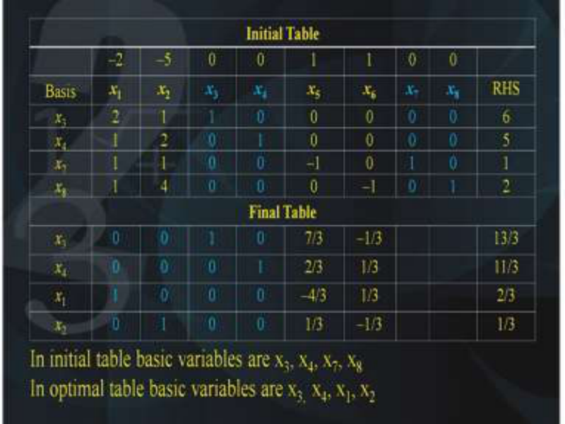
*Basis change from slacks and artificials to x3 x4 x1 x2.*

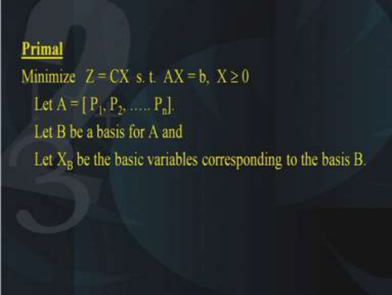
*Feasibility as B inverse b GE 0 and optimality as deviation GE 0.*

*Primal optimum 10 5 and dual optimum 2 1 both with value 55.*

## 5. Dual Simplex Method (Lec 19)

What this section is: a simplex variant that starts dual-feasible and works toward primal feasibility.
Why it matters: it solves $\geq$-constraint problems without artificial variables or two-phase work.

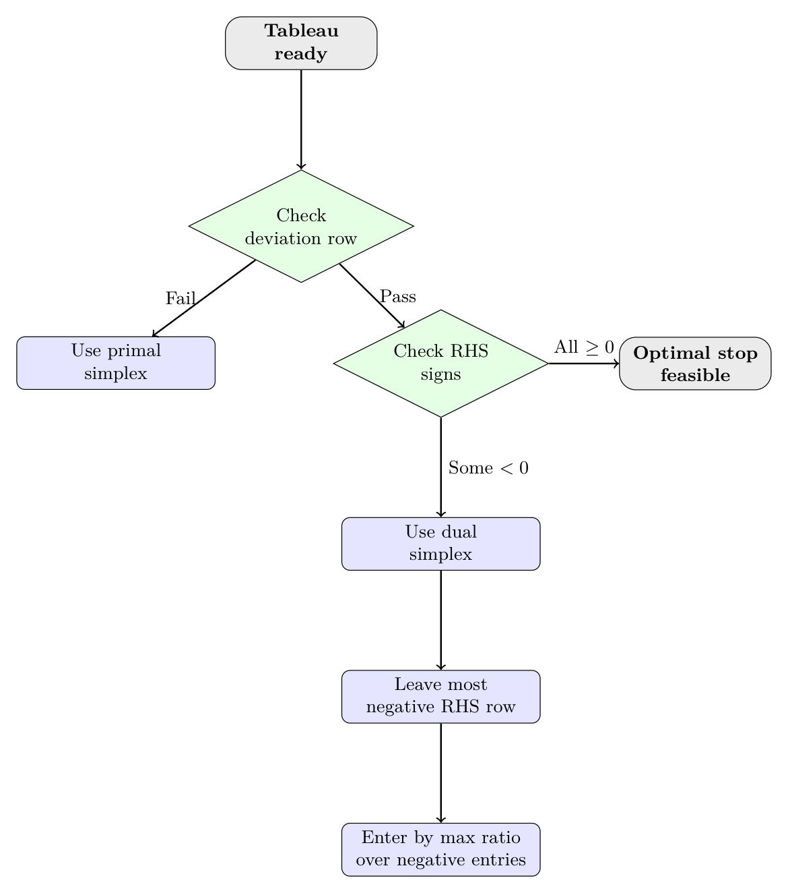

### 5.1 When to use it

Use the dual simplex method when the tableau is **dual-feasible but primal-infeasible**: all deviation entries satisfy optimality ($\Delta_j \geq 0$ for the min convention used in the lecture) but some RHS entries are negative ($b_i < 0$, i.e. basic variables negative). This arises typically with $\geq$ constraints after multiplying by $-1$ to get a starting basis of (negative) surplus variables, avoiding artificial variables and two-phase work. Progress moves through primal-infeasible points keeping deviations non-negative until the RHS turns non-negative; at that moment the basis is both feasible and optimal. (Primal simplex does the reverse: feasible but non-optimal $\to$ optimal.)

Background special cases from Lec 19:

- If all $c_j \geq 0$ and $b_i \leq 0$ in the lecture sign setup, the slack basis is both feasible and optimal for primal and dual.
- If some $b_i > 0$ strictly while $c_j \geq 0$, the slack basis is primal-infeasible but dual-feasible; this is the dual simplex starting point.
- Pivot theory: replacing $x_{n+r}$ by $x_p$ on row $r$ with $-a_{rp} < 0$ keeps deviations non-negative iff $c_j-(a_{rj}/a_{rp})c_p \geq 0$; the entering $p$ is fixed by that max-ratio rule.

### 5.2 Algorithm (minimization convention of the lecture)

1. Write constraints with surplus variables, multiply rows by $-1$ so surplus variables form the starting basis with RHS $-b_i < 0$. Build the tableau and compute the deviation row.
2. Check optimality/feasibility: if all $\Delta_j \geq 0$ and all RHS $\geq 0$, stop (optimal and feasible).
3. Leaving variable: choose the row with the **most negative RHS** ($b_r = \min b_i < 0$).
4. Entering variable: in the pivot row consider only columns with **negative** coefficients $a_{rj} < 0$; compute ratios $\Delta_j / a_{rj}$ (equivalently $\Delta_j / (-a_{rj})$ up to sign) and pick the **maximum** ratio (lecture: $\max \Delta_j/(-a_{rj})$ over $a_{rj} < 0$). That column enters. If the pivot row has no negative coefficient, the problem is **infeasible**.
5. Pivot on $a_{rp}$ with elementary row operations; recompute deviations.
6. Repeat until all RHS $\geq 0$. Then read the solution.

Note the two reversals versus primal simplex: leaving variable first (most negative RHS instead of most positive deviation), and maximum ratio test instead of minimum ratio test.

### 5.3 Condensed worked example

- Given: $\min Z = x_1+4x_2+3x_4$ (no $x_3$ term) subject to $x_1+2x_2-x_3+x_4 \geq 3$, $-2x_1-x_2+4x_3+x_4 \geq 2$, $x \geq 0$.
- Steps: add surplus $x_5,x_6$, multiply both rows by $-1$, start with basis $\{x_5,x_6\}$, RHS $(-3,-2)$, deviations $(1,4,0,3,0,0)$.
- Iteration 1: leaving $x_5$ (RHS $-3$ most negative); ratios $1/(-1), 4/(-2), 3/(-1)$, max is $-1$, so $x_1$ enters. Pivot to basis $\{x_1,x_6\}$; RHS $(3,-8)$; deviations $(0,2,1,2,1,0)$.
- Iteration 2: leaving $x_6$ (RHS $-8$); max-ratio over negative pivot-row entries selects $x_3$. Pivot to basis $\{x_1,x_3\}$; RHS $(7,4)$; deviations $(0,1/2,0,1/2,2,1/2)$.
- Answer: all RHS $\geq 0$, all deviations $\geq 0$: stop. Primal optimum $x_1 = 7$, $x_3 = 4$, others $0$, $Z = 7$. Simplex multipliers $\pi = c_B B^{-1} = (1,0)[-2,-1;-1/2,-1/2] = (-2,-1/2)$ give the dual optimum. The dual is $\max 3y_1+2y_2$ with $y_1-2y_2 \leq 1$, $2y_1-y_2 \leq 4$, $-y_1+4y_2 \leq 0$, $y_1+y_2 \leq 3$.

### 5.4 Lec 19 homework exercise (from transcript)

- Given: $\min x_1+3x_2+2x_3$ subject to $4x_1-5x_2+7x_3 \leq 8$, $2x_1-4x_2+2x_3 \geq 2$, $x_1-3x_2+2x_3 \leq 2$, $x \geq 0$.
- Steps: convert with surplus variables so the starting RHS is negative; apply the leaving and entering rules above.
- Answer (as stated in lecture): $(1,0,0)$ with objective value 1.

Reference slide tableaux:

*Rows multiplied by minus one giving basic values minus 3 and minus 2.*

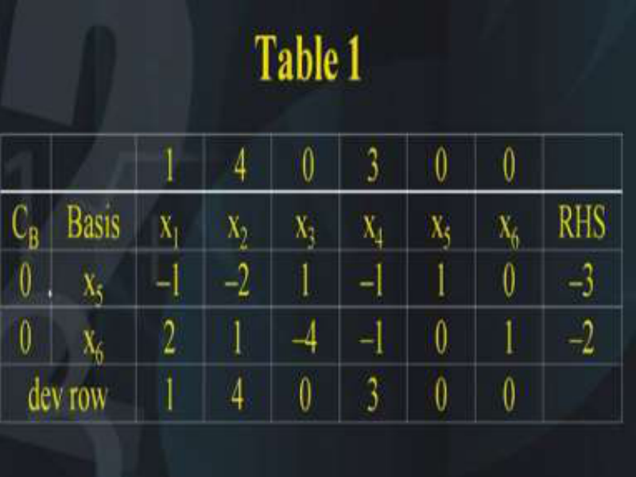
*Basis x5 x6 with deviations 1 4 0 3 0 0.*

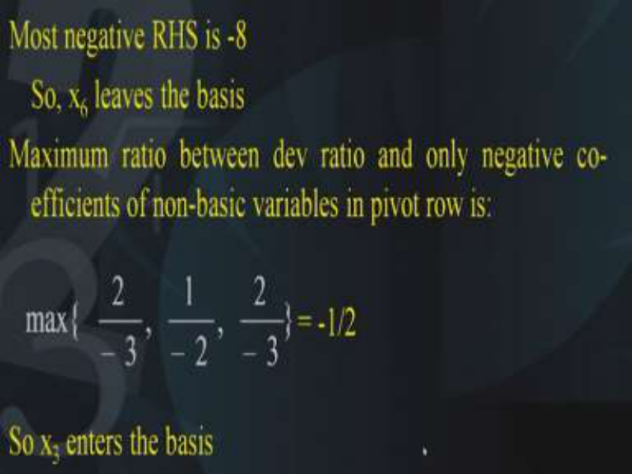
*Basis x1 x6 with RHS 3 and minus 8.*

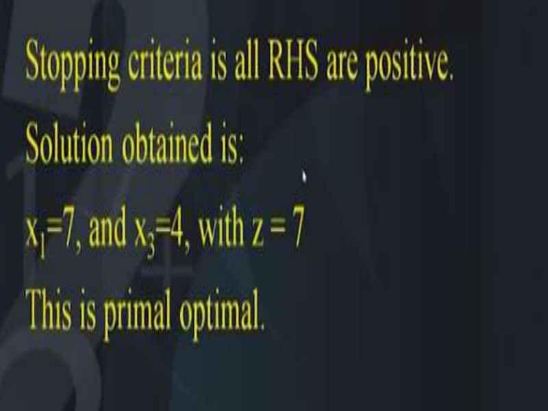
*Basis x1 x3 with RHS 7 and 4 and value 7.*

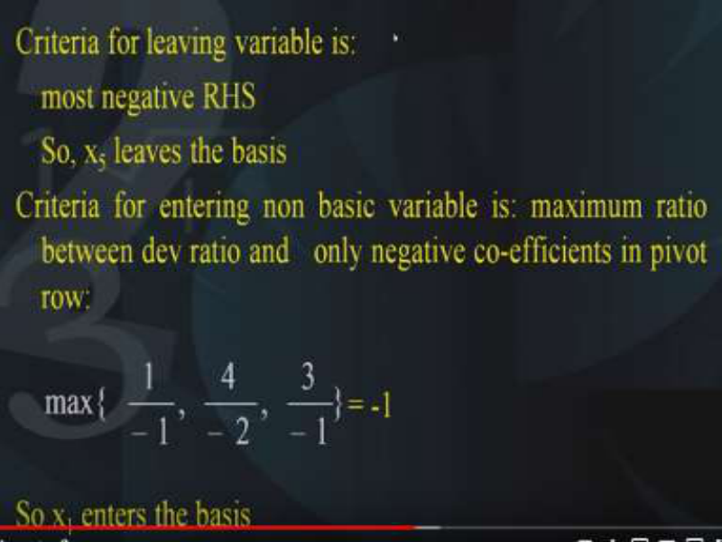
*Most negative RHS leaves and max ratio over negative row entries enters.*

## 6. Sensitivity Analysis I: $c_j$ and $b_i$ Changes (Lec 20)

What this section is: how far cost or resource data can move before the current basis breaks.
Why it matters: avoids resolving from scratch; gives allowable ranges and shadow prices for decisions like overtime.

Setup example used through Lec 20-21: $\max Z = 2x_1+3x_2+x_3$ subject to $(1/3)x_1+(1/3)x_2+(1/3)x_3 \leq 1$ (labour), $(1/3)x_1+(4/3)x_2+(7/3)x_3 \leq 3$ (material), $x \geq 0$. Slack $x_4,x_5$. Final optimum basis $\{x_1,x_2\}$, RHS $(1,2)$, deviations $(0,0,-3,-5,-1)$, $Z = 8$. The lecture highlights $B^{-1} = [4,-1;-1,1]$ visible under the initial identity columns.

General principle: do not resolve from scratch; recompute only affected deviation entries ($\Delta_j = c_j - c_B \bar{a}_j$) or RHS ($\bar{b} = B^{-1}b^*$) and re-iterate only if optimality/feasibility breaks.

The lecture lists seven change types: (1) cost coefficients $c_j$, (2) right-hand sides $b_i$, (3) constraint coefficients $a_{ij}$, (4) adding a variable, (5) adding a constraint, (6) deleting a variable, (7) deleting a constraint. Types 1-2 are below; types 3-7 are in Section 7.

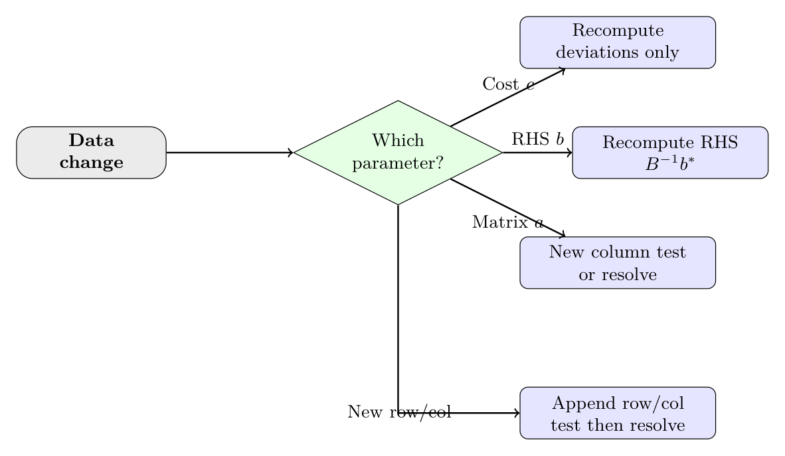

### 6.1 Changes in objective coefficients $c_j$

- Case A (non-basic variable, e.g. $c_3$): $\Delta_3 = c_3 - (2,3)\cdot(-1,2)^T = c_3 - 4$. Optimality (max: $\Delta \leq 0$) needs $c_3 \leq 4$. So product C stays out while its unit profit is below 4. If raised to 6, $\Delta_3 = +2 > 0$, re-iterate; new optimum $\{x_1,x_3\} = (2,1)$, $Z = 10$.
- Case B (basic variable, e.g. $c_1$): recompute every non-basic deviation in terms of $c_1$: $\Delta_3 = 1-(c_1,3)\cdot(-1,2)^T = c_1-5 \leq 0 \Rightarrow c_1 \leq 5$ in the slides arithmetic as written (notes derivation gives the intersection below); $\Delta_4 = 0-(c_1,3)\cdot(4,-1)^T = 3-4c_1 \leq 0 \Rightarrow c_1 \geq 3/4$; $\Delta_5 = 0-(c_1,3)\cdot(-1,1)^T = c_1-3 \leq 0 \Rightarrow c_1 \leq 3$. Intersection: $3/4 \leq c_1 \leq 3$.
- Case C (all $c$ change): substitute the new $c_B$ into every $\Delta_j$; if all satisfy the sign rule the old basis stays optimal (example $Z = x_1+4x_2+2x_3$ stays optimal with deviations $0,0,-5,0,-3$), otherwise pivot (example $Z = x_1+4x_2+10x_3$ gives $\Delta_3=+3 > 0$, needs two iterations ending at $x_3 = 9/7$, $x_4 = 4/7$, $Z = 90/7$).

### 6.2 Changes in right-hand sides $b_i$ and shadow prices

New RHS $\bar{b}^* = B^{-1}b^*$. Example: labour $1 \to 2$ gives $B^{-1}(2,3)^T = (5,1)$, so $x_1 = 5$, $x_2 = 1$, $Z = 13$ (up from 8). Extra profit $13-8 = 5$ versus overtime cost 4 per unit: profitable to hire.

**Shadow price** = increase in optimal $Z$ per unit increase in a constraint resource, valid while the basis is unchanged. Here the labour shadow price is 5.

Range for labour availability $d$ (new RHS $(d,3)$): need $B^{-1}(d,3)^T = (4d-3, 3-d) \geq 0$, i.e. $3/4 \leq d \leq 3$. Within range, $x_1 = 4d-3$, $x_2 = 3-d$, $Z = 5d+3$. If $B^{-1}b^* \not\geq 0$, feasibility breaks and further iteration (dual simplex style) is needed.

### 6.3 Lec 20 homework exercise (from transcript)

- Given: $\max f = x_1-x_2+2x_3$ subject to $x_1-x_2+x_3 \leq 4$, $x_1+x_2-x_3 \leq 3$, $2x_1-2x_2+3x_3 \leq 15$ with slacks $x_4,x_5,x_6$; optimum table given on the slide with basis $\{x_3,x_4,x_2\}$.
- Steps: carry out sensitivity one change at a time.
- Answer tasks: (1) $c_1 \to 2$; (2) $c_1=4$ with column $(2,2,3)^T$; (3) $c_2=-2$, column $(2,3,-1)^T$, $c_3=1$, column $(3,-2,1)^T$; (4) RHS $(4,3,15) \to (2,4,20)$; (5) objective $\to 3x_1+x_2+5x_3$.

Reference tableaux:

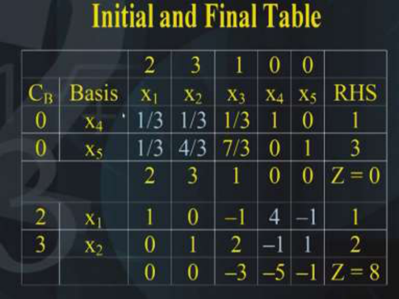
*Slack basis x4 x5 evolving to optimum basis x1 x2 with value 8.*

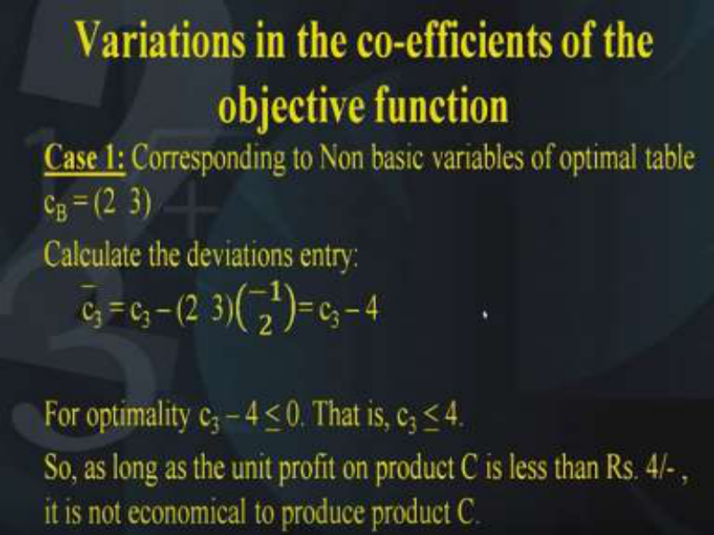
*Deviation c3 minus 4 forcing c3 LE 4 for max optimality.*

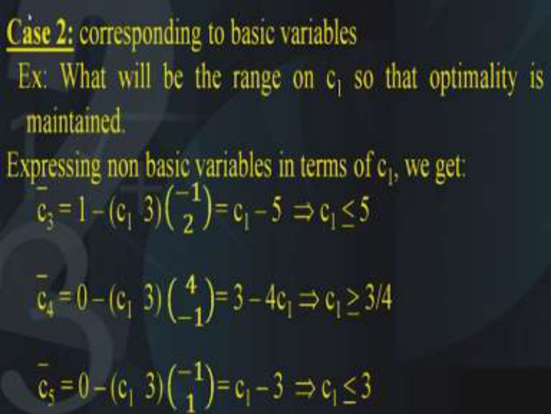
*All nonbasic deviations expressed in c1 giving 3 over 4 to 3.*

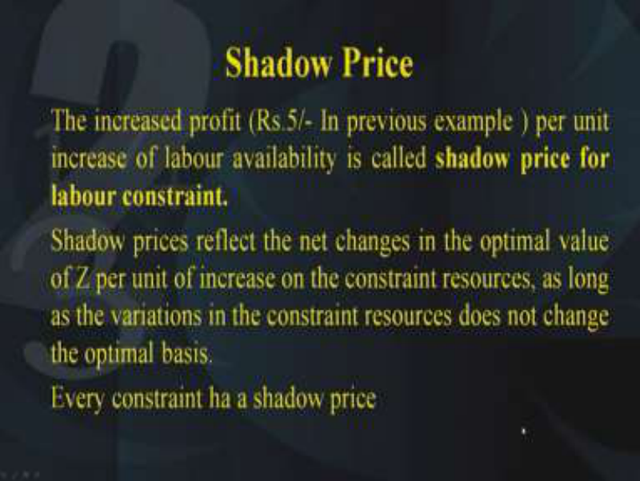
*Profit increase per unit resource while basis is unchanged.*

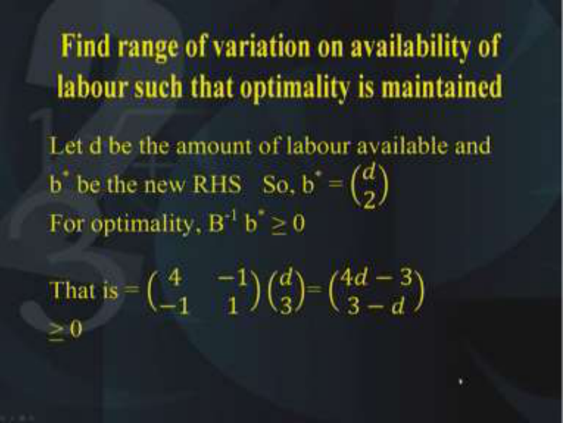
*B inverse times d 3 nonnegative giving 3 over 4 to 3.*

## 7. Sensitivity Analysis II: $a_{ij}$, New/Deleted Variables and Constraints (Lec 21)

What this section is: structural changes (columns, rows, matrix entries) rather than just costs or RHS.
Why it matters: tells you when a single ratio test suffices and when you must resolve.

Same $2x_1+3x_2+x_3$ example; simplex multipliers $\pi = c_B B^{-1} = (2,3)[4,-1;-1,1] = (5,1)$.

Sensitivity rule table:

| Change type | What to recompute | Keep basis if | Else |
|---|---|---|---|
| Non-basic $c_j$ | One $\Delta_j$ | Sign rule holds | Pivot that variable in |
| Basic $c_j$ | All non-basic $\Delta$ | All signs hold | Re-iterate |
| RHS $b$ | $B^{-1}b^*$ | $\geq 0$ | Dual-simplex re-iterate |
| New variable column $P$ | $\Delta = c-\pi P$ | $\Delta$ fails entry (max) | Append column and pivot |
| Non-basic $a_{ij}$ | Same as new variable | Same test | Same action |
| Basic $a_{ij}$ | No shortcut | — | Resolve |
| New constraint | Test current optimum | Satisfies it | Append row and resolve |
| Delete non-basic or zero-basic variable | Nothing | Always | — |
| Delete positive basic variable | Drop column and basis row, add artificial | — | Two-phase or big-M |
| Delete loose constraint (slack $> 0$) | Nothing | Always | — |
| Delete tight constraint (slack $= 0$) | — | — | Resolve |

### 7.1 Adding a new variable (new product D)

New column $P_6$ with profit $c_6$: compute $\Delta_6 = c_6 - \pi P_6$.

- D needing $(1,1)$ resources with profit 3: $\Delta_6 = 3-(5,1)\cdot(1,1)^T = -3 \leq 0$: not profitable, basis unchanged.
- D needing $(2,3)$ with profit 15: $\Delta_6 = 15-(5,1)\cdot(2,3)^T = +2 > 0$: basis no longer optimal; append the column and re-run simplex (lecture reaches $x_2 = 9/5$, $x_6 = 1/5$, $Z = 57/5$).

### 7.2 Changing resource requirements ($a_{ij}$) of existing activities

- Non-basic variable (e.g. product C): treat like a new variable — recompute its $\Delta$ with the new column.
- Basic variable (e.g. product B): no shortcut; resolve the LP.

### 7.3 Adding a new constraint

First test the current optimum in the new constraint. Example $x_1+2x_2+x_3 \leq 10$: $(1,2,0)$ satisfies it, so the optimum is unchanged. Counter-example $x_1+2x_2+x_3 \leq 4$: $(1,2,0)$ gives $5 > 4$, violated — append the row and resolve. Lecture admin-services example: $x_1+2x_2+x_3 \leq 10$ passes; the $\leq 4$ variant fails and forces a resolve.

### 7.4 Deleting a variable

- Non-basic (or basic-but-zero) variable, e.g. $x_3 = 0$: deletion changes nothing.
- Basic positive variable, e.g. $x_2 = 2$: delete its column and its basis row, leaving a non-canonical row; insert an artificial variable and resolve with two-phase/big-M. Lecture form: $x_1-x_3+4x_4-x_5 = 1$, $2x_3-x_4+x_5+x_6 = 2$ with artificial $x_6$.

### 7.5 Deleting a constraint

- Slack positive at optimum (constraint loose), e.g. second constraint slack $x_5 > 0$: deletion leaves the optimum unchanged.
- Slack zero (constraint tight): resolve, since the optimum may shift.

### 7.6 Simultaneous changes

Apply changes sequentially one type at a time (linearity makes the cumulative effect identical); with too many changes, resolve from scratch.

### 7.7 Lec 21 homework exercise (from transcript)

- Given: same $\max x_1-x_2+2x_3$ problem and optimum table as Lec 20.
- Steps: apply one part at a time.
- Answer tasks: (1) change $c_2,a_{12},a_{22},a_{32},c_3,a_{13},a_{23},a_{33}$ as listed; (2) delete the first constraint; (3) add $2x_1+x_2+2x_3 \leq 60$; (4) change third constraint to $4x_1-x_2+2x_3 \leq 12$.

Key slide figures:

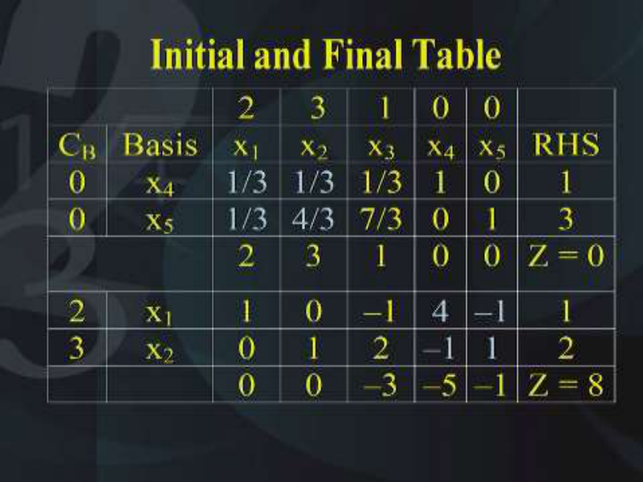
*Same labour material example carried from Lec 20.*

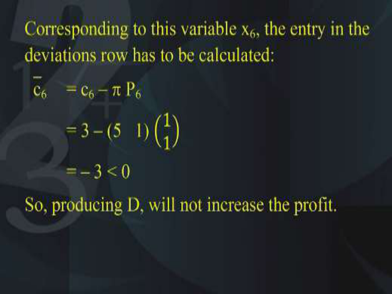
*Delta 6 as c6 minus pi P6 deciding entry.*

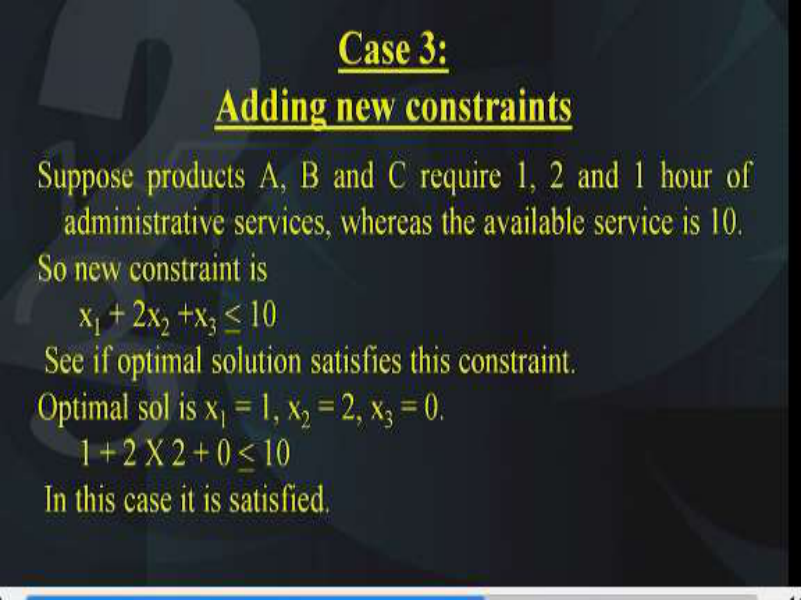
*Substituting 1 2 0 into x1 plus 2 x2 plus x3 LE 10.*

## 8. Case Studies and Quiz Review (Lec 22-23)

What this section is: exam-style drills that combine dual writing, tableau reading, slackness, dual simplex, and sensitivity.
Why it matters: these are the exact patterns and traps reused in quizzes.

### 8.1 Dual writing drills (Lec 22)

1. Given $\min 6x_1+3x_2-7x_3$ subject to $3x_1+4x_2+x_3 \geq 5$, $6x_1-3x_2+x_3 \geq 2$. Steps: symmetric min/$\geq$ so dual is max with 2 variables. Answer: $\max 5y_1+2y_2$ subject to $3y_1+6y_2 \leq 6$, $4y_1-3y_2 \leq 3$, $y_1+y_2 \leq -7$, $y \geq 0$ (negative RHS is fine when only writing the dual).
2. Given a mixed problem with an $=$ row (RHS 1) and an unrestricted variable $x_2$ (lecture coefficients include $8y_1+4y_2+4y_3$ and objective $y_1+6y_2+4y_3$). Steps: $=$ row gives unrestricted $y_1$; unrestricted $x_2$ gives an equality dual constraint. Answer: objective $\max y_1+6y_2+4y_3$ with $8y_1+4y_2+4y_3 = 21$ among the constraints.
3. Given $\max 3x_1+4x_2$ subject to $-x_1+x_2 \leq 1$, $x_1+x_2 \geq 4$. Steps: plot $(0,1)$-$(-1,0)$ and $(0,4)$-$(4,0)$; note ray $(t,t+1)$ with value $7t+4 \to \infty$. Answer: feasible but unbounded; its dual ($\min y_1-4y_2$ with $-y_1-y_2 \geq 3$, $y_1-y_2 \geq 4$) is infeasible, confirming the corollary.

### 8.2 Reading dual from primal tableau (Lec 22)

- Given: $\max 2x_1+x_2$ subject to $2x_1-x_2 \leq 8$, $x_1+2x_2 \leq 14$, $-x_1+x_2 \leq 4$.
- Steps: add slacks $x_3,x_4,x_5$; run three tableaux to final basis $\{x_1,x_2,x_5\}$, $Z = 18$ with $x_1=6$, $x_2=4$, $x_5=6$. Two equivalent readings: (a) $\pi = c_B B^{-1} = (2,1,0)$ times the final identity-block matrix; (b) negatives of the deviation entries under the initial slack columns.
- Answer: dual solution $y = (3/5, 4/5, 0)$.

### 8.3 Complementary slackness to recover primal (Lec 22)

- Given: primal $\max x_1+x_2+x_3$ with $2x_1+x_2+2x_3 \leq 2$, $4x_1+2x_2+x_3 \leq 2$; dual $\min 2y_1+2y_2$ with $2y_1+4y_2 \geq 1$, $y_1+2y_2 \geq 1$, $2y_1+y_2 \geq 1$.
- Steps: solve dual graphically to $(1/3,1/3)$, value $4/3$; since both dual variables are positive, both primal constraints are tight; solve with slackness.
- Answer: primal $(0,2/3,2/3)$, value $4/3$.

### 8.4 Dual simplex case study (Lec 23)

- Given: $\min 20x_1+16x_2$ subject to $x_1 \geq 2.5$, $x_2 \geq 6$, $2x_1+x_2 \geq 17$, $x_1+x_2 \geq 12$.
- Steps: multiply by $-1$ to get basis of four surplus variables with RHS $(-2.5,-6,-17,-12)$; most negative $-17$ leaves; max-ratio on $(20/-2, 16/-1)$ brings $x_1$ in; two more dual-simplex pivots ($x_2$ in, then $x_4$ in) reach a non-negative RHS; final deviations $(0,0,0,0,4,12)$.
- Answer: $Z = 212$ in the lecture tableau scaling (verify sign and objective scaling against the slide table; the transcript prints $-212$ in one line due to the multiplied-row sign convention).

### 8.5 Sensitivity case study (Lec 23)

- Given: same $\max 2x_1+x_2$ problem as 8.2 with optimum basis $\{x_1,x_2,x_5\}$.
- Steps: RHS $(8,14,4) \to (10,12,14)$ gives new solution $B^{-1}b^* = (6.4, 2.8, 7.6)^T$; cost $(2+\Delta, 1, 0)$ gives recomputed quantities $(0.6+4\Delta, 0.8+0.2\Delta, 0) \geq 0$ in lecture notation.
- Answer: lecture concludes $\Delta \geq -1.5$ binding (with the second condition $\Delta \geq -4$); new $Z = (2+\Delta)x_1+x_2$.

Key slide figures:

*Ray t t plus 1 with value 7t plus 4 going to infinity.*

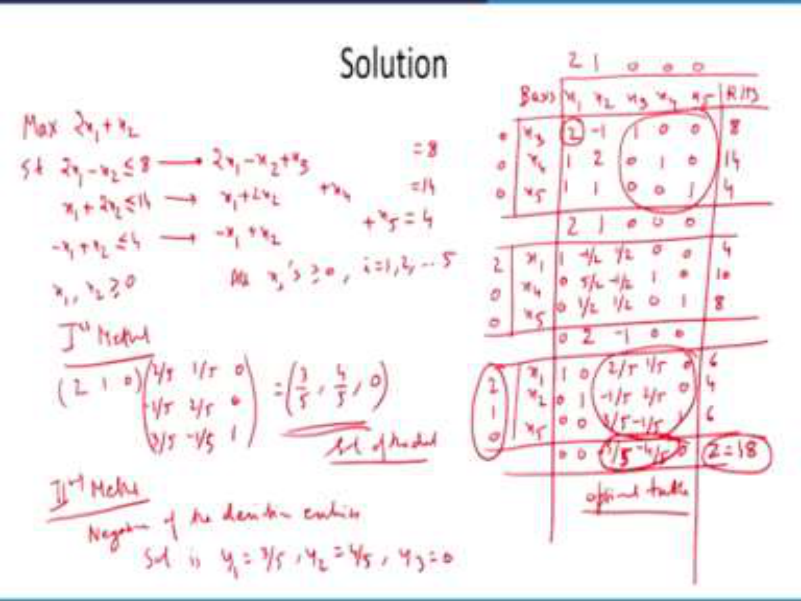
*Three tableaux ending at basis x1 x2 x5 with value 18.*

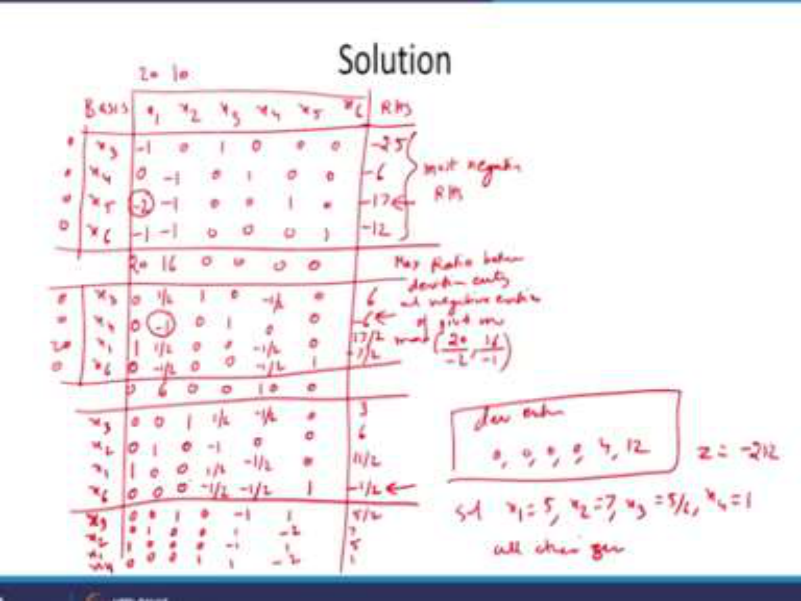
*Four-row surplus basis with most negative minus 17 leaving first.*

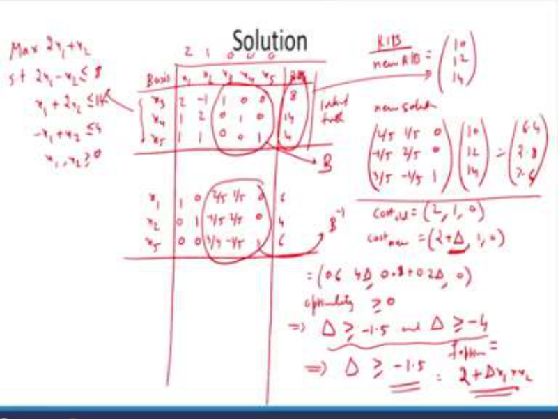
*New RHS 10 12 14 and cost 2 plus delta analysis.*

### 8.6 Module quiz with answers (Lec 23, all 15 questions)

| No. | Question | Answer |
|---|---|---|
| 1 | The dual of the dual is the _____. | primal |
| 2 | If the primal problem is feasible and its objective function is unbounded, then the dual has _____. | infeasible solution |
| 3 | In the dual simplex method, the criterion for the leaving variable is _____. | most negative RHS |
| 4 | If dual is feasible and unbounded, then the primal problem is _____. | infeasible |
| 5 | The value of the objective function of the minimum (dual) problem for any dual feasible solution is a _____ to the maximum value of the primal objective. | upper bound |
| 6 | If dual is feasible and primal is infeasible, then dual is _____. | unbounded |
| 7 | A problem which can be solved by dual simplex can also be solved by simplex. True or false? | True |
| 8 | If a primal constraint is a strict inequality at the optimum, the corresponding dual variable must be _____ at the optimum. | 0 |
| 9 | Every LP has its dual which is also an LP. True or false? | True |
| 10 | If a primal variable is positive, the corresponding dual constraint will be satisfied as a _____ at the optimum. | equation (equality) |
| 11 | If a dual constraint is a strict inequality, the corresponding primal variable must be _____ at the optimum. | 0 |
| 12 | If $x_j$ is unrestricted in sign in the primal, then the $j$th dual constraint is a _____. | equality (equation) |
| 13 | _____ reflect the net changes in optimum $Z$ per unit increase in constraint resources while the optimum basis is unchanged. | Shadow prices |
| 14 | State the weak duality theorem. | For min primal and max dual, $f(X) \geq w(Y)$ for any feasible $X,Y$; min $f \geq$ max $w$. |
| 15 | State the strong duality theorem. | If both primal and dual are feasible, both have optimal solutions with equal optimal values. |

Quiz slide sources:

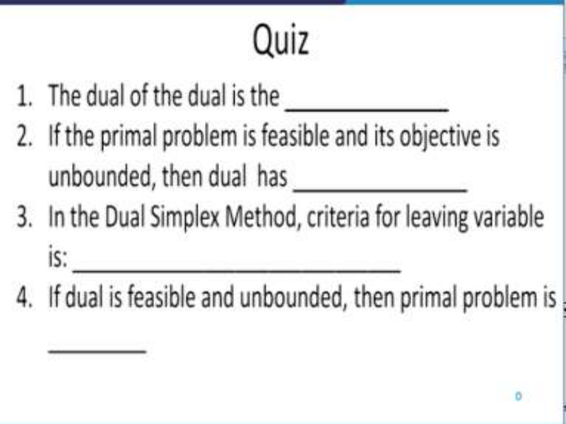
*Questions 1 to 4 on dual of dual and unboundedness.*

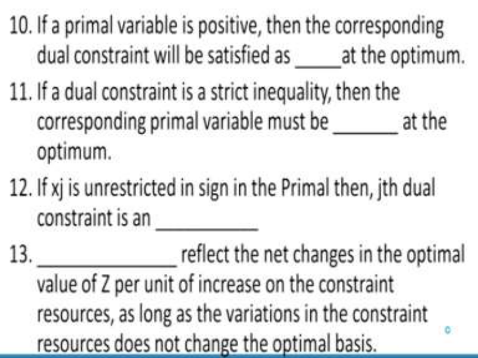
*Questions 10 to 13 on slackness and shadow prices.*

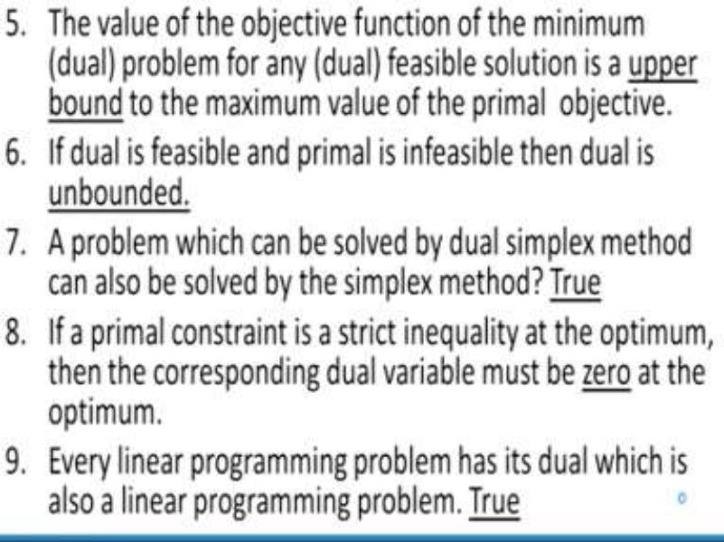
*Answers 5 to 9 on bounds and simplex equivalence.*

## Key exam takeaways

- Sign conventions decide everything: max pairs with $\leq$ and $\geq 0$ variables; min pairs with $\geq$ and $\geq 0$ variables. Normalize mixed problems (flip $\leq$ rows, split $=$ rows, split unrestricted variables) before writing the dual, then simplify substitutions like $y^* = y_2-y_3$.
- Memorize the asymmetric shortcuts: primal $=$ gives unrestricted dual variable; unrestricted primal variable gives dual $=$ constraint. Never force non-negativity on these.
- Weak duality compares arbitrary feasible points ($f \geq w$); strong duality and complementary slackness speak only about optima. The equality-of-values test proves optimality.
- Complementary slackness traps: conditions hold at the optimum only; strict inequality on one side forces zero on the other; positivity on one side forces equality on the other.
- Dual simplex applies when deviations are optimal but RHS is negative; leaving = most negative RHS, entering = maximum ratio over negative pivot-row entries only; no negative entry in pivot row means infeasible. Do not confuse with primal simplex (entering first, minimum ratio).
- Reading solutions: primal optimum is the final RHS; dual optimum is $c_B B^{-1}$ (or mirrored deviation entries under slack columns). Keep basis order when forming $c_B$.
- Sensitivity ranges: $c$-changes preserve the basis while deviation signs hold ($B^{-1}$ untouched); $b$-changes preserve it while $B^{-1}b^* \geq 0$. Shadow price is valid only inside the range. New variables: single $\Delta_6 = c_6 - \pi P_6$ test; new constraints: feasibility test first; deleting tight constraints or positive basic variables forces a resolve.
