# Module 3: Integer, Goal, Multi-Objective Programming and DP (Lectures 24-27)

- Lecture 24: Integer Programming — IPP/MIPP formulation, why rounding fails, branch-and-bound, Gomory cutting-plane method
- Lecture 25: Goal Programming — deviational variables, single vs multi-goal formulation, simplex caution, weighted vs preemptive methods
- Lecture 26: Multi-Objective Programming — ideal vs efficient (Pareto) solutions, efficiency cone, weighting method
- Lecture 27: Dynamic Programming — Bellman's principle of optimality, stage/state/decision/recursion, separable additive and multiplicative examples
- Closing: Key exam takeaways and comparison table

## Lecture 24: Integer Programming (IPP)

### 24.0 What and why

- What: linear programming plus the requirement that some or all decision variables take integer values.
- Why: many decisions are indivisible — trees, machines, people, TV sets. The LP relaxation can be fractional, and rounding it is unsafe, so dedicated search methods are needed.
- Methods in this lecture: branch-and-bound tree search and Gomory cutting planes.

### 24.1 Definitions: IPP vs Mixed IPP

General LPP with integrality restriction:

Maximize (or minimize) $z = c^T x$ subject to $Ax \leq (\geq,=) b$, $x \geq 0$, **and** $x_i$ integer for all $i$ (pure IPP).

Mixed IPP: only a subset is integral: $x_i$ integer for $i = 1,\dots,t$ with $t < n$; remaining $x_{t+1},\dots,x_n$ can be real. (Reordering of which variables are integral is allowed.)

Motivating example (Lec 24): farmer planting trees A ($x_1$) and B ($x_2$); land $25x_1 + 40x_2 \leq 4400$, water $30x_1 + 50x_2 \leq 3300$, return $z = 1.5x_B$-equivalent per A tree; $x_1, x_2 \geq 0$ integers (cannot plant 2.5 trees).

- Given: land 4400 sq m, water 3300 units; per-tree needs A: 25 land and 30 water, B: 40 land and 50 water; return of one A tree is 1.5 times that of one B tree.
- Steps: let $x_1$ = number of A trees, $x_2$ = number of B trees; maximize return subject to the land and water caps with $x_1, x_2 \geq 0$ integer.
- Answer form: Maximize $z = 1.5x_1 + x_2$ up to scale subject to $25x_1 + 40x_2 \leq 4400$, $30x_1 + 50x_2 \leq 3300$, $x_1, x_2 \geq 0$ integer.

### 24.2 Why rounding the LP optimum fails

Worked illustration (condensed from lecture):

- Given: Maximize $z = 3x_1 + 4x_2$ subject to the five constraints below, $x_1, x_2 \geq 0$ integer.
- Steps: drop integrality and solve the LP graphically; round the LP optimum to neighbouring integers; enumerate true integer lattice points.

Maximize $z = 3x_1 + 4x_2$ subject to:
$2x_1 + 4x_2 \leq 13$, $-2x_1 + x_2 \leq 2$, $2x_1 + 2x_2 \geq 1$, $6x_1 - 4x_2 \leq 15$, $x_1, x_2 \geq 0$ and integer.

- Relax integrality: feasible polygon ABCDEF, LP optimum at C $= (7/2, 3/2)$, $z = 33/2 = 16.5$.
- Naive rounding: $7/2 = 3.5 \in \{3,4\}$, $3/2 = 1.5 \in \{1,2\}$, giving 4 candidates $(3,1), (4,1), (4,2), (3,2)$. Of these, only $(3,1)$ is feasible, with $z = 13$.
- True integer optimum (enumerating integer lattice points in ABCDEF): $(2,2)$, $z = 14 > 13$.

Lesson: rounding can give an infeasible or suboptimal point. A dedicated method is needed.

*Slide: LP relaxation polygon ABCDEF with optimum at C.*

Related theory point: the IPP feasible set (discrete lattice points) is **not convex** (convex combination of two integer points need not be integer). Its **convex hull** (green polygon in slides) is convex and every vertex of the hull is an integer-feasible point; the IPP optimum equals the LP optimum over that convex hull.

### 24.3 Method 1: Branch-and-Bound (B&B)

What: systematic partition of the feasible set into smaller LPs whose relaxations bound the integer optimum.
Why: each branch deletes only fractional strips, so no integer point is lost, and bounds let whole subtrees be discarded.

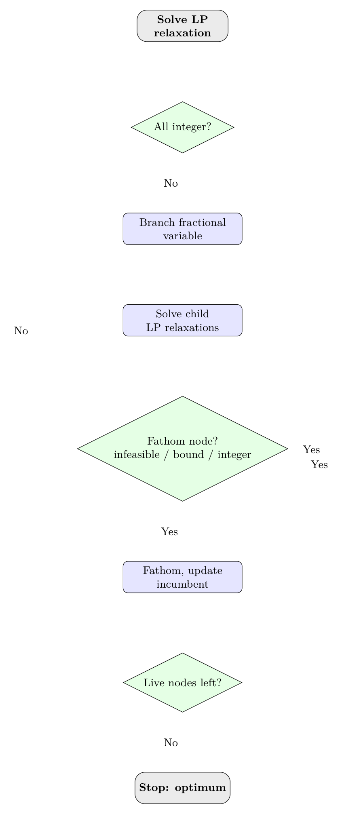

Algorithm (maximization; reverse inequalities for minimization):

1. Solve the LP relaxation (drop integrality) — call it LP0. If solution is all-integer, stop: it is optimal.
2. **Branch:** pick a fractional variable, say $x_k = \beta \notin \mathbb{Z}$. Split the problem into two child LPs by deleting the open strip $\lfloor\beta\rfloor < x_k < \lfloor\beta\rfloor+1$:
   - LP-child-1: add $x_k \leq \lfloor\beta\rfloor$; LP-child-2: add $x_k \geq \lfloor\beta\rfloor + 1$.
3. **Bound:** solve each child LP relaxation. Record its objective as an upper bound (for max).
4. **Fathom/prune** a node if (a) it is infeasible, (b) its bound is no better than the best integer solution found so far (incumbent), or (c) its solution is integer (update incumbent, no further branching from it).
5. Repeat branching on any surviving node with a fractional solution until all nodes are fathomed. The incumbent is the IPP optimum.
6. Practical notes: for problems with more than 2 variables use simplex + sensitivity analysis (adding one constraint) instead of graphs; for mixed IPP, branch only on the variables restricted to be integral.

Condensed fully-worked example (from lecture):

Maximize $z = 3x_1 + 2x_2$ subject to $x_1 \leq 2$, $x_2 \leq 2$, $x_1 + x_2 \leq 3.5$, $x_1, x_2 \geq 0$ integer. Call this LP0.

- LP0 relaxation: optimum at B $= (2, 1.5)$, $z = 9$. $x_2$ fractional, so remove strip $1 < x_2 < 2$:
  - LP01: LP0 + $x_2 \leq 1$. Optimum $(2,1)$, $z = 8$. Integer — incumbent $= 8$.
  - LP02: LP0 + $x_2 \geq 2$. Feasible segment AB; optimum $(1.5, 2)$, $z = 8.5$. Bound 8.5 > 8, and $x_1$ fractional, so branch again, removing $1 < x_1 < 2$:
    - LP021: LP02 + $x_1 \leq 1$. Optimum $(1,2)$, $z = 7$. Integer, but worse than incumbent 8.
    - LP022: LP02 + $x_1 \geq 2$. Infeasible (violates $x_1 + x_2 \leq 3.5$ with $x_2 \geq 2$ only at a point already excluded). Fathomed.
- Tree: LP0(9) branches to LP01(8, integer) and LP02(8.5), which branches to LP021(7, integer) and LP022(infeasible). Best integer: **$(2,1)$, $z = 8$**.

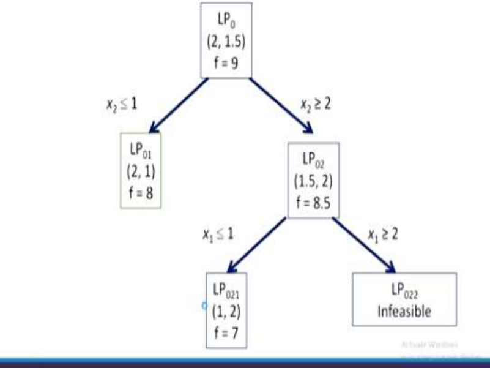

Lecture also sketches a larger minimization example ($\min 3x_4+4x_5+5x_6$ with branching tree shown on slides) — same logic, only the fathoming comparison is reversed (prune when bound $\geq$ incumbent).

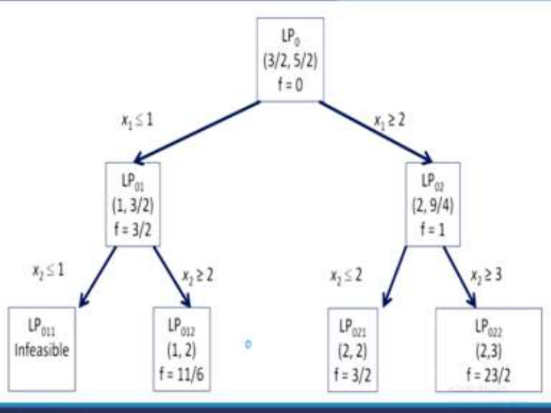
*Slide: bifurcation tree for the minimization example with more variables.*

### 24.4 Method 2: Gomory Cutting-Plane Method

What: add inequalities that cut off the fractional LP optimum while keeping every integer point.
Why: after finitely many cuts in the pure-integer case the LP optimum becomes integer, so no tree search is needed.

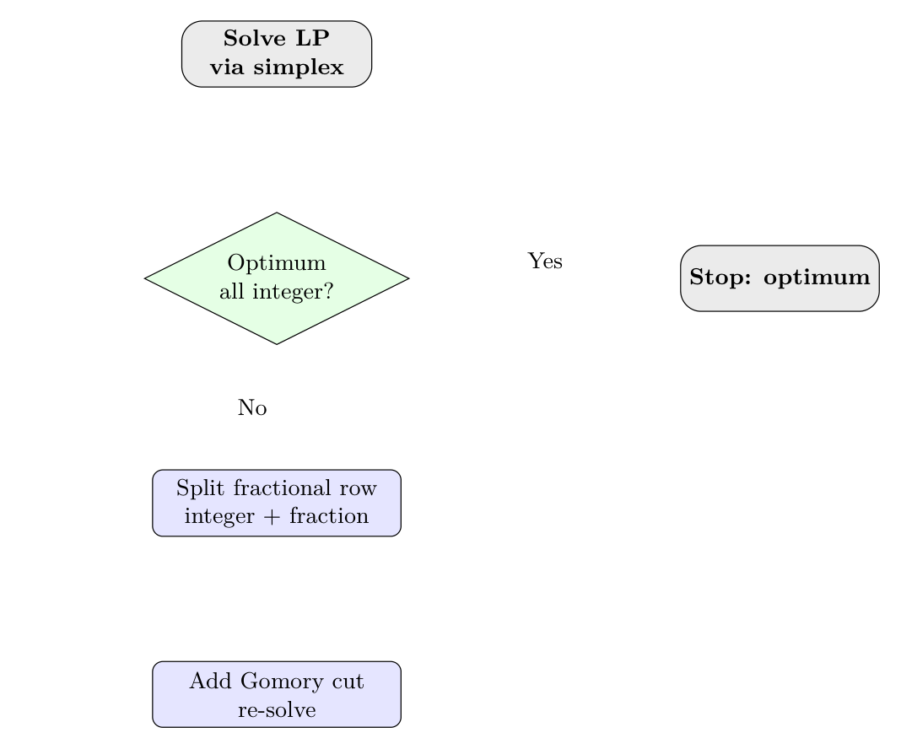

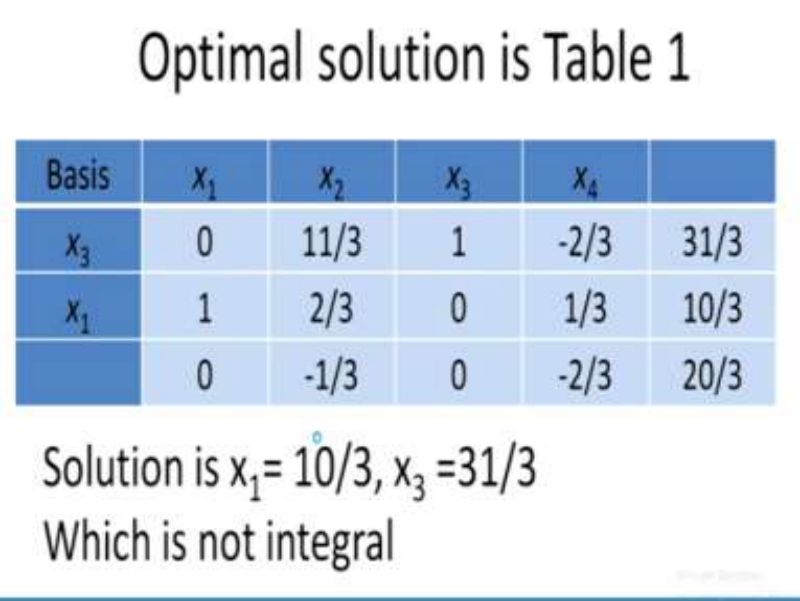
*Slide: simplex optimum tableau with fractional row for $x_1$.*

Idea: iteratively add a valid inequality ("cut") that slices off the current fractional LP optimum but no integer-feasible point, then re-solve.

Algorithm (pure IPP, all-integer coefficients after clearing fractions):

1. Solve the LP relaxation by simplex. If optimum is integer, stop.
2. **Generate cut:** take a simplex constraint row corresponding to a basic variable with fractional value:
   $\sum_j a_j x_j = b$, with $a_j, b$ fractional. Write each coefficient and $b$ as integer part + fractional part in $[0,1)$: $a_j = \lfloor a_j \rfloor + \hat{a}_j$, $b = \lfloor b \rfloor + \hat{b}$ ($0 < \hat{b} < 1$ for a fractional row).
3. Rearranging integer terms to the RHS gives the Gomory cut $\sum_j \hat{a}_j x_j \geq \hat{b}$ (equivalently $\sum_j \hat{a}_j x_j - s = \hat{b}$ with surplus $s \geq 0$ integer). Add it to the LP.
4. Re-solve (dual simplex / two-phase / sensitivity re-optimization). Repeat steps 2–4 until the optimum is all-integer.

Condensed fully-worked example (from lecture):

Maximize $f = 2x_1 + x_2$ subject to $2x_1 + 5x_2 \leq 17$, $3x_1 + 2x_2 \leq 10$, $x_1, x_2 \geq 0$ integer.

- LP relaxation optimum (Table 1): fractional, with row $x_1 + (2/3)x_2 + (1/3)x_4 = 10/3$ (where $x_3, x_4$ are slacks).
- Split: $2/3 = 0 + 2/3$, $1/3 = 0 + 1/3$, $10/3 = 3 + 1/3$. Moving integer parts right gives cut 1: $(2/3)x_2 + (1/3)x_4 \geq 1/3$, i.e. **$2x_2 + x_4 \geq 1$**. Add surplus $x_5$ and artificial $x_6$, re-solve (Table 2).
- New fractional row for $x_2$ yields cut 2: **$x_4 + x_5 \geq 1$**. Add and re-solve (Table 3).
- One more cut cycle on $x_1 = 8/3$ gives final integer optimum **$x_1 = 3$, $x_2 = 0$, $f = 6$**.

Exam exercise (answer stated in lecture): Maximize $11x_1 + 21x_2$ subject to $4x_1 + 7x_2 + x_3 = 13$, $x_1,x_2,x_3 \geq 0$ integer, by both B&B and Gomory. Answer: $(3,0,1)$, $z = 33$.

## Lecture 25: Goal Programming (GP)

### 25.0 What and why

- What: the decision-maker fixes target values called goals first, then minimizes deviations from them.
- Why: real problems have satisficing targets such as profit 640 or capacity 80 rather than unbounded optimization, plus hard system limits that must still hold.
- Two multi-goal tools: weighted single objective versus lexicographic preemptive priorities.

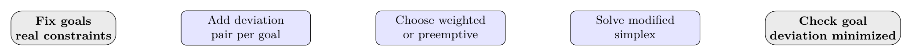

### 25.1 Core idea: goals vs real constraints, deviational variables

In ordinary LP we optimize $f(x)$. In GP the decision-maker **pre-specifies a goal $g$** and we minimize the deviation from it. Deviations are captured by two non-negative variables per goal:

- $u \geq 0$: under-achievement (shortfall), $v \geq 0$: over-achievement (excess), with **$u \cdot v = 0$** (at least one of $u, v$ is zero; both zero means the goal is met exactly).
- Goal equation: $f(x) + u - v = g$.

Single linear GP (general form): Minimize $F = u + v$ subject to $f(x) + u - v = g$, real constraints $Ax \,(\leq,=,\geq)\, b$, $x, u, v \geq 0$, $u \cdot v = 0$.

**Goal constraint vs real (system) constraint:** the goal equation is soft (deviations allowed but penalized); real constraints (demand caps, capacity) are hard and must hold.

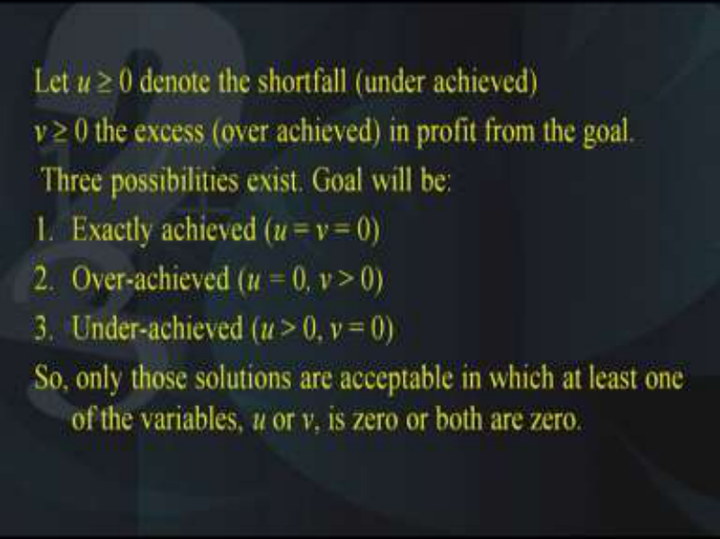
*Slide: under-achievement u and over-achievement v with three cases.*

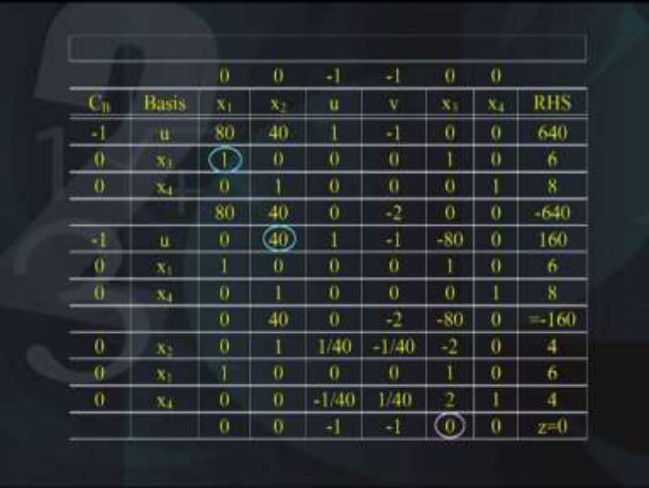
*Slide: simplex iterations keeping u and v out of the basis together.*

### 25.2 Worked single-goal example (graphical + simplex)

Factory makes A ($x_1$) and B ($x_2$); profit $f = 80x_1 + 40x_2$; caps $x_1 \leq 6$, $x_2 \leq 8$; goal $g = 640$. Formulation:

Minimize $F = u + v$ subject to $80x_1 + 40x_2 + u - v = 640$, $x_1 \leq 6$, $x_2 \leq 8$, $x_1,x_2,u,v \geq 0$, $u \cdot v = 0$.

- Graphical reading: line $80x_1+40x_2 = 640$ is segment DE with D $= (6,4)$, E $= (4,8)$. On DE: $u = v = 0$, $F = 0$ (goal exactly met). Region DEC (above line): $u = 0, v > 0$ (over-achievement). Region OADEB (below line): $u > 0, v = 0$ (under-achievement).
- Simplex: standardize with slacks $x_1 + x_3 = 6$, $x_2 + x_4 = 8$. **Crucial simplex caution:** never let $u$ and $v$ enter the basis together (enforce complementarity $u \cdot v = 0$ at every iteration). Final tableau shows alternate optima (zero reduced cost on non-basic $x_3$): one more iteration gives the second endpoint. Solutions: D $= (6,4)$ and E $= (4,8)$, $F = 0$; in fact every convex combination of D and E (the whole segment DE) is optimal with the goal exactly achieved.

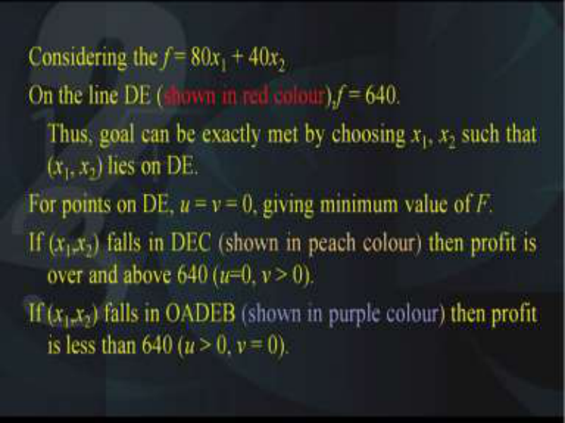

### 25.3 Multi-goal GP: formulation

With $p$ objectives $f_k(x)$ and goals $g_k$: $f_k(x) + u_k - v_k = g_k$, $u_k, v_k \geq 0$, $u_k v_k = 0$, plus common real constraints. Two ways to handle the $p$ deviation pairs:

**Weighted (non-preemptive) method:** single combined objective $\min F = \sum_k (p_k u_k + q_k v_k)$ with non-negative weights $p_k, q_k$ reflecting relative importance. Penalize only the unwanted side if appropriate (e.g., only shortfall for a "meet demand" goal).

**Preemptive (lexicographic) method:** rank goals into priorities $P_1 \gg P_2 \gg \cdots$. Form one objective per priority level (sum of deviations at that level) and optimize lexicographically: minimize $F_1$ (highest priority) first; then minimize $F_2$ subject to not degrading $F_1$; and so on. In simplex, carry one objective row per priority.

| Aspect | Weighted non-preemptive | Preemptive lexicographic |

|---|---|---|

| Number of objectives | One combined $F$ | One $F_i$ per priority level |

| Preference input | Numeric weights $p_k, q_k \geq 0$ | Priority order $P_1 \gg P_2 \gg \cdots$ |

| Simplex rows | Single objective row | One objective row per priority |

| Trade-off | Lower goal can compensate higher goal | Higher goal is never sacrificed for lower goal |

| Lecture instance | $10u_1 + 8v_4 + 5u_2 + 3u_3 + v_1$ | $F_1 = u_1$, $F_2 = v_4$, $F_3 = 5u_2 + 3u_3$, $F_4 = v_1$ |

### 25.4 Worked multi-goal example (company, priorities P1–P4)

Plant data: $x_1, x_2$ = hours for products A, B (1 hour = 1 item); normal capacity 80 h; overtime allowance ~10 h (total ~90 h); sales caps 70 (A), 45 (B); profit ratio 5:3. Goals in priority order:

- P1: minimize under-utilization of normal capacity; P2: minimize overtime beyond 10 h; P3: minimize shortfalls from 70 (A) and 45 (B), weighted 5:3; P4: minimize overtime operation per se.

Goal equations: $x_1 + x_2 + u_1 - v_1 = 80$; $x_1 + u_2 = 70$; $x_2 + u_3 = 45$; $x_1 + x_2 + u_4 - v_4 = 90$; all variables $\geq 0$, $u_1 v_1 = u_4 v_4 = 0$.

- Weighted form (illustrative weights 10, 8, 5, 3, 1): $\min F = 10u_1 + 8v_4 + 5u_2 + 3u_3 + v_1$.
- Preemptive form: $F_1 = u_1 = 80 - x_1 - x_2 + v_1$; $F_2 = v_4$; $F_3 = 5u_2 + 3u_3 = 485 - 5x_1 - 3x_2$; $F_4 = v_1$. Minimize $F_1$, then $F_2$ without hurting $F_1$, etc.

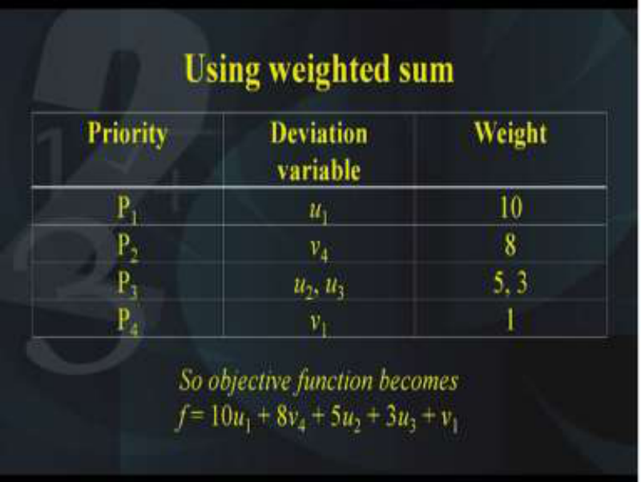
*Slide: priorities P1 to P4 mapped to variables and weights 10 8 5 3 1.*

Exam exercise (TV sets, answer stated in lecture): $x_1, x_2$ = sets of type I, II; $\min F = u+v$ s.t. $800x_1 + 400x_2 + u - v = 24000$, $x_1 + x_2 \leq 40$, $x_1 \leq 24$, $x_2 \leq 30$. Solutions include $(24,12)$ and $(20,20)$ and their convex combinations (goal exactly met, $F = 0$); over-achievement up to Rs. 25,000 is possible (e.g., at the stated mix).

- Given: normal capacity 40 sets per week; caps 24 of type I and 30 of type II; profit 800 and 400 per set; goal 24000.
- Steps: minimize $F = u + v$ subject to the profit-goal equation plus the three capacity caps.
- Answer: as above; the firm can over-achieve up to 25000 with 25 and 16 sets.

*Slide: TV goal model with solution points and over-achievement limit.*

## Lecture 26: Multi-Objective Programming (MOP)

### 26.0 What and why

- What: several objectives $f_1, \dots, f_p$ are optimized together over one common feasible set.
- Why: real choices trade off conflicting aims such as cost versus fuel efficiency versus looks; one point rarely optimizes everything, so the answer is a set of non-dominated options.
- Tools: efficiency-cone graphical test, unique-minimizer theorem, and weighted-sum scalarization.

### 26.1 Setup and definitions

Minimize $f_1(x), \dots, f_p(x)$ subject to common constraints $Ax = b$ (in general $(\leq,=,\geq)$), $x \geq 0$. (A maximization objective is converted via $-f_k$.) Think of it as $p$ LPs sharing constraints but with different objectives; let $x^{k0}$ be the optimizer of the $k$-th single-objective LP.

- **Ideal (attainable) solution** $x^0$: $x^{10} = x^{20} = \cdots = x^{p0} = x^0$ — all objectives peak at the same point. Rare in practice because objectives conflict.
- **Efficient (Pareto-optimal / non-dominated) solution** $x^0$: no feasible $x$ exists with $f_i(x) < f_i(x^0)$ for some $i$ and $f_j(x) \leq f_j(x^0)$ for all $j \neq i$ (strict improvement in one objective without worsening any other). Note the strict $<$ for at least one objective vs $\leq$ for the rest.
- Link to GP: GP scalarizes deviations from goals; MOP keeps the vector objective and seeks the efficient set.

### 26.2 Efficiency cone (graphical test) and theorem

Through a feasible point $P$, draw level lines of $f_1$ (CD) and $f_2$ (AB) with arrows in the decreasing direction. The **efficiency-determining cone** (region BPC in slides) is the set of directions from $P$ where at least one objective strictly decreases and none increases (edges: one decreases/other constant; interior: both decrease). Rule: **$P$ is efficient iff the cone at $P$ contains no other feasible point besides $P$ itself.**

- Given: feasible $P$ with level lines AB for $f_2$ and CD for $f_1$ and decreasing arrows.
- Steps: form cone BPC; check edge PB where $f_1$ falls and $f_2$ is flat; check edge PC where $f_2$ falls and $f_1$ is flat; check interior where both fall.
- Answer: if only $P$ itself is common to the cone and the feasible set, $P$ is efficient.

Theorem: if $x^0$ is the **unique** minimizer of any single $f_i$, then $x^0$ is efficient. Converse is false — an efficient point need not uniquely minimize any objective (Case 3 below).

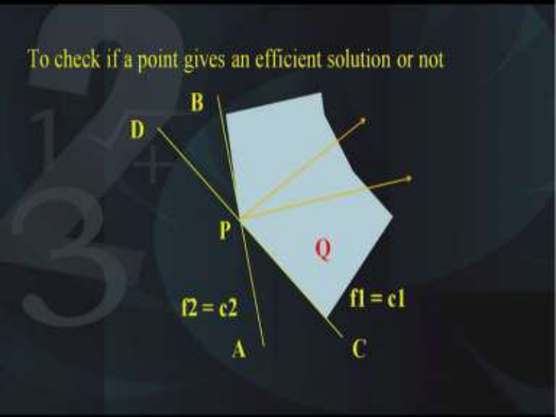

### 26.3 Worked example: three cases on one feasible region

Constraints: $x_1 + 2x_2 \geq 2$, $2x_1 - x_2 \leq 4$, $x_1 + x_2 \leq 5$, $x_1, x_2 \geq 0$. Feasible polygon ABCD with A $= (2,0)$, B $= (3,2)$, C $= (0,5)$, D $= (0,1)$.

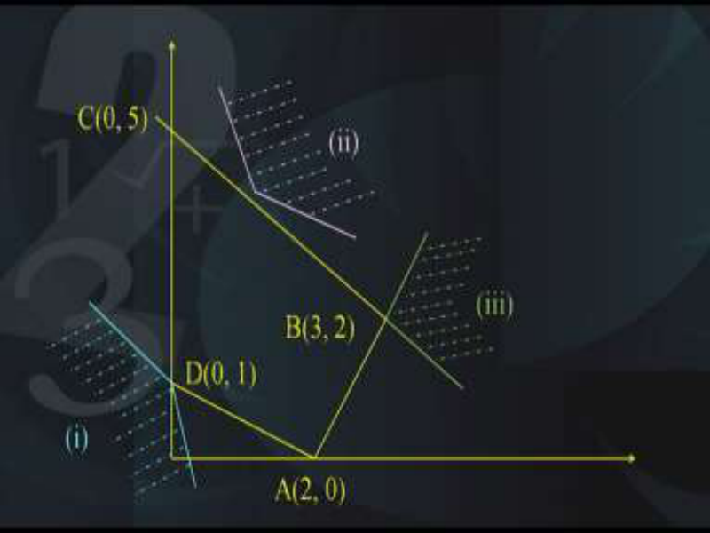
*Slide: feasible region ABCD with vertices A B C D.*

Vertex values used in the lecture:

| Vertex | Case 1 $f_1$ | Case 1 $f_2$ | Case 2 $f_1$ | Case 2 $f_2$ | Case 3 $f_1$ | Case 3 $f_2$ |

|---|---|---|---|---|---|---|

| A $(2,0)$ | $2$ | $10$ | $-4$ | $-2$ | $-4$ | $-2$ |

| B $(3,2)$ | $5$ | $19$ | $-8$ | $-7$ | $-4$ | $-5$ |

| C $(0,5)$ | $5$ | $10$ | $-5$ | $-10$ | $-5$ | $-5$ |

| D $(0,1)$ | $1$ | $2$ | $1$ | $-1$ | $-1$ | $-1$ |

- Case 1 (blue): $f_1 = x_1 + x_2$, $f_2 = 5x_1 + 2x_2$. Vertex values: $f_1$: A=2, B=5, C=5, D=1; $f_2$: A=10, B=19, C=10, D=2. Both uniquely minimized at D. So D is the **ideal** solution and also the unique efficient point (cone at D meets the feasible region only at D).
- Case 2 (pink): $f_1 = -(2x_1 + x_2)$, $f_2 = -(x_1 + 2x_2)$. $f_1$ uniquely minimized at B $(3,2)$; $f_2$ uniquely minimized at C $(0,5)$. **No ideal solution.** Cone test: with vertex anywhere on segment BC the cone has no other feasible point in common — **every point of BC is efficient**.

*Slide: cone vertex on BC showing every point of BC is efficient.*
- Case 3 (green): $f_1 = -(2x_1 - x_2)$, $f_2 = -(x_1 + x_2)$. Both minimized at B $(3,2)$, so B is ideal — but **not uniquely**: all of AB ties for $f_1$, all of BC ties for $f_2$. Only B itself is efficient (cone on AB or BC edges overlaps the feasible region). Shows efficient $\not\Rightarrow$ unique minimizer of some $f_i$.

### 26.4 Solution method: weighting (weighted sum) + epsilon-constraint note

**Weighting method.** Form $F(x) = \sum_{k=1}^p \lambda_k f_k(x)$ with $\lambda_k > 0$, minimize over the common feasible set. Theorem: any minimizer $x^0$ of $F$ is an **efficient** solution of the MOP. Proof sketch (contradiction): if some feasible $x$ dominated $x^0$ ($f_k \leq$ throughout, $<$ somewhere), then with all $\lambda_k > 0$ we would get $F(x) < F(x^0)$, contradicting minimality of $x^0$. Varying weights traces different efficient points; if all weight choices give the same point, it is the ideal solution.

Condensed worked instance (Case 2 above): $F = \lambda_1 f_1 + \lambda_2 f_2$.

*Slide: weighted-sum objective with positive weights.*

- $\lambda = (1,4)$: $F = -(2x_1+x_2) - 4(x_1+2x_2) = -6x_1 - 9x_2$; minimum (most negative) at C $(0,5)$ — efficient.
- $\lambda = (4,1)$: $F = -9x_1 - 6x_2$; minimum at B $(3,2)$ — efficient.

**Epsilon-constraint method** (listed for exam completeness; not demoed in Lec 26): keep one objective $f_r$ as the true objective and convert the rest to constraints $f_k(x) \leq \varepsilon_k$; parametric variation of $\varepsilon_k$ traces the efficient frontier (also reaches non-supported efficient points that fixed weights can miss).

Exam exercise (answers stated in lecture): Maximize $f_1 = x_1 + 2x_2$, $f_2 = 3x_1 - x_2$ s.t. $3x_1 + x_2 \leq 9$ (stated as such), $x_1 + 3x_2 \geq 18$ (note: makes the stated point set inconsistent — verify before attempting), $x_1 - x_2 \leq 3$, $x_1 + x_2 \leq 9$, $x_1,x_2 \geq 0$. Stated answers: extreme points $(3,0), (6,3), (9/2,9/2), (9/8,45/8)$; $f_1$ max $27/2$ at $(9/2,9/2)$, $f_2$ max $15$ at $(6,3)$; efficient extreme points $(6,3), (9/2,9/2)$; no ideal solution.

## Lecture 27: Dynamic Programming (DP)

### 27.0 What and why

- What: solve an $n$-variable problem as $n$ linked one-variable stages with states carrying information forward or backward.
- Why: separable returns plus one linking constraint make direct search hard, while one-variable recursion with tables or calculus is easy.
- Tools: Bellman recursion, state transformation, backward tables with traceback.

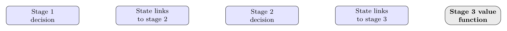

### 27.1 Principle of optimality and terminology

DP (recursive programming, Bellman 1957) breaks a decision problem into **stages** solved recursively. **Bellman's principle of optimality:** an optimal policy has the property that, whatever the initial state and first decision, the remaining decisions must be optimal with respect to the state resulting from the first decision.

Terminology:

| Term | Symbol | Meaning in Lec 27 |

|---|---|---|

| Stage | $j$ | One decision step; $n$ variables means $n$ stages |

| Decision | $u_j$ | Choice at stage $j$ |

| Return | $f_j(u_j)$ | Stage contribution; total is separable |

| State | $x_j$ | Resource used or available up to stage $j$ |

| Transformation | $x_{j-1} = t_j(x_j, u_j)$ | Link between consecutive states |

| Value function | $F_j(x_j)$ | Best return from first $j$ stages given $x_j$ |

| Policy | $(u_1, \dots, u_n)$ | Full sequence of decisions |

- **Stage** $j$: one step of the sequential decision process (often one variable $u_j$); suffix $j$ indexes stages. An $n$-variable problem is an $n$-stage problem.
- **Decision variable** $u_j$: choice made at stage $j$; **return** $f_j(u_j)$: stage contribution; total return is **separable additive** $\sum_j f_j(u_j)$ in these examples.
- **State variable** $x_j$: resource available/consumed up to stage $j$ (e.g., partial sum or product of decisions); **state transformation** $x_{j-1} = t_j(x_j, u_j)$ links consecutive states.
- **Policy:** sequence $(u_1,\dots,u_n)$; **optimal policy/value function** $F_j(x_j)$: best achievable return from the first $j$ stages given state $x_j$.
- **Backward recursion** (used throughout Lec 27): define states from $x_n$ down to $x_1$ and recurse $F_j(x_j) = \text{opt}_{u_j}[f_j(u_j) + F_{j-1}(x_{j-1})]$, $F_1(x_1) = f_1(u_1)$; **forward recursion** defines states starting from $x_1$ upward.
- Forward form starts at $x_1$ and moves to $x_n$; backward form starts at $x_n$ and moves to $x_1$. Lec 27 uses backward throughout, so traceback goes from stage $n$ back to stage 1.

General recursion for one additive constraint $a_1u_1 + \cdots + a_nu_n \geq b$ ($a_j > 0, b > 0$): states $x_n = \sum a_ju_j \geq b$, $x_{j-1} = x_j - a_ju_j$; $F_j(x_j) = \min_{u_j}[f_j(u_j) + F_{j-1}(x_{j-1})]$.

### 27.2 Worked example A: continuous, additive constraint (calculus recursion)

- Given: Minimize $z = u_1^2 + u_2^2 + u_3^2$ subject to $u_1 + u_2 + u_3 \geq 100$, $u_j \geq 0$.
- Steps: define backward states and value functions; minimize each stage by calculus; pick smallest feasible $x_3$.
- Answer: $u_1 = u_2 = u_3 = 100/3$ with minimum $10000/3$.

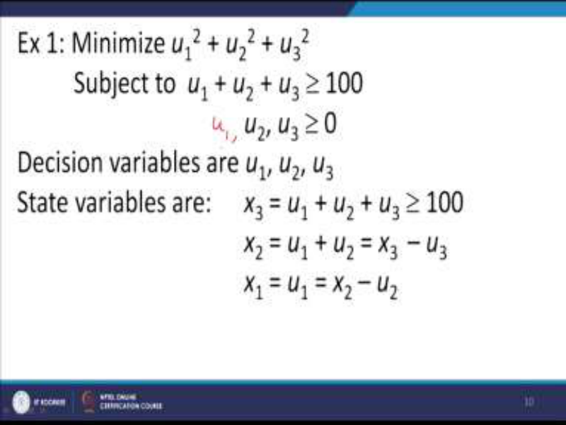
*Slide: continuous three-variable DP with sum constraint 100.*

States (backward): $x_3 = u_1+u_2+u_3 \geq 100$; $x_2 = u_1+u_2 = x_3-u_3$; $x_1 = u_1 = x_2-u_2$. Recursion: $F_1(x_1) = u_1^2 = x_1^2$; $F_2(x_2) = \min_{u_2}[u_2^2 + (x_2-u_2)^2]$; $F_3(x_3) = \min_{u_3}[u_3^2 + F_2(x_3-u_3)]$.

1. $F_2$: derivative $2u_2 - 2(x_2-u_2) = 0 \Rightarrow u_2 = x_2/2$, so $F_2(x_2) = x_2^2/2$.
2. $F_3$: $\min_{u_3}[u_3^2 + (x_3-u_3)^2/2]$; derivative $2u_3 - (x_3-u_3) = 0 \Rightarrow u_3 = x_3/3$, so $F_3(x_3) = x_3^2/3$.
3. Since $x_3 \geq 100$, minimum at smallest feasible $x_3 = 100$: $F_3 = 100^2/3 = 10000/3$, with $u_1 = u_2 = u_3 = 100/3$. (Note: the lecture audio states "1000" here, which is arithmetic slip; the correct value from its own recursion is $10000/3 \approx 3333.3$.)

### 27.3 Worked example B: discrete study-allocation (tabular backward recursion)

- Given: 3 days for courses A, B, C in whole days; grade table below; maximize total grade subject to $u_1 + u_2 + u_3 \leq 3$.
- Steps: build stage-return table; build state-transformation table; recurse $F_2$ then $F_3$; trace bold entries backward.
- Answer: **A: 1 day, B: 0 days, C: 2 days; max total grade 5.**

*Slide: estimated grades for 0 to 3 study days in A B C.*

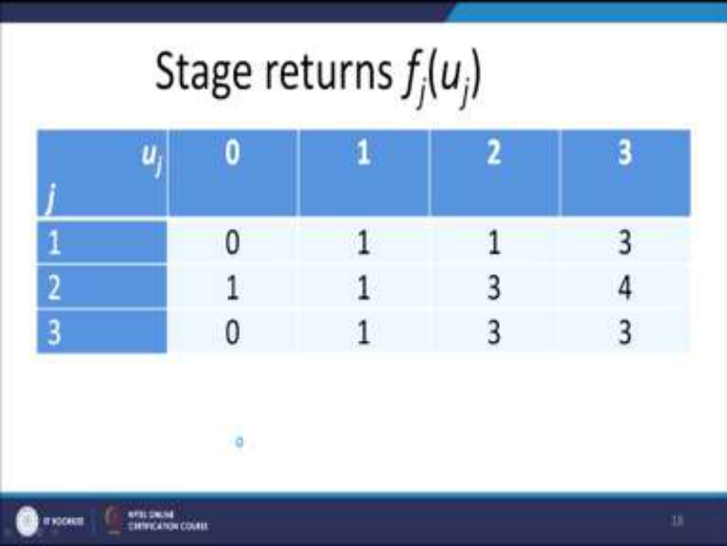
*Slide: stage-return values $f_j(u_j)$ used in the recursion.*

Student has 3 days for courses A, B, C (whole days only). Grade table $f_j(u_j)$:

| $u_j \backslash j$ | A (1) | B (2) | C (3) |

|---|---|---|---|

| 0 | 0 | 1 | 0 |

| 1 | 1 | 1 | 1 |

| 2 | 1 | 3 | 3 |

| 3 | 3 | 4 | 3 |

Maximize $f_1(u_1)+f_2(u_2)+f_3(u_3)$ s.t. $u_1+u_2+u_3 \leq 3$, $u_j \geq 0$ integers (discrete, $\leq$ constraint — unlike Example A).

States: $x_3 = u_1+u_2+u_3 \leq 3$, $x_2 = x_3-u_3$, $x_1 = x_2-u_2$; recursion $F_j(x_j) = \max_{u_j}[f_j(u_j) + F_{j-1}(x_{j-1})]$, $F_1(x_1) = f_1(u_1)$.

- Stage 2 table ($x_2 = 0..3$): $F_2 = (1, 2, 4, 5)$ computed as max over feasible $u_2$ of $f_2(u_2)+F_1(x_2-u_2)$.
- Stage 3 table: $F_3(x_3 \leq 3) = \max = 5$, attained at $u_3 = 2$ with $x_2 = 1$, then $u_2 = 0$, $u_1 = 1$ (trace bold/red entries backward).
- Optimal policy: **A: 1 day, B: 0 days, C: 2 days; max total grade 5.**

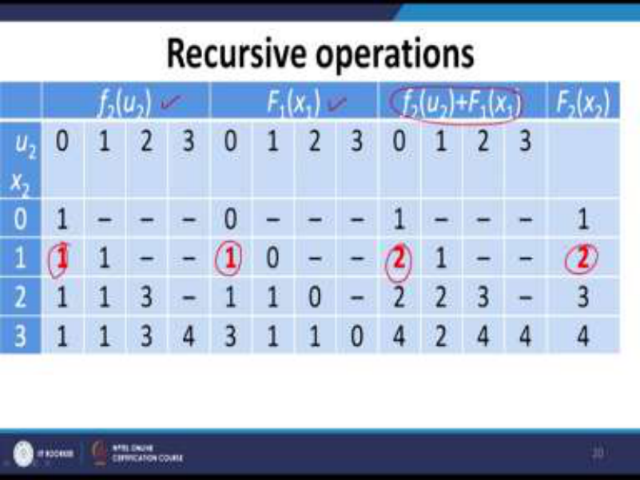

### 27.4 Worked example C: multiplicative constraint (state = product)

- Given: Maximize $u_1^2+u_2^2+u_3^2$ subject to $u_1u_2u_3 \leq 6$, $u_j$ positive integers.
- Steps: define product states $x_3$, $x_2 = x_3/u_3$, $x_1 = x_2/u_2$; build square-return and division tables; recurse and trace red entries backward.
- Answer: **max 38 at $(6,1,1)$** with symmetric alternates $(1,6,1)$ and $(1,1,6)$.

*Slide: stage 3 recursion table leading to maximum 38.*

Minimize-form recursion adapts to $\prod_j u_j \geq k$ by replacing partial sums with partial products: $x_n = u_n\cdots u_1 \geq k$, $x_{j-1} = x_j/u_j$, same $F_j(x_j) = \text{opt}_{u_j}[f_j(u_j)+F_{j-1}(x_{j-1})]$.

Instance (from lecture): Maximize $u_1^2+u_2^2+u_3^2$ subject to $u_1u_2u_3 \leq 6$, $u_j$ positive integers.

States: $x_3 = u_1u_2u_3 \leq 6$, $x_2 = x_3/u_3$, $x_1 = x_2/u_2 = u_1$; stage returns $f_j = u_j^2 \in \{1,4,9,16,25,36\}$; build $x_{j-1} = x_j/u_j$ tables (infeasible divisions dashed) and recurse forward-maximizing. Result: **max 38 at $(u_1,u_2,u_3) = (6,1,1)$** (trace red entries backward); symmetric alternates $(1,6,1)$, $(1,1,6)$ also optimal since $36+1+1 = 38$.

(No shortest-path / cargo-loading / resource-allocation examples appear in Lec 27 — the lecture covers only the separable-additive continuous, discrete study-day, and multiplicative-product cases above.)

## Key exam takeaways

### When to use each method

- **Integer Programming:** decision variables must take whole values (trees, machines, people). LP relaxation + rounding is unsafe — use B&B (general, enumerates via LP bounds) or Gomory cuts (pure IPP, needs simplex tableau fractions). For mixed IPP, branch only on integral variables.
- **Goal Programming:** a target value is set *before* solving and deviations are minimized (soft goal + hard real constraints). Use deviational pair $u, v$ with $u \cdot v = 0$; never allow $u, v$ basic together in simplex.
- **Multi-Objective Programming:** several conflicting objectives share constraints; no single optimum usually exists — answer is the **efficient (Pareto) set**. Scalarize via **weighted sum** ($\lambda_k > 0$ guarantees efficiency) or **epsilon-constraint** (one objective + bounds on the rest).
- **Dynamic Programming:** problem decomposes into stages with states linking decisions (separable returns, one linking constraint). Write states + transformation + $F_j$ recursion, solve backward (calculus for continuous, tables for discrete).

### Common formulation traps

1. Forgetting $u \cdot v = 0$ (or $u_k v_k = 0$) in GP; penalizing the wrong side of a goal (e.g., minimizing $v$ when only shortfall matters).
2. Confusing preemptive (lexicographic, multiple $F_i$) with weighted (single $F$) GP; weights must be non-negative and scale-comparable.
3. Branching on continuous variables in mixed IPP; pruning a B&B node with the wrong inequality direction (max: prune if bound $\leq$ incumbent).
4. Writing a Gomory cut with the inequality reversed ($\sum \hat{a}_j x_j \geq \hat{b}$, not $\leq$); forgetting surplus/artificial variables on re-solve.
5. Calling any multi-objective optimum "ideal" — ideal needs *all* objectives optimal at one point; otherwise report efficient points/segments (e.g., segment BC, not a single vertex).
6. In DP, mismatching recursion direction and state definition (sums: $x_{j-1} = x_j - a_ju_j$; products: $x_{j-1} = x_j/u_j$) and applying calculus minimization to discrete tables.

### Comparison table

| Aspect | Integer Programming (Lec 24) | Goal Programming (Lec 25) | Multi-Objective Programming (Lec 26) | Dynamic Programming (Lec 27) |

|---|---|---|---|---|

| Decision variables | Same as LP + integrality ($x_i \in \mathbb{Z}$, all or subset) | LP variables + deviation pairs $(u_k, v_k \geq 0)$ per goal | Shared $x$ across $p$ objectives | Stage decisions $u_j$ + states $x_j$ |

| Objective handling | Single $z$ unchanged; feasible set shrinks to lattice | Replace $z$ by deviation minimizing $F$ (weighted sum or lexicographic $F_1, F_2, \dots$) | Keep vector $(f_1,\dots,f_p)$; scalarize only to search (weights / $\varepsilon$-bounds) | Separable stage returns $\sum f_j(u_j)$ via value functions $F_j(x_j)$ |

| Solution technique | B&B tree (branch on fractions, bound, fathom) or Gomory cuts from fractional simplex rows | Modified simplex with $u,v$ complementarity; graphical check for 2-D | Efficiency-cone test; weighting theorem; report efficient set (ideal if coincident) | Backward recursion (calculus or stage tables), trace back optimal policy |
