# Module 4: Transportation, Assignment and Sequencing (Lectures 28-35)

- Lec 28: Transportation formulation, balanced vs unbalanced, IBFS (NW-corner, Least-cost, VAM), loop, MODI/u-v optimality test
- Lec 29: Assignment formulation, Hungarian method, worked 5x5 example, unbalanced/maximization variants
- Lec 30: Case studies — multi-objective ideal vs efficient, branch-and-bound integer example, wheat transportation NW-corner, quiz bank
- Lec 31: Sequencing basics + n jobs x 2 machines (Johnson's rule + full worked example)
- Lec 32: n jobs x 3 machines (reducibility conditions + G/H reduction + example)
- Lec 33: 2 jobs x m machines (graphical method + example)
- Lec 34: n jobs x m machines (generalized conditions + two worked examples)
- Lec 35: Sequencing revision examples (tie-breaking, 3-machine, graphical) + quiz bank
- Key exam takeaways

## Lec 28 — Transportation Problem: Formulation and Algorithm

### 0. What and why

- What: a special LPP for shipping a product from $m$ sources to $n$ destinations at minimum cost.
- Why: factory-to-warehouse, wheat-to-city, and similar distribution problems recur in exams.
- Pipeline: check balance → find IBFS by one of three methods → test optimality by MODI → improve by loop → repeat.

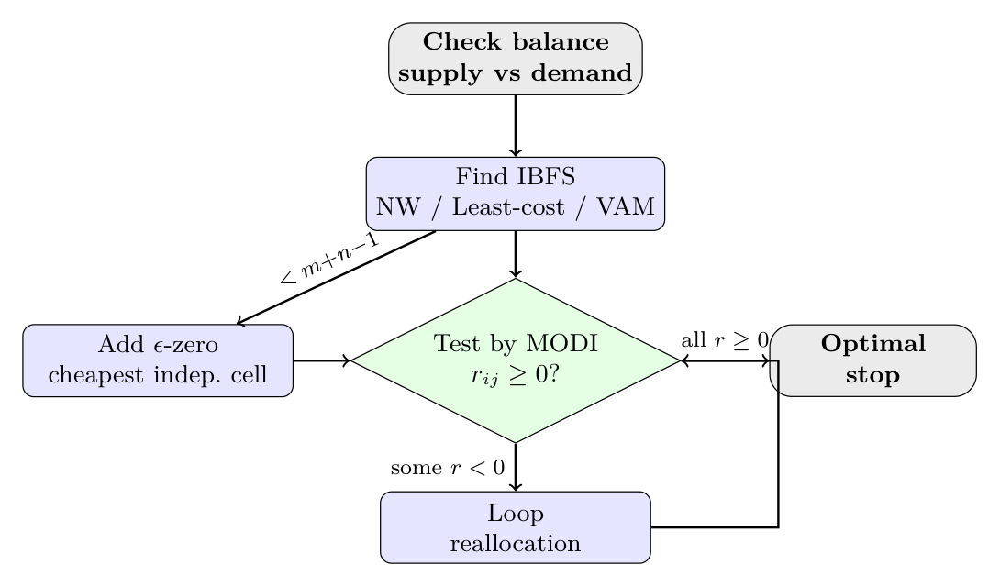

### 1. Definition and LP model

- $m$ origins $O_1 \dots O_m$ with supply $a_i > 0$; $n$ destinations $D_1 \dots D_n$ with demand $b_j > 0$.
- Unit cost $c_{ij}$ from $i$ to $j$; decision $x_{ij}$ = units shipped, $x_{ij} \ge 0$ (integer in statement, LP gives integer at basic solutions when $a_i,b_j$ integers).
- Primal:

$$ \min Z = \sum_{i=1}^{m}\sum_{j=1}^{n} c_{ij}x_{ij} $$

$$\sum_{j} x_{ij} = a_i \quad \forall i \quad \text{(availability / row sums)}$$

$$\sum_{i} x_{ij} = b_j \quad \forall j \quad \text{(demand / column sums)}$$

- Only $m+n-1$ constraints are linearly independent.
- Balanced if $\sum_i a_i = \sum_j b_j$; otherwise unbalanced.
- Unbalanced fix: add dummy source (if demand > supply) or dummy destination (if supply > demand) with zero costs, quantity = imbalance.

### 2. Dual and optimality logic (MODI basis)

- Dual: $\max \sum_i a_i u_i + \sum_j b_j v_j$ subject to $u_i + v_j \le c_{ij}$ for all $i,j$.
- Complementary slackness: $x_{ij}(u_i+v_j-c_{ij}) = 0$.
- Hence for basic cells ($x_{ij} > 0$): $u_i + v_j = c_{ij}$.
- For non-basic cells define opportunity cost $r_{ij} = c_{ij} - u_i - v_j$. Optimal iff all $r_{ij} \ge 0$ (minimization).

### 3. Transportation algorithm (4 steps)

1. Find an initial BFS (IBFS).
2. Test for optimality (u-v / MODI or stepping-stone).
3. Improve (loop reallocation) if not optimal.
4. Repeat 2-3 until optimal.

### 4. Method A — Northwest-corner rule

1. Start at cell $(1,1)$. Allocate $\min(a_i,b_j)$.
2. If supply exhausted, move down $(i+1,j)$; if demand exhausted, move right $(i,j+1)$; if both ($a_i=b_j$), allocate and move diagonally to $(i+1,j+1)$.
3. Repeat until all supply/demand met.

Condensed worked example (same cost set used for all three IBFS methods in lecture):

Supplies $a = [7,9,18]$, demands $b=[5,8,7,14]$, total $34$ (balanced). Relevant costs: $c_{11}=19, c_{12}=30, c_{22}=30, c_{23}=40, c_{33}=70, c_{34}=20$.

|  | D1(5) | D2(8) | D3(7) | D4(14) | Supply |
|---|---|---|---|---|---|
| S1(7) | **5** (19) | **2** (30) | — | — | 7 |
| S2(9) | — | **6** (30) | **3** (40) | — | 9 |
| S3(18) | — | — | **4** (70) | **14** (20) | 18 |

$$Z_{NW} = 5(19)+2(30)+6(30)+3(40)+4(70)+14(20) = 1015$$

Ignores costs; easiest but usually worst cost.

### 5. Method B — Least-cost (minimum-cell-cost) method

1. Pick globally smallest $c_{ij}$ among uncrossed rows/columns; allocate $\max$ possible.
2. Cross out satisfied row or column (if both satisfied together, cross only one — other keeps a zero allocation; prevents degeneracy).
3. If smallest cost ties, choose cell allowing larger allocation.
4. Adjust remainders, repeat.

On same example: first $(3,2)$ cost $8$, allocate $8$ (meets D2, S3: $18\to10$, strike D2); next $(1,4)$ cost $10$, allocate $7$ (exhausts S1); next $(3,4)$ cost $20$, allocate $7$ (meets D4); next tie at cost $40$: choose $(2,3)$ (larger allocation), etc. Lecture result:

$$Z_{LC} = 814$$

Better than NW-corner, worse than VAM here.

### 6. Method C — Vogel's Approximation (VAM / penalty method)

- What: penalty-based IBFS that prefers rows or columns where avoiding the second-best cost hurts most.
- Why: usually gives the lowest IBFS cost of the three methods, so fewer MODI iterations.

1. For each row/column compute penalty = (second-smallest cost − smallest cost).
2. Select row/column with largest penalty; allocate as much as possible to its least-cost cell (tie: larger allocation).
3. Adjust, cross out satisfied row/column (one only if both met; zero-demand/supply rows/columns excluded from future penalties).
4. Recompute penalties on remainder; repeat.

On same example:

- Given: same $3 \times 4$ costs, supplies $[7,9,18]$, demands $[5,8,7,14]$.
- Steps from transcript: round 1 max penalty $=22$ at column D2, so allocate $(3,2)$ cost $8$ with $8$ units, S3 $18 \to 10$, strike D2.
- Steps: round 2 recompute without D2, max penalty $=21$ at row S1, so allocate $(1,1)$ cost $19$ with $5$ units.
- Answer: continue to completion, giving:

$$Z_{VAM} = 5(19)+2(10)+7(40)+2(60)+8(8)+10(20) = 779$$

Best of the three IBFS values ($779 < 814 < 1015$). Typical exam trap: VAM is usually closest to optimum but not guaranteed optimal.

### 7. Loop and optimality improvement

- Loop: sequence of cells where consecutive pair share a row or column, no three consecutive share a row/column, first and last share a row/column, no cell repeated. Example from lecture: $(1,2),(1,4),(2,4),(2,6),(4,6),(4,2)$ is a loop.
- Second lecture point: a row or column may contain more than two loop cells in total, but no more than two may be consecutive.
- Use: when a non-basic cell has $r_{ij}<0$, form its unique loop with basic cells, shift $\theta$ = minimum allocation at even (minus) corners, add/subtract alternately.
- Stepping-stone vs MODI: stepping-stone evaluates each empty cell by its loop cost change directly; MODI evaluates all empty cells at once via $u_i,v_j$ and $r_{ij}=c_{ij}-u_i-v_j$. Lecture works MODI in detail.
- Degeneracy: BFS needs exactly $m+n-1$ occupied cells. If fewer (simultaneous row+column exhaustion), place $\epsilon$ (zero allocation) in a least-cost independent cell not forming a loop.

### 8. MODI / u-v worked illustration (second dataset in lecture)

Lecture applies NW-corner then u-v iterations to a separate problem, ending at optimum:

$$Z^* = 6(17)+3(21)+6(30)+9(14)+4(19)+3(0) = 547$$

Procedure shown:

1. Separate basic vs non-basic cells.
2. Set one dual arbitrarily (lecture sets $u_2=0$), solve $u_i+v_j=c_{ij}$ for basics: e.g. $(2,2)\to v_2=18$, $(2,3)\to v_3=19$, $(2,4)\to v_4=31$, $(1,2)\to u_1=-1$, $(1,1)\to v_1=46$, $(3,4)\to u_3=-31$.
3. Compute $r_{ij}=c_{ij}-u_i-v_j$ for non-basics: lecture gets $+3, 0, -32, -15, +13, +12$. Negative $\to$ not optimal; iterate.
4. After 3 iterations all $r_{ij}\ge 0$.

- Given: NW-corner BFS on the second dataset is the starting point.
- Steps: iteration 1 table above, iteration 2 re-solve $u,v$ and reallocate by loop, iteration 3 repeat until all $r_{ij} \ge 0$. Lecture shows tables without reading every number aloud, so verify by repeating MODI.
- Answer: optimum above with $Z^*=547$.

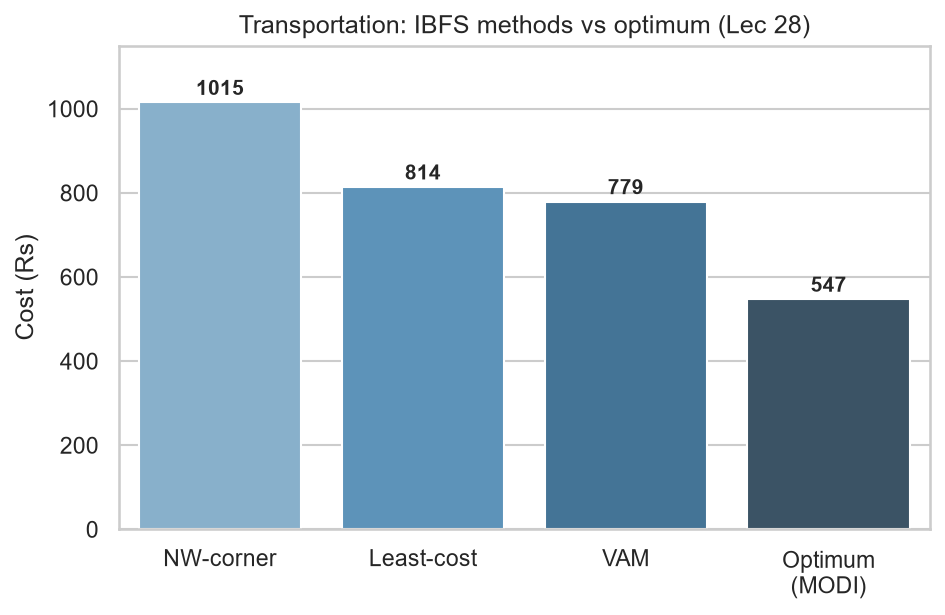

Lecture exercise: 3 origins x 4 destinations, total supply = demand = $140$ (balanced), minimize — left for practice.

Key slide images:

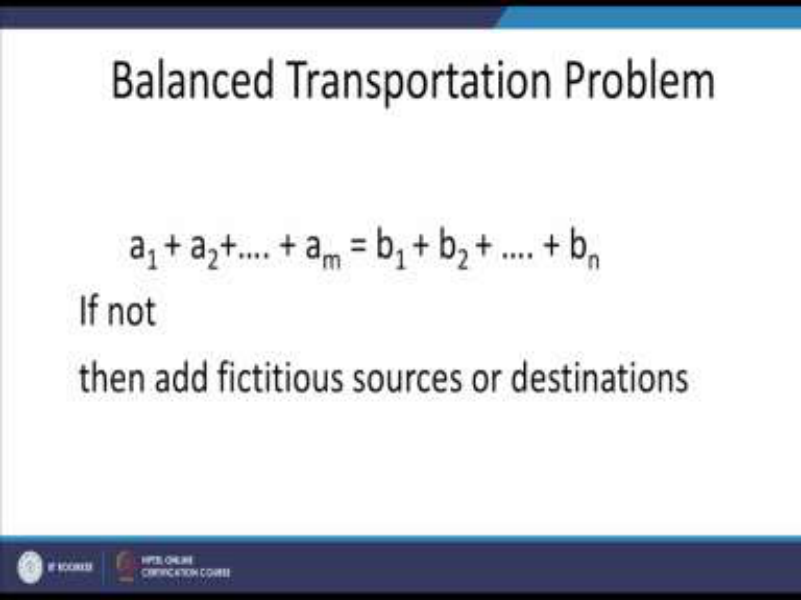
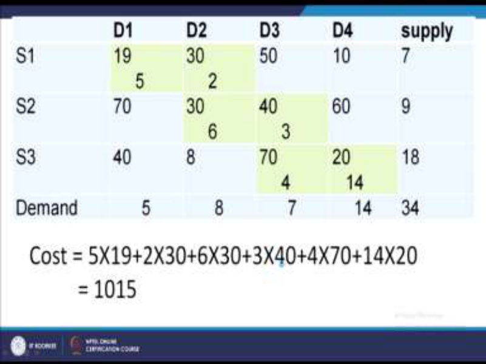
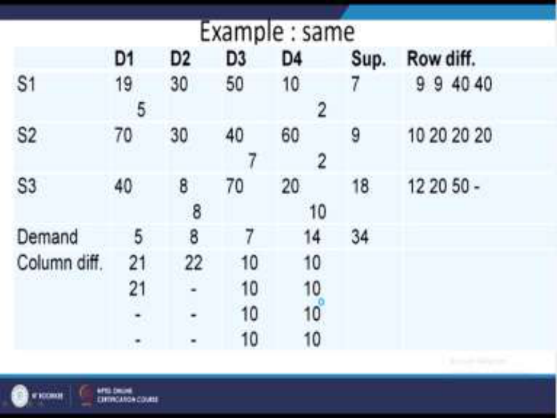
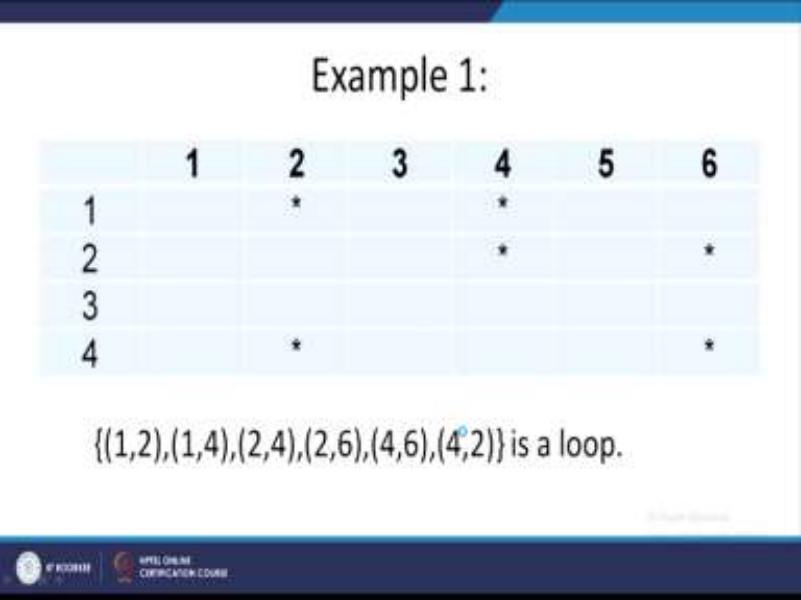
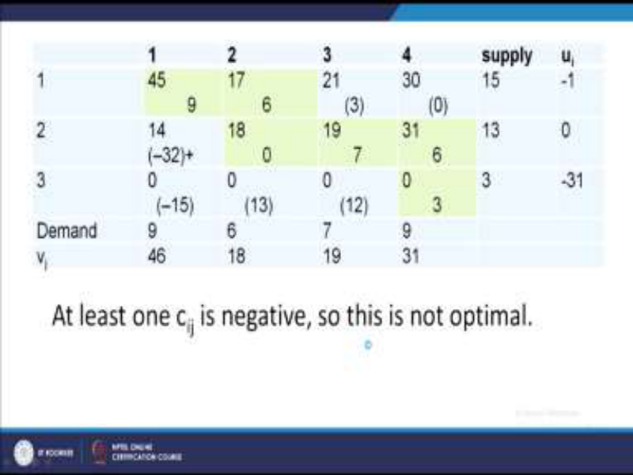

## Lec 29 — Assignment Problem

### 0. What and why

- What: square one-to-one assignment, a transportation problem with $m=n$ and all supplies and demands $=1$.
- Why: workers to jobs, subordinates to tasks, machines to operations at minimum cost or time.

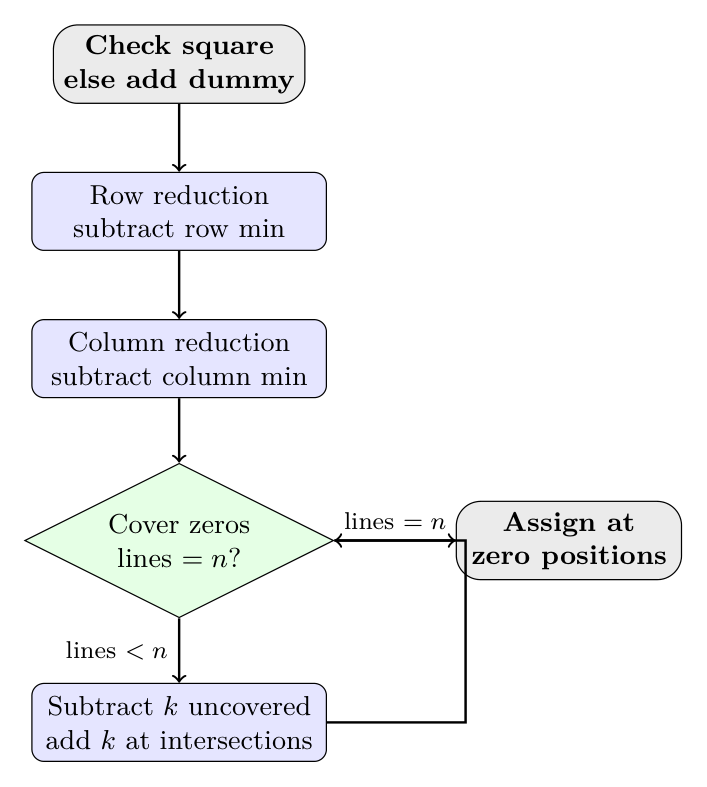

### 1. Formulation as special transportation problem

- $m=n$ and all $a_i=b_j=1$.
- $$\min f=\sum_i\sum_j c_{ij}x_{ij}$$ subject to $\sum_j x_{ij}=1$, $\sum_i x_{ij}=1$, $x_{ij}\in\{0,1\}$.
- Story: $n$ workers $W_i$ to $n$ jobs $J_j$, $c_{ij}$ cost of $i\to j$; each worker one job, each job one worker.
- Unbalanced ($rows \ne cols$): add dummy row/column with zero costs.
- Maximization variant (not numerically worked in lecture, standard): convert by $c'_{ij}=\max c - c_{ij}$ or multiply by $-1$, then minimize.

### 2. Key theorem

If $c'_{ij}=c_{ij}-u_i-v_j$ for arbitrary $u_i,v_j$, and $X^0$ minimizes $\sum\sum c'_{ij}x_{ij}$, it also minimizes $\sum\sum c_{ij}x_{ij}$. So subtracting row/column constants preserves the optimal assignment. This justifies Hungarian reduction.

### 3. Hungarian method — numbered steps

1. Row reduction: subtract each row's minimum from that row.
2. Column reduction: subtract each column's minimum from that column.
3. Cover all zeros with minimum horizontal+vertical lines:
   - (a) scan rows: if a row has exactly one uncovered zero, mark it and draw vertical line through its column (skip rows with $>1$ zero);
   - (b) if all zeros covered go to step 4, else scan columns similarly (draw horizontal line through row of a single zero).
4. Optimality: if number of lines $=n$, done — assign at zero positions. Else:
   - (a) let $k$ = smallest uncovered entry; subtract $k$ from every uncovered entry;
   - (b) add $k$ to every intersection of covering lines;
   - (c) leave other (singly-covered) entries unchanged. Return to step 3.

### 4. Fully worked 5x5 example

Original cost matrix (reconstructed from lecture's row minima $7,6,6,8,5$ and column-4 extra $2$):

|  | J1 | J2 | J3 | J4 | J5 |
|---|---|---|---|---|---|
| W1 | 8 | 10 | 14 | 12 | 7 |
| W2 | 6 | 16 | 13 | 12 | 10 |
| W3 | 12 | 11 | 6 | 8 | 7 |
| W4 | 11 | 8 | 13 | 12 | 8 |
| W5 | 5 | 10 | 15 | 9 | 14 |

After row minus min, then column-4 minus $2$:

|  | J1 | J2 | J3 | J4 | J5 |
|---|---|---|---|---|---|
| W1 | 1 | 3 | 7 | 3 | 0 |
| W2 | 0 | 10 | 7 | 4 | 4 |
| W3 | 6 | 5 | 0 | 0 | 1 |
| W4 | 3 | 0 | 5 | 2 | 0 |
| W5 | 0 | 5 | 10 | 2 | 9 |

Cover: verticals at J1 (W2), J2 (W4), J5 (W1); horizontal at row 3 (J3/J4 zero). Total lines $=4<5$, not optimal. Smallest uncovered $=2$ (uncovered entries are $7,3,7,4,5,2,10,2$). Subtract $2$ from uncovered, add $2$ at 3 intersections (row-3 x cols 1,2,5):

|  | J1 | J2 | J3 | J4 | J5 |
|---|---|---|---|---|---|
| W1 | 1 | 3 | 5 | 1 | 0 |
| W2 | 0 | 10 | 5 | 2 | 4 |
| W3 | 8 | 7 | 0 | 0 | 3 |
| W4 | 3 | 0 | 3 | 0 | 0 |
| W5 | 0 | 5 | 8 | 0 | 9 |

Now 5 lines cover zeros $=n$ — optimal. Assign at zeros:

- W1 $\to$ J5 (7), W2 $\to$ J1 (6), W3 $\to$ J3 (6), W4 $\to$ J2 (8), W5 $\to$ J4 (9).

$$Z^* = 7+6+6+8+9 = 36$$

### 5. Lecture exercise

- Given: 4 subordinates A-D x tasks 1-4, hours table in slides.
- Steps: apply same Hungarian row reduction, column reduction, cover zeros, adjust.
- Answer stated: A$\to$1, B$\to$3, C$\to$2, D$\to$4; total $41$ hours. Solve by same Hungarian steps.

Key slide images:

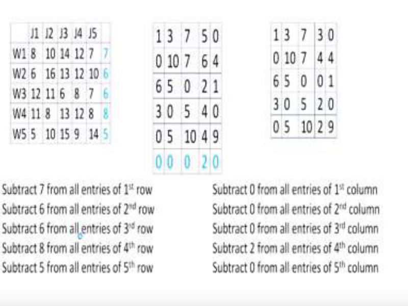

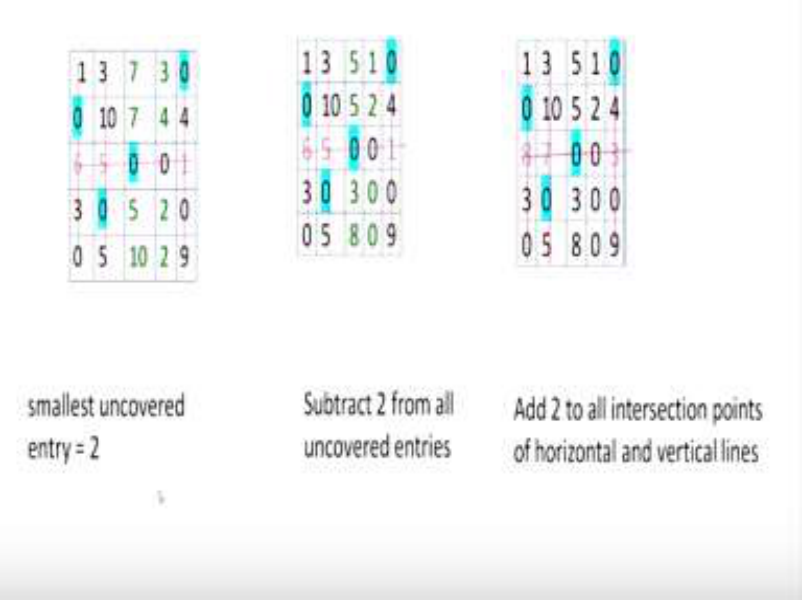

## Lec 30 — Case Studies and Quiz (Transport + Earlier Modules)

Only the transportation case belongs to Module 4; other two summarized briefly since quiz draws on them.

### 1. Multi-objective example (background)

Max $f_1=5x_1+4x_2$, max $f_2=3x_1-2x_2$ s.t. $x_1+2x_2\le 4$, $-x_1+x_2\le 1$, $x_1,x_2\ge 0$. Vertices O$(0,0)$, A$(4,0)$, B$(2/3,5/3)$, C$(0,1)$. $f_1$: $0,20,10,4$; $f_2$: $0,12,-4/3,-2$. Both max at A, so A is ideal solution; O,B,C are efficient (non-dominated).

### 2. Branch-and-bound integer example (background)

Max $Z=x_1+x_2$ s.t. $3x_1+2x_2\le 5$, $x_2\le 2$, $x_1,x_2\ge 0$ integers. LP0 optimum B$(1/3,2)$, $Z=7/3$. Branch $x_1\le 0$ (LP01: segment OA, optimum $(0,2)$, $Z=2$) and $x_1\ge 1$ (LP02: optimum $(1,1)$, $Z=2$). Both integer (fathomed) with $Z=2$ — two alternate optima.

### 3. Transportation case study — wheat (Punjab/Haryana/UP to Delhi/Mumbai/Chennai/Kolkata)

|  | Delhi(8) | Mumbai(5) | Chennai(4) | Kolkata(4) | Supply |
|---|---|---|---|---|---|
| Punjab(9) | 20 | 50 | 40 | 60 | 9 |
| Haryana(7) | 16 | 30 | 45 | 40 | 7 |
| UP(5) | 14 | 8 | 30 | 15 | 5 |

Check balanced: $9+7+5=21=8+5+4+4$.

NW-corner allocations: $(P,Delhi)=8$, $(P,Mumbai)=1$, $(H,Mumbai)=4$, $(H,Chennai)=3$, $(UP,Chennai)=1$, $(UP,Kolkata)=4$.

$$Z_{NW}=20(8)+50(1)+30(4)+45(3)+30(1)+15(4)=505$$

Lecture leaves Least-cost and VAM on same data as exercise — compute and compare (expect lower cost).

### 4. Lec-30 quiz with answers, all 15 questions

Module-4 questions state question plus answer. Other-module questions state question plus answer plus a pointer to the right module.

- Q1: feasible region of an IP is non-convex. Answer: True. Pointer: integer programming module, not Module 4.
- Q2: node containing all-integer solutions is called a ____ node. Answer: fathomed node. Pointer: branch-and-bound module.
- Q3: infeasible node is called a ____ node. Answer: pruned node. Pointer: branch-and-bound module.
- Q4: solution of a goal programming problem is always integer. Answer: False. Pointer: goal programming module.
- Q5: to achieve the goal as closely as possible, minimize the ____ from the goal. Answer: deviations. Pointer: goal programming module.
- Q6: branch-and-bound is an efficient method for goal programming. Answer: False. Pointer: goal programming module.
- Q7: Gomory cutting plane is an efficient method for goal programming. Answer: False. Pointer: goal programming module.
- Q8: if $X^0$ is a unique minimizer of one $f_i$ in MOP, then $X^0$ is efficient but converse is false. Answer: True. Pointer: multi-objective module.
- Q9: state Bellman's principle of optimality. Answer: an optimal policy has the property that whatever the initial state and initial decisions are, the remaining decisions must constitute an optimal policy with regard to the state resulting from the first decision. Pointer: dynamic programming module.
- Q10: dynamic programming is also called recursive programming. Answer: True. Pointer: dynamic programming module.
- Q11: transportation problem is a special type of LPP. Answer: True.
- Q12: balanced $4 \times 5$ transportation, independent equations $=m+n-1=8$. Answer: $8$.
- Q13: assignment is a special case of transportation. Answer: True.
- Q14: number of persons must equal number of jobs. Answer: True for the balanced statement, else add dummy.
- Q15: optimum when minimum covering lines $=$ number of jobs. Answer: True.

Key slide images:

## Lec 31 — Sequencing: n Jobs x 2 Machines (Johnson's Rule)

### 0. What and why

- What: choose one job order for two machines A then B so total elapsed time $T$ is minimum.
- Why: computer jobs, factory jobs, cloth weaving then starching then printing all need least idle time.
- Lecture covers four sequencing cases across lec31-34: $n \times 2$, $n \times 3$, $2 \times m$, $n \times m$.

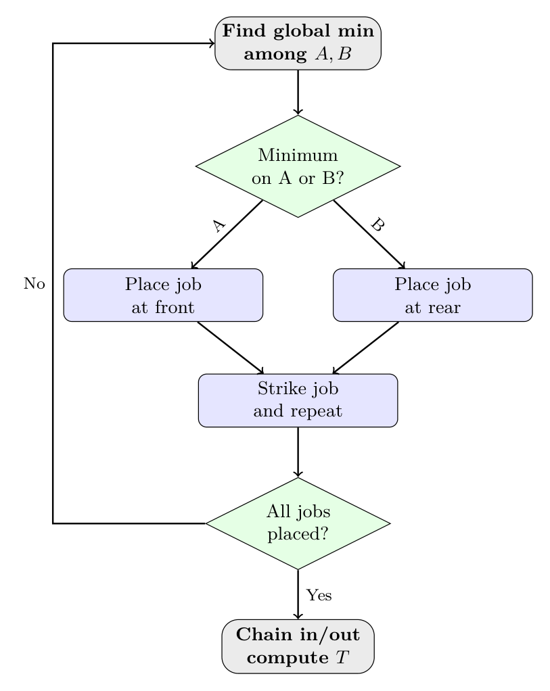

### 1. Terminology

- Jobs $J_1\dots J_n$, machines A,B,... Processing order = fixed machine order per job (e.g. AB means A then B).
- Processing time = $A_i,B_i$.
- Idle time = time a machine is idle before all jobs finish.
- $X_{ij}$ = idle of machine $j$ between job $i-1$ end and job $i$ start.
- Total elapsed time $T$ = start of first job to end of last job (including idle).
- No-passing rule: same job sequence on every machine.
- Assumptions:
  - One job per machine at a time.
  - No preemption once started.
  - One job on one machine at a time.
  - Operations sequential.
  - Times independent of order.
  - One machine of each type.
  - All jobs ready at $t=0$.
  - Transfer time negligible.

### 2. Johnson's rule (1954) — numbered steps

Let $A_i,B_i$ be times of job $i$ on A,B.

1. Find overall minimum among all $A_i,B_i$.
2. If min is $A_k$: place job $k$ first (earliest free front slot). If min is $B_r$: place job $r$ last (latest free rear slot).
3. Ties: if $A_k=B_r$, put $k$ first and $r$ last. If tie among $A$'s, pick the one with smaller $B$ first; if tie among $B$'s, pick the one with smaller $A$ last.
4. Cross out assigned job(s); repeat on remainder, filling front-to-back / back-to-front until all placed.

### 3. Worked example

Times (hours): A $=[5,1,9,3,10]$, B $=[2,6,7,8,4]$ for jobs 1-5, order AB.

| Job | 1 | 2 | 3 | 4 | 5 |
|---|---|---|---|---|---|
| A | 5 | 1 | 9 | 3 | 10 |
| B | 2 | 6 | 7 | 8 | 4 |

Iterations: min $=1=A_2\to$ job 2 first $[\,2,\_,\_,\_,\_\,]$. Remaining min $=2=B_1\to$ job 1 last $[\,2,\_,\_,\_,1\,]$. Remaining min $=3=A_4\to$ job 4 second $[\,2,4,\_,\_,1\,]$. Remaining $\{3,5\}$: min $=4=B_5\to$ job 5 before last $[\,2,4,\_,5,1\,]$. Leftover job 3 middle.

Optimal sequence: **2-4-3-5-1**.

Elapsed/idle table (Time-in/out):

| Seq | A: in-out | B: in-out |
|---|---|---|
| J2 | 0-1 | 1-7 |
| J4 | 1-4 | 7-15 |
| J3 | 4-13 | 15-22 |
| J5 | 13-23 | 23-27 |
| J1 | 23-28 | 28-30 |

$T=30$ h. Machine A idle $30-28=2$ h (end). Machine B idle $(0\!-\!1)+(22\!-\!23)+(27\!-\!28)=1+1+1=3$ h.

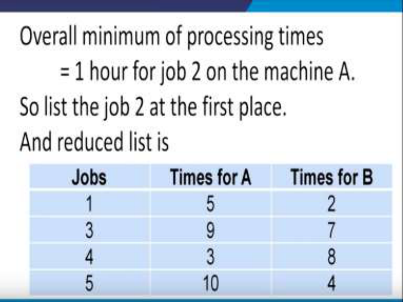
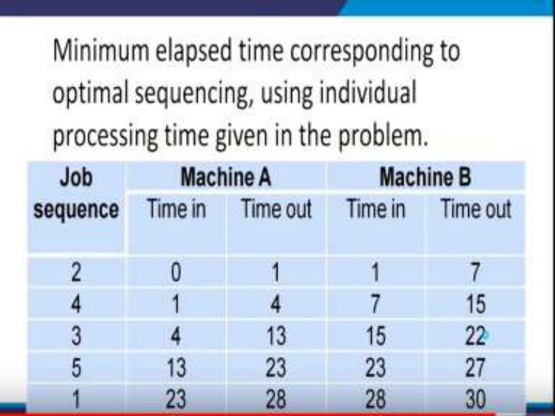

## Lec 32 — n Jobs x 3 Machines

### 0. What and why

- What: $n$ jobs through A then B then C.
- Why: no general Johnson method exists, so check dominance conditions and reduce to two fictitious machines G and H.
- Assumptions from lecture: three machines A, B, C; fixed order ABC; no passing or transfer change; exact processing times known.

### 1. Reducibility conditions

Machines A,B,C, order ABC. No general method; reduce to 2-machine case only if at least one holds:

$$\min_i A_i \ge \max_i B_i \quad \text{or} \quad \min_i C_i \ge \max_i B_i$$

If neither holds, method fails.

### 2. Reduction

Fictitious machines G,H with $G_i = A_i+B_i$, $H_i = B_i+C_i$. Solve GH in order GH by Johnson's rule; that sequence is optimal for ABC.

### 3. Worked example

| Job | 1 | 2 | 3 | 4 | 5 |
|---|---|---|---|---|---|
| A | 8 | 10 | 6 | 7 | 11 |
| B | 5 | 6 | 2 | 3 | 4 |
| C | 4 | 9 | 8 | 6 | 5 |

$\min A=6$, $\max B=6$, $\min C=4$. First condition holds ($6\ge 6$), so reduce:

| Job | 1 | 2 | 3 | 4 | 5 |
|---|---|---|---|---|---|
| G=A+B | 13 | 16 | 8 | 10 | 15 |
| H=B+C | 9 | 15 | 10 | 9 | 9 |

Johnson on G/H gives multiple optima due to ties, e.g. 3-2-1-4-5 (also 3-2-4-1-5, 3-2-4-5-1, 3-2-5-4-1, 3-2-1-5-4, 3-2-5-1-4).

Elapsed time for 3-2-1-4-5 (A/B/C in-out chained from lecture table): $T=51$ h.

Exam trap stressed in lecture: all alternate optima give **same** elapsed time but **different** individual-machine idle times.

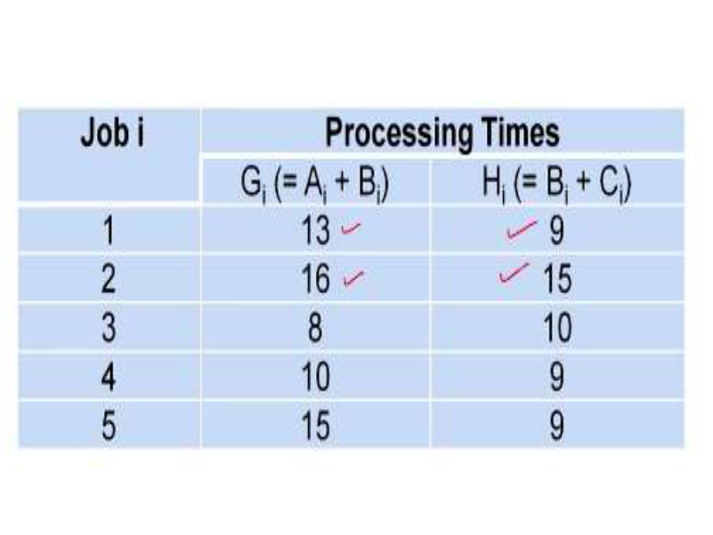
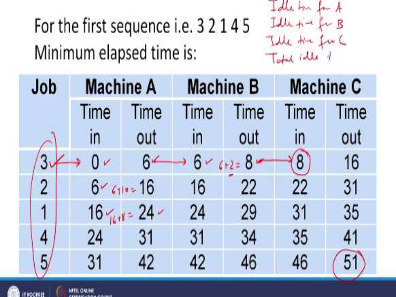

## Lec 33 — 2 Jobs x m Machines (Graphical Method)

### 1. Setup

Jobs 1,2; machines $A_1\dots A_m$. Technological order per job known (may differ between jobs). Processing times $A_k^{(1)}, A_k^{(2)}$ known. Minimize $T$.

### 2. Graphical steps

1. X-axis = Job 1 cumulative times in its order; Y-axis = Job 2 cumulative times in its order.
2. Mark machine blocks cumulatively along each axis in given order.
3. Pair same machines $\to$ shaded rectangles (conflict zones: both jobs cannot be on same machine together).
4. From origin O draw $45^{\circ}$ path to Finish: diagonal = both process; right = Job 1 processes, Job 2 idle; up = Job 2 processes, Job 1 idle. Never cut diagonally through a shaded block; go around (horizontal or vertical) choosing shorter idle.
5. Optimal path maximizes diagonal travel (minimizes total idle = vertical + horizontal movement).
6. Elapsed $=$ processing time of job $+$ its idle. Vertical movement $=$ Job-1 idle. Horizontal movement $=$ Job-2 idle. Both jobs' elapsed must agree at Finish.

### 3. Worked example

- Job 1 order: A(2), B(3), C(4), D(6), E(2); total $17$. X marks: 0-2-5-9-15-17.
- Job 2 order: C(4), A(5), D(3), E(2), B(6); total $20$. Y marks: 0-4-9-12-14-20.
- Blocks: A: X[0,2]xY[4,9]; B: X[2,5]xY[14,20]; C: X[5,9]xY[0,4]; D: X[9,15]xY[9,12]; E: X[15,17]xY[12,14].
- Optimal path skirts blocks (lecture goes around B-block vertically then diagonal). Result: Job-1 idle $=3$ h, Job-2 idle $=0$.

$$T = 17+3 = 20 = 20+0$$

So $20$ h total; Job 1 done first in path sense but both finish together in elapsed accounting.

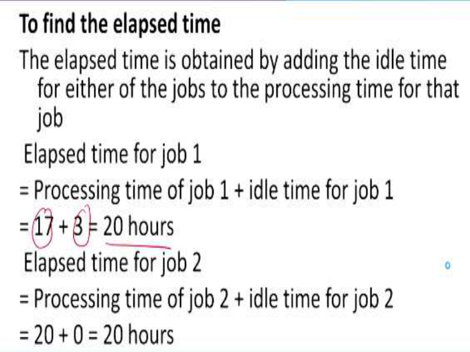

## Lec 34 — n Jobs x m Machines (General Case)

### 1. Conditions and reduction

- What: most general case, $n$ jobs through $M_1 \to M_m$ with no passing.
- Why: reduce an $m$-machine problem to Johnson's $2$-machine problem only when first or last machine dominates intermediates.

Jobs $1\dots n$, machines $M_1\dots M_m$ in order $M_1\to M_m$, no passing. $T_{ij}$ = time of job $j$ on $M_i$.

1. Compute $\min_j T_{1j}$, $\min_j T_{mj}$, and $\max_j T_{ij}$ for each intermediate $i=2\dots m-1$.
2. Check:
$$\min_j T_{1j} \ge \max_j T_{ij}\;\forall\,i=2\dots m-1 \quad \text{or} \quad \min_j T_{mj} \ge \max_j T_{ij}\;\forall\,i=2\dots m-1$$
(lecture uses $\ge$; equality allowed). If neither holds, method fails.
3. Fictitious G,H: $G_j = \sum_{i=1}^{m-1} T_{ij}$ (all but last), $H_j = \sum_{i=2}^{m} T_{ij}$ (all but first). Solve G/H by Johnson; sequence optimal for original.
- Notes: if $T_{2j}+\dots+T_{mj}=C$ constant for all $j$, Johnson on $M_1,M_2$-type reduction still usable; if additionally $T_{1j}=T_{mj}$ and $G_j=H_j$ patterns, many alternate optima exist. Applicable only when first/last machine dominates intermediates.

### 2. Worked example 1 — 5 jobs x 4 machines

|  | A | B | C | D | E |
|---|---|---|---|---|---|
| M1 | 11 | 13 | 9 | 16 | 16 |
| M2 | 4 | 3 | 5 | 2 | 6 |
| M3 | 6 | 7 | 5 | 8 | 4 |
| M4 | 15 | 8 | 13 | 9 | 11 |

$\min M_1=9$, $\min M_4=8$; $\max M_2=6$, $\max M_3=8$. Both $\ge$ hold ($9\ge 6,8$; $8\ge 6$, $8\ge 8$). Also $M_2+M_3=10$ constant. Reduce to M1/M4 Johnson $\to$ sequence **C-A-E-D-B**. Chained in/out table (gaps where machine busy) gives $T=83$.

### 3. Worked example 2 — 4 jobs x 6 machines

Table values (jobs A-D x M1-M6) per transcript: row M1 $[20,19,13,22]$, M2 $[10,8,7,6]$, M3 $[9,11,10,5]$, M4 $[4,8,7,6]$, M5 $[12,10,9,10]$, M6 $[27,21,17,24]$ (columns A,B,C,D).
$\min M_1=13$, $\min M_6=17$; intermediate maxima $10,11,8,12$ — conditions hold. $G_j=\sum_{1}^{5}T_{ij}=[55,56,46,49]$ (A,B,C,D), $H_j=\sum_{2}^{6}T_{ij}=[62,58,50,51]$. Lecture slide and transcript print $41$ for job D on H, but direct addition gives $6+5+6+10+24=51$; use $51$ and treat $41$ as a slide typo. Johnson $\to$ **C-A-B-D**, $T=130$ h (M6 finish on D).

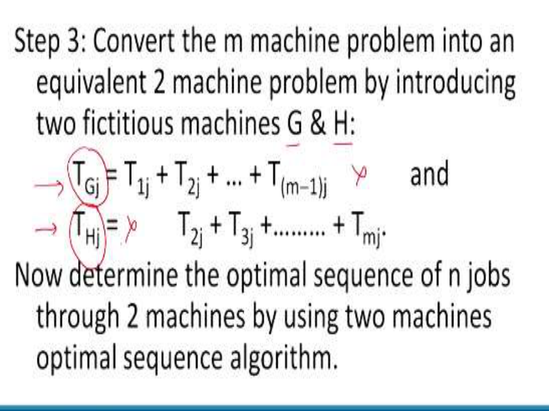
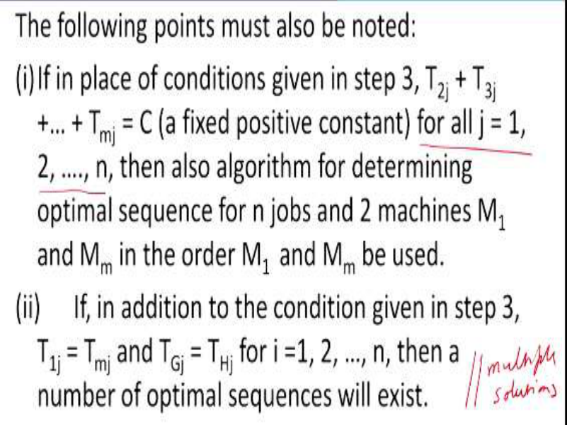
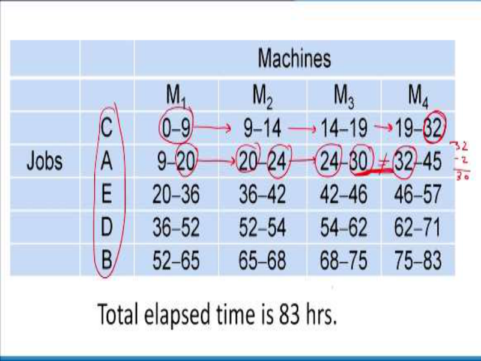
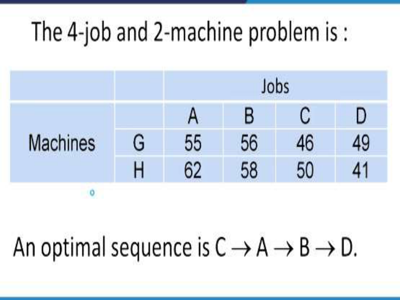

## Lec 35 — Sequencing Revision: Tie Handling, 3-Machine, Graphical + Quiz

### 1. Example 1 — n x 2 with tie (Johnson tie-break)

A $=[4,6,4,7,9]$, B $=[8,7,6,2,8]$, order AB.

- Min $=2=B_4\to$ job 4 last $[\_,\_,\_,\_,4]$.
- Remaining min $=4$: tie $A_1=4$ and $A_3=4$. Look at other machine: $B_1=8$ vs $B_3=6$; lecture places job 3 first (smaller $B$ gets priority per tie rule as stated), then job 1 next.
- Continue $\to$ optimal **3-1-2-5-4**.

In/out: A: J3 0-4, J1 4-8, J2 8-14, J5 14-23, J4 23-30. B: J3 4-10, J1 10-18, J2 18-25, J5 25-33, J4 33-35. $T=35$; A idle $35-30=5$ h (tail); B idle $4$ h (0-4 head).

### 2. Example 2 — n x 3 (P,Q,R)

| Job | 1 | 2 | 3 | 4 | 5 |
|---|---|---|---|---|---|
| P | 51 | 78 | 55 | 19 | 85 |
| Q | 29 | 15 | 45 | 50 | 31 |
| R | 63 | 78 | 75 | 51 | 52 |

$\min P=19$, $\max Q=50$, $\min R=51$. First fails ($19\ge 50$ false); second holds ($51\ge 50$), so reduce. $G=P+Q=[80,93,100,69,116]$ (lecture slide prints $136$ for job 5 — arithmetic gives $85+31=116$; treat $136$ as slide typo), $H=Q+R=[92,93,120,101,83]$. Johnson $\to$ **4-1-3-2-5**, $T=388$ (stated; verify by chaining).

### 3. Example 3 — 2 x 5 graphical (second dataset)

- Job 1 order A(2)B(3)C(1)D(9)E(2), total $17$; Job 2 order B(4)E(5)D(3)A(2)C(1), total $15$.
- Plot cumulatives, shade A-E blocks, take max-diagonal path skirting blocks. Lecture result: $T=21$ h ($=6+11+4$ path segments as stated), idle Job 1 $=4$ h, idle Job 2 $=6$ h ($17+4=21$, $15+6=21$). Other diagonal-greedy paths look plausible but are suboptimal — must test.

### 4. Lec-35 quiz with answers, all 15 questions

- Q1: ____ is the order in which a job has to be processed on different machines. Answer: processing order.
- Q2: ____ is the time for which a machine remains idle before completion of all jobs. Answer: idle time.
- Q3: ____ is the time between starting of the first job and completion of the last job including idle times. Answer: total elapsed time.
- Q4: no-passing rule states that ____. Answer: the same order of execution of jobs is to be maintained on each machine.
- Q5: conditions for converting 3 machines to 2 machines are ____. Answer: $\min A \ge \max B$ or $\min C \ge \max B$.
- Q6: alternate optimum sequences give different elapsed time. Answer: False, elapsed time is the same.
- Q7: alternate optimum sequences give equal idle times for individual machines. Answer: False, individual-machine idle times differ.
- Q8: processing two jobs through $m$ machines can be done graphically. Answer: True.
- Q9: in graphical method moving right means job 1 is ____ while job 2 is ____. Answer: job 1 is processing while job 2 is idle.
- Q10: moving upwards means job ____ is processing while job ____ is idle. Answer: job 2 is processing while job 1 is idle.
- Q11: in optimal sequencing no machine ever remains idle. Answer: False.
- Q12: in a scheduling problem no activity can be carried out simultaneously. Answer: False, diagonal movement means both jobs process simultaneously.
- Q13: which sequencing problems can be solved conveniently using Johnson's rule. Answer: $n$ jobs x $2$ machines, and reducible $n$ jobs x $3$ machines.
- Q14: solutions may not be unique. Answer: True.
- Q15: sequencing and scheduling are different concepts. Answer: True; sequencing is the order of jobs, scheduling gives elapsed and idle times.

Key slide images:

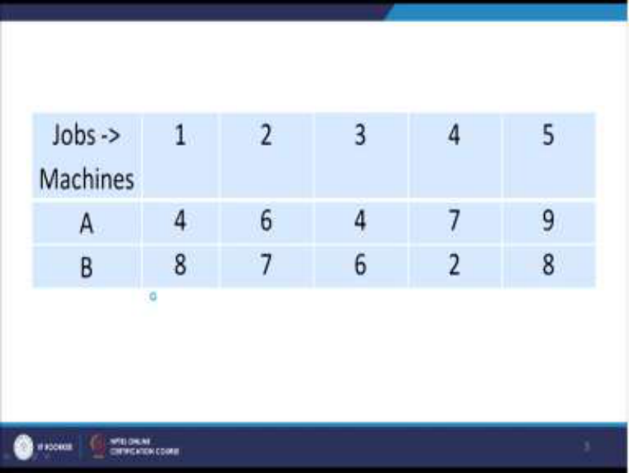

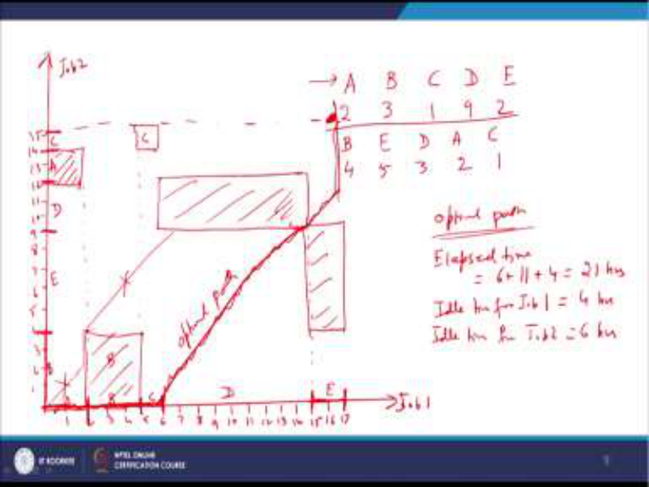

## Key exam takeaways

### Method-selection guide

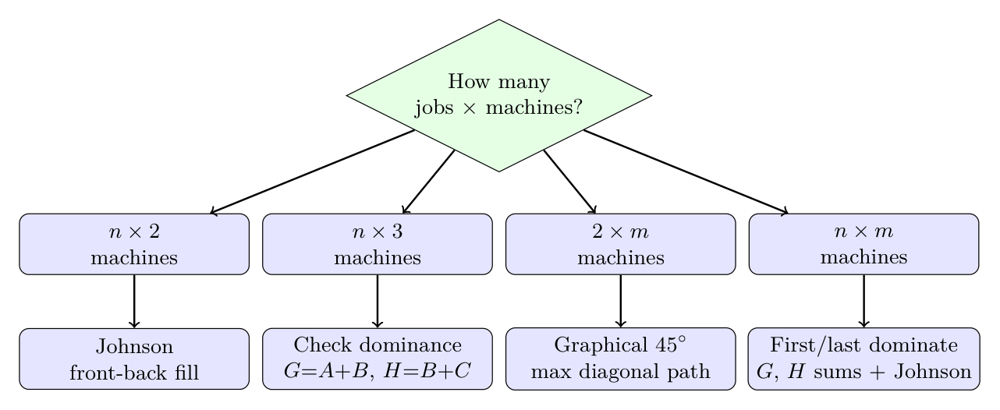

| Problem | Signature | Method |
|---|---|---|
| Transportation | $m$ sources, $n$ sinks, $c_{ij}$ | IBFS (NW / Least-cost / VAM) then MODI optimality; $m+n-1$ basics |
| Assignment | square $n\times n$, one-to-one, 0/1 | Hungarian (row+col reduce, cover zeros, adjust) |
| n x 2 sequencing | $A_i,B_i$, order AB | Johnson front/back fill |
| n x 3 | A,B,C order ABC | Check $\min A\ge\max B$ or $\min C\ge\max B$, then $G=A+B$, $H=B+C$ + Johnson |
| 2 x m | two jobs, own orders | Graphical 45-degree max-diagonal path |
| n x m | $T_{ij}$, order $M_1\dots M_m$ | Check first/last dominate intermediates, then $G=\sum_{1}^{m-1}$, $H=\sum_{2}^{m}$ + Johnson |

### Degeneracy / unbalanced traps

- Unbalanced transport/assignment: add dummy with $0$ cost first; never skip the balance check ($\sum a$ vs $\sum b$; rows vs cols).
- Simultaneous row+column exhaustion: cross only one line, leave $0$ in the other (else allocations $<m+n-1$ and loops break).
- MODI needs exactly $m+n-1$ independent basics; if short, insert $\epsilon$-zero at cheapest independent non-loop cell.
- Hungarian: count lines, not zeros. Adjust only when lines $<n$; add $k$ back at intersections (most forgotten step).
- Maximization assignment: convert first. Dummy rows/cols get zeros (or max-cost equivalent consistently).

### Johnson's rule checklist

1. Global min each round (both machines together), not per-machine min.
2. A-min $\to$ front; B-min $\to$ back; $A_k=B_r$ tie $\to$ $k$ front, $r$ back.
3. A-tie $\to$ smaller $B$ first; B-tie $\to$ smaller $A$ last.
4. Strike assigned row, repeat; compute in/out chaining with waits ($in=\max($machine-free, prev-machine-out$)$).
5. $T=$ last out on last machine; idle = $T - \sum$ processing per machine (split head/tail gaps if asked).
6. Ties $\to$ alternate optima: same $T$, different per-machine idle — say so explicitly if asked.
7. 3-/m-machine: write condition check first and fail gracefully if unsatisfied; state $G$/$H$ formulas before numbers.
