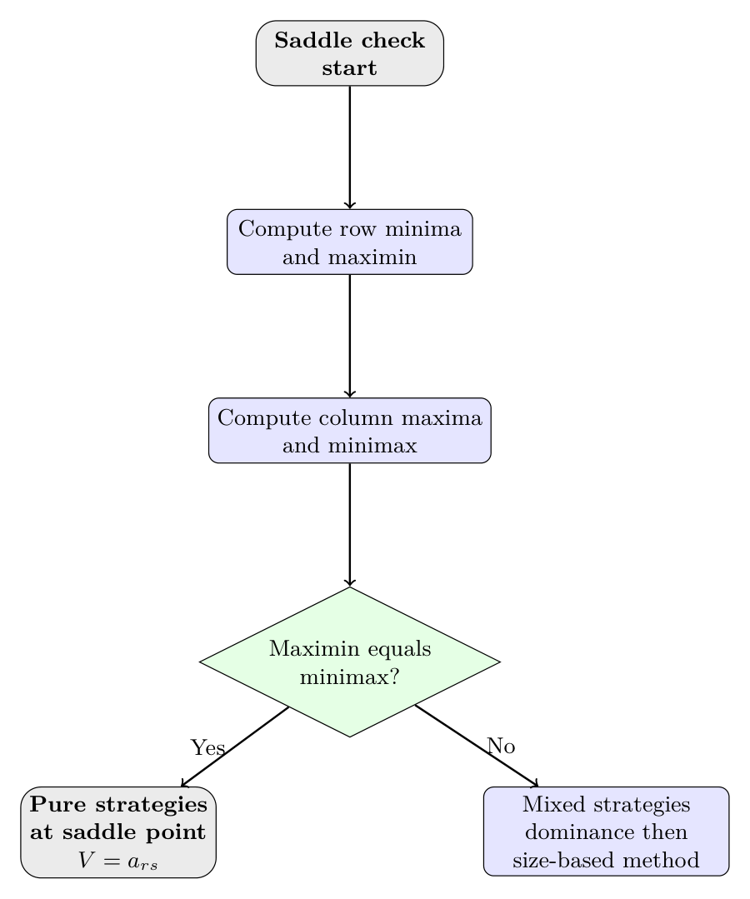
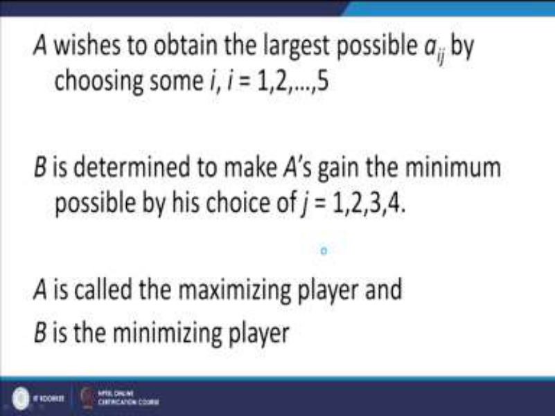
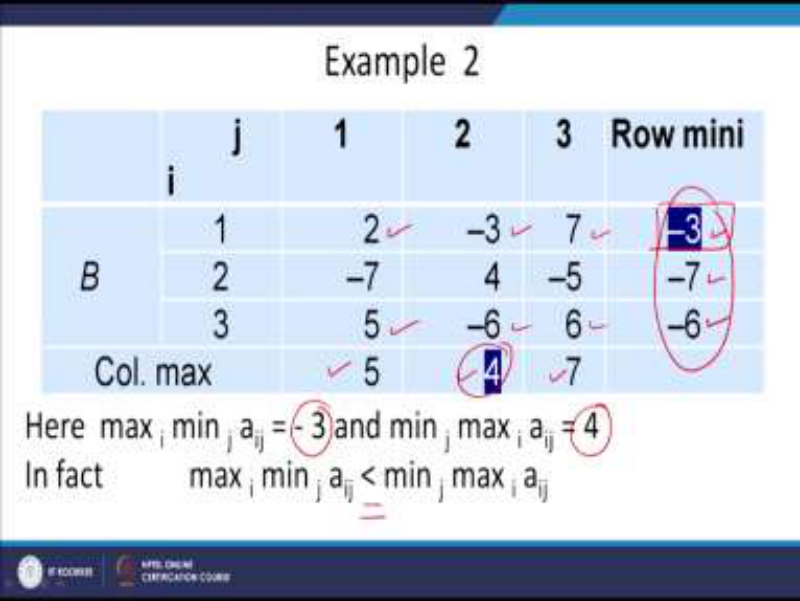
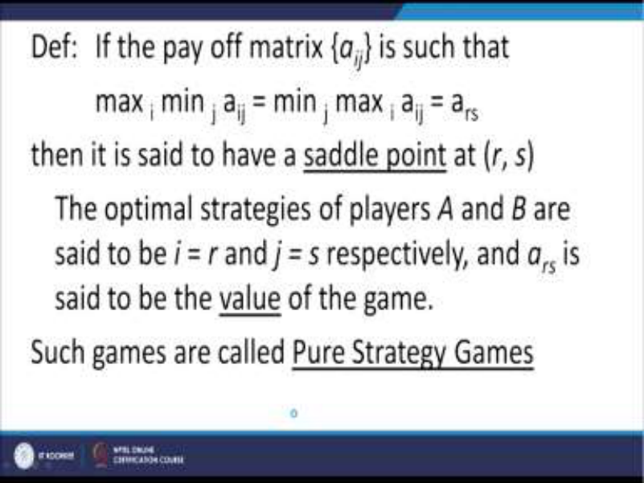
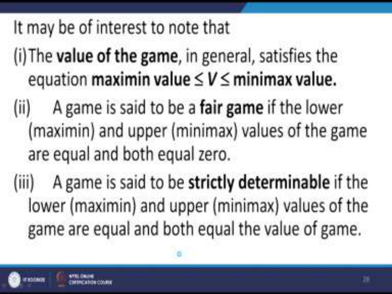
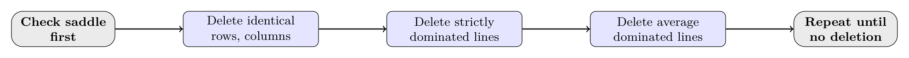
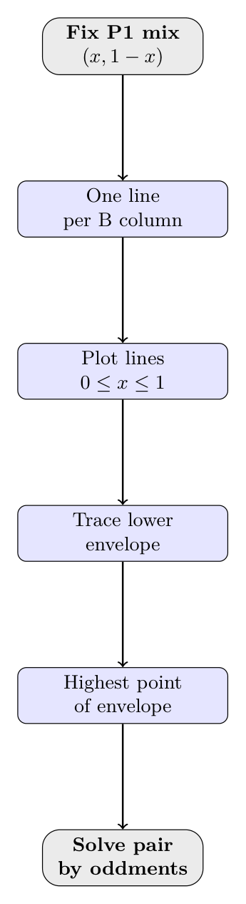
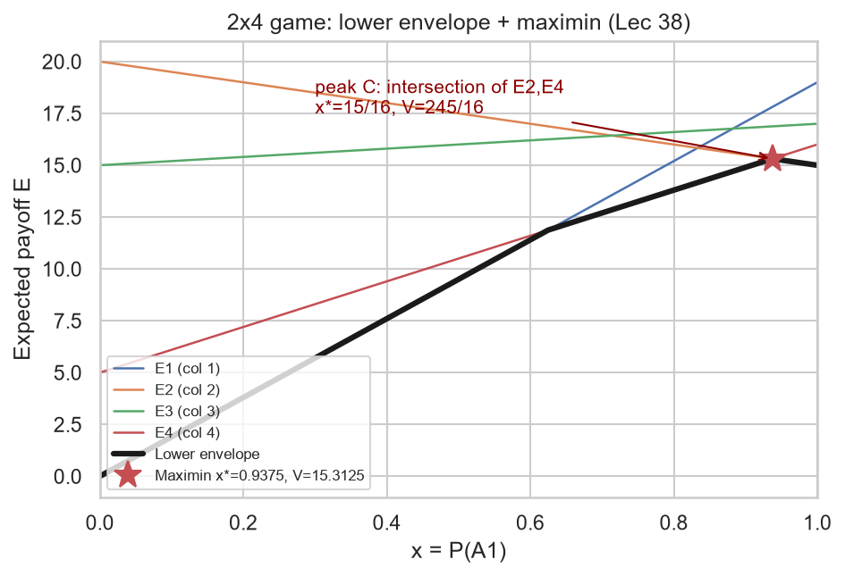
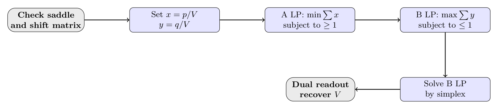
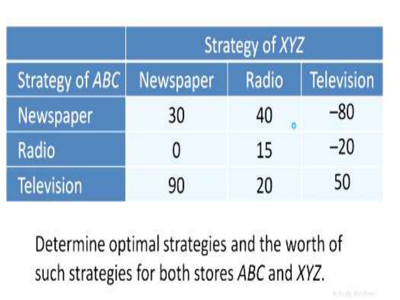

# Module 5: Game Theory (Lectures 36-40)

- Lec 36: Two-person zero-sum game setup — players, strategies, payoff matrix, assumptions, maximin/minimax, saddle point, pure strategies, value of game, fair vs strictly determinable games.
- Lec 37: Game theorems (max-min inequality, saddle-point necessary and sufficient conditions, fundamental theorem of rectangular games), mixed vs pure strategies, expected payoff $E(X,Y)$, dominance rules with reduction example.
- Lec 38: Solving $2 \times 2$ games (oddments method + closed-form formulas), solving $2 \times n$ and $m \times 2$ games by the graphical method, with full worked examples.
- Lec 39: Solving general $m \times n$ games — algebraic (equation) method with matching-coins example; game-to-LPP conversion ($x_i=p_i/V$, $y_j=q_j/V$), primal-dual pair, handling $V \le 0$, worked $3 \times 3$ example via simplex/dual readout.
- Lec 40: Case studies (Ram-Raja number game; ABC vs XYZ advertising game by dominance and by LPP) + condensed 15-question quiz with answers.
- Closing: Key exam takeaways (saddle-point-first workflow, dominance order, game-LP template).

## Lecture 36: Two-Person Zero-Sum Games, Saddle Point, Pure Strategies

**What this lecture is:** sets up the language of game theory as decision-making under competition.

**Why it matters:** every later method starts with a saddle-point check, so maximin/minimax must be automatic.

*Payoff table for Lec 36 Example 1 with row minima and column maxima.*

*Payoff table for Lec 36 Example 2 with maximin not equal minimax.*

*Slide definition of saddle point and value of game.*

*Slide with value bounds and fair versus strictly determinable definitions.*

### 36.1 Game vocabulary

- **Game:** situation of conflict/competition with 2+ competitors making decisions anticipating outcomes. Playing a game = decision-making under certainty, risk, or uncertainty.
- Three decision settings in lecture: under certainty, under risk, under uncertainty.
- **Solving a game** means deciding whether there is an optimal way to play and finding it.
- **Players:** competitors (individuals, firms, bidders, election candidates).
- Lecture player examples: five candidates contesting an election; competing soap firms with advertising campaigns; contractors filing bids for house construction.
- **Two-person vs n-person:** 2 players = two-person game; more = n-person game. This module covers two-person games.
- **Rectangular game:** $m$ need not equal $n$, so the payoff table is rectangular rather than square.
- **Zero-sum vs non-zero-sum:** if gain of one player exactly equals loss of the other so total $= 0$, it is **zero-sum**; otherwise non-zero-sum. Convention: $a_{ij}$ is simultaneously gain to A and loss from B.
- **Strategy:** list of all possible actions/courses available to a player for every contingency. Rules and numerical outcomes (money, market share, utility) are assumed known in advance, but a player need not know the opponent's chosen strategy.
- **Optimal strategy:** complete plan by which a player optimizes gains/losses without knowing the competitor's strategy.
- **Value of game ($V$):** expected outcome per play when both follow optimal strategies.
- **Pure strategy:** decision rule where a player always selects one particular course of action irrespective of opponent's choice; objective is maximize gain / minimize loss.
- **Mixed strategy:** players randomize among pure strategies with fixed probabilities; objective is maximize expected gain / minimize expected loss. Mathematically, for $n$ pure strategies, $S=(p_1,\dots,p_n)$ with $p_j \ge 0$ and $\sum p_j = 1$. (Lecture states $>0$; use $\ge 0$ so unused dominated strategies can get 0.)

### 36.2 Payoff matrix and assumptions

**What:** rows are A's strategies, columns are B's strategies, entry $a_{ij}$ is payment from B to A.

**Why:** fixes who maximizes and who minimizes before any calculation.

Rows $i=1,\dots,m$ = strategies of maximizing player A; columns $j=1,\dots,n$ = strategies of minimizing player B; entry $a_{ij}$ = payment from B to A when A plays $i$ and B plays $j$. A chooses $i$ and B chooses $j$ without knowing the other's choice, then choices are disclosed and A receives $a_{ij}$.

Standard assumptions:

1. Each player has finitely many courses of action; $m$ need not equal $n$ (rectangular game).
2. A maximizes gain; B minimizes loss.
3. Decisions are made individually with no communication.
4. Decisions are made and announced simultaneously, so neither has an informational advantage.
5. Both players know their own and each other's possible payoffs.

### 36.3 Maximin, minimax, saddle point

**What:** maximin is A's best worst-case, minimax is B's best worst-case.

**Why:** equality means pure strategies are optimal and no mixing is needed.

- **Row minima:** for each row $i$, $\min_j a_{ij}$ = worst payoff to A if A plays $i$.
- A picks the best of these: **maximin** $= \max_i \min_j a_{ij}$ (lower value of game, denoted $\underline{V}$).
- **Column maxima:** for each column $j$, $\max_i a_{ij}$ = worst loss to B if B plays $j$.
- B picks the best of these: **minimax** $= \min_j \max_i a_{ij}$ (upper value of game, denoted $\overline{V}$).
- Always $\underline{V} \le V \le \overline{V}$ (lecture artifact `<u><` corrected to $\le$).
- **Saddle point:** if $\max_i \min_j a_{ij} = \min_j \max_i a_{ij} = a_{rs}$, there is a saddle (equilibrium) at $(r,s)$; optimal pure strategies are $i=r$, $j=s$; $a_{rs}$ is the value of the game. Games with a saddle point are **pure-strategy games**. A game may have more than one saddle point.
- **Minimax-maximin principle:** in saddle-point games, row-minima + maximin choice for A and column-maxima + minimax choice for B give each player's best strategy.
- No saddle point $\Rightarrow$ solve by mixed strategies (Lecs 37-39).

Worked logic (Lec 36 Example 1, $5 \times 4$ matrix): row minima $-4,-1,-2,-3,-3$ give maximin $-1$ at $i=2$; column maxima give minimax $-1$ at $j=3$. Equal, so saddle at $(2,3)$, $V=-1$. (Example 2, $3 \times 3$: maximin $-3$, minimax $4$; unequal, so no saddle $\rightarrow$ mixed strategies.)
- Lecture's A-side argument traces each $i=1,\dots,5$ to B's minimizing $j$: $i=1 \to j=3$, $i=2 \to j=3$, $i=3 \to j=3$ or $j=4$, $i=4 \to j=2$ or $j=3$, $i=5 \to j=1$.
- Lecture's B-side argument traces each $j$ to A's maximizing $i$ before taking $\min_j \max_i a_{ij}$.

### 36.4 Fair vs strictly determinable

**What:** fair means value zero; strictly determinable means a saddle exists.

**Why:** exam asks both as fill-ins, so keep the zero versus $V$ distinction exact.

- **Fair game:** $\underline{V} = \overline{V} = 0$.
- **Strictly determinable game:** $\underline{V} = \overline{V} = V$ (a saddle exists; $V$ need not be 0).
- Example 1 above is strictly determinable with $V=-1 \ne 0$: not fair, biased toward B (negative payment means A loses on average).

## Lecture 37: Theorems, Mixed Strategies, Dominance

**What this lecture is:** exact theorem statements plus dominance reduction.

**Why it matters:** theorems justify mixed strategies and LP duality; dominance shrinks solvable games.

*Slide statement of Theorem 1 and matrix corollary.*

*Slide statement of necessary and sufficient saddle condition.*

*Slide definition of expected payoff E of X and Y.*

*Slide statement of row dominance rule for player A.*

*Slide payoff table for 4x4 dominance reduction example.*

### 37.1 Max-min inequality and saddle-point theorems (precise statements)

**What:** inequalities and equalities that define when a saddle exists.

**Why:** Lec 37 quiz and proofs expect exact $\max \min$ versus $\min \max$ order.

- Lecture proof note: statements only are needed; proofs are left to literature.

**Theorem 1 (weak max-min inequality).** Let $f(X,Y)$ be such that both $\max_X \min_Y f(X,Y)$ and $\min_Y \max_X f(X,Y)$ exist. Then
$$\max_X \min_Y f(X,Y) \le \min_Y \max_X f(X,Y).$$
Equality holds when a saddle point exists; otherwise strict inequality holds.

**Corollary 1 (matrix form).** For an $m \times n$ payoff matrix $\{a_{ij}\}$,
$$\max_i \min_j a_{ij} \le \min_j \max_i a_{ij}.$$

**Definition (saddle point of $f$).** $(X_0,Y_0)$ is a saddle point of $f(X,Y)$ if
$$f(X,Y_0) \le f(X_0,Y_0) \le f(X_0,Y) \quad \forall X,Y.$$

**Theorem 2 (saddle-point existence, necessary and sufficient).** Let both $\max_X \min_Y f$ and $\min_Y \max_X f$ exist. Then $(X_0,Y_0)$ is a saddle point of $f$ iff
$$f(X_0,Y_0) = \max_X \min_Y f(X,Y) = \min_Y \max_X f(X,Y).$$

**Corollary 2 (matrix saddle).** $\{a_{ij}\}$ has a saddle point at $(r,s)$ iff
$$a_{rs} = \max_i \min_j a_{ij} = \min_j \max_i a_{ij}.$$

**Theorem 3 (separation / alternative, as stated in Lec 37).** Let $A$ be $m \times n$ with row vectors $Q_i$ and column vectors $P_j$. Then exactly one of these holds: (i) there exists $Y \in S_n$ with $Q_i Y < 0$ for all $i$; or (ii) there exists $X \in S_m$ with $X'P_j > 0$ for all $j$. (Used in the course as a lemma toward the fundamental theorem; $S_m, S_n$ are the mixed-strategy simplices.)

**Fundamental theorem of rectangular (matrix) games.** For every $m \times n$ matrix game, both $\max_X \min_Y E(X,Y)$ and $\min_Y \max_X E(X,Y)$ exist and are equal. Hence **every matrix game has a value and an optimal strategy for each player**.

Equivalent saddle characterization: $(X_0,Y_0)$ with $X_0 \in S_m$, $Y_0 \in S_n$ is a **strategic saddle point** iff
$$E(X,Y_0) \le E(X_0,Y_0) \le E(X_0,Y) \quad \forall X,Y,$$
or, it suffices to check pure strategies $\xi_i, \eta_j$:
$$E(\xi_i,Y_0) \le E(X_0,Y_0) \le E(X_0,\eta_j) \quad \forall i,j.$$
Then $V = E(X_0,Y_0)$ is the value and $X_0,Y_0$ are optimal mixed strategies.

### 37.2 Mixed strategies and expected payoff

**What:** randomization with probabilities summing to one.

**Why:** without a saddle, optimal play must be described by $X$ and $Y$.

- Mixed strategy of A: $X=(x_1,\dots,x_m)$, $x_i \ge 0$, $\sum x_i=1$. Of B: $Y=(y_1,\dots,y_n)$, $y_j \ge 0$, $\sum y_j=1$.
- A pure strategy is the special mixed strategy with 1 in one position, 0 elsewhere. So mixed strategies generalize pure ones.
- **Expected payoff / payoff function:** for payoff matrix $A=\{a_{ij}\}$,
$$E(X,Y) = \sum_{i=1}^{m}\sum_{j=1}^{n} x_i a_{ij} y_j = X'AY.$$

Condensed worked $2 \times 2$ example (Lec 37): $A=\begin{pmatrix}5&1\\3&4\end{pmatrix}$. Row minima $1,3 \Rightarrow$ maximin $3$; column maxima $5,4 \Rightarrow$ minimax $4$. No saddle. Write $X=(x_1,x_2)$, $Y=(y_1,y_2)$, $x_2=1-x_1$, $y_2=1-y_1$:
$$E = 5x_1y_1+3x_2y_1+x_1y_2+4x_2y_2 = 5(x_1-\tfrac15)(y_1-\tfrac35)+\tfrac{17}{5}.$$
So A choosing $x_1=1/5$ guarantees $E \ge 17/5$; B choosing $y_1=3/5$ caps $E \le 17/5$. Optimal $X_0=(1/5,4/5)$, $Y_0=(3/5,2/5)$, $V=17/5$. (Transcript's "$-17/5$" for B is a slip; both values are $+17/5$.)

### 37.3 Dominance: rules and recipe

**What:** delete strategies that are never better than another or an average.

**Why:** smaller matrix keeps the same value and saddle character with less work.

Idea: a row/column obviously worse than another (or than an average of others) gets probability 0 and can be deleted; this shrinks the game without changing its character (saddle existence and value preserved).

Numbered rules (A = maximizer/profit matrix, B = minimizer/loss matrix; reverse if convention flips):

1. **Column dominance (B):** if every entry of column $C_r \ge$ corresponding entry of column $C_s$, then $C_r$ is dominated by $C_s$ (B loses more playing $C_r$) — delete $C_r$.
2. **Row dominance (A):** if every entry of row $R_r \le$ corresponding entry of row $R_s$, then $R_r$ is dominated by $R_s$ (A gains less playing $R_r$) — delete $R_r$.
3. **Average/convex-combination dominance:** a pure strategy $k$ dominated by an average of two or more other pure strategies can be deleted (strict dominance). Conversely, if $k$ dominates a convex combination of others, one of the strategies in the combination may be deleted.
4. Apply iteratively; dominance steps are optional but reduce computation.

Condensed worked reduction (Lec 37, $4 \times 4 \rightarrow 2 \times 2$):
- Given: $4 \times 4$ payoff in slide image above with A strategies $A_1,\dots,A_4$ and B strategies $B_1,\dots,B_4$.
- Steps: saddle check, row deletion, column deletion, B-average deletion, A-average deletion, then $2 \times 2$ solution below.
- Answer: full-game optimals below with $V=8/3$.

1. Start with A having $A_1,\dots,A_4$, B having $B_1,\dots,B_4$; check saddle: maximin $2$, minimax $4$ — no saddle.
2. From A's view, row 1 is dominated by row 3 (transcript wording slips "$A_1$ by $A_2$" in one place; the deletion performed is row 1) — delete row 1, left with $3 \times 4$.
3. From B's view, column 1 is dominated by column 3 — delete column 1, left with $3 \times 3$:
$$\begin{pmatrix}4&2&4\\2&4&0\\4&0&8\end{pmatrix}.$$
4. No single row/column dominates another now. Average of B's $B_3,B_4$ columns: $((2+4)/2,(4+0)/2,(0+8)/2)=(3,2,4)$, which B prefers to $B_2=(4,2,4)$ (smaller loss except tie) — delete $B_2$.
5. Average of A's $A_3,A_4$ rows: $((4+0)/2,(0+8)/2)=(2,4)$, identical to $A_2$'s payoff — delete $A_2$.
6. Remaining $2 \times 2$ in $(A_3,A_4)\times(B_3,B_4)$: $\begin{pmatrix}4&0\\0&8\end{pmatrix}$; no saddle ($0 \ne 8$). Equate A's expectations: $4p_3+0p_4 = 0p_3+8p_4$, $p_3+p_4=1 \Rightarrow p_3=2/3$, $p_4=1/3$. Likewise $q_3=2/3$, $q_4=1/3$. Full-game optimals: $X_0=(0,0,2/3,1/3)$, $Y_0=(0,0,2/3,1/3)$, $V=4(2/3)=8/3$.
- Introductory dominance example from Lec 37: P1 rows $1,2,3$ and P2 columns $1,2,3,4$ with matrix rows $[4,-8,7,-2]$, $[3,-9,2,-3]$, $[-2,6,8,2]$.
- Given: every entry of row 1 exceeds row 2, so $a_{1j} > a_{2j}$ for every $j$.
- Steps: P1 always does better with $i=1$ than $i=2$ whatever P2 does, so set probability of row 2 to $0$.
- Answer: delete row 2; solve the remaining $2 \times 4$ game.
- Dominance preserves character: reduction does not change whether a saddle exists nor the value $V$.

## Lecture 38: $2 \times 2$ by Oddments, $2 \times n$ / $m \times 2$ by Graphs

**What this lecture is:** closed-form $2 \times 2$ solution plus graphical reduction for $2 \times n$ and $m \times 2$.

**Why it matters:** oddments avoids formula memory; graphs reduce larger games to $2 \times 2$.

*Slide formulas for p1, p2, q1, q2 and value V.*

*Slide oddments table for 1,3,10,2 example.*

*Slide plot of four expected lines with lower envelope.*

*Slide plot for P2 strategies on surviving columns.*

*Slide oddments table for reduced 6x2 game.*

### 38.1 Case 1: $2 \times 2$ mixed game — formulas and oddments recipe

**What:** two equivalent routes to the same $p$, $q$, and $V$.

**Why:** use oddments in exams if formulas are hard to recall.

> Formula box: for $A=\begin{pmatrix}a_{11} and a_{12}\\a_{21} and a_{22}\end{pmatrix}$ with $D=a_{11}+a_{22}-a_{12}-a_{21} \ne 0$, $p_1=(a_{22}-a_{21})/D$, $q_1=(a_{22}-a_{12})/D$, $V=(a_{11}a_{22}-a_{12}a_{21})/D$.

For $A=\begin{pmatrix}a_{11}&a_{12}\\a_{21}&a_{22}\end{pmatrix}$ with no saddle, let $D=a_{11}+a_{22}-a_{12}-a_{21}$ (assume $D \ne 0$):
$$p_1=\frac{a_{22}-a_{21}}{D},\quad p_2=1-p_1,\qquad q_1=\frac{a_{22}-a_{12}}{D},\quad q_2=1-q_1,$$
$$V=\frac{a_{11}a_{22}-a_{12}a_{21}}{D}.$$

**Oddments method (same result, no formula memorization):**

1. Confirm no saddle (maximin $\ne$ minimax).
2. Row oddments: for row 1, take $|a_{12}-a_{11}|$ (larger minus smaller) and write it against the *other* row; for row 2, take $|a_{21}-a_{22}|$ written against row 1. Normalize: $p_1 = \text{oddment}_1/(\text{sum})$, $p_2=\text{oddment}_2/(\text{sum})$.
3. Column oddments symmetrically: $|a_{21}-a_{11}|$ against the other column, $|a_{12}-a_{22}|$ against the first; normalize to $q_1,q_2$.
4. Value: row-weighted $V=(a_{11}\cdot\text{odd}_1+a_{21}\cdot\text{odd}_2)/(\text{sum})$ (column check gives the same).

Condensed fully-worked example (Lec 38): $A=\begin{pmatrix}1&3\\10&2\end{pmatrix}$. Given: row minima $1,2$ and column maxima $10,3$. Steps: maximin $2$, minimax $3$, no saddle, row and column oddments, normalize, row-weighted value. Answer: $p=(4/5,1/5)$, $q=(1/10,9/10)$, $V=14/5$.

Row oddments: $|3-1|=2$ (against row 2), $|10-2|=8$ (against row 1): $p=(8/10,2/10)=(4/5,1/5)$. Column oddments: $|10-1|=9$ (against col 2), $|3-2|=1$ (against col 1): $q=(1/10,9/10)$. Value $V=(1\cdot 8+10\cdot 2)/10=28/10=14/5$. Formula check: $D=1+2-3-10=-10$, $p_1=(2-10)/(-10)=4/5$, $q_1=(2-3)/(-10)=1/10$, $V=(2-30)/(-10)=28/10$. Same.

### 38.2 Case 2: $2 \times n$ graphical method (maximin on lower envelope)

**What:** plot one line per B column as a function of $x$, then maximize the lowest line.

**Why:** the peak identifies which two columns survive for a $2 \times 2$ finish.

Recipe (illustrated with Lec 38's $2 \times 4$):

- Given: payoff rows $[19,15,17,16]$ and $[0,20,15,5]$.
- Steps: saddle check, optional dominance, $x$ lines, lower-envelope peak, $2 \times 2$ oddments, $y$ upper-envelope check.
- Answer: $X_0=(15/16,1/16)$, $Y_0=(0,11/16,0,5/16)$, $V=245/16$.

1. No-saddle check. Example payoff (P1 rows, P2 columns): row 1: $19,15,17,16$; row 2: $0,20,15,5$. Row minima $15,0 \Rightarrow$ maximin $15$; column maxima $19,20,17,16 \Rightarrow$ minimax $16$. No saddle.
2. Optionally apply dominance first (lecture notes it is optional).
3. Let P1 mix $(x,1-x)$. Expected gain against each B column $k$:
$$E_1=19x,\; E_2=15x+20(1-x)=20-5x,\; E_3=17x+15(1-x)=15+2x,\; E_4=16x+5(1-x)=5+11x.$$
4. Plot each $E_k(x)$ for $0 \le x \le 1$ ($x$ horizontal, expectation vertical; endpoints at $x=0,1$). Endpoint table: $E_1: 0 \to 19$; $E_2: 20 \to 15$; $E_3: 15 \to 17$; $E_4: 5 \to 16$. Take the **lower envelope** (least expectation at each $x$); its highest point is the maximin. Here the peak $C$ is the intersection of lines 2 and 4. The red polyline $O$-$B$-$C$-$D$ in the slide is that lower envelope.
5. Solve $20-5x=5+11x \Rightarrow 16x=15 \Rightarrow x=15/16$. So P1 optimal $(15/16,1/16)$, $V=20-5(15/16)=245/16$. Reduce original to the $2 \times 2$ in columns 2,4: $\begin{pmatrix}15&16\\20&5\end{pmatrix}$, solvable by oddments.
6. For P2, let mix on surviving columns be $(y,1-y)$: $E=15y+16(1-y)=16-y$ vs $20y+5(1-y)=5+15y$. Plot vs $y$, take the **upper envelope**, minimize it (minimax): $16-y=5+15y \Rightarrow y=11/16$. So on $(B_2,B_4)$: $(11/16,5/16)$; full-game $Y_0=(0,11/16,0,5/16)$; $V=245/16$ matches — not coincidence (fundamental theorem/duality).

### 38.3 Case 3: $m \times 2$ graphical method (minimax on upper envelope)

**What:** plot one line per A row as a function of $y$, then minimize the highest line.

**Why:** the valley identifies which two rows survive for a $2 \times 2$ finish.

Mirror image. Let B mix $(y,1-y)$ on its 2 columns; write A's expected payoff per row as a function of $y$; plot all $m$ lines; take the **upper envelope** (worst for B); its lowest point is the minimax; the two intersecting rows give the surviving $2 \times 2$.

Condensed worked example (Lec 38, $6 \times 2$): Given: maximin $3$, minimax $4$, no saddle. Steps: B mix $(y,1-y)$, six row lines from the slide table, upper-envelope valley at $E_2$ and $E_4$ intersection, reduce to those rows, oddments. Answer: full $X_0=(0,3/5,0,2/5,0,0)$; B-mix $(4/5,1/5)$; $V=17/5$.
- Six row functions in lecture table: $A_1: y-3(1-y)$; $A_2: 3y+5(1-y)$; $A_3, A_5, A_6$ as tabulated in slide; $A_4: 4y+(1-y)$.
- Horizontal axis is B's $y$ from $0$ to $1$; vertical axis is expected payoff; A chooses the most unfavourable upper boundary for B.
- Oddments detail: A oddments $3$ and $2$ give $(3/5,2/5)$; B oddments $4$ and $1$ give $(4/5,1/5)$; $V=(3\cdot 3+4\cdot 2)/5=17/5$.

## Lecture 39: General $m \times n$ Games — Algebraic and LPP Methods

**What this lecture is:** equation method for small games and LP conversion for large games.

**Why it matters:** LP handles any size and exposes primal-dual symmetry.

*Slide payoff matrix for matching coins example.*

*Slide rule for V greater than 0, V less than 0, and V equal 0.*

*Slide LP for player A with min sum x.*

*Slide LP for player B with max sum y.*

*Slide 3x3 matrix shifted by constant 4.*

### 39.1 Algebraic (equation) method

**What:** turn guaranteed-value inequalities into equations and solve for $p$, $q$, $V$.

**Why:** fast for $2 \times 2$ and small games; shows where LP becomes necessary.

Setup: $P=(p_1,\dots,p_m)$, $Q=(q_1,\dots,q_n)$, value $V$.

- A guarantees at least $V$ against each B column: $\sum_i a_{ij}p_i \ge V$ for each $j$ (indices in slides are transposed in places; the meaning is column-wise expectation $\ge V$), plus $\sum p_i=1$, $p_i \ge 0$.
- B caps loss at $V$ against each A row: $\sum_j a_{ij}q_j \le V$ for each $i$, plus $\sum q_j=1$, $q_j \ge 0$.
- Try treating the inequalities as equalities and solving; if inconsistent, at least one holds strict and trial-and-error / LP is needed. Practical only for small games.

Condensed matching-coins example (Lec 39): Given: A wins $+1$ on (H,H), $0$ on (T,T), loses $1/2$ on mixed pairs; matrix $A=\begin{pmatrix}1&-1/2\\-1/2&0\end{pmatrix}$. Steps: saddle check, A equations, B equations, solve with $p_1+p_2=1$. Answer: $p=(1/4,3/4)$, $q=(1/4,3/4)$, $V=-1/8$.
- Saddle check: row minima $-1/2,-1/2 \Rightarrow$ maximin $-1/2$; column maxima $1,0 \Rightarrow$ minimax $0$; no saddle.
- A: $p_1-\tfrac12p_2 \ge V$, $-\tfrac12p_1+0p_2 \ge V$, $p_1+p_2=1$. As equations: $p_1=-2V$, $p_2=-6V \Rightarrow -8V=1 \Rightarrow V=-1/8$, $p_1=1/4$, $p_2=3/4$.
- B: $q_1-\tfrac12q_2 \le V$, $-\tfrac12q_1+0q_2 \le V$, $q_1+q_2=1 \Rightarrow q=(1/4,3/4)$, same $V=-1/8$. Transcript writes $<1$ in one B slide; read as $\le V$.
- Verify by $2 \times 2$ oddments or formula as lecture suggests.

### 39.2 Game-to-LP conversion (the exam template)

**What:** divide by $V$ to get ordinary linear programs in $x$ and $y$.

**Why:** B's $\le$ form needs only slacks, so solve it and read A's solution as the dual.

Assume for division that $V>0$ (if $V<0$ inequalities reverse on dividing; if $V=0$ or any $a_{ij}<0$, first add a constant $k$ to every entry so all entries $>0$ / smallest is 0, solve, then subtract $k$ from the game value; strategies unchanged).

Substitute $x_i=p_i/V$, $y_j=q_j/V$. Since $\max V \iff \min 1/V =\sum x_i$ (and $\min V \iff \max 1/V=\sum y_j$):

- **Primal (Player A, maximization turned into minimization):**
$$\min Z_p = \sum_{i=1}^{m} x_i \quad \text{s.t.}\quad \sum_i a_{ij}x_i \ge 1\;(j=1,\dots,n),\; x_i \ge 0.$$
(Careful: slide notation sometimes writes $a_{ji}$-style transposes; the constraint for B-column $j$ uses column $j$'s entries.)
- **Dual (Player B):**
$$\max Z_q = \sum_{j=1}^{n} y_j \quad \text{s.t.}\quad \sum_j a_{ij}y_j \le 1\;(i=1,\dots,m),\; y_j \ge 0.$$
- Key facts: B's LP is the dual of A's LP and vice versa; solve one (prefer B's $\le$ form: add slacks, no artificials) by simplex and read the other from the optimum tableau; $Z_p^*=Z_q^*=1/V'$ at optimality, and expected gain of A = expected loss of B. Recover $V'=1/Z^*$, $p_i=x_iV'$, $q_j=y_jV'$; then $V_{\text{original}}=V'-k$.

Condensed $3 \times 3$ LP example (Lec 39): Given: original $\begin{pmatrix}1&-1&3\\3&5&-3\\6&2&-2\end{pmatrix}$. Steps: saddle check, add $k=4$, write A-LP and B-LP, solve B-LP with slacks, dual readout, recover $p,q,V$. Answer: $p=(2/3,1/3,0)$, $q=(0,1/2,1/2)$, original $V=1$.
- Saddle check: row minima $-1,-3,-2 \Rightarrow$ maximin $-1$; column maxima $6,5,3 \Rightarrow$ minimax $3$; no saddle.
- Add $k=4$: $A'=\begin{pmatrix}5&3&7\\7&9&1\\10&6&2\end{pmatrix}$. A-LP: $\min x_1+x_2+x_3$ s.t. $5x_1+7x_2+10x_3 \ge 1$, $3x_1+9x_2+6x_3 \ge 1$, $7x_1+x_2+2x_3 \ge 1$, $x \ge 0$. B-LP: $\max y_1+y_2+y_3$ s.t. $5y_1+3y_2+7y_3 \le 1$, $7y_1+9y_2+y_3 \le 1$, $10y_1+6y_2+2y_3 \le 1$, $y \ge 0$.
- Solve B-LP with slacks via simplex (tableaux omitted in lecture): $y^*=(0,1/10,1/10)$, $Z^*=1/5 \Rightarrow V'=5$. Dual readout: $x^*=(2/15,1/15,0)$.
- Recover $q=y^*V'=(0,1/2,1/2)$, $p=x^*V'=(2/3,1/3,0)$, shifted value $5$, so **original value $V=5-4=1$**. (Lecture once writes "$V=5$" without subtracting; the correct original-game value is $1$.)
- Lecture also names classic strategic games for further reading: Prisoners' Dilemma, Arms Race, Bach-Stravinsky, Matching Pennies, Stag Hunt.

## Lecture 40: Case Studies and Quiz

**What this lecture is:** two full solves plus the 15-question self-test.

**Why it matters:** case studies combine saddle, dominance, equations, and LP in one workflow.

*Slide 3x3 payoff matrix for Ram Raja game.*

*Slide payoff matrix for ABC versus XYZ advertising game.*

*Slide expected gain equations for ABC store.*

*Slide optimum y solution for XYZ store.*

*Slide answers for first quiz questions.*

### 40.1 Case study 1: Ram-Raja number game ($3 \times 3 \rightarrow 2 \times 2$ by identical-strategy dominance)

**What:** even sum means Raja pays Ram; odd sum means Ram pays Raja.

**Why:** identical rows and columns show the simplest dominance deletion.

Ram and Raja simultaneously write 1, 2, or 3. If sum is even, Raja pays Ram the sum; if odd, Ram pays Raja the sum. As presented in lecture, the payoff (Ram's perspective) has the symmetric $\pm$ pattern with identical rows 1,3 and identical columns 1,3, so delete duplicates (a special case of dominance). Remaining $2 \times 2$ (up to scale): $\begin{pmatrix}1&-1\\-1&1\end{pmatrix}$. Given: lecture's $3 \times 3$ table. Steps: delete identical row and column, equate expectations with $p_1+p_2=1$. Answer: $p_1=p_2=1/2$, $q_1=q_2=1/2$ (full-game: $(1/2,0,1/2)$ each), $V=0$ — a fair game.

### 40.2 Case study 2: ABC vs XYZ advertising game (dominance + LP cross-check)

**What:** two stores compete for customers through Newspaper, Radio, and TV.

**Why:** same data solved by dominance and by LP proves both routes agree.

Payoff = customers gained by ABC (= lost by XYZ); media Newspaper/Radio/TV each:
$$A=\begin{pmatrix}30&40&-80\\0&15&-20\\90&20&50\end{pmatrix}.$$
Given: row minima $-80,-20,20$ and column maxima $90,40,50$. Steps: maximin $20$, minimax $40$, no saddle, dominance, $2 \times 2$ equations, LP cross-check. Answer: ABC $(1/5,0,4/5)$, XYZ $(0,13/15,2/15)$, $V=24$.

Dominance route:

1. B (XYZ): every entry of column 1 (Newspaper) $>$ corresponding entry of column 3 (TV)? Check: $30>-80$, $0>-20$, $90>50$ — yes, so Newspaper (col 1) is dominated by TV (col 3) for the minimizer; delete column 1.
2. A (ABC): every entry of row 2 (Radio) $<$ corresponding entry of row 3 (TV): $0<90$, $15<20$, $-20<50$ — yes; delete row 2.
3. Left with $\begin{pmatrix}40&-80\\20&50\end{pmatrix}$ (rows Newspaper, TV; cols Radio, TV). Re-check: maximin $20$, minimax $40$ — still no saddle (dominance preserves character).
4. A: $40p_1+20p_2= -80p_1+50p_2$, $p_1+p_2=1 \Rightarrow p_1=1/5$, $p_2=4/5$.
5. B: $40q_1-80q_2=20q_1+50q_2$, $q_1+q_2=1 \Rightarrow q_1=13/15$, $q_2=2/15$.
6. $V=40(1/5)+20(4/5)=24$ (either equation). Full-game: ABC $(1/5,0,4/5)$, XYZ $(0,13/15,2/15)$, $V=24$: ABC gains 24 customers on average.

LP route (same data, dominance deliberately not applied to illustrate): A-LP $\min x_1+x_2+x_3$ s.t. $30x_1+0x_2+90x_3 \ge 1$, $40x_1+15x_2+20x_3 \ge 1$, $-80x_1-20x_2+50x_3 \ge 1$; B-LP $\max y_1+y_2+y_3$ s.t. $30y_1+40y_2-80y_3 \le 1$, $0y_1+15y_2-20y_3 \le 1$ (i.e. $15y_2-20y_3 \le 1$), $90y_1+20y_2+50y_3 \le 1$. Solve B-LP (slacks $s_1,s_2,s_3$; initial basis slacks; pivots 90, then $100/3$, then $6/5$ per lecture tableaux) to optimum: $y^*=(0,13/360,1/180)$, $Z^*=1/24 \Rightarrow V=24$; $q=y^*V=(0,13/15,2/15)$. Dual readout: $x^*=(1/120,0,1/30)$; $p=x^*V=(1/5,0,4/5)$. Identical to dominance route. (Strictly, with $-80$ present one should shift the matrix first; lecture proceeds directly since $V=24>0$ and the $\le$-LP remains workable — in an exam, state the shift rule even if you follow the lecture's computation.)

### 40.3 Condensed quiz (Lec 40, with lecture's answers)

**What:** 15 true-false and fill-in checks of definitions and methods.

**Why:** repeats the most examined facts: zero-sum, saddle, dominance, graphs, LP duality, and shifting.

True/false + fill-ins:

1. In a two-person zero-sum game the value is always zero. — **False** (e.g. $V=-1$, $24$ above).
2. Gains of one player equal losses of the other. — **True** (definition of zero-sum).
3. Every matrix game has a saddle point. — **False** (only in pure-strategy case).
4. Dominance reduction may lose the saddle point. — **False** (character preserved).
5. Mixed strategies are used only when there is no saddle point. — **True** (per course).
6. Graphical method can solve a $4 \times 2$ game. — **True** ($m \times 2$ family).
7. Every matrix game can be transformed into an LP. — **True**.
8. Matrix game = rectangular game. — **True** (course usage).
9. The second player's LP can be solved by the dual simplex method. — **False** (course answer; solve B's $\le$-LP by primal simplex with slacks and read A's solution as the dual).
10. Game with maximin = minimax = 0 is a **fair game**.
11. Game with maximin = minimax = $V$ is **strictly determinable**.
12. Dominance rules as stated apply when the matrix is a **profit matrix for A (first/maximizing player)** and a **loss matrix for B (second/minimizing player)**.
13. Dominance reduction does not change the character of the game. — **True**.
14. LP for B is the dual of LP for A and vice versa. — **True**.
15. To handle negative entries: **add a constant to every entry so the smallest becomes 0 (all $\ge 0$); solve; optimal strategies carry over, and $V_{\text{original}} = V_{\text{new}} - \text{constant}$**.

## Key exam takeaways

- **Always saddle-check first:** compute row minima $\rightarrow$ maximin $\underline{V}$ and column maxima $\rightarrow$ minimax $\overline{V}$. If equal, stop: pure strategies at $(r,s)$, $V=a_{rs}$. If unequal, go mixed. Quote $\underline{V} \le V \le \overline{V}$.
- **$2 \times 2$ no-saddle template:** $D=a_{11}+a_{22}-a_{12}-a_{21}$; $p_1=(a_{22}-a_{21})/D$, $q_1=(a_{22}-a_{12})/D$, $V=(a_{11}a_{22}-a_{12}a_{21})/D$; or oddments (difference of the *other* pair, larger minus smaller, normalized). Verify $V$ both row- and column-wise.
- **Dominance order:** (1) identical rows/columns, (2) strict row/column dominance (A: small row out; B: large column out), (3) average/convex-combination dominance. Re-check saddle after reduction; pad deleted strategies with 0 when reporting full-game mixes.
- **Graphical method choice:** $2 \times n$: mix $(x,1-x)$ for the 2-row player, plot $n$ lines, maximize the **lower** envelope (maximin). $m \times 2$: mix $(y,1-y)$ for the 2-column player, plot $m$ lines, minimize the **upper** envelope (minimax). Intersecting pair $\rightarrow$ $2 \times 2$ oddments.
- **Game-LP conversion template:** if any $a_{ij}<0$ or $V\le 0$ suspected, add $k$ so all entries $\ge 0$. Set $x_i=p_i/V'$, $y_j=q_j/V'$: A: $\min\sum x_i$ s.t. column constraints $\ge 1$; B: $\max\sum y_j$ s.t. row constraints $\le 1$. Solve B's LP (slacks only), read A's solution as dual, $V'=1/Z^*$, $p=xV'$, $q=yV'$, $V_{\text{orig}}=V'-k$. Remember gain of A = loss of B, and memorize the 15 quiz answers (especially fair vs strictly determinable, duality, and the constant-shift rule).
