# **Operations Research Prof. Kusum Deep Department of Mathematics Indian Institute of Technology - Roorkee** 

# **Lecture – 01** 

# **Introduction to OR models** 

Good morning viewers, I am Dr. Kusum Deep, Professor at the Department of Mathematics, Indian Institute of Technology, Roorkee. I am here to present a course on operation research which is one of the leading areas of study as well as research. 

**(Refer Slide Time: 00:49)** 

Now, let us see some points about this course, first of all who should attend this course? So, this course can be attended by UG and PG students, GATE aspirants, UGC CSIR NET aspirants, research scholars and industry personnel. 

**(Refer Slide Time: 01:15)** 

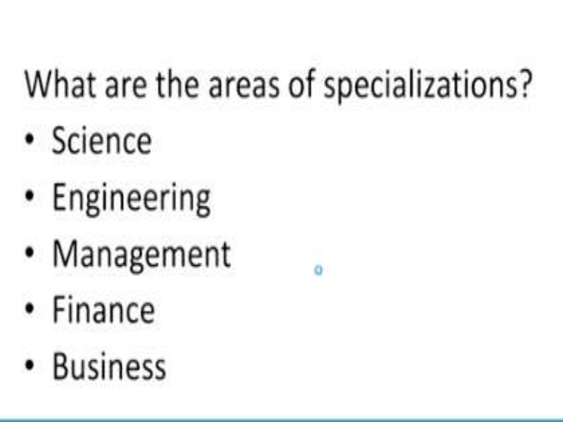

The areas of specialization that would be interested in this course are science, engineering, management, finance and business. 

**(Refer Slide Time: 01:30)** 

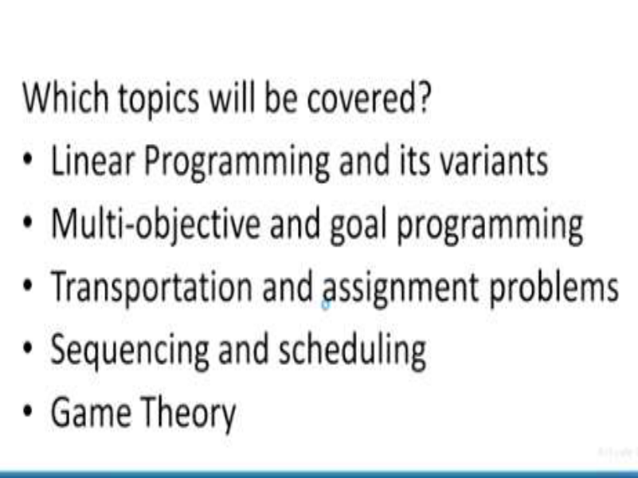

Some of the topics that we are going to cover in this course are the linear programming problem and its variants, multi objective and goal programming problems, transportation and assignment problems, sequencing and scheduling problems and game theory. This course runs over 40 lectures and as you will see a number of examples and case studies will be dealt with, also from time to time, I will be giving you some exercises based on what we have learnt in the previous lectures. 

**(Refer Slide Time: 02:15)** 

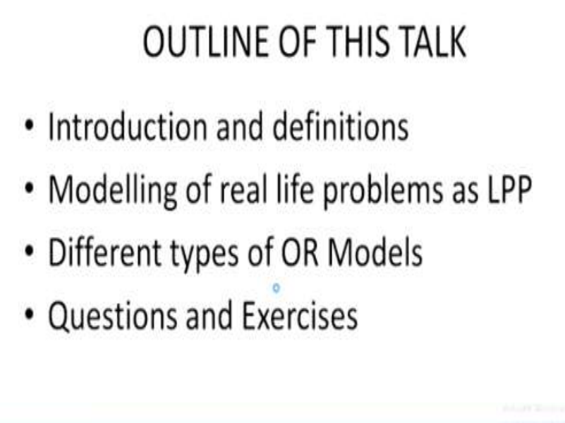

So, this is lecture number 1 on the title as Introduction to OR Models. The outline of this lecture is as follows; first, we will talk about the introduction to the subject of operation research and some definitions, then we will come to the modelling of real life problems as linear programming problems. We will look at different types of OR models and finally some question and answers, and some exercises. 

**(Refer Slide Time: 02:50)** 

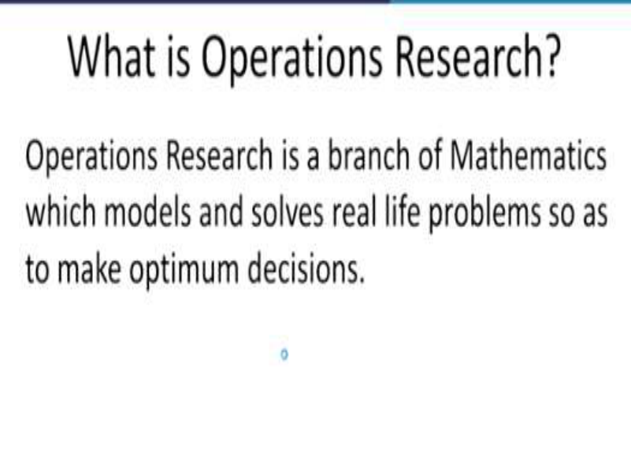

So, what is operation research? Operation research is that branch of mathematics which is used to model and solve real life problems in such a way that optimum decision is to be made. So wherever there is a decision making process, the optimization techniques and the operation research techniques come into handy, whether it is a day to day activity or some advanced engineering or science or business or financial applications. 

**(Refer Slide Time: 03:31)** 

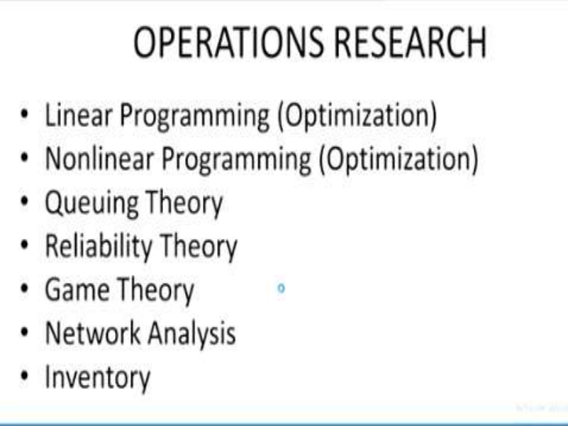

Now, the operation research has the following sub areas of study. The first one is called the linear programming problems, they are also called the linear optimization problems, next is the nonlinear programming problems or the nonlinear optimization problems. Queuing theory is that branch of operation research which studies the queues for example, when you go to a bank to withdraw your money, you have to follow a queue. Similarly, when you are putting up some jobs on a computer then a queue is lined up, so this queuing theory studies the behaviour of queues. Reliability theory is also one of the major areas of operation research which studies the reliability of a system whether it is a mechanical system, whether it is the building; the civil engineering structure of a building and so on. 

Game theory is another very interesting area of operation research which talks about the decision making process when a game is played between two or more than two components. The network analysis is that study which talks about the study of the networks for example, when we have to design a network which is let us say, the Internet Service Providers or some other kind of network. It is the study of the network analysis. Then comes the inventory; inventory control is an important aspect when business has to be dealt with, that is, when a commodity has to be stored in some warehouse and the decision has to be made as to how much quantity of the commodity should be there in the inventory, so that the customers are not lost. At the same time, the cost of storing that commodity is minimized. **(Refer Slide Time: 05:51)** 

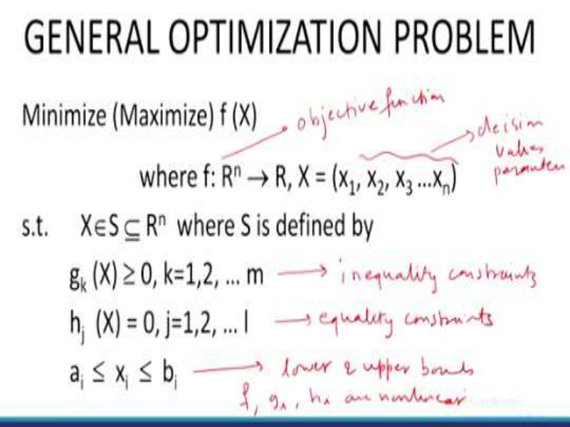

So, first let us define what do we mean by a optimization problem because as I said that optimization is the key area of operation research, whether it is network analysis or whether it is queuing analysis, everywhere we encounter the optimization problem. Now, the mathematical definition can be stated as follows; 

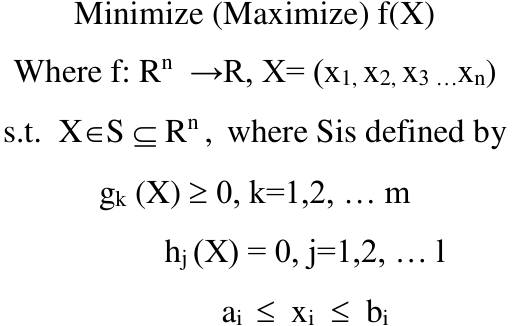

minimize or maximize a function f(X), which is a real valued function defined on the Rn space, that is, the n-dimensional Euclidean space and it is a real valued function, so it is mapped onto the real numbers. X; X= (x1, x2, x3 …xn) is the decision parameters, these are the parameters which have to be determined and these X values should belong to a set S, where S  Rn defined by the following conditions; gk(X)  0 where k=1,2, … m , similarly, hj (X) = 0, where j=1,2, … l and ai  xi  bi for i = 1, 2…. n. Now, this f is called as the objective function, that is, this is the function which has to be either maximized or minimized depending upon the problem at hand. Now, the g case, that is, g1 X, g2 X, they are called the inequality constraints, if they are less than equal to type, then they can be converted to the greater than equal to type. The hj(X) are called the equality constraints and these( ai  xi  bi ) conditions are called the lower and upper bounds. And of course, these x1, x2 each of these x1, x2’s they are called the decision 

parameters, decision values or decision parameters, these are the ones that have to be determined. Now, in general all these functions they are the real valued functions and they are in general nonlinear. So, in general, f, gi, hi are nonlinear. As a special case when they are linear, then the problem is called as a linear optimization problem or a linear programming problem. 

**(Refer Slide Time: 09:06)** 

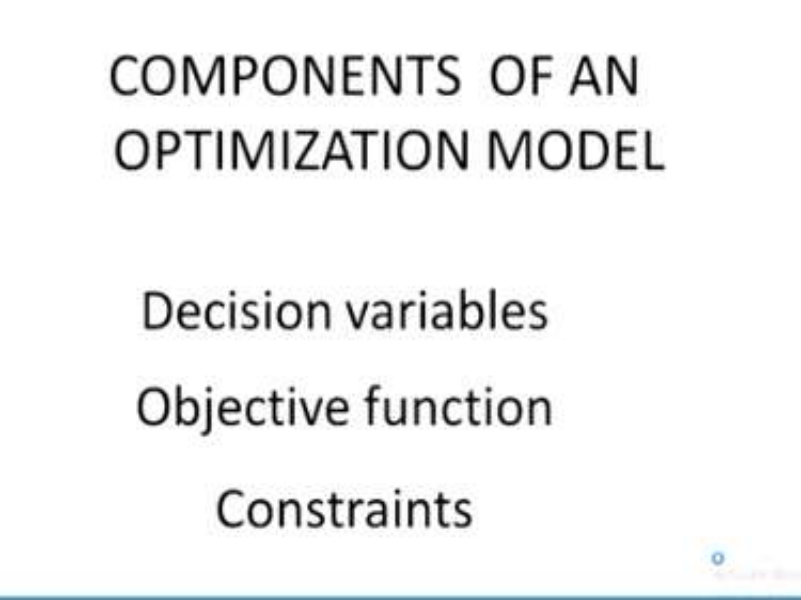

So, first of all let us look at the various components of an optimization model. The first one is the decision variables, these are the variables that have to be determined for a given problem as I said in the previous slide; x1, x2,…xn these are the decision parameters, they have to be determined they are called the decision variables or decision parameters. Second component is the objective function, what is to be minimized or maximized and the third component are the constraint that is those conditions which the decision parameters should satisfy. 

**(Refer Slide Time: 09:52)** 

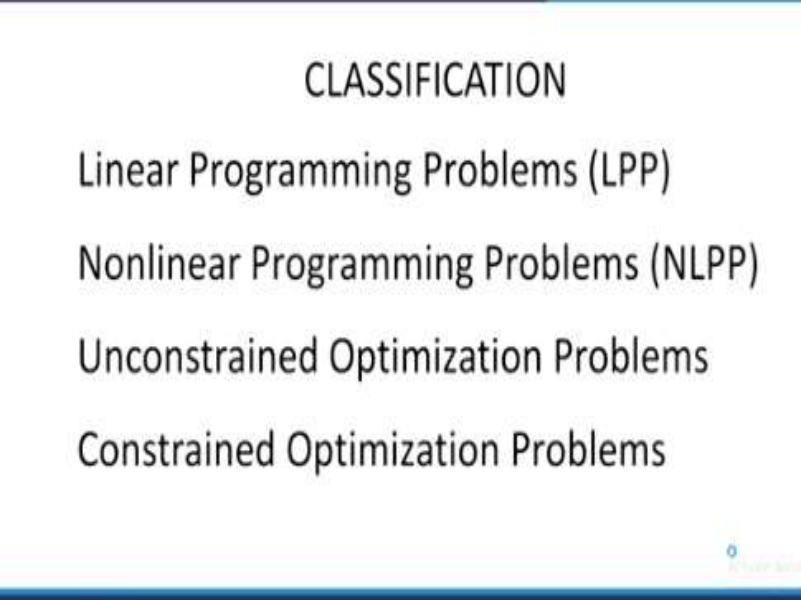

Now, let us look at the various kinds of classification that could exist in the various kinds of optimization problems. The first one is the linear programming problem which I mentioned earlier, that is, those problems in which all the functions involved that is f with gi, hi they are all linear, this is the specialized case of a linear programming problem. The second category is called the nonlinear programming problems, that is, moment any one of f, gi, or hi they are lead a nonlinear, then the problem becomes a nonlinear optimization problem. 

Now, it may be possible that the problem does not have any constraints, so, in such a situation the problem is called as a unconstrained optimization problem. However, the moment even a single constraint is imposed on the decision parameters then it is called as a constraint optimization problem. 

**(Refer Slide Time: 11:06)** 

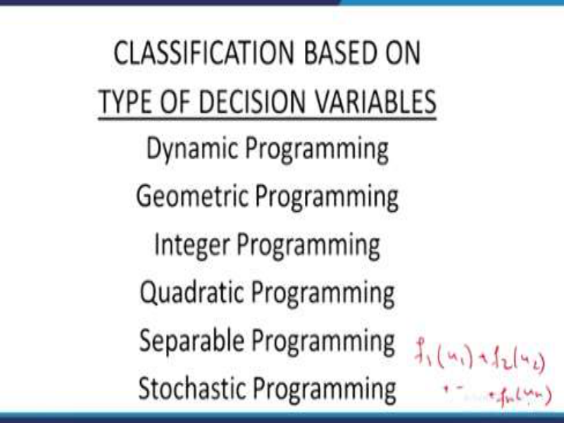

Then there could be a classification which is based on the type of the decision parameters, what does this mean? The first one is called the dynamic programming problem, this means that the decision variables are dependent upon each other with the help of a particular parameter usually time, so that means that they are multistage programming problems and that is the reason why they are called as dynamic. Because the decision parameters are dependent on the time factor or some other stage, so they are called the dynamic programming problems. 

Also, there could be geometric programming problems. In such type of problems, the decision variables could be taking negative powers as well that is for example, , like this, so they are called the geometric programming problems. 

Then comes the integer programming problems, in these kinds of problems, the decision parameters are restricted to take only integer values, they are not allowed to take the real parametric values. Then comes the quadratic programming problems, these are those problems in which the objective function is a quadratic function whereas, the constraints are linear. 

Then comes the separable programming problems. In such type of problems, the objective function is of the type which is of function of one variable only that means, let us say f1(u1) + f2(u2) like this so, the objective function can be broken into a number of terms such that each objective function is of one restricted variable only. Also, we have the stochastic programming problems in which the decision parameters are stochastic in nature. 

**(Refer Slide Time: 13:30)** 

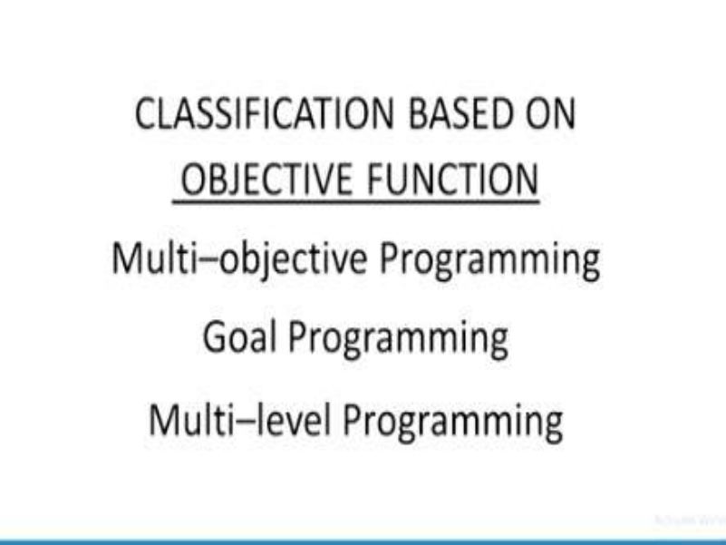

Another classification that exists is based on the objective function, if there are more than one objectives to be minimized or maximized, it is called as a multi-objective optimization problem. In general, a multi objective optimization problem could be nonlinear and in the specialized case, you could also have what is called as a multi objective linear programming problem, so 

both the possibilities exist that is linear multi objective and nonlinear multi objective programming problems. 

Then there are problems in which a particular goal is to be achieved by the objective function and these are called as the goal programming problems. Also there could be a situation where a number of levels are to be achieved by the various objectives involved in the objective function, they are called as multilevel programming problems. 

# **(Refer Slide Time: 14:41)** 

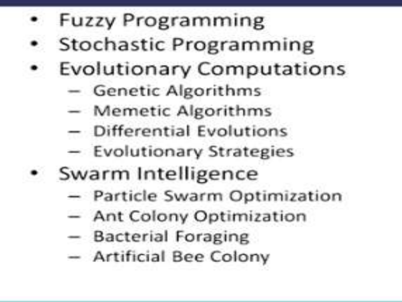

So, other kind of problems could exist, that is, the fuzzy programming problems in which the decision parameters are fuzzy in nature. Stochastic programming problems in which the decision parameters and the constraints, and the objective function are stochastic in nature. Recently, another category of problems and methods has come into existence which are called as evolutionary computations. These are; these derive their inspiration from living organisms and in this category we have the genetic algorithms, memetic algorithms, differential evolution, evolutionary strategies. Another category that is come into existence in the last 20 years is the swarm intelligence techniques, these techniques are based on the swarm behaviour of a group of living organisms whether it is a group of birds flying in the sky or some of the fish that are swimming in a pond. Some of these techniques in this category are called the particle swarm optimization, ant colony optimization, bacterial foraging, artificial bee colony and many more. **(Refer Slide Time: 16:09)** 

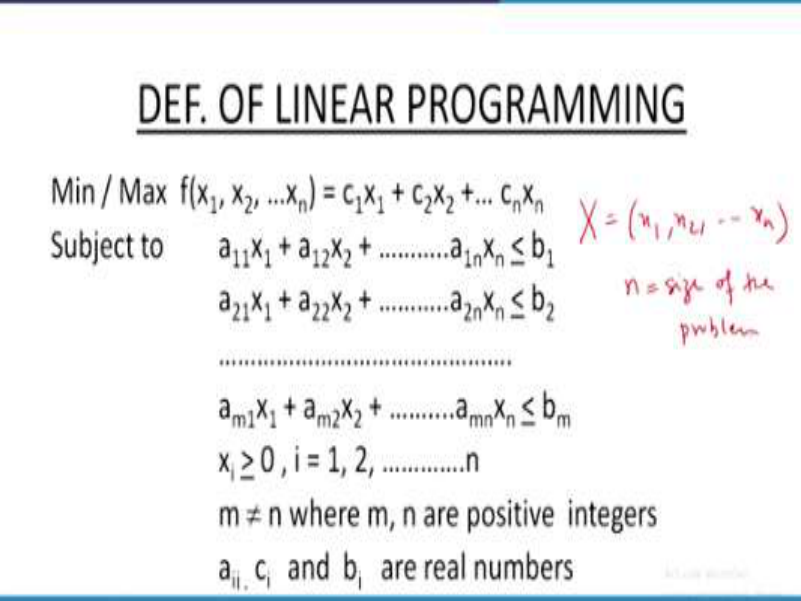

So, now we will come to the simplest case of the linear programming problem, so first of all let us look at the mathematical definition of a linear programming problem. The objective function is a linear function which has to be minimized or maximized it is of the type c1x1 + c2x2 +… cnxn, so as you can see that I have used the x1 and x2 and xn as small, so the decision parameters are x1, x2, xn. And this could be subject to the following conditions; a11x1 + a12x2 + ………..a1nxn <u>< b1.</u> Similarly, a21x1 + a22x2 + ………..a2nxn <u>< b2, am1x1 + am2x2 + ……....amnxn <</u> bm , all the decision parameters xi <u>> 0 , where i = 1, 2,….n, note that in general m</u>  n and m and n are both positive integers, also these parameters aij's, ci’s and bj’s, they are all real numbers. So, our decision vector (x1, x2,… xn), this is our decision vector, this has to be determined subject to the conditions that are given in these inequalities, n is called as the size of the problem. 

**(Refer Slide Time: 18:23)** 

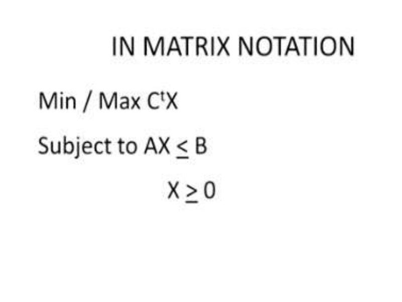

Now, the same definition can be written in terms of matrix notation that is minimize or maximize, subject to minimize or maximize Ct X, subject to AX < B and X > 0. 

**(Refer Slide Time: 18:42)** 

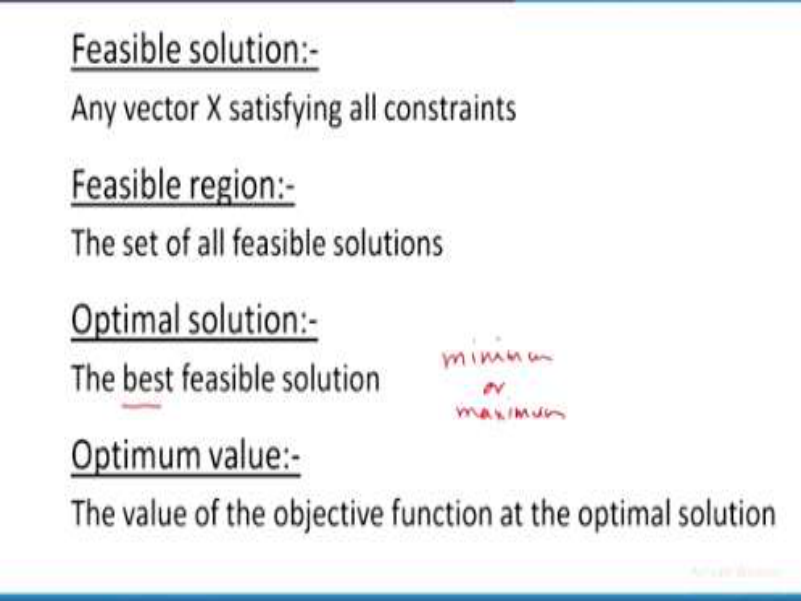

Now, let us look at some of the definitions which are related to the linear programming problems. Any vector X satisfying all the constraints of the problem is called as a feasible solution. All those feasible solutions they combine to become the feasible region, so, the feasible region as defined as the set of all feasible solutions. 

Out of these feasible solutions, there is one which is called as the optimum solution. And this means that the objective function is the best, so, the best feasible solution is called as the optimum solution. Now, by best we mean either minimum or maximum depending upon the problem at hand and finally, the value of the objective function at that optimum solution is called the optimum value. 

**(Refer Slide Time: 19:59)** 

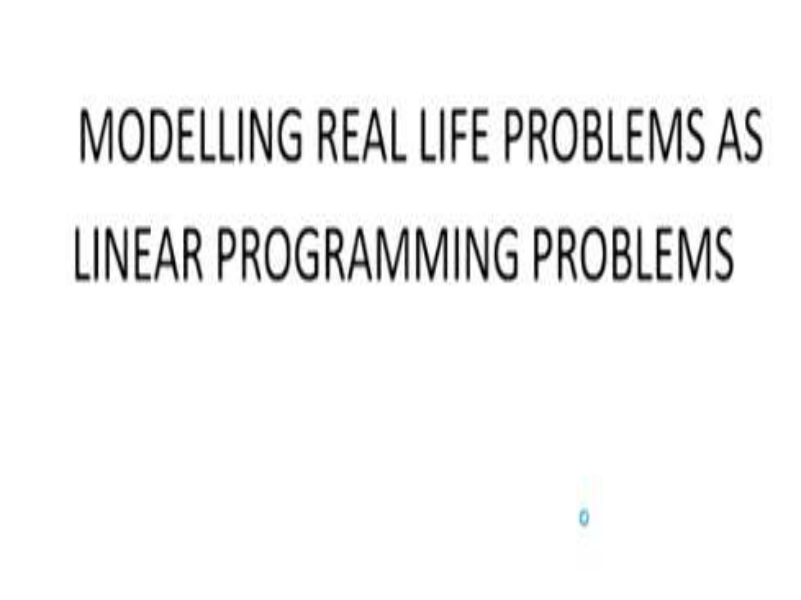

So, modelling of real life problems as linear programming problems, please note that operation research is one such subject which is used to solve real life optimization problems and that is what we are trying to understand how real life problems can be modelled as optimization problems either linear optimization problems or nonlinear optimization problems. So, first of all the case of modelling real life problems as linear programming problems. 

**(Refer Slide Time: 20:39)** 

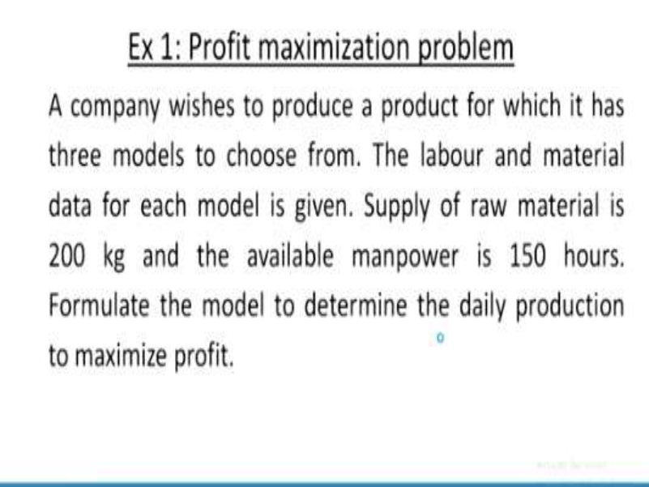

So, here is an example; it is the maximization of the profit, so it is called the profit maximization problem. The problem states that a company wishes to produce a product for which it has 3 models to choose from. The labour and the material data for each model is given also, the supply of raw material is given to be 200 kg’s and the available manpower is given to be 150 hours. We are required to formulate the model so as to determine the daily production such that the profit is maximized. 

**(Refer Slide Time: 21:35)** 

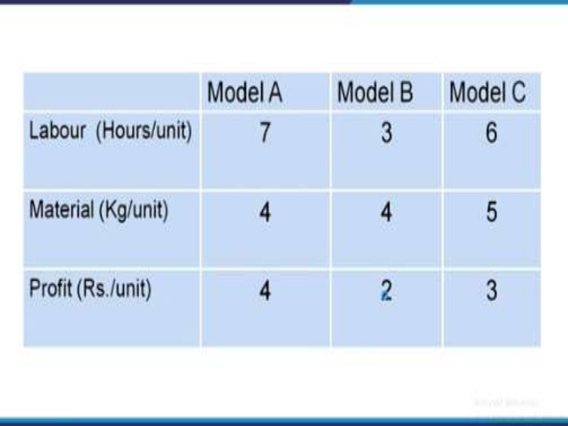

Now, the data that is given in the problem is as follows; there are 3 models; A, B and C and the labour in terms of hours it is given per unit, so per unit of model A requires 7 hours of labour. Similarly, per unit of model B requires 3 units of labour and similarly, the C model it requires 6 units, i.e., 6 hours of labour. The second thing is the materials, so material is in terms of kg, so model A requires 4 kg of material, model B requires again 4 kg of material and model C requires 5 kg of model C. 

Then comes the profit; the model A per unit has a profit of rupees 4 and for B it is 2 and for C it is 3 so, this is the data that is given in the problem. 

**(Refer Slide Time: 22:53)** 

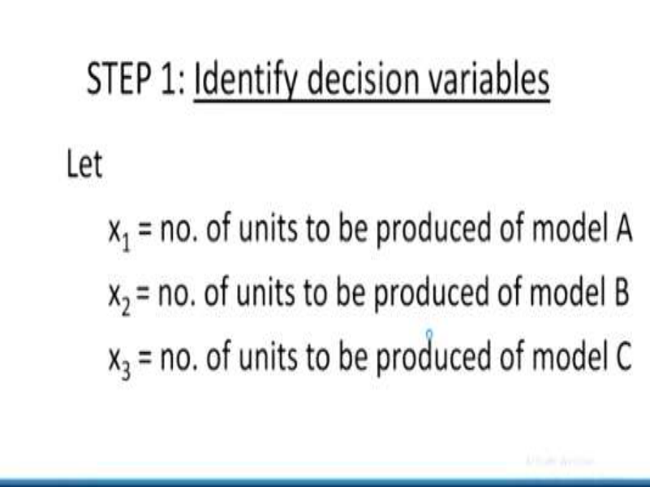

Now, we will try to model the problem in 3 steps; the first step is identification of the decision variables, so, these are the variables which we have to determine. So, let us assume that we 

have the following decision variables; x1 = the number of units to be produced of model A similarly, x2 is the number of units to be produced of model B and x3 is the number of units to be produced of model C, these are x1, x2, x3 are the decision variables and this is what we have to determine. 

**(Refer Slide Time: 23:42)** 

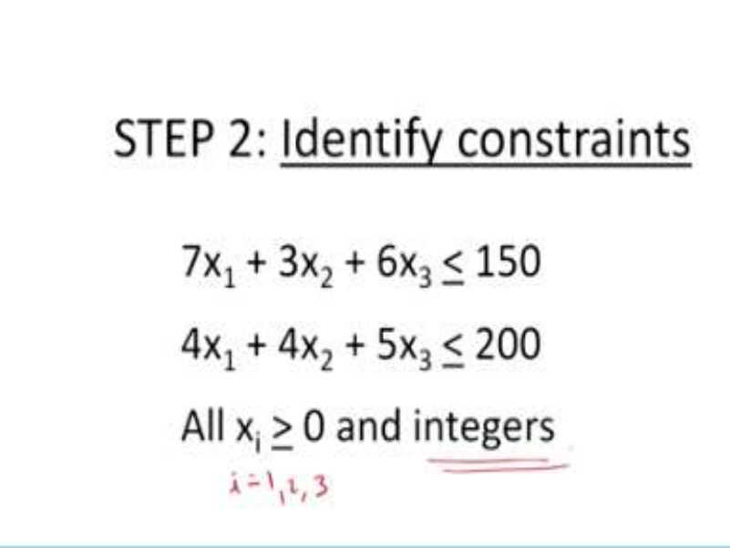

Second step is the identification of the constraints, so these are the constraints; 7x1 + 3x2 + 6x3 <u>< 150, how did this constraint come from? Look at the data that is given to you in the problem.</u> Let me go back to the table so, here you see in the first row of the table 7, 3 and 6, these are the coefficients of each unit of model A, model B and model C. Since we have assumed x1 to be a variable that is the number of units to be produced of model A, so, 7 has to be multiplied by x1 and similarly, 3 has to be multiplied by x2 and 6 has to be multiplied by x3 and all of them together, i.e., when you add them up, this should satisfy the condition that is they should be < 150, why150? Because in the problem it is given that there are 150 hours of labour which is available so, therefore the sum of all these three terms should be  <  150. 

In the similar manner, we have the second constraint, that is, 4x1 + 4x2 + 5x3 should be < 200 and of course, all the decision variables x1, x2, x3 should be > 0 and they should be integers of course, the value of i goes from 1 to up to 3. Why they have to be integers? Because you can produce either 6 units of model A or you can produce 7 units of model A, you cannot produce 6.5 units of model A that is the reason why this integer requirement is important. 

**(Refer Slide Time: 26:03)** 

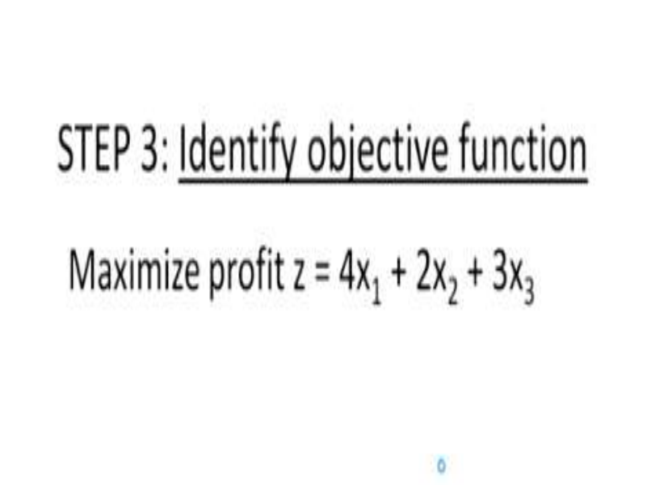

The third step is the identification of the objective function that we have to minimize or maximize. So here we find in our case the profit has to be maximized and what is the expression for the profit; it is given by 4x1 + 2x2 + 3x3, why did this come from? Because in the last row of the table you can see in the table that is given (this is the last row); profit in terms of rupees that is 1 unit of model A requires 4 rupees. Similarly, 1 unit of B requires 2 units and similarly, 1 unit of model C requires 3 units, so 4x1 + 2x2 + 3x3, this is the expression for the profit and obviously, it is common sense that the profit has to be maximized. So, you have to take a decision what do you have to do with the objective function whether it has to be maximized or minimized depending upon the problem at hand. 

Therefore, these(x1, x2, x3) are the decision parameters in step number 1. And step number 2 we have identified the constraints and in step number 3, we have identified the objective function which has to be maximized in this case. So, this is the way that using these three steps you can model a given problem into a linear programming problem which is also called as the linear optimization problem. 

**(Refer Slide Time: 27:55)** 

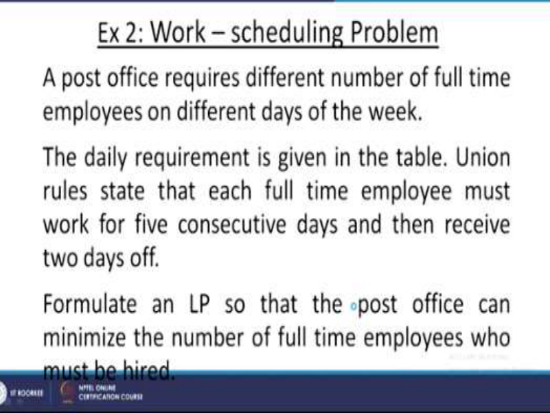

Second problem is regarding the work scheduling problem. These kinds of problems have lots of applications whether it is the scheduling of the workers, scheduling of the nurses or scheduling of any kind of staff. So in this problem there is a post office which requires different number of full time employees on different days of the week. The daily requirement is given in the table below. The union rules state that each full time employee must work for five consecutive days and then take two days off that is the union rule says that there should be 5 days working. We are required to formulate the problem as an LPP, so that the post office can minimize the number of full time employees who should be hired. 

**(Refer Slide Time: 29:05)** 

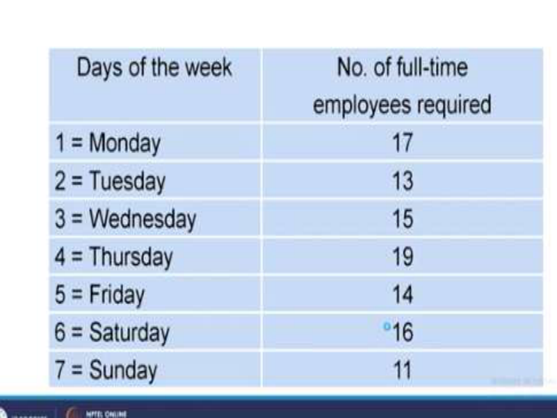

So, let us look at the data that is given, the data says that the seven days of the week has the following requirement of number of full time employees, so first of all if you call Monday as number 1 day, then it requires 17 number of full time employees for Monday. Similarly, for the 

day 2 that is Tuesday there are 13 full time employees that are required and like this for the remaining days of the week, this is the data this is given in the problem. 

**(Refer Slide Time: 29:43)** 

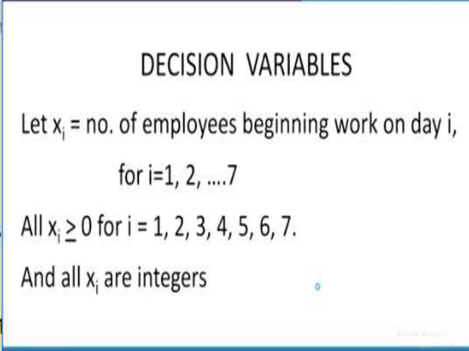

So, first step is identification of the decision variables, so it is very simple just define xi to be the number of employees beginning their work on day number i, so x1, x2, x3,…x7 , these are the number of full time employees that should be employed on each of the seven days of course. All the xi’s should be > 0 because you cannot talk about -10 number of employees, so they have to be <u>> 0 and also they should be integers, because you can either employ 5</u> employees or you can employ 6 employees, so therefore integer restriction has to be imposed. **(Refer Slide Time: 30:38)** 

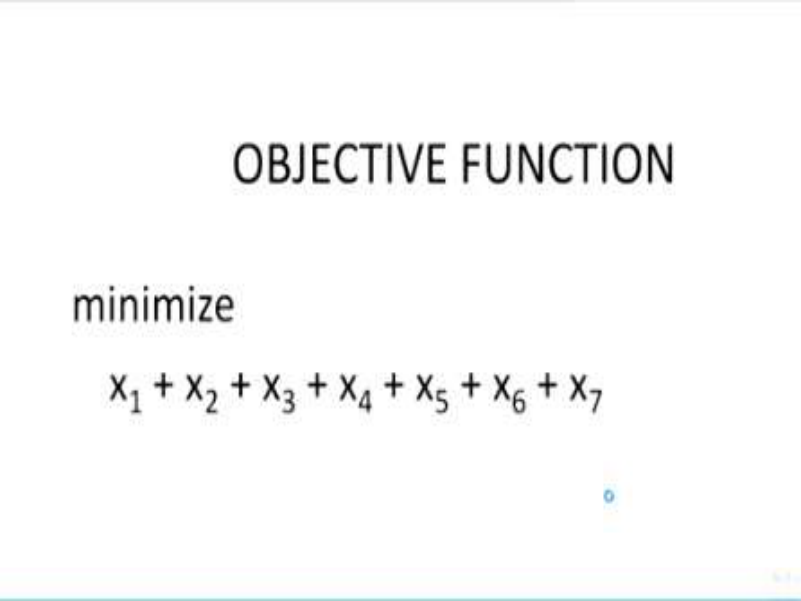

Then comes the objective function, now, the objective function is the sum of all the employees that have to be employed on all the seven days that is x1, x2, x3 up to x7 and this has to be 

minimized because the more you employ and the more cost is incurred. Therefore, one was interested in only minimizing the total number of employees. 

**(Refer Slide Time: 31:06)** 

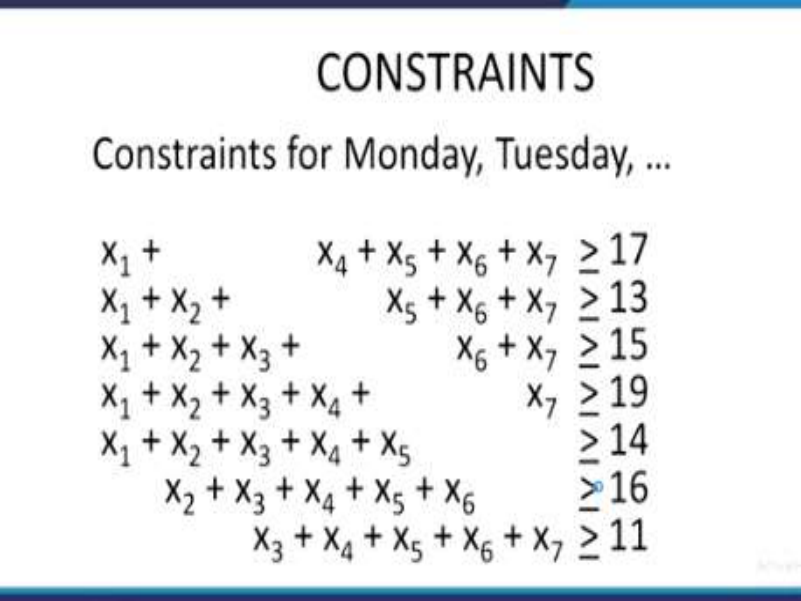

Then comes the constraints now, for each of the seven days of the week, we have these constraints; x1 + x4 + x5 + x6 + x7 > 17, you will ask why I have not written x2 and x3 in the first equation. In the first equation, x2 and x3 are missing because these x2 and x3 employees, they have to take 2 days off okay, so therefore during the taking care of the union rules, these number of employees have to be removed from the first equation. And like this for the second equation we have to remove x3 and x4 and like this of course, the permutation could be interchanged depending upon the way one tries to model and define x1, x2 etc., so like this these are the constraints and as you know that there are seven days, so there are 7 constraints. **(Refer Slide Time: 32:19)** 

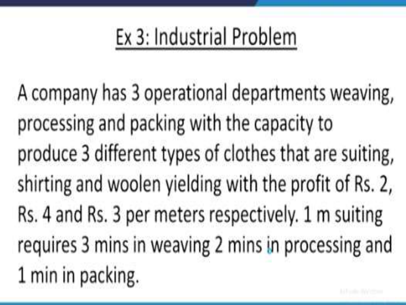

The third problem is about the industrial problem; it says that a company has 3 operational departments, these departments are called the weaving, processing and packaging with the capacity to produce 3 different types of clothes which are called as suiting, shirting and woollen yielding a profit of rupees 2, rupees 4 and rupees 3 per meter respectively. 1 meter suiting requires 3 minutes in weaving, 2 minutes in processing and 1 minute in packing. **(Refer Slide Time: 33:06)** 

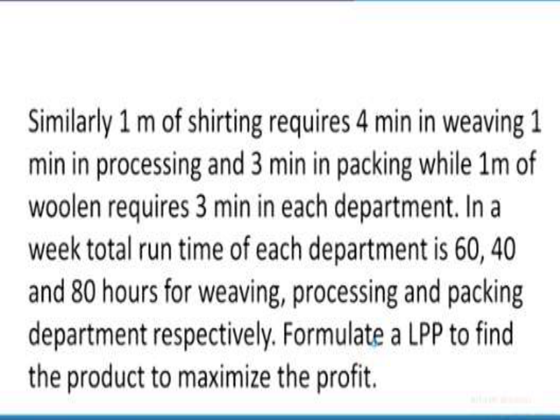

Similarly, 1 minute of shirting requires 2 minutes in weaving, 1 minute in processing and 3 minutes in packing, while 1 meter of woollen requires 3 minute in each department. In a week total runtime of each department is given to be 60, 40 and 80 hours of weaving, processing and packing department respectively. We are required to formulate the problem as a LPP to find the product in such a way that the profit is maximized. **(Refer Slide Time: 33:53)** 

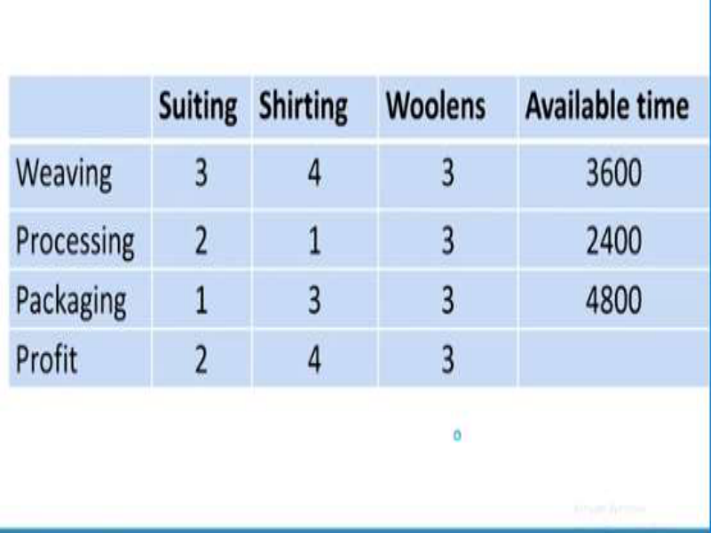

So, the first thing is let us tabulate the given information in the form of this table, so there are three types of clothes that are available suiting, shirting and woollen and 3 types of processing that is the weaving, the processing and the packaging, also, the profit in terms of each unit and also on the right hand side is the available time that is in terms of hours. So, we have to take care of the units, as some data is given in terms of minutes and the available time is given in terms of hours. So, hours should be converted into minutes in order to take care of the dimension of the data, so we have 3, 4, 3 in the first row and this is ≤ 3600, so I think you are now fairly comfortable in guessing how we will define the decision parameters. 

**(Refer Slide Time: 35:03)** 

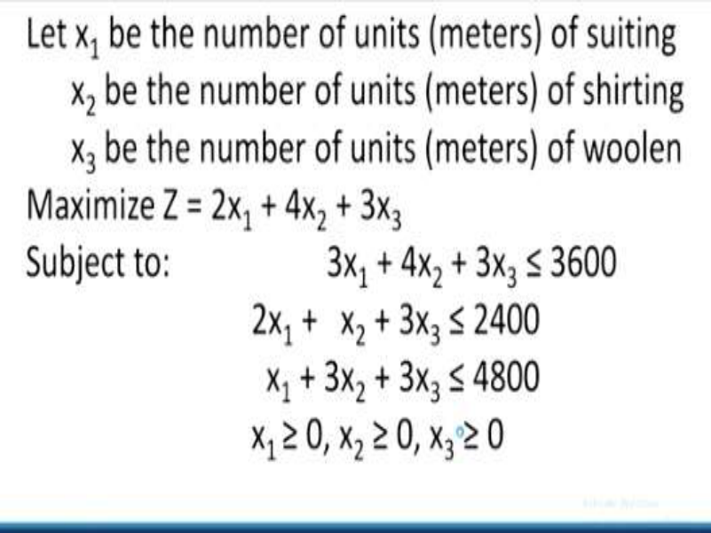

We will define the decision parameters as follows; let x1 be the number of units in terms of meters for the suiting cloth, x2 be the number of units of shirting and x3 be the number of units of woollen and we have to maximize the profit that is 2x1 + 4x2 + 3x3. So this is the data that is given, so profit is 2x1 + 4x2 + 3x3 and also the constraints that are given are as follows; 3x1 + 4x2 + 3x3 ≤ 3600. And similarly, the other constraints; 2x1 + x2 + 3x3 ≤ 2400, x1 + 3x2 + 3x3 ≤ 4800 and of course, x1, x2, x3 they should all be ≥ 0. Please note that, In this particular problem, we need not impose the integer requirement because x1, x2, x3 is the number of units and that number of units of a cloth it could be fractional also that is you could have either 2 meters or you could have 3 meters or you could even have 2.34 meters or you could have 2.5 meters as well. So, therefore the integer requirement is not necessary in this particular example. **(Refer Slide Time: 36:43)** 

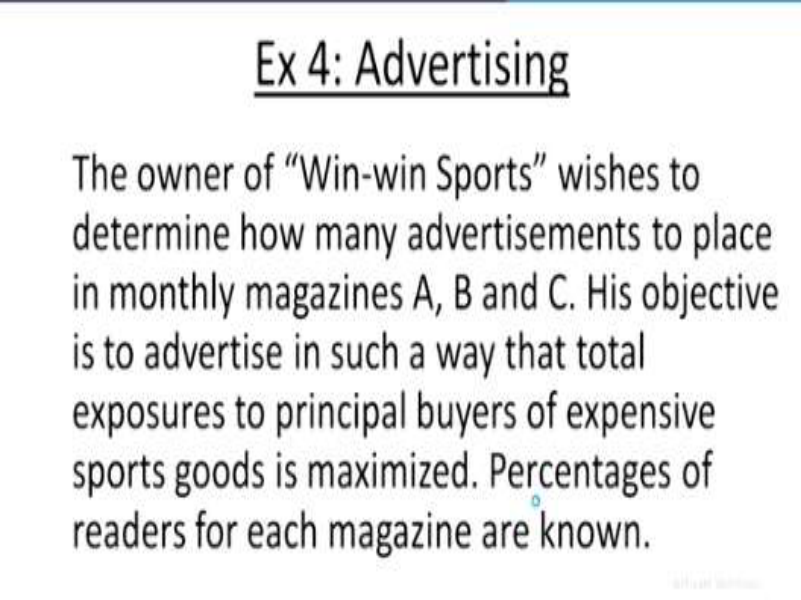

Another interesting applications is about the advertising now. The owner of a Win-win Sports company wishes to determine how many advertisements to place in the monthly magazines A, B and C. His objective is to advertise in such a way that the total exposure to the principle buyers of the expensive sports good is maximized. 

**(Refer Slide Time: 37:21)** 

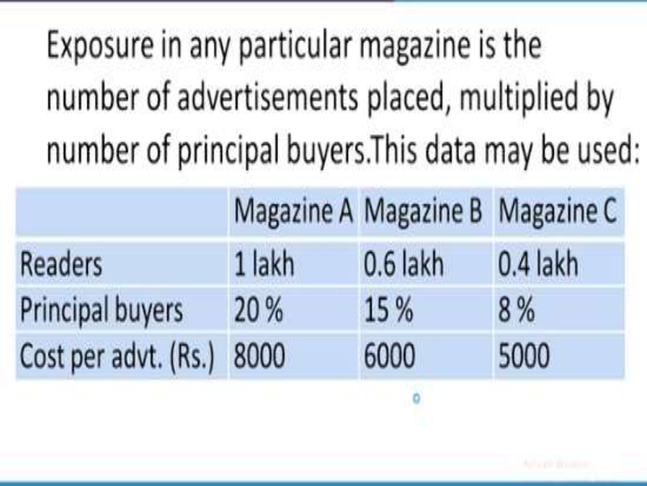

The percentage of readers of each magazine is known and also the exposure in any particular magazine is the number of advertisements placed in that magazine multiplied by the number of principle buyers and this information can be recorded in this table that is magazine A, magazine B and magazine C, the readers; how many readers are there? Magazine A has 1 lakh readers, magazine B has 0.6 lakh readers and magazine C has 0.4 lakh readers. 

And the principle buyers are 20%, 15% and 8% for the 3 magazines A, B and C; also the cost per advertisement in terms of rupees is given to be 8000, 6000 and 5000 for each of the 3 magazines A, B and C. 

**(Refer Slide Time: 38:20)** 

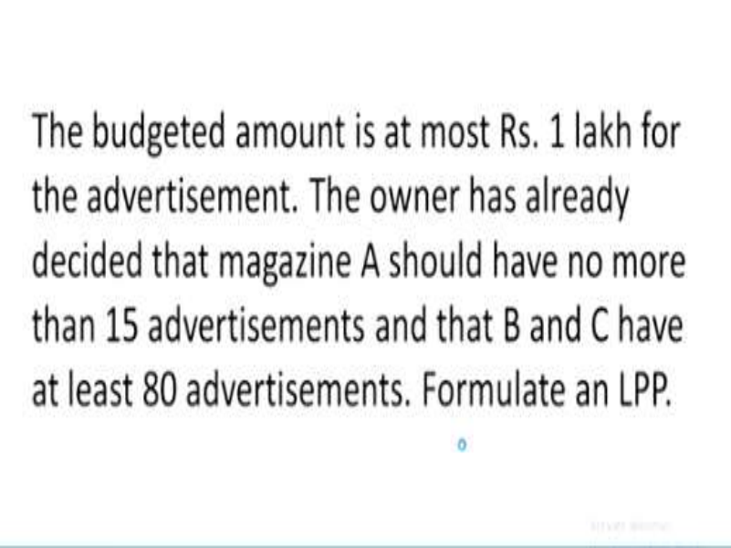

Now, the budget amount is at most rupees 1 lakh for the advertisement and the owner has already decided that magazine A should have no more than 15 advertisements and that the B and C magazines have at least 80 advertisements, so we are required to formulate the given problem as a linear programming problem. 

**(Refer Slide Time: 38:51)** 

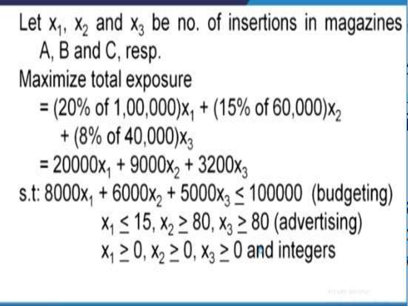

So, let us first of all define the decision parameters, let x1, x2 and x3 be the number of insertions in the magazines A, B and C respectively and the objective function can be written as follows which is nothing but the total exposure that is how many people are going to read it so, we have 

to maximize the total exposure and mathematically it can be written as (20% of 1 lakh) x1 + (15% of 60,000) x2 + (8% of 40,000) x3. When you simplify this you get the following expression and the constraints for each of the conditions that is the budgeting constraint because the budget is given to be 1 lakh, so therefore the budgeting constraint can be written as 8000 x1 + 6,000 x2 + 5,000 x3 <u>< 1 lakh. Similarly, the advertising constraint says that the first</u> magazine should have not more than 15 advertisements, therefore x1 should be < 15 as far as the B and C magazines are concerned, they must have at least 80 advertisements, so therefore x2 should be >  80 and x3 should be > 80. Of course, the decision variables x1, x2, x3 should be >  0 and they should be integers because you cannot insert 2.5 insertions in advertisements in a magazine, either you insert 2 or you insert 3, so therefore integer restriction is important. 

**(Refer Slide Time: 41:04)** 

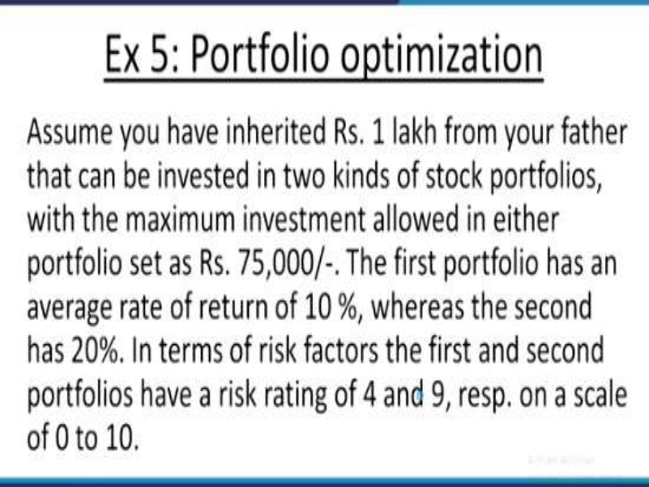

The fifth problem is called the portfolio optimization problem. Assume you have inherited rupees 1 lakh from your father that can be invested in two kinds of stock portfolios with the maximum investment allowed in either portfolio set as rupees 75,000. The first portfolio has an average rate of return of 10% whereas, the second has 20%. In terms of risk factors, the first and the second portfolio have a risk rating of 4 and 9 respectively on a scale of 0 to 10. **(Refer Slide Time: 41:52)** 

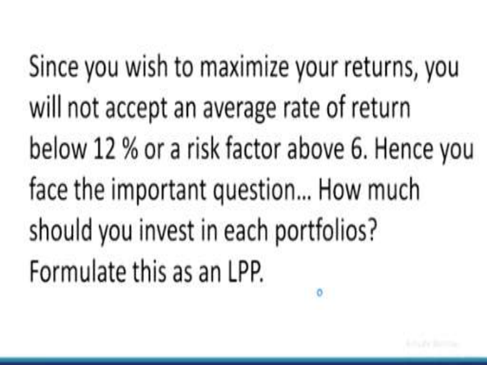

Since you wish to maximize your returns, you will not accept any average rate of return below 12% or a risk factor above 6. Hence you face the important question; how much you should invest in each portfolio? For this, we will model the problem as a LPP. **(Refer Slide Time: 42:20)** 

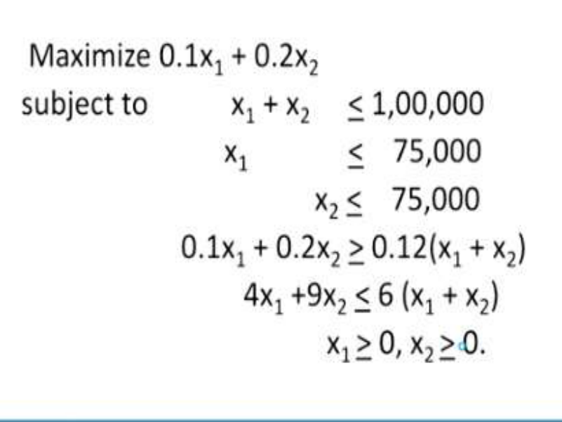

So, given data can be used to model the problem as follows; maximize 0.x1 + 0.x2 ; of course, x1 and x2 are the amount that you have to invest in both the schemes, subject to the condition x1 + x2 <u>< 1,00,000, x1 < 75,000, x2 < 75,000, 0.1 x1 + 0.2 x2 should be > 0.12( x1 + x2), 4 x1 + 9</u> x2 should be < 6(x1 + x2) and obviously x1 and x2 should be >  0 and they need not be integers. **(Refer Slide Time: 43:17)** 

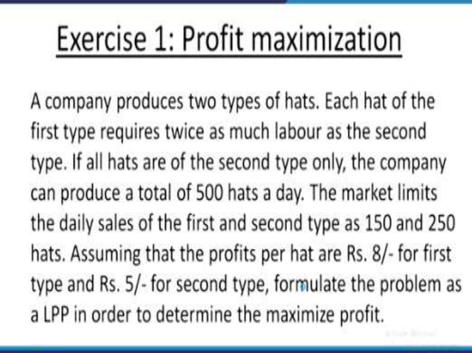

So, I have given you five examples to illustrate how we can model real life problems as a linear programming problem. Now, as an exercise I will give you some questions; the first one is the profit maximization that is a company produces two types of hats, each hat of the first type requires twice as much labour as the second hat. If all hats are of the second type only then the company can produce a total of 500 hats a day. The market limits the daily sales of the first and the second type as 150 and 250 hats assuming that the profits per hat are rupees 8 for the first type and rupees 5 for the second type. Formulate the problem as a LPP in order to determine the maximum profit, so I think you can easily model this problem as a LPP by defining the three steps that we have learnt in this lecture. 

**(Refer Slide Time: 44:37)** 

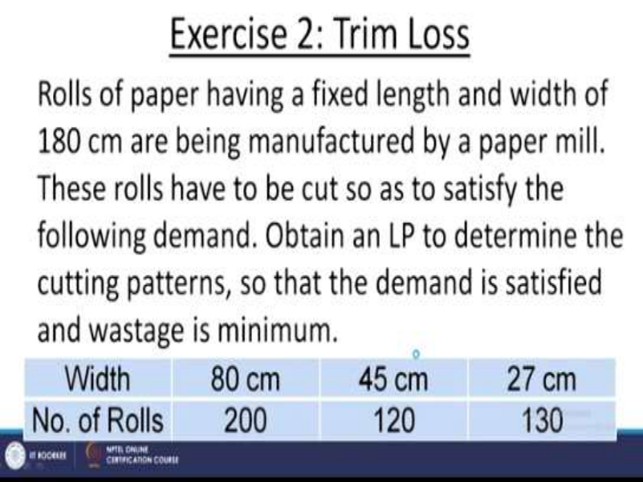

Second exercise is about the trim loss; this is a very interesting application and this occurs in all kinds of industries. Let us say the paper industry, the textile industry, the glass industry, the 

steel industry and so on. The problem says that rolls of paper having a fixed length and width of 180 centimetres are being manufactured by a paper mill, these rolls have to be cut so as to satisfy the following demand. 

Obtain an LP to determine the cutting patterns, so that the demand is satisfied and wastage is minimum now, the data that is given is the width is given in terms of 80 centimetres, 45 centimetres and 27 centimetres and the number of rolls is 200, 120 and 130. 

# **(Refer Slide Time: 45:44)** 

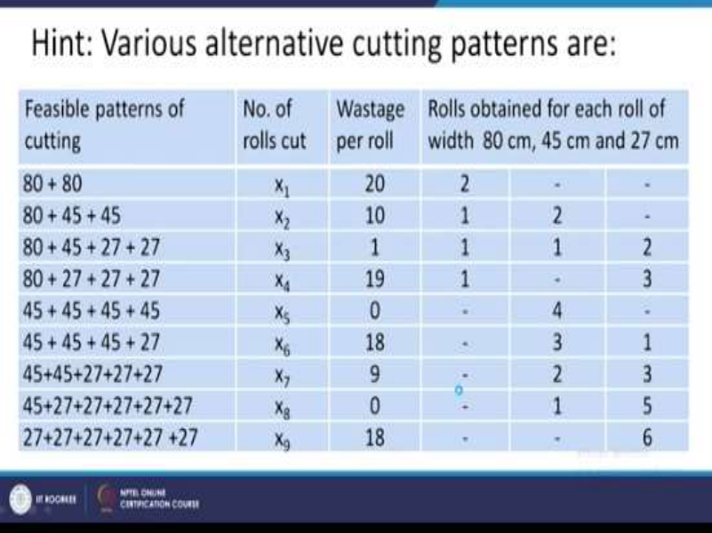

Now, for solving this model, I mean for modelling this problem here is a hint; you have to try to look at the various alternative cutting patterns now, each of the cutting patterns is shown here in this table. For example, I will explain the first one; if the cutting pattern is 80 + 80, the first one so, the number of roles that have to be cut you can define them as x1, x2 etc., and the wastage per unit per role is let us say 20, this 20 comes from the fact that if you have 2 types of patterns that is 80 + 80. So, 80 + 80 is 160 and 160 has to be subtracted from 180 so, 180 - 160 is 20, so that is the wastage. So you have 2 types of 80 centimetre and 0 type of 45 and 27 centimetre, so like this you have all these cutting patterns. 

**(Refer Slide Time: 47:04)** 

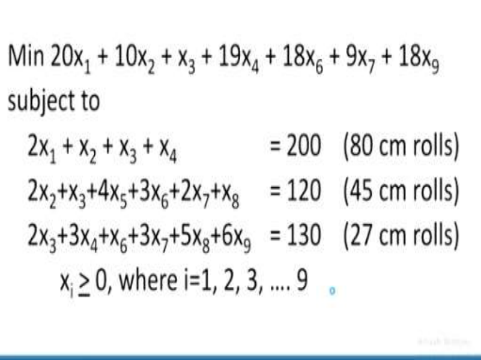

And accordingly based on the decision parameters x1, x2, x3 you can write the model as follows; minimize 20 x1 + 10 x2 + x3 + 19 x4 + 18 x6 + 9 x7 + 18 x9 and subject to these conditions on the 80 centimetre roll, the 45 centimetre roll and the 27 centimetre roll and of course, there are nine variables, xi’s should be > 0. 

**(Refer Slide Time: 47:34)** 

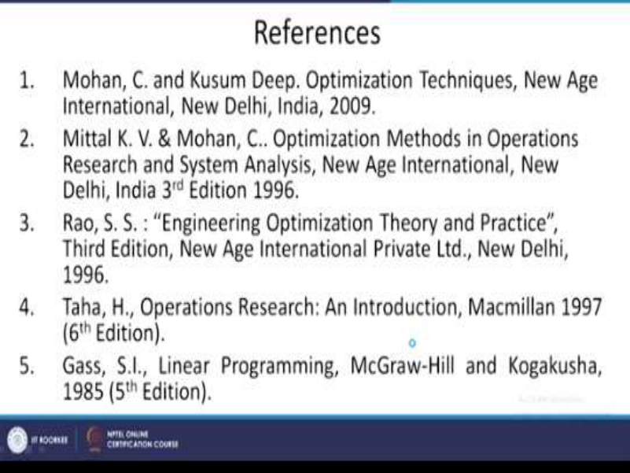

So, in the end I would like to mention some of the books that you should, you could read for getting more information on this topic of operation research and this is going to help you to study the other lectures in this course as well. The first book is by Chandra Mohan and Kusum Deep; it is called as Optimization Techniques by New Age international, India, 2009. K. V. Mittal and Chandra Mohan Optimization Methods in Operation Research and System Analysis, this is also by New Age International. The third book is by S. S, Rao, it is called Engineering Optimization Theory and Practice, another book is by Taha; H. Taha, it is Operation Research 

and Introduction and finally, S. I. Gass, this is a book on Linear Programming. So, with this we come to the end of lecture number 1 of this course, thank you so much. 

