# **Operations Research Prof. Kusum Deep Department of Mathematics Indian Institute of Technology - Roorkee** 

# **Lecture – 10 Infeasible Solution of LPP** 

Good morning dear students, today is the lecture number 10 on the topic of linear programming, we will be talking about the two cases that is the infeasible solution case and the degenerate solution case. 

**(Refer Slide Time: 00:44)** 

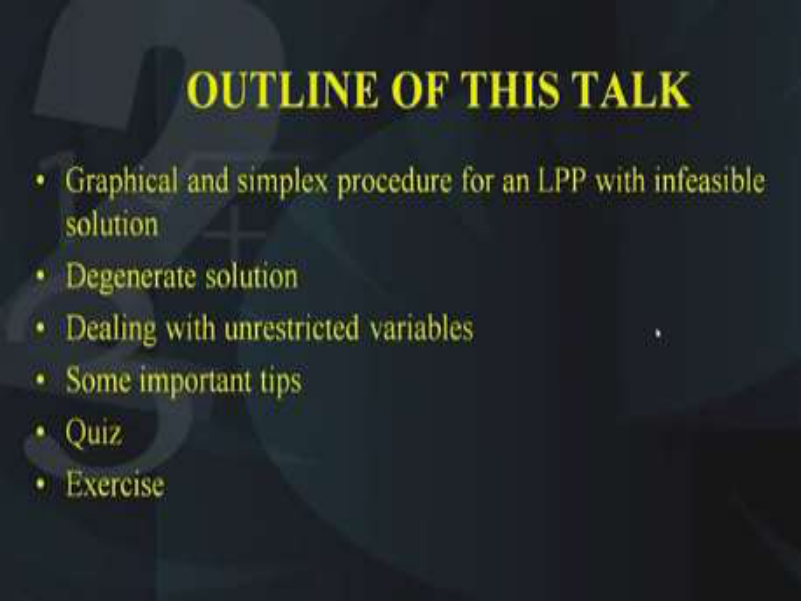

The outline of today's lecture is as follows; we will study the infeasible solution case with the help of the graphical method as well as the simplex method to see a comparative analysis of the situation when we have an infeasible solution. 

Next we will talk about what do we mean by a degenerate solution then we will be talking about a situation where instead of having non negativity constraints as the decision variables, we have the variables as unrestricted variables in sign. Unrestricted means unrestricted in sign, next I will be telling you about some important tips and then I will give you a short answer type quiz and finally some homework and exercise. 

**(Refer Slide Time: 01:52)** 

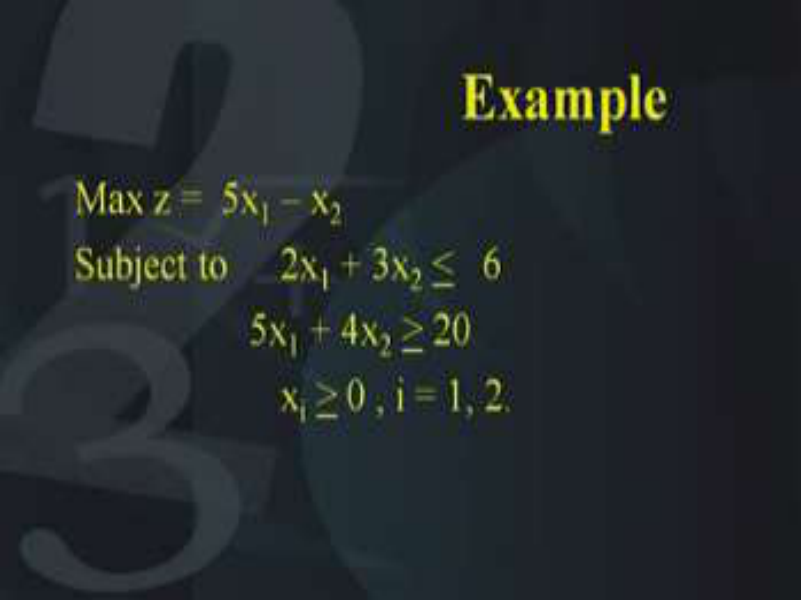

So, let us start with the help of this example here again, we have a two variable problem which is to be maximized and the objective function is 5x1 – x2 subject to 2x1 + 3x2 <u>< 6, 5x1 + 4x2 ></u> 20  and both the decision variables x1 and x2 should be > 0. **(Refer Slide Time: 02:30)** 

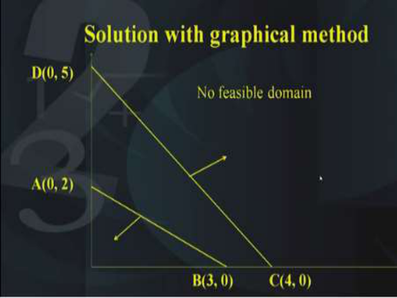

So, first of all as before we will use the graph method to solve this problem, so on the x-y axis, here is the first line that is representing the constraint; the first constraint and then we want to see which side of this line does the feasible domain lie and as you can substitute the value of the origin in the inequality, you find that the feasible region should be below the line. Next we plot the second constraint and again substitute the origin into the inequality to see if which side of the line does the feasible region lies. 

We find that the feasible region lies above the line, so what does it mean? It means that there is no common area which we can call as the feasible region and therefore this indicates that the problem has no feasible solution. As you can see the coordinates of the points which intersect with the line and the x axis and the y axis are indicated as A, B, C and D but there is no feasible solution and this is what we are concerned with. When we have no feasible solution it is also called a infeasible solution case, so we will solve this very problem with the help of the simplex method and we will identify what happens in the calculations of the simplex method, so that we can identify that the problem has a infeasible solution. 

So, as before I have written the problem again that is we have a two variable problem which is to be maximized, 5x1 - x2 subject to 2x1 + 3x2 <u>< 6 and 5x1 + 4x2 > 20.</u> 

**(Refer Slide Time: 05:06)** 

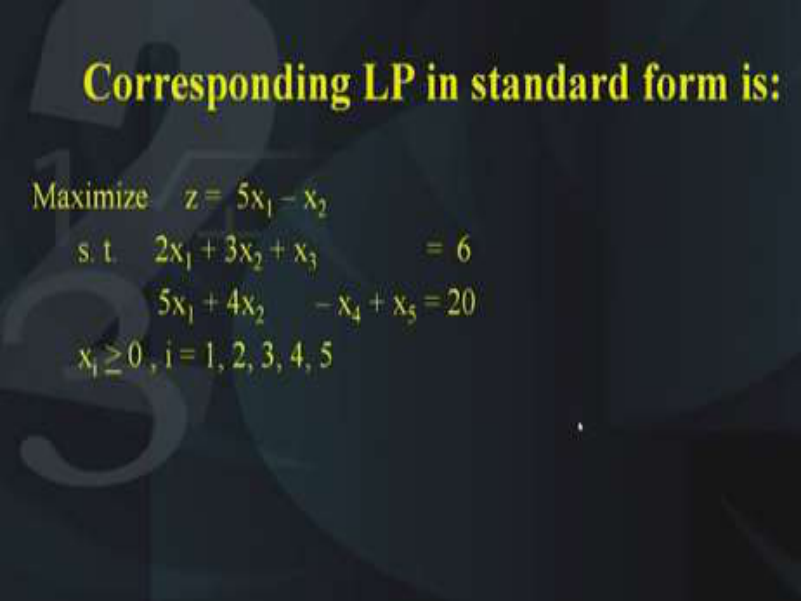

So, we will first of all write the problem in the standard form and we will make sure that every constraint has a basic variable, so what will happen? In the first constraint we will introduce x3 which is a slack variable and in the second constraint, we will introduce x4 which is a surplus variable and it has to be subtracted and since there is no basic variable in the second constraint, so we need to add artificial variable in the second constraint. **(Refer Slide Time: 05:48)** 

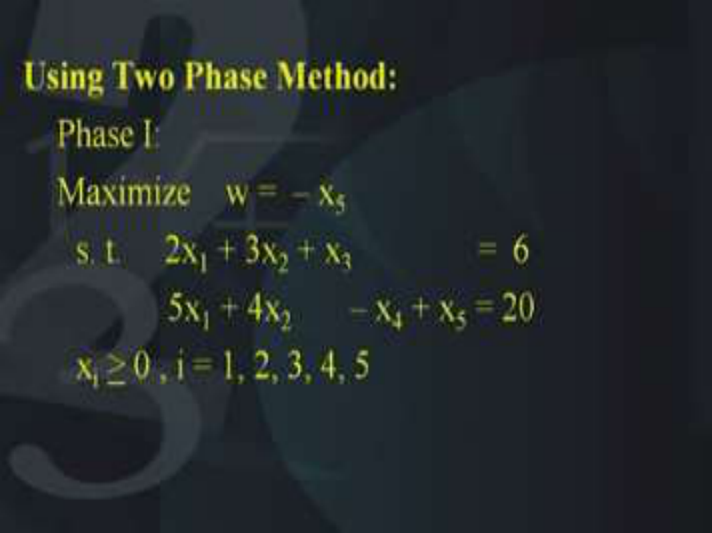

This means that the problem becomes a five variable problem and we will solve it with the help of the two phase method. So, the first phase of the method means that we have to minimize the sum of the artificial variables, now as you know that there is only one artificial variable and we want to maximize minus of this artificial variable that is maximization of -x5 and the constraints are as it is. 

**(Refer Slide Time: 06:21)** 

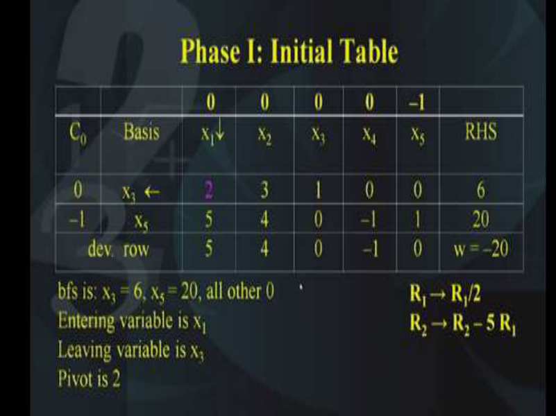

So, we will put all this information in the form of a table, as you can see that in the first equation the basic variable was x3, so x3 and x5 come under this column of basis and its corresponding coefficients in the objective function that is 0 and -1. I hope you remember that during the two phase method, we set aside the original objective function and replace it with a temporary objective function. 

So, the constraints of the objective function are as follows; 0, 0, 0, 0 and -1, under the x1 column we have 2 and 5, so these are the entries under the x1 column, under the x2 column we have the entries 3 and 4, under the x3 entry we have 1 and 0 and x4 we have 0 and -1, x5 we have 0 and 1 and the right hand side is 6 and 20. So, this is the initial table that we have constructed. The next thing we need to calculate is the deviation rows so, the deviation rows are calculated as before 0 –(0, -1) (2, 5)t and the answer comes to be 5; similarly, 0-(0,-1) (3, 4)t , the answer comes to be 4. Now, x3 is a basic variable so, its entry in the deviation row is 0 and similarly, the x5 variable is also a basic variable, so its entry also is 0. Only x4 will be different and it is 0 – (0,–1) (0,-1)t and that comes out to be – 1. 

Now, the objective function value for this modified objective function is - 20 and therefore we can say that the BFS is as follows, that is, x3 = 6 and x5 = 20 and all other variables as 0. So, we will decide which variable should enter the basis and for this, we look at all the entries in this deviation row and the highest entry as you can see is 5, so this indicates that this variable x1 should enter the basis. So, the entering variable is x1 then, we will perform the minimum ratio test; 6/2 and 20/5, which one of them is the minimum? The first one is the minimum and this indicates that x3 should leave the basis, so the decision is that the leaving variable should be x3 and this tells us that the pivot should be 2 which is shown in the pink colour. So, 2 is the pivot and we have to apply the elementary row operations in such a way that this 2 becomes 1 and this 5 becomes 0. 

You see then only x1 will become a basic variable, so what are the elementary row operations that we should apply? First of all, we should multiply the entire first row with 1/2 or rather we should divide the entire row 1 with 2. So, once you apply this you will get this pivot will become 1 and that is what you want. Apart from this, we also need to apply this elementary row operation that is R2 should be replaced by R2 - 5 R1. Because if you apply this elementary row operation, then this entry under the x1 column will become 0 so and that is what you want. **(Refer Slide Time: 11:00)** 

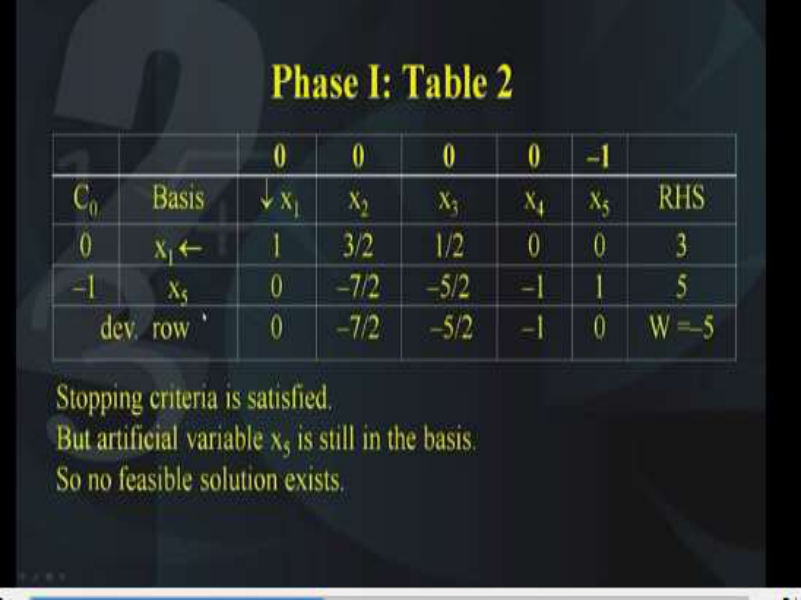

So, by applying these elementary row operations this is what you get, the first one was divided by 2, so this becomes 1, this becomes 3/2, this becomes 1/2, 0, 0 and 3, so this is the first row. Next we apply the second elementary row operation on the second row and what is that; that is R2 should be replaced by R2 – 5R1 and that makes this entry as 0, -7/2, -5/2, -1, 1 and 5. So, this gives us the second table of the phase 1. 

As before we will now calculate the entries in the deviation rows now, you will observe that since x1 is a basic variable, so the entry corresponding to this x1 should be 0. Similarly, since x5 is also a basic variable, so the entry corresponding to x5 should also be 0, whereas the other ones we need to calculate. So, for x2 we have 0 – (0,-1) (3/2, –7/2)t which comes out to be –7/2. Similarly, 0-(0,-1) (1/2,-5/2)t and this comes out to be -5/2 and similarly for x4; 0-(0,-1) (0,-1)t and that gives you –1. So, what we find is that we have got all the entries of the deviation row, now what we find; we find that the stopping criteria are satisfied. Why is it the stopping criteria satisfied? Because all the entries in this deviation row are either 0 or negative and that is what is the stopping criteria of the two phase method or the simplex method. That is all entries in the deviation row should be either 0 or should be negative then that means that optimality has been attained and no further improvement in the objective function is possible. So, we find that the optimality condition has been satisfied but if you look carefully what do we find; we find that this artificial variable x5 is still in the basis because our artificial variable x5 is having value 5. And our first phase of the objective function is still not attained, so this means that since the artificial variable has not been eliminated from the basis, it means that the problem of this LPP is having no feasible solution, so this is what we conclude; no feasible solution exists for this 

particular LPP because the artificial variable x5 is still in the basis, it is still nonzero. See, ideally we should have had this become 0 but unfortunately this is still nonzero. **(Refer Slide Time: 15:05)** 

So, this is an indication that the problem has a infeasible solution, therefore what do we conclude; we conclude the following that the condition for an LPP to have a infeasible solution is; if the optimality is achieved that is the optimum solution has been achieved but the artificial variable is still in the basis that is it is nonzero, still in the basis means it is still nonzero. This is a condition which we were looking for that is for the infeasible solution, the artificial variable have a value which is > 0. 

**(Refer Slide Time: 15:52)** 

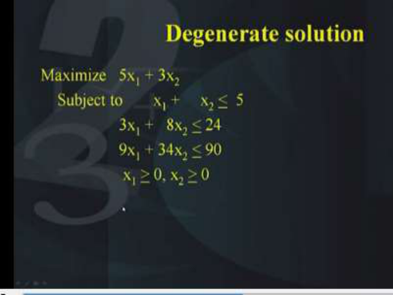

So, next let us look at the degenerate case now, if you look at this problem carefully, we have maximization of 5x1 + 3x2 subject to x1 + x2 <u><  5, 3x1 + 8x2 < 24, 9x1 + 34x2 < 90 and x1 and x2</u> 

<u>> 0, so this looks a quite a normal kind of an LPP but when you try to plot this LPP on to the</u> two dimensional space, you will find that it has a specific nature and that is what we are going to do. 

**(Refer Slide Time: 16:48)** 

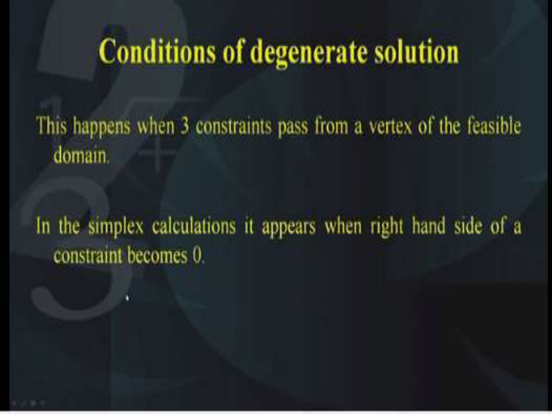

So, the condition which are satisfied for a degenerate solution are as follows, this happens when three constraints pass through a vertex of the feasible domain and the corresponding condition in the simplex calculation is that if 0 appears in the right hand side of the constraints, so these are the two viz-à-viz conditions for the graphical method and the simplex method. 

**(Refer Slide Time: 17:23)** 

So, let us try to draw the graph of this problem, first of all the first constraint it passes through the point (0, 5) and (5, 0) so, these are the two points. The area of the feasible region is below the curve, so this is indicated by the arrow. Next we will plot the second constraint, this passes 

through the two points A given by (0, 3) and the point (8, 0) and the arrow indicates that the feasible domain is below the line. 

Also the third constraint also passes through this point and the feasible domain is below the line. These are the coordinates of the feasible region given by A, B, C and D, so we can shade the feasible region as follows and this indicates that the feasible region has these vertices A, B and C and also we find that the solution of the LPP lies on this point B and you can see that instead of two lines; there are three lines which are passing through this point B. 

**(Refer Slide Time: 19:19)** 

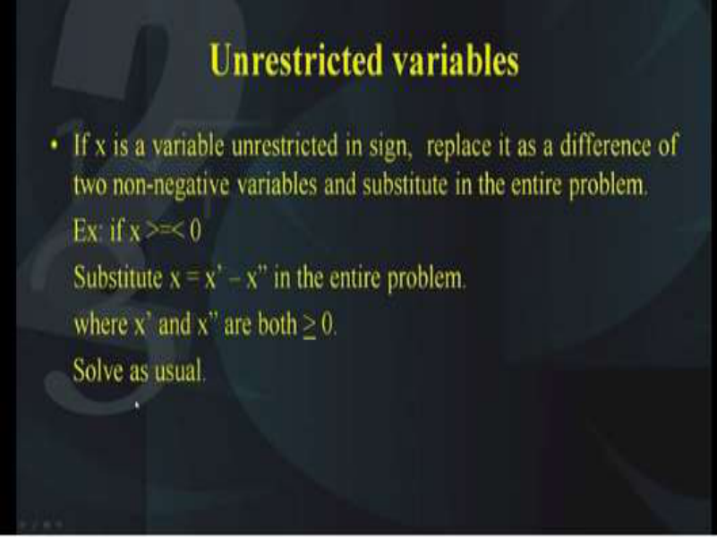

This is an indication that this particular problem has a degenerate solution, as far as the conditions in the simplex calculation is concerned, I mentioned that it is that in the right hand side if we get a 0 that is an indication of the degenerate solution. 

So, next now let us look at a situation where we have unrestricted variables. Unrestricted means unrestricted in sign that is they are not necessarily > 0. It is not specified that they are >  0, they may or may not be >  0, so if there is a variable x which is unrestricted in sign, then the trick that has to be applied is to represent it as the difference of two variables which are both positive. So, here is an example suppose, we have x is variable which is unrestricted in sign then we will write x in terms of x’ – x”. Once we write this, we have to make sure that x’ should also be >  0 and x’’ should also be > 0 but with this substitution this has to be made in the entire problem not only in the objective function, also in the constraints and then solve the problem as usual of course, the number of decision variables will increase by 1 because now instead of x, we have substituted x as x’ – x” that means, one more variable has increased. 

And obviously, you need to use the simplex method to solve this problem, so I hope that this condition has been understood. 

**(Refer Slide Time: 21:32)** 

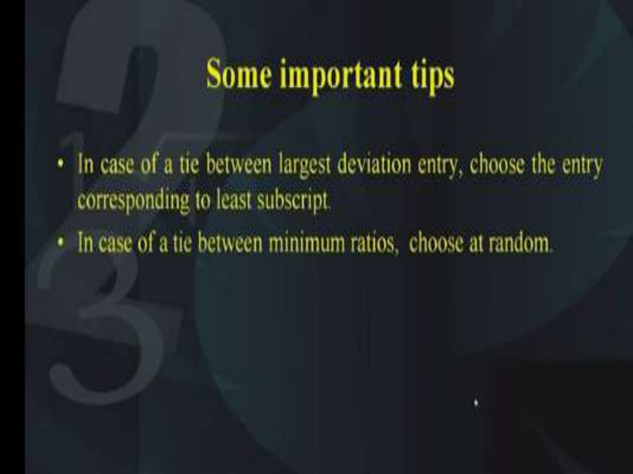

Now, some important tips when you solve exercises on the various conditions of the linear programming case, the first one is that in case there is a tie between the largest deviation in the deviation row, then the choice has to be made according to the least subscript that is if there are two variables for example, x1 and x6, both of them are having the same entry corresponding to the deviation row, and it is not possible to decide which one should be allowed to enter into the basis, in that situation it is important to make the variable which is having lower subscript that is if x1 and x5 are there then, choose the one corresponding to x1. Although, if you choose the other one you will also get the answer but probably the number of iterations might be more. So, in case of a tie, choose the one with the lower subscript. 

Similar situation might arise when there is a tie between the minimum ratio tests that is the minimum ratio test is equal for corresponding to two rows. Again in this case, you can choose at random although the solution will be the same but the number of iterations might vary. 

**(Refer Slide Time: 23:30)** 

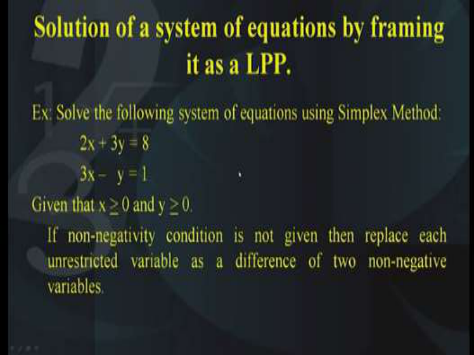

The solution of a LPP can be used to solve many kind of problem arising in mathematics. As an example, I am taking a system of equations which we will be forming as an LPP and then we will use the simplex method to solve this system of equations. So, let us see how this has to be done, as an example let us suppose that we have to solve the following system of equations which is two equations in two unknowns, so we have 2x + 3y = 8 and the second one is 3x - y = 1. Now, let us suppose that it is given that x and y are both <u>></u> to 0, if these non-negativity conditions are not given, then we can consider that x and y are unrestricted variables and replace both these variables as a difference of two other non-negative variables and substitute in the given equations and then solve as before. So, let us see what happens if we use the two phase method. 

# **(Refer Slide Time: 25:00)** 

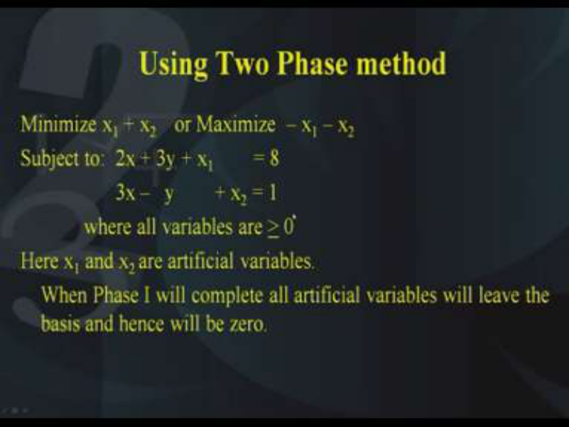

We will maximize the artificial variables that have to be imposed into the both these equations. So, in the first equation we will add an artificial variable x3 and in the second equation, we will add an artificial variable x4. This means that now we have a four variable problem and all the variables should be > 0 and x3 and x4 are the two artificial variables. Now, the phase 1 will be completed; when the phase 1 is completed then we will find that all the artificial variables have disappeared provided the system of equation has a solution. If it does not have a solution, then it will indicate that there is no solution to the problem but if the system has a solution then we will get at the end of the phase 1, we will get all the artificial variables will disappear. 

So, this lecture is the concluding part of this particular section of this course on linear programming and therefore in order to recapitulate what we have learnt in this series of 10 lectures, I would like to give you a quiz which is based on short answers, based on what we have studied. 

# **(Refer Slide Time: 26:56)** 

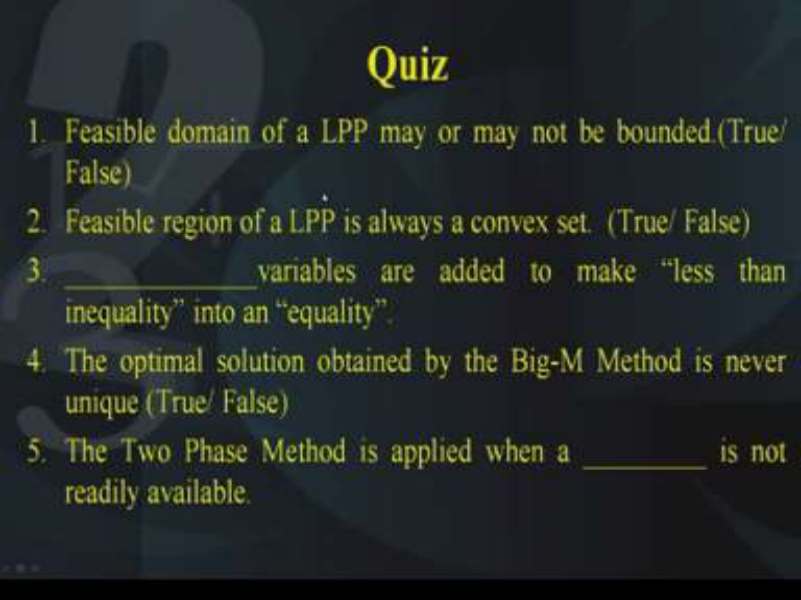

I want you to understand and write the answer to the quiz as in how we proceed, so here comes the first question; please write down the answer in your notebooks. The first question is the feasible domain of a linear programming problem may or may not be bounded; the answer is either true or false. So, if you think it is true, please write true in your copies, if you think it is false please write false in your copies. 

The second question; the feasible region of LPP is always a convex set,  again, the answer is either true or false, please write down the answer in your booklets. 

The third question; _____ variables are added to make less than inequality into an equality; dash variables are added to make less than inequality into an equality. Now, you have to write down the name of that variable, what is the name of that variable. 

The fourth question; the optimal solution obtained by the Big M method is never unique; the answer is either true or false, you remember we have been talking about unique solutions and multiple solutions, so the question is the optimum solution obtained by the Big M method is never unique, true or false. 

Then comes the fifth question; the two phase method is applied when _____ is not readily available. So that is something you have to fill, the two phase method is applied when a dash is not readily available, it has a specific name, I want you to write that name that particular name, what is not available, why is the two phase method applied when something is not available. **(Refer Slide Time: 29:52)** 

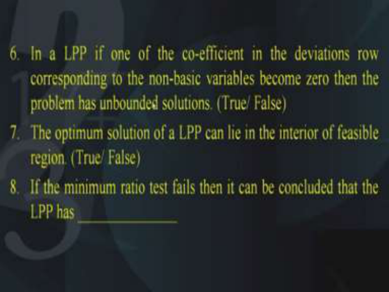

The sixth question; in a LPP, if one of the coefficients in the deviation row corresponding to the non-basic variable becomes 0, then the problem has unbounded solution, if in a LPP; if one of the coefficients in the deviation rows corresponding to the non-basic variable becomes 0, then the problem has unbounded solution. The answer is either true or false, for this you have to remember what is the condition for the unbounded solution, what is the condition for the multiple solution and so on. So, you will get the answer if you think about those conditions. 

The seventh question; the optimum solution of a LPP can lie in the interior of the feasible region, so as you have seen in the graphical method, we want to find out whether the optimum 

solution of a LPP can lie in the interior of the feasible region or not so, the answer is either yes or no, or true or false. 

Next the eighth question; if the minimum ratio test fails then it can be concluded that the LPP has ______. So, if the minimum ratio test fails then it can be concluded that the LPP has ____, again this will; the answer will come if you remember all the conditions that are required for the various cases that we have discussed. 

**(Refer Slide Time: 32:14)** 

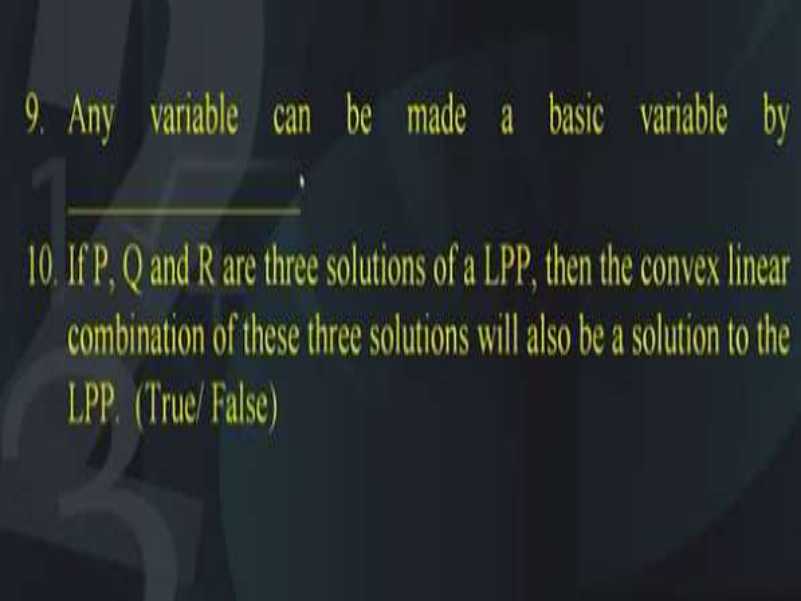

The ninth question; any variable can be made a basic variable by____, so the____ has to be filled based upon what we have discussed that is any variable can be made a basic variable by applying some kind of operations, what are those operations called? So, you have to fill in in that dash. 

Now the 10th question is as follows; if P, Q and R are three solutions of a LPP, then the convex linear combination of these three solutions will also be a solution of the LPP. Now, this situation will arise when the problem has multiple solution so, the question says if there are three solutions of an LPP, then the convex linear combination of these three solutions will also be a solution to the LP; true or false okay. 

So, I hope everybody has written the answers in your copies and now I would like to give you the answers and I would like you to check whatever answers you have written in your copy. **(Refer Slide Time: 34:10)** 

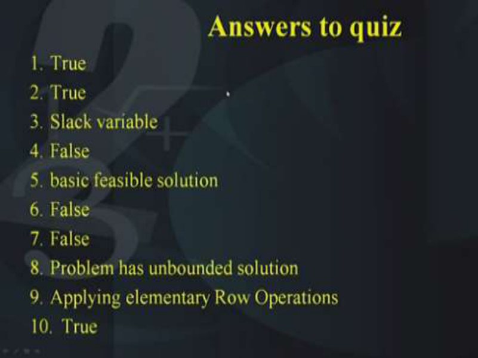

So, here are the answers to all the 10 questions that I have given you, the answer to question number 1 is true, question number 2 is true, question number 3; slack variables, question number 4; false, question number 5; basic feasible solution, question number 6; false, 7; false, 8; problem has unbounded solution, 9; by applying elementary row operations and 10 is true. So, please check your own answers and try to have a self-evaluation of how much you have learnt from this part of the course and not. **(Refer Slide Time: 35:17)** 

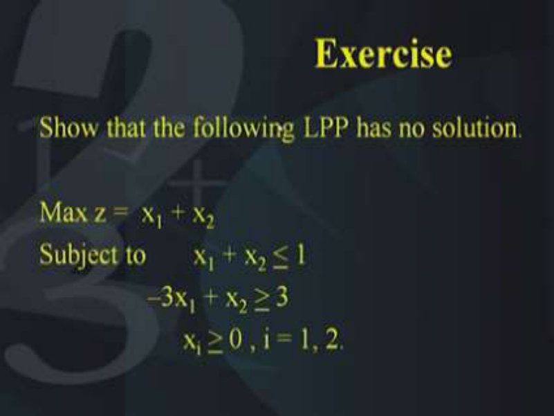

As an exercise, I would like to give you this question to solve later on. Solve the following LPP, show that it has no solution so, the problem is maximization of x1 + x2 subject to x1 + x2 <u><</u> 1, –3x1 + x2 <u>> 3, x1 and x2 should both be > 0. So, I hope you can complete this example at the</u> end of this lecture, thank you. 

