# **Operations Research Prof. Kusum Deep Department of Mathematics Indian Institute of Technology - Roorkee** 

# **Lecture – 12 Case Studies and Exercises - I** 

Good morning students, this is lecture number 12 and it is based on some case studies and exercises. So, we will first look at some mathematical model of real life problems and try to 

model them as linear programming problems. 

**(Refer Slide Time: 00:57)** 

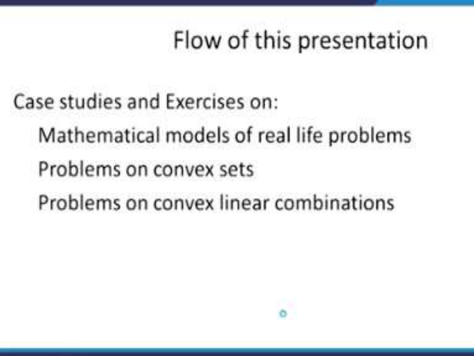

Next, we will study some problems on convex sets and also some problems on convex linear combination of some sets. The idea behind this is to make you understand how actually to solve some of the exercises that are based on the methods that we have learned in module 1. 

**(Refer Slide Time: 01:20)** 

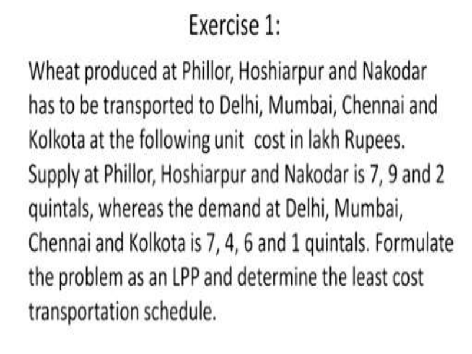

So, the first exercise is as follows; this is a modelling problem, which states that wheat is produced at the various cities in Punjab that is Phillor, Hoshiarpur and Nakodar which has to be transported to Delhi, Mumbai, Chennai, and Calcutta at the following unit cost in lakh rupees. Supply at Phillor, Hoshiarpur and Nakodar is given to be 7, 9 and 2 quintals respectively. Whereas, the demand at Delhi, Mumbai, Chennai and Calcutta is 7, 4, 6 and 1 quintals respectively, we are required to formulate the problem as an LPP and determine the least cost transportation scheduled. 

**(Refer Slide Time: 02:28)** 

Now, the data that has been provided in the problem is shown in this table, where it is a rectangular information giving the cost of transporting one unit of wheat from Phillor, Hoshiarpur, Nakodar to Delhi, Mumbai, Chennai, and Calcutta. Also, the bottom most rows shows the demand at the various centres that is Delhi, Mumbai, Chennai and Calcutta or in 

other words at Delhi, the demand is 8, at Mumbai the demand is 4 and similarly, at Chennai it is 6 and at Calcutta it is 1. 

On the other hand the supply information that is the supply at Phillor is 7, at Hoshiarpur is 9, at Nakodar is 2. Now, in order to solve this problem, the first step that is required is to define the decision parameters. 

**(Refer Slide Time: 03:51)** 

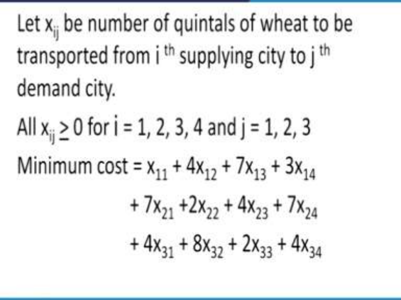

So, we were defined the decision parameters as let xij  be the number of quintals of wheat to be transported from the ith supplying city to the jth demand city. As you know that the cities have been divided into two categories, the first is the supplying city, which are three cities in Punjab and the demands cities are the ones to which the wheat has to be transported. So, all the decision parameters xij‘s, they should be > 0 and the i has to go from 1, 2, 3, 4 and j has to go to 1, 2 and 3. Now the problem says that we have to minimise the overall cost for this transportation problem. The minimum cost can be written as follows; x11 + 4x12 + 7x13 + 3x14 + 7x21 +2x22 + 4x23 + 7x24 + 4x31 + 8x32 + 2x33 + 4x34. The question is how did we get this expression? See, we got this expression from the previous table, which is given. In this table that is from Phillor to Delhi, the cost is 1 unit. Similarly, from Phillor to Mumbai is 4 units, so therefore, x11 has to be multiplied by 1, x12 has to be multiplied by 4 and like this. So, the entire expression for the cost is shown here in this expression corresponding to minimum cost. 

**(Refer Slide Time: 05:42)** 

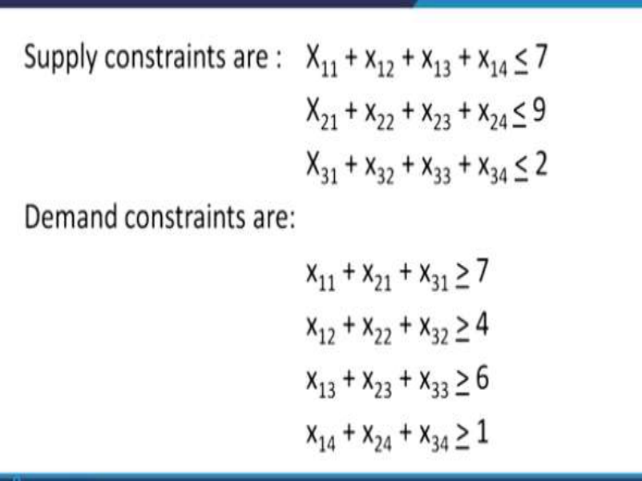

Then, comes the two set of constraints; the first set of constraints are called the supply constraints, which means that the supply at each of the three stations is has to be restricted to the availability. So, again going back to the previous given table, if you look at this table, at Phillor the availability is 7 so, 7 you cannot exceed more than 7. Therefore, x11 + x12 + x13 + x14 <u>< 7, that is what is shown here in the first equation of the first set of constraints. Similarly, for</u> the second row and the third row, we have x21 + x22 + x23 + x24 < 9 and similarly, the third row. 

Now, coming to the demand constraint at the various demand cities, the constraints are the vertical sums in the given table. So, in the given table again, let us go back to the given table, at Delhi the demand is 8, so, the 8 is the minimum demand, if the supply is such that more can be also provided. So, therefore, we have to impose a greater than equal to constraint that is x11 + x21 + x31 <u>> 7 and this is what is shown in the first constraint of the demand constraints; x11 + x21</u> + x31 <u>></u> 7. The same can be shown for the remaining four cities as well that is the vertical columns should add up to and should be greater than equal to the demand that is required at the target cities. 

So, like this, we have designed this linear programming problem which consists of 4x3 and you get 12; 12 decision parameters have to be obtained in order to minimise this cost and at the same time, satisfy these constraints. So, I hope everybody has followed how this transportation model has been developed. 

**(Refer Slide Time: 08:31)** 

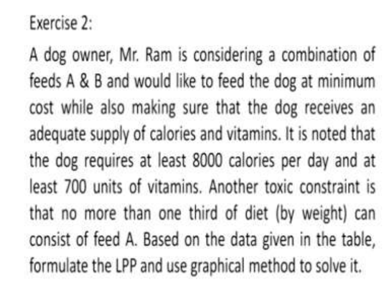

Now, let us come to a second exercise; A dog owner, Mr. Ram is considering a combination of feeds, which he wants to give to his dog and those feeds are called A and B and would like to feed the dog at the minimum cost, which also while he is making sure that the dog receives an adequate supply of calories and vitamins. It is noted that the dog requires at least 8000 calories per day and at least 700 units of vitamins. Another toxic constraint is that no more than one third of the diet by weight can consist of feed A, based on the data given in the table below, formulate the LPP and use the graphical method to solve it. 

**(Refer Slide Time: 09:35)** 

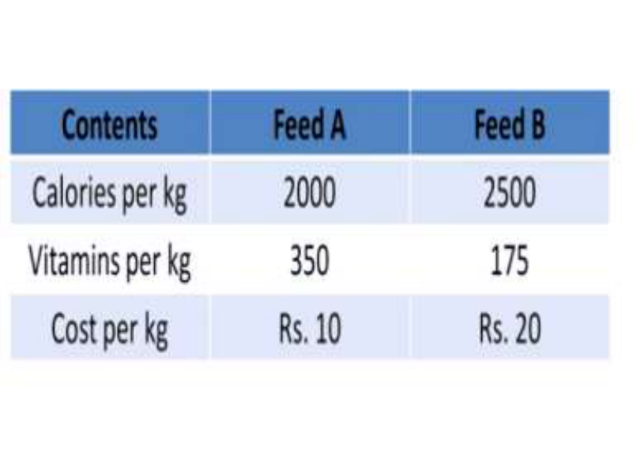

So, the data can be tabulated, in this table, we have the feed A and the feed B and we also have constraints on the calories per kg and the vitamin per kg. Also the cost per kg is given corresponding to feed A and feed B. 

**(Refer Slide Time: 09:59)** 

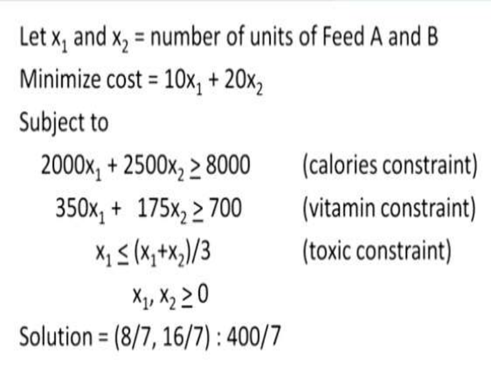

Now, we first need to define the decision parameters that is let x1 and x2 be the number of units of the feed A and feed B, the objective of the problem is to minimise the cost. Therefore, the objective function can be written as 10 x1 + 20 x2, where did this 10 come from? This 10 came from the data that is given in this table. Now, the feed A has a cost of rupees 10 per kg. Therefore, for x1 units the cost will become 10 times x1. Similarly for feed B, the cost will become 20 times x2 and that is the reason why minimum cost can be written as 10 x1 + 20 x2. Coming to the constraint, we can see that the calories constraint can be written as 2000x1 + 2500x2 <u>></u> 8000. Of course, we can simplify this constraint by cancelling out some of the quantities and similarly, the second constraint is the vitamin constraint, which is 350x1 + 175x2 <u>> 700.</u> 

Now, remember that whenever there is an at least then that means that it could be more also so, that is the reason why the greater than inequality has been used. If it is at most in a problem, then less than inequality has to be used. But in this particular problem, the at least has been mentioned therefore, greater than inequality has to be used. 

The third constraint is the toxic constraint, which can be written like this; x1 <u>< (x1+x2)/3.  Of</u> course, as you know that x1 and x2 should be <u>> 0 because we have defined x1 and x2 as the</u> number of units of the feed A and B, So, number of units cannot be less than 0 that is the reason why x1 and x2 have to be > 0. Now, it is a simple two variable problem and we can solve it using the graphical method. The solution is written here that is 8/7 and 16/7 with an objective function value of 400/4. 

**(Refer Slide Time: 12:59)** 

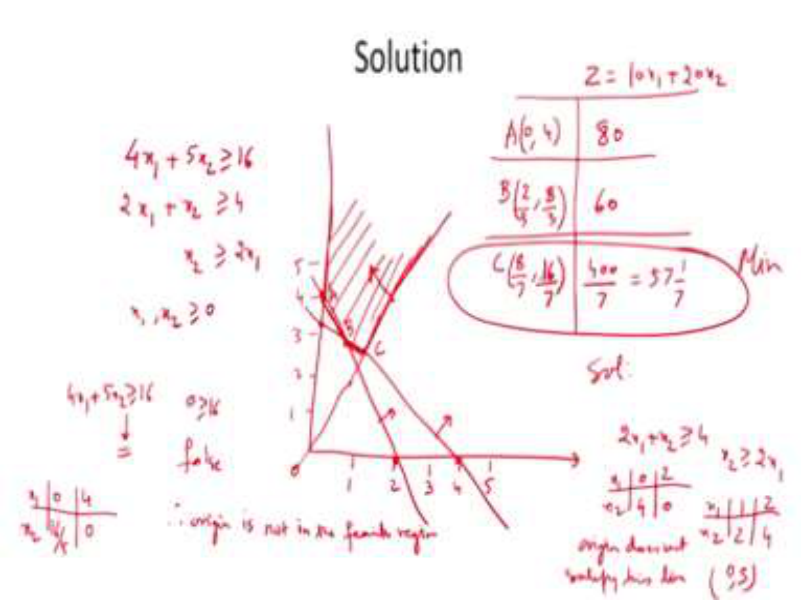

So, let us try to solve this problem with the help of the graphical method. So, the first constraint can be simplified and can be written like this, 4x1 + 5x2 <u>> 16. This constraint has been obtained</u> from the given constraint that we have model just now. Similarly, the second constraint can be written as twice x1 + x2 <u>> 4 and the third constraint can be written as x2 is > twice x1 and of</u> course, not to forget the non-negativity constraints. Next we need to write the problem in the 2 dimensional accesses, so that is what we are going to do. We need to write the constraints on the graphical; on the graph, so we will write it like this. Now, the first constraint is given to be 4 x1 + 5 x2, which is <u>></u> 16. Now, in order to plot this constraint, we first need to plot the; is equality and then later on decide which side of the line is the feasible region. Therefore, in order to plot this straight line, we need two points. So, how are we going to obtain them? First, we will put x1 = 0 and get the corresponding value of x2, this gives us 16/5 and similarly, we will put x2 as 0 and this will give us x1 as 4. That means, we need to plot the (0, 16/5); first point and where is that point? (0, 16/5) is something over here and the second point is (4, 0), so it is over here.  Therefore, we will join these 2 points . Now the question arises, which side of the line lies the feasible region and in order to check this, we will substitute the origin in the inequality. So, we find that (0 0) when you substitute in this equation, you get 0 is > 16. Now, we want to see whether this is true or false and we find that this is false. Therefore, origin is not in the feasible region. This means that the feasible region is above the line. Similarly, we plot the second line and the second line is 2x1 + x2 is > 4. And as before, if you write x1 as 0, then the corresponding value of x2 becomes 4 and similarly, if x2 is 0, then the corresponding value of x1 is 2. That means, we have to plot the line joining (0, 4) and (2, 0). Therefore, we will join these two points. 

Next, we need to plot the third line and what is the third line? The third line is x2 is > twice x1. Of course, before I proceed, we need to find out which side of the line is the second line. So, you can see that the second line also, the origin does not satisfy the second line. The origin does not satisfy this line and therefore, the feasible region is above the line. Then, comes the third line that is x2 >2x1.  Now, as you can see that this line passes through the origin and therefore, we need to find out those two points which are not origin. So, therefore, how we should do it, we can find out one, if you put x1 = 1, then x2 becomes 2 and if you put x1 = 2, then x2 = 4. So, in other words, we want to write the line which is joining the points (1, 2) and (2, 4). So, we need to draw the line like this and in order to make sure which side of the feasible region we are looking at, then we need to substitute some known point, let us suppose, we substitute the point (0, 5). So, (0, 5) tell us that it is indeed feasible region and therefore, the feasible region is above the line. This tells us that our feasible region is this region; it is a good practice to shade the feasible region. 

So that we can understand what are the various points at which the minima is expected to lie. So, now, let us try to find out what are these three points of the feasible region? Let us call them A, B and C. So, the point A is given by (0, 4) and the point B is given by (2/3 and 8/3) and the point C is given by (8/7, 16/7). How did we get these coordinates? You know very well from your high school mathematics that these points can be obtained by solving the two equations which form the point of intersection of these lines. So, I can leave this as an exercise for you to check, what are these points? 

Next, comes the evaluation of the objective function at these points. Now, as you know that the objective function is 10 x1 + 20 x2 and when we substitute these three points A, B and C, then we get the corresponding value for A as 80 units, for B we get 60 units and for C we get 400 and divided by 7 which is approximately = 57 (1/7). 

In order to see which of these points gives us the minimum, what do we find; we find that this is the point which gives us minimum, hence, this is our solution that is the dog owner Mr. Ram should consider x1 = 8/7 that is feed A should be 8/7, similarly feed B should be 16/7. So, I hope you have understood how this has been prepared. 

**(Refer Slide Time: 22:35)** 

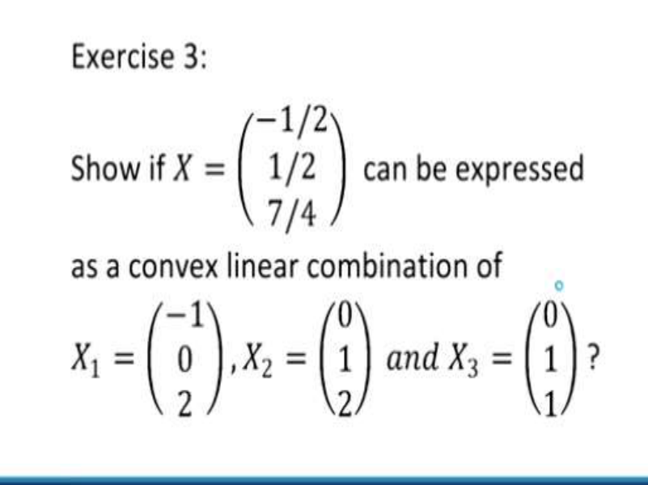

Next, let us look at the exercise number 3, in this exercise this is based on the convex sets and the convex linear combination. Now, you will find that the problem says that we have to show whether the given point X given by (-1/2, ½, 7/4) can be expressed as a convex linear combination of X1 given by (-1 0 2) and X2 given by (0 1 2) and X3 given by (0 1 1). So, how should we solve it? 

**(Refer Slide Time: 23:25)** 

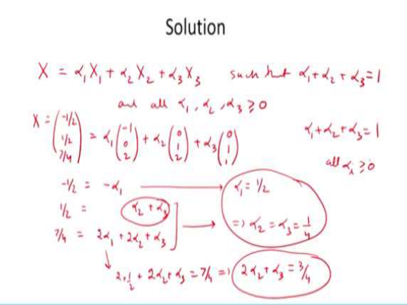

As you know that the convex linear combination is defined as α1 x1+ α2 x2 + α3 x3 such that α1 α1+ α2 + α3 = 1 and all the α1, α2, α3 are > 0. Now, in order to make sure and to find out whether our given X is a convex linear combination of these points, we will check the given point X is given by -1/2, 1/2 and 7/4.; this has to be expressed as α1 x1 that is α1 (-1 0 2) + α2 (0 1 2) + α3 (0 1 1). 

Now, as you can see that this is a system of equations in three variables and they are three equations, so we can just expand it and get as follows; -1/2 = - α1 that is all, the second terms are not existing. Second equation will be 1/2 = α2 + α3 and the third equation will be 7/4 = 2 α1+ 2 α2 + α3. Now, in order to get a solution of this system of equations in three variables is very easy. From the first equation, you can get α1= 1/2, similarly if you solve these two equations, you will see that you can substitute α1 in these equations that is you will get 2(1/2) + 2 α2 + α3 = 7/4 and this will give you the equation 2 α2 + α3= 3/4 and when you solve this equation and this equation, you will get α2 and α3 = 1/4. 

Please check it so, therefore we have found the combination of α1, α2, α3 in such a way that α1+ α2 + α3= 1 and all αi’s are > 0. This tells us that the given X can be defined as a convex linear combination of X1, X2 and X3. 

**(Refer Slide Time: 27:35)** 

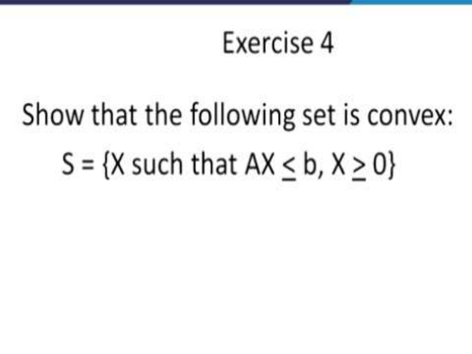

The fourth exercise is that we want to show whether the following set is a convex set or not, the set S = {X such that AX < b, X > 0}. By the way, what does this remind you of; this is nothing but the feasible region of an LPP and as you have learned a theorem which says that the feasible solution of an LPP is a convex set. So, you know that the answer is yes, this is a convex set. But the idea is that we want to prove whether this set is convex or not and how it is convex, we will see. 

**(Refer Slide Time: 28:23)** 

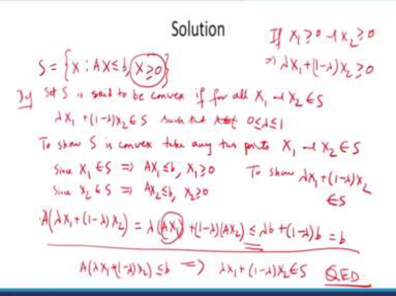

So, therefore, our set S is given by X such that AX is < b, X is > 0. Remember the definition of a convex set, a set S is set to be convex. If for all X1 and X2 belonging to S, we have λ X1 + (1 – λ) X2, also belongs to the set S, where λ is a number between 0 and 1. So, in order to show that the set S is a convex set, what we will do? 

To show S is convex, take any two points let us say X1 and X2 belonging to S then since X1 belongs to S, this implies AX1 is < b and X1 is > 0. Also, since X2 belongs to S, this implies AX2 is < b and X2 is > 0. So, in order to show that S is convex, all we need to do is to show that λ X1 + (1 – λ) X2 should also belong to the set S. Therefore, let us try to evaluate this point (λ X1 + (1 - λ X2)). Since we want to see whether it belongs to S or not so, therefore, we will operate the operator A and if we can show that this is < b, then we are done. So, let us evaluate this expression since A is a matrix and λ is a scalar so, we can pull out the λ and inside we can get AX1; similarly, (1 – λ) is a scalar, so we can pull out 1 - λ and we can get inside AX2 and this is what we wanted. 

So, now, this turns out to be λ times b, why? Because this AX1 is < b similarly, the second term can be written like this, which is nothing but b, this happens, this has been possible only because it is given that X1 and X2 belong to the set S and therefore, they are <u>< b. Now, this</u> entire expression tells us that A(λ X1 + (1 – λ) X2)  is < b. And by definition, this means that λ X1 + (1 – λ) X2 belongs to the set S.  Also, you need to show about this X > 0 and it is very clear; if X1 is >0 and X2 is > 0, then automatically λ X1 + (1 – λ) X2 is also  >  0. Hence, our proof is complete. 

**(Refer Slide Time: 33:14)** 

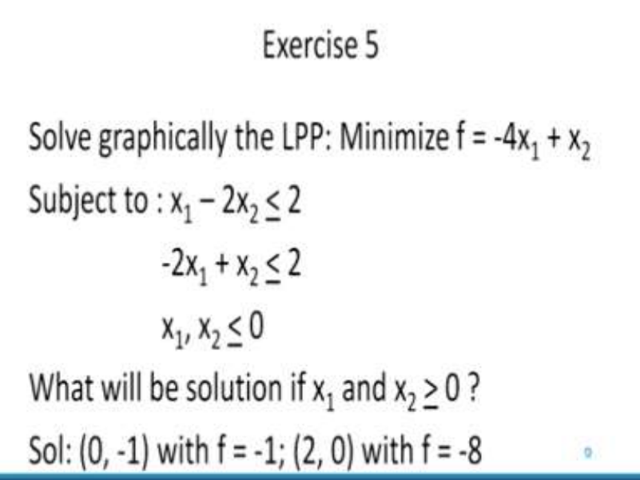

Let us come to the fifth exercise; solve graphically the LPP given by minimise f = -4 x1 + x2 subject to x1 – 2x2 <u>< 2, -2x1 + x2 is < 2 and x1 and x2 are < 0. What will be the solution if x1 and</u> x2 are > 0? Now, this is an interesting problem, where you can see that x1 and x2 have been given to be < 0. In general an LPP must have x1 and x2 >0 but in this example, x1 and x2 have been given to be < 0. 

So, the solution is given here, that is the solution is (0, -1) with f = -1 and the second part of this the problem says, what happens if x1 and x2 are > 0? The solution to the second part is (2, 0) with f = -8. So, with this, we come to the end of this lecture number 12. I hope you have understood all the exercises that we have studied in this lecture. Thank you. 

