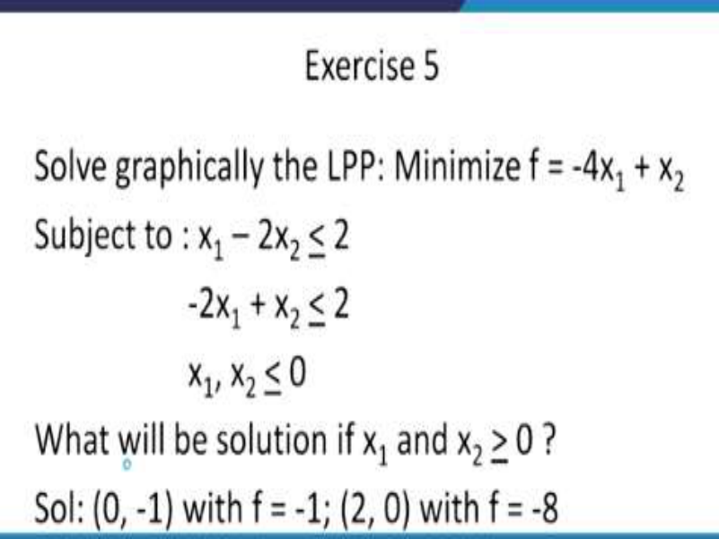
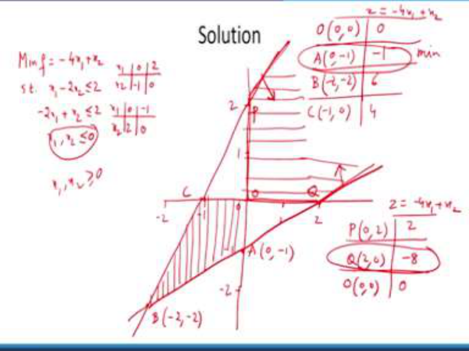
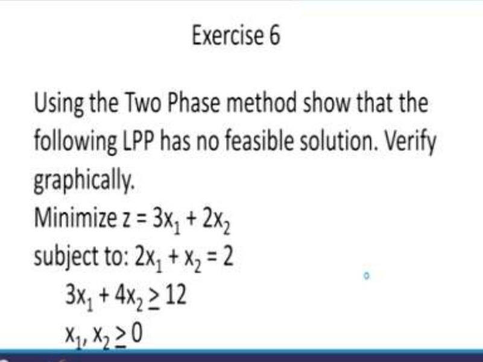
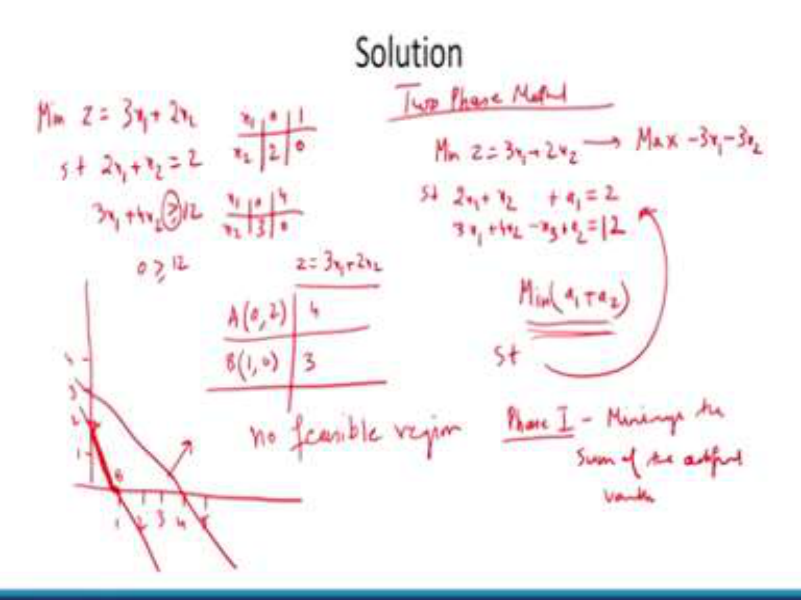
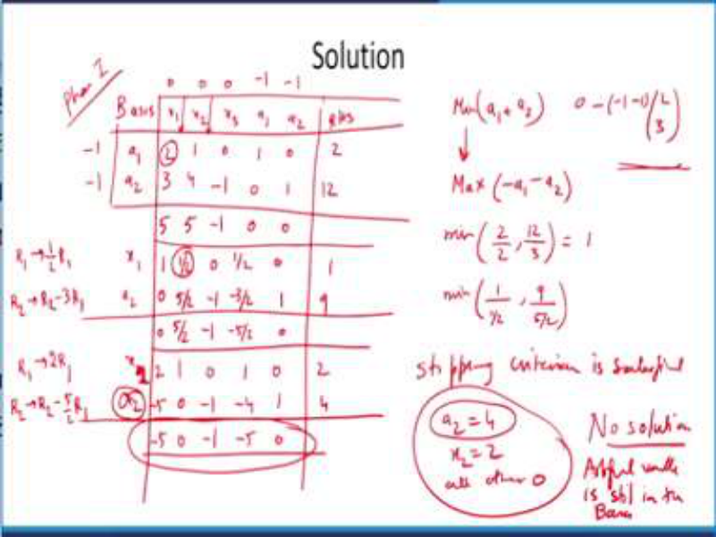
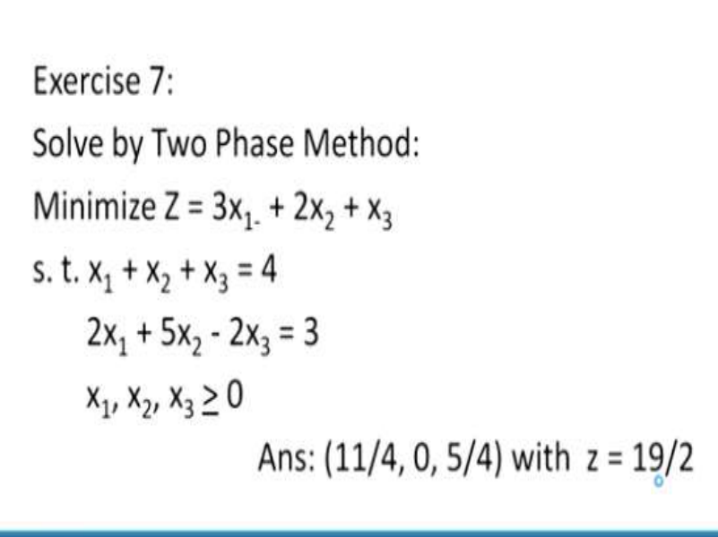
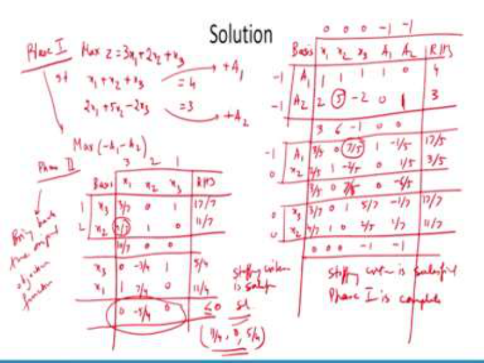

# **Operations Research Prof. Kusum Deep Department of Mathematics Indian Institute of Technology - Roorkee** 

# **Lecture – 13** 

# **Case Studies and Exercises - II** 

Good morning students, this is lecture number 13, the title is case studies and exercises part 2. We in this lecture we will study some exercises based on the graphical solution of an LPP, then we will study some problems on the simplex method of solution of an LPP and then we will study the two phase method for the solution of an LPP. 

**(Refer Slide Time: 01:03)** 

Now, exercise 5 is as follows; we are required to solve graphically the linear programming problem given by minimize f = -4x1 + x2  subject to x1 – 2x2 <u>< 2 and -2x1 + x2 < 2 where x1, x2 <</u> 0, you will observe that in general, in most of the LP’s, the x1 and x2 are supposed to be > 0 but in this interesting example, the restriction is given to be that x1 and x2 have to be < 0. However, in the second part of the problem, we are also required to solve the problem, when x1 and x2 are > 0, so the first part has the solution given by (0, -1) with f = -1 and the second part of the problem has a solution (2, 0) with f = - 8. 

**(Refer Slide Time: 02:41)** 

Now, let us try to solve this problem with the help of the graphical method, so the given problem is; minimize f = -4x1 + x2  subject to x1 – 2x2 <u>< 2, -2x1 + x2 < 2 , x1 and x2 are both <</u> 0. So, the first line has to be plotted using these points x1 = 0, x2 = -1, x2 = 0 and x1 = 2. Similarly, the second line has to be plotted using (0, 2) and (–1, 0), this is the way that has to be done as I have explained earlier. 

Now, let us plot both the lines. Now, the first line has to be plotted that is (0, -1), I will call this point let us say A (0,-1) and the second point is (2, 0) so, this is the point (2, 0). First line has to be drawn like this and in order to see which side of the line is the feasible region, we will substitute the origin and we find that the feasible region is above the line. 

Also the second line has to be plotted using (0, 2) and (-1, 0), therefore we will join these two points and what do we find; we find that the feasible region is below this line, so this is the feasible region below the line also, x1 and x2 are <u><</u> 0. Therefore, the feasible region looks as follows; A given by (0, -1), B given by (-2, -2) and C given by, this is the point C (-1, 0). Please note the special nature of this problem is that the x1 and x2 have to be <u><</u> 0. So, now comes the time to find out what is the value of the objective function at each of these points, so therefore at the origin, we need to find out what is the objective function value. The objective function is -4x1 + x2 and at the origin, the objective function value is 0. 

Then comes the second point A given by (0, -1), objective function comes out to be -1; then comes the third point that is B, B is the point (–2, -2), its objective function value is 6 and the third point is C(-1, 0), its objective function value is 4 and what do you find? The minimum occurs at the point A and this is the solution to the problem. So, I hope everybody has understood how the third quadrant is the feasible region. 

The second part of the question says that we have to find out what happens when this x1, x2 has to be <u>></u> 0. In this case, the feasible region is the first quadrant, so this is the feasible region, please make sure you understand how the feasible region has to be plotted and in the second part of this feasible region of this question, the points that have to be considered are as follows; P, origin and Q.  P is given by (0, 2) and Q is given by (2, 0) and of course the origin is as it is; So, in this case the objective function value is as follows; for (0, 2), it is 2 and for (2, 0) it is -8 and at the origin it is 0. Since we want to minimize the objective function of course, objective function is the same as before, there is no change in that. The solution to this second part of the problem is at the point Q given by (2, 0) because the objective function value is -8. 

So, I hope you understand how the x1, x2 whether it is < 0 and whether it is > 0, how it helps in designing the problem in a new way. 

**(Refer Slide Time: 10:11)** 

Let us look at exercise number 6; in this problem, we have to solve the given LP using the two phase method and we have to prove that this problem has no feasible solution and also we have to verify graphically that this problem has no feasible solution. The problem is minimize 3x1 + 2x2 subject to the condition 2x1 + x2 = 2, 3x1 + 4x2 <u>> 12, x1 and x2 are > 0. The interesting thing</u> to note in this problem is that the first constraint is in the form of equality. It is neither > nor <, so this indicates the problem complexity how to design the feasible region which is consisting of a line segment. So, let us try to solve this problem first with the graphical method and then with the two phase method. 

**(Refer Slide Time: 11:32)** 

So, the problem is minimize z = 3x1 + 2x2 subject to 2x1 + x2 = 2, 3x1 + 4x2 <u>> 12 and as before,</u> if x1 is 0, then x2 is 2 and the second point is (1, 0) and for the second constraint, if x1 is 0 then x2 is 3 and the second point is (4, 0). So, let us plot the problem like this, we need to do the demarcation and the first constraint means, the line should pass through (0, 2) and (1, 0). Since this is an equality constraint, there is no greater than or less than, so we are concerned with this line segment. Then, comes the second constraint 3x1 + 4x2 <u>> 12, this passes through</u> (0, 3) and (4, 0) and as you can see that since this is a <u>> constraint, so therefore 0 is ></u> 12 is false, so therefore we need to evaluate the objective function at the two points A given by (0, 2) and the point B given by (1, 0). The objective function is given to be 3x1 + 2x2 which comes out to be 4 and 3, since this is a > constraint that means that the feasible region is above the line and since the first constant is this line segment, but we need to find out the feasible region and because one constraint shows that the feasible region is above the line and the second constraint shows that it is the line segment, so therefore there is no feasible region. That is what is the solution to the problem; if you solve it graphically. Now, we have to verify that this has to be solved with the help of the two phase method so, let us try to solve it using the two phase method. In the two phase method, we need to write down the constraints and the objective function in the standard form, so the given problem; minimize z = 3x1 + 2x2 has to be converted into the maximization type by multiplying with the negative sign. And the constraints that is 2x1 + x2 = 2 similarly, 3x1 + 4x2 <u>> 12 ; because now this is >; so for greater than we need to</u> subtract a surplus variable and make it an equality however, remember we need to find a BFS for both the equations, Therefore we will add an artificial variable in the first equation and similarly, an artificial variable in the second equation because these are the basic variables. 

So, our two phase method will begin like this, we have to minimize a1 + a2 subject to these constraints, right. Remember in the two phase method, the first phase is nothing but minimize the sum of the artificial variables and here we have a1 as an artificial variable in the first constraint similarly, a2 is an artificial variable in the second constraint, therefore in the first phase, we will set aside the given objective function and minimize the sum of the artificial variables. 

# **(Refer Slide Time: 18:01)** 

So, now we are ready to solve this again with the help of the phase 1, so let us write the basis. Now, the basis is a1 and a2 ;  and the variables are x1, x2, x3, a1, a2 and the right hand side, so we can translate the given data as follows; 2 3; 1 4; 0 – 1; 1 0; 0 1 and the right hand side is 2 12. Also, we need to write the coefficients of the objective function, since we are working with the phase 1; phase 1 means that our objective functions is minimization of a1 + a2. 

In order to bring it to the standard form, we have to maximize -a1-a2 so that means the coefficient of a1 is -1 and similarly, the coefficient of a2 is also -1, whereas the coefficients of x1, x2, x3 are 0. Over here on the left hand side, we need to repeat the coefficients of a1 and a2 as -1 and -1. Next, we need to calculate the deviation entries so, what are the deviation entries? They are obtained like this; 0 – (- 1 – 1) (2, 3)t . Using this, the deviation entries are 5, 5, - 1, 0 and 0. Remember that the deviation entries corresponding to the basic variables is always 0. Next, we perform the test for the incoming variable and in the incoming variable, we find that x1 is taken to be the incoming variable although you can choose between x1 and x2, the iterations will vary but finally the solution will be the same. 

The minimum ratio test tells us we have to find out the minimum of 2/2 and 12/3, so the right hand side divided by the pivot column which tells us that the first entry is the minimum and this indicates that 2 is our pivot and therefore, we have to make this as 1, 0 in the next iteration, a1 will go so, it will be replaced by x1, a2 will be as it is and in this iteration. 

You need to apply the elementary row operations that is R1 has to be replaced by 1/2 R1 and R2 has to be replaced by R2 – 3R1 and using this you get the new iteration as follows; 1 1/2 0 1/2 0; 1 and the second row will become 0 5/2 -1 –3/2 1 and 9. Again we need to find out the deviation entries and they turn out to be 0 5/2 -1 -5/2 and 0. This is obtained by the normal procedure in which just as I have explained over here. Now, we find that there is only one entry in the deviation row which is positive, this indicates that x2 should enter into the basis, then we perform the minimum ratio test between the right hand side and the pivot column which tells us that it is 1/(1/2) and 9/(5/2) and this tells us that the pivot is 1/2. Therefore, the next iteration has to be implemented and we get the new basis as sorry; this is x1 and a2 and this tells us that we have to apply the elementary row operations as R1 replaced by 2 R1 which gives me 2 1 0 1 0 2. The second row; the elementary row operation has to be R2 has to be replaced by R2 – 5/2 R1 which gives me -5 0 -1 -4 1 and 4. Again, we calculate the deviation entries and we find that the deviations are -5 0 -1 -5 and 0. So, what do we find? We find that all the entries in the deviation row are either 0 or < 0, this means that the stopping criteria has been satisfied, the stopping criteria is satisfied. However, we find that a2 is still there in the basis because this BFS is a2 = 4, x2 = 2 and all other 0 but remember what was our a2; a2 was an artificial variable and since it is an artificial variable but it has still not been removed from the basis, it indicates that the problem has no solution because artificial variable is still in the basis. So, I hope you remember that this is the condition where we had specified that if the artificial variable is still in the basis. But the stopping criteria have been satisfied therefore, if this is an indication that the problem has no feasible solution. 

**(Refer Slide Time: 26:04)** 

So, now let us come to the exercise number 7; solve by the two phase method the minimization of Z = 3x1 + 2x2 + x3 subject to x1 + x2 + x3 = 4 and 2x1 + 5x2 - 2x3 = 3. The solution to the problem is (11/4, 0, 5/4)  and Z = 19/2. 

**(Refer Slide Time: 26:41)** 

So, let us solve this again using the two phase method now, as you know that the two phase method means that we need to convert the problem first in the phase 1. In the phase 1, we need to write the problem in the following manner; maximize Z = 3x1 + 2x2 + x3 subject to x1 + x2 + x3 = 4, 2x1 + 5x2 - 2x3 = 3 and we need to add artificial variables in the first equation and another artificial variable in the second equation. So, the basis is A1 and A2, here is the basis A1 and A2 is the basis and we need to write the objective function as in the phase 1, it has to be maximization of  -A1-A2 because remember, the artificial variables have to be minimized and this becomes x1, x2, x3, A1, A2 and the right hand side. So, we will write down the entries that 

is 1 2, 1 5, 1 -2, 1 0, 0 1 and 4 3. The coefficients of the objective function are only -1 and -1 for A1 and A2 and the remaining as 0 again, we need to write down -1 and -1 again for the coefficients of the basic variables. Then, we need to calculate the deviation entries which comes out to be 3, 6, -1, 0 and 0 and you can see that 6 is the largest and according to the minimum ratio test, 5 becomes the pivot. 

So, we need to apply the elementary row operations accordingly and our new basis will become A1 and x2 and the new table that you get is 3/5, 0, 7/5, 1, -1/5 and 17/5. Similarly, the second line becomes 2/5, 1, -2/5, 0, 1/5 and 3/5, then the deviation row becomes 8/5, 0, 7/5, 0 and -6/5. Here again, we find that the pivot is 7/5 and therefore we apply the elementary row operations as before and we get x3 and x2 as the basis. This gives the new table as the first row is 3/7, 0, 1, 5,7, -1/7, 17/7 and the second row becomes 4/7, 1, 0, 2/5, 1/7 and 11/7 and the deviation row becomes 0, 0, 0, -1, -1. Now, what does this show us? This shows that the stopping criteria is satisfied and since the stopping criteria is satisfied, therefore the phase 1 has been completed, so phase 1 is complete. Now, using this BFS we can start the phase 2. 

In the phase 2, we will use the same basis and at the same time, we can forget about the A1 and the A2 and the simplified table looks like this, so now we are left with x1, x2 and x3 and we need not write A1 and A2 because already they have been removed from the basis, so we will write the right hand side and the corresponding value of x1, x2 in the objective function will be 3, 2 and 1, the basis is x3 and x2. This turns out to be the same table will come over here; 3/7, 0, 1 and 4/7, 1 and 0, remember that A1 and A2 have been deleted, so these two columns have been removed, right hand side is 17/7 and 11/7. Then comes the deviation entries now, the deviation entries will be different, they will be different from the ones given over here in the phase 1 because now the objective function have changed. Because in the phase 2 remember we bring back the original objective function, so now we have the deviation entries as follows; 10/7, 0 and 0. Remember that the deviation entries corresponding to the basic variables are 0 similarly, we will apply the test for the outgoing and the incoming and this is the pivot and the new iteration will become, the basis will be x3 and x1 and what do you find; you find 0, 1, -3/4, 7/4, 1, 0. The right hand side is 5/4 and 11/4 and the deviation entries are this you find are all < 0, so this means that the stopping criteria has been satisfied and this is the solution. So, what is the solution? Solution is 11/4, 0 and 5/4, hence the proof. So, with this we come to an end of the second part of this examples and case studies, thank you so much. 

