# **Operations Research Prof. Kusum Deep Department of Mathematics Indian Institute of Technology – Roorkee** 

# **Lecture - 17 More Duality Theorems** 

Good morning students. The flow of today's talk is as follows. 

**(Refer Slide Time: 00:30)** 

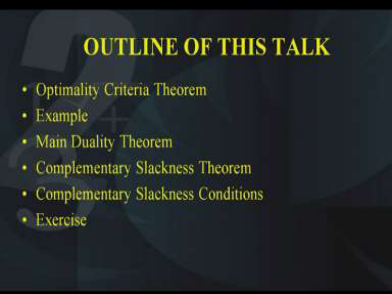

First of all, we will study the optimality criteria theorem. Then, we will take an example and thirdly we will look at the main duality theorem. Then, we will talk about the complementary slackness theorem and from them we will derive the complementary slackness conditions and finally an exercise for you to do as homework. 

**(Refer Slide Time: 01:04)** 

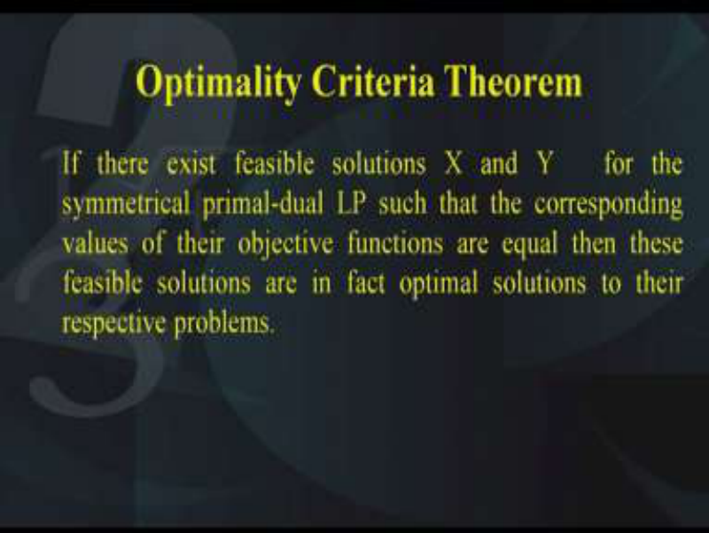

So first of all, let us look at the statement of the optimality criteria theorem. The theorem says the following, if there exist feasible solutions X and Y for the symmetric primal-dual LP such that the corresponding values of their objective functions are equal. Then, these feasible solutions are in fact the optimal solutions of their respective problems. 

So what does this theorem say? It says that we have a symmetric primal-dual that is we have all the inequalities in the constraints and all the decision variables should be of the greater than equal to 0. That is the way we had defined the symmetric primal-dual problem. So in both the primal as well as in the dual, we should not have any equality constraint and we should not have any unrestricted variables. 

Given this primal-dual which is symmetric, let us suppose that we have X and Y as two solutions, that is X is a solution of the primal and Y is a solution of the dual. I mean it is a feasible solution, not necessarily optimum. If X is a feasible solution of the primal and Y is a feasible solution of the dual, such that their objective function value is same. Remember, we had defined the objective function of the primal as f. So that means f(X). If its value f(X) = φ (W) that is φ is the objective function of the dual. So if f(X) = φ(Y), then these X and Y are actually nothing but the optimum solutions of the respective problem. 

**(Refer Slide Time: 03:36)** 

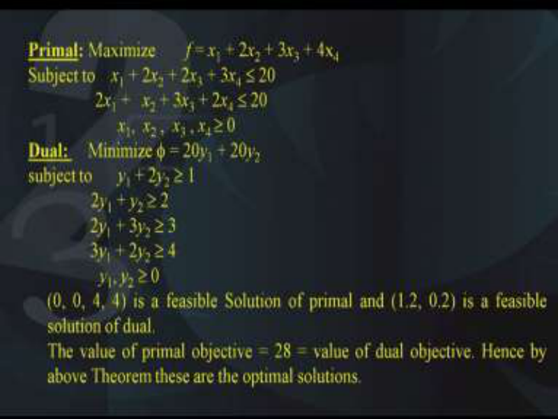

So let us try to verify this with the help of an example. Let us suppose, we have a primal problem as follows; maximization of  f = x1 + 2x2 + 3x3 + 4x4 subject to x1 + 2x2 + 2x3 + 3x4  20, second constraint is 2x1 +   x2 + 3x3 + 2x4  20 and all the constant variables that is x1, x2 ,  x3 , x4  0. 

On the other hand, the dual of this primal can be written as minimization of  = 20 _y_ 1 + 20 _y_ 2 and this is subject to the following four constraints, _y_ 1 + 2 _y_ 2  1, 2 _y_ 1 + _y_ 2  2, 2 _y_ 1 + 3 _y_ 2  3, 3 _y_ 1 + 2 _y_ 2  4 and _y_ 1, _y_ 2  0. Now you will observe that this is a symmetric form of the primal and the dual because there are no equality constraints in either the primal or the dual and also there are no unrestricted variables either in the primal or in the dual. 

Now if we solve the primal and the dual, we get the following feasible solutions. If you look at this point (0, 0, 4, 4); this is a feasible solution of the primal and similarly (1.2, 0.2) this is a feasible solution of the dual. You can check that both these points satisfy their primal and their dual respectively. You can check this by substituting them in the constraints and make sure that they satisfy all the constraints, so that is the definition of feasibility. 

Next, let us look at the objective function value of these two feasible solutions in their respective primal and the dual. So for (0, 0, 4, 4) we will substitute this in the objective function value of the primal that is f and similarly we will substitute (1.2, 0.2) into the objective function of the dual that is  and we find that both these values come out to be 28. Now this is not a chance, in fact we have got these two feasible solutions of the primal and the dual such that their objective function values of their primal and the dual is same. 

Therefore, by the theorem that we have these are actually nothing but their optimal solutions because their objective function values is same. 

**(Refer Slide Time: 07:42)** 

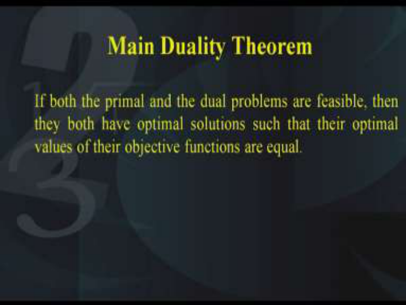

Next comes the main duality theorem; it says that if both the primal and the dual problems are feasible, then they both have optimum solutions such that their optimal values of their 

objective functions are equal. Now this is an interesting result. It tells us that we can get optimum solutions of the primal and the dual provided we have feasible solutions of the primal and the dual. 

**(Refer Slide Time: 08:21)** 

Next comes the complementary slackness theorem; now according to this theorem, if the primal is of the type maximization of _f_ (X) = CX subject to AX  B, X  0 and similarly the dual is minimization of  (Y) = BY subject to YA  C, Y  0. So this is nothing but the symmetric form of the primal and the dual. 

Now let X0 and Y0 be the optimal solution of the primal and the dual respectively, that is, X0 is the optimum solution of the primal, similarly Y0 is the optimum solution of the dual. Then, the optimality conditions are satisfied if and only if; if and only if means if this condition is satisfied, then it is both ways basically. So what are these conditions? These conditions are (Y0A – C)X0 + Y0(B – AX0) = 0. So these are called the complementary slackness theorem. That is at the point of optimality that is X0 and Y0, we have this condition should be satisfied and similarly if there are two points X0 and Y0 which satisfy this condition, then they are nothing but their optimum solutions, so that is the meaning of if and only if. **(Refer Slide Time: 10:33)** 

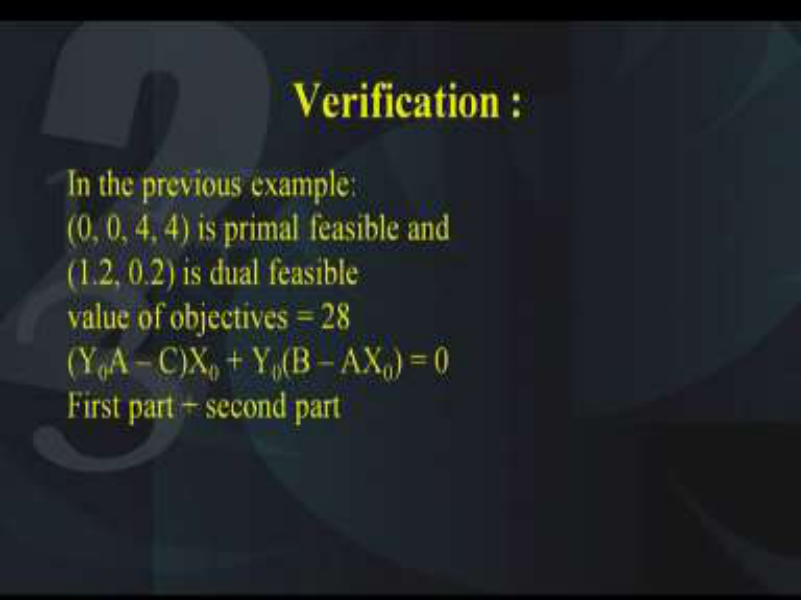

Now let us verify this optimality conditions. In the previous example that we took, the point (0, 0, 4, 4) this is primal feasible and similarly (1.2, 0.2) this is dual feasible and their value of their objective functions is 28. So therefore, we want to make sure whether this condition holds or not. So (Y0A – C)X0 + Y0(B – AX0) = 0. Let us see what happens if we put the values of all these variables in the left-hand side of the equation. So I will break it into two parts; the first part and the second part. **(Refer Slide Time: 11:45)** 

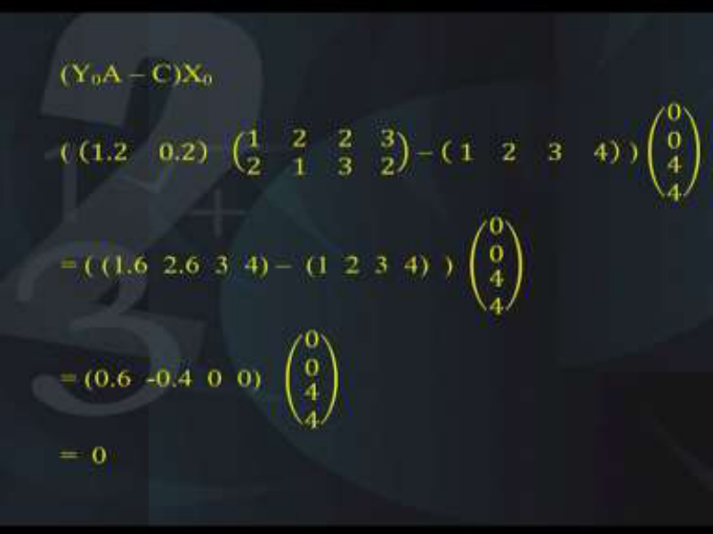

The first part is as follows; that is (Y0A-C)X0. Now what is Y0? Y0 is the point of the dual and that is nothing but (1.2, 0.2). Similarly, what is A? A is the coefficient matrix of the constraints that is 1 2; 2 1; 2 3; 3 2. What is C, C is nothing but the coefficients of the objective function of the primal that is (1 2 3 4). Then, we have X0, now what is X0, X0 is the feasible solution of the primal, it is nothing but (0 0 4 4). 

Now when you substitute these values into the equation, you have to make sure that the matrix multiplication is defined and that is a reason why you have to be very careful with writing the matrix in the row form or in the column form. Now when you multiply this and you solve it, simplify it, you get the answer as 0. I would like you to verify for yourself whether these calculations are okay or not, so you can check that finally the first part of this condition, complementary slackness conditions, the first part is 0. 

**(Refer Slide Time: 13:52)** 

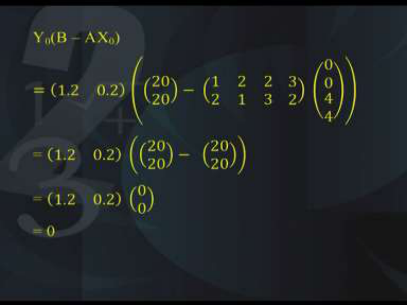

Similarly, the second part, now the second part says Y0(B-AX0) and we will substitute the values of Y0. What is Y0? It is a feasible solution of the dual. It is (1.2, 0.2). Similarly, B, what is B, B is the right-hand side of the dual that is 20 20 and then the A matrix, A matrix is 1 2; 2 1; 2 3; 3 2 multiplied with X0 that is (0 0 4 4). So that is what you get, you get equal to 0. 

**(Refer Slide Time: 14:41)** 

So we have shown that the optimality theorem conditions hold. Next comes some complementary slackness conditions. So we will study some of the complementary slackness conditions, they are as follows. Number 1, if a primal variable is positive, positive means strictly positive, it is not equal to 0, If a primal variable is positive, then the corresponding dual constraint will be satisfied at the optimum as an equation. It will be an equality at the optimum. 

**(Refer Slide Time: 15:31)** 

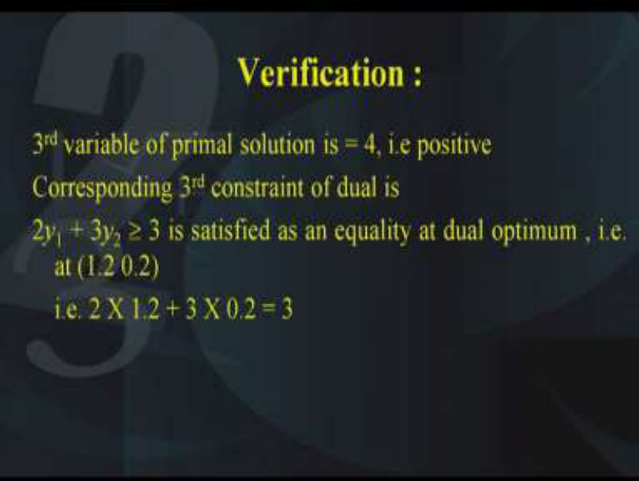

Let us verify this condition. Look at the third variable of the primal solution, it is 4, the third variable of the primal solution is 4. That is, it is strictly > 0 and correspondingly the third constraint of the dual is 2 _y_ 1 + 3 _y_ 2  3. Now according to this condition, this should be satisfied as an equality. So let us verify it, this is satisfied as an equality of the dual optimum. Now the dual optimum, we will substitute (1.2, 0.2) into this inequality. 

So what you get? 2*1.2+3*0.2 which comes out to be 3 and that is what is the right-hand side. So according to this condition, if there is a variable which is primal and which is>0 at the point of optimality, then the corresponding dual constraint is satisfied as an equality at the optimum. 

**(Refer Slide Time: 17:02)** 

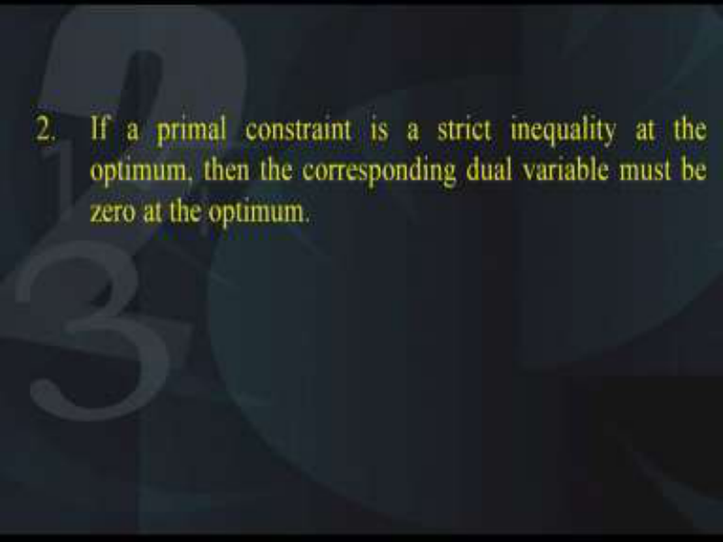

Second condition, if a primal constraint is a strict inequality at the optimum, then the corresponding dual variable must be 0 at the optimum. Again very interesting to note, that is if there is a primal constraint which is a strict inequality means it is not less than or equal to, it is only less than and similarly it is not greater than equal to, it is only greater than. So it says that if the primal constraint is a strict inequality at the optimum, then the corresponding dual variable should be 0 at the optimum. 

**(Refer Slide Time: 17:51)** 

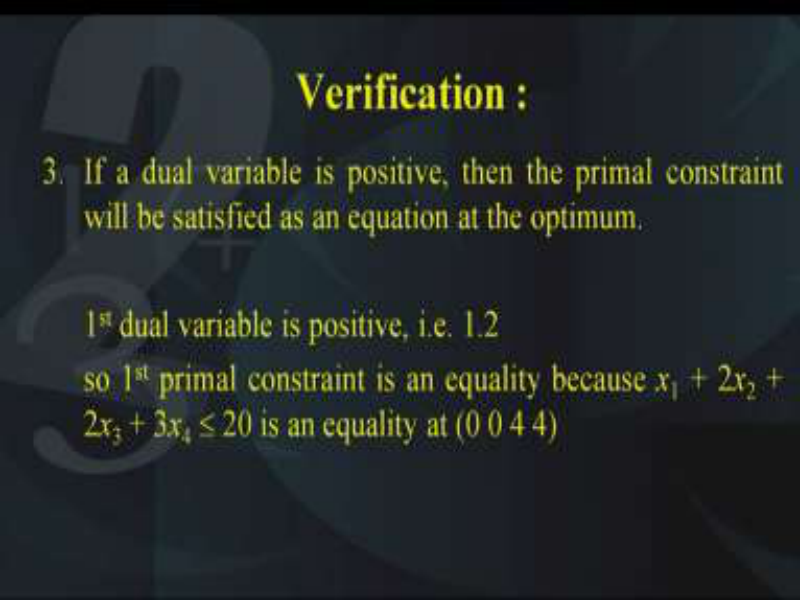

Let us verify this. Let us say if we have a dual variable which is positive, then the primal constraint will be satisfied as an equation at the optimum. Look at the first dual variable, what is the first dual variable at the optimum, it is 1.2 and if you look at the first primal constraint, what is the primal constraint, it is 2x1+3x2 < 20. Now this is satisfied as an equality at (0 0 4 4). So hence this is verified. **(Refer Slide Time: 18:40)** 

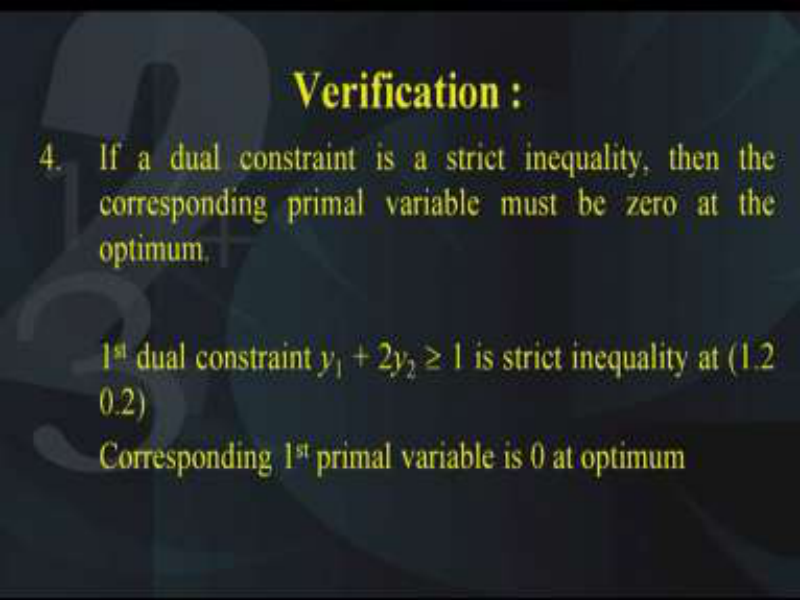

Next the fourth condition; if a dual constraint is a strict inequality then the corresponding primal variable must be 0 at the optimum. Now the third dual constraint is _y_ 1 + 2 _y_ 2  1. This is a strict inequality at the point (1.2, 0.2). Now corresponding to this first primal variable, this is 0 at the optimum. 

**(Refer Slide Time: 19:20)** 

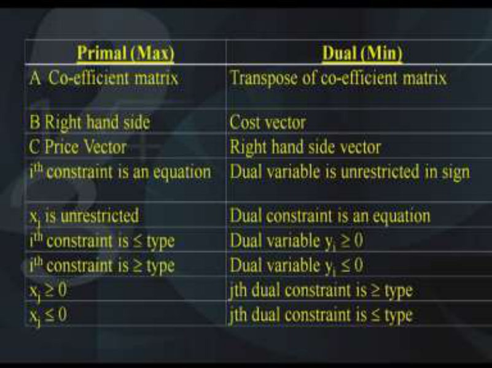

So what do we conclude, we conclude that there is a relationship between the positiveness of the primal variable and the less than equal to or equality of the constraint of the dual at the point of optimality. Please note, these conditions are valid only at the point of optimality, not necessarily for the feasible points. In conclusion, we can summarize the primal and the dual relationship like this assuming that the primal is the maximum and the dual is of the minimization type. 

Remember, if the primal is of maximization type, then the constraints should be less than equal to type. Similarly, if the dual is of the minimizing type, then the constraints should be greater than equal to type. So therefore what is the relationship? If the primal has a coefficient A that is the Aij of the constraints the coefficients, then the transpose of the coefficient matrix has to be taken for the dual. 

Similarly, B is the right-hand side of the primal then it becomes the cost vector of the dual that is it becomes the coefficients of the objective function. Similarly, if C is the price vector or the cost vector that is it is the coefficients of the objective function of the primal, then that becomes the right-hand side vector of the dual as we have seen. 

Next comes the constraints; at the point of optimality,  if ith constraint is an equation, this is regarding the asymmetric nature of the primal and the dual that is if the ith constraint is an equation then the corresponding dual variable is unrestricted in sign as we have seen in the previous lecture. 

If a variable xi is unrestricted in the primal, then the dual constraint is an equation. So that also we had seen as the asymmetric primal dual. If ith constraint is of the less than equal to type, then the dual variable corresponding dual variable yi will be  0. Similarly, if the ith constraint is greater than equal to type of the primal, then the corresponding dual variable yi will become < 0. 

And of course, we have to look at xi's are  0, then the jth dual constraint is greater than equal to type and similarly if xi is < 0 then the jth dual constraint is less than equal to type. So in this table what we find is we conclude that there is a beautiful relationship between the primal and the dual and similarly the decision variables of the primal are related to the constraints of the dual. 

So we come to this end of this lecture and before we depart we would like you to do this exercise. 

**(Refer Slide Time: 23:51)** 

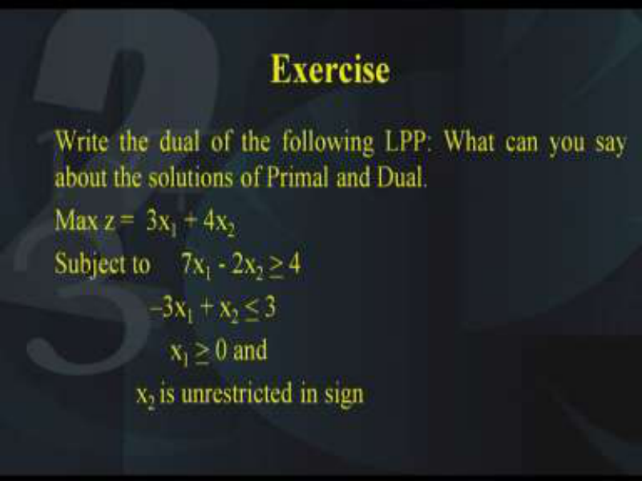

Write the dual of the following LPP and what can you say about the solutions of the primal and the dual. So you need to use the theorems that we have learnt and find out relationship between the solutions of the primal and the dual. So the objective function is to be maximized z =  3x1 + 4x2 subject to 7x1 - 2x2 <u>> 4 and similarly –3x1 + x2 < 3, x1 > 0 and x2 is unrestricted</u> in sign. 

So I hope you have noted down this question and you will be able to find out the solution to the problem. Thank you. 

