# **Operations Research Prof. Kusum Deep Department of Mathematics Indian Institute of Technology - Roorkee** 

# **Lecture – 18 Primal-Dual Relationship of Solution** 

Good morning students, till now we have seen some theoretical results which tell us the relationship between the objective function value of the primal and the dual. In todays lecture, we will try to find out what is the relationship between the solutions of the primal and the dual. So the title of todays lecture is relationship between the solution of the primal and the dual. 

**(Refer Slide Time: 01:04)** 

Today’s outline is as follows; first we will relook at the simplex multipliers then we will define primal feasible basis then we will define dual feasible basis. Next, we will look at an example of primal-dual and we will try to solve the primal-dual and at the end we will see what is the relationship between their solutions and finally an exercise. 

**(Refer Slide Time: 01:45)** 

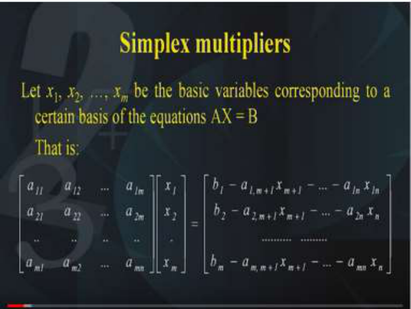

Now you have studied the simplex multipliers when we studied the revised simplex method. So I wish you to recall what is the meaning of the simplex multipliers, how the values of the simplex multipliers are obtained at each iteration and even at the final table, you can read the simplex multipliers from the initial table. Now these simplex multipliers will be of very good use as far as the solutions of the primal and the dual are concerned and that is what we are going to see. 

So let us look at the simplex multipliers from the theoretical angle first of all. Now suppose _x_ 1, _x_ 2, …, _xm_ are the basic variables corresponding to a certain basis of the equations AX=B as you know, basically we are interested in the solutions of AX=B and as you know that the canonical form gives you the basis that we are interested in. So in the matrix notation, this solution _x_ 1, _x_ 2, …, _xm_ can be represented like this. First we have the matrix a11, a12….,a1m similarly a21,a22,….a2m and am1,am2…,amm and this is to be multiplied by _x_ 1, _x_ 2, …, _xm_ . Now this is a matrix _mxm_ matrix and on the right hand side we have b1-a1, m+1x m+1 and –a1mx1m. So basically what we have done is we have put the matrix on the left hand side is the matrix amm that is the coefficients corresponding to the variables _x_ 1, _x_ 2, …, _xm_ because they are the basis.  And the rest of the things we have taken on the right hand side, so right hand side consists of these expressions that are shown on the right hand side. 

**(Refer Slide Time: 04:35)** 

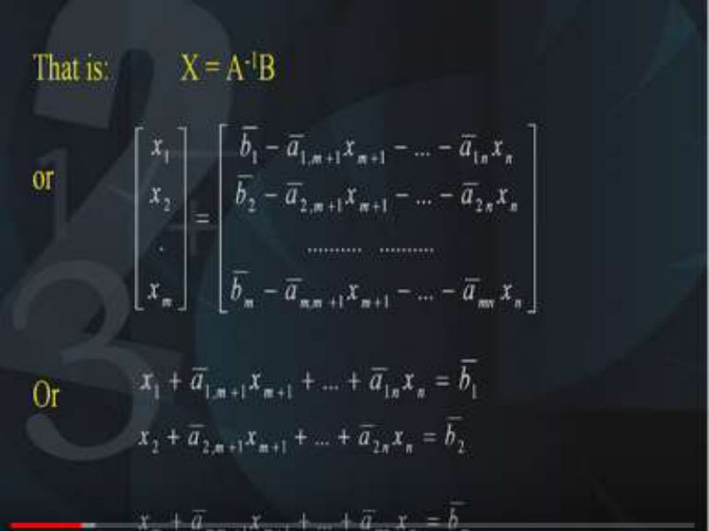

That means that the value of X = A-1 B, so we can take this A-1 on the other side and we will get the solution X. Again in matrix notation we can write it as follows, _x_ 1, _x_ 2, …, _xm_ = 1 - 1,m+1xm+1 and so on. Now the bar has been written because when you are going to take the inverse and multiply it then the value will be changed, so that is a reason why you need to put a bar, this is not the same values as the previous equation. When you solve it will give you this expression x1+ 1,m+1xm+1 + 1,nxn = 1  and like this the other equations. So whatever has been got at the left-hand side is now written in terms of equal to the right hand side of 1 , 2 etc. 

# **(Refer Slide Time: 06:04)** 

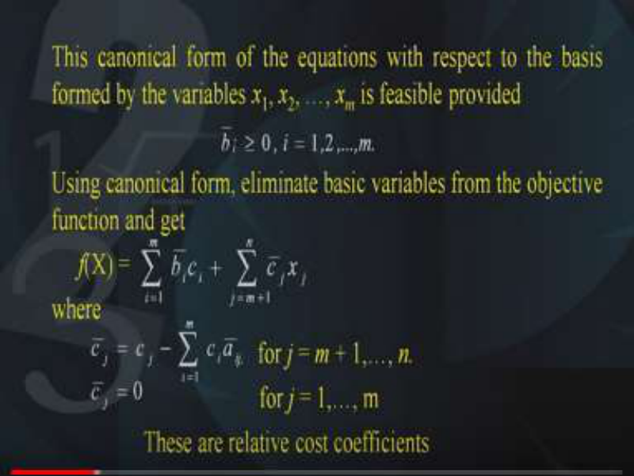

Now what is this mean, this canonical form of the equations with respect to the basis formed by the variables _x_ 1, _x_ 2, …, _xm_ is feasible provided the right-hand side that is the i they are > 0 for all values of i=1,2 up to m. You know that in order to make it feasible, we need the right-hand side <u>></u> 0. Now using the canonical form, we can eliminate the basic variables from the objective function like this. We get 

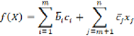

where i goes to 1,2,m,  j=m+1 to n. So the co-efficients or the terms corresponding to the basic variables are separated out and the terms corresponding to the non-basic variables are separate out and obviously their coefficients will also be different and as this now we have seen the values of the ci’s will be like this the j = and this holds for all j=m+1 to n and the j =0 for j equal to 1 to m. So, the entries in the deviation rows as you know corresponding to the basic variables are 0 and corresponding to the non-basic variables are non zero and that is how they are obtained. Now these are nothing but the relative cost coefficients or nothing but the entries in the deviation row as we have seen till now that when you do the simplex calculations at each iteration you have the deviation rows. 

# **(Refer Slide Time: 08:47)** 

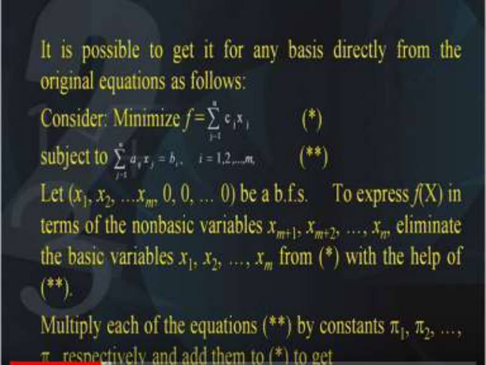

Now it is possible to get it for any basic variable for any basis directly from the original equations as follows, let us suppose we have the problem minimize ,we will call 

this equation as star and this is subject to the conditions , i goes to 1 to m and this equation we will call as double star, so this is nothing but the linear programming problem in the standard form. Now let x1, x2,…. xm, 0, 0, 0 be a BFS, it means that we have separated out x1, x2, …., xm separately and 0,0,0 because totally there are n decision variables but we have separated out the first m and the remaining are 0. Now our problem is to express f(X) that is the objective function in terms of the nonbasic variables, what are the nonbasic variables? xm+1 and so on up to xn. Eliminate the basic variables x1,x2,…,xm from star with the help of double star. 

So this you can do using this equality constraints you can actually eliminate the basic variables x1,x2,….,xm using this equations the ax=b and put them into the objective function. Then you can multiply each of the equations double star that is the equality constraints by the constants  1,  2, …,  _m_ respectively. Add them to the star equation and what are these  1,  2, …,  _m_ they are nothing but the simplex multipliers so this is what you will get. 

# **(Refer Slide Time: 11:25)** 

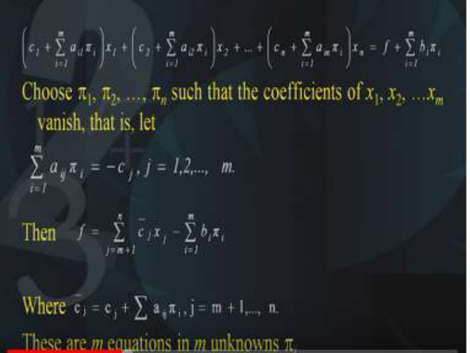

This equation on the top tells us when you do this operations on the equations, you will get these 

 1,  2, …,  _m_ like this. Now it is our freedom to choose  1,  2, …,  _m_ in such a way that the coefficients of x1,x2,xm they vanish. That is each of the expressions , j=1,2 up to m, then , j goes to 1,2 up to m where these coefficients are as before defined as j  = , j=m+1 to n. 

Now these are nothing but m equations in the unknowns πi is and that is how you can solve them. 

Now the same thing can be written in the matrix notation like this that is A  0  = –C  0, where  is the vector of the simplex multipliers and  = –[A  0]-1 C  0 = –[A0-1 ]  C  0 and therefore you can get  = –C0 [A0-1 ], so you have got the matrix multiplier vector. 

The vector  is as before the simplex multiplier vector and its components are called the simplex multipliers, so basically we can solve the equations of the LP and use those equations to be substituted in the objective function so that we can get the conditions satisfied and we can get the simplex multipliers. 

# **(Refer Slide Time: 14:20)** 

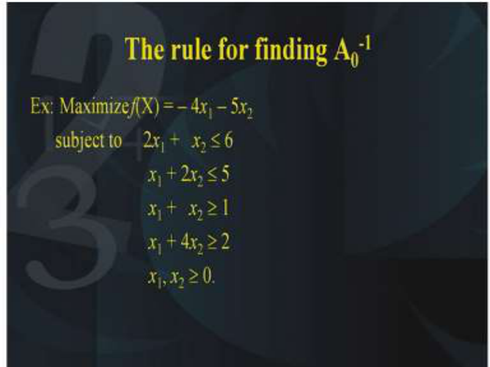

Now the rule for obtaining A0-1 that is the most important part of how to get A0-1 , so we will understand the methodology for finding out A0-1 with the help of this example, let us suppose we are given the problem at maximization of f(X)= -4 _x_ 1 – 5 _x_ 2 subject to 2 _x_ 1 + _x_ 2  6, _x_ 1 + 2 _x_ 2  5, _x_ 1 + _x_ 2  , _x_ 1 + 4 _x_ 2  2 and x1 and x2 are both  0. 

**(Refer Slide Time: 15:21)** 

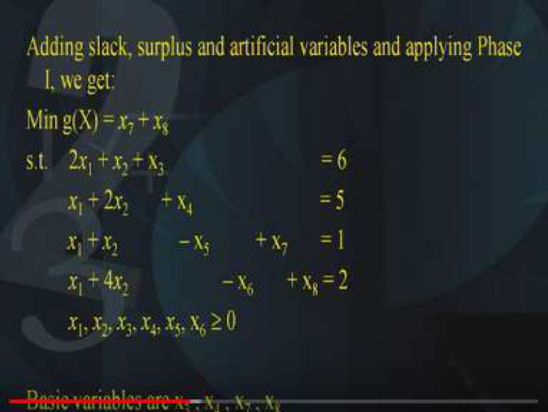

Now as we have done in the previous results, we will be adding the slack the surplus and the artificial variables and we will apply the phase 1 of the Two phase method. So we get the problem as minimization of g(X) = _x_ 7 + _x_ 8 why because x7 and x8 are the artificial variables and as you know that in the two-phase method we have to set aside the original objective function and use the temporary objective function as the sum of the artificial variables. So here x7 and x8 are the artificial variables and we get this equation 2 _x_ 1 + _x_ 2 + x3 = 6, second constraint is _x_ 1 + 2 _x_ 2       + x4 = 5, third one is _x_ 1 + _x_ 2  – x5  + x7  = 1 and the last equation is _x_ 1 + 4 _x_ 2 – x6  + x8 = 2, as you know x3 and x4 are the slack variables, and x5 and x6 are the surplus variable, and x7 and x8 are the artificial variables. Of course, all of them have to be  0. Now we find that the basic variables of this canonical form is x3 , x4 , x7 and x8, so these are the basic variables. 

**(Refer Slide Time: 17:37)** 

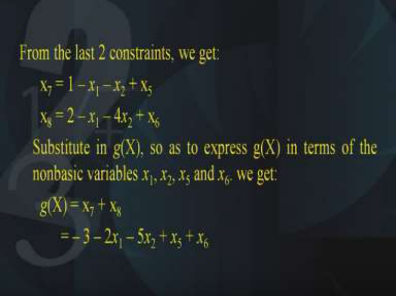

Now from the last two constraints, we can get x7 and x8, which are nothing but the artificial variables,  x7 we can get =1 – _x_ 1 – _x_ 2 + x5 and similarly x8 = 2 – _x_ 1 – 4 _x_ 2 + x6 , so we have got hold of the last two constraints because in the last two constraints only we had the artificial variables. So what we have done is we have kept the artificial variables on the left hand side and taken the rest of the things on the right hand side.  Now we will substitute all this in the temporary objective function _g_ (X), so as to express _g_ (X) in terms of the non-basic variables, what are the nonbasic variables? _x_ 1, _x_ 2, _x_ 5 and _x_ 6, so what we have got the temporary objective function _g_ (X) was nothing but x7 + x8 and in terms of x7 using this constraints that we have got, we will substitute the value of x7 and x8 and we get the following 3 – 2 _x_ 1 – 5 _x_ 2 + _x_ 5 + _x_ 6. 

**(Refer Slide Time: 19:40)** 

Now the initial table looks like this, that is we have the basis in the first column then we have the entries corresponding to x1, x2, x3, x4, x5, x6, x7 and x8 and then finally the right hand side. So all these entries have been taken from the given equations into the initial table, you are all familiar with this method by which we can write all these entries into the initial table. Also we can solve the problem and look at the entries in the final table. 

In the final table again, we have the basis in the first column and similarly the entries corresponding to the variables x1, x2, x8 in the remaining columns, you will note that the last the entries of x7 and x8 have not been entered these are blank. So in the final table, why are the entries in the column x7 and x8 not been written? can you think of the reason. Yes, the reason is that since they have disappeared from the basis that means that they are 0. So, we are not interested in the artificial variables and hence all the entries corresponding to x7 and x8 have to be removed. Because unnecessarily they are creating computations which are not required. So looking at this initial and the final table what we see we see that the basis of the initial table is the x3, x4, x7 and x8 whereas in the final table the basis is given as x3, x4, x1 and x2, so this is our basis of the initial table and the basis of the final table. 

**(Refer Slide Time: 22:22)** 

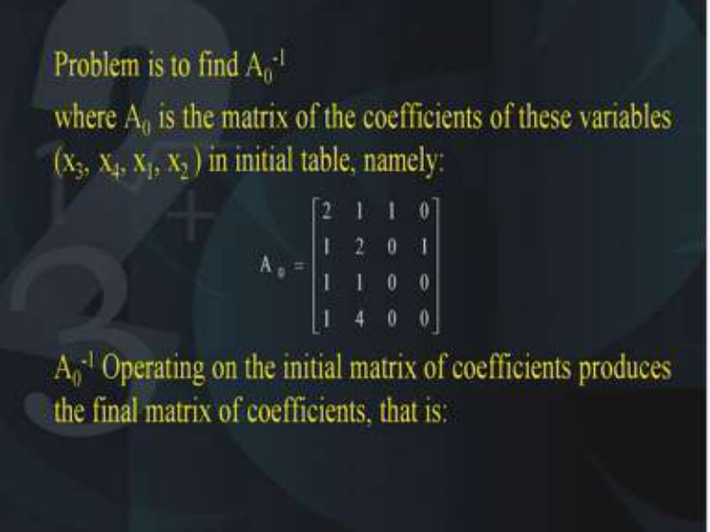

Now the problem is to find out A0-1 where A0 is the matrix of the coefficient of these variables that are the basis that is x3, x4, x1 and  x2, in the initial table and what is that matrix? that matrix A0 is 2 1 1 1, 1 2 1 4, 1 0 0 0, 0 1 0 0; as you know that this matrix is called the A0 matrix and we are interested in finding out its inverse. So A0-1 , we will operate this A0-1 on the initial matrix of the coefficients, so as to produce the final matrix of the coefficients. 

**(Refer Slide Time: 23:44)** 

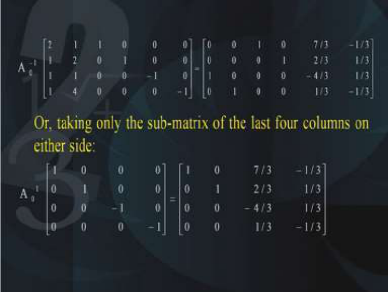

As you know, so this is what we are going to do we are going to operate A0-1 on the initial matrix that we got and we are going to get basically you do not need to do it on all the columns of the given matrix. You can just take only the sub matrix of the last 4 columns and this you can do just to avoid the unnecessary calculations so we are going to apply A0-1 on 1 0 0 0, 0 1 0 0, 0 0 -1 0, 0 

0 0 -1 and this will be equal to 1 0 0 0, 0 1 0 0, 7/3 2/3 -4/3 1/3 and the last column is -1/3 1/3 1/3 and -1/3, so basically we are applying this operator A0-1 on the entire equation on the left hand side as well as on the right hand side. 

**(Refer Slide Time: 25:16)** 

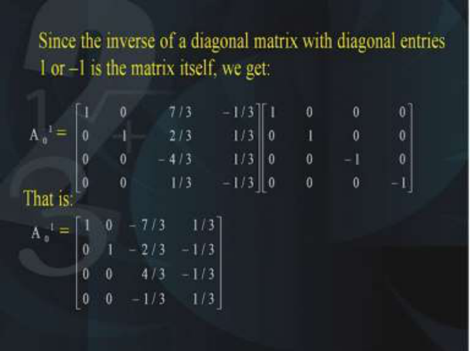

Now since the inverse of a diagonal matrix with diagonal entries either 1 or -1 is the matrix itself therefore we can get A0-1 on the left hand side and this is = the matrix 1 0 0 0, 0 1 0 0, 7/3 2/3 - 4/3 1/3, -1/3 1/3 1/3 -1/3 multiplied by this matrix 1 0 0 0, 0 1 0 0, 0 0 -1 0, 0 0 0 -1 and when you multiply it you will get A0-1 and what is our A0-1 , it is the matrix that we have got as follows 1 0 0 0, 0 1 0 0,-7/3 -2/3 4/3 and -1/3, 1/3 -1/3 and 1/3. 

So that is how we have got the A0-1 which we want. And what are the simplex multipliers? **(Refer Slide Time: 26:59)** 

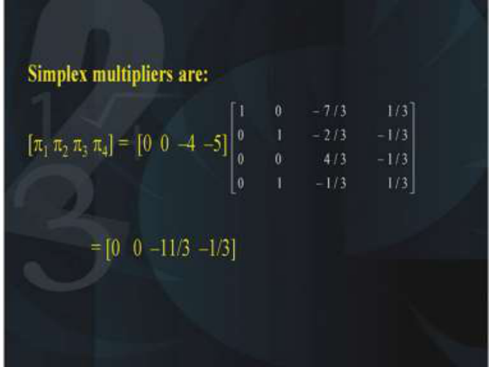

Simplex multipliers are nothing but [  1  2  3  4 ] which is = [0 0 -4 -5] A0-1 . Now what is this [0 0 -4 -5], this is nothing but the coefficients of the objective function of the basis corresponding to this stage, so if you look at the objective function it was the basis that is x3, x4, x1 and x2. So x1 and x2 are the basic variables and the coefficients corresponding to x3 and x4 are 0. The coefficients corresponding to x1 and x2 are -4 and -5. Please be aware, that you cannot change the order of x3, x4, x1 and x2; you have to leave it as it is in the final table, what I am trying to say is, you cannot make it x1, x2, x3, x4 you have to leave it as x3, x4, x1, x2, so you are not allowed to change the order. So we have got this simplex multiplies and when you multiply this row vector with this matrix. You get the final simplex multipliers as 0 0 -11/3 and -1/3 so these are nothing but the simplex multipliers. 

**(Refer Slide Time: 28:42)** 

Now we will look at some definitions, first of all if we have the primal in the form as follows, minimize Z =CX subject to AX=b, X  0 and let us suppose that A is given by the columns P1, P2, ….. Pn and B is a basis for A and XB is the basic variables corresponding to the basis B. So it is important that you have to maintain the sequence that is appearing in the basis, so that sequence has to be followed that is why we are writing it in this form A = [ P1, P2, ….. Pn]. 

# **(Refer Slide Time: 29:47)** 

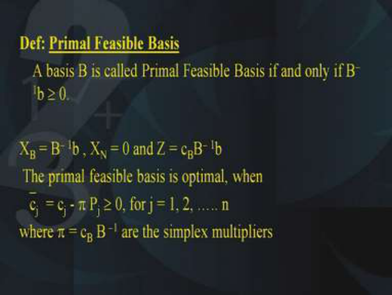

Now we define the primal feasible basis as follows, basis B is called primal feasible basis if and only if it is given by B– 1 b  0. XB = B– 1 b , XN = 0, so XN stands for the variables corresponding 

to the non-basic entries and the objective function value that is Z = cBB– 1 b. That is the cost coefficients corresponding to the basic variables in the objective function B– 1 b, the primal feasible basis is optimum when j = cj -  Pj  0, so j are nothing but the deviation entries and they have to be  0 for optimality where of course  are nothing but the simplex multipliers, so  = cB B–1 these are the simplex multipliers. 

**(Refer Slide Time: 31:42)** 

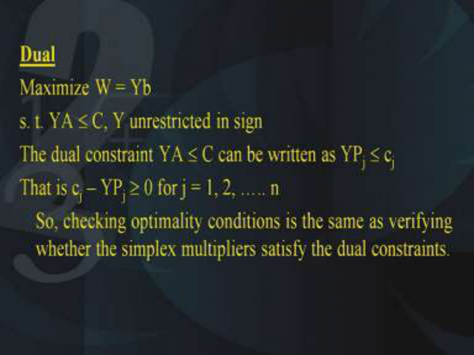

The dual constraint YA  C can be written as YPj  cj  and that is cj – YPj  0 for j = 1, 2, ….. n, therefore by checking the optimality conditions is the same as verifying whether the simplex multipliers satisfy the dual constraints or not. 

**(Refer Slide Time: 32:31)** 

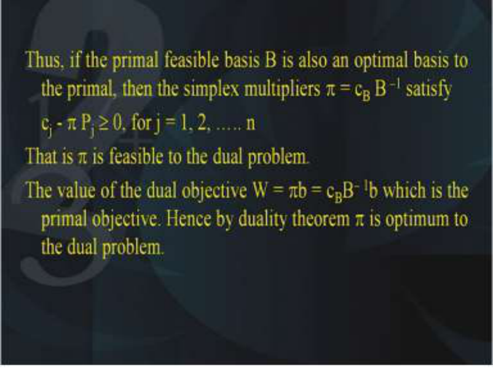

Thus, if the primal feasible basis B is also an optimum basis to the primal, then the simplex multipliers that is  = cB B–1 satisfy the conditions cj -  Pj  0, for j = 1, 2, ….. n. Now  is feasible to the dual problem the simplex multipliers. So the  is the simplex multipliers they are feasible to the dual problem. Now the value of the dual objective function that is W =  b which is nothing but cBB– 1 b which is the primal objective. 

Hence by the duality theorem  is optimum to the dual problem. So therefore what does it mean that using the duality theorem we have shown that  is optimum to the dual problem. **(Refer Slide Time: 34:00)** 

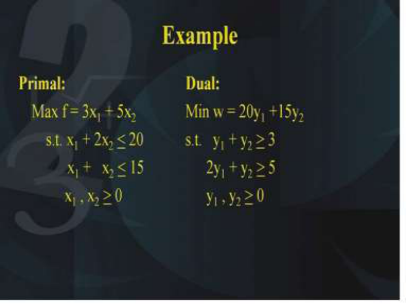

Now let us take an example, suppose we have the primal and the dual given as follows, that is the primal is maximization of f = 3x1 + 5x2 subject to x1 + 2x2 <u>< 20,  x1 + x2 < 15  and x1 and x2</u> are > 0. Also we have the corresponding dual as w = 20y1 +15y2 subject to y1 + y2 <u>> 3 and 2y1 +</u> y2 <u>> 5, so just a two variable problem and it is corresponding dual.</u> 

# **(Refer Slide Time: 35:01)** 

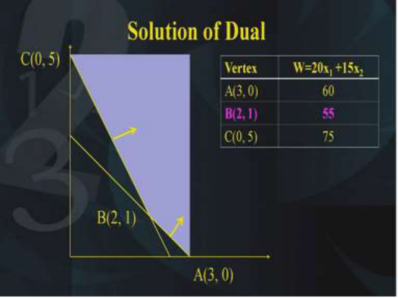

Let us try to solve both the primal and the dual with the help of the graphical method this is what is the solution of the primal. The shaded region shows the feasible domain and the optimum of the primal lies at the point B, so B is the point of optimum that is (10,5) and its objective function value is 55. You know how to solve given LP with the help of the graphical method. Next let us look at the solution of the dual this is the solution of the dual. 

As you can see that the feasible region is unbounded but because the objective function of the dual is minimization. So the minimum occurs at the point B which is nothing but (2, 1) and its objective function value is 55. 

So looking at these graphical solutions we know that the solution of the primal and we know the solution of the dual and we know that their objective function values is same 55. 

Now let us solve this primal with the help of the simplex method and we will try to observe the relationship that is what is the relationship? the relationship is that the simplex multipliers are nothing but the solution of the dual and that is the whole theme of todays lecture, that is the 

simplex multipliers of the primal are the solution of the dual. So we know that the solution of the primal is (10, 5) and the solution of the dual is (2, 1). Let us see how this is shown in the simplex calculations. 

**(Refer Slide Time: 37:22)** 

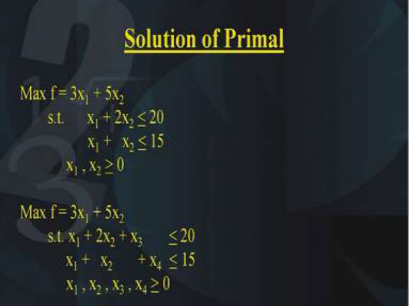

Now we are going to solve this primal with the help of the simplex method, therefore the given problem is maximization of 3x1 + 5x2 subject to x1 + 2x2 <u>< 20 and x1 +   x2 < 15, so in order to</u> solve it with the simplex method what we need to do is, we need to add two variables which are nothing but the slack variables. So x3 and x4 are the slack variables **.** We should have x1 + 2x2 + x3 = 20 this is not less than this is =, then x1 +   x2  + x4  = 15 because we have added the slack variables x3 and x4. 

**(Refer Slide Time: 38:26)** 

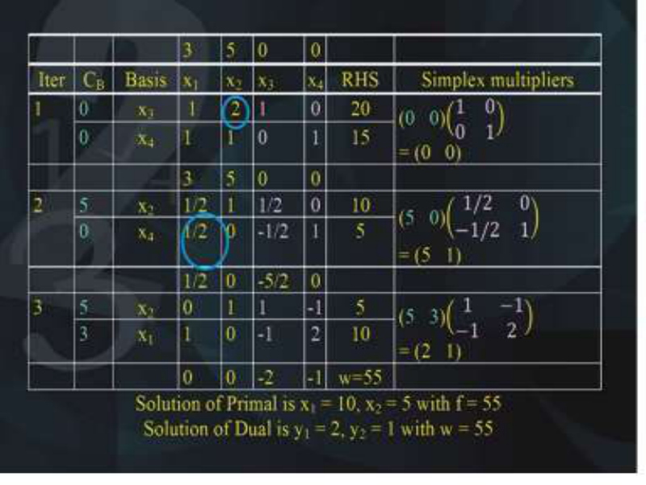

Now let us look at this simplex table so what you find? basically we have three iterations. In the first iteration, we just have the entries of the simplex problem into the table. x3 and x4 is the basis as you have seen and the entries are reported in the columns x1, x2, x3, x4 and the right-hand side is shown and in the last column I have shown the simplex multipliers at that particular iteration. So in the first iteration, you just have the basis. 

The coefficients corresponding to the basis in the objective function. So (0, 0) multiplied by (1 0; 0 1) and the simplex multipliers come out to be (0 0). In the second iteration, now the basis has changed and the coefficients corresponding to the basis are (5, 0) and if you look at the last column in the last column (5, 0) has to be multiplied by this matrix that is (1/2 -1/2; 0 1). Obviously you know how to find out the pivot and perform the next iteration so I am not talking about that. At the moment, I am just talking about the simplex multipliers and at each iteration you want to look at the behaviour of the simplex multipliers, so the last column is showing the simplex multipliers. Next in the third iteration, we find that the coefficients of the basis in the objective function are (5, 3) and this (5, 3) is multiplied by the matrix (1 -1;-1 2) and the simplex multipliers come out to be (2, 1). 

So looking at these entire calculations of this problem right from the beginning to the end at iteration by iteration, you can see that you do not need to solve the dual because you can read the values of the dual from the simplex table itself that is the values of the simplex multipliers shown in the last column and the final iteration are nothing but the solution to the dual, so (2, 1) is the 

solution to the dual, that is what is written in the last line. The solution of the primal is the basis corresponding to the right hand side and what is that, that is nothing but x1=10 and x2=5; so (10,5) is the solution of the primal with the objective function equal to 55. If you look at the simplex multipliers shown in the last column, then you can see that the solution of the dual is nothing but y1=2 and y2=1 that is (2, 1). This is the solution of the dual of course its objective function value is 55. So that is the beauty of the primal and the dual relationship that when you have the primal you do not need to solve the dual, you just solve the primal and at the end in the last iteration if you obtain its simplex multipliers those simplex multipliers are nothing but the solution of the dual. Of course their objective function values will be same, as we have seen because of the weak duality theorem. 

So I hope everybody is now familiar with the way in which you have obtained the solution of the dual from the solution of the primal. So here is an exercise for you, write the dual of the following LPP and solve the primal problem with the simplex method and obtain the solution of the dual from the primal calculations itself, so you just have to read the solution of the dual from the primal problem itself. 

So the problem is minimization of – 3x1 – 4x2 subject to 7x1 - 2x2 <u>> 4, –3x1 + x2 < 3, x1 and x2 ></u> 0. So I hope everybody has understood the question what to do? you have to solve it with the help of the simplex method and without solving the dual, read the solution of the dual from the simplex calculations. Thank you. 

