# **Operations Research Prof. Kusum Deep Department of Mathematics Indian Institute of Technology - Roorkee** 

# **Lecture – 19 Dual Simplex Method** 

Good morning students, today we will learn a method called the dual simplex method. This method is a modification of the simplex method for a particular type of problem, that is, which has a relationship with the dual. So as in how we proceed, we will see how the dual simplex method can be applied to obtain the solution of a linear programming problem. 

**(Refer Slide Time: 01:03)** 

The outline of today’s lecture is as follows: background, then the dual simplex method with the help of an exercise and finally a question for you to solve. Now let us look at the definition of the primal and the dual once again. 

**(Refer Slide Time: 01:33)** 

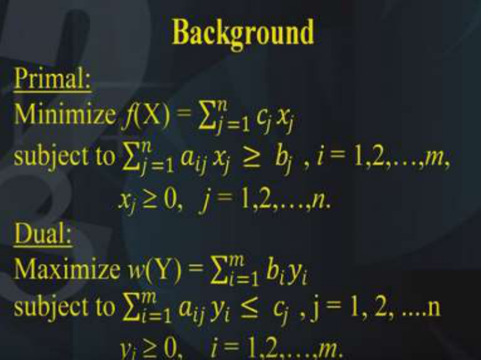

As you know, that if the primal is in the form of minimization of the objective function subject to the inequality constraints of the type <u>></u> and the dual is of the maximization type and the constraints are of the <u><</u> type. Then the standard form of the primal can be written as minimization of f(X) = subject to <u>> bj, where i goes from 1, 2 up to m</u> and xj are the decision variables of the primal, they are <u>></u> 0 for j = 1,2 to up to n. The corresponding dual is maximization of a function w(Y)= subject to <u>< cj</u> where j goes to 1 to n and the decision variables of the dual are yi are > 0 for i = 1 to up to m. **(Refer Slide Time: 03:07)** 

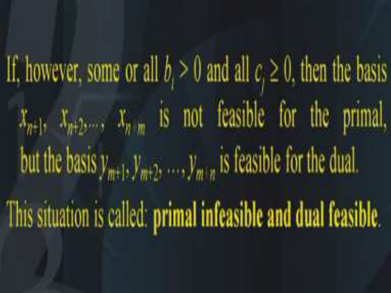

Now suppose all the c that is the _cj_  0 and the _bi_  0. This is a special case, we are assuming. A special case then the basis consisting of the basic variables that is _xn_ +1, _xn_ +2, _…_ , _xn+m_ which are nothing but the slack variables is feasible and also optimum. Similarly the corresponding basis of the dual is feasible and also optimum.  Now suppose there is a situation that some or all of the bi’s are strictly > 0 not <u>> ,they are strictly >0 and all the cj’s are > 0. Then the basis</u> _xn_ +1, _xn_ +2, _…_ , _xn+m_ is not feasible for the primal. But the basis _ym_ +1, _ym_ +2, …, _ym+n_ is feasible for the dual. Now this will hold only if some or all the bi’s are strictly > 0. This kind of a special situation is called primal infeasible and dual feasible. This is called primal infeasible and dual feasible. 

Now suppose we start our calculations of the simplex algorithm on the dual then we shall be moving through a successive iterations, where the basic feasible solution of the dual which occurs at the basic variables which means that the cj’s are <u>></u> 0, till the final relative cost coefficient or the deviation coefficients that is the bi’s of the dual are all non-positive, then we would have then arrived in the optimal solution of the dual. So this is a special situation and under this condition we would have arrived at the optimal solution of the dual. 

**(Refer Slide Time: 06:13)** 

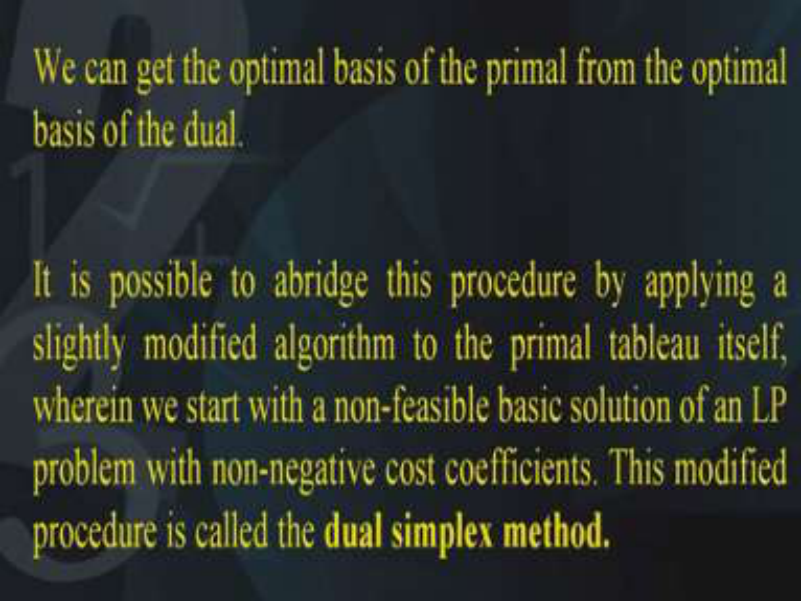

We can get the optimum basis of the primal from the optimal basis of the dual. Therefore it is possible to abridge this procedure, by applying a slightly modified version of the simplex algorithm to the primal table itself, wherein we start with a non-feasible basic solution of an LP 

with non-negative cost coefficients and this kind of a procedure is termed as the dual simplex method. 

So basically in the dual simplex method, we are starting from infeasible solution which is optimum and at the successive iterations we are going towards optimality and feasibility both. **(Refer Slide Time: 07:16)** 

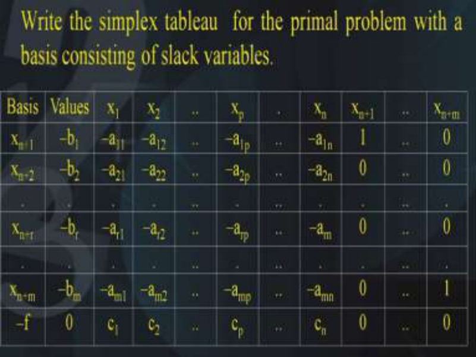

So let us write the simplex table for the primal with the basis consisting of the slack variables now this can be written in this tabular form on the first column we have the basis then in the second column we have the right hand side and under every column x1, x2, x3 etc we have their corresponding entries and in the end we have the basis that is xn+ 1, xn+2,…..,xn+m. So these entries are the unit vectors 1, 0, 0 etc is 0, 1, 0, 0, etc and finally 0, 0, 0, 1. 

So the basis has been excluded towards the right. 

# **(Refer Slide Time: 08:07)** 

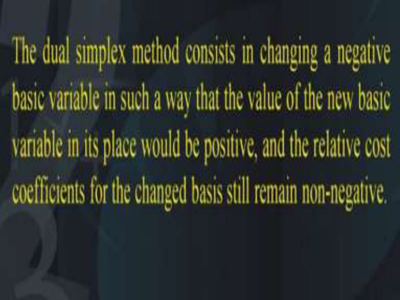

The dual simplex method consists of changing a negative basic variable in such a way that the value of the new basis variable in its place would be positive and the relative cost coefficients or the deviations for the changed basis still remains non-negative. Because, that is the condition for optimality if you remember, we must have all the deviation entries non-negative. **(Refer Slide Time: 08:45)** 

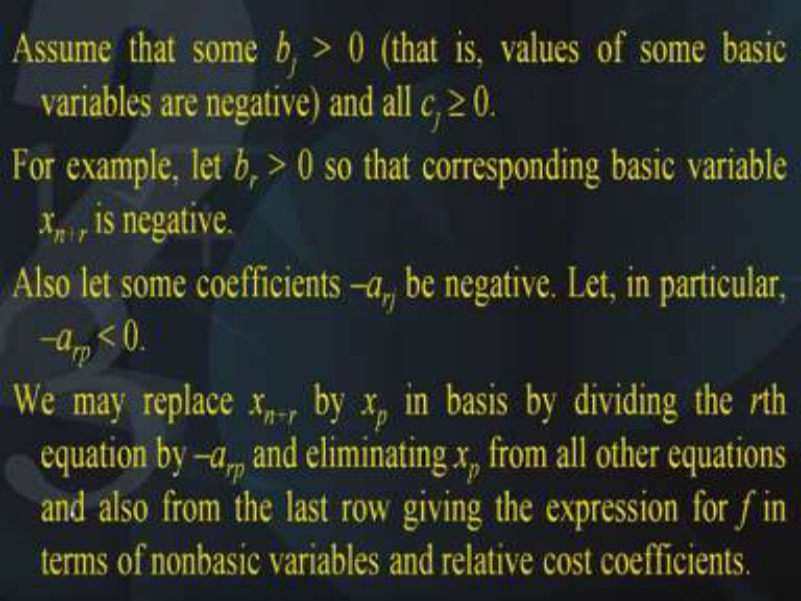

Now assume, that some _bj_ > 0 that is, it is not <u>></u> it is strictly > 0 that is value of some basic variable are negative and all cj are <u>></u> 0. For example let br be strictly > 0 so that the corresponding basic variable xn+r is negative. Also let some coefficient of the coefficient matrix let us say, -arj be negative. So arj is negative. Let, in particular it be called as – arp. This is strictly < 0. 

Now we may replace xn+r by let us say xp in the basis by dividing the rth equation by -arp and then eliminating xp from all other equations and also from the last row giving the expression for the objective function f in terms of the non-basic variables and the deviation entries that is the relative cost coefficients. 

**(Refer Slide Time: 10:24)** 

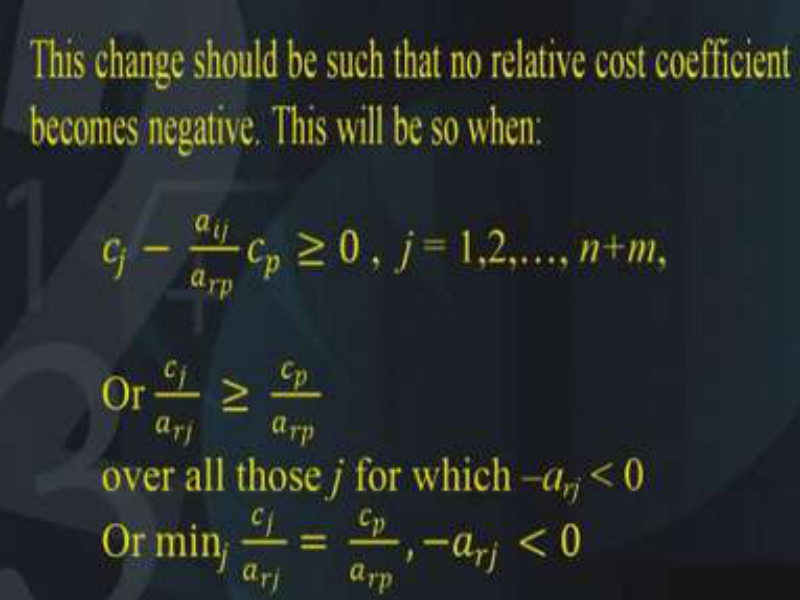

Now this change should be made very carefully such that no relative cost coefficient becomes negative, this will be so only if the following conditions hold that is cj –(aij / arp) cp <u>> 0 for all j=</u> 1,2 up to n+m.  In other words, this inequality should be satisfied over all those j for which -arp is strictly < 0 that is the minimum over j for this condition holds that is -arj is< 0. 

Now this leads to the determination of p. So, we know what is p the value of the new basic variable xp would be (–br) / (-arp) and as you know negative multiplied by negative is positive. So the whole expression will turn out to be positive if for - br < 0 then there is no - arp < 0 and the problem is infeasible.  Now, we may change the basis in this way step by step iteration after iteration such that one basic variable in each iteration till all the basic variables comes to have non-negative values. Thus we shall arrive at a basis which is a feasible solution and which is also an optimal solution as all the relative cost coefficients that is the _cj_  0. 

**(Refer Slide Time: 12:45)** 

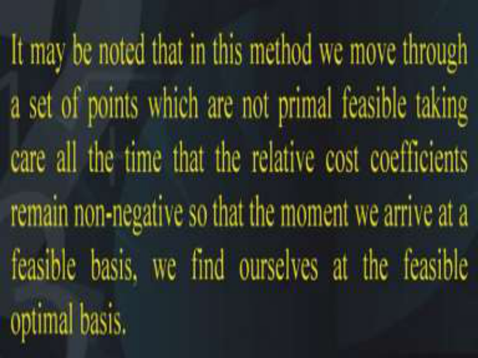

Now it may be noted that in this method we move through a set of points which are not primal feasible taking care all the time that the relative cost coefficients or the deviations remain nonnegative so that the moment we arrive at a feasible basis we find ourselves at the feasible optimum basis. **(Refer Slide Time: 13:21)** 

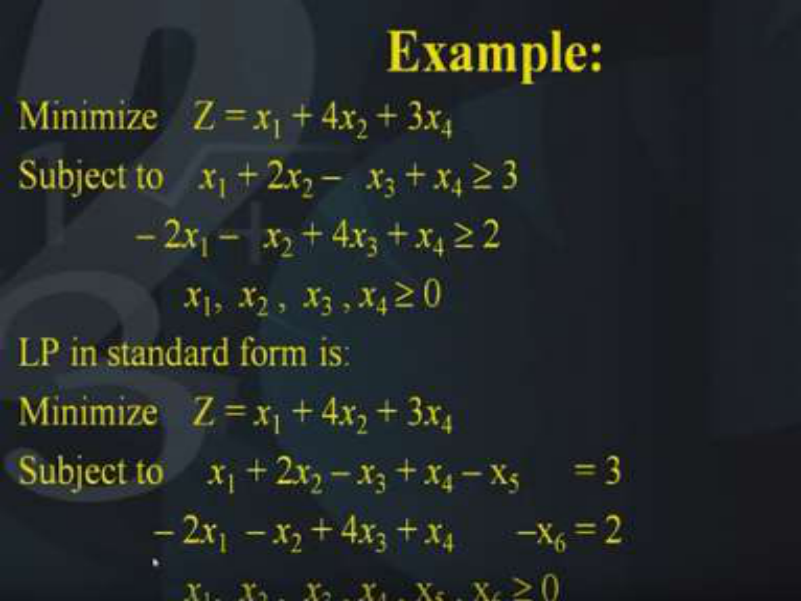

Now in order to understand this procedure let us look at an example, it says we have the primal as minimization of Z = _x_ 1 + 4 _x_ 2 + 3 _x_ 4  there is no x3 term subject to _x_ 1 + 2 _x_ 2 – _x_ 3 + _x_ 4  3 and the second constraint is – 2 _x_ 1 – _x_ 2 + 4 _x_ 3 + _x_ 4  2 and all the four decision variables _x_ 1, _x_ 2 , _x_ 3 , _x_ 4  0. Now the LP in the standard form looks like this the minimization is the same of the 

objective function. But we have to subtract surplus variables in both the equations and the surplus variable in the first equation is called as x5 and the surplus variable in the second equation is called as x6. So we have the two conditions _x_ 1 + 2 _x_ 2 – _x_ 3 + _x_ 4 – x5  = 3 and the second condition is – 2 _x_ 1  – _x_ 2 + 4 _x_ 3 + _x_ 4 –x6 = 2.  Of course all the decision variables _x_ 1, _x_ 2 , _x_ 3 , _x_ 4 , x5 , x6  0. 

**(Refer Slide Time: 15:36)** 

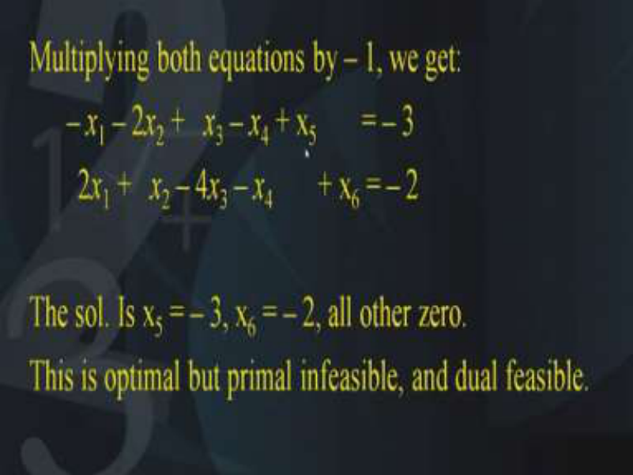

Now let us multiply both the equations with the negative sign and what do we find, we find that we get a basic variable in both the equations. So in the first equation we have x5 as the basic variable and in the second equation we have x6 as the basic variables because they were negative and since we have multiplied both the equations with the negative sign therefore we get  x5 and x6 as positive and this canonical form gives us a solution x5=-3, x6=-2. Now you will wonder that how can the values of the right-hand side be negative. Yes that is true, this is what is the beauty about this method, that is the basis that is the basic variables, they are negative, both of them are negative and of course all others are 0. So what is this BFS corresponding to, this BFS is optimum but it is primal infeasible why is it infeasible because we want that all the xi’s should be > 0. But unfortunately both these variables are negative. So they are not feasible, i.e., they are not primal feasible that is why they are written to be primal infeasible both these variables are primal infeasible and of course they are dual feasible. As we have seen in the explanation that they will be dual feasible because this satisfy the dual constraints so they are dual feasible but they are primal infeasible and they are optimum. 

# **(Refer Slide Time: 17:55)** 

So now let us record all this information in this table. Now as I said the basis is nothing but x5 and x6 and the coefficients of the objective function are 0 and 0 corresponding to x5 and x6. In the x1 column we will write the entries -1 and 2; under x2, -2 and 1; under x3, 1 and -4. Similarly -1 and 1 under x4; 1 0 under x5 and under x6 0, 1 and of course the right-hand side is - 3 and -2. 

On the top row over here we have to write the coefficients of the objective function corresponding to each of the variables. So what do we find? Corresponding to x1 we have 1, x2 4, as you remember there was no x3 term in the objective function so it is 0; x4 is 3 and of course for x5 and x6 the entries are 0. Next we will calculate the deviation row that is the cost coefficients and they are nothing but as before 1- (0, 0) (-1, 2)t that comes out to be 1. Similarly for the others 4 – (0, 0) (-2, 1)t that comes out to be 4. Similarly 0, 3, 0 and 0.  So, I hope you have understood how the initial table has been prepared the peculiarity in this table is that the right hand side entries are negative which is indicating that although this BFS is optimum but it is infeasible as far as the primal is concerned. 

**(Refer Slide Time: 20:17)** 

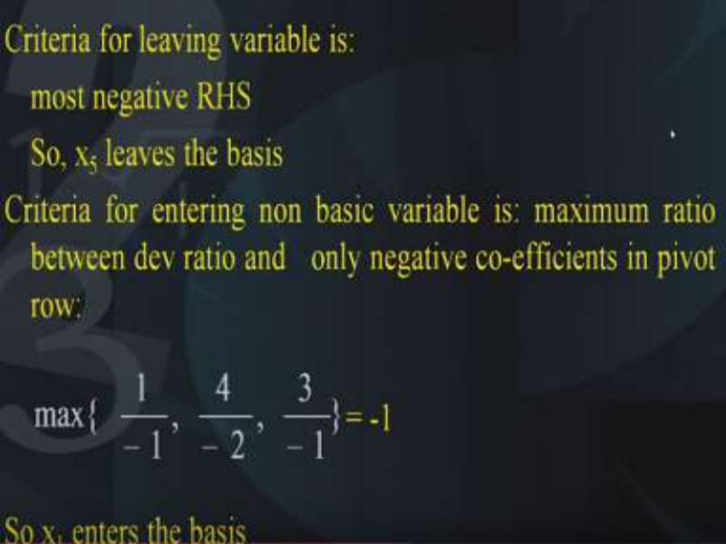

Now we have to change the basis so we need to decide the pivot and we need to decide which variable should enter and which variable should leave. Now the difference between the simplex method and the dual simplex method is that in the simplex method we first find the entering variable and then find the leaving variable, however in the case of the dual simplex method it is the other way round.  That is, first of all we find the leaving variable that is that variable which has to leave and then we find the entering variable. So what is the criteria for the leaving variable and the criteria is most negative right-hand side. So if you look at the right hand side what were the two entries let us go back yeah -3 and -2, you find that -3 and -2 are the righthand side entries and the most negative is -3. Therefore the variable corresponding to -3 should be leaving. 

**(Refer Slide Time: 21:47)** 

So, x5 is the variable corresponding to -3, that is, x5 that has to leaves. So x5 leaves the basis that is the first step that has to be taken. Next, we have to look at the criteria for the entering nonbasic variable into the basis. So, we have to look at the criteria is the maximum ratio test has to be performed. Again, if you remember in the simplex method, we perform the minimum ratio test. However, in the dual simplex method, we perform the maximum ratio test and the maximum ratio test has to be performed between the deviation row and only the negative coefficients in the pivot row. So for the non-basic variables, what are those entries? Let us look at it 1/-1 let me go back; 1/-1 that is corresponding to x1, similarly corresponding to x2, 4/-2, and the 3rd one is 3/-1.   Now, out of these 3 we have to select the one that is maximum and you can see that the maximum is = -1. So what does this indicate? This indicates that x1 should enter the basis and that is what is to be done. 

**(Refer Slide Time: 23:52)** 

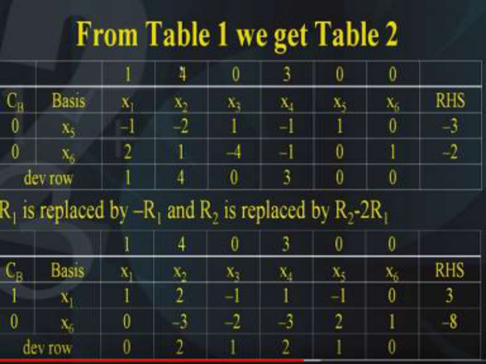

So from the initial table that is the table number 1, we obtained the table number 2 by applying the elementary row operations in such a way that x1 variable becomes the basis.  Here you can see in the second table under the x1 column we have the entries 1 and 0, as you know that the elementary row operations have to be performed like this, R1 is replaced by -R1 because this entry we have to make as 1, it is -1 we have to make it as 1.  So in order to do that we need to multiply R1 with the negative sign. Secondly we have to replace the R2 by R2-2R1. If we do that, then the entry corresponding to the second row under x1 column becomes 0. Therefore, applying these two elementary row operations we get the table number 2 which is shown below and after that we need to calculate the deviation entries. So the deviation entries are to be calculated by making sure that in this first column. We change the coefficient of the basis so the coefficient of basis for x1 variable is 1 and for the x6 is 0, that will remain as before and just as before. We calculate the deviation entries like this 1- (1, 0) (1, 0)t that is 0. Anyway this is a basic variable so automatically this entry will become 0 similarly 4 – (1, 0) (2,-3)t which comes out to be 2 and similarly 0 – (1, 0) (– 1,-2)t which comes out to be 1. Similarly 3 – (1, 0) (1 -3)t which comes out to be 2 and then 0 – (1, 0) (-1, 2)t which is 1 and finally x6 variable is the basic variable, So the entry is 0 that is how we have obtained table number 2 from table number 1. **(Refer Slide Time: 26:56)** 

Again, the next iteration has to be performed by finding out the most negative right hand side and we find that the most negative right hand side is -8 and this corresponds to the basic variable x6 and this indicates that the basic variable x6 should leave the basis and we have to now perform the maximum ratio test to determine which variable should enter the basis. So the maximum ratio test between the deviation row. Only the negative coefficients of the non-basic variable is in the pivot row is maximization of 2/-3, 1/-2, 2/-3 which comes out to be -1/ 2 this has to be the maximum and this indicates that this is corresponding to the entering variable. **(Refer Slide Time: 28:13)** 

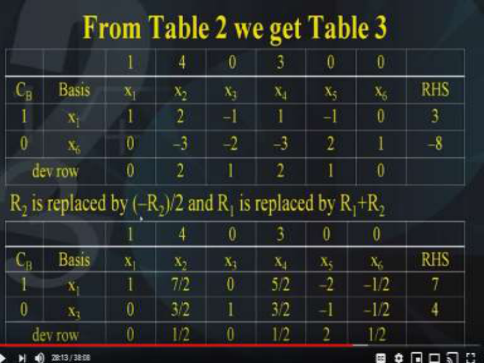

Therefore from table number 2 we get table number 3 as follows, under the x1 column we have 1,0,0. So now this we have to apply the elementary row operations in such a way that R2 is 

replaced by -R2/2 and R1 is replaced by R1+R2. So the elementary row operations are applied like this, R2 is replaced by -R2/2 and R1 is replaced by R1+R2. 

So, we get table number 3 from table number 2 like this under the x1 heading we have 1,0 under x2 we have 7/2, 3/2 under x3 we have 0 1, under x4 we have 5/2 and 3/ 2  x5 is -2,-1 x3 is -1/2 and -1/2 and the right hand side is 7 and 4. Now you will observe that we will calculate the last row that is the deviation rows it is calculated as usual that is 1 – (1,0) (1,0)t that is 0, then the next one is 1/ 2, 0, 1/ 2, 0 and finally 1/ 2. 

Now you will find that this is optimum as well as feasible because the right hand side has become >0 and as you know for feasibility it is necessary that the right hand side should be > 0 and that is what is happening here that right hand side has become > 0. 

**(Refer Slide Time: 30:50)** 

Now the stopping criteria has to be defined for the dual simplex method and the stopping criteria is that all the right hand side should be positive as you know that is the requirement for feasibility and since the stopping criteria has been satisfied in the second iteration itself, therefore the solution obtained is x1=7, and x3=4, and of course the objective function value that is z is 7. This is the primal optimum it is feasible as well as optimum. 

So what do we find in the simplex method we move from non-optimum to the optimum. Whereas, in the dual simplex method we move from the primal infeasible to the primal feasible. 

**(Refer Slide Time: 31:55)** 

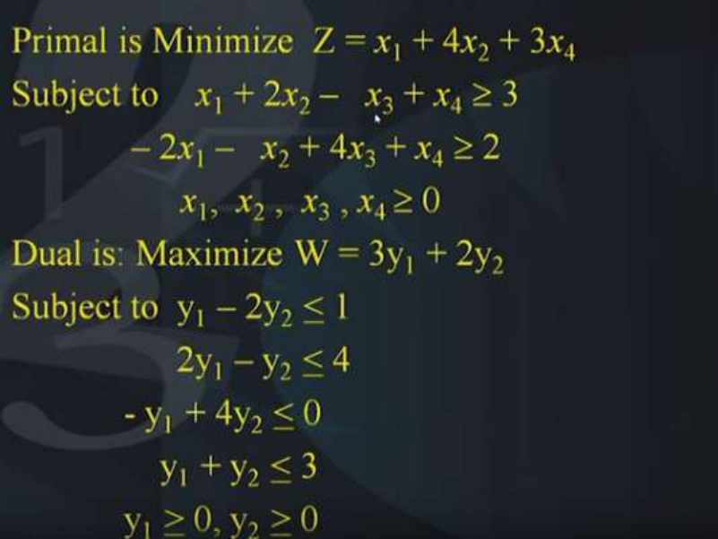

So the primal is in the problem that we had was given by the equation _x_ 1 + 4 _x_ 2 + 3 _x_ 4 subject to _x_ 1 + 2 _x_ 2 – _x_ 3 + _x_ 4  3 ,– 2 _x_ 1 – _x_ 2 + 4 _x_ 3 + _x_ 4  2 , all xi’s  0 and the dual was maximization of 3y1 + 2y2 subject to y1 – 2y2 <u>< 1, 2y1 – y2 < 4, - y1 + 4y2 < 0, y1 + y2 < 3 and all the y1 and the y2 > 0. Now we have seen that we have solved this primal okay and we started with a infeasible</u> primal and we reached at a feasible primal. 

Now I have written the dual of this problem and now let us see what happens if you look at this matrix B. 

**(Refer Slide Time: 33:28)** 

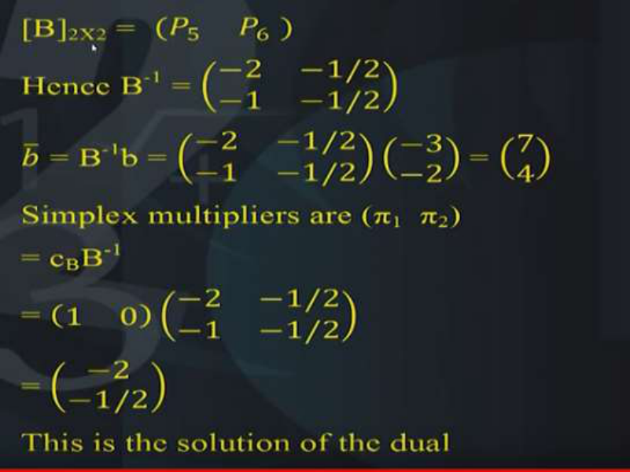

That is the basis the column basis that is the P5 and the P6. So what is B-1 ? B-1 is nothing but -2, -1; -1/ 2, -1/2 and the b bar is nothing but B-1 b which is nothing but this matrix (-2, -1; -1/ 2, -1/ 2) (-3, -2) which comes out to be (7, 4). You can just check these calculations, then the simplex multipliers π are nothing but π1 and π2  which is = cB B-1 and this is =(1, 0) (-2,-1; -1/2,-1/2) , this nothing but -2 and -1/ 2 and this is the solution of the dual. This is the solution of the dual, because as you know that when we find the simplex multipliers from the primal final table we can read the value of the solution of the dual. So, the actually the simplex multipliers are the solution of the dual, so this solution -2 and -1/ 2 is actually the solution of that dual. So let me go back. 

Yeah this is the solution to the dual of this problem you can just check that it should satisfy all the constraints and it should be optimum to the dual. So -2, -1/2 is the simplex multipliers and therefore they are the solution of the dual. 

**(Refer Slide Time: 35:34)** 

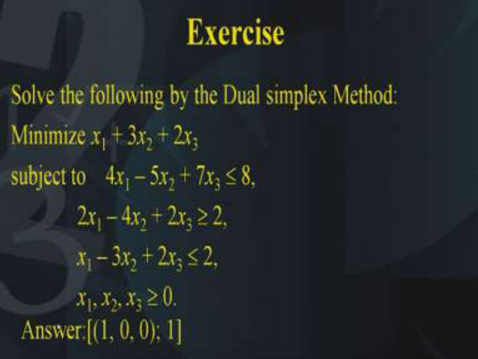

So in the end let us conclude this lecture with a question which I want you to do at your place. Solve the following LPP by the dual simplex method. So you have LPP as follows, minimization of _x_ 1 + 3 _x_ 2 + 2 _x_ 3 subject to 4 _x_ 1 – 5 _x_ 2 + 7 _x_ 3  8,  second constraint is 2 _x_ 1 – 4 _x_ 2 + 2 _x_ 3  2, _x_ 1 – 3 _x_ 2 + 2 _x_ 3  2 and of course _x_ 1, _x_ 2, _x_ 3  0. 

So you have to solve this problem with the dual simplex method and I have already told you how to do that, you have to make the initial table with the help of multiplying those equations 

where you have added surplus variable or rather subtracted surplus variables, so that the right hand side becomes negative the answer to this problem is also given. It is (1, 0, 0) with an objective function value 1. So I hope you will be able to complete this exercise. Thank you. 

