# **Operations Research Prof. Kusum Deep Department of Mathematics Indian Institute of Technology - Roorkee** 

# **Lecture – 02** 

# **More OR Models** 

Good morning dear students, this is the second lecture, the title of this lecture is some more OR models and in this lecture, we will try to model some more real life problems in terms of a linear programming model. 

**(Refer Slide Time: 00:47)** 

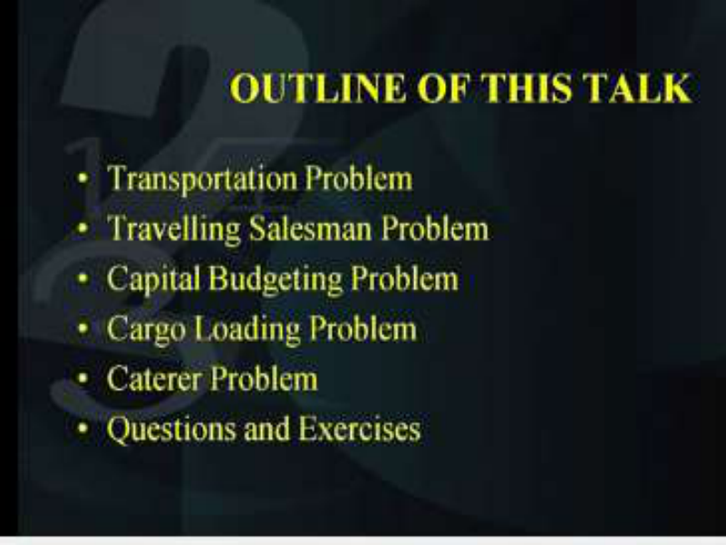

Before I do that let us recapitulate what we did in the previous lecture; in the previous lecture, we defined what is the mathematical definition of a linear programming problem and we defined what are the decision variables, what are the constraints that are imposed on the decision variables, what is the objective function and so on. This we did with the help of a couple of examples. 

So, today in this lecture we will look at some more real life problems which occur commonly in our day to day activities. I will be covering the following five types of problems which occur in our real life problems. The first problem is the transportation problem, the second one is the traveling salesman problem, the third one is the capital budgeting problem, fourth; cargo loading problem and the fifth one is the caterer problem. 

**(Refer Slide Time: 02:19)** 

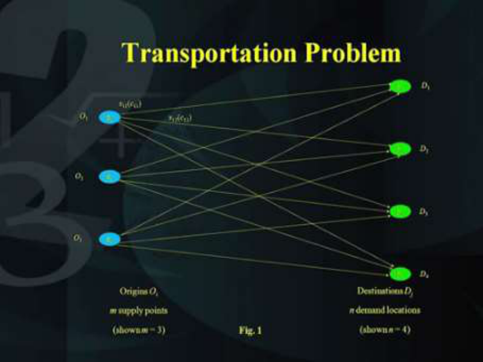

After this there will be some questions and some exercises for you to do later on. Let us look at the first problem which is the transportation problem. Now, in this problem suppose, there is an example where certain amount of goods have to be transported from a number of sources to a number of destinations, so there are let us suppose 1, 2, 3, 4 many sources and there are similarly many destinations; 1, 2, 3, 4, many destinations. So, from each of the source let us say a commodity has to be transported to each of the destinations and for example, the first source; the cost of transportation of that goods to the various destinations is given to us, cost per unit of the commodity is given to us and like this all this information for all the sources and all the destinations is given. 

**(Refer Slide Time: 03:29)** 

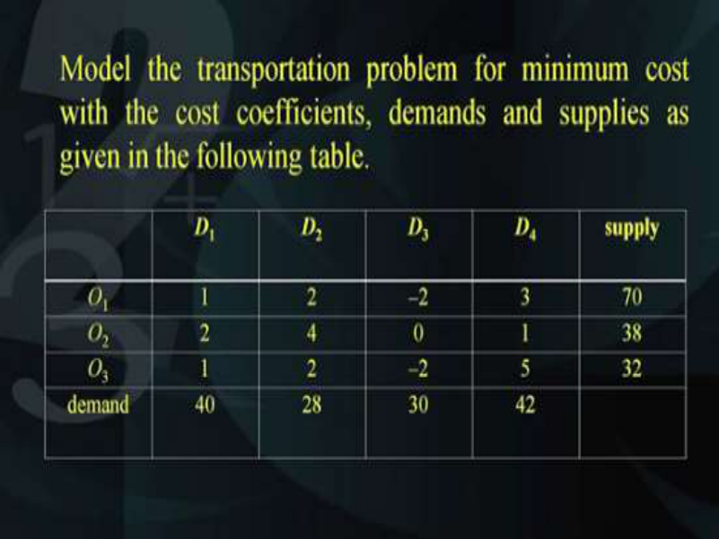

So, the problem can be represented in a tabular form as shown in this table where we have the sources on the first column and the destination on the top row, so you can see that each 

commodity can be transformed from the source, from the ith source to the gth destination and these are the costs that are given. So, for example from the first origin, the cost of transporting the good to the first destination is given by this constant 1. Similarly, from the first origin to the second destination is given by 2, so like this the cost of transporting the good from each of the origin to each of the destination is given in this table. Now, the transportation problem says that we need to determine how many units of the commodity should be transformed should be transported from the ith origin to the gth destination in such a way that the cost that is the overall cost is minimum. 

So that means, we need to formulate the objective function and we need to look at the decision variables and before we do that we need to look at what are the supplies that are available at each of the origins. This is given in the rightmost column that is the supply at the origin 1 is given to be 70 and like this. Similarly, the availability adds the destinations, so this is given in the last row. 

# **(Refer Slide Time: 05:44)** 

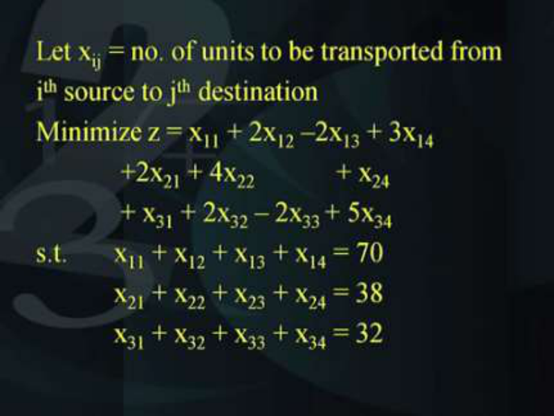

So, like this, this entire table represents the data for the modelling of the transportation problem. This is the model; let us look at it carefully what it means. xij is the number of units to be transported from the ith source to the jth destination. As you remember in the last lecture we had defined three steps to model a given problem. So, this is the first step that is we want to define the decision variables. xij are the decision variables indicating the number of units to be transported from the ith source to the jth destination and obviously, all these xij’s should be > 0 and they should also be integers because they are number, so you cannot transport let us say 2.3 units, you can either transport 2 or 3, so the xij’s should be > 0 and they should be integers. The 

next step is to identify the objective function. In this case, the objective function is minimization of x11 + 2x12 etc., now how did these coefficients come? Let us go back to the previous slide and look at the entries in the first row of the table and you will see that on the first row of the table, the coefficient 1 corresponds to the x11 entry, so x11 multiplied by 1 is the first entry in the objective function. Similarly, the second entry in the first row is 2, so x12 should be multiplied by 2 that is why it says 2 times x12 and like this. So, the entire expression for the objective function can be obtained like this and this is the overall cost that has to be minimized. Now also this has to be subject to the following constraints that is x11 + x12 + x13 + x14 = 70, this is coming from the first row. So, here you look at this first row, 1 2 – 2, 3 these are the coefficients of x11, x12, x13, x14 and since the supply is 70, so we need to restrict this first equation as x11 + x12 + x13 + x14 = 70. 

**(Refer Slide Time: 09:05)** 

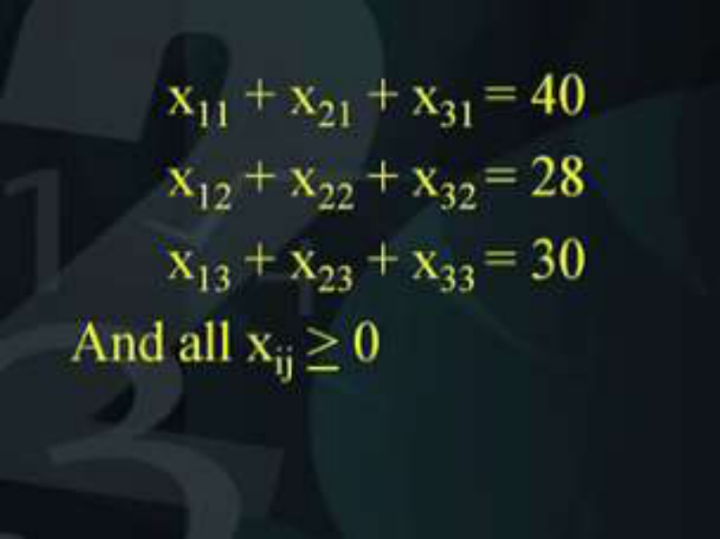

And in this way, the other equations corresponding to the other rows also comes into existence, also we need to look at the vertical constraints so, the vertical constraints tells us x11 + x21 + x31 = 40, this comes from the first column. So, here look at the first column; in the first column the availability is given; the demand is given by 1 times x11 2 times x21 and 1 times x31, so this demand = 40 that is why this equation comes. 

Similarly, for the other two columns the demand has to be met and therefore we get these three equations and as I said before all the xij’s should be > 0 and they should be integers, so this is a transportation problem which is found to be occurring in a number of places. **(Refer Slide Time: 10:10)** 

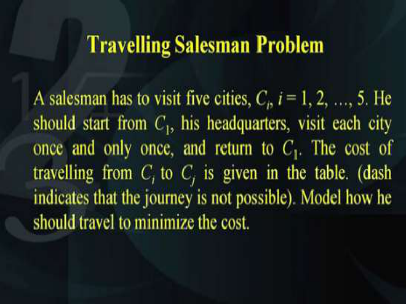

The second problem that I am going to discuss is called the Travelling Salesman problem, this is also a problem which occurs in our day to day lives and the problem states that there is a salesman who has to go to a number of cities, he has to visit a number of cities in such a way that he starts from the first city and moves to the other cities once and only once. He has to travel each of the cities once and only once in such a way that he returns back to the city number 1. Because he is supposed to sell his product so, the salesman has to visit let us say five number of cities in this example and these cities are called C1, C2 etc., he should start from the city number C1 and he has to move to all the cities in such a way that he visits each of the city once and only once and finally returns back to the city number 1(C1). Now, the cost of traveling from city Ci to city Cj is given to us. This is given in terms of let us say rupees or some units. The journey that he has to perform should be in such a way that the cost of traveling from each of the cities and returning back to the first city should be minimum. So, with this in mind we need to model this problem as a linear programming problem. **(Refer Slide Time: 11:59)** 

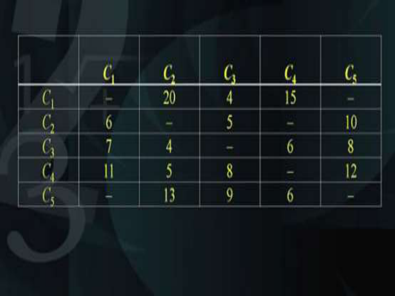

Now, this is the data that is given in the problem, you will note that the diagonal elements in this matrix are marked with a dash indicating that there is no point of traveling from C1 to C1. Similarly, there is no point of travelling from C2 to C2 that is the reason why the diagonal entries are blank. Also, you will observe that there is no entry corresponding to C5 to C1 and similarly, C1 to C5. The reason is that there is no connections between the city C1 and the city C5, so that is the reason why this is left as a blank entry, you will also observe that, it is not necessary that this is a symmetric matrix that is the lower and the upper triangular matrix are need not be same in general. The reason is that for example is C21; the entry C21 C12, the reason is that suppose you are travelling from one city to another city, the cost of travelling from the first city to the second need not be the same as the cost for traveling from C2 to C1, so that is the reason why it is not necessary that C ij = C ji. **(Refer Slide Time: 13:40)** 

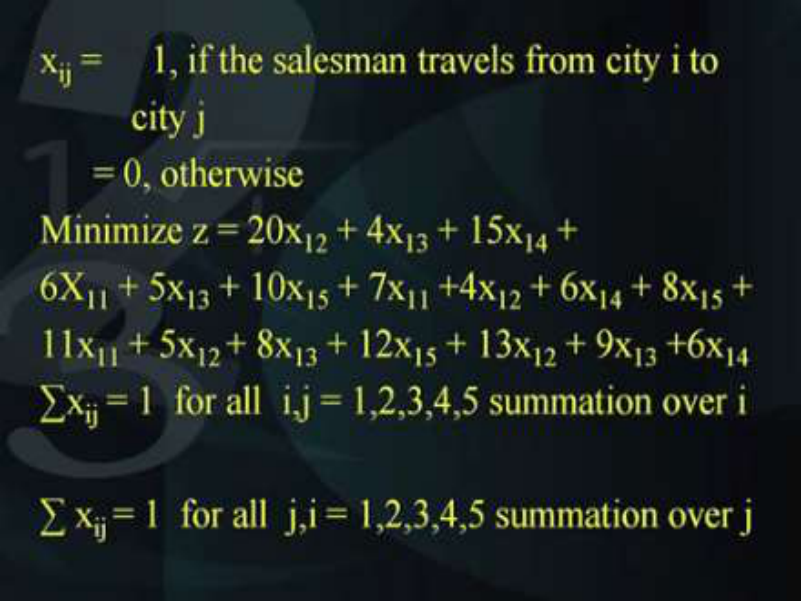

Now, looking at this cost matrix, we need to design the problem in such a way that the cost is minimum. So here xij; this is the first step that is identification of the decision variables, xij are the decisions variables and it takes the value 1 if the salesman's travels from city i to city j and it takes the value 0 otherwise. So these type of problems are called 0-1 programming problems, that is, this is a specialized kind of a problem where the decision parameters they take only two types of values either 1 or 0. So, here also xij takes value 1 if the salesman travels from city i to city j and it takes value 0 otherwise. 

Now, again as before the second step is to identify the objective function and the objective function can be obtained by this expression 20(x12) etc. Please note that there is no entry corresponding to x11; because in the matrix, there was a dash entry in the x11 column, so that is the reason why we will start with x12. So, 20x12 + 4x13 + 15x14 + 6x11 + 5x13 + 10x15 + 7x11 + 4x12 + 6x14 + 8x15 + 11x11 + 5x12 + 8x13 + 12x15 + 13x12 + 9x13 + 6x14 , so the entire expression for the objective function can be obtained like this. Apart from this, we also have another constraint of this type that is ∑xij = 1  for all  i,j = 1,2,3,4,5 summation over i. Similarly, ∑ xij = 1  for all  j,i = 1,2,3,4,5 summation over j. What does this mean? This means that corresponding to this table we want that all the xij's in the horizontal and in the vertical rows should sum up to 1 and that is the reason why we need to impose these constraints. 

**(Refer Slide Time: 16:26)** 

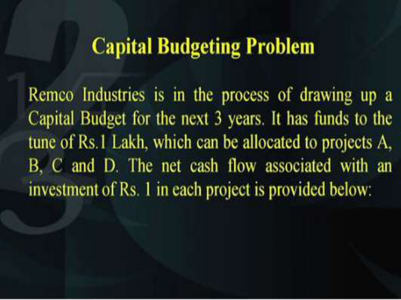

Next is the capital budgeting problem now, this is a very interesting problem and it is as follows ; that is, Remco Industries is in the process of drawing up a capital budget for the level for the next coming 3 years. It has funds to the tune of rupees 1 lakh which can be allocated to projects A, B, C and D. The net cash flow associated with an investment of rupees 1 in each project is given below. 

# **(Refer Slide Time: 17:12)** 

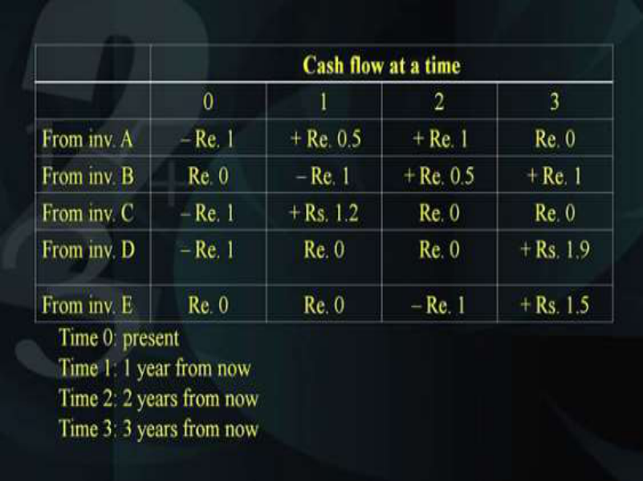

Now, here is a table, the data is given in this table, it tells us that if you look at the A,B,C,D,E and you look at what kind of levels it has, 0 is the present level similarly, 1 is the level after 1 year, the level 2 is the level after 2 years and 3 is the level after 3 years, so this is a data in terms of rupees that is given to us and we need to formulate it as a linear programming problem. **(Refer Slide Time: 17:49)** 

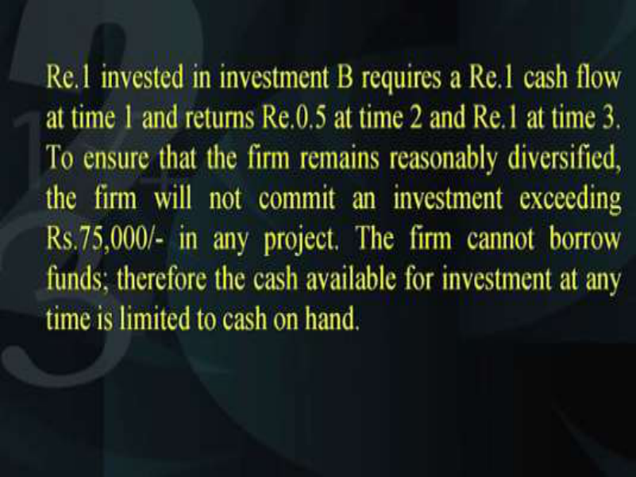

So, this means that rupee 1 invested in the investment B requires rupees 1 cash flow at time 1 and returns 0.5 at time 2 and rupees 1 at time 3. Now, to ensure that the firm remains reasonably diversified, the firm will not commit an investment exceeding rupees 75,000 in any project. The firm cannot borrow funds therefore the cash available for investment at any time is limited to cash on hand. 

**(Refer Slide Time: 18:38)** 

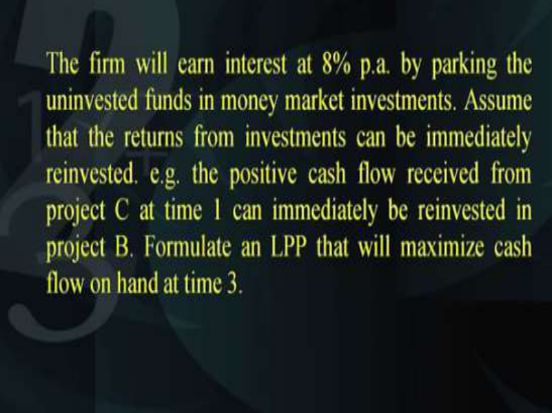

The firm will earn interests at the rate of 8% per annum by parking the uninvested funds in money market investments. Assume that the returns from investments can be immediately reinvested, that is, the positive cash flow received from project C at time 1 can immediately be reinvested in project B. We need to formulate the problem as a linear programming problem, so that the maximum cash flow on hand at time 3 are obtained. 

**(Refer Slide Time: 19:24)** 

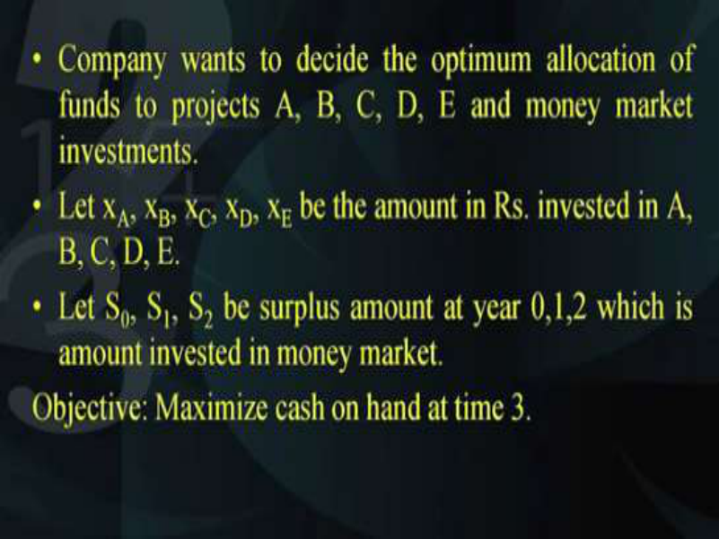

So, we need to look at a couple of observations, the first one is that the company wants to decide the optimum allocation of funds to the projects A, B, C, D, E and money market investments. Therefore let us look at the first step. The first step is the decision variables so, the decision variables can be identified as XA, XB, XC, XD and XE be the amount in rupees invested in the projects A, B, C, D and E, so that is the first part. We have identified the decision variables XA, XB, XC, XD and XE. S0, S1 and S2 be the surplus amount at year number 0, 1, 2 

which is the amount invested in money market, so this is the surplus amount which has to be invested in the money market. Now, the objective function is to maximize the cash on hand at time 3. 

**(Refer Slide Time: 20:46)** 

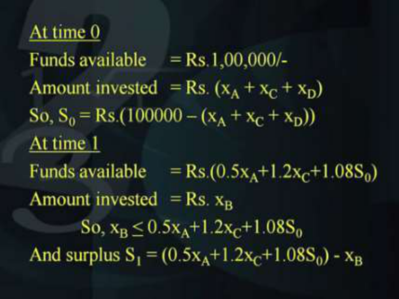

So, let us look at the various levels; at the first level what is the situation, at the second level what is the situation. So, at the first level, that is, at the 0 level, the funds available is rupees 1 lakh this is given in the problem, so the funds available is 1 lakh and the amount that is invested is given by XA + XC + XD, therefore what is S0; S0 is the difference of the two, that is, (1 lakh – (XA + XC + XD ), so this is the S0. 

Next comes the level 1; at level 1, the funds that are available are as follows that is rupees (0.5 XA + 1.2 XC + 1.08 S0). Also the amount that is invested is XB, so therefore we have a constraint that is XB should be < 0.5 XA + 1.2 XC and so on and what is the surplus? Again at this level the surplus is S1 which is given by the difference of the two so, just as we got the surplus amount in level 0, we have got the surplus amount at level 1. 

**(Refer Slide Time: 22:25)** 

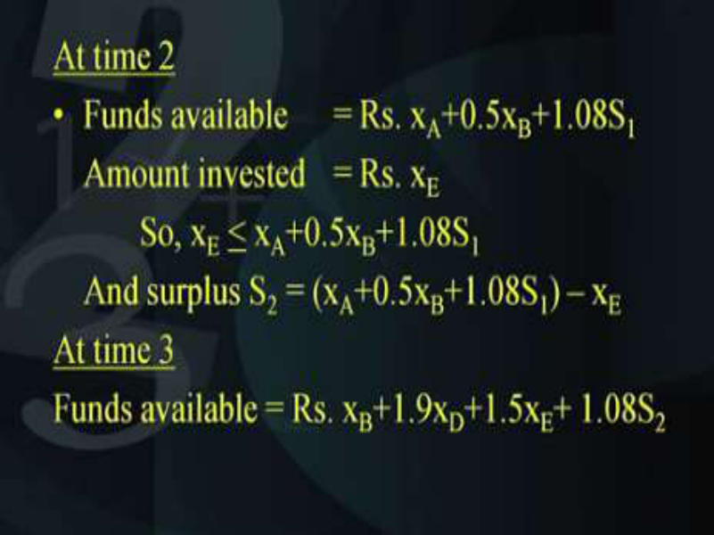

Now, let us come to the level 2; in the level 2, the funds available are rupees XA + 0.5 XB and so on and the amount invested is XE, so therefore we have a constraint that the amount invested should be less than equal to the funds that is available because you cannot invest more than what is available. Therefore, again as before we will calculate the surplus amount; the surplus amount is given by S2 which is equal to the difference of the amount that is invested and the amount that is available. 

Therefore, at level 3 that is after the third year, the funds that are available are as follows; rupees XB + 1.9 XD and so on. 

**(Refer Slide Time: 23:30)** 

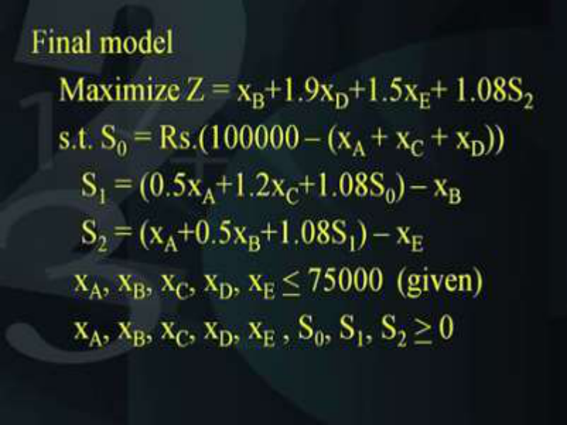

So, like this we have obtained the mathematical model in terms of a linear programming problem for this investment problem, therefore in a nutshell we can write down the final model as follows; the objective function and the constraints in terms of the S1, S2 and S3. Also please 

note that XA, XB, XC, XD, they should all be < 75,000 and also each of the decision variables as well as S1, S2, S3  they should be all > 0. 

**(Refer Slide Time: 24:16)** 

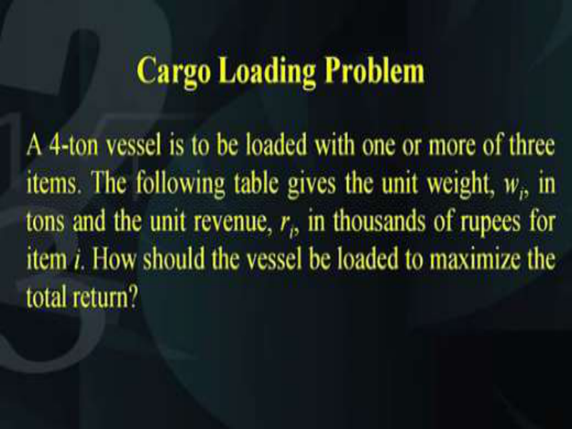

Next comes another interesting problem which is called as the cargo loading problem. Now, there is a cargo has to be loaded by some units of some commodity. Now, how this problem can be modelled as a linear programming problem, we will see in this example. There is a 4 ton vessel to be loaded with one or more of three items. The following table gives the unit weight wi in tons and the unit revenues ri’s in thousands of rupees for the item corresponding to i. Now, the problem is how should the vessel be loaded to maximize the total return that is the problem, how should the vessel be loaded, so as to maximize the total return. 

**(Refer Slide Time: 25:26)** 

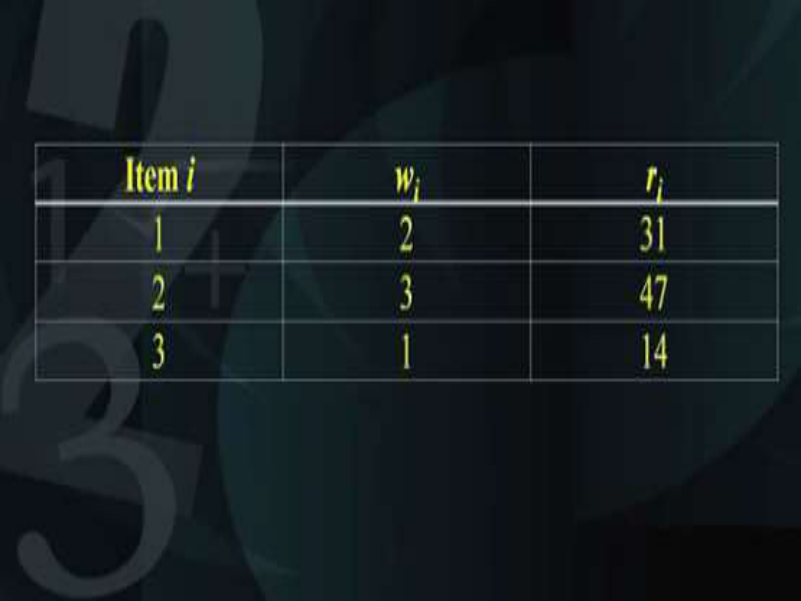

Now, here is the data that is given for the problem that is the items are numbered as 1, 2 and 3 and the corresponding wi is given to be 2, 3 and 1 and the corresponding ri is given to be 31, 47 and 14. So as before we need to look at what are the decision variables, what are the objective functions, what are the constraints. 

**(Refer Slide Time: 25:56)** 

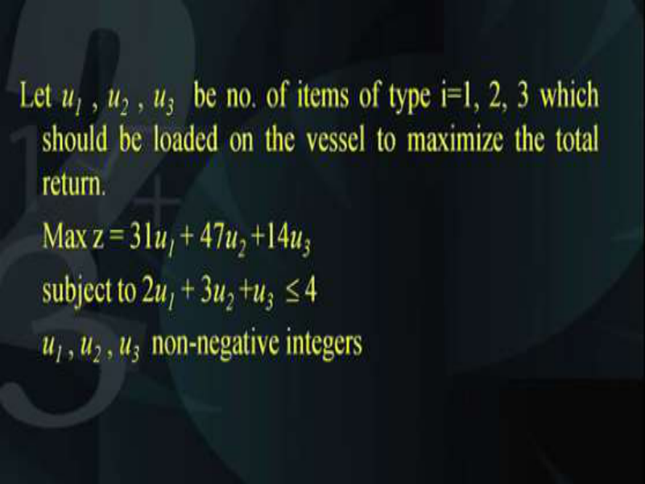

So, let us define the decision variables as follows; u1, u2 and u3 are the number of units of types i = 1, 2 and 3 which should be loaded on the vessel to maximize the total return. Remember we have to maximize the total return and the objective function therefore looks like this; maximization of z = 31u1 + 47u2 +14u3. where did this 31 come from let us see; here it is on the last column. 31u1 + 47u2 +14u3, so that is the return. This has to be subject to the condition 2u1 + 3u2 +u3  4, where did this 2 come from; this came from the data that is given in the table under the wi column, 2u1 + 3u2 +u3  4, and of course as before all the parameters u1, u2 and u3 should be non-negative integers that is they should be >= 0 and they should be integers. **(Refer Slide Time: 27:27)** 

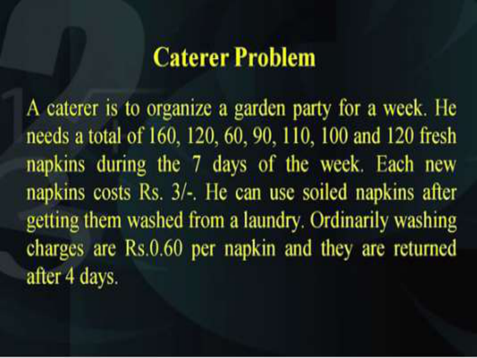

The last example of this lecture is the caterer problem, this problem occurs in a number of situations where in hotel management a caterer has to provide fresh napkins to his customer. So, let us look at the problem; the problem says that a caterer has to organize a garden party for a week and for each of the 7 days of the week, he knows the amount of napkins that he has to provide to his customers. So, he needs a total of 160, 120, 80, 90, 110, 100 and 120 fresh napkins during all the 7 days of the week. Each new napkin costs same rupees 3. He can use the soiled napkins after getting them washed from a laundry. Ordinarily washing charges are 0.60 per napkin and they are returned after 4 days. 

**(Refer Slide Time: 28:55)** 

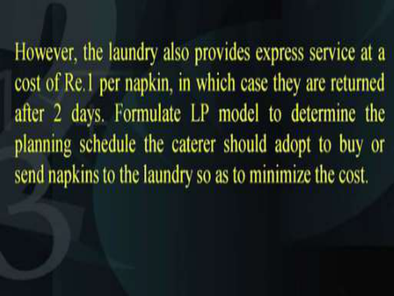

However, the laundry also provides an express service at a cost of rupees 1 per napkin and in which case they are returned after two days. So, there are two ways of getting the soiled napkins cleaned, either in the ordinary way that is it will cost him 60 paisa and it will be 

returned after four days and the second way is to get a express service where the cost will be rupees 1 per napkin and it will be returned after two days. 

Now, we are required to formulate this problem as an LP problem in order to determine the planning schedule of the caterer, so that he should adopt to buy or sell and send the napkins to the laundry, so as to minimize the cost. 

**(Refer Slide Time: 29:58)** 

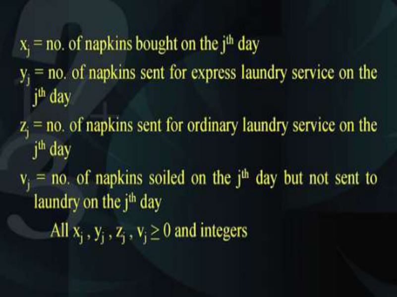

So as before the first step is the identification of the decision variables; xj is the number of napkins bought on the jth day, so there are x1, x2, x3, x4, x5, x6 and x7, so these are seven parameters corresponding to each of the seven days of the week also. We have yj is defined as the number of napkins sent for express laundry services on the jth day and similarly we have zj = the number of napkins sent for ordinary laundry services on the jth day. Also we have vj as the number of napkins soiled on the jth day but not sent to laundry on the jth day. **(Refer Slide Time: 31:00)** 

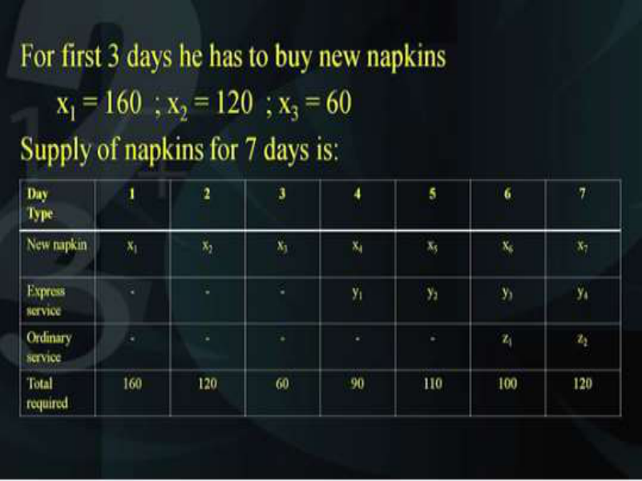

So, we have seven xi’s, seven yi’s and seven zi’s and of course you do not know how many of them will be vi’s, all these decision parameters that is xi’s, yi’s, zi’s and vi’s, they should be > 0 and they should be integers. Now, let us look at what happens during each of the days so, for the first three days he has to buy new napkins because no napkins are available. Therefore for the first 3 days he has to buy new napkins. Therefore, x1 = 160, x2 = 120 and x3 = 60, these are the number of napkins he has to buy. The supply of napkins for the seven days can be shown in the form of this table now, let us look at this table what it means, for each of the seven days this data shows how many napkins are available to him, how many napkins he has to send to the ordinary way of the laundry and how many napkins he has to send to the express laundry. And like this the last row also tells us the total that is his requirement; the total requirement, so this table depicts the entire situation of the napkins that he is going to send for laundry either the ordinary service or the express service. **(Refer Slide Time: 32:52)** 

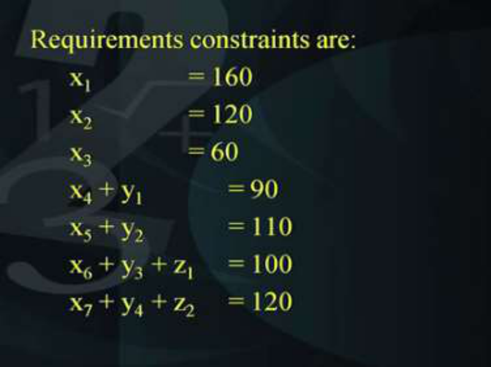

Therefore, the constraints can be modelled like this in terms of x1 = 160, x2 = 120, x3 = 60, x4 + y1 = 90 and so on. So, each of these constraint is coming from the this table that we have formulated over here which shows how many number of napkins have to be sent for the ordinary laundry service and how many napkins have to be sent for express service. So, these are all the 7 constraints for each of the 7 days. **(Refer Slide Time: 33:37)** 

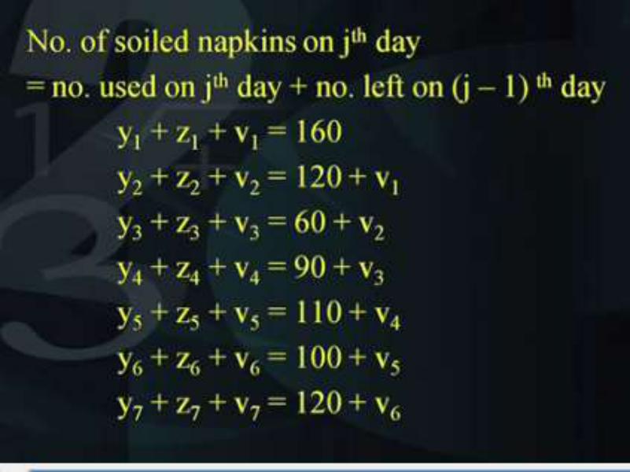

Now, the number of dirty napkins on the jth day = the number of used napkins on the jth day + the number of napkins left on the (j–1)th day, so therefore we can write the corresponding constraints for each of the 7 days as follows that is y1 + z1 + v1 = 160, y2 + z2 + v2 = 120 + v1, y3 + z3 + v3 = 60 + v2, y4 + z4 + v4 = 90 + v3, y5 + z5 + v5 = 110 + v4, y6 + z6 + v6 = 100 + v5, y7 + z7 + v7 = 120 + v6. 

**(Refer Slide Time: 35:03)** 

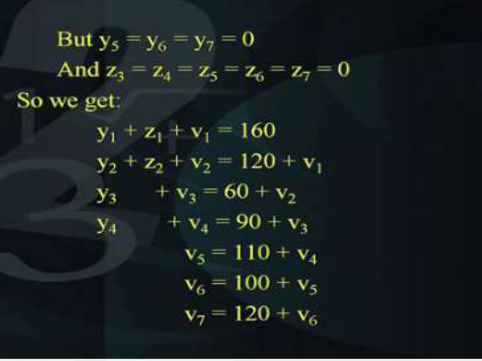

So, these are the constraints corresponding to each of the 7 days of the week but we find that some of the y's are 0’s and some of the z's are 0, so therefore if you substitute these conditions back into those previous equations finally we get this set of equations, so you can please check this how we can substitute the values of these y's and these z's which are 0 back into the equation on the previous slide. So, here you have to substitute those values of y’s and z's as 0’s and now you get this system of equations as the equality constraints of the linear programming problem. 

**(Refer Slide Time: 35:49)** 

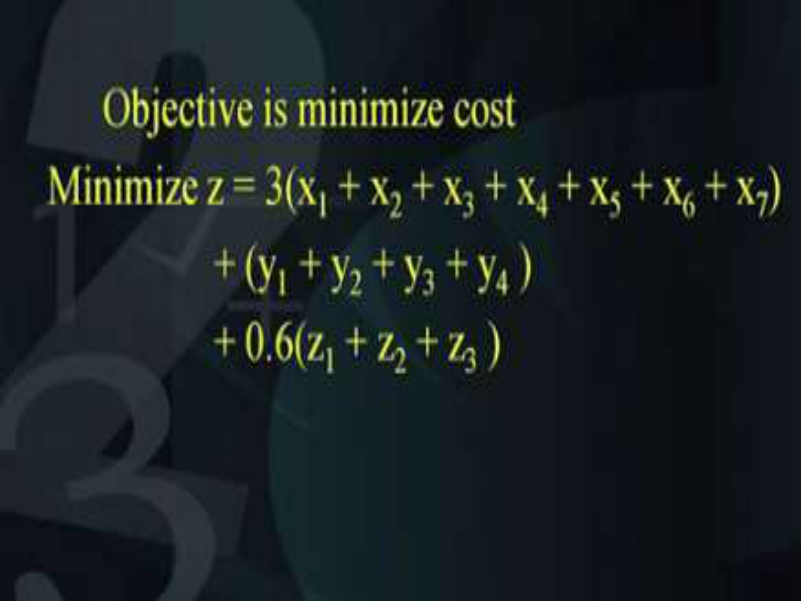

And what about the objective function; now the objective function is to minimize this expression z = 3(x1 + x2 + x3 + x4 + x5 + x6 + x7) + (y1 + y2 + y3 + y4 ) + 0.6(z1 + z2 + z3 ). Now, you can very well judge how this expression has come. This expression has come from the data that is given into the problem that is the cost of the napkins. The first part of this 

expression where we are multiplying x1, x2 etc., by 3 is because the cost of the napkin is 3 rupees. So, each of the x1, x2 etc., has to be multiplied by 3. Next comes y1, y2 this has to be multiplied by 1 because the cost of the express service is 1. Similarly, the cost of the ordinary service of laundry is 60 paisa, therefore it has to be multiplied by 0.6. So that completes this lecture and now I would like to give you an exercise for you to solve and for you to write the linear programming model corresponding to this problem. 

**(Refer Slide Time: 37:22)** 

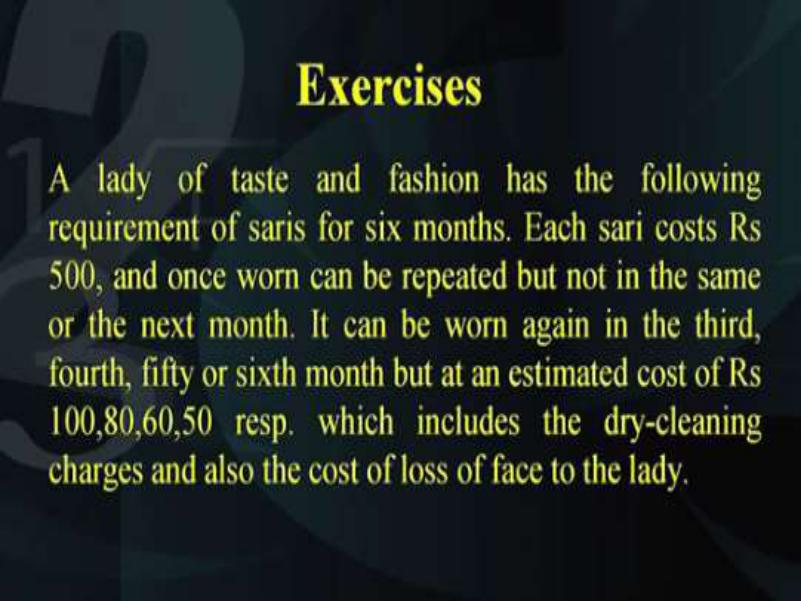

The problem is as follows; a lady of taste and fashion has the following requirement of saris for 6 months. Each sari costs rupees 500 and once worn can be repeated but not in the same or in the next month. It can be worn again in the third, fourth, fifth and sixth month but at an estimated cost of rupees 100, 80, 60 and 50 respectively which includes the dry-cleaning charges and also the cost of the loss of face to the lady. **(Refer Slide Time: 38:15)** 

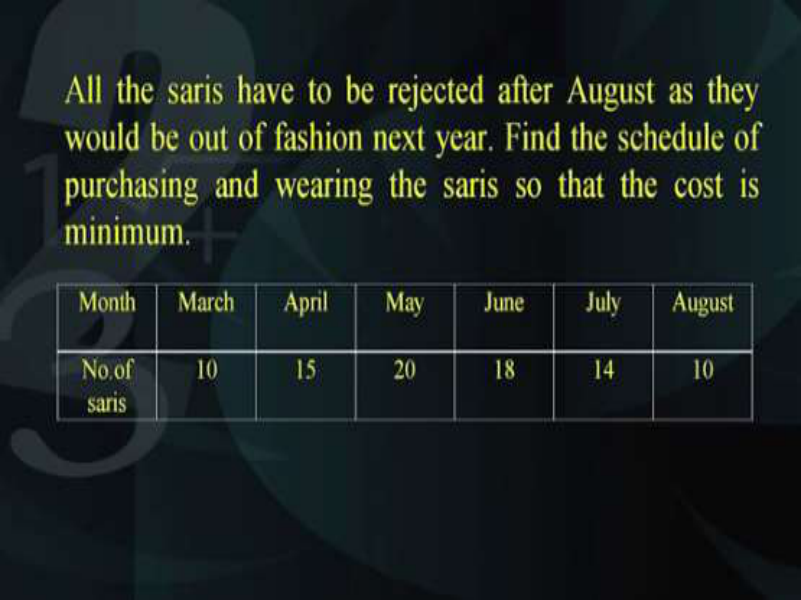

All the saris have to be rejected after August as they would be out of fashion next year. Find the schedule of purchasing and washing the saris, so that the cost is minimum. So this table is given to you as the data and you are required to model this problem as a linear programming problem. Let me repeat; you have to write down the 3 steps of the problem that is you have to write down the decision variables, you have to identify the objective function, you have to identify the constraints. And you have also to identify what are the conditions that you have to impose on the decision parameters. 

So wish you all the best and do keep in touch, thank you. 

