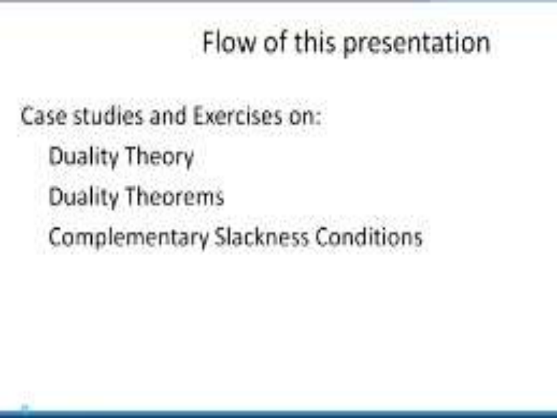
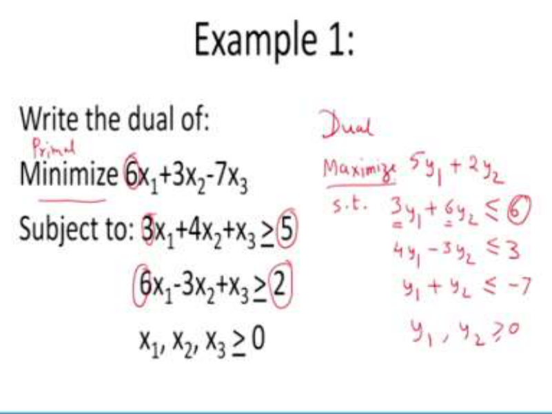
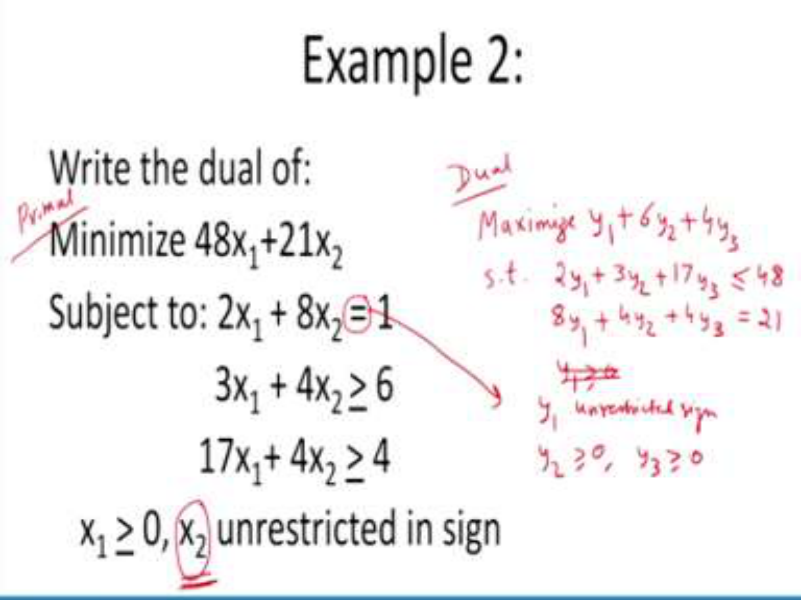
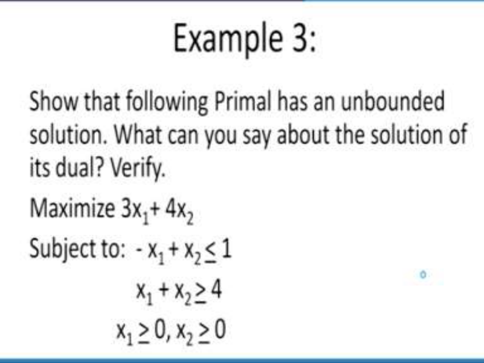
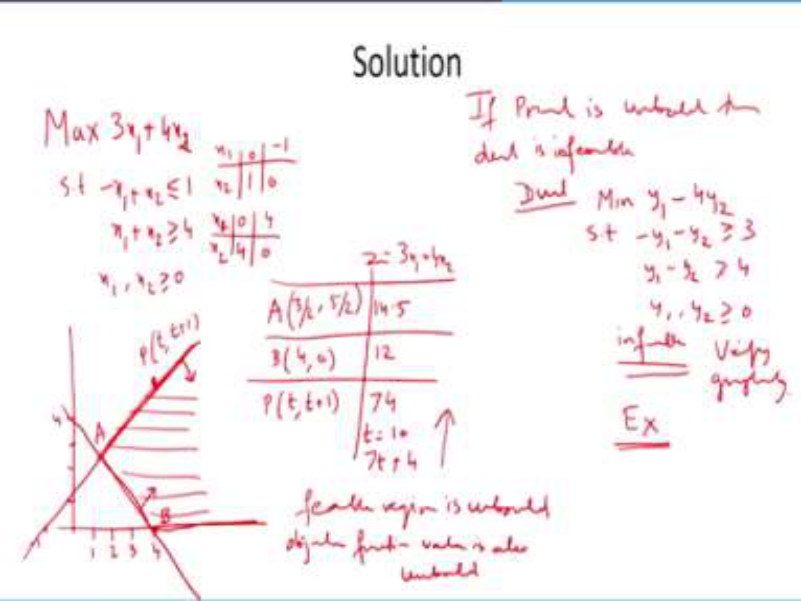
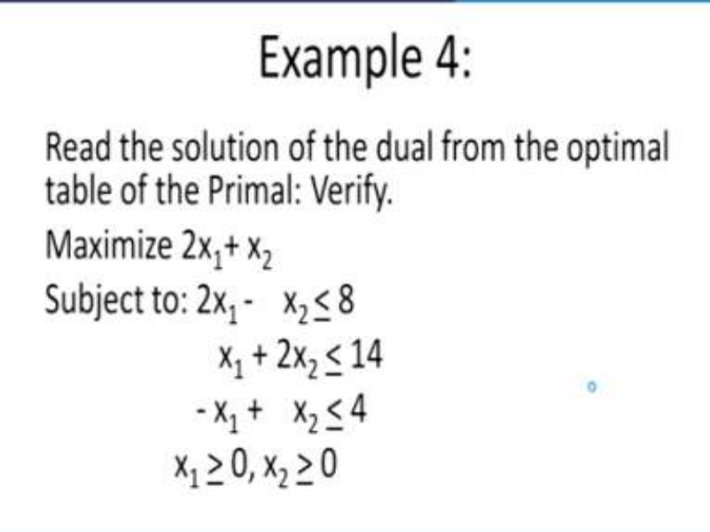
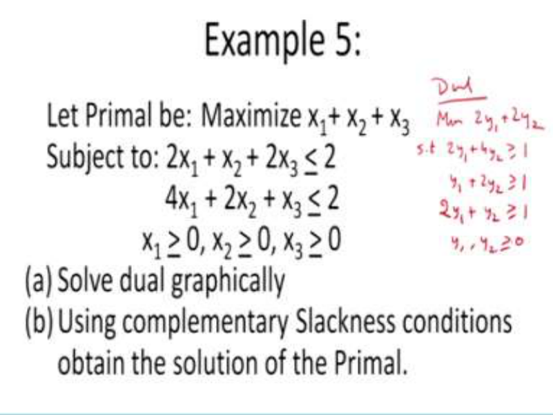
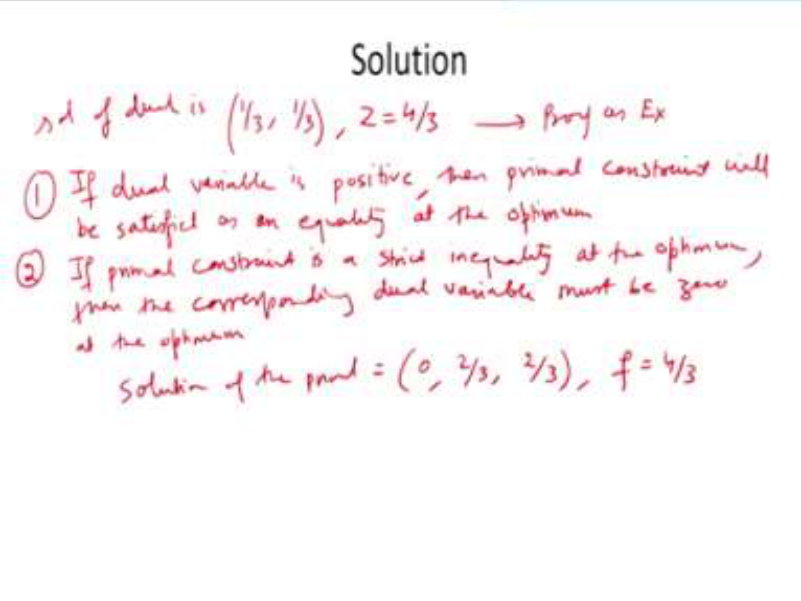

# **Operations Research Prof. Kusum Deep Department of Mathematics Indian Institute of Technology - Roorkee** 

**Lecture – 22 Case Studies and Exercises - I** 

**(Refer Slide Time: 00:35)** 

Good morning students, in today's lecture, we will study some case studies and exercises, we will cover the duality theory, the duality theorems and the complementary slackness conditions. So, let us get started. 

**(Refer Slide Time: 00:47)** 

The first example that we are going to consider is; we want to write the dual of the following problem; minimize 6x1+3x2-7x3 subject to 3x1+4x2+x3 > 5, 6x1-3x2+x3 > 2 and all the variables 

x1, x2, x3 <u>> 0. Now, in such type of problems you have to make sure whether the primal is in the</u> standard form of the primal. So, recall what are the two standard forms of the primal? Either, the primal should have minimization of the objective function and the constraints should be of the <u>></u> type or the primal should be maximization of the objective function and <u><</u> constraints. Now, in this example we have the primal of the type minimization with <u>></u> constraints and also you recall that the number of the dual variables = the number of the constraints of the primal. 

Therefore, if we call this as the primal then the corresponding dual can be written as follows; now how many variables will be there in the dual? There will be two variables in the dual and objective function will be maximize 5y1 + 2y2. Why did we get 5? 5 come from the right hand side of the primal and similarly, 2 comes from the right hand side of the second constraint of the primal. 

Now, we need to write the constraints, the constraints are 3y1 + 6y2 <u>< 6. How did this come?</u> This 3 corresponds to first constraint of primal and this 6 corresponds to second constraint of primal and the right hand side is nothing but the cost coefficient of the first variable of the primal. Similarly, we will write the second constraint that is 4y1 - 3y2 <u><</u> 3 and the third constraint will be y1 + y2 <u>< -7. Now, do not worry about their negative right hand side. Because</u> as far as the writing the dual is concerned, you need not worry. If the right hand side is negative, only when you are going to solve it then you need to make sure that the right hand side should be > 0. Now, the variables y1 and y2 both > 0. Now, you know that the number of variables of the dual = the number of constraints of the primal and vice-versa, also the minimization of the primal will become the maximization of the dual. 

**(Refer Slide Time: 05:09)** 

Let us look at the second example, the characteristics of this example is that we have an equality sign in the first constraint and the second variable in the primal is unrestricted in sign therefore, how do we write the dual for this? If this is the primal, then the dual is as follows; minimization will become maximization and as you can see, there are three constraints, so, there will be three dual variables; y1, y2 and y3. 

So, what will be the objective of dual? It will be maximization of y1 + 6y2 + 4y3 as you can see that these coefficients have come from the right hand side of the constraints of the primal. Then, we will have the constraints as follows; 2y1 + 3y2 + 17y3 <u>< 48, you can see the transpose of the</u> matrix has been taken and the right hand side is now the cost coefficient of the primal and the second constraint becomes 8y1 + 4y2 + 4y3, this should be = 21. 

Now, why is this an equality? The reason is that the second constraint of the primal is unrestricted in sign; also, y1 should be unrestricted in sign, why is that so? Because the first constraint of the primal is an equality and y2 should be > 0 and y3 should be > 0, so that is it. So, we have the dual in terms of three variables. 

So, remember that if you have an equality constraint in the primal that corresponds to an unrestricted variable in the dual and similarly, if there is an unrestricted variable in the primal, it corresponds to an equality constraint in the dual. 

**(Refer Slide Time: 08:08)** 

So, now let us look at the third example; in this example, we are required to show that the following primal LPP has an unbounded solution and also the question says, what can you say about the solution of its dual using some of the theorems that you have learnt in this section also, we are required to verify the results. So, as you can see that this problem is a two variable problem and we can easily solve it to show that this is an unbounded solution. 

**(Refer Slide Time: 08:56)** 

So, let us go about it how to solve it so, first of all we will write 3x1 + 4x2 subject to - x1 + x2 < 1, x1 + x2 > 4 and both the variables are > 0. So, for solving it graphically, we need 2 points; it passes through (0, 1) and (–1, 0) and similarly, the second constraint it has the 2 points; (0, 4) and (4, 0). So, let us plot this problem, it should pass through (0, 1) and (-1, 0), so this is the first constraint. 

And as you know that since it is less than so, the feasible region is below the line. Similarly, the second constraint passes through (0, 4) and (4, 0) and the feasible region is above the line because it is > 4 therefore, what is the feasible region? The feasible region is shown by shaded region, this is the feasible region and let us now try to find out the coordinates, so the coordinates are as follows; A; A is this point and its coordinates are given by (3/2, 5/ 2). And the objective function value is 14.5 at A. Similarly, B is the point (4, 0), this is the point B so, the objective function value is 12. Also, if you take any point P on this line, it will be having coordinates t and t + 1. So, the point P which is a generalized point on this line segment will have objective function value as let us say 74, if you take t = 10(let us say) because it will be of the type 7t + 4. 

This tells us that the problem has an unbounded solution, the feasible region is also unbounded and objective function value is also unbounded. Now, recall the theorems that we had learned, if we write the dual what should be the solution of the dual; the solution of the dual should be infeasible. Remember the theorem; if primal is unbounded, then dual is infeasible, so based on this result, we can directly write that the solution of the dual is infeasible. 

Let us write a dual of this problem, what is the dual? The dual of the problem P is minimize y1 - 4y2 subject to -y1 - y2 <u>> 3, y1 - y2 > 4 and y1 and y2 should be > 0. Now, you can easily check</u> that the solution of this problem is infeasible, so you can verify it graphically or otherwise and I can leave this as an exercise for you to verify that this problem has a infeasible solution. 

**(Refer Slide Time: 14:30)** 

Next, let us look at the next example which says that read the solution of the dual from the optimum table of the primal and verify your results. Now, you remember that in this lecture, we had written the initial table, the intermediate tables and the final table and there we found how we can read the solution of the dual from the optimum solution of the primal. So, let us look at this problem. 

We have to find out first the optimum table, maximize 2x1+ x2 subject to 2x1 -    x2 < 8,  x1 + 2x2 <u>< 14, - x1 +    x2 < 4 and both x1 > 0, x2 > 0. Now, although it is a two variable problem, we</u> can solve it graphically but since we want to find out the solution of the dual from the optimum table of the primal therefore, we need to solve it using the simplex procedure. 

**(Refer Slide Time: 15:54)** 

So, let us see how we will solve it, so first of all we have the problem as follows; maximize 2x1+ x2 subject to 2x1 - x2 < 8, x1 + 2x2 <u>< 14,   - x1 + x2 < 4, x1 and x2 are both > 0. So, in order</u> to solve this, we need to convert all the inequalities into a equality, so we will write 2 x1 - x2 + x3 = 8. Second constraint we will write as x1 + 2 x2 + x4 = 14. And the third constraint will be - x1 + x2 + x5 = 4 and all of the xi’s should be <u>> 0, for i = 1, 2 up to 5. Now, let us write the</u> calculations in the form of the table, so as you know first of all we will write the basis; the basis is x3, x4 and x5 and the variables are x1, x2, x3, x4, x5 and the right hand side, so the data inside is 2, 1, 1, -1, 2, 1, 1, 0, 0, 0, 1, 0, 0, 0, 1 and the right hand side is 8, 14 and 4; the coefficients of the objective function are 2, 1, 0 and 0. 

Of course, the coefficients of the objective function has to be rewritten here and as you can see that the according to the deviation entry, this 2 is the pivot. Therefore, the new basis will 

become x1, x4 and x5 and the entries will become 1, 0, 0, - 1/2, 5/2 and 1/2, 1/2, -1/2, 1/2, 0, 1, 0, 0, 0, 1 and the right hand side will be 4, 10 and 8. Then the deviation entry will be 0, 2, -1, 0 and 0 and therefore, the new basis will become x1, x2 and x5, here the entries will be 1, 0, 0, 0, 1, 0, 2/5, - 1/5, 3/5, 1/5, 2/5, -1/5, 0, 0, 1 and the right hand side will be 6, 4 and 6 and the deviation entries by the way I forgot to write this; 2, 0, 0 and here it will be 2, 1, 0, so the deviation entries will be 0, 0, -3/4, -4/5 and 0 also, the objective function value is 18. 

And as you can see that this is the optimum, this is the optimum table now, coming to the requirement of the question, we need to find out the solution of the dual reading it from the optimum table. So, how do we find it? Actually, there are two ways of doing it, what is the first method? First method is look at this basis of the initial table 1 0 0; 0 1 0; 0 0 1 and its corresponding matrix in the optimum table, right. So, this is nothing but this has to be multiplied by this vector, so 2, 1, 0 multiplied by this matrix 2/5, -1/5, 3/5, 1/5, 2/5 and -1/ 5 and 0, 0, 1. Now, if you multiply this, what will you get; you will get 3/5, 4/5 and 0. Now, this is the first way of getting the solution of the dual. Second method is you just look at the deviation entries over here sorry, this would be 5, if you look at the deviation entries over here, take its negative, negative of the deviation entries corresponding to the inverse matrix starting from the initial table. 

So, therefore here again, what do we find? We find that the solution is y1 = 3/5, y2 = 4/5 and y3 = 0, solution of the dual so, I hope everybody has understood the relationship between the solution of the primal and the solution of the dual. 

**(Refer Slide Time: 23:39)** 

So, the next question is; we want to find out if the primal is given to be maximize x1+ x2 + x3 subject to 2x1 + x2 + 2x3 <u>< 2, 4x1 + 2x2 + x3 < 2, x1 > 0, x2 > 0, x3 > 0. First we need to write its</u> dual and as you can see very well that the dual will be a two variable problem also, we need to solve the dual graphically, this is the A part of the question and the second part of the question says using the complementary slackness conditions, we need to obtain the solution of the primal. 

Now, as you can see that is the dual of this problem will be minimization of 2y1 + 2y2 subject to 2y1 + 4y2 <u>> 1, y1 + 2y2 > 1 and the third constraint will be 2y1 + y2 > 1, y1 and y2 should be both > 0, so this is the dual and as you can see it is a two variable problem, so therefore we can solve</u> graphically. 

# **(Refer Slide Time: 25:30)** 

So, what is the solution of this problem? So, solution as I will leave it as an exercise, solution of the dual is (1/3, 1/3) and the objective function value is 4/3, you can do it as an exercise, I am leaving the proof as exercise because you are now quite comfortable in obtaining the solution graphically. 

Now, what are the two complementary conditions that we will make use over here? 

So, let us try to look at the two complementary conditions, we will use the following 2 condition, number 1; if the dual variable is positive, then the primal constraint will be satisfied as equality at the optimum, this is the first complementary slackness condition that will be using. Second condition that we will be using is; if the primal constraint is strict inequality that means, there is no is equal to, at the optimum. Then, the corresponding dual variable must be 0 at the optimum and using these two conditions, we can easily see that the solution of the primal 

is (0, 2/3, 2/3) and f = 4/3, so this is another way in which you can use the complementary slackness conditions to obtain the solution of the primal from the solution of the dual. So, with this we come to an end of this lecture where we had studied some case studies and examples based on the duality theory and the duality theorems and the complementary slackness conditions. Thank you. 

