# **Operations Research Prof. Kusum Deep Department of Mathematics Indian Institute of Technology - Roorkee** 

**Lecture – 24 Integer Programming** 

**(Refer Slide Time: 00:33)** 

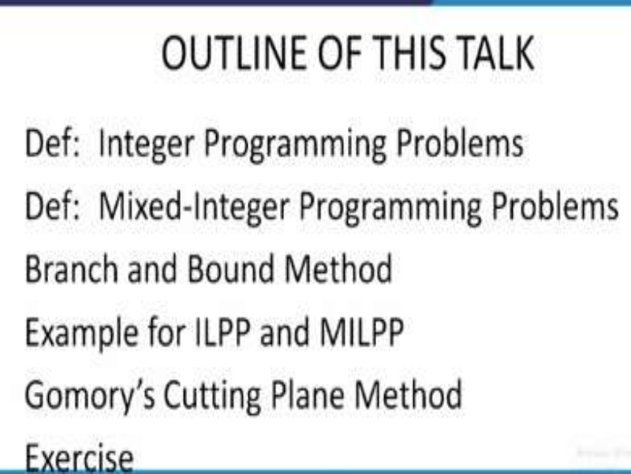

<mark>Good morning students, this is lecture number 24, its title is integer programming. The outline of this lecture is as follows; first, we will define, what is an integer programming problem and a mixed integer programming problem, then we will learn two methods; one is the branch and bound method and the second is the Gomory's cutting plane method, this we will illustrate with the help of examples and finally some exercise.</mark> 

**(Refer Slide Time: 01:02)** 

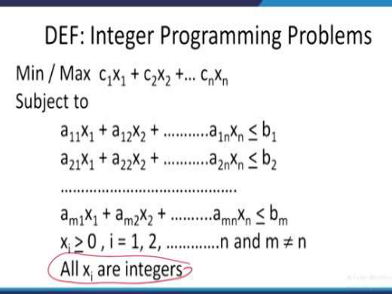

<mark>So, let us begin, first of all let us define an integer programming problem, as you know that a linear programming problem has already been defined in the previous lectures, the only difference in the general linear programming problem and the integer programming problem is that in the case of integer programming problems, the decision variables should be restricted to be integers.</mark> 

<mark>So, in the last line here, this is the definition of integer programming problem, in the last line here I have written that all x</mark> i <mark>'s should be integers, so that is the most important thing that has to be noted in this particular definition.</mark> 

**(Refer Slide Time: 01:54)** 

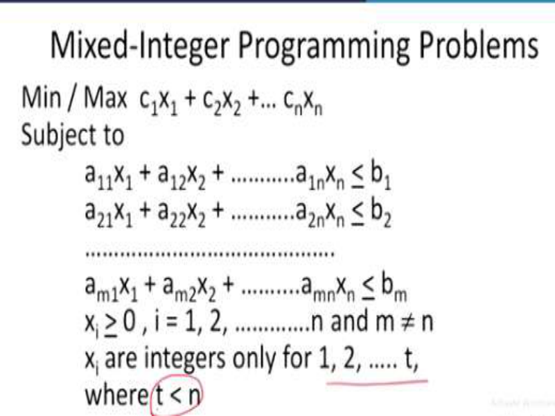

<mark>Now, coming to the mixed integer programming problem, this means that there is a linear programming problem which has a let us say n number of variables and out of those n variables, let us say t of them are integers and the remaining ones are non-integers. So, here you can see x</mark> i <mark>’s are integers only for i = 1, 2 up to t where t < n and the remaining ones are not necessarily integers.</mark> 

<mark>Of course, the order of the variables can be changed for example, there is a situation where let us say, variable number 1 and variable number 5, they are integers and the remaining ones let us say 2, 3, 4, they are not integers, so that reordering of the variables is possible.</mark> 

**(Refer Slide Time: 02:52)** 

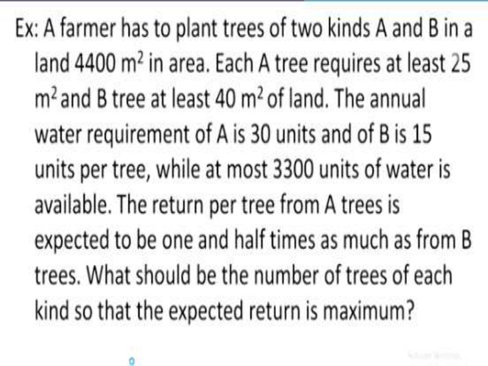

<mark>Now, let us take a simple example to illustrate the two methods that we are going to study in this lecture. The first one is that a farmer has to plant trees of two kinds A and B in a land 4400 meters square in area. Each A tree requires at least 25 meter square and B tree requires at least 40 meter squares of land. The annual water requirement of A is 30 units and of B is 50 units per tree, while at most 3300 units of water is available. The return per tree from A tree is expected to be 1 and 1/2 times as much as from B trees, what should be the number of trees of each kind, so that the expected return is maximized?</mark> 

**(Refer Slide Time: 03:56)** 

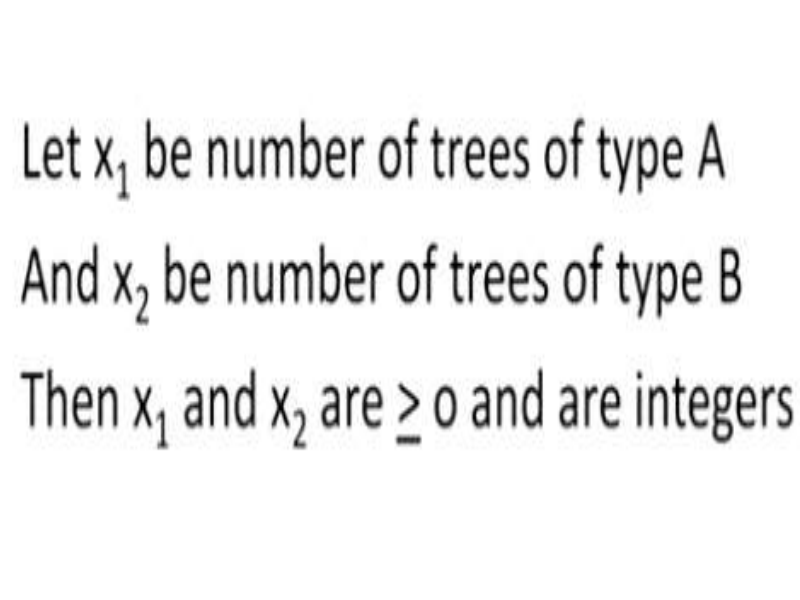

<mark>Now, let us model this as follows; let x</mark> 1 <mark>be the number of trees of the type A and similarly, x</mark> 2 <mark>be the number of trees of the type B obviously, it is common sense to understand that x</mark> 1 <mark>and x</mark> 2 <mark>should be > 0 and they should be integers because you cannot grow let us say 2.5 trees, you can either grow 2 trees or you can grow 5 trees or 3 trees.</mark> 

**(Refer Slide Time: 04:25)** 

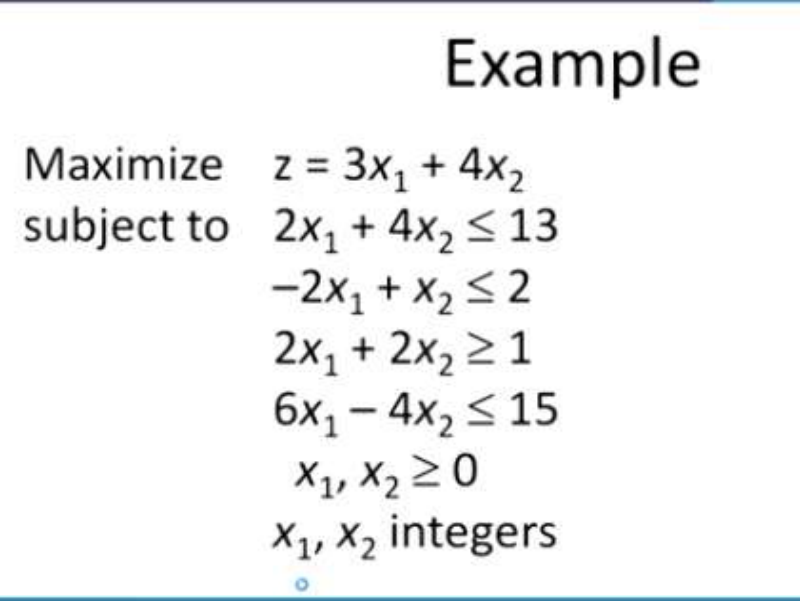

<mark>So, this once we have understood the significance of integer programming problems now, let us take a simple mathematical example where we have a two variable problem which says that maximize; z = 3</mark> _<mark>x</mark>_ 1 <mark>+ 4</mark> _<mark>x</mark>_ 2 <mark>subject to 2</mark> _<mark>x</mark>_ 1 <mark>+ 4</mark> _<mark>x</mark>_ 2 <mark> 13, –2</mark> _<mark>x</mark>_ 1 <mark>+</mark> _<mark>x</mark>_ 2 <mark> 2, 2</mark> _<mark>x</mark>_ 1 <mark>+ 2</mark> _<mark>x</mark>_ 2 <mark> 1, 6</mark> _<mark>x</mark>_ 1 <mark>– 4</mark> _<mark>x</mark>_ 2 <mark> 15, x</mark> 1 <mark>and x</mark> 2 <mark>are > 0 and x</mark> 1 <mark>and x</mark> 2 <mark>are integers.</mark> 

**(Refer Slide Time: 05:14)** 

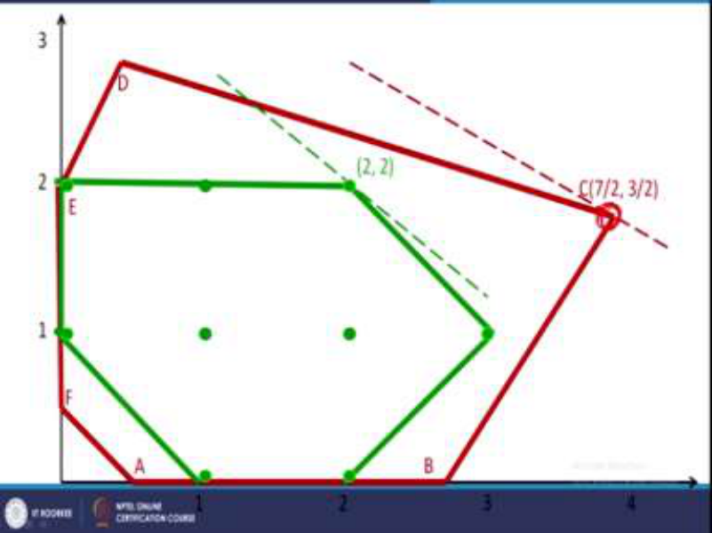

<mark>Now, we can use the graphical method to see what the feasible domain looks like, so here on the horizontal axis we have the x-axis and on the second axis, the vertical axis, we have the second variable. Now, if you just consider that x</mark> 1 <mark>and x</mark> 2 <mark>are not integers, I mean if they are real numbers, then the solution lies on this point indicated over here, the point number C.</mark> **(Refer Slide Time: 06:01)** 

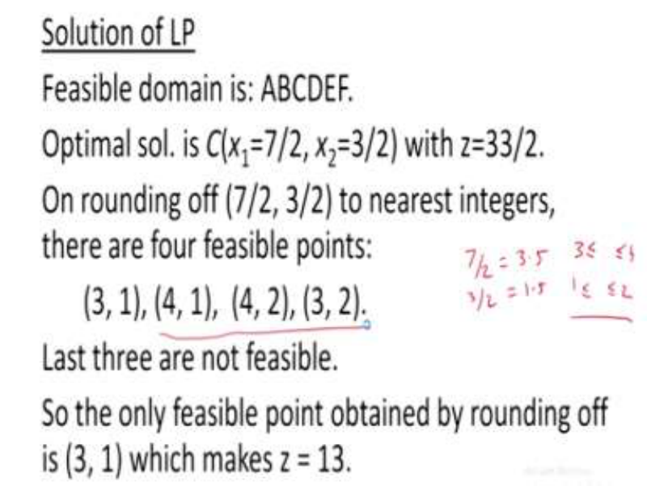

<mark>But in our problem, it is given that x</mark> 1 <mark>and x</mark> 2 <mark>should be integers, so in the next slide I have written the solution of an LP, if you consider that x</mark> 1 <mark>and x</mark> 2 <mark>are not integers just as an ordinary LP and in this case, the feasible domain is ABCDEF as is indicated over here; ABCDEF, this is our feasible region and the optimum solution is at the point C given by (7/2, 3/2) and the objective function value is 33/2.</mark> 

<mark>Now, suppose we do the rounding off that is we round off 7/2 and 3/2 to the nearest integer, then we have the following four feasible points; they are (3, 1); (4, 1); (4, 2) and (3, 2), because 7/2 is 3.5 and 3/2 is 1.5, so we will look at 3.5; 3.5 lies between 3 and 4 and similarly, 1.5 lies between 1 and 2. So, based on this, we can look at the four feasible points as (3, 1); (4, 1); (4, 2) and (3, 2) as the feasible points.</mark> 

<mark>But what do you find; you find that the last 3 of them are not feasible; (4, 1); (4, 2) and (3, 2), they are not feasible because they are going out of the feasible region it can be seen over here in this diagram. So, the only feasible solution obtained by rounding off is (3, 1) and which makes the objective function value Z = 13, so this is the only solution that is remaining.</mark> 

**(Refer Slide Time: 08:03)** 

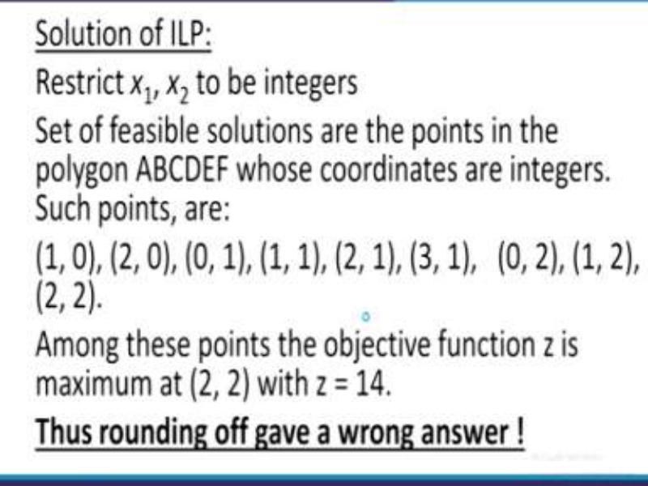

<mark>Now, let us look at the solution of the integer linear programming, the same problem if you impose that x</mark> 1 <mark>and x</mark> 2 <mark>should be integers. In this case, the set of feasible solutions are the points in the polygon ABCDEF whose coordinates are integers that is the discrete points, so these are all discrete points and if you look at the feasible region diagram, these are the points that are the; the ones that are shown in the green dots, these are the discrete points in the feasible region which satisfy the integer requirements of our integer linear programming problem.</mark> 

<mark>So, this means that we have these points and among these points, the objective function values Z is maximum at the point (2, 2) where Z = 14 so, this means the true solution to the integer programming problem gives us the solution at (2, 2) with the objective function value 14 and the rounding off gave us the solution at (3, 1) which is Z = 13. So, this means that the process of rounding off has given us a wrong answer.</mark> 

**(Refer Slide Time: 09:33)** 

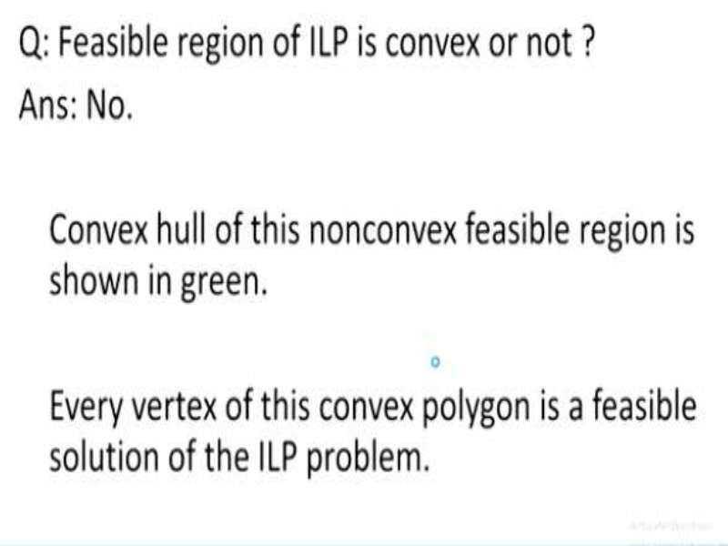

<mark>This is the reason why we need to devise methods to solve an integer programming problem. Now, the question is;  the feasible region of an integer linear programming convex or not and the answer is no because the convex hull of this non convex feasible region is shown in green, every vertex of this convex polygon is a feasible solution of the integer linear programming problem.</mark> 

<mark>Remember the definition of a convex set is that the convex linear combination of all points should also belong to the set, then only it is said to be a convex set but since it is a discrete set of points therefore, it does not satisfy the definition of a convex sets and hence the feasible region of an integer linear programming problem is not convex.</mark> 

**(Refer Slide Time: 10:19)** 

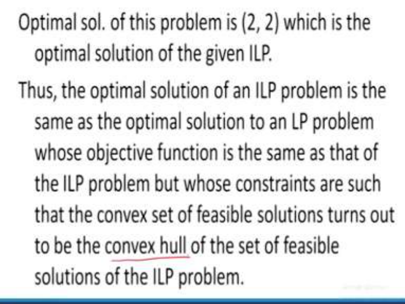

<mark>The optimal solution of this problem is (2, 2) which is optimum solution of the given integer linear programming problem, thus the optimum solution of an integer linear programming problem is the same as the optimum solution of the linear programming problem whose objective function is the same as that of the integer linear programming problem but whose constraints are such that the convex set of feasible solution turns out to be the convex hull of the set of the feasible solutions of the integer linear programming problem.</mark> 

**(Refer Slide Time: 11:02)** 

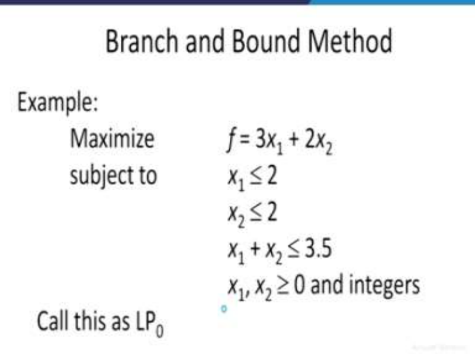

<mark>So, let us look at the first method, it is called the branch and bound method, so we will take a two variable problem; maximize 3</mark> _<mark>x</mark>_ 1 <mark>+ 2</mark> _<mark>x</mark>_ 2 <mark>subject to</mark> _<mark>x</mark>_ 1 <mark> 2,</mark> _<mark>x</mark>_ 2 <mark> 2 and</mark> _<mark>x</mark>_ 1 <mark>+</mark> _<mark>x</mark>_ 2 <mark> 3.5, x</mark> 1 <mark>and x</mark> 2 <mark>are integers and both > 0. Let us call this linear programming problem as LP</mark> 0 <mark>.</mark> 

**(Refer Slide Time: 11:34)** 

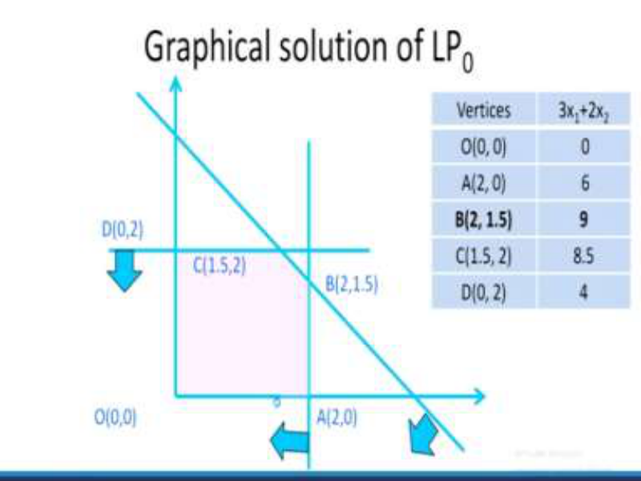

<mark>Let us try to look at what the feasible region looks like so, the graphical solution of the LP</mark> 0 <mark>is shown here in this figure and you can see that the feasible region is indicated in the pink region, the vertices of this region are shown here in this table and you find that the optimum solution is given at B which is given by (2, 1.5). Now, this we have just plotted thinking that there is no integer restriction. But since we find that the solution B given by (2, 1.5) is not an integer solution, 1.5 is not integer so therefore, we need to do something.</mark> **(Refer Slide Time: 12:28)** 

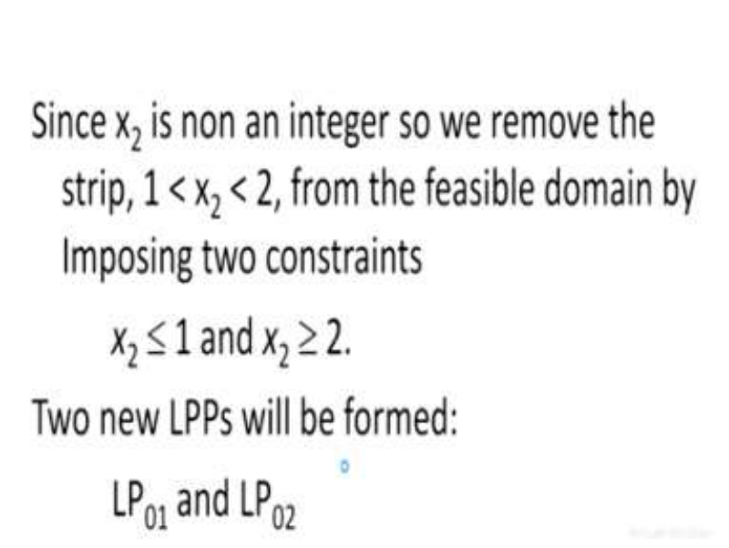

<mark>And what we will do is that we will impose this as a restriction, so since x</mark> 2 <mark>is not an integer, we remove the strip given by 1 is < x</mark> 2 <mark>is < 2, please note the strict inequality from the feasible</mark> 

<mark>region by imposing two constraints that is x</mark> 2 <u><mark><</mark></u> <mark>1 and x</mark> 2 <u><mark>></mark></u> <mark>2 ; therefore, since both these conditions cannot be imposed in the same LP, therefore we will impose these two conditions separately which will give rise to two different LP’s.</mark> 

**(Refer Slide Time: 13:14)** 

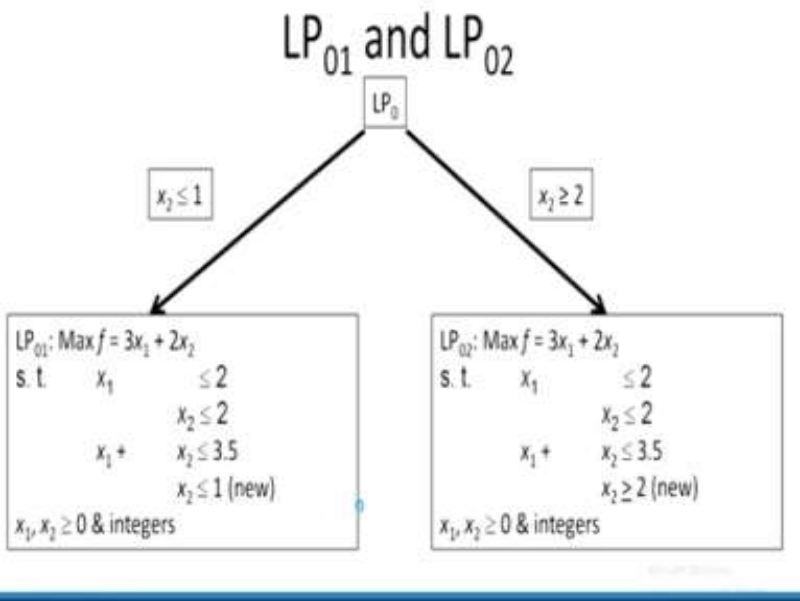

<mark>So, we have two new LP’s, we will call them as LP</mark> 01 <mark>and LP</mark> 02 <mark>, so LP</mark> 01 <mark>is obtained from LP</mark> 0 <mark>by imposing the constraint x2 < 1 which is shown on the left side and similarly, LP</mark> 02 <mark>is obtained from LP</mark> 0 <mark>by imposing the condition that x</mark> 2 <mark>should be > 2. So, now we have got 2 different LP’s.</mark> **(Refer Slide Time: 13:42)** 

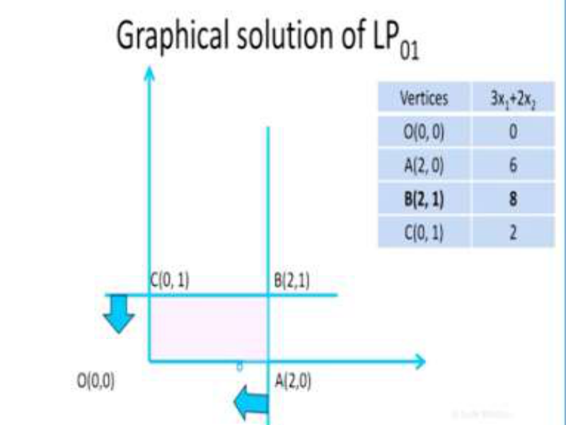

<mark>Let us now try to solve them so, the graphical solution of LP</mark> 01 <mark>looks like this as is shown here in this graph, apart from the original LP</mark> 0 <mark>constraints, we have an additional constraint and the</mark> 

<mark>solution to this LP</mark> 01 <mark>gives us the point B which is given by (2, 1) and fortunately (2, 1) is a integer solution, so we are very happy with this because this is what we were looking for.</mark> **(Refer Slide Time: 14:28)** 

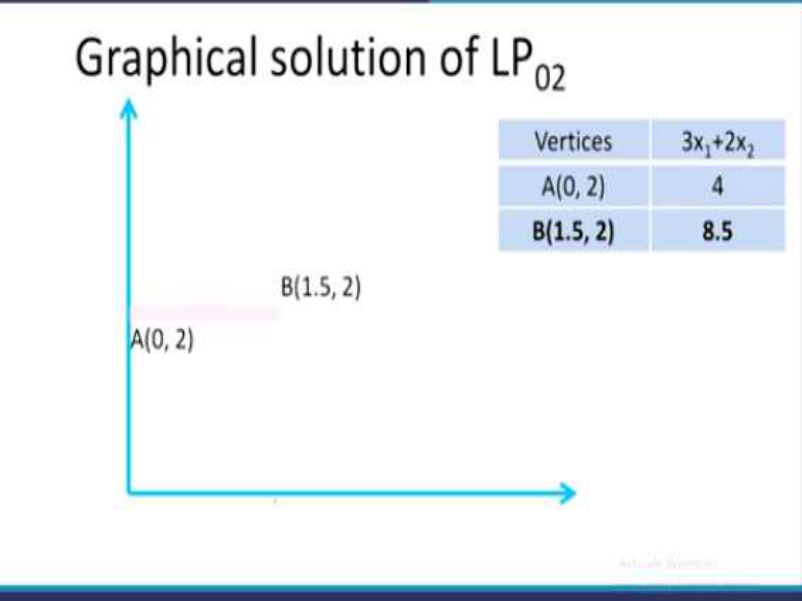

<mark>Now, coming to the other LP that is the LP</mark> 02 <mark>, we find that the feasible region is nothing but this line segment as is shown here in the diagram, so it is given by the line segment AB and the solution is B which is given by (1.5, 2); but again, we find that 1.5 is not integer.</mark> **(Refer Slide Time: 15:10)** 

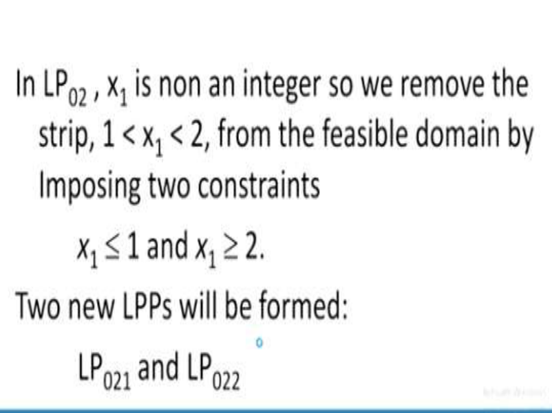

<mark>So, therefore we will repeat the same process what we had done for the LP</mark> 0, <mark>that is, we will remove a strip since x1 is non-integer, so we will remove this strip 1 < x</mark> 1 <mark>< 2 from the feasible</mark> 

<mark>region by imposing two constraints; x</mark> 1 <u><mark><</mark></u> <mark>1 and x</mark> 1 <u><mark>></mark></u> <mark>2 which again will give rise to two more LP’s and we will call them as LP</mark> 021 <mark>and LP</mark> 022 <mark>.</mark> 

**(Refer Slide Time: 15:40)** 

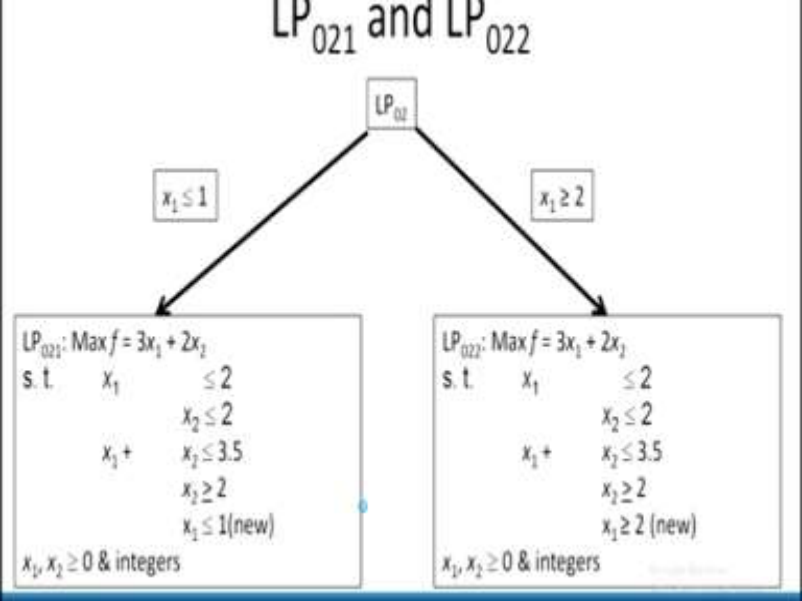

<mark>And this is what it looks like, LP</mark> 021 <mark>has the original constraints as well as the constraints of LP</mark> 02 <mark>as well as the additional constraint that x</mark> 1 <u><mark>< 1 and similarly, LP</mark></u> 022 <mark>has the additional constraint that x</mark> 1 <u><mark>> 2, apart from the original constraints.</mark></u> 

**(Refer Slide Time: 16:06)** 

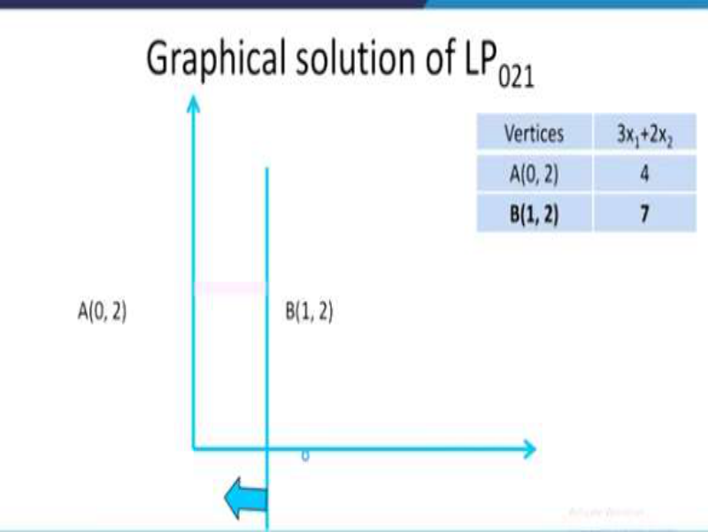

<mark>Now, coming to the solution of LP</mark> 021 <mark>, this is what the feasible region looks like that is it is the line segment as shown in the diagram and the solution to this problem is given by B(1, 2) and as you know that (1, 2) is a integer solution and this is what we were looking for.</mark> 

**(Refer Slide Time: 16:33)** 

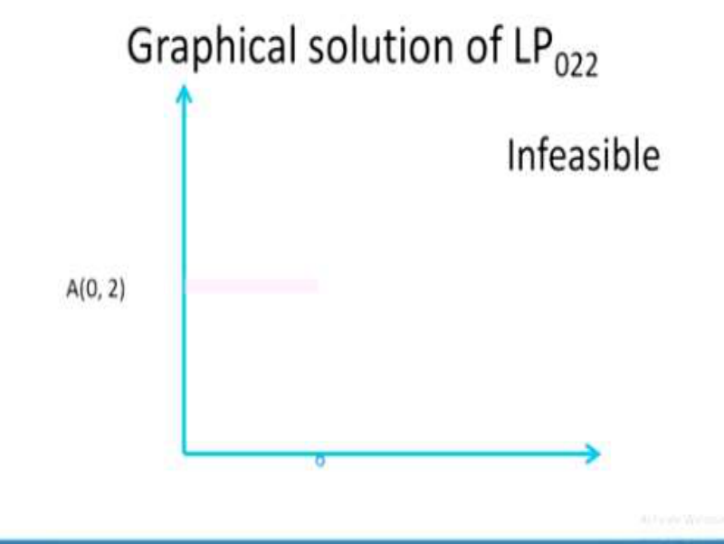

<mark>So, now we will look at the LP</mark> 022 <mark>and we find that this is an infeasible problem, the feasible region does not exist.</mark> 

**(Refer Slide Time: 16:46)** 

<mark>So, the entire thing we can represent in this diagram starting from LP</mark> 0 <mark>, we have written down the nodes and the constraints that were imposed to get the various LP’s and we find that the; the last node that is LP</mark> 022 <mark>is infeasible and the LP</mark> 021 <mark>is having the solution (1, 2) with objective function 7 and the LP</mark> 01 <mark>is having a solution (2, 1) and objective function is 8. Since it was a maximization problem therefore, the solution to the problem is LP</mark> 01 <mark>which is giving (2, 1) as the solution.</mark> **(Refer Slide Time: 17:38)** 

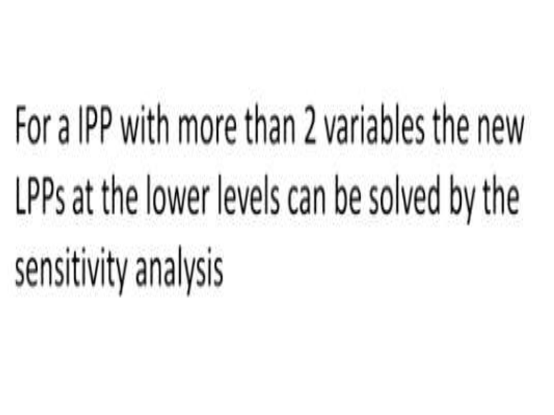

<mark>So, I hope everybody has followed how this procedure is to be implemented Now, coming to a LPP with more than two variables, the new LPP’s at the lower levels can be solved by using the procedure of the sensitivity analysis that is what happens if another additional constraint is added.</mark> 

**(Refer Slide Time: 18:03)** 

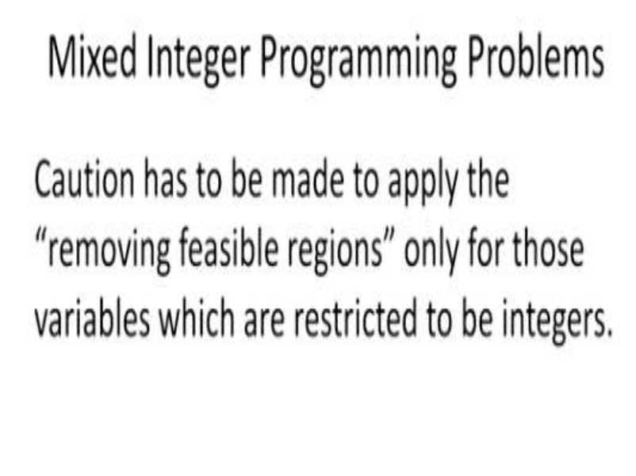

<mark>The mixed integer linear programming problems; caution has to be made to apply the removing feasible region strategy only for those variables which are restricted to be integers and not to the other ones.</mark> 

**(Refer Slide Time: 18:20)** 

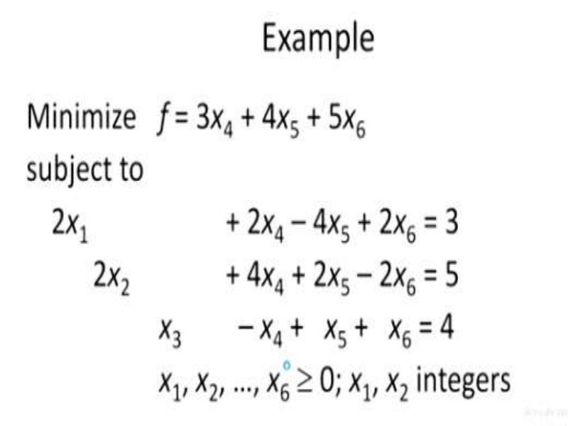

<mark>So, now let us take another example; minimize f given by 3</mark> _<mark>x</mark>_ 4 <mark>+ 4</mark> _<mark>x</mark>_ 5 <mark>+ 5</mark> _<mark>x</mark>_ 6 <mark>subject to these conditions.</mark> 

**(Refer Slide Time: 18:33)** 

<mark>Here, we have again the structure of the bifurcations of the new LP’s that we get and this is the solution shown in this diagram.</mark> 

**(Refer Slide Time: 18:47)** 

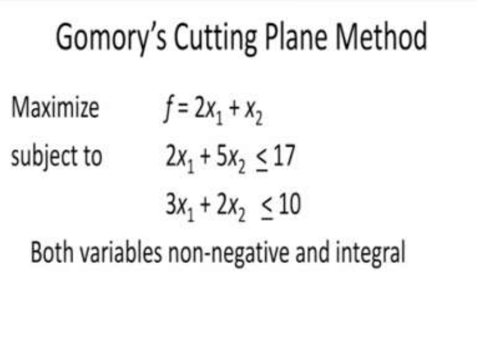

<mark>Now, the second method that we will study is called the Gomory's cutting plane method and let us take this example to understand it so, suppose we have to maximize 2</mark> _<mark>x</mark>_ 1 <mark>+</mark> _<mark>x</mark>_ 2 <mark>subject to 2</mark> _<mark>x</mark>_ 1 <mark>+ 5</mark> _<mark>x</mark>_ 2 <u><mark>< 17 and 3</mark></u> _<mark>x</mark>_ 1 <mark>+ 2</mark> _<mark>x</mark>_ 2 <u><mark>< 10, both variables are non-negative and integral.</mark></u> 

**(Refer Slide Time: 19:15)** 

<mark>Now, the optimum solution to this problem is shown here in this table ,you know how to solve it thinking that it is just non integral and the solution to the problem is given by x</mark> 1 <mark>= 10/3 and x</mark> 3 <mark>= 31/3 which is non-integral. Since we want integral solution therefore, we need to impose certain mechanism.</mark> 

**(Refer Slide Time: 19:43)** 

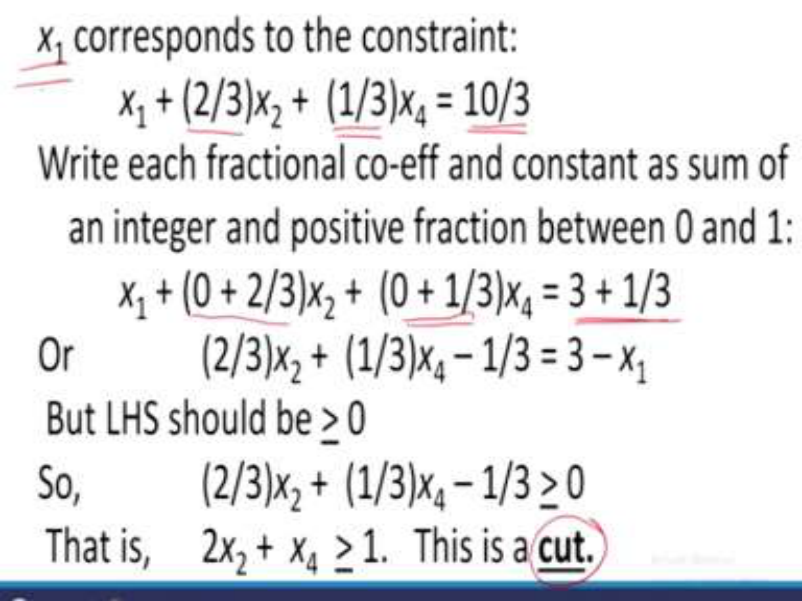

<mark>So, x</mark> 1 <mark>corresponds to the constraint</mark> _<mark>x</mark>_ 1 <mark>+ (2/3)</mark> _<mark>x</mark>_ 2 <mark>+  (1/3)</mark> _<mark>x</mark>_ 4 <mark>= 10/3 which is shown here in the table, here you are so,</mark> _<mark>x</mark>_ 1 <mark>+ (2/3)</mark> _<mark>x</mark>_ 2 <mark>+  (1/3)</mark> _<mark>x</mark>_ 4 <mark>= 10/3, we will split the each of the fractional coefficients and the constraints as sum of integer and positive fractions between 0 and 1 that is for example, 2/3; this 2/3 we can break into the integer part and the non-integer part, since it is < 1 already, so we have broken it into 0 + 2/3.</mark> 

<mark>Suppose, it was more than 1, then you separate out the integer part and remove out the nonintegral part both separately, so you have</mark> _<mark>x</mark>_ 1 <mark>+ (0 + 2/3)</mark> _<mark>x</mark>_ 2 <mark>and similarly 1/3; this 1/3 is broken into 0 + 1/3 and the same thing has to be done for the right hand side constant, 10/3 is broken into 3 + 1/3, so here this is > 1, 10/3 is > 1 so, you can separate out the integer part which is 3 and the non-integer part as 1/3 separately. Now, once you do this then, you can transform all the integer things on the right hand side, this x</mark> 1 <mark>goes to the right hand side and the right hand side becomes 3 - x</mark> 1 <mark>. So, once you have written this equation in this fashion where on the left hand side, we have the non-integral parts and on the right hand side we have the integral parts but the left hand side should be > 0. LP are supposed to be >0.</mark> 

<mark>So, if you put this left hand side > 0, you get a resulting condition that is 2x</mark> 2 <mark>+ x</mark> 4 <mark>is > 1 so, we have obtained a cut, this is called as a cut, this cut is corresponding to the x</mark> 1 <mark>variable, so I hope you have followed, how a cut is evolved corresponding to x</mark> 1 <mark>variable.</mark> 

**(Refer Slide Time: 22:28)** 

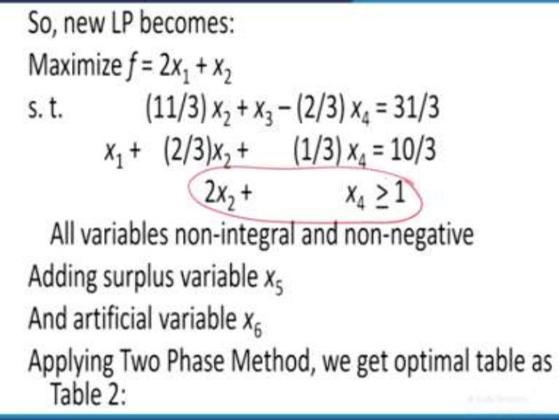

<mark>So, now the new LP becomes the following, objective function is same 2</mark> _<mark>x</mark>_ 1 <mark>+</mark> _<mark>x</mark>_ 2 <mark>subject to (11/3)</mark> _<mark>x</mark>_ 2 <mark>+</mark> _<mark>x</mark>_ 3 <mark>– (2/3)</mark> _<mark>x</mark>_ 4 <mark>= 31/3,</mark> _<mark>x</mark>_ 1 <mark>+ (2/3)</mark> _<mark>x</mark>_ 2 <mark>+ (1/3)</mark> _<mark>x</mark>_ 4 <mark>= 10/3 and this third condition is the cut that we have obtained in the previous slide. All variables should be integers and non-negative, so adding the surplus variable x</mark> 5 <mark>and then the artificial variable x</mark> 6 <mark>and applying the two phase method, we can get the optimum solution or alternatively, you can use the sensitivity analysis, where you can add an additional constraint, so that you can get the new solution.</mark> 

**(Refer Slide Time: 23:29)** 

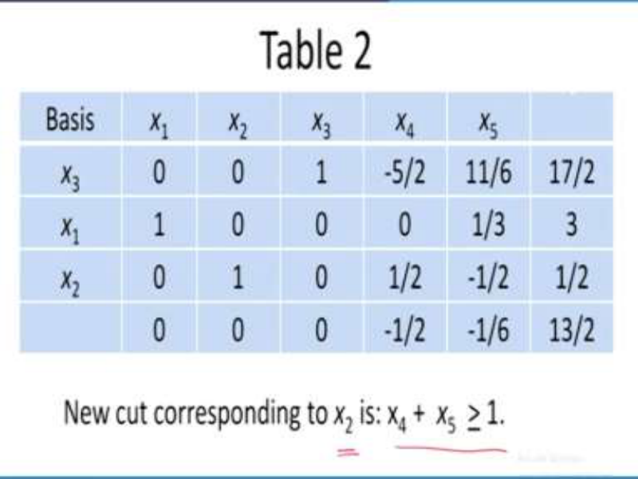

<mark>So, the table 2 gives you the result and the table 2; from the table 2, you find that the new cut corresponding to x</mark> 2 <mark>is the following; x</mark> 4 <mark>+</mark> _<mark>x</mark>_ 5 <u><mark>> 1, this has to be obtained, in the same way which</mark></u> <mark>as I have explained for the x</mark> 1 <mark>variable. So, this additional constraint has to be imposed.</mark> 

# **(Refer Slide Time: 23:54)** 

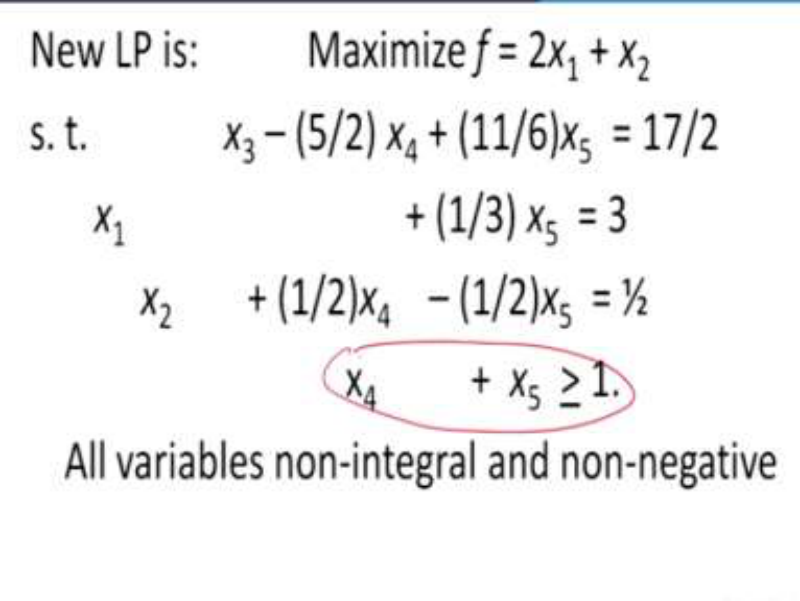

<mark>So, now the new LP becomes the following, so this is again x</mark> 4 <mark>+</mark> _<mark>x</mark>_ 5 <u><mark>> 1, this constraint has been</mark></u> <mark>added corresponding to the cut that we have obtained so, all variables again are supposed to be integers and non-negative.</mark> 

**(Refer Slide Time: 24:18)** 

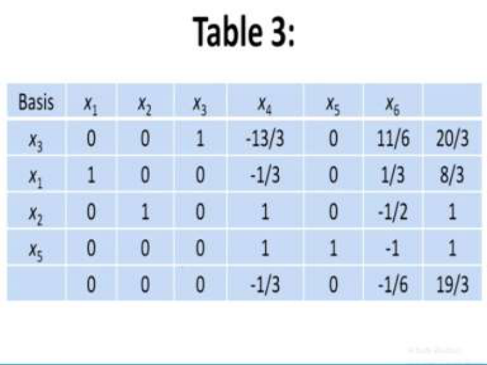

<mark>And the resulting table; the solution that is shown here in this table; table 3.</mark> 

**(Refer Slide Time: 24:25)** 

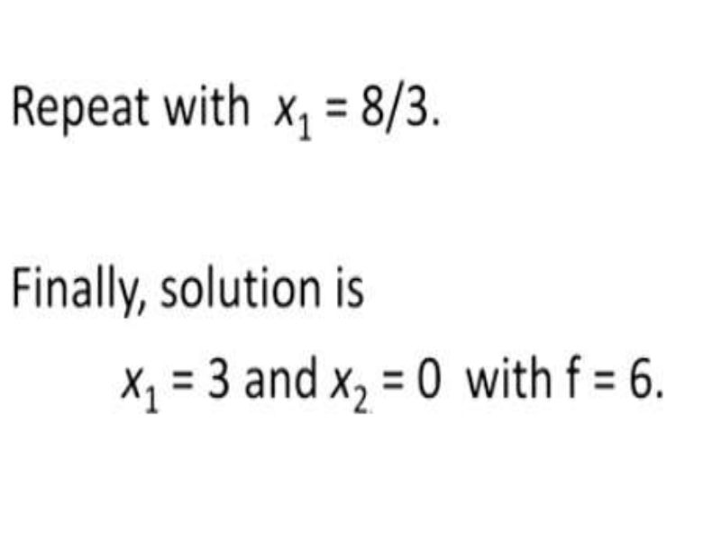

<mark>And we repeat this with x</mark> 1 <mark>= 8/3 and finally, the solution is x</mark> 1 <mark>= 3, x</mark> 2 <mark>= 0 with the objective function f = 6.</mark> 

**(Refer Slide Time: 24:38)** 

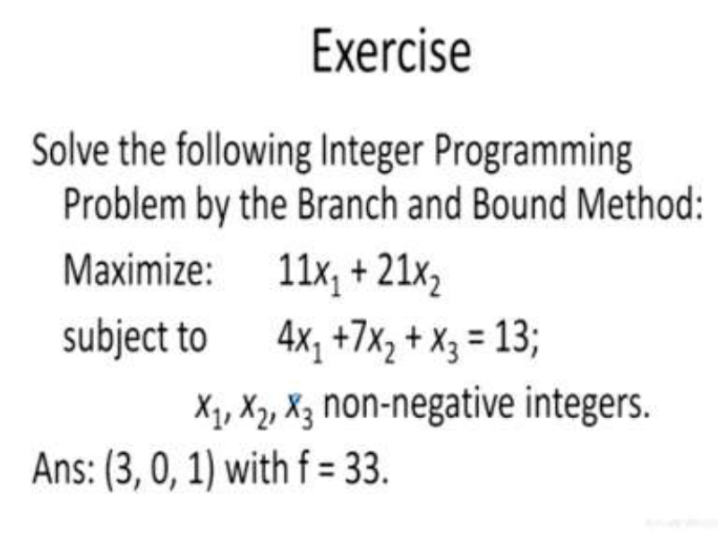

<mark>So, in this way we have learnt the two methods to solve the integer programming problem. This is an exercise for you to try out whether you have understood the method or not, solve the following programming problem; integer linear programming problem by the branch and bound method and also repeat with the Gomory’s cutting plane method; maximize 11</mark> _<mark>x</mark>_ 1 <mark>+ 21</mark> _<mark>x</mark>_ 2 <mark>subject to 4</mark> _<mark>x</mark>_ 1 <mark>+7</mark> _<mark>x</mark>_ 2 <mark>+</mark> _<mark>x</mark>_ 3 <mark>= 13, all x</mark> 1 <mark>and x</mark> 2 <mark>and x</mark> 3 <mark>should be non-negative integers.</mark> 

<mark>The answer to this problem is (3, 0, 1) with the objective function value as 33, so with this we come to an end of this lecture on integer programming problem where we have learnt the two methods to solve an integer programming problem, thank you.</mark> 

