# **Operations Research Prof. Kusum Deep Department of Mathematics Indian Institute of Technology – Roorkee** 

# **Lecture - 26 Multi-Objective Programming** 

Good morning students. Today, we will study a very interesting kind of a linear programming problem which is called the multi-objective optimization problem. As the name indicates, here we will consider not one but many objective functions which have to be simultaneously minimized or maximized subject to a common set of equations or constraints. These kind of problems arise in real life very frequently. 

For example, if you want to buy a car, you want to look at the various objectives that should be met. For example, you want that the car should be fuel-efficient; you want that the car should be of minimum cost and you also want that the car should look aesthetically good. Usually, in real life many objectives or multi-objectives are conflicting in nature. That is if one is to be minimized, then the other has to be maximized. 

So, like this we have to strike a proper balance between all the objective functions that are encountered in the problem. Hence, the study of multi-objective optimization problems is of practical interest and is very important for us to study. The outline of today's talk is as follows. 

**(Refer Slide Time: 02:19)** 

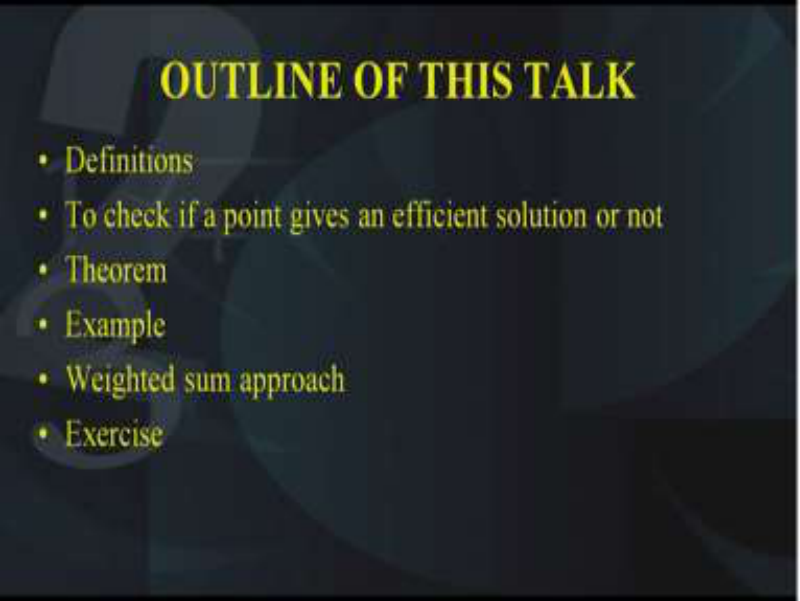

First of all, we will look at some definitions, then we would like to see what are the conditions to check if a given point is an efficient solution or not, then we will take a theorem and then an example, later we will look at the weighted sum approach which is an approach to solve the multi-objective optimization problem and finally some exercises. 

**(Refer Slide Time: 02:50)** 

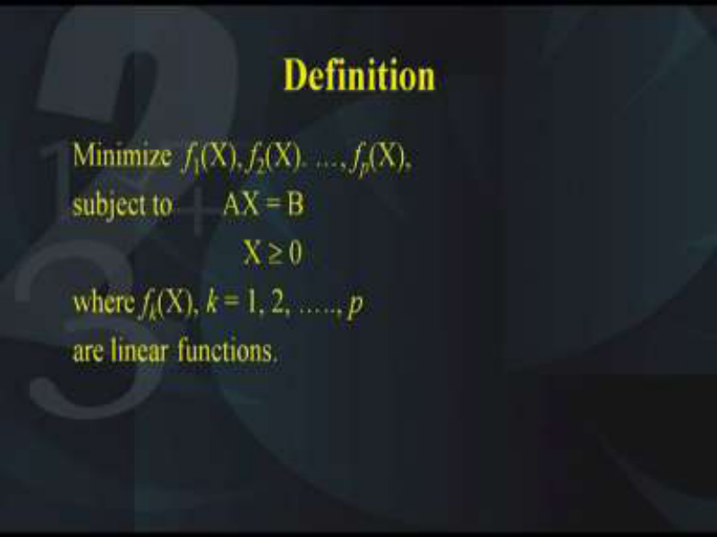

So, let us define the most general nonlinear multi-objective optimization problem. Suppose, we have minimize _f_ 1(X), _f_ 2(X). …, _fp_ (X). Now all these _f_ ’s that is _f_ 1(X), _f_ 2(X). …, _fp_ (X) in general are they could be nonlinear but we will be considering the linear case only and all these constraints are subject to the same set of inequalities that is AX=B and X  0. As I said, in general these _f_ i’s could be nonlinear but we will be considering only the linear case. 

Please note that if some of the objective function let us say fk(X) is of the maximization type, then it can be converted to the minimization type by multiplying with the negative sign. So, in general we will consider all the objective functions to be minimized. 

**(Refer Slide Time: 04:11)** 

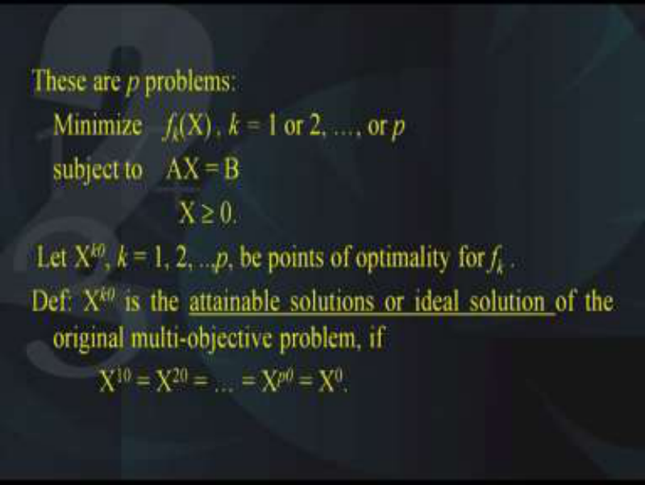

Now if you look at this carefully, these are actually _p_ problems. How? The first problem is minimization of f1(X) subject to the same constraints AX=B and X  0. Similarly, the second problem is if the value of k is 2 and like this there are actually p problems, where in each of the _p_ problems the objective function is different whereas the constraints are the same. Now since each of the _p_ problems is the linear programming problem that we have studied, let us assume that each of the linear programming problem has a solution and that solution is called as X_k0_ , where k goes from 1, 2 up to p. So, in general, each of the _p_ problems will have different solutions and there will be the points of optimality of the functions fk. 

Now let us give a definition. If it happens that the solutions to all these problems is attained at the same point as is shown here in this definition, X_k0_ is said to be an attainable solution or an ideal solution of the original multi-objective optimization problem, if X10 = X20 = … = X_p0_ = X0 . That is to say the point of optimality of all the linear programming problems is attained at the same point. Then, we say that that particular point is an attainable solution or an ideal solution. In reality, this kind of a situation occurs very rarely but we have to understand the theory and that is the reason why we will like to study this. 

**(Refer Slide Time: 06:43)** 

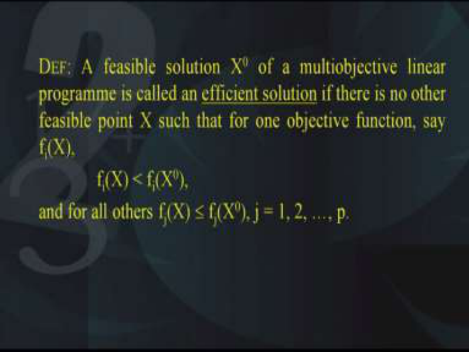

On the other hand, a feasible solution X0 of a multi-objective linear programming problem is said to be an efficient solution if there is no other feasible point X such that for one objective function, let us say fi(X) we have the condition that fi(X) < fi(X0 ), it should be strictly less and for all other objectives fj(X)  fj(X0 ), j = 1, 2, …, p. Please note that in the first inequality, we must have strict inequality whereas in the second equation we may have equality as well as an inequality. 

So this tells us that in general a multi-objective optimization problem may have different kinds of solutions. They could be either ideal solutions or they could be efficient solutions. **(Refer Slide Time: 08:00)** 

So, our problem boils down to the fact that we want to check whether a given solution or a given point gives us an efficient solution or not. Graphically, this can be visualized with the 

help of this diagram. If you look at the two lines AB and CD, AB represents the objective function f2 and similarly this line CD represents the objective function f1. Suppose, these two objective functions intersect at the point P and you try to determine a cone with a vertex at P and move this cone up and down. Then, if this point P does not have any other point of intersection with the region that has been shaded, then it is said to be an ideal solution, otherwise it is an efficient solution. We will study this with the help of an example. So let P be a feasible point and let the lines through P representing the function f1 and f2 be CD and AB just as I have explained. Let f1 and f2 decrease in the direction shown by the arrows and let region BPC be the set of all points such that if we move from P to Q then the value of either f1 or f2 will decrease and the value of the other function will not increase. You can look at this diagram again to visualize this. 

**(Refer Slide Time: 10:14)** 

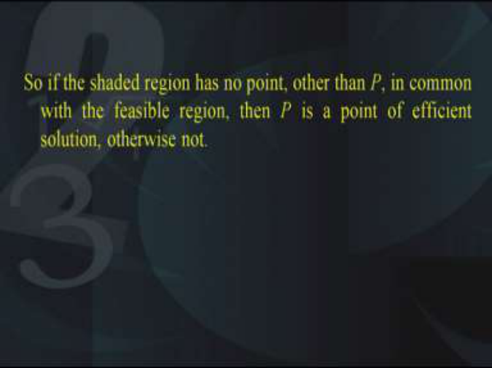

So, if the shaded region has no point, other than the point P, in common with the feasible region, then P is the point of efficient solution, otherwise not. **(Refer Slide Time: 10:33)** 

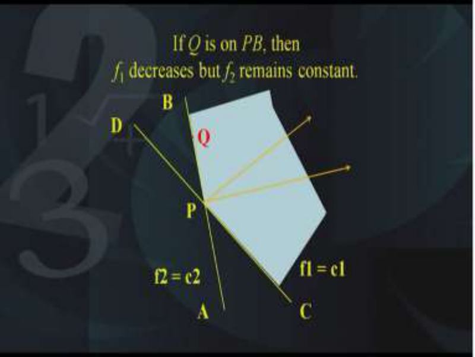

Now let us try to visualize what happens if Q is on the line segment PB, so it is on the edge of the cone APB. Suppose it is on the edge of this shaded region that is it is on the line segment PB. Then, if you move upwards, then f1 decreases but f2 remains constant. **(Refer Slide Time: 11:12)** 

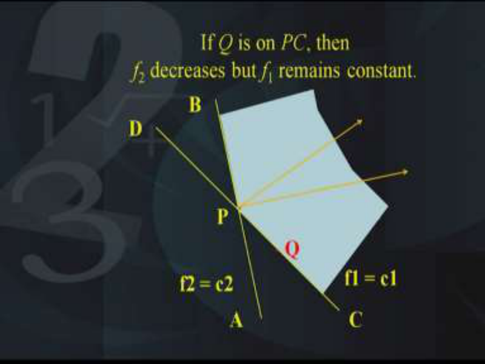

The second situation could be that the point Q lies on the line segment PC. The point Q lies on the line segment PC. In this situation, f2 decreases whereas f1 remains constant. **(Refer Slide Time: 11:40)** 

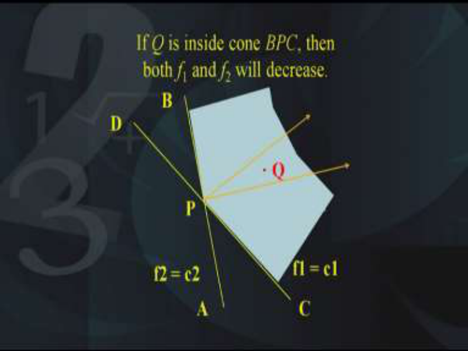

And the third situation could be that Q is a point which is in the interior of this cone BPC. Then, both f1 and f2 will decrease. So what do we conclude? We conclude that there are three situations for the point Q, either it lies on one edge PB or it lies on the second edge PC or it lies in the interior of the cone and in all these three cases we have seen how either one decreases, one objective function decreases whereas the other remains constant but in the third case, both f1 and f2 will decrease. **(Refer Slide Time: 12:33)** 

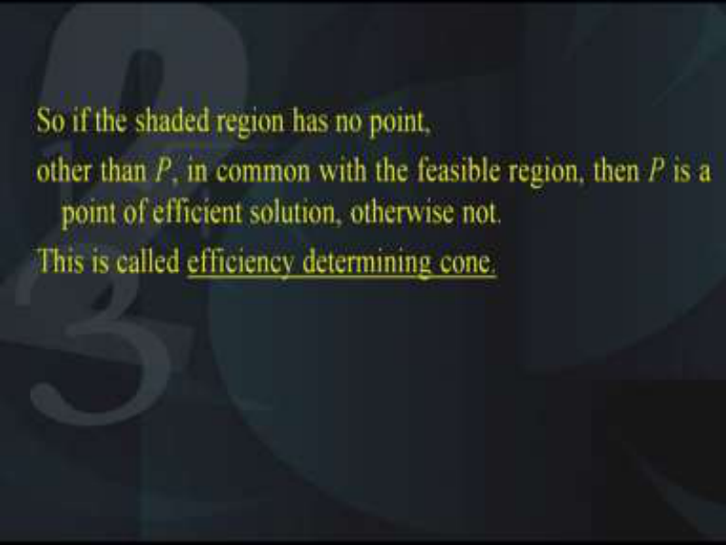

So, if the shaded region has no point other than P, in common with the feasible region, then P is a point of efficient solution, otherwise not. This region is called an efficiency determining cone. This region is called the efficiency determining cone. **(Refer Slide Time: 13:09)** 

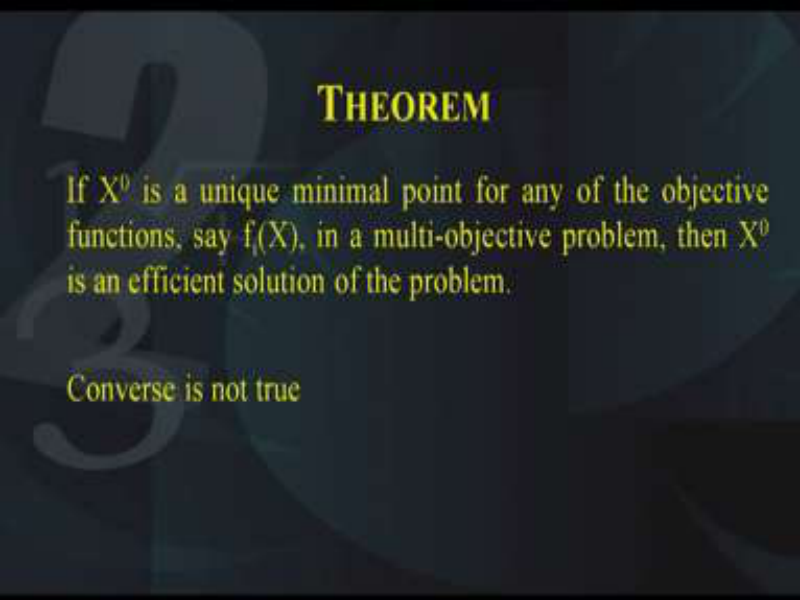

Next, we will look at a theorem. If X0 is a unique minimal point for any of the objective functions, let us say fi(X) in a multi-objective optimization problem, then X0 is an efficient solution of the problem. So, that is the basis of the reason why we have the relationship between the efficient solutions and the objective functions. However, the converse need not be true. How? Let us see with the help of an example. **(Refer Slide Time: 13:58)** 

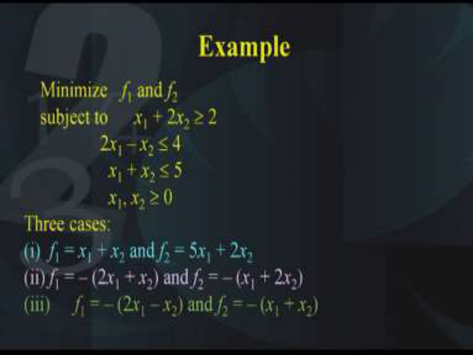

Suppose, we have a simple two variable problem where there are two objectives f1 and f2 and the constraints are defined by _x_ 1 + 2 _x_ 2  2, 2 _x_ 1 – _x_ 2  4, _x_ 1 + _x_ 2  5 and x1 and x2 are > 0. Now as you know that, this satisfies the definition of our multi-objective linear programming problem because the set of the constraints are the same whereas the objective functions are different. Now we will break this example into three cases. 

So actually they are three different problems. Let us take the first case; _f_ 1 = _x_ 1 + _x_ 2 and _f_ 2 = 5 _x_ 1 + 2 _x_ 2, this will be shown in the blue color. The second case that we will consider is f1 is given by – (2 _x_ 1 + _x_ 2) and f2 is given by – ( _x_ 1 + 2 _x_ 2), this will be shown in the pink color and the third example will be _f_ 1 = – (2 _x_ 1 – _x_ 2) and _f_ 2 = – ( _x_ 1 + _x_ 2) and this will be shown in the green color. 

Now let us see what happens if we take these different cases and what will be the kind of solutions that we get to this problem. So first thing we need to do is to draw the feasible region. 

**(Refer Slide Time: 16:11)** 

And as you can see, the feasible region has been drawn and it is shown by the region ABCD. So the coordinates of A are (2, 0); B is (3, 2); C is (0, 5) and D is (0, 1). Now, the first example as I said is shown in the blue color. Let us examine it closely. **(Refer Slide Time: 16:48)** 

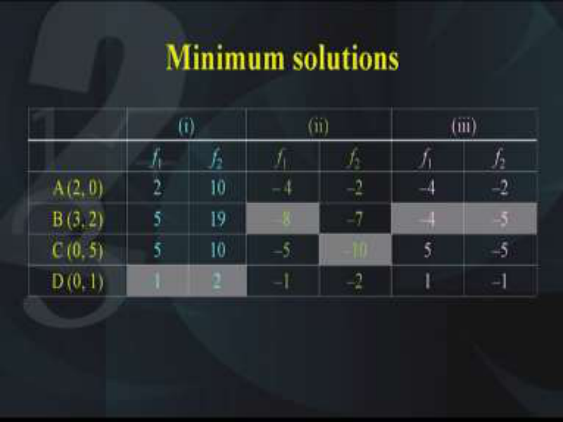

We will tabulate the value of the objective function in each of the three cases. So, in the first case f1 and f2 will assume the following values at the four vertices of the feasible region. At A, B and C and D, the value of f1 is 2 5 5 1 and the value of f2 is 10 19 10 and 2. Now, if you look at this carefully and examine the values of f1, you can see that the optima is attained at the point D. Similarly, the optima of f2 is attained at the point D because this is the minimum value of f1 as well as f2. Let us now come back to the second case which is shown in the pink color. Here, the objective function values are tabulated in this table, it is for A B C D -4 -4 5 and 1. Similarly, for f2 -2 -5 -5 and -1 and similarly for the third case which is shown in the green color, the values are -4 -8 -5 -1 and for f2 are -2 -7 -10 and -2. 

You will observe that in each of the three cases, the optima’s are obtained at different points. As I mentioned, in the first case the optimum solution of f1 and f2 is attained at the same point D. However, in the second case, it is obtained at two different points B as well as C and in the third case, it is obtained at B. **(Refer Slide Time: 19:31)** 

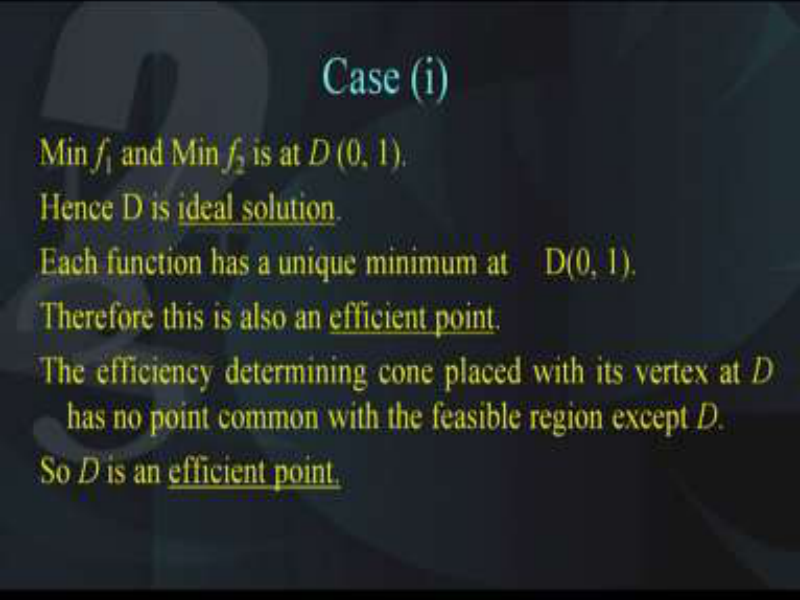

Now, the minima of f1 and the minimum of f2 is attained at the point D, this is the case 1. Hence, D is the ideal solution. According to our definition, all the solutions of f1 and f2 are attained at the same point. Each function has a unique minima at the point D. Therefore, this is also an efficient point. It is an efficient solution as well as it is an ideal solution. 

The efficiency determining cone, when it is placed with its vertex at P has no point common with the feasible region except the point D. So D is the efficient solution. It is the ideal solution as well as the efficient solution. 

**(Refer Slide Time: 20:34)** 

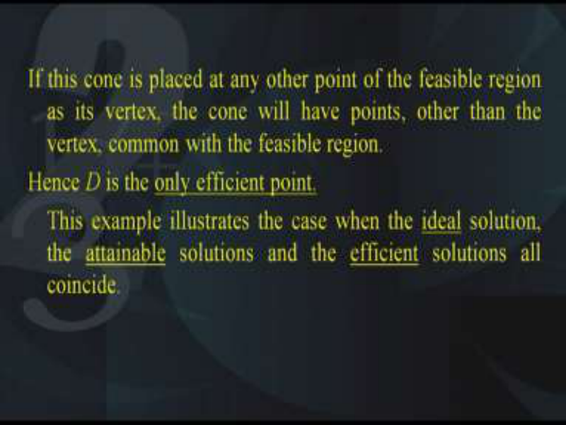

If this cone is placed at any other point of the feasible region as its vertex, the cone will have points other than its vertex common with the feasible region. Hence, D is the only efficient 

point that is it is the unique solution. This example illustrates the case when the ideal solution, the attainable solution and efficient solutions are all coinciding. 

**(Refer Slide Time: 21:10)** 

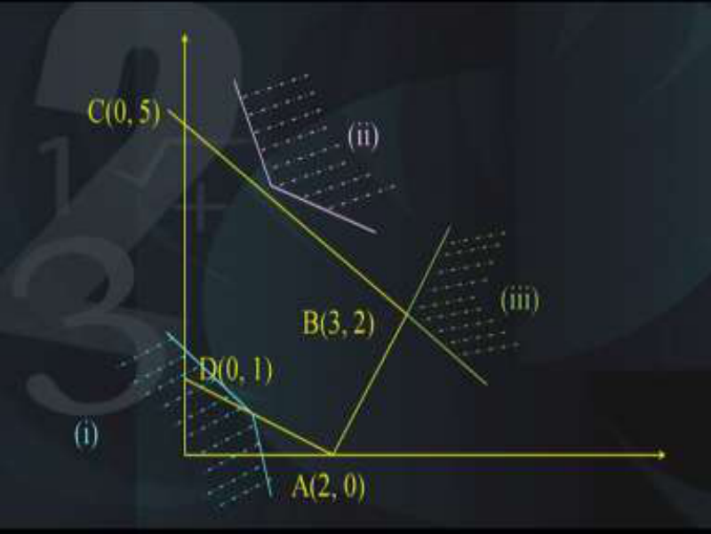

Now, let us look at the way this cone behaves and you can see the point D is obtained at (0, 1) and the efficiency determining cone, if it is moved along the edge of the feasible region, this is what happens. Therefore, this is a point which has the efficient solution and the ideal solution. 

**(Refer Slide Time: 21:45)** 

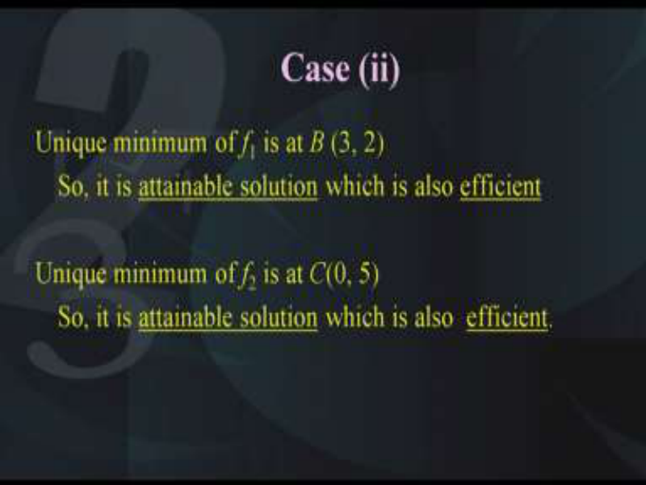

Case number 2, now the unique minima of f1 is obtained at the point B given by (3, 2); so it is an attainable solution and it is also an efficient solution. Unique minima of f2 is at the point C, which is given by (0, 5), so it is the attainable solution which is also efficient. 

**(Refer Slide Time: 22:20)** 

Now, let us look at the efficiency determining cone. The efficiency determining cone has its vertex on the line BC. So as long as the vertex of the cone is anywhere along the line segment BC, it has no point other than the vertex, common with the feasible region. Hence, every point on the line BC is an efficient point. This problem has no ideal solution. 

**(Refer Slide Time: 23:06)** 

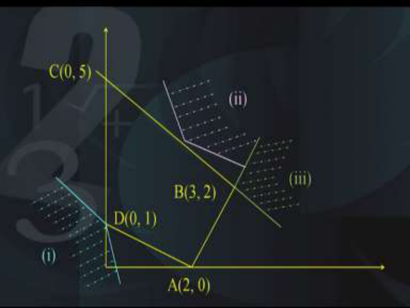

Let us look at the efficiency determining cone here in the second example. That is shown in the pink color. All points on the line segment BC, here they are. **(Refer Slide Time: 23:22)** 

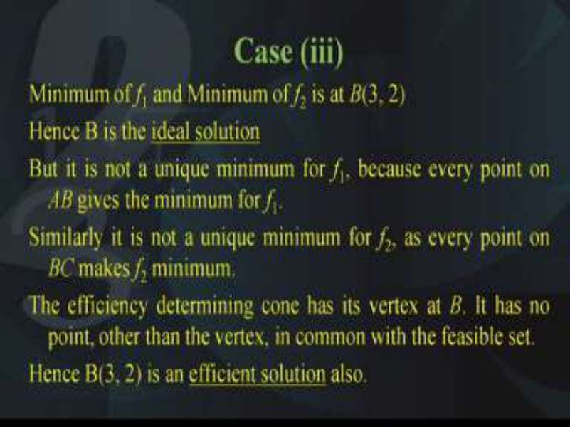

Next, the case number 3, minimum of f1 and minimum of f2 is attained at the point B (3, 2). Hence, B is the ideal solution but it is not the unique minima of f1 because every point on AB gives the minimum for f1. Similarly, it is not the unique minimum for f2 as every point on the line segment BC makes f2 minimum. That is to say in both the objectives, it is not the unique solution, although it is minimum but it is not the unique solution. 

The efficiency determining cone has its vertex at the point B and it has no point other than the vertex in common with the feasible region. Hence, the point B given by 3, 2 is an efficient solution also. 

**(Refer Slide Time: 24:46)** 

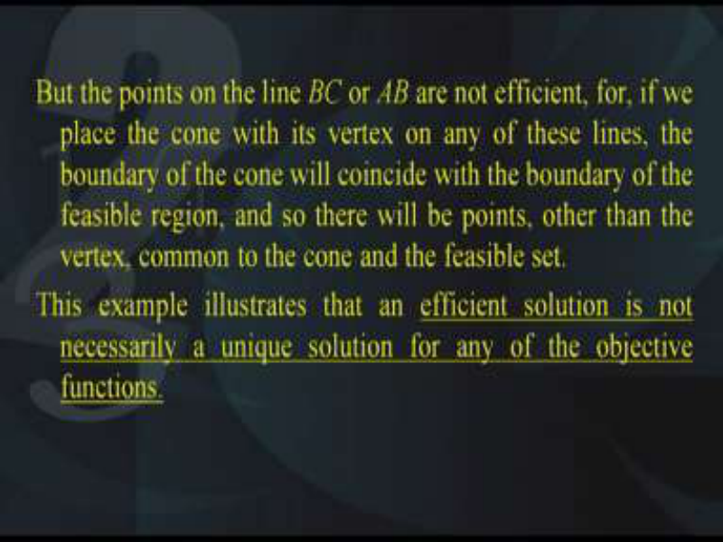

But the points on the line BC or AB are not efficient. If we place the cone with its vertex on any of these lines, then the boundary of the cone will coincide with the boundary of the 

feasible region and so there will be points other than the vertex common to the cone as well as the feasible region. This example illustrates that an efficient solution is not necessarily a unique solution for any of the objective functions. 

**(Refer Slide Time: 25:37)** 

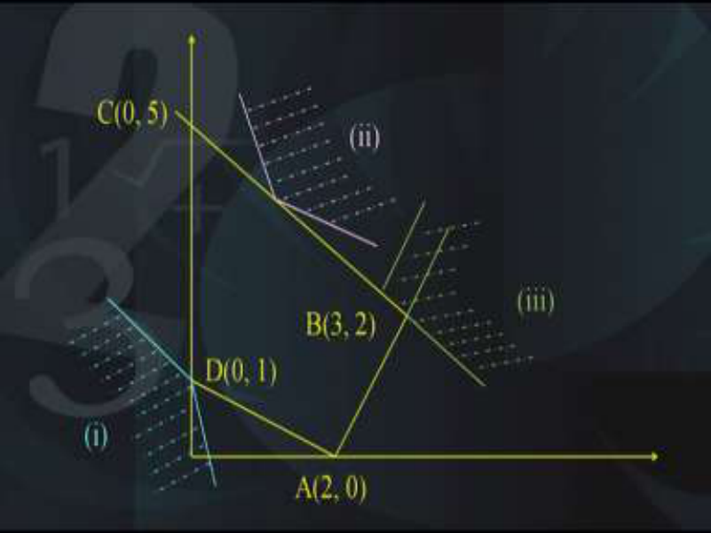

Here, you can see in the third case that is the green case. If you move the cone up and down, this is what happens. 

**(Refer Slide Time: 25:54)** 

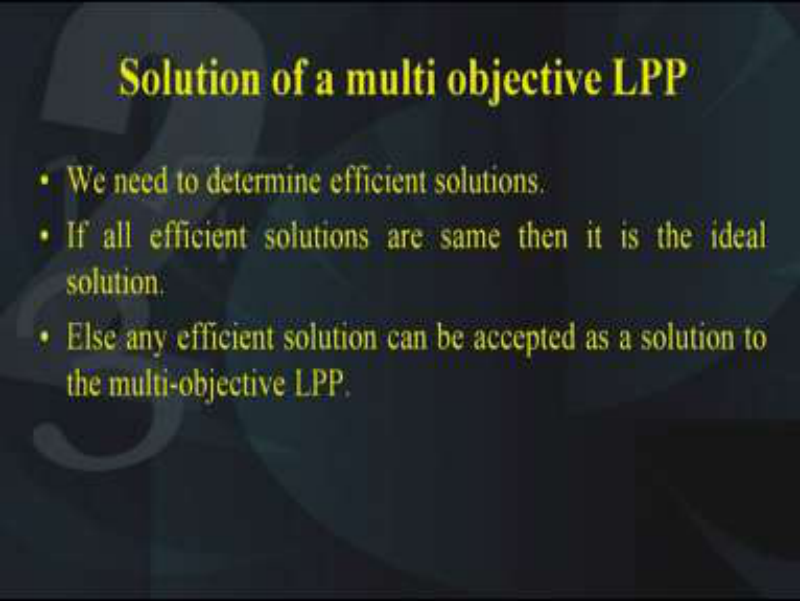

So, next comes the question how to find the solution of a multi-objective optimization problem. For this, we need to determine the efficient solutions because in general you have seen it is not always true that we will get an ideal solution in all the cases. Therefore, if all the efficient solutions are same, then it is the ideal solution which is very rare. Else any efficient 

solution can be accepted as a solution to the multi-objective problem. The most common approach to solve such problems is called the weighted sum approach. 

**(Refer Slide Time: 26:50)** 

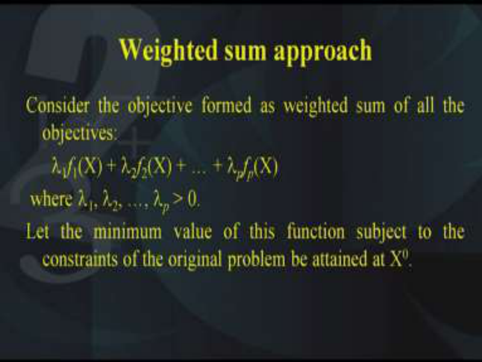

Here, consider the objective function formed as the weighted sum of the objectives. So, all the objectives are clubbed together like this,  1 _f_ 1(X) +  2 _f_ 2(X) + … +  _pfp_ (X), where all these scalars  1,  2, …,  _p_ > 0. Let the minimum value of this function subject to the same constraints of the original problem be attained at the point X0 . 

**(Refer Slide Time: 27:33)** 

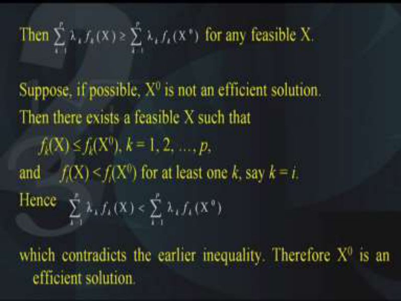

Then, if you look at this <u>></u> , for any feasible X. That is this inequality holds for all X. Suppose, if possible X0 is not an efficient solution, so we are going to prove it with the help of the contradiction method. Suppose, if X0 is not an efficient solution, then there exists a feasible X such that fk(X) < fk(X0 ) where k goes to 1, 2 up to p. 

And _fi_ (X) < _fi_ (X0 ) for at least one _k_ , say _k_ = _i_ . Hence, we have this less than equal to condition which contradicts the earlier inequality and therefore X0 is an efficient solution. So, by this simple argument we can prove this result. 

Let us take an example to understand the weighted sum approach. 

**(Refer Slide Time: 29:25)** 

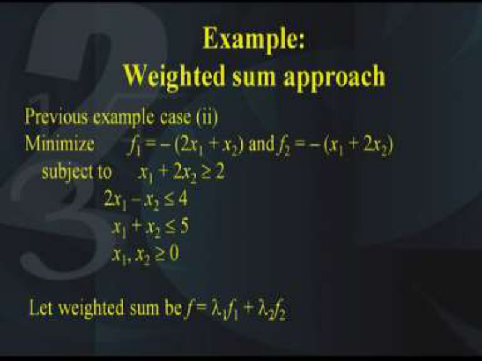

The same example as we had taken earlier let us take the case number 2 that is we have f1= – (2 _x_ 1 + _x_ 2) and f2= - ( _x_ 1 + 2 _x_ 2) and subject to the same constraints _x_ 1 + 2 _x_ 2  2, 2 _x_ 1 – _x_ 2  4, _x_ 1 + _x_ 2  5. Now, let us consider the weighted sum _f_ =  1 _f_ 1 +  2 _f_ 2. 

**(Refer Slide Time: 30:01)** 

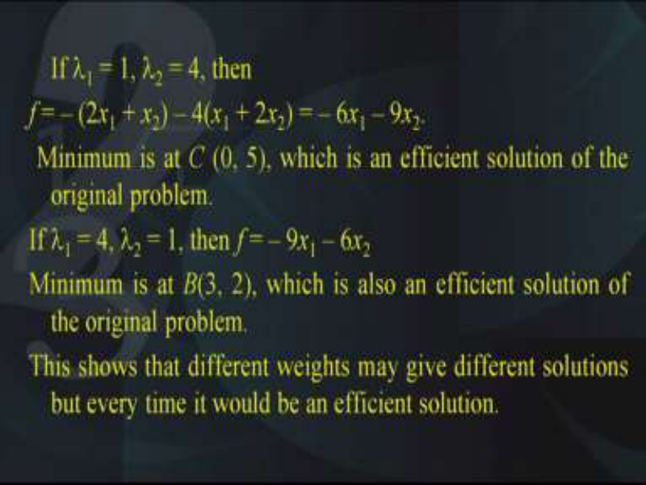

If we take  1 = 1,  2 = 4,, then we get the function as follows, _f_ = – (2 _x_ 1 + _x_ 2) – 4( _x_ 1 + 2 _x_ 2) = – 6 _x_ 1 – 9 _x_ 2 and the minima is attained at C (0, 5). For this, you need to solve the problem and 

you will see that the minima is attained at C (0, 5), which is an efficient solution of the original problem. However, if we take  1 = 4,  2 = 1, then we will get the weighted objective function as _f_ = – 9 _x_ 1 – 6 _x_ 2 and the minimum is obtained at the point B (3, 2) which is also an efficient solution to the original problem. 

So, with this exercise we can see that the different weights may produce different solutions but every time it will be giving us an efficient solution. If all the weights give rise to the same solution, then that problem has the ideal solution but if different combination of the weights they give different solutions, then they are the efficient solutions. 

**(Refer Slide Time: 31:53)** 

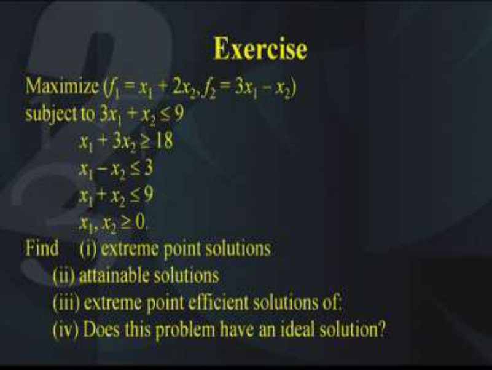

So, now there is an exercise for you to do. Suppose, you have to maximize _f_ 1 = _x_ 1 + 2 _x_ 2 and the second objective _f_ 2 = 3 _x_ 1 – _x_ 2 and this is subject to the constraints 3 _x_ 1 + _x_ 2  9, _x_ 1 + 3 _x_ 2  18, _x_ 1 – _x_ 2  3, _x_ 1 + _x_ 2  9 and x1 and x2 are both  0. Then, the question for you is as follows. You have to find the extreme points of the problem; you have to find the attainable solutions of the problem and thirdly find the extreme point efficient solutions and does this problem have an ideal solution or not. So, please do this exercise. The answers are given here. **(Refer Slide Time: 33:15)** 

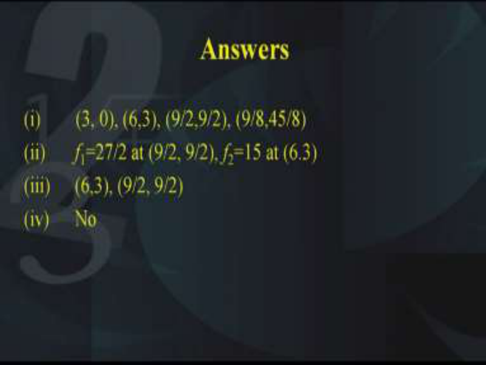

In the first the answer is (3, 0), (6, 3), (9/2, 9/2), (9/8, 45/8) and the answer to the second question is f1=27/2 at the point (9/2, 9/2) and f2=15 at the point (6, 3) and the third answer is (6, 3), (9/2, 9/2) and the fourth answer is no. Thank you. 

