# **Operations Research Prof. Kusum Deep Department of Mathematics Indian Institute of Technology – Roorkee** 

# **Lecture - 27 Dynamic Programming** 

Hello students. This is lecture number 27, the title of this lecture is dynamic programming, it comes under special types of LPPs. Now, the dynamic programming as the name indicates, it means that it is dynamic as compared to a static programming problem. It means that it changes with respect to some factor let us say with respect to time or some other factor. 

**(Refer Slide Time: 01:02)** 

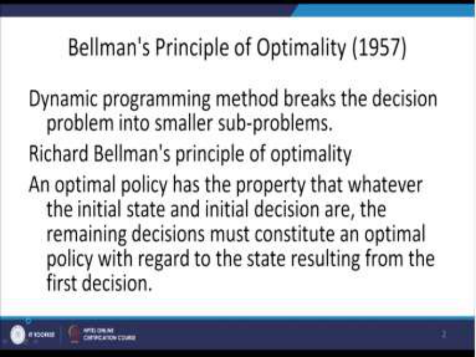

It is also called a **recursive programming problem** . The dynamic programming problem is based on the Bellman’s principle of optimality, which was given in the year 1957. Now, this dynamic programming method, it breaks down the decision problem into smaller subproblems and these sub-problems are solved so as to give the solution of the original problem. 

Now, Richard Bellman's principle of optimality is as follows. An optimal policy has the property that whatever the initial state and the initial decisions are, the remaining decisions must constitute an optimal policy with regard to the state resulting from the first decision. **(Refer Slide Time: 02:05)** 

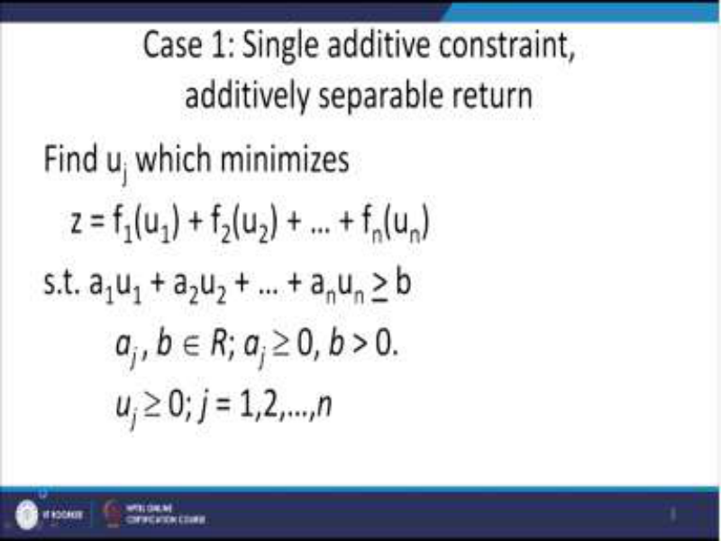

Now, let us take some examples to understand what exactly does this mean? So, first of all, let us look at this simple problem, which is the case of a single additive constraint and additive separable returns. Now, this means that suppose ui’s have to be determined in such a way that ui’s are the decision variables which minimizes the function f1(u1) + f2(u2) + … + fn(un). Now, this is a separable function, which means that the function can be written as a sum of different independent variables. For example, f1(u1) is a function f1 and it is only in the variable u1. Similarly, f2 is a function which is only in the variable u2 and like this. So, these kind of functions are called separable functions. Now, this is subject to just one single constraint of the type a1u1 + a2u2 + … + anun <u>> b.</u> Here, all the ai’s and all the b’s, I mean there is only one b, they are all real numbers and they are > 0, ai’s are > 0 and b should be strictly positive. Also the decision parameters uj’s that is uj > 0,  j goes from 1 to n. So, the decision variables as you know in a linear programming problem, usually the decision parameters are supposed to be > 0. **(Refer Slide Time: 04:01)** 

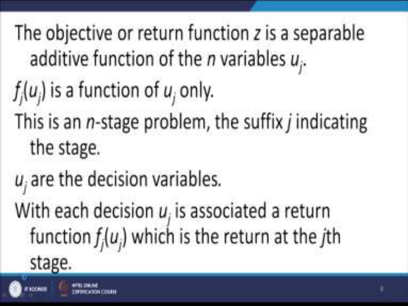

Now, the objective or the return function z is a separable additive function of n variables uj’s that is fj(uj) is a function of uj only. Just as I have explained and this is an n-stage problem, because why is it n, because the number of decision variables are n and the suffix j indicates the stage. Now, the uj’s are the decision variables with each decision uj is associated a return function fj(uj) which is the return at the jth stage. So, in other words the given problem has been converted into a multi-stage problem like this. 

**(Refer Slide Time: 04:50)** 

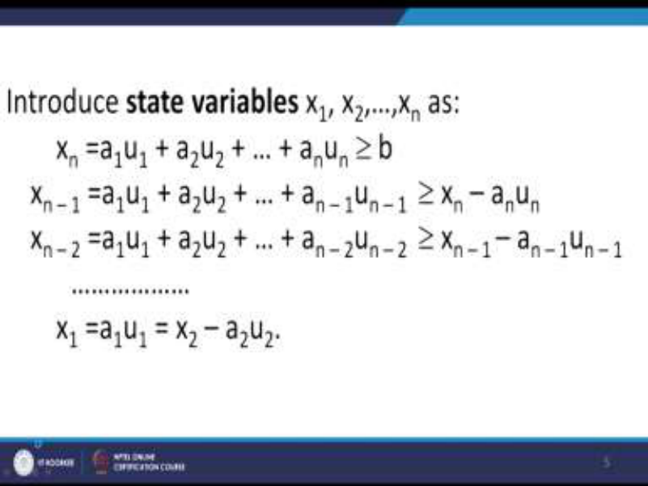

So, let us introduce new variables x1, x2,…,xn which we will call as the state variables like this. First of all, we will define xn, which is equal to a1u1 + a2u2 + … + anun and according to the given problem this quantity should be > b. Then, we will define xn – 1 =a1u1 + a2u2 + … + an – 1un – 1  xn – anun. This xn we have taken from the first equation and like this we will go backwards and finally we will define x1 =a1u1 = x2 – a2u2. 

Now, this is called the backward recursion because we have started by defining from xn onwards. So, if on the other hand you define starting from x1 then it is called as a former recursion but since we have just started with xn, so that is the reason why it is called as a backward recursion. 

**(Refer Slide Time: 06:13)** 

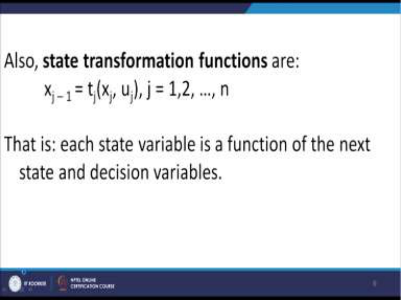

Now after this, we will also state the transformation functions which are defined like this that is xj – 1 = tj(xj, uj), j = 1,2, …, n and this means that the each state variable is a function of the next state and the decision variables. So, these are called the state transformation functions. 

**(Refer Slide Time: 06:46)** 

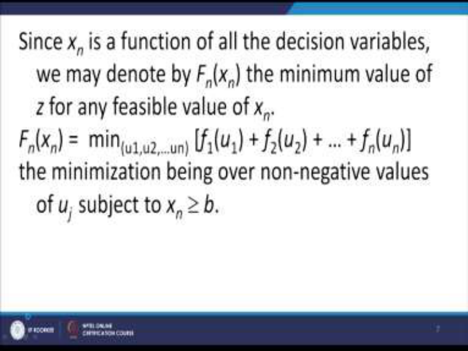

Now, since xn is a function of all the decision variables, we may denote by Fn(xn) the minimum value of the function z for any feasible value of xn and we can write _Fn_ ( _xn_ ) as _Fn_ ( _xn_ ) 

=  min(u1,u2,…un) [ _f_ 1( _u_ 1) + _f_ 2( _u_ 2) + … + _fn_ ( _un_ )], and the minimization has to be done over the non-negative values of uj subject to _xn_  _b_ . So, in other words, we have defined the state transformation variables, we have defined the state variables and the state transformation functions. 

**(Refer Slide Time: 07:38)** 

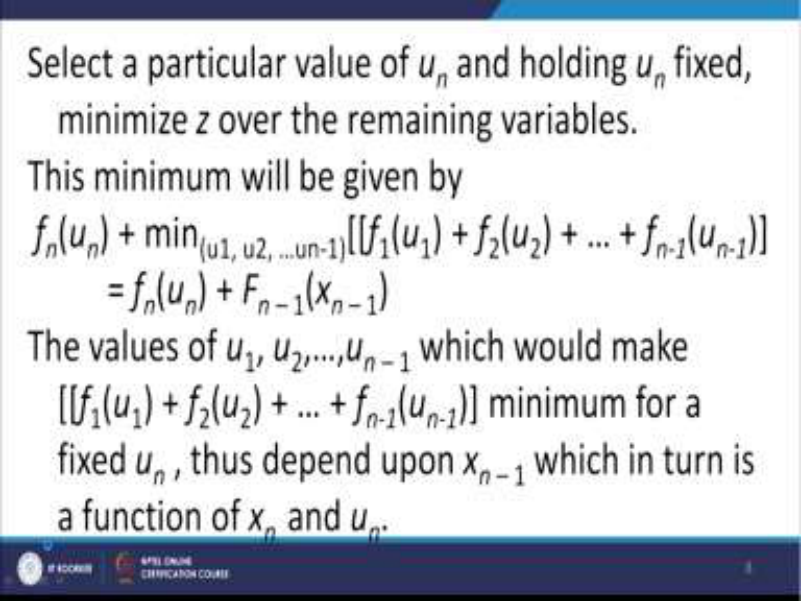

Now, we will select a particular value of un and holding this un fixed, we will minimize the z which is the objective function over the remaining variables and this minimum will be given by _fn_ ( _un_ ) + min(u1, u2, …un-1)[[ _f_ 1( _u_ 1) + _f_ 2( _u_ 2) + … + _fn-1_ ( _un-1_ )] which is actually equal to _fn_ ( _un_ ) + _Fn –_ 1( _xn –_ 1) and the values of _u_ 1, _u_ 2,…, _un –_ 1 which would make this function [[ _f_ 1( _u_ 1) + _f_ 2( _u_ 2) + … + _fn-1_ ( _un-1_ )]  minimum for a fixed un. So, this depends upon xn-1, which in fact also in turn depends on the function xn and un. So, that indicates the recursive nature of the problem. 

**(Refer Slide Time: 08:48)** 

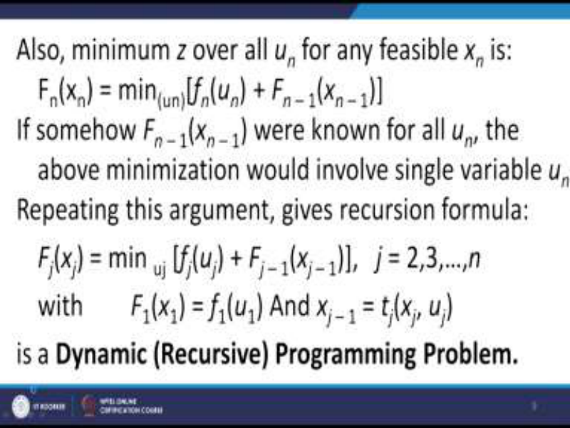

Now also minimum of z over all un for any variable for any feasible xn is Fn(xn) which is given by min(un)[fn(un) + Fn – 1(xn – 1)] and if somehow Fn – 1(xn – 1) was known for all un, then the above minimization would involve a single variable un and like this by repeating this argument, we can get a recursive formula as follows _Fj_ ( _xj_ ) = min uj [ _fj_ ( _uj_ ) + _Fj_ – 1( _xj –_ 1)], _j_ = 2,3,…, _n_ with the condition that _F_ 1( _x_ 1) = _f_ 1( _u_ 1) And _xj –_ 1 = _tj_ ( _xj_ , _uj_ ). This total concept of defining the state variables and the state transformation functions in a recursive fashion is called as a dynamic programming problem or a recursive programming problem. 

**(Refer Slide Time: 10:17)** 

Now, let us take a simple example to illustrate this procedure. Suppose, we have the optimization problem, _u_ 12 + _u_ 22 + _u_ 32 subject to _u_ 1 + _u_ 2 + _u_ 3  100  and the u1, u2 and u3 are  0. So, we will define the decision variables which are the u1, u2, u3. We will define the state variables as _x_ 3 = _u_ 1 + _u_ 2 + _u_ 3. This is the first decision state variables x3 and this condition is already given that it is > 100. So, we will write that x3 > 100. Similarly, going backwards we will define _x_ 2 = _u_ 1 + _u_ 2 and this _u_ 1 + _u_ 2 is actually equal to _x_ 3  – _u_ 3 and finally we will define _x_ 1 = _u_ 1 = _x_ 2 – _u_ 2. So, that is the way the state variables are to be defined. **(Refer Slide Time: 11:45)** 

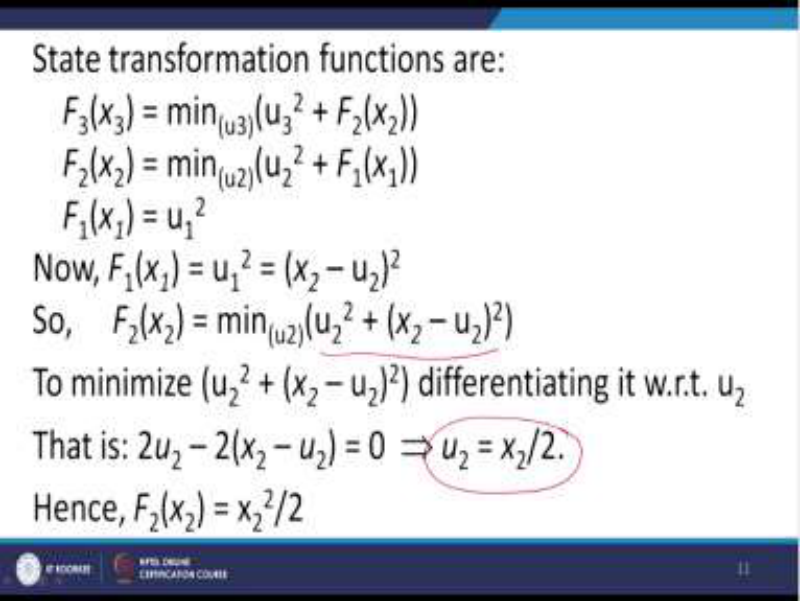

Then, comes the state transformation functions, we are defining them as follows. _F_ 3( _x_ 3) = min(u3)(u32 + _F_ 2( _x_ 2)). This is the definition as I have explained previously and similarly _F_ 2( _x_ 2) = min(u2)(u22 + _F_ 1( _x_ 1)) and finally _F_ 1( _x1_ ) = u12 . This is possible remember because in the problem that is given to us; note that each of these three terms are in one variable only. That is this first term is in u1, similarly the second term is in u2, the third term is in u3. So, each of the three terms are in different variables and as per the definition, this is called as a separable function. So, now, once we have defined the state variables and the state transformation function, now let us proceed to find out what this F1(x1) is and as you know that from this condition _F_ 1( _x1_ ) = u12 . 

And now we will substitute the value of u1, which is equal to _x2_ – u2) and that is the square has also to be taken. So, this means that _F_ 2( _x_ 2) = min(u2)(u22 + ( _x2_ – u2)2 ) and now we need to minimize this quantity which is given inside the bracket that is min(u2)(u22 + ( _x2_ – u2)2 )  and in order to minimize it, we will differentiate it with respect to u2 which will give us this condition, 2 _u_ 2 – 2( _x_ 2 – _u_ 2) = 0  _u_ 2 = _x_ 2/2. So here we have this condition, u2=x2/2. Hence, _F_ 2( _x_ 2) = x22 /2. 

**(Refer Slide Time: 14:11)** 

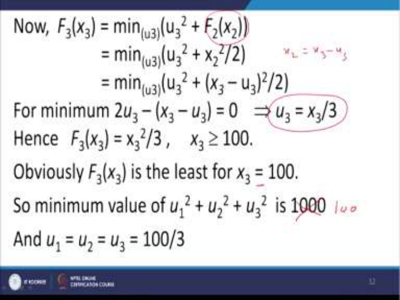

Similarly, _F_ 3( _x_ 3) = min(u3)(u32 + _F_ 2( _x_ 2)) and we will now substitute this, in place of this _F_ 2( _x_ 2), we will substitute x22 /2 which we have just obtained and we will get x2 in terms of (x3-u3) because here we will substitute x2=x3-u3 and again for minimization, we will have to take its derivative with respect to u3 and put it equal to 0. So that gives us _u_ 3 = _x_ 3/3. Hence, _F_ 3( _x_ 3) = x32 /3. Now we know that _x_ 3  100, this is way that has been given in the problem. So _F_ 3( _x_ 3) is the least for _x_ 3 = 100. So the minimum value of _u_ 12 + _u_ 22 + _u_ 32 is 1000 and automatically by going backward, you can see that _u_ 1 = _u_ 2 = _u_ 3 = 100/3. So that is the solution of this problem. **(Refer Slide Time: 15:47)** 

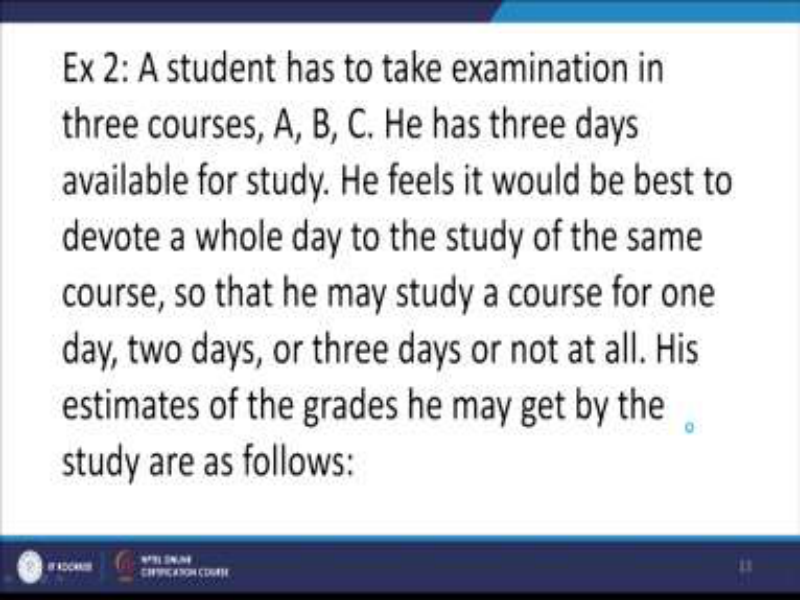

Next, let us take another example which is slightly different in structure. This problem says that a student has to take an examination in three courses A, B and C and he has three days available for study. He feels it would be best to devote a whole day to the study of the same 

course, so that he may study a course for one day, two days or three days or not at all. His estimates of the grades he may get by the study are as follows. 

**(Refer Slide Time: 16:31)** 

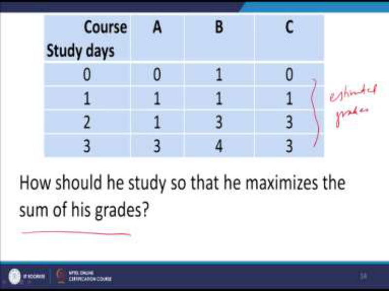

In this table, we have the courses A, B, C and the study days that is 0 1 2 3. For example, if he studies study days are 2 then A 1 hour, B 3 hours and C 3 hours. So, how should he study so that he maximizes the sum of his grades? So, in this table the estimation of his grades is given that is in the courses A, B and C he has if he puts study days 0 1 2 3 then his estimated grades are given by if he studies 0, I mean if he does not study for any day, then in A subject he will get 0 grades and in B he will get 1 grade and in C he will get 0 grade. So, these are the grades, his estimated grades. So, the problem says that how should he study so that he maximizes the sum of his grades that is the problem. So, how should he study so that he maximizes the sum of his grades? That is how many hours should be put in for each of the three subjects or how many days he should put in for each of the three subjects so that his overall grades are maximized. 

**(Refer Slide Time: 18:07)** 

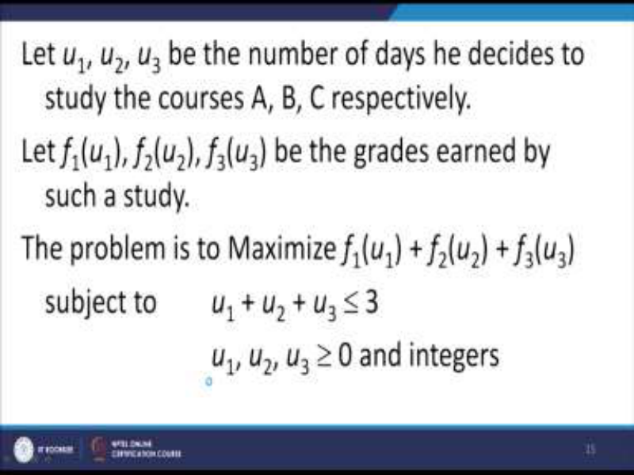

So, let us formulate this problem using the dynamic programming problem that we have learnt. So, let _u_ 1, _u_ 2, _u_ 3 be the number of days he decides to study the courses A, B and C respectively. So let _f_ 1( _u_ 1), _f_ 2( _u_ 2), _f_ 3( _u_ 3) be the grades earned by such a study. So, with this definition, the problem can be written as maximize _f_ 1( _u_ 1) + _f_ 2( _u_ 2) + _f_ 3( _u_ 3) subject to the condition _u_ 1 + _u_ 2 + _u_ 3  3 and all the _u_ 1, _u_ 2, _u_ 3  0 and integers. 

Now, the reason why I have chosen this problem is that number one this is a discrete problem because it is talking about integer variables as you can see _u_ 1, _u_ 2, _u_ 3 should be integers and secondly the constraint that has been given is of the less than or equal to type. So, with these two different characteristics, let us look at the solution of the problem. 

**(Refer Slide Time: 19:24)** 

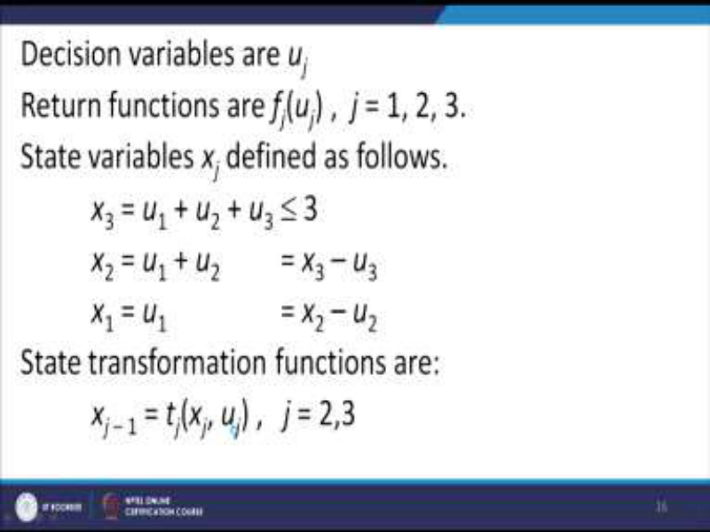

Now, the decision variables are uj’s and the return functions are _fj_ ( _uj_ ) , _j_ = 1, 2, 3. So, the state variables can be defined as follows, _x_ 3 = _u_ 1 + _u_ 2 + _u_ 3  3. Similarly, _x_ 2 = _u_ 1 + _u_ 2 which can be written in terms of x3 as _x_ 3 – _u_ 3. Similarly, _x_ 1 = _u_ 1 which can be written in terms of x2 and u2 as _x_ 2 – _u_ 2 and also we can define the state transformation functions _xj –_ 1 = _tj_ ( _xj_ , _uj_ ), _j_ = 2,3. 

**(Refer Slide Time: 20:21)** 

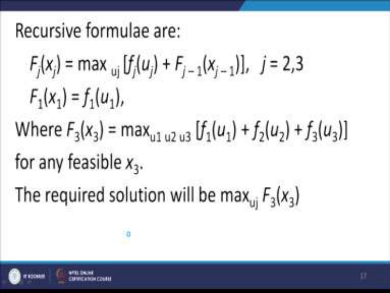

Now, this recursive formulas are _Fj_ ( _xj_ ) = max uj [ _fj_ ( _uj_ ) + _Fj –_ 1( _xj –_ 1)], _j_ = 2,3 and for F1 it is _F_ 1( _x_ 1) = _f_ 1( _u_ 1), where _F_ 3( _x_ 3) = maxu1 u2 u3 [ _f_ 1( _u_ 1) + _f_ 2( _u_ 2) + _f_ 3( _u_ 3)] for any feasible x3. The required solution will be maxuj _F_ 3( _x_ 3). This is using the way in which we have defined the state variables and the state transformation functions. 

**(Refer Slide Time: 21:11)** 

Now, the stage returns can be written like this. On the top, we have uj that is 0 1 and 2 3 and on the left hand column we have j which goes from 1, 2 up to 3 and the state returns can be written as follows 0 1 1 3 1 1 3 4 0 1 3 3. This is based upon the stage returns as given in the problem. 

**(Refer Slide Time: 21:47)** 

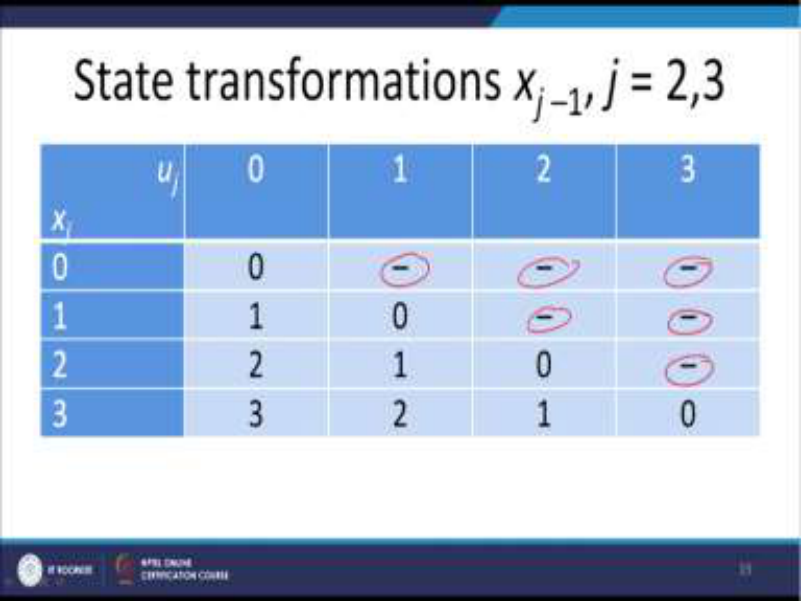

Also, we can define the state transformations as xj-1 where j goes from 2 to 3 like this. In the top, we have uj that is 0 1 2 3 and on the left-hand side in the first column we have the values of xj as 0 1 2 3 and corresponding entries are shown in the table. Please note that some entries are not defined. So, that is the reason why they have been shown with the dashed sign. **(Refer Slide Time: 22:26)** 

Now, coming to the recursive operations, let us try to understand this table how it is written. In the first column, we have the x2 values that is 0 1 2 3 and in the top rows we have f2(u2). 

So, f2(u2) will depend upon the value of u2 that is u2 is 0 1 2 3 and at the second part of the table we have F1(x1) and finally in the third part we have _f_ 2( _u_ 2)+ _F_ 1( _x_ 1) and the last column is the _F_ 2( _x_ 2). 

So from this table, we have to obtain the values of _F_ 2( _x_ 2). Now, this is depending upon the way in which f2(u2) and F1(x1) is defined and this third is the sum, so this is the sum of the two right and whatever you get that is the F2( x2) is written. So please note, for example, this 1 I have marked in red and this 1, So 1+1 is 2 so therefore this 2 comes over here and like this all the entries can be verified. 

**(Refer Slide Time: 23:50)** 

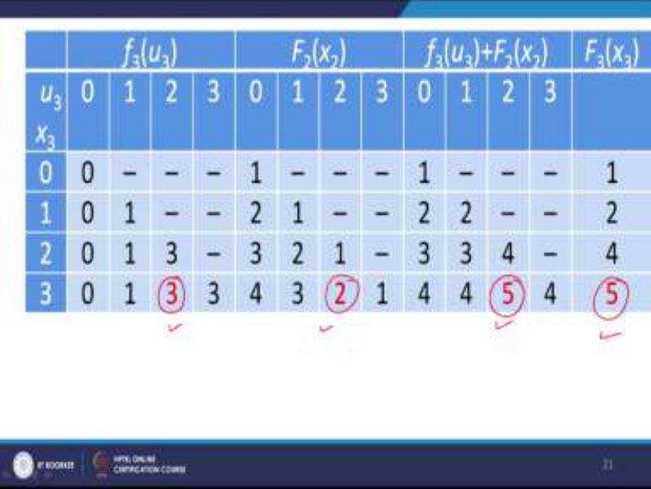

Then coming to the next stage that is _f_ 3( _u_ 3) exactly in the same manner _f_ 3( _u_ 3) is written in the first part of the table. In the second part of the table, we have written _F_ 2( _x_ 2), then in the third part is their sum and finally _F_ 3( _x_ 3) is written in the last. So, here also you can just check these values, for example, this 3 and 2, so 3+2 is 5 and this 5 comes here. So this 3+2 is 5 which comes here and that is the value of our _F_ 3( _x_ 3). 

**(Refer Slide Time: 24:34)** 

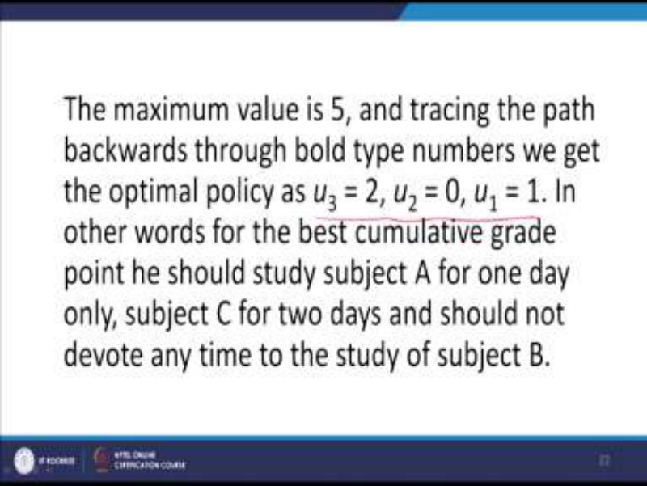

So, the maximum value is 5. How is this maximum value? Look at these entries, so the maximum value is 5 and if you trace the path backwards through the bold type numbers that are marked in red, we get the optimum policy as u3=2, u2=0, u1=1. Just let us go back here and see, look at the tables over here. So, this tells us that this 5 from where did it come? It came from these red entries. 

And that is the reason why we get the value of our u3 as 2, u2 as 0, u1 as 1. So, this means that in other words for the best cumulative grade point, the student should study subject A for 1 day only, subject C for 2 days and should not devote any time to this subject B. 

**(Refer Slide Time: 25:45)** 

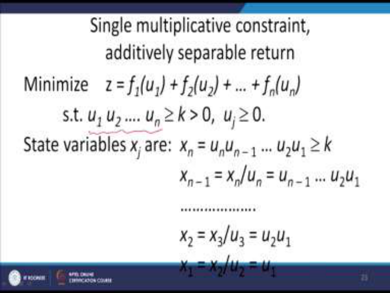

So, that is the way this discrete problem has been dealt with. Now, let us look at another situation where we have a single multiplicative constraint and additive separable written. The problem is to minimize z given by _f1(u1) + f2(u2) + … + fn(un)_ subject to _u1 u2 …. un_  _k_ > 0, 

and uj <u>></u> 0. Now, please note that this constraint is a multiplicative constraint that is it is a product of u1 u2…un and for this reason we have to define the state variables in a slightly different fashion. 

So, the state variables xj can be defined like this, _xn_ = _unun_ – 1 … _u_ 2 _u_ 1  _k_ . Similarly, _xn –_ 1 = _xn_ / _un_ = _un –_ 1 … _u_ 2 _u_ 1 and finally x2 and x1 just as the way we have defined previously. 

**(Refer Slide Time: 27:03)** 

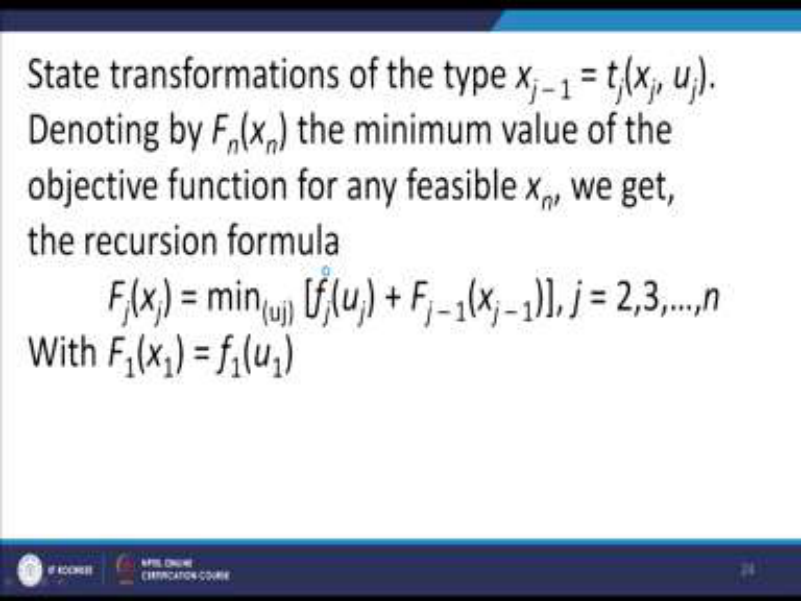

Then, we need to define the state transformation functions of the type _xj –_ 1 = _tj_ ( _xj_ , _uj_ ) denoting by _Fn_ ( _xn_ ) the minimum value of the objective function for any feasible xn, we get the recursive formula _Fj_ ( _xj_ ) = min(uj) [ _fj_ ( _uj_ ) + _Fj –_ 1( _xj –_ 1)], _j_ = 2,3,…, _n_ and _F_ 1( _x_ 1) = _f_ 1( _u_ 1). So, exactly just as in the first example, the only difference here is that where we have the constraint is in terms of product instead of the sum. 

**(Refer Slide Time: 27:52)** 

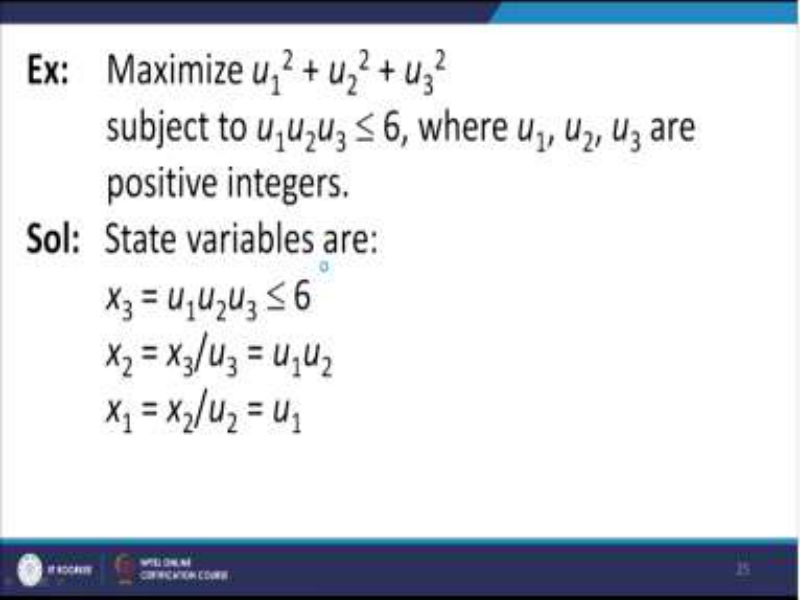

So, let us take an example to understand this. Let us take maximization of _u_ 12 + _u_ 22 + _u_ 32 subject to the product of _u_ 1 _u_ 2 _u_ 3  6 where each of the variables _u_ 1, _u_ 2, _u_ 3 are positive integers. So as before, the state variables are defined as _x_ 3 = _u_ 1 _u_ 2 _u_ 3  6, _x_ 2 = _x_ 3/ _u_ 3 = _u_ 1 _u_ 2 and _x_ 1 = _x_ 2/ _u_ 2 = _u_ 1. 

**(Refer Slide Time: 28:34)** 

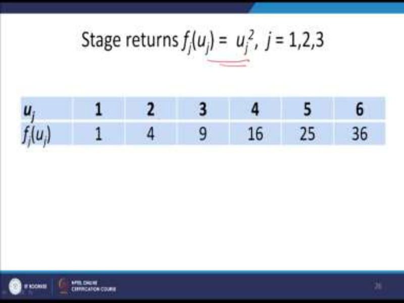

Again, the state returns that is _fj_ ( _uj_ ) can be written as _uj__2_ where j goes from 1, 2 up to 3 and this is the data that is given 1 2 3 4 5 6. So, it is their squares. Remember _fj_ ( _uj_ ) is _uj__2_ so the square of 1 is 1, square of 2 is 4, square of 3 is 9 and like this. **(Refer Slide Time: 28:59)** 

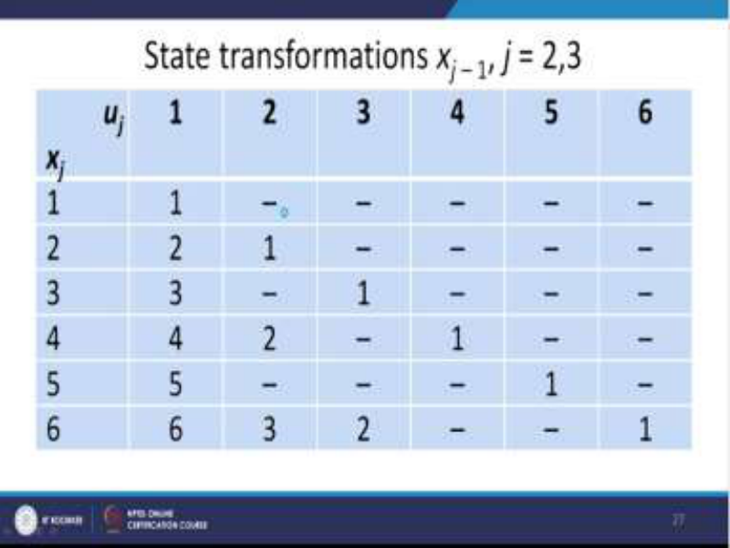

Then, comes the state transformation function that is the _xj –_ 1 where j goes from 2 to 3. Here again in the table, uj is represented at the top row that is 1 2 3 4 5 6 and xj are shown in the column in the first column and the corresponding values that are shown here in the table and those which are not defined, they are shown with the help of a dashed line. 

**(Refer Slide Time: 29:31)** 

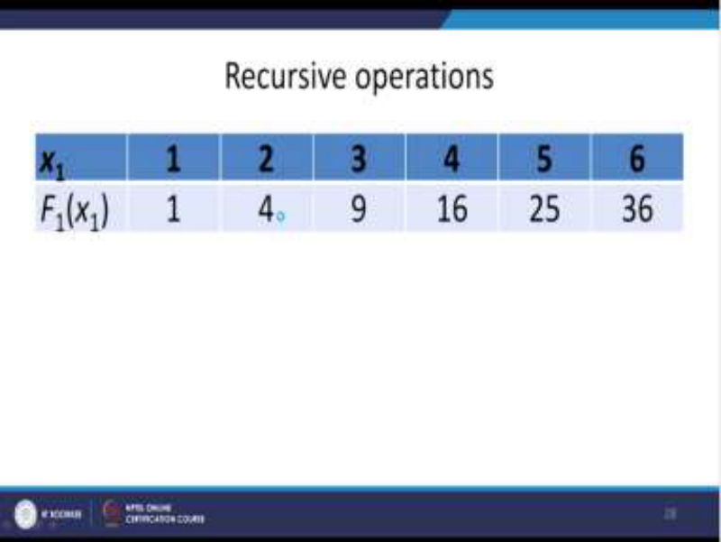

So, the recursive operations are shown here. The x1 and F1(x1) for 1 2 3 4 5 6, this is given in the problem. 

**(Refer Slide Time: 29:43)** 

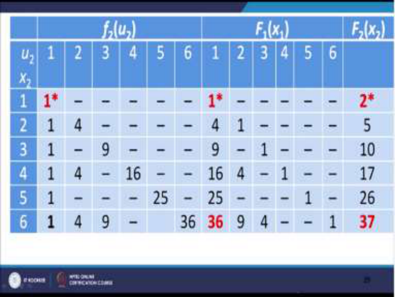

And the table this table illustrates the value of f2(u2) and the value of F1(x1) and F2(x2). So, here we find, you can just verify these values that are shown in the table entries and those which are not defined are shown with the help of the dashed line. 

**(Refer Slide Time: 30:10)** 

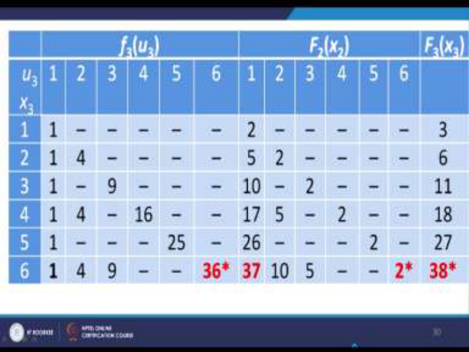

In the second table, we have the f3(u3) and the corresponding f2(u2) and the F2(x2). 

**(Refer Slide Time: 30:18)** 

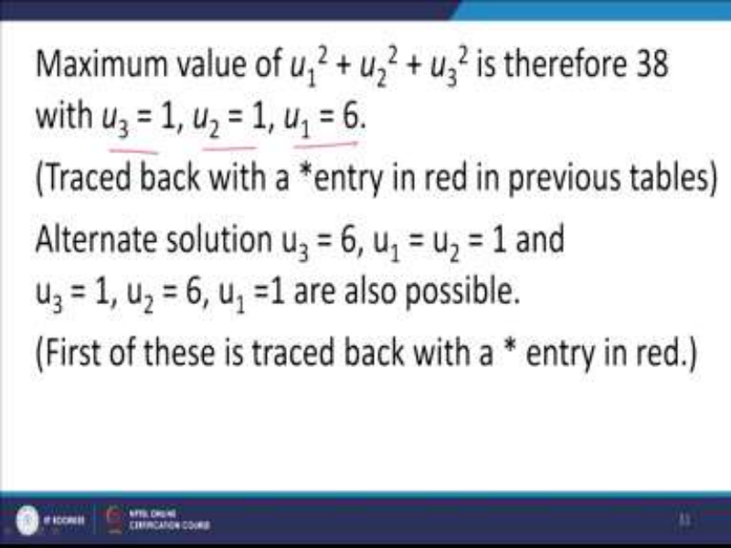

So, the maximum value of _u_ 12 + _u_ 22 + _u_ 32 is 38, which is given by the values _u_ 3 = 1, _u_ 2 = 1, _u_ 1 = 6 and from where does this 38 come from? So, this is the 38. So, let us look at by tracing back. So, this is the place from where they have come, so they are shown in the red entries over here in moving backwards and the corresponding to these red entries and therefore we can say that _u_ 3 = 1, _u_ 2 = 1, _u_ 1 = 6. So, these are traced back from, that is why it is called as a backward recursion and therefore we can say that the solution is obtained as _u_ 3 = 1, _u_ 2 = 1, _u_ 1 = 6. The alternate solution that is u3=6 and u1 and u2 =1 and u3=1, u2=6, u1=1 are also possible. First of these is shown in the tables that I have marked with the red entry. So, in this way, we can solve this problem using dynamic programming. 

So, with this we come to an end of this lecture on dynamic programming where we have studied the principle of optimality and we have seen some examples how we can use them to solve the dynamic programming problem. Thank you. 

