# **Operations Research Prof. Kusum Deep Department of Mathematics Indian Institute of Technology – Roorkee** 

# **Lecture - 28 Transportation Problem** 

Good morning students. This is lecture number 28; the title is the transportation problem. As you probably have learnt in the modeling part that transportation problem is a specialized kind of a linear programming problem. So let us look at the flow of this talk. First, we will define what is the transportation problem and then the transportation algorithm in which we will look at the three methods for finding initial basic feasible solution. 

**(Refer Slide Time: 00:59)** 

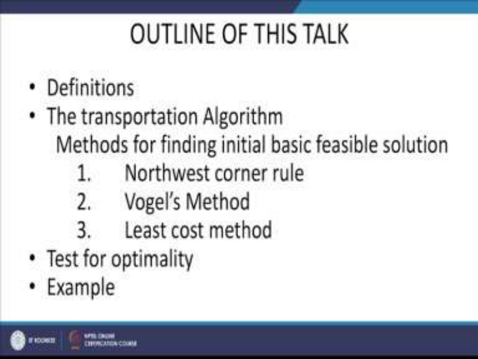

These three methods are the Northwest corner rule, the Vogel's method and the least cost method and then the test for the optimality and finally an example. 

**(Refer Slide Time: 01:13)** 

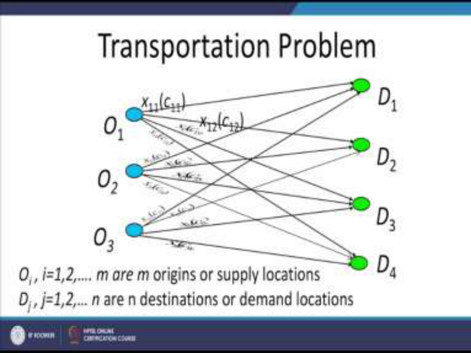

So the definition of the transportation problem is as follows that there are let us suppose O1, O2, O3 some origins and in general there could be m number of origins or supply locations and on the other hand we have D1, D2, D3, D4 and in general there could be n number of destinations or demand locations. 

Now there is a product which has to be supplied from the sources to the definitions and the cost for supplying the commodity from the ith source to the jth destination is given in terms of a matrix cij. We are required to determine the number of units that should be transported that is xij’s, the number of units to be transported from ith source to the jth destination in such a way that the overall cost is minimized. 

**(Refer Slide Time: 02:17)** 

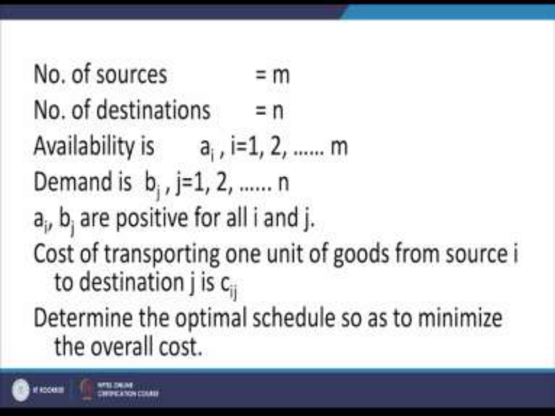

So, let us suppose that the sources are m in number, destinations are n in number, the availability at the origins is given by ai, i goes from 1, 2 up to m and the demands at the 

destination is given by bj, j=1, 2, n and of course ai’s and bj’s should all of them be positive for all i and j. The cost of the transporting 1 unit of the goods from the ith source to the jth destination is cij and this should be a real number. We need to determine the optimum schedule so as to minimize the overall cost. 

**(Refer Slide Time: 03:04)** 

Now if this condition is satisfied that the a1 + a2+…. + am = b1 + b2 + …. + bn, then it is said to be a balanced transportation problem. However, if this is not satisfied then it is said to be as a unbalanced problem and in order to convert a unbalanced transportation problem into a balanced transportation problem, we need to add fictitious sources and destinations in such a way that their costs are assigned as 0. 

**(Refer Slide Time: 03:44)** 

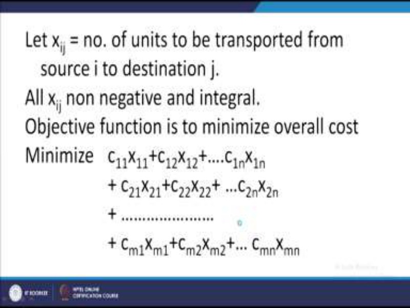

So the model for the transportation problem looks like this. Let xij be the number of units to be transported from ith source to the jth destination. All xij’s should be non-negative and should be integral. The objective function is to minimize the overall cost that is minimize c11x11+c12x12+….c1nx1n etc and like this up to + cm1xm1+cm2xm2+… cmnxmn. So this is the overall cost of the problem. 

**(Refer Slide Time: 04:28)** 

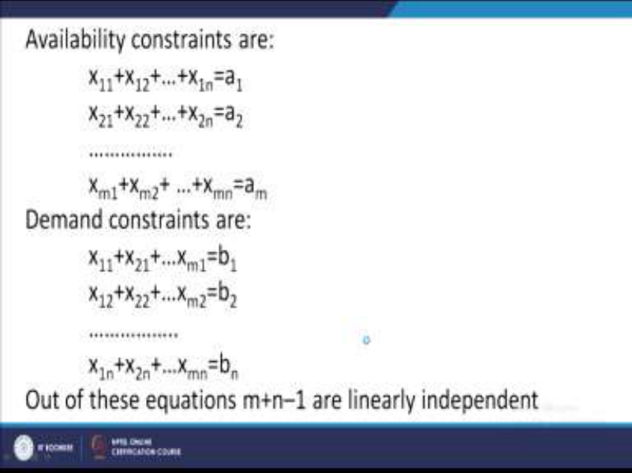

Now there are two sets of constraints, one are called the availability constraints. This is the 

row sums should be equal to the a1, a2’s and the second set of constraints is the demand constraints that is the column sum should be equal to b1, b2’s. Out of these equations, m+n-1 are linearly independent which can be verified. 

**(Refer Slide Time: 04:55)** 

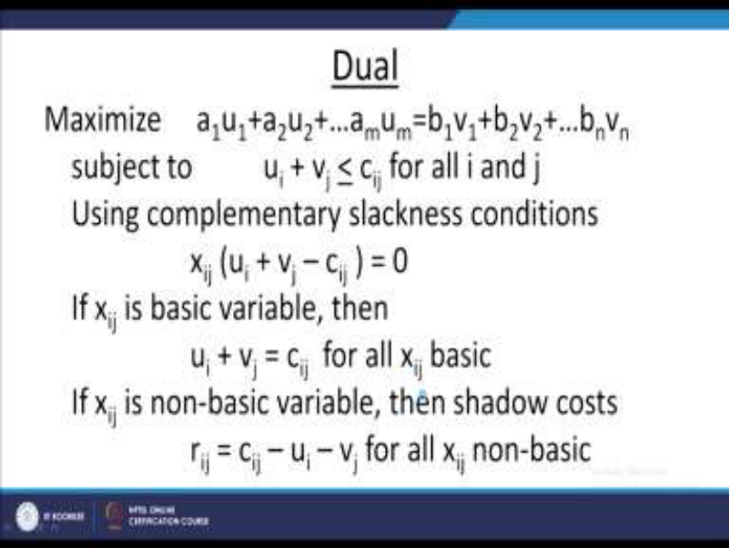

Now the dual of this transportation problem can also be written as maximize a1u1+a2u2+…amum=b1v1+b2v2+…bnvn subject to ui + vj <u><</u> cij for all i and j. Using the complementary slackness conditions, xij (ui + vj – cij ) = 0. So if xij is a basic variable, then that means it is nonzero. If xij is a basic variable, it is nonzero. This means that the second factor  ui + vj = cij  for all xij basic . However, if xij is non-basic variable then the shadow costs given by rij = cij – ui – vj for all xij non-basic. So the dual as you know is corresponding to what the primal is, so we have written the dual of the primal transportation problem and this is the conditions we get for the basic variables and the non-basic variables. 

# **(Refer Slide Time: 06:19)** 

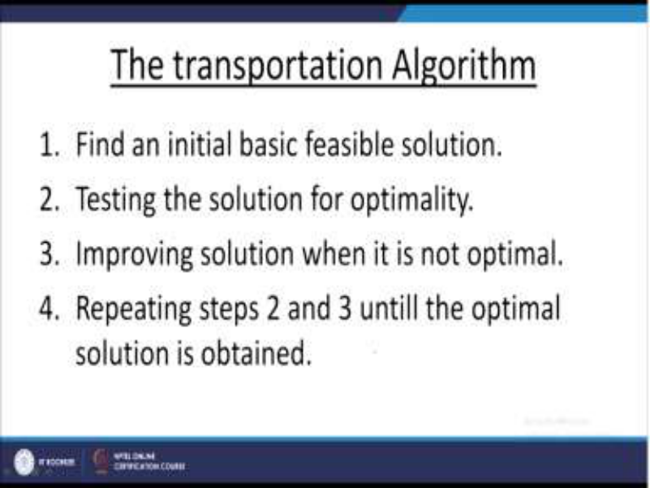

Now the transportation algorithm has the following four steps. Number 1, we need to find an initial BFS to initiate the algorithm. Second step is test the solution for optimality, third improving the solution when it is not optimum and repeating step number 2 and 3 until the optimum solution is obtained. 

# **(Refer Slide Time: 06:43)** 

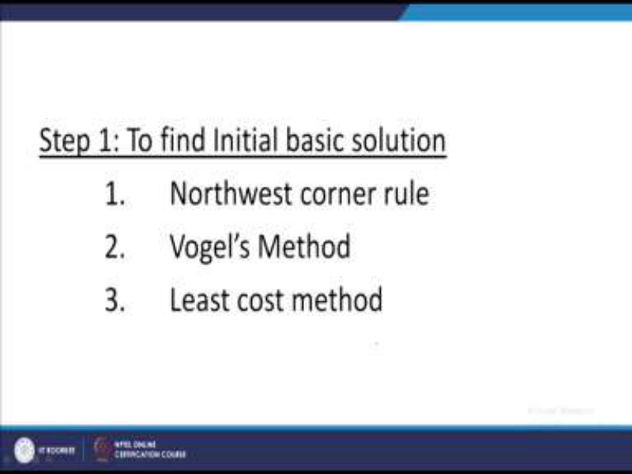

So let us look at the first step that is to find the initial BFS that is to be used for the transportation algorithm. There are three popular ways in finding out the initial BFS and we will study each of the three methods. 

**(Refer Slide Time: 07:04)** 

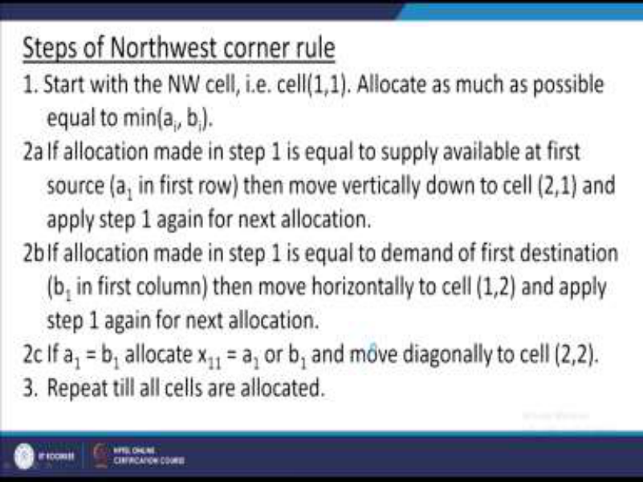

So first of all the Northwest corner rule. Now there are following steps of this method. Number 1, start with a Northwest rule, Northwest rule means the top left-hand corner cell that is the cell number (1, 1) and allocate as much as possible equal to the minimum of ai and bj. Step number 2a, if allocation made in step number 1 is equal to the supply available at the first source then a1 is in the first row, then move vertically down to cell number (2, 1) and apply step 1 again for the next allocation. However, if the allocation made in step number 1 is equal to the demand of the first destination, then move horizontally to the cell (1, 2) and apply step 1 again for the next allocation. 

If the a1=b1, then allocate x11=a1 or b1 and move diagonally to cell number (2, 2). Repeat till all cells are allocated. 

**(Refer Slide Time: 08:33)** 

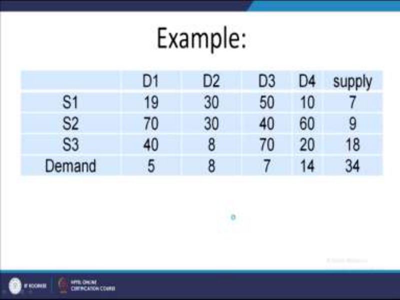

So look at this example, we have 3 sources and 4 destinations and the supplies and demands 

are also shown in the last column and the last row. 

# **(Refer Slide Time: 08:46)** 

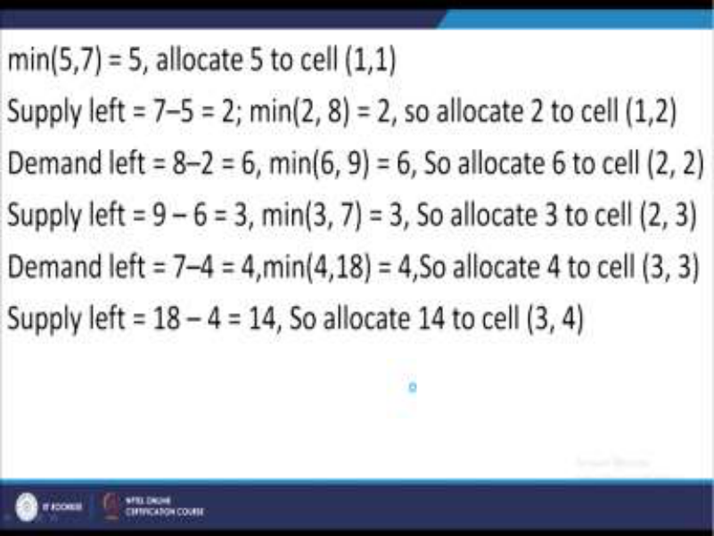

So we will perform this Northwest corner rule, so minimum of 5 and 7 is 5, so allocate 5 to cell number (1, 1). The supply left is 7-5=2 and the minimum of 2 and 8 is 2 so allocate 2 to cell number (1, 2). Now the demand left is 8-2 which is 6 and the minimum of 6 and 9 is 6; So allocate 6 to cell number (2, 2). Supply left is 9-6 which is=3 and the minimum of 3 and 7 is 3, so allocate 3 to cell number (2, 3). Demand left is 7-4 which is=4 and the minimum of 4 

and 18 is 4, so allocate 4 to cell (3, 3) and supply left is 18-4 which is=14, so allocate 14 to cell number (3, 4). 

**(Refer Slide Time: 09:48)** 

So this is the final table that you get after applying all these steps, so allocation is also shown in the various cells that we have traversed through. Now once you have done this, then you need to obtain the objective function value that is the cost. So the cost is corresponding to the cij’s that is given and the amount of allocation. So 5*19+2*30+6*30+3*40+4*70+14*20 which turns out to be 1015. 

**(Refer Slide Time: 10:30)** 

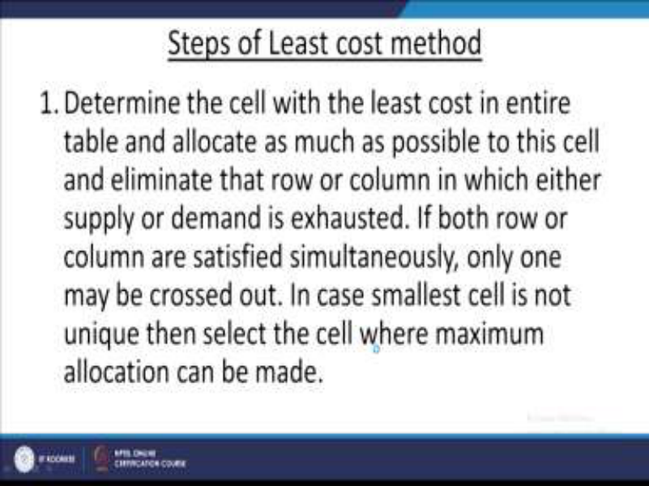

Next method is the Least cost method. Its steps are as follows. Number 1, determine the cell with the least cost in the entire table that is the overall minimum and allocate as much as possible to this cell and eliminate that row or column in which either the supply or the 

demand is exhausted. If both row and column are satisfied simultaneously, only one may be crossed out. In case, the smallest cell is not unique, then select the cell where the maximum allocation can be made. 

**(Refer Slide Time: 11:09)** 

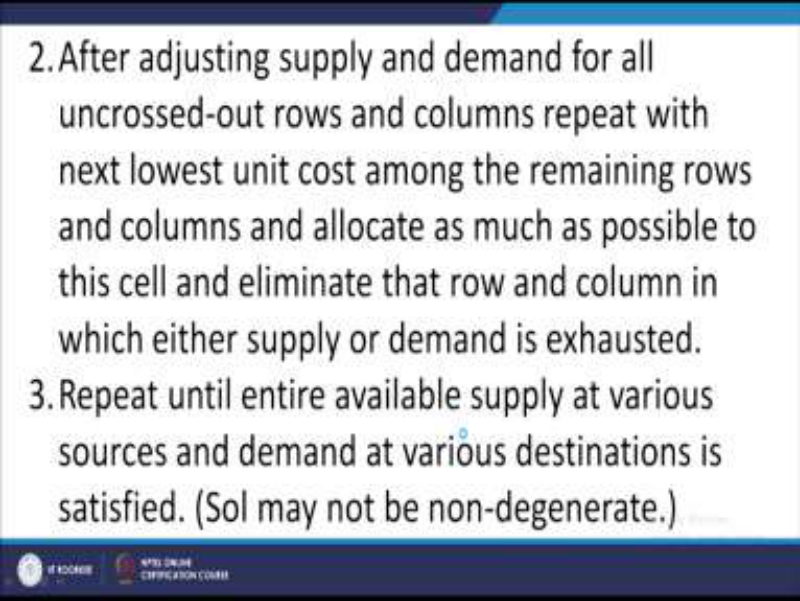

Step number 2, after adjusting the supply and demand for all uncrossed-out rows and columns, repeat with the next lowest unit cost among the remaining rows and columns and allocate as much as possible to this cell and eliminate that row and column in which either supply or demand is exhausted. 

Step number 3, repeat until entire available supply at various sources and demand at various destinations is satisfied. 

# **(Refer Slide Time: 11:47)** 

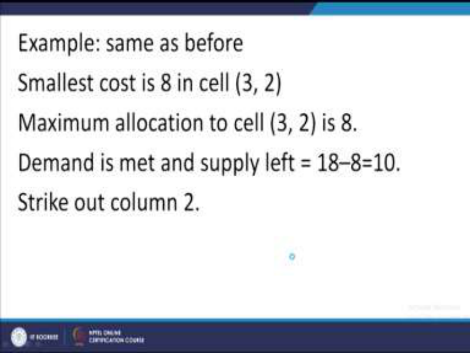

Now the example is same as before. We find that the smallest cost is 8 which is given in cell number (3, 2) and the maximum allocation to cell (3, 2) is 8 while looking at the demand and the supply. So demand is met and supply left is 18-8 which is coming out to be 10. So we need to strike out column number 2. This is what it looks like. 

**(Refer Slide Time: 12:14)** 

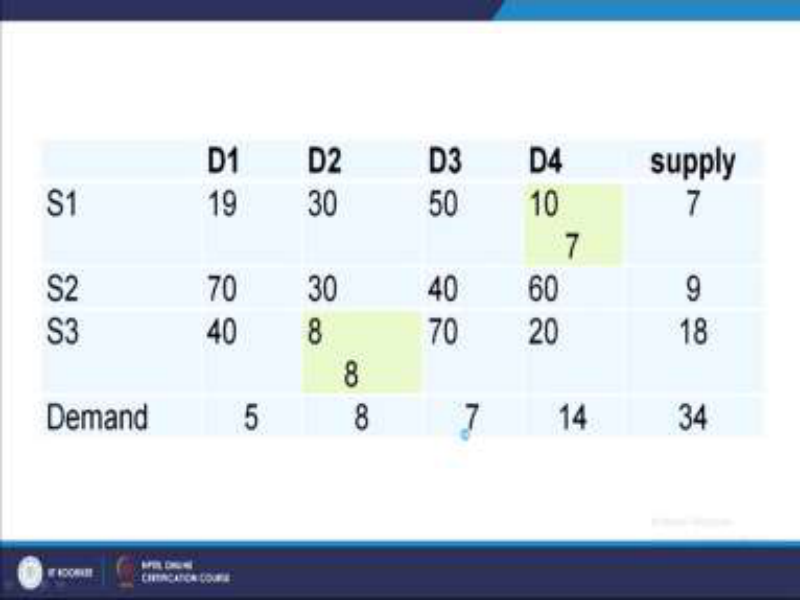

**(Refer Slide Time: 12:20)** 

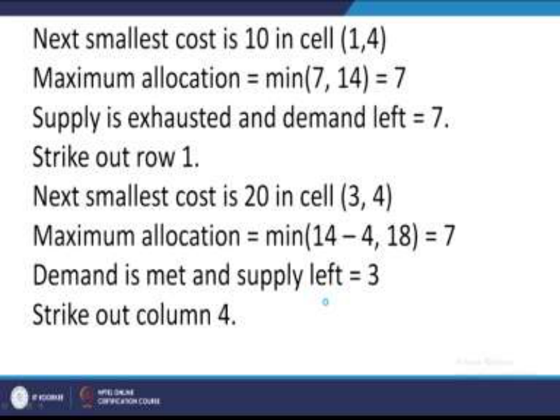

Now, the next smallest cost is 10 in cell number (1, 4) and the maximum allocation is minimum of (7, 14) which is 7. Supply is exhausted and demand left is 7. Strike out row number 1 and the next smallest cost is 20 in cell (3, 4). Maximum allocation is minimum of (14-4) and 18 which is coming out to be 7 and demand is met and supply left is 3, so strike out column number 4. 

**(Refer Slide Time: 13:00)** 

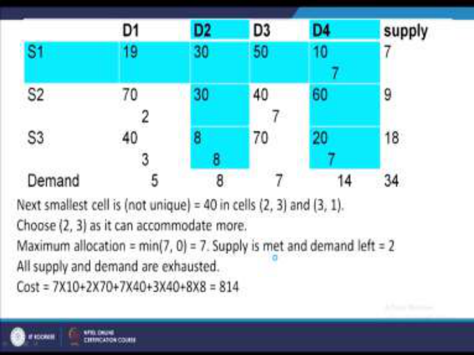

So, here we have the strike out columns. So the demand the next smallest cell is not unique it is equal to 40 in cell number (2, 3) and (3, 1). So we choose (2, 3) as it can accommodate more. The minimum allocation is minimum of (7, 9) which is 7 and the supply is met and demand left is 2. So all supply and demand are exhausted and therefore the cost that is obtained using this method is 814. 

**(Refer Slide Time: 13:44)** 

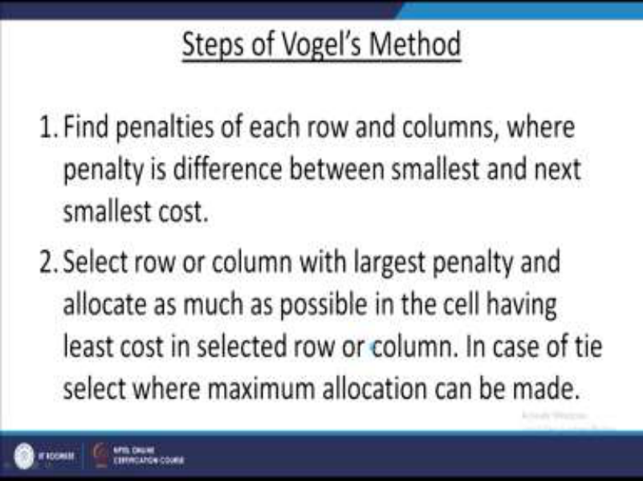

Then, the third method that is the Vogel’s Method, we need to find out the penalties of each row and column where penalty is difference between the smallest and the next smallest cost. So we have to calculate the penalties and write down that in the last column. Now step number 2 says select the row or column with largest penalty and allocate as much as possible in the cell having least cost in selected row or column and in case there is a tie, select where maximum allocation can be made. 

**(Refer Slide Time: 14:25)** 

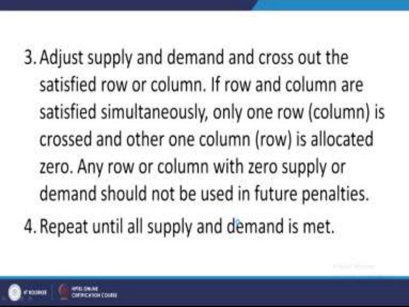

Step number 3, adjust the supply and demand and cross out the satisfied row or column. If the row and column are satisfied simultaneously, only one row or column is to be crossed out and the other one that is the column of the row is allocated 0. Any row or column with 0 supply or demand should not be used in the future penalties and this we have to repeat until all 

supplies and demands is met. 

**(Refer Slide Time: 14:59)** 

So in this table, the example is the same. We have written the penalties according to the conditions given in the algorithm that is the difference between the smallest and the next smallest and then do the allocation as has been indicated. **(Refer Slide Time: 15:18)** 

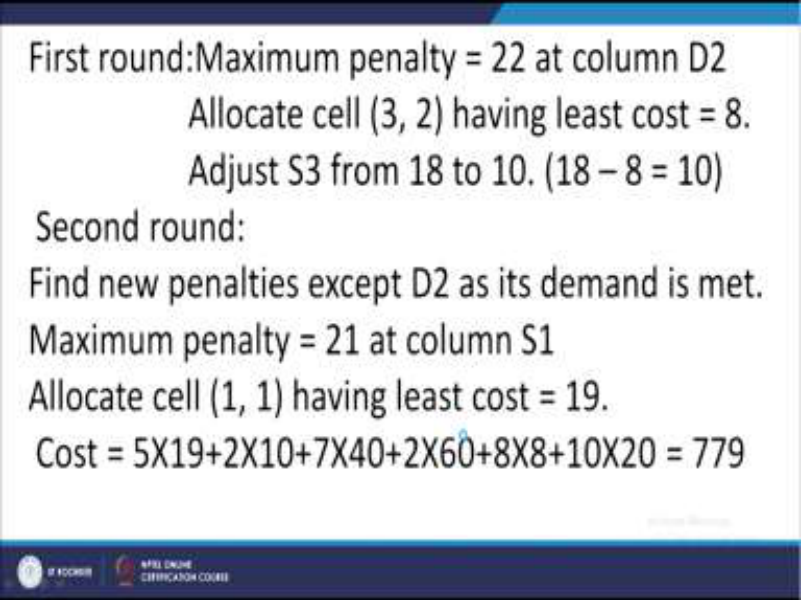

So in the first round, maximum penalty is 22 at column D2. So therefore, we allocate cell (3, 2) having least cost which is 8 and adjust S3 from 18 to 10 which gives me 18-8 which is 10 and in the second round find the new penalties except D2 as its demands is already met. So maximum penalty is 21 at column S1, allocate cell (1, 1) having least cost which is 19 and like this the entire process has to be completed. The cost that you get is 5X19+2X10+7X40+2X60+8X8+10X20 which comes out to be 779. Now you will observe that no matter which method you use, you will get different BFS and of course their objective function will also be different and the idea is that we need to use these methods to get an initial BFS. 

**(Refer Slide Time: 16:37)** 

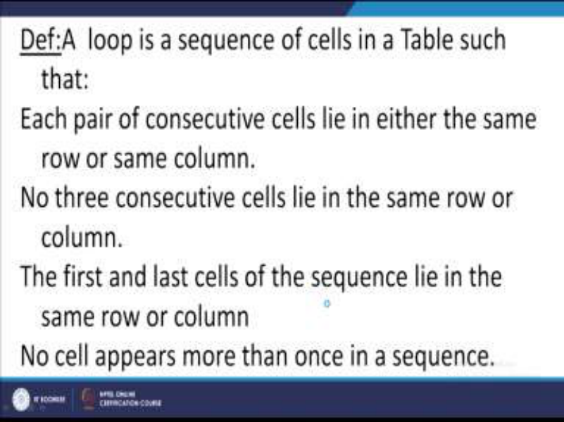

So now we will use the next step of the algorithm but before that we need to define what is called as a loop. A loop is a sequence of cells in a table such that the following conditions 

hold. Each pair of consecutive cells lie in either the same row or same column and no three consecutive cells lie in the same row or column; and the first and the last cells of the sequence lie in the same row or column. No cell appears more than once in a sequence, so this is the way a loop is defined. 

**(Refer Slide Time: 17:17)** 

As an example, in this table we have the following cells (1, 2) (1, 4) (2, 4) (2, 6) (4, 6) (4, 2); this is a loop because it is satisfying all the conditions of the loop. 

**(Refer Slide Time: 17:34)** 

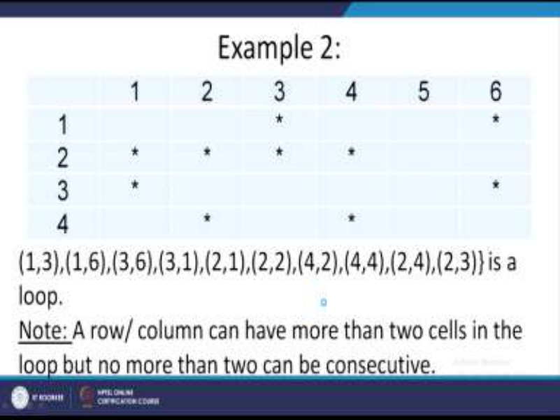

In the example number 2, these are the cells that have been indicated, they are also a loop and a row or a column can have more than two cells in the loop but no more than two can be consecutive. So these are the two examples of a loop. 

**(Refer Slide Time: 17:56)** 

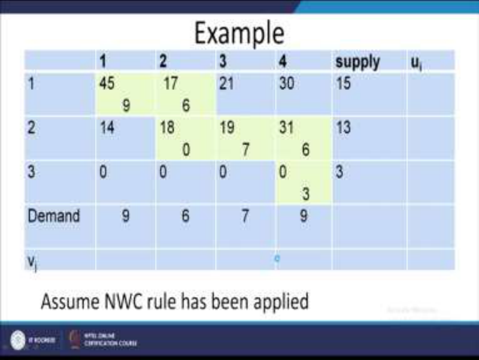

So, let us take this example and we assume that the Northwest corner rule has been applied and this is the BFS that we get. 

**(Refer Slide Time: 18:09)** 

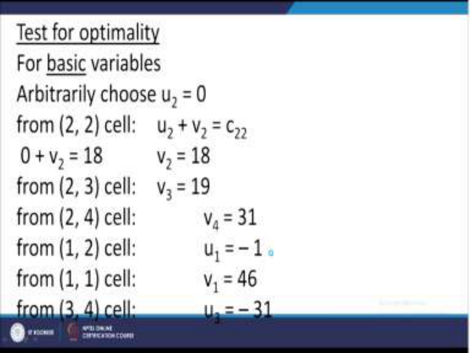

So, we now need to look at the second step of the algorithm that is testing the optimality of this BFS that we have got using the Northwest corner rule. So we will segregate the basic variables and the non-basic variables. So for the basic variables, we will arbitrarily choose one let us say u2 and put it equal to 0. So from the cell (2, 2) we obtain the condition u2 + v2 = c22  and which means that 0 + v2 = 18 which gives me v2=18. 

Similarly, from cell (2, 3); we get v3=19; from cell (2, 4) we get v4=31; from cell (1, 2) we get u1= -1 and from cell (1, 1) we get v1=46 and from cell (3, 4) we get u3= -31. **(Refer Slide Time: 19:13)** 

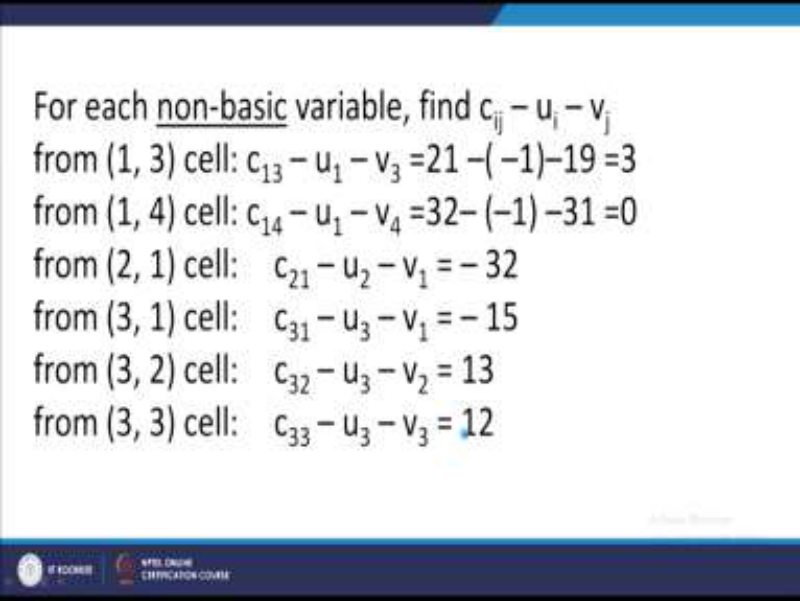

For each non-basic variable, we use the conditions by finding out this cij – ui – vj that is the rij’s. So from cell (1, 3) we get c13 – u1 – v3 which comes out to be 3; from cell (1, 4) we get c14 – u1 – v4 which is 0 and similarly from cell (2, 1) we get -32, from cell (3, 1) we get -15, from cell (3, 2) we get 13, from cell (3, 3) we get 12. So these are the values of cij – ui – vj. 

**(Refer Slide Time: 20:04)** 

This is shown here in this table and we find that at least one cij is negative, so this is not optimum. The optimality condition is that all the cij’s should be positive. 

**(Refer Slide Time: 20:20)** 

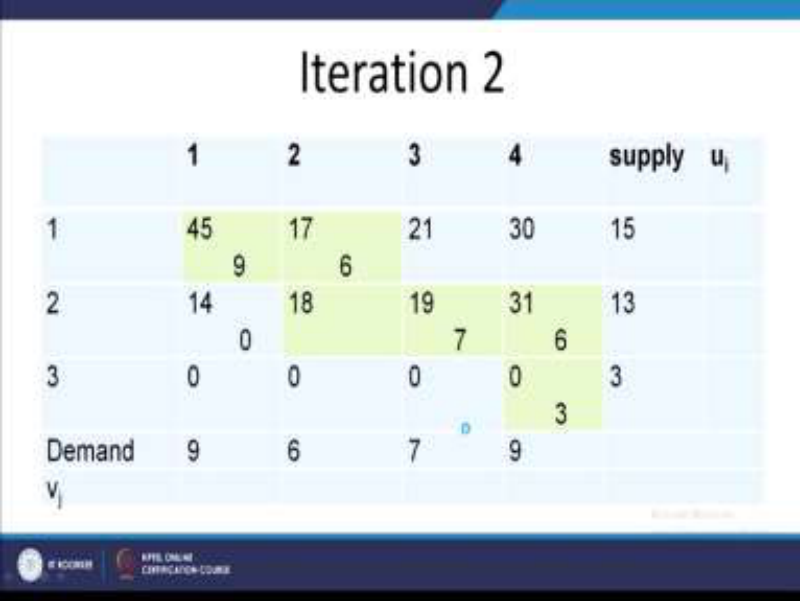

So we have to apply another iteration and this is the table that we get after the next iteration. 

**(Refer Slide Time: 20:30)** 

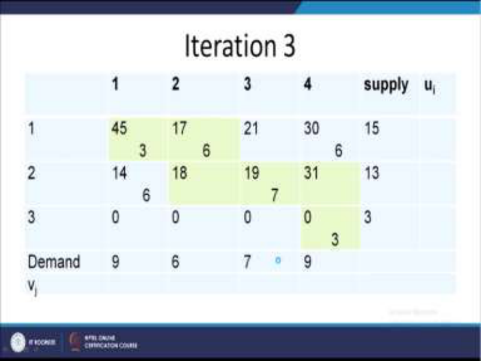

Again, the next iteration is shown here. In iteration number 3, the entire process is repeated and for the basic and the non-basic variables. 

**(Refer Slide Time: 20:45)** 

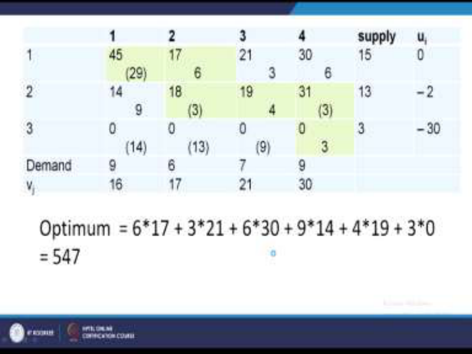

So I leave it as an exercise for you to verify the results and we find that in this table, the optimum is given by 547 which is obtained by 6*17 + 3*21 + 6*30 + 9*14 + 4*19 + 3*0. 

**(Refer Slide Time: 21:08)** 

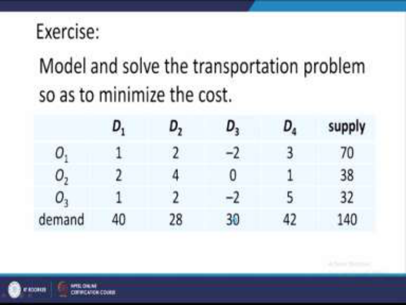

So with this we complete this example to understand how the transportation algorithm is implemented. So as an exercise here is a model, I would like you to solve this transportation problem so as to minimize the cost. You have 3 origins and 4 demands and the availabilities and the supplies; and the demands are given and as you can see that this is a balanced problem because the summation of the supplies and the demands is 140. 

So please do this as an example to understand this method. So with this, we come to an end of this topic on transportation algorithm. Thank you. 

