# **Operations Research Prof. Kusum Deep Department of Mathematics Indian Institute of Technology dash Roorkee** 

# **Lecture – 30 Case Studies and Quiz** 

Hello students, so this is lecture number 30 and we are going to study some case studies and examples based on the special types of LPPs and I will also give you some questions which are short answer type and then I will give you the solution to that as well. 

**(Refer Slide Time: 00:49)** 

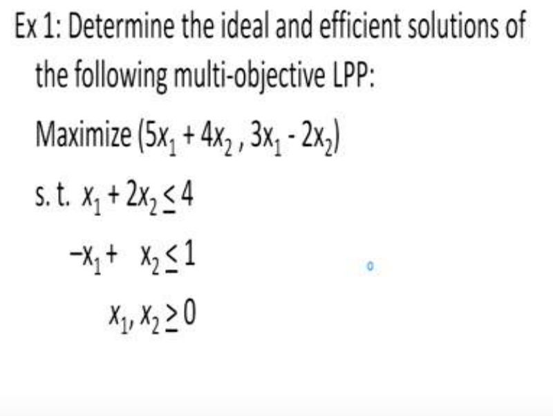

So let us begin here is the first question which says that we have supposed to determine the ideal and the efficient solutions of the following multi objective linear programming problem. Now as you know that this is a case of a multi objective optimization problem where there are two types of solutions that is the ideal solutions and the efficient solutions. So here we have two objective functions which are to be maximized first one is 5 _x_ 1 + 4 _x_ 2 and the second one is 3x1 - 2x2 they are subject to the constraints _x_ 1 + 2 _x_ 2 <u><</u> 4 and –x1 + x2 <u><</u> 1 and this is subject to also the constraints that is _x_ 1, _x_ 2 <u>> 0.</u> 

**(Refer Slide Time: 01:56)** 

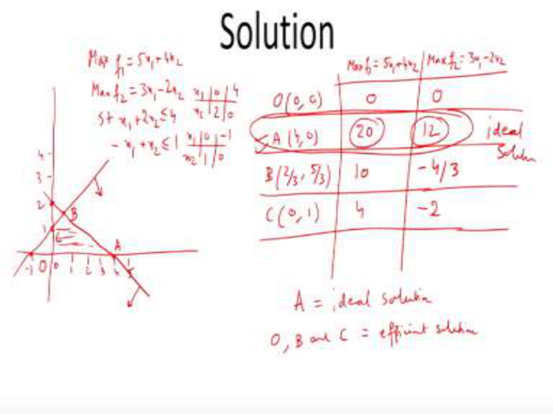

So, let us look at the solution of the problem so let us first of all look at the feasible region, so the feasible region is shown like this we need to write down the constraints like this. So the two functions are maximized f1=5 _x_ 1 + 4 _x_ 2 and the second one is maximized f2=3x1 - 2x2 subject to the constraint _x_ 1 + 2 _x_ 2 <u>< 4, –x1 + x2 < 1. Now hope you remember how we plot these constraints. So</u> the first constraint passes through the point (0, 2) and (4,0). The second constraint it passes through the points (0, 1) and (-1, 0). So let us plot these two points so (0, 2) and (4, 0), we need to draw a straight line passing through these two points and as per the < sign of the constraint it means that the feasible region is below the line. Similarly the second constraint should pass through (0, 1) and (-1, 0) this point. So therefore we need to draw a straight line which passes through these two points. And as per the < sign the feasible region is below the line so this is our feasible region. So let us write down the feasible region (0, 0) this is the point O then the point A which is given by (4, 0) and the 3rd point is the point B this point is the intersection of the two lines and you can verify that the intersection of these two lines is given by (2/3, 5/3); this you can obtain by solving the two equations and finally the point C which is given by (0, 1). So these are the four points which are showing the feasible region. Next let us look at the two objective functions so we have to maximize f1 which is given by 5x1 + 4x2 and similarly the second objective function maximize of f2=3x1-2x2; so just as we do for the single variable problem exactly in the same way we will evaluate the objective function at each of these points the both the objective functions. 

So the first (0, 0) will give you the f1 value as 0, the A point will give you 20; the B point will give you 10 and C will give you 4. So what do we find since we have to maximize it so therefore the maximization occurs at the point A because the objective function is maximum over here. Similarly in the second objective function, the value of the objective function at O is 0, at A is 12, at B is -4/3 and at C it is -2. So this tells us that if you look at all these values you find 12 is the largest. And since we have to maximize it so this tells us that again the optimum solution is obtained at the point A given by (1, 0). So therefore the problem was to find out the points at which we have the ideal solution and the efficient solutions. So you can see that A is the point where you have a ideal solution because both the objective functions are giving us the maximum value Or the optimum value corresponding to each of the objective functions. However, the other points that is O,B and C they are giving us the efficient solutions. So what do we see that the point A is giving us the ideal solution because it is maximizing both the objective functions. So therefore A is the ideal solution whereas the remaining points that is O,B and C they are giving us the efficient solutions. 

So this is the way to solve a multi objective optimization problem. 

**(Refer Slide Time: 08:37)** 

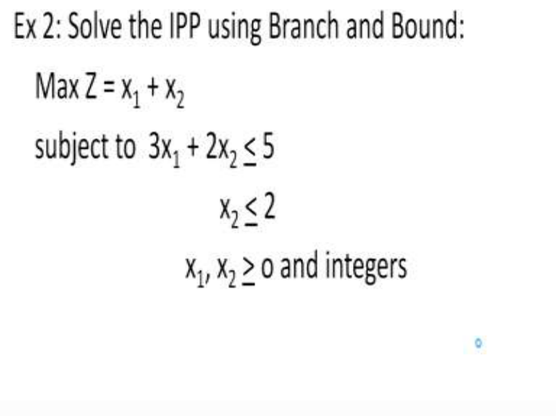

Now the second problem that I am going to solve is about the integer programming problem using the branch and bound method so here we have the problem, it is a two variable problem we 

have to maximize Z given by x1 + x2 subject to the condition 3x1 + 2x2 <u>< 5 and x2 < 2 and x1 and</u> x2  > 0 and both should be integers. 

**(Refer Slide Time: 09:14)** 

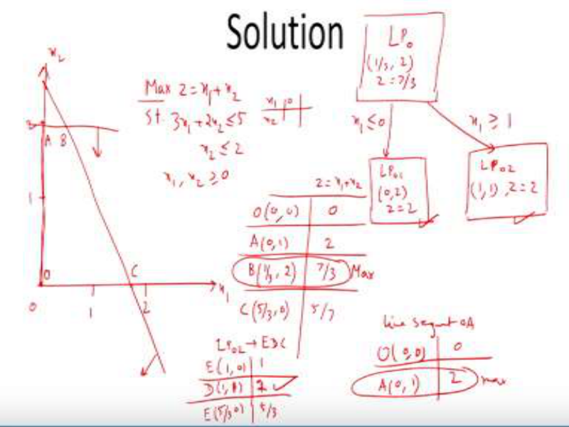

So let us see how to solve this problem; so again we need to plot the feasible region to understand how the feasible region looks like. So on the x-axis we have x1 and on the y-axis we have x2. So let us plot the values 0, 1 and 2, 0 1 and 2. The problem that is given to us is maximize Z = x1 + x2 subject to the condition 3x1 + 2x2 <u>< 5, x2 < 2, x1 and x2 > 0. So first of all</u> we will solve the LP0 remember what we have to write it in the form of a tree that is the base that is the LP0. We need to find out what is its solution, therefore we need to first plot this constraint and as before x1 is 0 then x2 is to be obtained like this and similarly I will just leave this as an exercise so we will plot this like this there are two points over here, this point and this point so they have to be joined together and obviously because of the inequality constraint the region is below the line. 

Similarly the second constraint that is x2 <u>< 2 ,so this is also below the line and now we have the</u> feasible region as O,A,B and C. So therefore what we have to see the value so O is given by (0, 0) and the value of z is x1 + x2 so it is 0; A is the point (0,1) it is giving objective function value 2 similarly B is the point (1/3, 2) which is giving 7/3 and C is the point (5/3, 0) which gives us 5/3. So the maximum occurs at the point B. So therefore our LP0 is giving us a solution (1/3, 2) with objective function value 7/3. Now since the first component x1 is not a integer therefore we need to do the bifurcation like this. So the bifurcation is as follows, x1 should be < 0 and x1 should be 

<u>> 1. And when we solve these two conditions with these two LP’s so the feasible region for the</u> LP01 is given by the line segment OA. And as you know that there are only two points the line segment OA; it constitutes of two points (0, 0) having an objective function value 0 and A has the objective function value (0, 1) which gives us 2 and the maximum value is obtained at the point A, so A is the solution. Therefore for LP01 the solution is (0, 2) and Z=2. Similarly, we will solve the other constraint which is LP02, now LP02 is having the feasible region as E,D,C. The value of E is (1, 0) which gives us again 1, D is (1, 1) which gives us 1 and E is (5/3, 0) which gives us 5/3; so this tells us that the solution is again at the point D. So the solution is (1, 1) with objective function value 2. Therefore what we conclude, we conclude that all the nodes that is LP01 and LP02 have obtained integer solutions and therefore we can conclude that the problem has been solved. 

So we find that the both these solutions are giving us the objective function value as 2. Therefore it means that the solution is at both these two points. 

**(Refer Slide Time: 15:56)** 

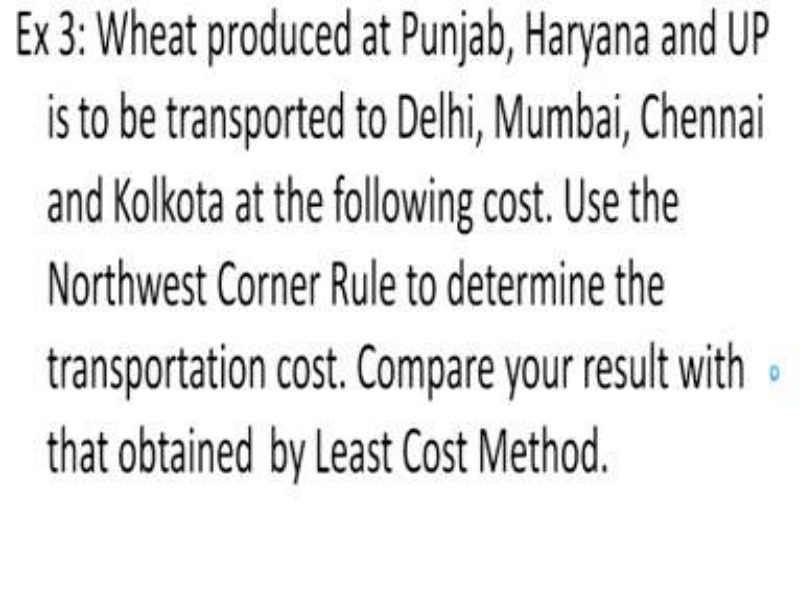

Next let us solve another example 3, this is a transportation problem so the problem says that wheat is produced at Punjab, Haryana, UP is to be transported to the cities Delhi, Mumbai, Chennai and Kolkata using the following cost, cost is given to us. We have to use the northwest corner rule to determine the transportation cost and compare our results with that obtained by the least cost method. 

Now as you remember that in the transportation problem I told you that it is you have to first find a BFS and there are three ways to find out the BFS that is the least cost method, the northwest corner rule and the Vogel’s approximation method. So once you get the initial BFS then you have to apply the test for optimality. So in this exercise we are supposed to obtain the BFS using the northwest corner rule and compare our result with the Least cost method. 

**(Refer Slide Time: 17:13)** 

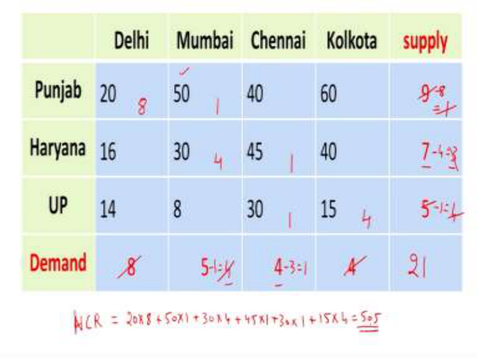

Now the data that has been given to us is as follows, it is shown here in this table. At the top we have Delhi, Mumbai, Chennai, Kolkata and at the left hand side is the Punjab, Haryana, and UP. The data that has been given to us is 20 50 40 60,16 30 45 40, 14 8 30 and 15; also the data says that the supply at the sources that is the Punjab, Haryana, and UP is given that is 9,7 and 5 and the demand is also given as 8,5,4 and 4. 

So we have now to solve this problem that is we have to obtain its BFS using the northwest corner rule. So how to first of all we need to check whether this is a balanced problem or not so we need to add up 8+5 is 13 and 4 so how much is that and how much is 9,7 and 5 so this is 21. Both these give us the value as 21 which means that this is a balanced transportation problem. So in order to implement the northwest corner rule. First we have to look at 8 and 9. 8 is the demand in Delhi and the supply in 9. So the minimum of the two has to be chosen so minimum is 8 so therefore 8 will come over here and this is striked off from 9 we have to 9-8, so this gives us 1. Then we move to the next cell that is this cell Mumbai, Punjab. Now this cell tells us that we have to compare 1 and 5 so out of 1 and 5 minimum is 1. 

So, 1 will come in this cell and this 1 will be deleted and 5-1 will give us 4. Then we have to come to the bottom cell over here that is the Haryana and Mumbai. So we compare the value 4 and 7 which gives us 4 so therefore 4 comes here and this is satisfied and 7-4 is 3 then we compare 3 and 4 this 3 and this 4 so this tells us that minimum is 3. So this is satisfied and 4-3 is 1 so here this is 1 and this is 1. 

Then that means we have to compare with 1 and 5, and 1 and 5 means 1 so this is 5-1 that is 4. And now we are left with 4 supply and 4 demand and therefore both will be satisfied and this will come over here. So this means that using the northwest corner rule the cost is as follows 20*8+50*1 and 30*4+45*1+30*1+15*4 and if you calculate this you should get 505. So this is the cost that you get using the northwest corner rule. 

Now in the problem it says that we have to compare our results with the least cost method. So this I will leave as an exercise for you to carry out. And in fact you should also calculate using the third method that is the Vogel’s approximation method. 

**(Refer Slide Time: 21:41)** 

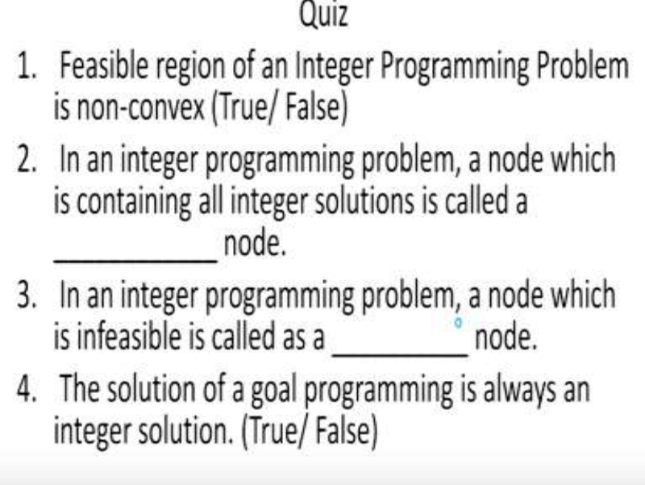

So, now we come to the quiz of this topic so here are some questions and I want you to write down the answers in your notebooks. So the first question says the feasible region of an integer programming problem is non-convex; true or false. Number 2, in an integer programming problem, a node which is containing all integer solutions is called as a ____ node. Question 

number 3, in an integer programming problem, a node which is infeasible is called as a ____ node. Question number 4, the solution of a goal programming problem is always an integer solution; true or false. 

**(Refer Slide Time: 23:38)** 

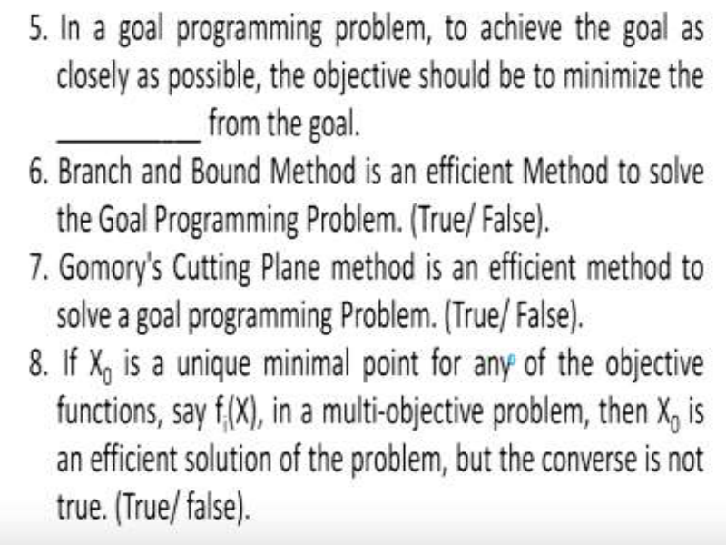

Question number 5, in a goal programming problem to achieve the goal as closely as possible the objective should be to minimize the _____ from the goal. Question number 6, the branch and bound method is an efficient method to solve the goal programming problem; true or false. Question number 7, Gomorys cutting plane method is an efficient method to solve a goal programming problem; true or false. 

Question number 8, if X0 is a unique minimal point for any of the objective functions say fi(X) in a multi-objective optimization problem then X0 is an efficient solution of the problem but the converse is not true; true or false. 

**(Refer Slide Time: 26:05)** 

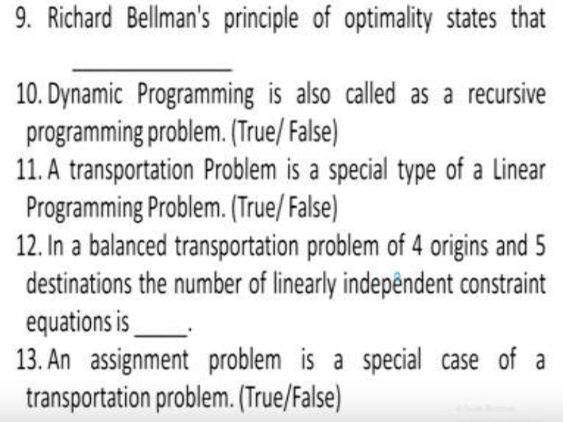

Question number 9, Richard Bellman’s principle of optimality states that _____. you have to write the principle. Question number 10, dynamic programming problem is also called as a recursive programming problem; true or false. Question number 11, a transportation problem is a special type of a linear programming problem; true or false. Question number 12, in a balanced transportation problem of 4 origins and 5 destinations the number of linearly independent constraint equations is ______.  Question number 13, an assignment problem is a special case of a transportation problem; true or false. 

**(Refer Slide Time: 28:15)** 

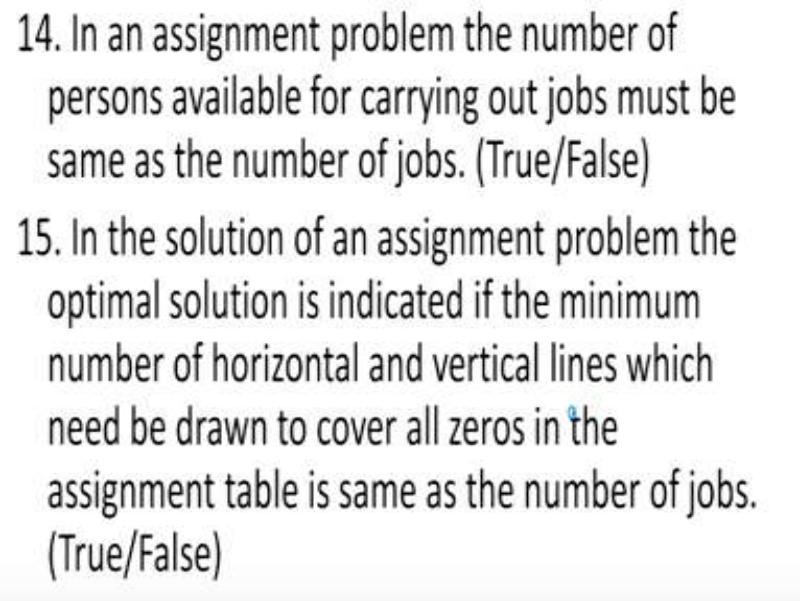

Question number 14, in an assignment problem the number of persons available for carrying out jobs must be the same as the number of jobs; true or false. Question number 15, in this solution 

of an assignment problem the optimal solution is indicated if the minimum number of horizontal and vertical lines which need to be drawn to cover all 0’s in the assignment table is the same as the number of jobs; true or false. 

**(Refer Slide Time: 29:49)** 

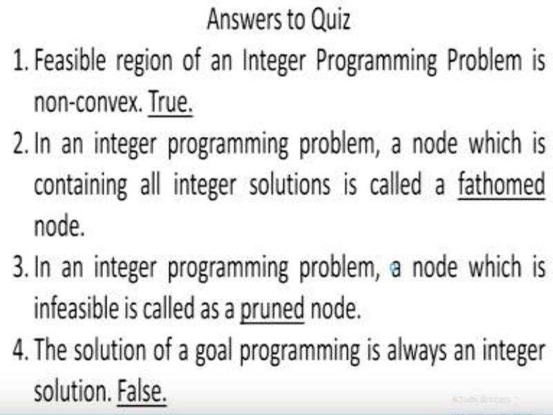

So I hope everybody has written the answers now let us look at the answers I will give you the answers to each of the questions. So question number 1, the feasible region of an integer programming problem is non-convex the answer is true. Question number 2, in an integer programming problem a node which is containing all integer solutions is called as a fathomed node. Question number 3, in an integer programming problem a node which is infeasible is called as a pruned node. Question number 4, the solution of a goal programming problem is always an integer solution so the answer is false. 

**(Refer Slide Time: 30:45)** 

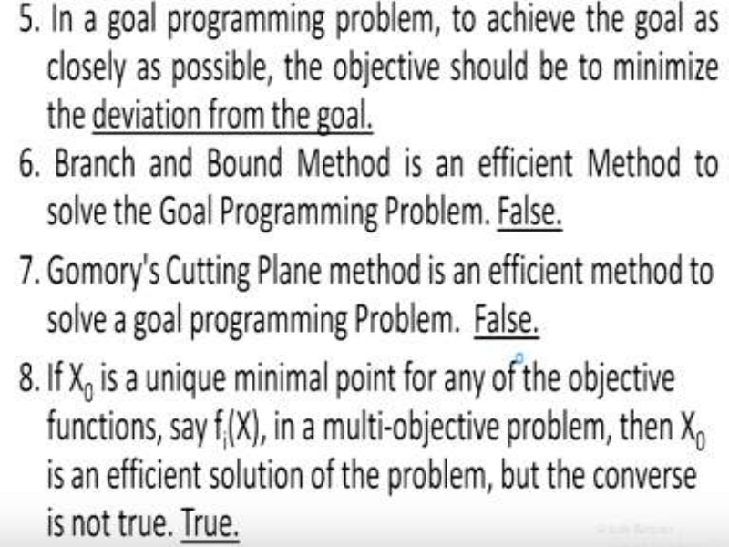

Question number 5, in a goal programming problem to achieve the goal as closely as possible the objective should be to minimize the deviations from the goal. Question number 6, branch and bound method is an efficient method to solve the goal programming problem false. Question number 7, Gomorys cutting plane method is an efficient solution to solve a goal programming problem false. Question number 8, if X0 is a unique minimal point for any of the objective functions say fi(X) in a multi-objective problem then X0 is an efficient solution of the problem but the converse is not true the answer is true this is a theorem that we have learnt. 

**(Refer Slide Time: 31:45)** 

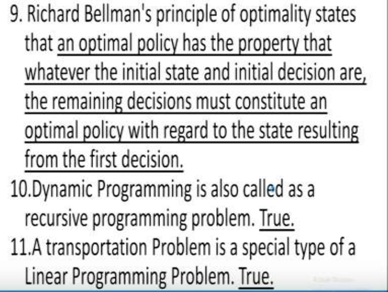

Question number 9, the Richard Bellman’s principle of optimality states that an optimal policy has the property that whatever the initial state and the initial decisions are, the remaining 

decisions must constitute an optimal policy with regard to the state resulting from the first decision. Question number 10, dynamic programming is also called as a recursive programming problem the answer is true. Question number 11, a transportation problem is a special type of a linear programming problem answer is true. 

**(Refer Slide Time: 32:34)** 

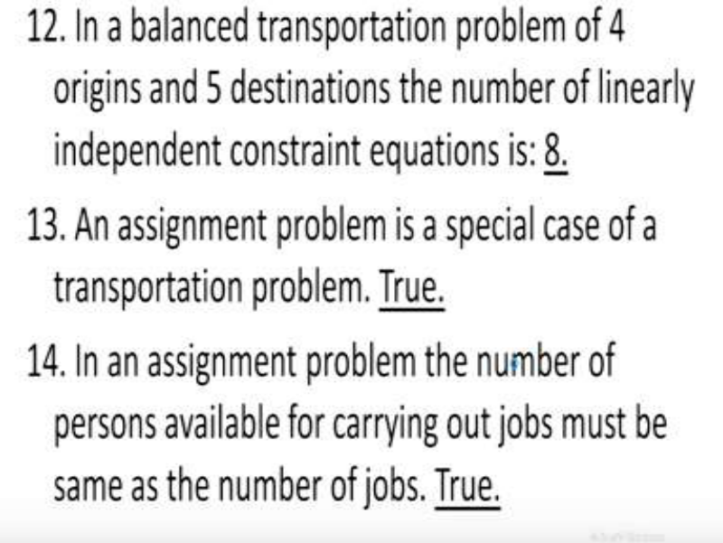

Question number 12, in a balanced transportation problem of 4 origins and 5 destinations the number of linearly independent constraint equations is 8 so how did this come? it came because it is n+m-1 so 4+5 is 9 so 9-1 is 8. Question number 13, an assignment problem is a special case of a transportation problem the answer is true. Question above 14, in an assignment problem the number of persons available for carrying out the jobs must be the same as the number of jobs answer is true. 

**(Refer Slide Time: 33:27)** 

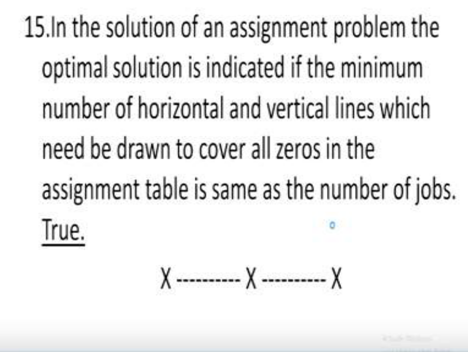

Question number 15, in the solution of an assignment problem the optimal solution is indicated if the minimum number of horizontal and vertical lines which need to be drawn to cover all the 0’s in the assignment table is the same as the number of jobs answer is true. 

So I hope you have evaluated your attempt to this quiz. So with this we come to an end of this lecture. Thank you. 

