# **Operations Research Prof. Kusum Deep Department of Mathematics Indian Institute of Technology - Roorkee** 

# **Lecture – 31 Processing n Jobs on 2 Machines** 

Good morning students, today we will learn a new topic its title is sequencing and scheduling the lecture number 31. Now sequencing and scheduling is finding lots of applications in real life for example, when on a computer you have to process a number of jobs then how the sequencing of the jobs should be processed on the computer it has to be done optimally, so that the idle time of the computer is minimized. 

Secondly the other examples that you could consider are when in a factory a number of jobs have to be processed and they have to be processed in such a way that the idle time of all the machines is minimized. 

So depending upon the situation there will be four lectures in this topic. So today we will introduce the topic and take up the first case which is the processing of n jobs on 2 machines. 

**(Refer Slide Time: 01:54)** 

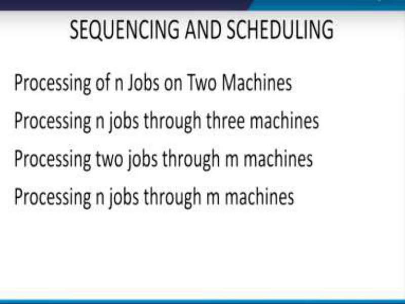

Now as I said there are four cases that needs to be dealt with the first one is the processing of n jobs on 2 Machines. We will be doing this today, in the next lecture we will look at the next case that is processing of n jobs on 3 machines, third case is processing of 2 jobs through m 

machines and finally the processing of n jobs through m machines. So let us begin with the first case that is processing of n jobs on 2 machines. 

**(Refer Slide Time: 02:38)** 

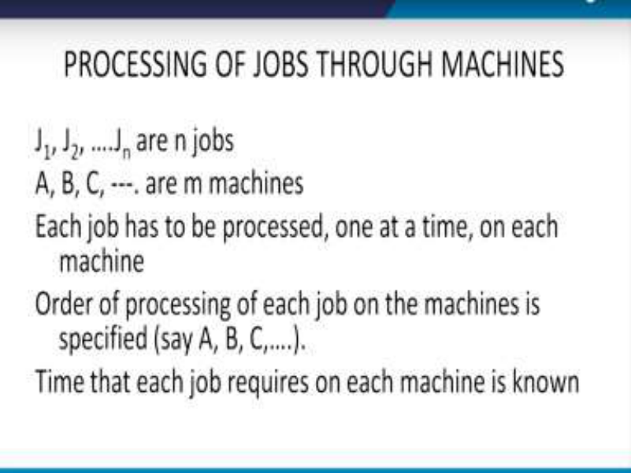

But before we do that let us try to understand the notations that we are going to use. So let us say that we have n jobs that have to be performed. So suppose these are n jobs are J1, J2, ….Jn. So there are n jobs that have to be processed and let us suppose, that there are m number of machines A,B,C like this. So the requirement says that each job has to be processed one at a time. On each of the m machines that are provided, each job has to be processed on one at a time on each machine, Also the order of processing of each job on the machine is specified that is it is given that first A has to be the machine, A has to be used then the B machine has to be used like this. So the order of the machine has to be is specified beforehand; also the timings that are required that is the time that each job requires on each machine is known. 

For example, you know that on one machine this job will require this much time. Let me give you a simple example, when the cloth has to be produced, so first it has to be weaved that is the thread has to be weaved, then it has to be starched, then it has to be printed, and like this. So all these are different processes and obviously first the weaving should be done right then the starching should be done. 

And thirdly the printing should be done so you cannot change this sequence, this sequence is predefined before you actually begin the entire production. 

**(Refer Slide Time: 05:02)** 

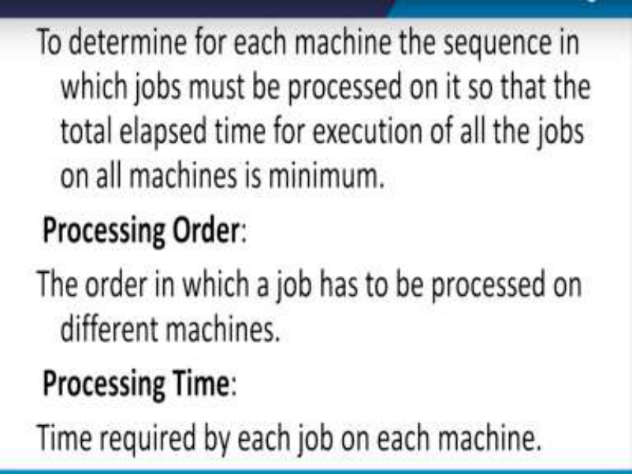

Also now we need to determine for each machine the sequence in which the jobs must be processed on it so that the total elapsed time for execution of all the jobs on all the machines is minimum. So this is the heart of the problem, that is, we want to minimize the idle time of all the machines where all the jobs are processed on all the machines. So the Processing order is defined as the order in which a job has to be processed on different machines. So, the processing order is the order in which a job has to be processed on the different machines, and we define the processing time as the time required by each job on each machine. So I hope the terminology is clear and the definitions is clear to everyone. 

**(Refer Slide Time: 06:24)** 

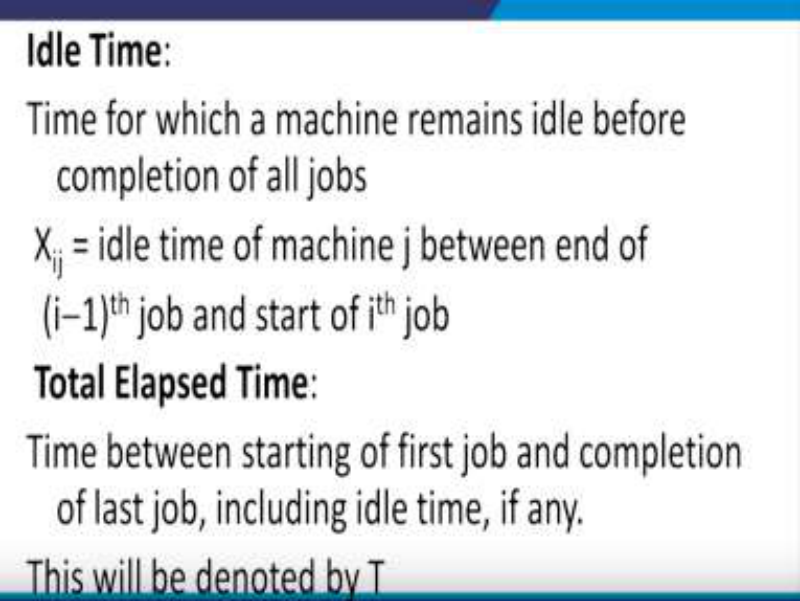

Now defining the idle time. What exactly do we mean by the idle time? The idle time is defined as the time for which a machine remains idle before completion of all jobs; so, that is the way the idle time is defined. 

Let us now define some variables which are Xij ,  Xij denotes the idle time of machine j between end of the (i-1)th job and the beginning of the ith job. So that is the way you need to indices i and j. So idle time of machine j is the time between the end of the (i-1)th job and the start of the ith job.  Then comes the total elapsed time, the total elapsed time is defined as the time between starting of the first job and completion of the last job, including the idle time if any and as you can very well understand, the entire thing will be denoted by T. 

**(Refer Slide Time: 08:02)** 

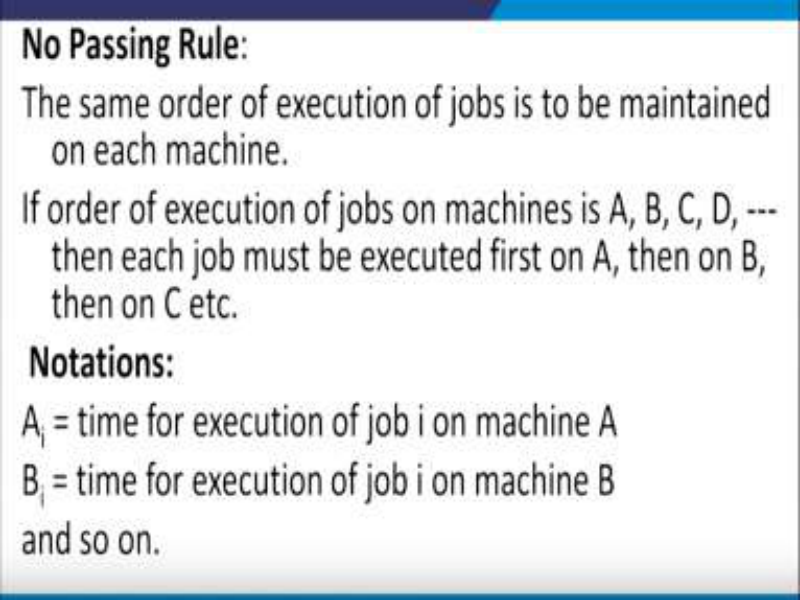

So important rule that has to be adopted is called the no passing rule. Now this rule says that the same order of execution of jobs is to be maintained on each machines. So obviously on each machine the same order of execution of jobs has to be maintained. If order of execution of jobs on machines is ABCD, then the no passing rule says that each job must be executed first on machine A then on machine B and like this then on C. 

So this is what is the meaning of the no passing rule. Now before we take up the first case, let us look at some of the notations. So let Ai be the time of execution of job i on machine A. So A denotes the machine and i denotes the job. So Ai is the time for execution of job i on machine A. Similarly let Bi denote the time of execution of job i on machine B and like this for the all the machines that are given in the problem. 

**(Refer Slide Time: 09:53)** 

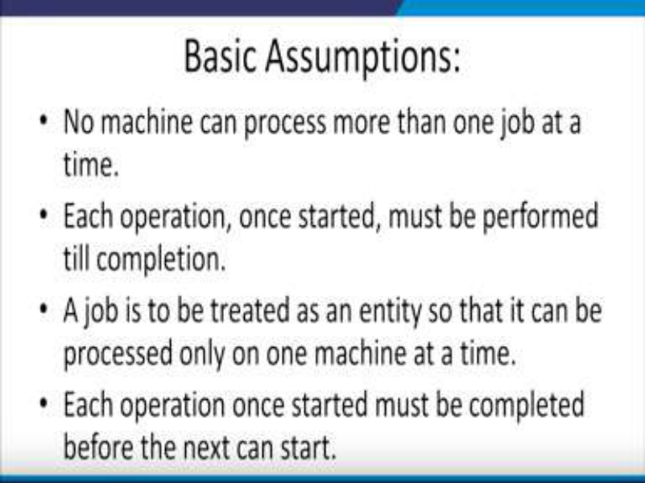

Now we will make some basic assumptions. So what are these assumptions number 1 no machine can process more than one job at a time. So this is the first assumption and this will make our calculations simple. So no machine can process more than one job at a time. Number 2; each operation once started must be performed till it is complete. So that means a process cannot be left in between it has to be completed once it is started. So each operation once started must be performed till completion. The 3rd assumption is, a job is to be treated as an entity, so that it can be processed only on one machine at a time. What does that mean?. It means that each job will be considered as an independent entity, that is it is going to be a entity in itself. The 4th assumption says, each operation once started must be completed before the next one can start. So that means that each operation once started, should be completed before the next one begins. 

**(Refer Slide Time: 11:46)** 

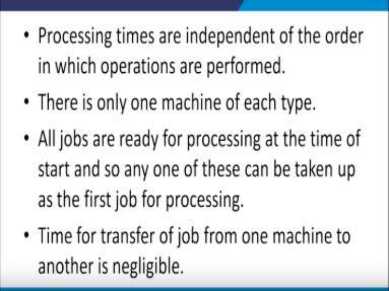

Next assumption says, that the processing times are independent of the order in which operations are performed. Next one says, that there is only one machine of each type. So for example, if there is a weaving process only, one machine is available for doing the weaving operation. All jobs are ready for processing at the time of the start and so any one of these can be taken up as the first job for processing. So when the system starts all the jobs should be ready so that the machines need not wait with which a processor is available so that it can be processed, and the time for the transfer of jobs from one machine to another is negligible. Now this is a very important assumption, the example of our processing of clothes, textiles, now the weaving process once it is over then it has to be passed on to the next process that is the starching process. In this case, there will be some amount of time which is required for transferring the textile from the first process to the second process. However, in this assumption we are assuming that time is negligible as compared to the actual processing of the time on each of the machines. 

# **(Refer Slide Time: 13:47)** 

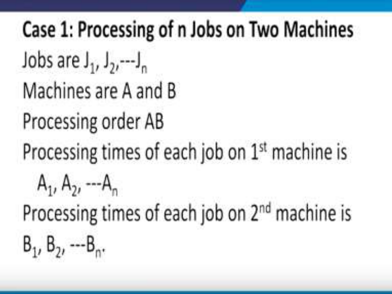

So, as I said let us first look at the case one which means that we are going to process n jobs on 2 machines. So the notations are as before that is the jobs are numbered as J1,J2,…,,Jn because there are n jobs and there are only 2 machines A and B. So this is the simplest case where we have only 2 machines now the processing order is given to us, AB, that is first A machine has to be used and then only the second machine B has to be used. 

Now the problem says that the processing time for each of the jobs, on the first machine is given to be A1, A2, ---An. So these are the times, the times in terms of let us say minutes, or hours. So whatever the case is, the processing time of each of the jobs on the 1st machine is given to be A1, A2, ---An. Similarly, the processing time of each of the jobs on the second machine is also given to be B1, B2, ---Bn. So remember there are n jobs so A1, A2, ---An are the times on the machine A, and similarly B1, B2, ---Bn are the times on the machine B. **(Refer Slide Time: 15:44)** 

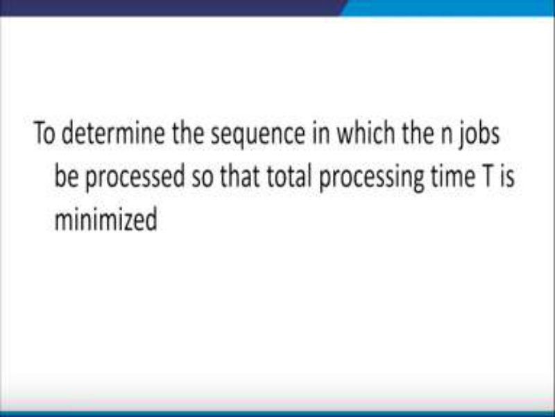

Now what is the problem?. The problem is to determine the sequence in which the n jobs should be processed, so that the total processing time T is minimized. Now what do we mean by this?. 

**(Refer Slide Time: 16:07)** 

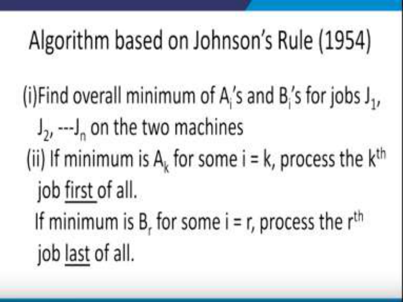

Let us look at the first algorithm which is designed for solving this kind of a problem it is called the Johnsons rule, which is based on a scientist called Johnson in the year 1954. So the steps of this algorithm are as follows, In the first step, we will find the overall minimum of the Ai’s and the Bi’s for the jobs J1, J2, ---Jn on both the machines. So we have A1,A2,…An; B1,B2,… Bn like this. 

So, first of all identify the overall minimum time because remember we have to minimize the total time. Secondly, if the minimum time is let us say Ak for some i=k, then we will process the kth job. First of all, so if minimum is Ak for i=k, process the kth job first of all, so if minimum is Ak for i=k, process the kth job first of all; the second part of this step says if the minimum is, let us say, Bi for some i=r, then process the rth job first of all. 

So, depending upon whether the minimum is corresponding to some on the first machine or some on the second, if it is only first then it has to be done on the first of all; if it is on the second machine then it has to be done last of all. 

**(Refer Slide Time: 18:06)** 

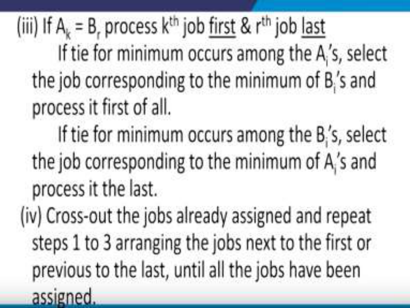

So next comes, the third step it says that if Ak=Br , then process the kth job first and rth job last. If tie for the minimum occurs among the Ais, select the job corresponding to the minimum of Bi’s and process it first of all, and if the tie for the minimum occurs among the Bi’s, select the job corresponding to the minimum of Ai’s and process it the last. See this, after the second step, we have to look at, if these condition of the 3rd step is satisfied or not. That is if Ak=Br, then comes the fourth step, cross out the jobs already assigned and repeat these steps 1,2,3 arranging the jobs next to the first or the previous to the last until all jobs have been assigned. **(Refer Slide Time: 19:35)** 

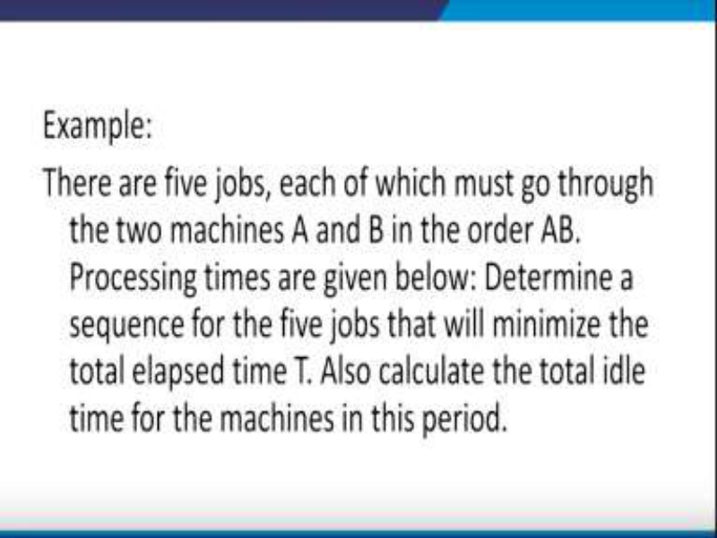

Now in order to understand this algorithm let us look at example, there are 5 jobs, and each of these jobs have to go through two machines A and B in the order AB. That is A has to be processed first, I mean A machine has to be used first and then the B machine. The processing times of all these jobs on both these machines is given, we are required to determine a sequence for the 5 jobs. That will minimize the total elapsed time, also we need to calculate the total idle time for the machines during this period. 

**(Refer Slide Time: 20:36)** 

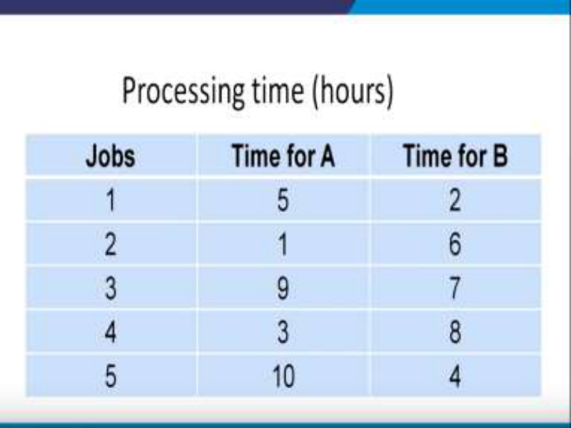

So what does it mean, the data here is given, the processing times in terms of hours is given for each of the 5 jobs so in the first column we have the jobs numbered as 1 2 3 4 up to 5 and the second column tells us the time in hours for the implications of machine A, they are given to be 

5, 1, 9, 3 and  10 and similarly time required for processing on B machine is given to be 2, 6, 7, 8  and 4. 

**(Refer Slide Time: 21:24)** 

So first step says we need to find out the overall minimum of the processing times, so just look at this table here and you find that the overall minimum is 1. So overall minimum is 1 hour for job 2 on machine A. Look at this table here again, job 2 this is the minimum right job 2 on machine A. job 2 on machine A. So we will list the job 2 at the first place, see the idea is that we have five jobs. So 1st job, 2nd, 3rd, 4th and 5th , now we have to fill in these gaps I mean these places, so the first job we have to list job 2 in the first place. So this is job 2, suppose it was the other way around, then it would have gone to the last. But since the condition is satisfied according to step 1 so therefore, it is to be placed in the beginning. Now once this is renewed, once this is done then we will strike out this line. And once we have struck off this line that means now we are left with only four rows, so here are the rows 1 3 4 and 5, you can see that the second row has been deleted. 

**(Refer Slide Time: 23:40)** 

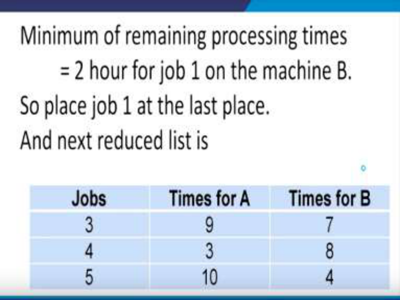

Now again this process will be repeated and the minimum of the processing times will be obtained and you can see that it is 2 hours for job 1, so 2 hours for job 1. Here it is but it is on machine B, it is 2 hours for job 1 on machine B, so job 1 has to be placed in the last place. So job 1 has to be placed in the last place. Now the same process has to be repeated and the reduced list now becomes, we will delete this line. And now the reduced list becomes 3 4 and 5, again we will repeat the process and from this we need to find out which one is the minimum, the overall minimum and we find the overall minimum is 3 on the machine A. So here you are 3 hours job 4 machine A. So therefore, we have to place job 4 at the first place. Let us go back, here again the reduced list now remains only two rows and you can see that 4 is the minimum. 

**(Refer Slide Time: 25:25)** 

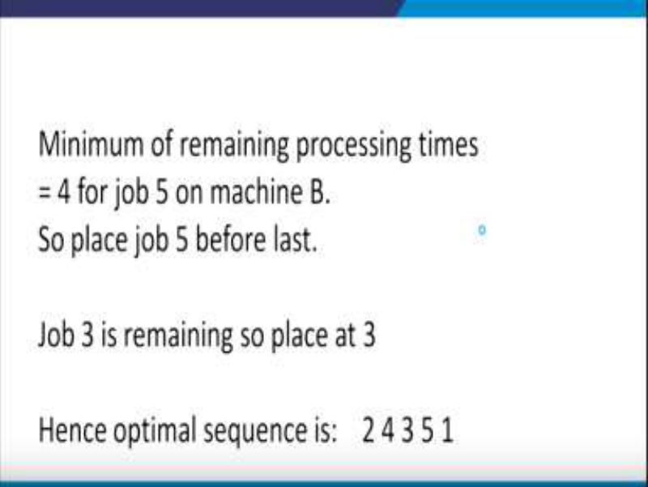

So the minimum of the remaining processing times is 4 for job 5 on machine B, so place 5 before last. So you have to place 5 before last. Here you are and of course there is only one job that is remaining so that has to be placed in the middle. So this means that 2 4 3 5 1, this is the way in which the processing has to be done. So this means 2nd job should be done first, 4th job should be done second, 3rd job should be done third. 5th job should be done fourth, and 1st job should be done at the fifth place. 

**(Refer Slide Time: 26:29)** 

So with this we have got the optimum way in which the sequence of jobs should be adopted. Now let us look at the elapsed time. Now the minimum time elapsed corresponding to the optimum sequence using the individual processing times is given in the problem. Now, suppose in the problem it is given that the time required for processing on machine A and machine B, we have to determine the processing time the elapsed time. 

So we know that this is the sequence 2 4 3 5 1; so in the beginning of the system we will start with time in 0, since it is on machine A, you know that we have to determine how much time is required on the job 2 on machine A. So let us go back to the data that is given in the problem here you are so this is the time that is required for job number 2, to be processed on machine A. Also once it is completed on machine A, then we have to transfer it on machine B. So we will come here on the machine B and the time in for machine B is 1 hours, the time out is 7 can you tell why is this 7 because 7-1=6 and we know that the job number 2 requires 6 hours on machine B. Let us verify it here you are it requires 6 hours on machine B. Therefore the time 

out has to be 1+6 that is 7. Same thing has to be adopted for the next job that is job number 4. Now for the machine A, since the time out was 1 therefore the for the 4th job the time in will be 1 and again it will be 4, time out will be 4 because job number 4 requires 3 hours. so like this we will keep on completing for all the jobs on the machine A and similarly on all the jobs on machine B. 

# **(Refer Slide Time: 29:45)** 

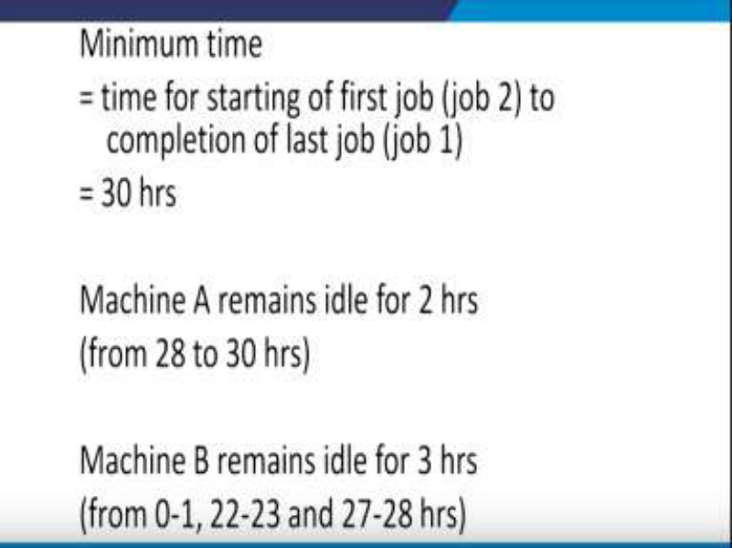

So, the minimum time has to be calculated as time for starting the first job, that is, job 2 to the completion of the last job that is job 1 and you can just calculate that comes out to be 30 hours. Similarly the machine A remains idle for 2 hours what are those 2 hours? See this is the beginning of the system and 30 is the end of the system and you find that from 28 to 30, 2 hours of idle time is there on machine A. So that is the reason why this is for 2 hours on machine A what about machine B let us look at machine B when the machine A is processing from the first job I mean job number 2 at that time machine B is idle. So the first one is between 0 to1 here you are 0 to 1 then comes 22 to 23. Where is 22 to 23?.Here you are 22 to 23 during this 22 to 23 the machine B is idle and also 27 to 28 so therefore this is the total idle time of machine B that is 3 hours. 

So with this we come to the end of the 1st case on processing of n jobs on 2 machines. Thank you. 

