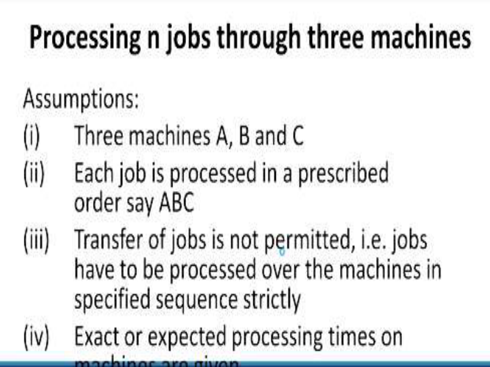
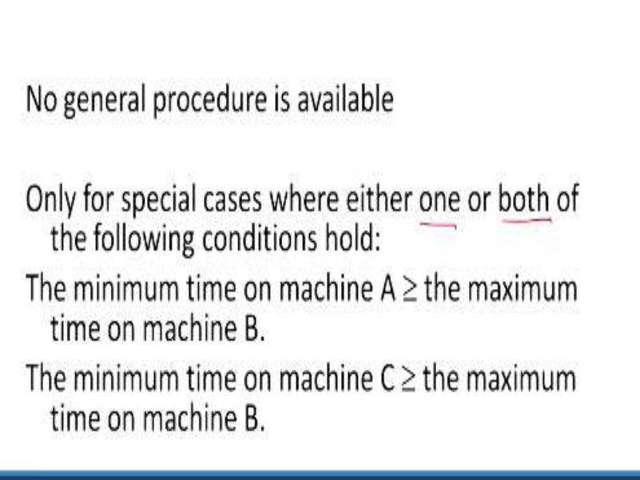
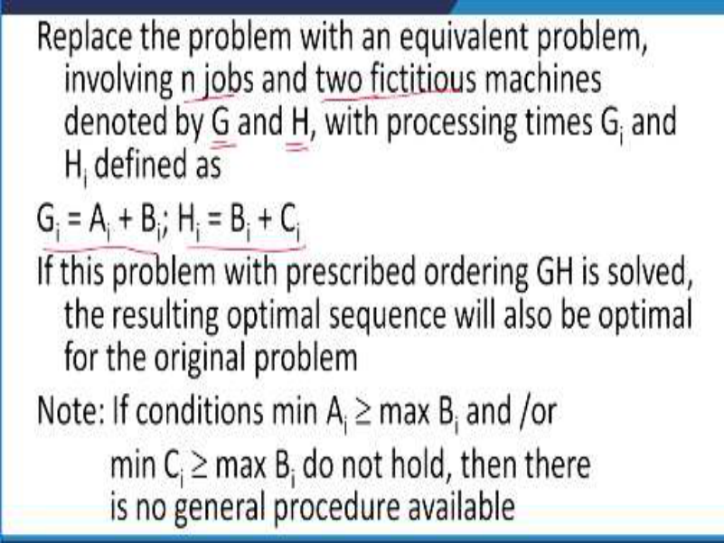
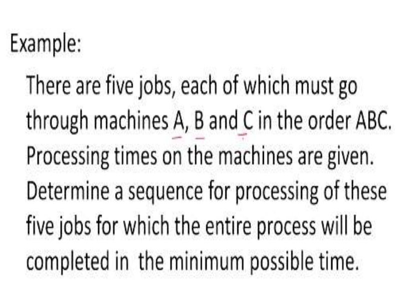
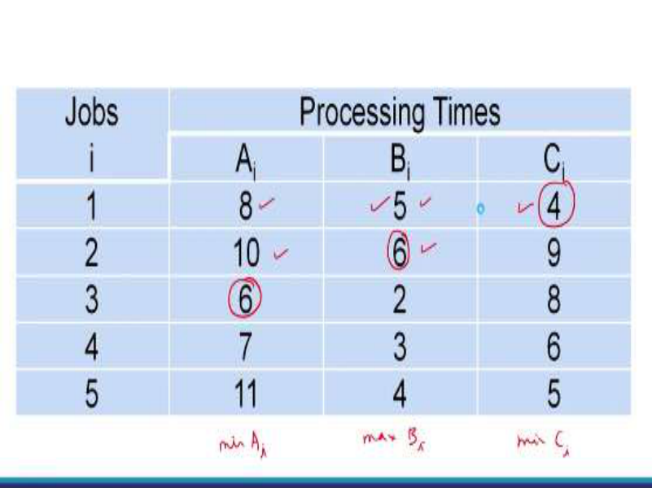
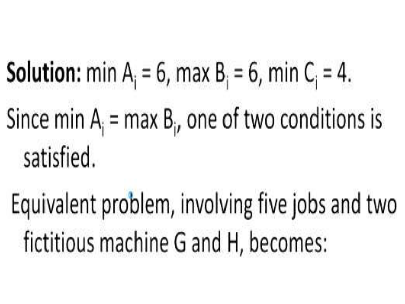
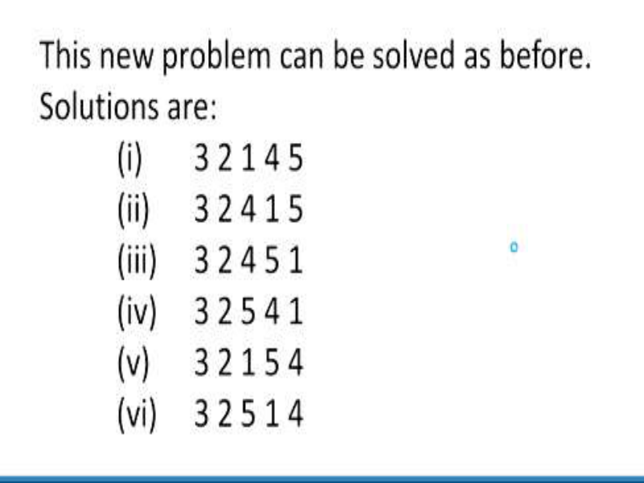
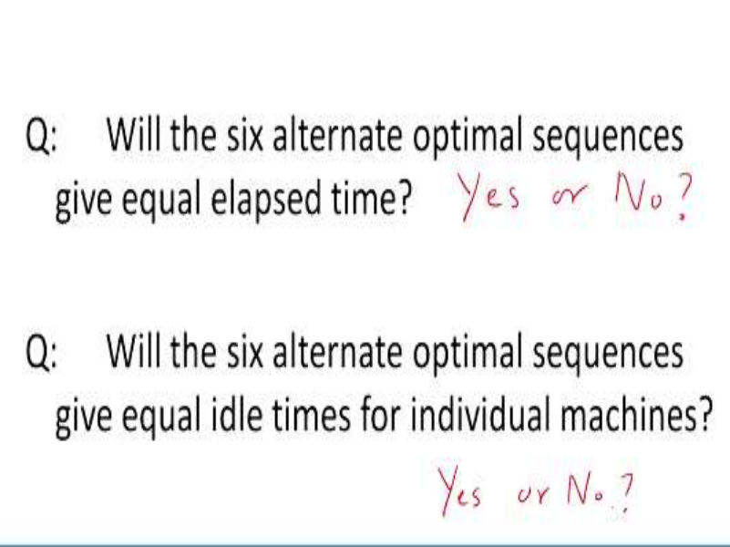
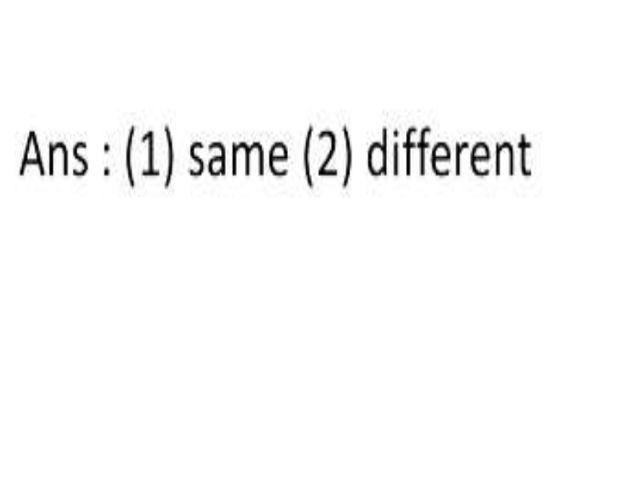

# **Operations Research Prof. Kusum Deep Department of Mathematics Indian Institute of Technology - Roorkee** 

# **Lecture – 32** 

# **Processing n Jobs Through Three Machines** 

Good morning students, so today we will continue with the topic of sequencing and scheduling, today's lecture number 32 and we will talk about the second case that is processing of n jobs through 3 machines. 

**(Refer Slide Time: 00:51)** 

Now, this is a special case of the case 1 that is processing of n jobs on 2 machines , now since we are given 3 machines, we will convert the 3 machine case into the 2 machines case and proceed as before, so the procedure is as follows; that is we will convert the 3 machine case into the 2 machine case. Before we do that we need some assumptions; the assumptions are as follows. 

Number 1; we have 3 machines; A, B and C and second assumption is each job is processed in a prescribed order that is A, B and C. First of all A has to be processed then, B and then C. Assumption number 3; transfer of jobs is not permitted that is jobs have to be processed over the machines in a specified sequence strictly so, this sequence is fixed. The fourth assumption says exact and expected processing time on each of the machines is given. 

**(Refer Slide Time: 02:27)** 

Now, although there is no general procedure which is available but we can convert it into the previous case as follows, it is only for the special cases when either one or both of the following conditions hold. So, the minimum time on which machine A  the maximum time on machine B, so either the first condition or the second condition that is the minimum time on machine C  the maximum time on machine B. 

So, please note either one or both, if both or one of these conditions hold then, we can reduce the 3 machine case to the 2 machine case so, remember these 2 conditions; minimum time on machine A should be  maximum time on machine B and number 2; minimum time on machine C is  maximum time on machine B. 

**(Refer Slide Time: 03:52)** 

So, once these conditions are satisfied then, we will replace the problem with an equivalent problem involving n jobs and 2 machines; so now, we have n jobs on 2 machines and we will denote these two fictitious machines as G and H of course, the processing times of the G's and the H’s have to be calculated and they are calculated like this that is Gi = Ai + Bi  and similarly, Hi = Bi + Ci. 

If this problem with the prescribed order GH is solved, the resulting optimum sequence will also be an optimum sequence for the original problem, remember that the conditions they have to be satisfied, if these conditions are not satisfied then, there is no general procedure for solving this case. This is what it says, if the condition min Ai  max Bi or min Ci  max Bi, do not hold then there is no general procedure available for this situation. 

**(Refer Slide Time: 05:41)** 

So, let us take an example to understand how this method will work suppose, there are 5 jobs each of which must go through the 3 machines A, B and C and the order is given to be ABC. The processing times on each of the 3 machines is given and the problem says that we are required to determine a sequence of processing of these 5 jobs for which the entire process will be completed in the minimum time possible. 

**(Refer Slide Time: 06:26)** 

Now, this is a data that is given to us that is we have the 5 jobs numbered as 1, 2, 3, 4, 5 and the processing times on each of the machines ABC, on A, it is 8, 10, 6, 7 and 11 and on B, it is 5, 6, 2, 3 and 4 and similarly on C, it is 4, 9, 8, 6 and 5. **(Refer Slide Time: 07:00)** 

Now, first of all we need to find out the minimum of the Ai’s, so minimum of Ai is 6, look at the second column that is the column under A, you find the minimum is 6; then, in the second step, you look at the maximum of the Bi’s; maximum of the Bi’s is 6. Then we also need to look at the minimum of the Ci’s, so what is the minimum of the Ci’s? Minimum of the Ci’s is 4 therefore, now we want to see whether the given conditions are being satisfied or not now, since min Ai = max Bi, so, one of the two conditions is satisfied, the first one; therefore, we are now allowed to use the first case that is we will reduce the problem into an equivalent problem involving the 5 jobs and 2 fictitious machines G and H like this. 

**(Refer Slide Time: 08:32)** 

Now, each of the times for the Gi is obtained by adding Ai + Bi let us check 13, how is this 13 come? 13 has come because 8 + 5 is 13, so that is why we get 13 over here similarly, second job is 10 + 6 is 16 so here you have 16 and like this you will check the others also, similarly for the Hi machines. 

Let us look at Hi, this should be = Bi + Ci, so for the first one for 5 and 4; 5 and 4 should be 9, yes here it is 9, similarly 6 and 9, it should be 15, yes it is 15 and like this, so you can check the remaining ones also. So, therefore we have constructed the 2 machine case from the 3 machine case now, once we have done this then, we have come to the second case. 

**(Refer Slide Time: 10:13)** 

Now, we will do it the way we did before, I will leave this as an exercise for you to solve and you will find that the new problem can be solved in many number of ways, so these are some of 

the solutions that can be obtained so, 3 2 1 4 5, 3 2 4 1 5 etc., so I will leave it as an exercise for you to solve this 3 machine case using the 2 machine case based on the previous method. **(Refer Slide Time: 10:52)** 

Next comes the elapsed time and the total idle time now, for the first sequence that is the 3 2 1 4 5, this first sequence 3 2 1 4 5, let us try to find out the minimum elapsed time now, here we have 3 2 1 4 5, this is the sequence that we have obtained and we will look at the time in and the time out for the machine A, as I said the first job that has to be processed is the job number 3 and job number 3 will begin on the machine A at 0 hours that is the time in. The time out is 6 hours; why is it 6 hours? Because the third job requires 6 hours on machine A, and like this we will calculate the time in and the time out for the machine A, the machine B and the machine C. So, I want you all to verify whether these calculations are okay with you, have you followed these calculations or not. 

# **(Refer Slide Time: 12:46)** 

And you will find that the system begins from time t = 0 and the system will end at 51 hours, so we have a question, will the 6 alternative optimum sequences give equal elapsed time, let me repeat the question; will the 6 alternate optimal sequences give rise to equal elapsed time? The answer should be either yes or no and the second question is; will the 6 alternative optimal sequences give rise to equal idle times for individual machines? That is will the 6 alternate optimum sequences give equal idle times for each individual machines again, the answer is yes or no so, based on the simple concepts of the idle time that we have studied in the previous lecture and this lecture, you can answer these 2 questions. 

**(Refer Slide Time: 14:02)** 

And here is the answer; the answer to first question is same and the answer to the second question is different so, I hope you have understood how the 3 machine case can be reduced to the 2 machine case, if the conditions are satisfied. Now, you might be wondering why there are 

so many solutions in fact, you will see that there are six solutions to this problem that is 3 2 1 4 5, 3 2 4 1 5, 3 2 4 5 1, 3 2 5 4 1, 3 2 1 5 4, 3 2 5 1 4. 

The reason behind this is that there may be a situation where there is a tie and if you look at the computational steps of the algorithm, the algorithm tells us that you have to take care of the ties; this I explained in the Johnson's rule in the previous lecture. So for that reason this will give rise to many alternative solutions so, I leave it as an exercise for you to find out why so many alternative solutions have come up. 

Next, comes the processing times now, you will find that the processing time corresponding to the first sequence that is 3 2 1 4 5 is as follows. Now, how did we get this table? First of all, this sequence 3 2 1 4 5 is written in the first column and we will see what are the time in and the time out for the third job on machine A, so we will begin with the 0 starting of the system is at time 0. Now, this requires 6 hours of processing on machine A, how did we know it is 6 hours? Look at the given table so, here you are, the third job requires 6 hours on machine A, so therefore we have to put 6 hours over here that is the time out then, comes the second job now, in the second job the time in is 6 hours but the time out is 16, why is it 16, because, it is 6 + 10 = 16. Why 10? Because job number 2; how much time it requires? Job number 2 requires 10 hours on machine A, then comes the job number 1; time out was 16 for job 2 and the time in for job number 1 is 16 hours and the time out is 24 hours for job number 1, why is that so? let us look at job number 1, job number 1 requires 8 hours, so here you are, this means that 16 + 8 that is 24 is the timeout for the machine A and like this we will complete for all the time in’s and time outs of machine A. 

The same thing has to be implemented for the machine B; however, we have to make sure that since the third job is being first processed on machine A, so the time out is 6 on the machine A but the time in on machine B is 6, it cannot be before and on the machine B, the time out is 8, why is that so? Because 6 + 2 = 8, what is this 2? 2 is the processing time on the third machine, here it is. And like this similarly, we will get all the times for the machine B and similarly, on the machine C, here again you will observe that this 8 is the time out on machine B and here again it is time in for machine C, like this you will follow that how these times have to be calculated the depending upon the processing times for the corresponding jobs in such a way that the machines are available and they are not idle. 

And as before we can calculate the idle time for machine A, idle time for machine B, idle time for machine C and the total idle time. Now, there are two questions that have to be thought about. The first question is will the six alternative optimal sequences give rise to equal elapsed 

time that is will the six alternate optimal sequences give rise to equal optimum elapsed time, you have to reply yes or no. 

The second question is; will the six alternative optimal sequences give equal idle times for the individual machines that is because we have six alternative solutions, will the six alternative optimal sequences give rise to equal idle times for individual machines again, the answer is yes or no. So, based on today's lecture you have to reply and the answer to both these questions is same for question number 1 and different for question number 2. 

For question number 1, the answer is same and for question number 2, the answer is different, so I hope you have followed the example of the 3 machine case which is based on the 2 machine cased provided the given conditions are satisfied, thank you. 

