# **Operations Research Prof. Kusum Deep Department of Mathematics Indian Institute of Technology – Roorkee** 

# **Lecture - 36 Two Person Zero-Sum Game** 

Hello students. This is lecture number 36 where we are going to start a topic called game theory. This is the most interesting aspects of linear programming and its applications. So, we will see how game theory is a very good application of linear programming and how we can make use of the linear programming techniques to solve the problem of game theory. 

**(Refer Slide Time: 01:00)** 

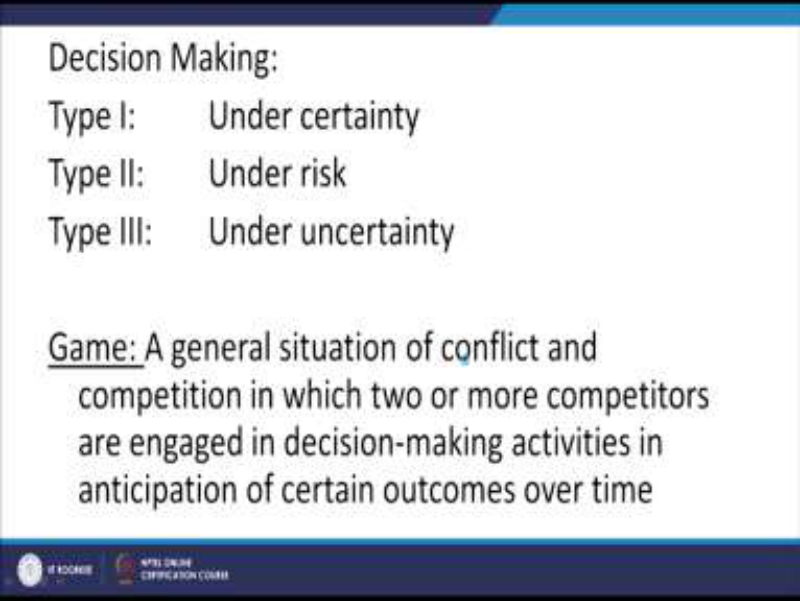

Now, you will realize that playing a game is nothing but a decision-making process that is when you are playing a game with your opponent, suppose there are two people who are playing the game, then you make a move and the other person makes a move. So, this is just dependent upon the decision that you are making. Now, there are three types of decision making problems. The first one is under certainty that is everybody is aware that he is supposed to make this move and that is based upon the knowledge about the other person's moves. The second type of problems come across when there is some risk that is involved that there is a risk whether my move is going to be the correct move or not and the third one is under uncertainty that is the situation where one person does not know what the other person is going to make the next move. 

So, let us first formally define what do we mean by a game. A game is a general situation of conflict and competition in which two or more competitors are engaged in the decisionmaking process in anticipation of certain outcomes over the time space. So, in other words game is an ideal example of a decision-making process. 

**(Refer Slide Time: 02:40)** 

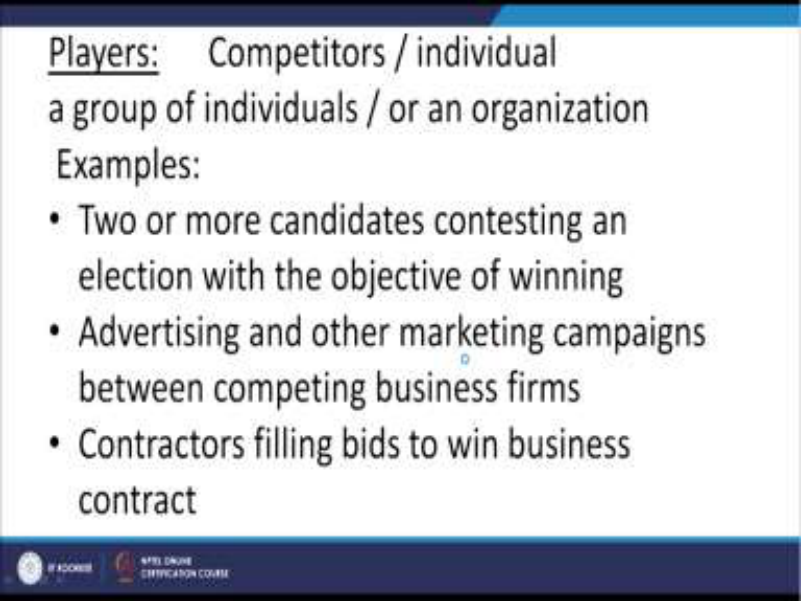

Now, the players are defined as the competitors or the individuals who are involved in playing the game. For example, a group of individuals or organizations, all these are examples of players. For example, two or more candidates contesting an election with the objective of winning the elections. So, for example there are five individuals who are contesting an election. This is also a kind of a game. 

Second example is about advertising and other marketing campaigns between competing business firms. So, for example there are many firms who are advertising, let us say soaps. Then, this is also a matter of competition and it can be considered as a game. The third are the contractors who are filing their bids to win some bidding contracts, some business contracts. For example, let us say the bids which are filed in for constructing of a house. There this is also a situation of competition. 

**(Refer Slide Time: 04:02)** 

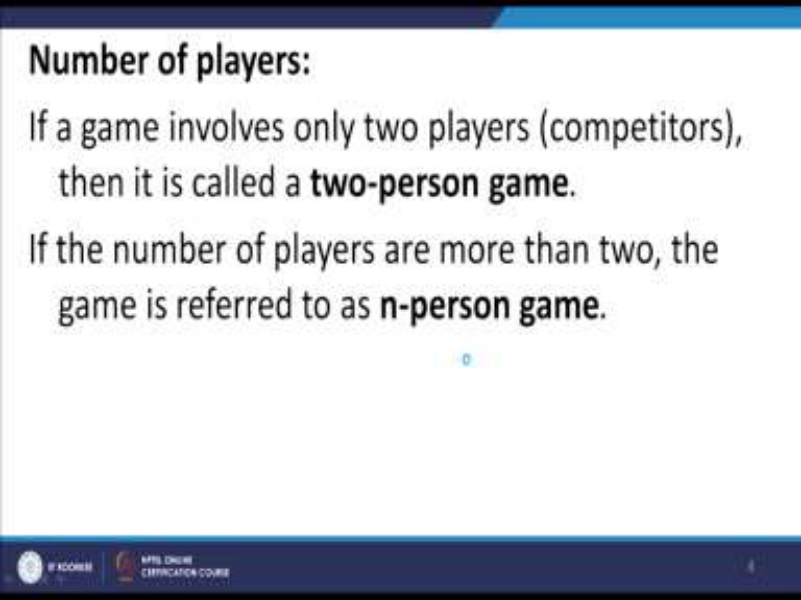

One aspect that is required to be understood is the number of players. Now, there could be two kinds of situation, the first one is that there are 2 persons who are playing the game. If a game involves only 2 players or competitors, it is called as a two-person game and if there are more than 2 persons who are involved in the game, it is called as a n-person game. 

**(Refer Slide Time: 04:30)** 

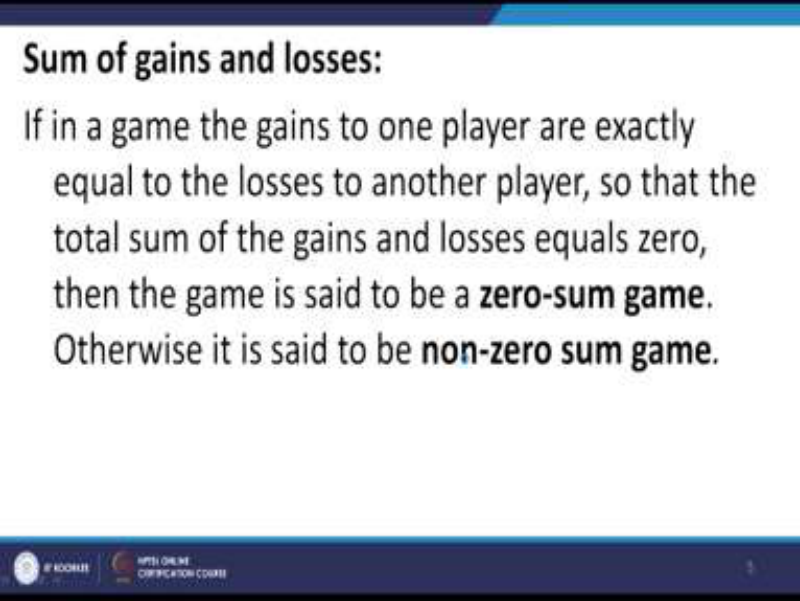

Now, the sum and the gains of the losses, If in a game, the gains to one player are exactly equal to the losses to another player so that the total sum of the gains and losses = 0, then the game is said to be a zero-sum game, otherwise it is said to be a non-zero sum game. So, the gains and the losses, their total should be 0 and that is the topic of the first case that we are going to study that is the zero-sum games. 

**(Refer Slide Time: 05:13)** 

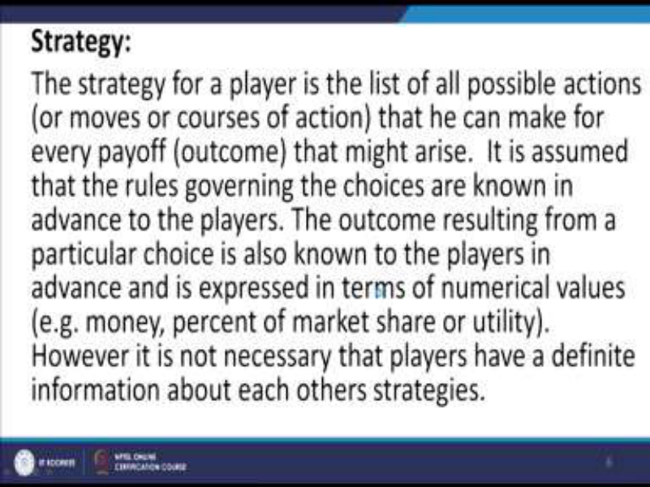

Next, comes the definition of strategy. Now, strategy means that the strategy for a player is the list of all possible actions or moves or courses of action that he can make for making every outcome that might arise. It is assumed that the rules governing the choices are known in advance to the players and the outcome resulting from a particular choice is also known to the players in advance and is expressed in terms of some numerical values. For example, money, the percent of market share or utility. However, it is not necessary that the players have a definite information about each other’s strategies. 

# **(Refer Slide Time: 06:13)** 

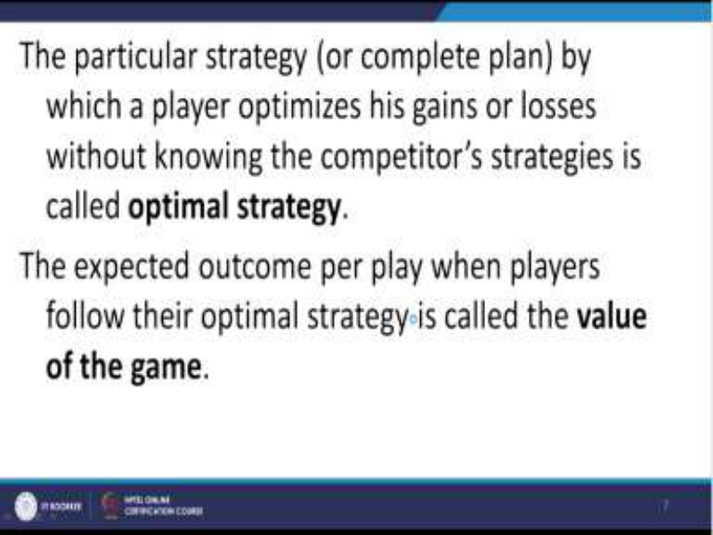

Now, we will see what do we mean by optimal strategy. That particular strategy or the complete plan by which a player optimizes his gains or losses without knowing the competitors strategy is called the optimal strategy and the expected outcome per play when the players follow their optimal strategy is called the value of the game. 

**(Refer Slide Time: 06:48)** 

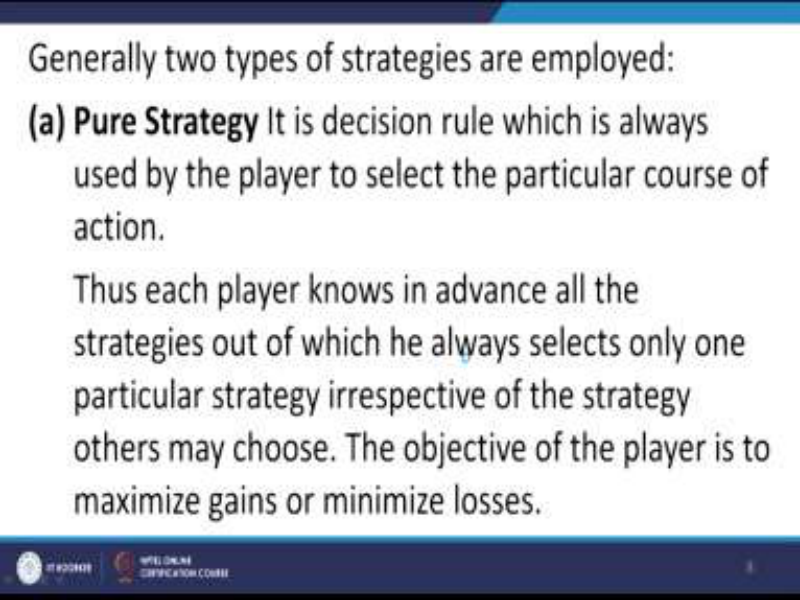

Now, generally there are two types of strategies which are employed. First one is called the pure strategies. The pure strategy, it is a decision rule which is always used by the player to select the particular course of action. Thus, each player knows in advance all the strategies out of which he always selects, only one particular strategy irrespective of the strategy the other may choose. The objective of the player is to maximize the gains or minimize the losses. 

# **(Refer Slide Time: 07:33)** 

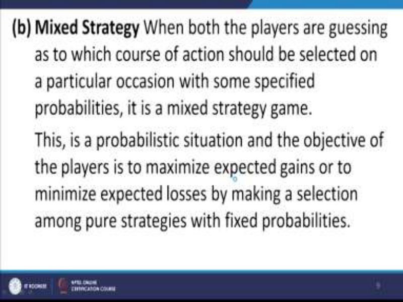

The second strategy is the mixed strategies. They are when both the players are guessing as to which course of action should be selected on a particular occasion with some specified probabilities; it is a mixed strategy game. This is a probabilistic situation and the objective of 

the player is to maximize expected gains or to minimize expected losses by making a selection among the pure strategies with fixed probabilities. 

**(Refer Slide Time: 08:14)** 

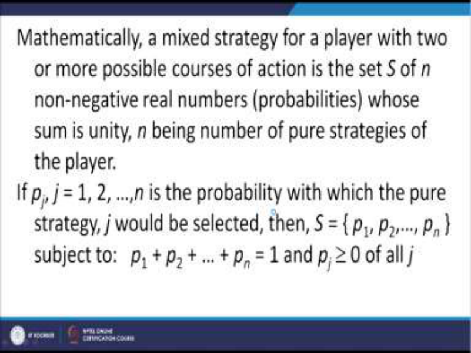

Now, mathematically a mixed strategy for a player with two or more possible courses of action is the set S of n non-negative real numbers which are the probabilities whose sum is unity, n being the number of pure strategies of the player. So, if we denote by pj where j goes from 1, 2,… n; the probability with which the pure strategy j would be selected. Then, S which is given by p1, p2 ,…. pn subject to the p1+p2+….+ pn=1 and all the pj’s are > 0 for all j. **(Refer Slide Time: 09:04)** 

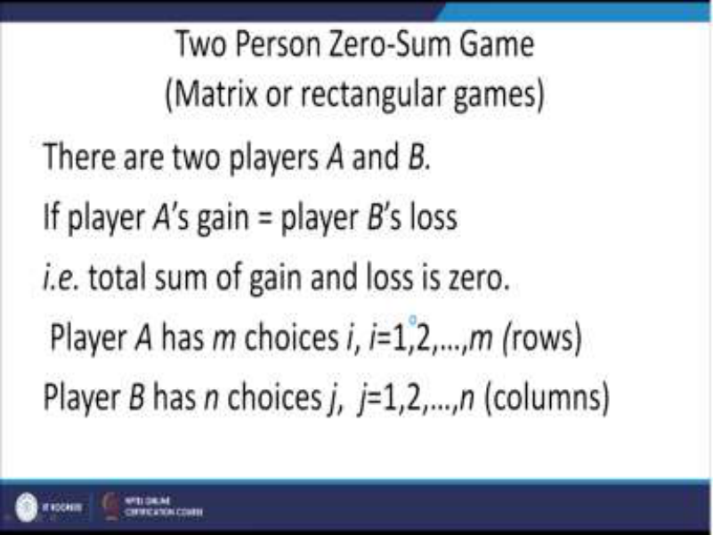

**(Refer Slide Time: 10:01)** 

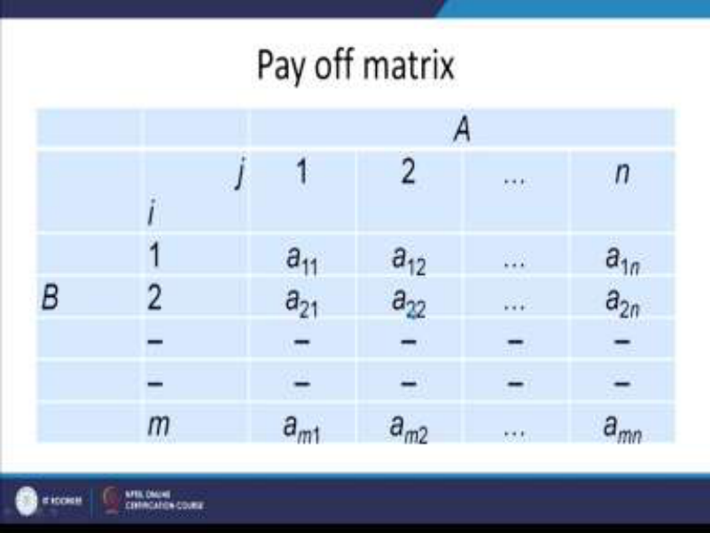

Now, this information can be written in this matrix notation or in a rectangular fashion and it is called as the pay off matrix; where the player A is shown at the top first row and the first column is the player B, j goes from 1, 2 up to n corresponding to the strategies of A and similarly for B, i goes from 1, 2 up to m. The a11, a12 etc these are called the pay off matrix which represents the probabilities with which the A and B players are going to play the game. **(Refer Slide Time: 10:46)** 

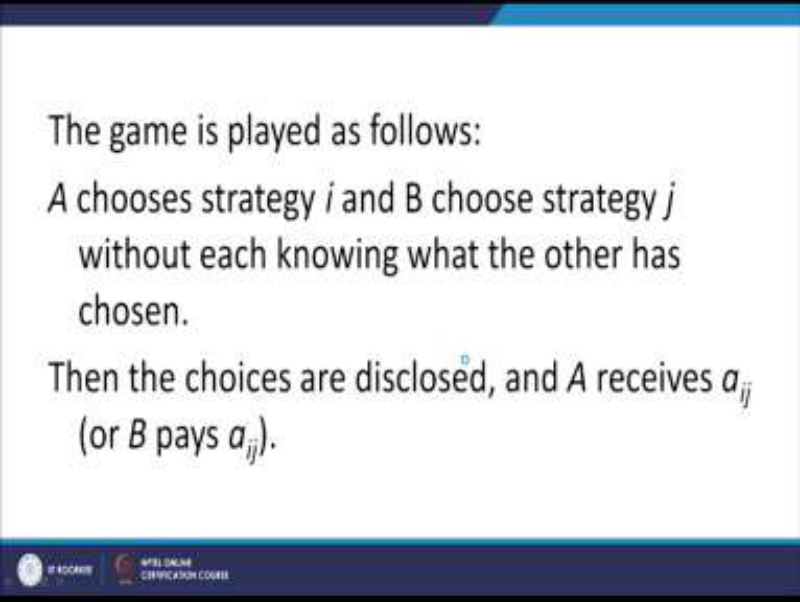

Now, the game is played as follows. A chooses the strategy i and B chooses the strategy j without each other knowing what the other has chosen. Then, the choices are disclosed and A receives the aij or B pays aij. So, this is the same equivalent amount whether A receives aij or B pays aij. 

**(Refer Slide Time: 11:19)** 

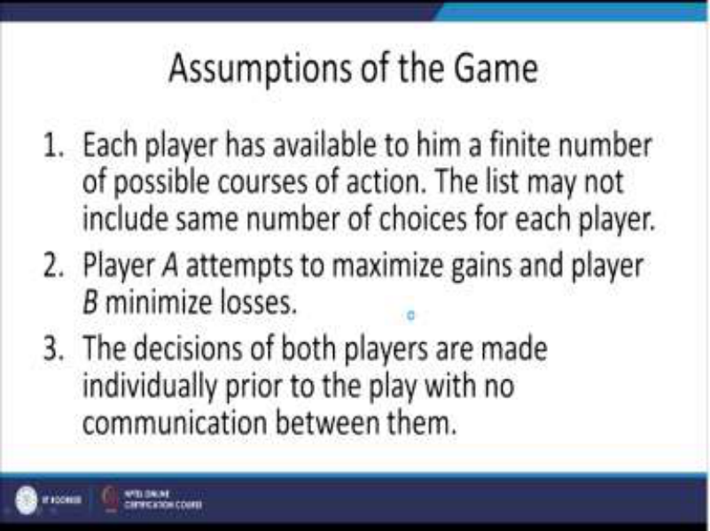

Now, we need to make some assumptions of the game. Number 1, each player has available to him a finite number of possible courses of action. The list may not include same number of choices for each players. As you have seen in the example, it is not necessary that m and n are same, they could be different also and that is why the reason, it is called as a rectangular game and not as a square game. 

Second assumption says that player A attempts to maximize gains and player B minimizes losses. Third assumption says the decision of both players are made individually prior to the play with no communication between them. 

**(Refer Slide Time: 12:14)** 

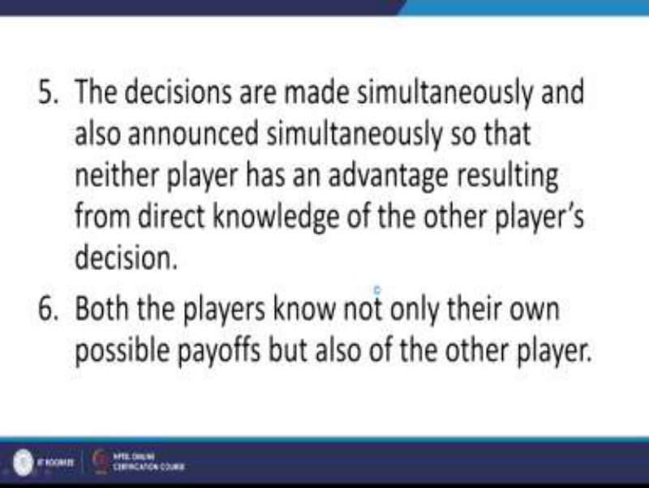

Number 5, the decisions are made simultaneously and also announced simultaneously so that neither player has an advantage resulting from direct knowledge of other player’s decision. 

Number 6, both the players know not only their own possible payoffs but also the others players payoff. 

**(Refer Slide Time: 12:45)** 

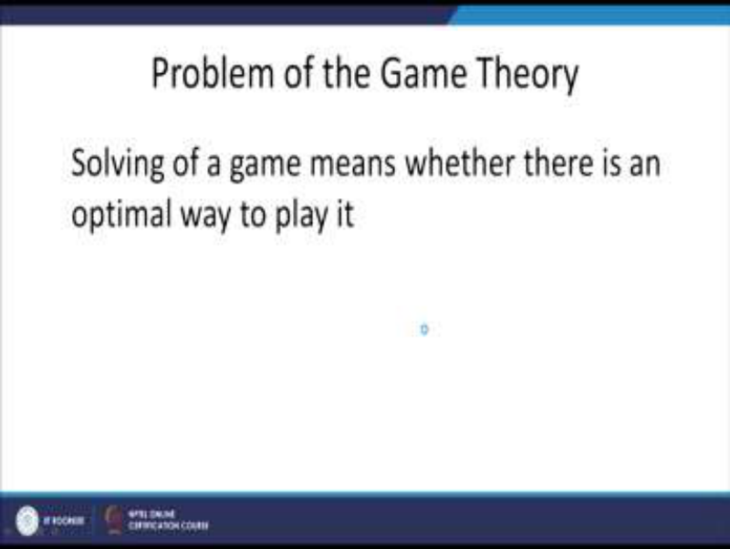

So, since this is a decision-making problem let us understand what is the problem of game theory. It says that solving of a game means whether there is an optimal way to play the game or not. So, we have to define the game and then find out whether there is an optimal way to play the game or not. 

**(Refer Slide Time: 13:13)** 

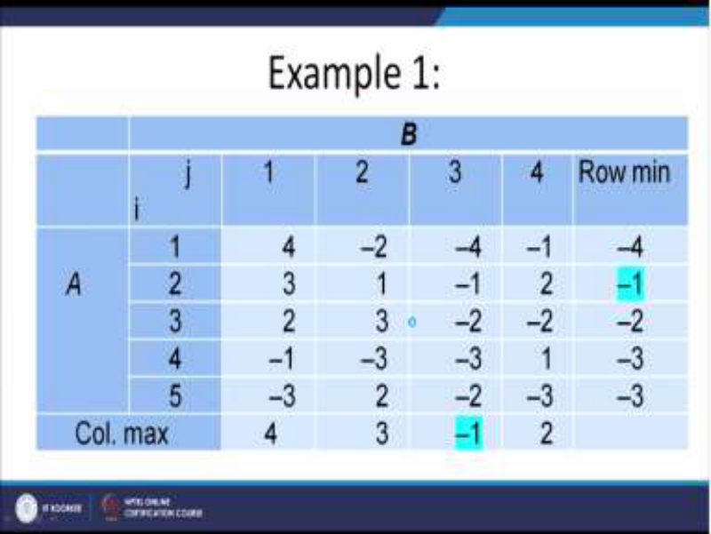

So, let us take an example. In this example, we have 2 players A and B and as you can see that B has 4 choices and A has 5 choices. They are shown in this pay off matrix aij where some of them are positive and some of them are negative. In the last column, I have also indicated the row minimum corresponding to each of the rows. And at the last row, I have 

shown the column maximum which are shown by indicating the maximum entry in that particular column. Now, what is the meaning of these, row minimum and column maximum, I will explain in a minute. 

**(Refer Slide Time: 14:02)** 

Now, A wishes to obtain the largest possible aij by choosing some i where i goes from 1, 2 up to 5 and B is determined to make A’s gain the minimum possible by his choice of j=1, 2, 3, 4. So, A is called the maximizing player and B is called the minimizing player. 

# **(Refer Slide Time: 14:31)** 

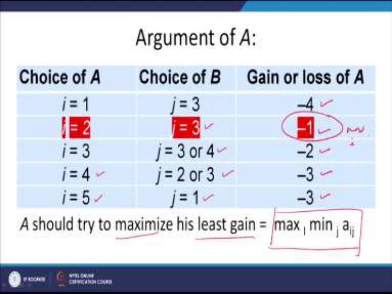

Now, let us look at the arguments of the player A and arguments of the player B separately. Now, first of all let us look at the arguments of the player A. Now, on the first column, I have shown the choices of A and in the second column, I have shown the choices of B. So, when A, the player A makes a move, makes a choice then the player B has to make a choice. So, 

what does it say? It says that if the player A chooses his move as i=1, then the player B makes a choice j=3. Now why did this come? Let us look at the given table. Now, here you find if A=1, if i=1 the player A makes this choice. Then, it is his objective that B should have minimum. So, amongst this 4 -2 -4 and -1, he will want that it is the minimum, so the minimum is -4 and that is the reason why -4 is indicated in the row number 1. So, the choice of B is j=3 because this 4 was coming from j=3. 

Again, let us look at the second situation, when i=2, the choice of B is j=3. Why is that so? Let us look at the table again, i=2 and amongst this 3 1 -1 2, the least is -1 and that is what is shown over here and it is again corresponding to the j=3, that is j=3. Let us come to the i=3 case. When i=3, then you find that the minimum is occurring at -2 and -2 which is corresponding to j=3 and j=4. So, there are two possibilities, j=3 or j=4 and the same thing happens for i=4, j=2 or 3 and for i=5 j=1. Also, in the last column I have indicated the gain or the loss for the player A. So, you can see that at each of the places, we have to look at the one that is the minimum. So, in the first case, it is -4, second case it is -1 and then -2, -3, -3. So, all these entries are indicated in the last column over here. So, this is the argument of the player A. So, A should try to maximize his least gain and that is the reason why we need this quantity max over i , min over j aij and that is what is indicated in this entry -1 because this is the maximum of all these entries. It is the maximum over i for minimum over j. 

**(Refer Slide Time: 18:47)** 

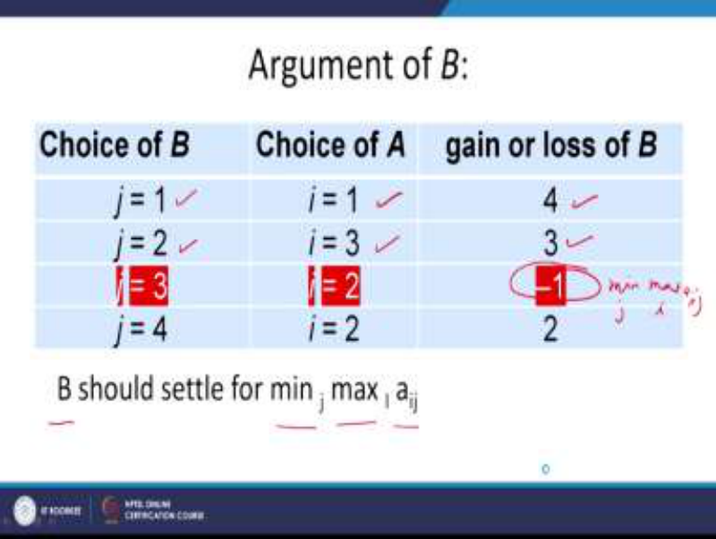

Now, let us look at the argument of B, it is the other way round. Now, for the argument of B, we find that if the choice of B is j=1, then the choice of A is i=1. How is that so? Just let us go back to the table. If j=1 then i is also=1. If j=1 then i=1 and his gain or loss of B is 4. Let us look at the table, here you are. This is gain or loss is 4 and similarly for the other columns 

also when j=2 i=3 and gain or loss is 3. And the second and the third and the fourth column also has to be done in the same way but since this is the player B, so B should settle for minimum of j, maximum over i of aij and that is a reason why this entry is nothing but the minimum over j, maximum over i aij. So, what does it mean? That for the player A, we had max min of aij and for the player B we have min max of aij. 

**(Refer Slide Time: 20:33)** 

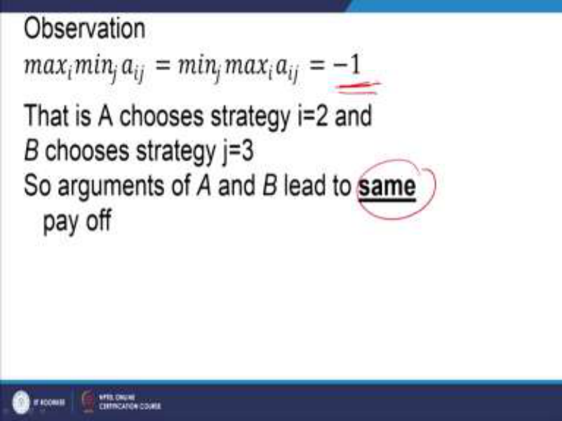

So, what do we observe that in this situation, both these quantities is same that is it is equal to 

-1. Thus, it means that A chooses the strategy i=2 and B chooses the strategy j=3 and therefore the arguments of A and B both the players lead to the same pay off because this -1 is the same. Now, you will wonder why this is so, but in general it may not be true that these two values are the same. 

# **(Refer Slide Time: 21:18)** 

Now, just look at this example. Here in this example, we have two players A and B and we find that the row minimum corresponding to each row 2 ,-3 and 7, the minimum is -3; second row -7 4 -5, minimum is -7 and like this for the other rows also; the third row also 5 -6 6 minimum is -6 and the maximum of this is -3. Coming to the columns, you find that out of 2 - 7 and 5, the maximum is 5. Similarly, for the second one, it is 4 and similarly for the third one, it is 7 but its minimum is 4. So what do we find? That max i min j aij is -3 and min j max i aij is 4. They are not same and in fact we observe that maximum of i minimum of j aij is strictly < minimum of j maximum of i aij. 

# **(Refer Slide Time: 22:50)** 

Now, let us define another definition which is the definition of the saddle point. If the pay off matrix aij is such that max min of aij = min max of aij = ars that is both of them are same equal to ars. Then, it is said to have a saddle point at the point rs and the optimal strategies of the players A and B are said to be at i=r and j=s respectively and ars is said to be the value of the game. Such games are called as pure strategy games. 

**(Refer Slide Time: 23:45)** 

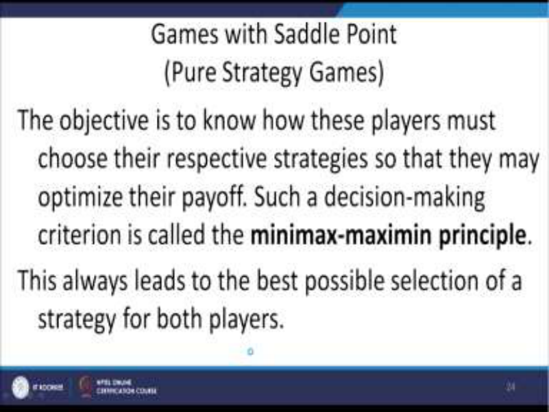

So, the games with saddle point or the pure strategy games the objective is to know how these players must choose their respective strategies so that they may optimize their payoffs, such a decision-making criteria is called as a minimax-maximin principle. This always leads to the best possible selection of a strategy for both players. 

**(Refer Slide Time: 24:20)** 

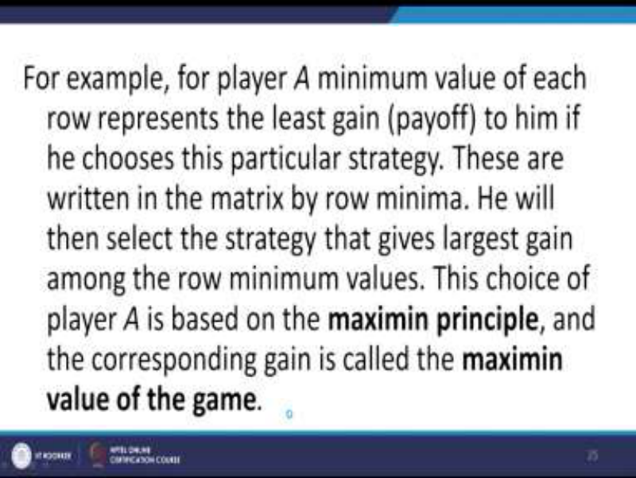

For example, for player A minimum value of each row represents the least gain or the payoff to him if he chooses this particular strategy. These are written in the matrix by the row minima. He will then select the strategy that gives largest gain among the row minimum values. This choice of player A is based on the maximin principle and the corresponding gain is called as the maximin value of the game. 

**(Refer Slide Time: 25:00)** 

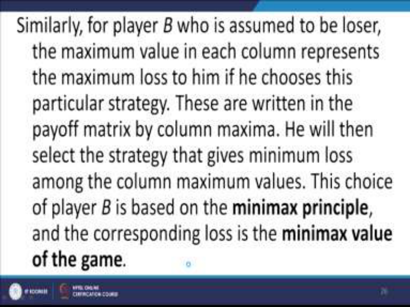

On the other hand, the player B who is assumed to be a loser, the maximum value in each column represents the maximum loss to him if he chooses this particular strategy. These are written in the payoff matrix by column maxima. He will then select the strategy that gives minimum loss among the column maximum values. This choice of player B is based on the minimax principle and the corresponding loss is the minimax value of the game. 

**(Refer Slide Time: 25:42)** 

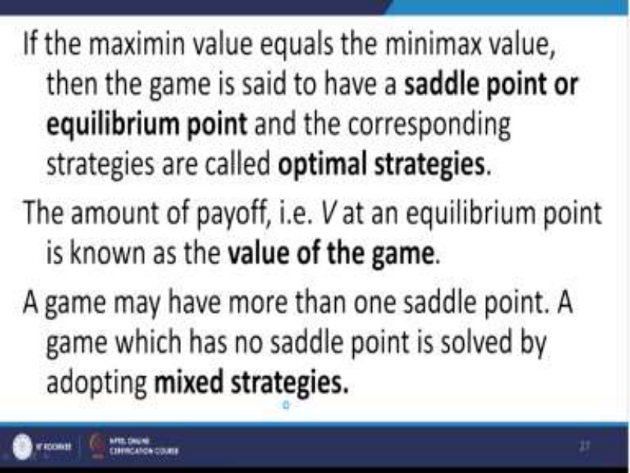

If the maximum value equals to the minimax value, then the game is said to have a saddle point or an equilibrium point and the corresponding strategies are called the optimal strategies. The amount of payoff that is V at an equilibrium point is known as the value of the game and a game may have more than one saddle point. A game which has no saddle point is solved by adopting the mixed strategies which we will be doing in the next lecture. 

**(Refer Slide Time: 26:22)** 

It may be of interest to note that the value of the game in general satisfies the equation maximin value <u><</u> V <u><</u> minimax value and secondly a game is said to be a fair game if the lower or the maximum and upper that is minimax values of the game are equal and both equal to 0. Number 3, a game is said to be strictly determinable if the lower maximin and upper minimax values of the game are equal and both equal to the value of the game. 

**(Refer Slide Time: 27:11)** 

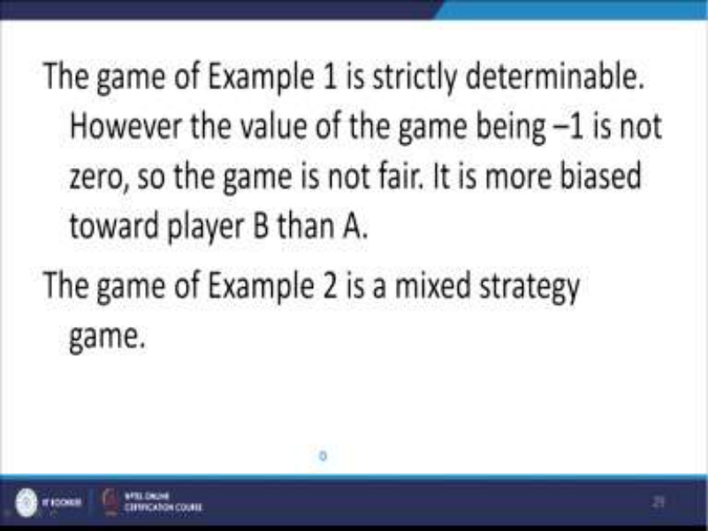

Now, the game of example 1 is a strictly determinable game value; however, the value of the game being -1 is not 0. So, the game is not a fair game, it is more biased towards the player B than the player A and the game of the example 2 is a mixed strategy game because there is no saddle point in the example 2. So, with this we come to an end of the first case of the pure strategies zero-sum games. Thank you. 

