# **Operations Research Prof. Kusum Deep Department of Mathematics Indian Institute of Technology – Roorkee** 

# **Lecture - 37 Theorems of Games Theory** 

Good morning students. This is lecture number 37. The title of this lecture is some theorems and definitions related to the game theory. We will see that there are a number of mathematical relations which are used to define the behavior of the pay off matrix. 

**(Refer Slide Time: 00:57)** 

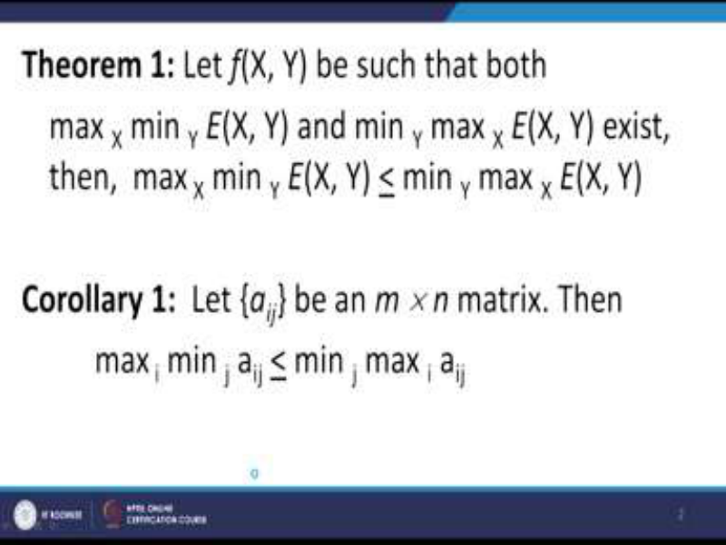

So, let us look at the first theorem, which says that let f(X, Y) be such that both max X min Y _E_ (X, Y)  and min Y max X _E_ (X, Y)  exist, then the inequality holds, that is, max X min Y _E_ (X, Y) < min Y max X _E_ (X, Y)  . Now, you will realize that this happens when we have a saddle point and that saddle point is satisfying this inequality. I mean when the saddle point is there then that is an equality but if the saddle point does not hold then the inequality holds. Now, based on this theorem, we can also have a corollary which says that let { _aij_ } be an _m_  _n_ matrix. Then 

max i min j aij <u>< min j max i aij</u> _._ 

What does this mean? This aij is the matrix which is defining the game when you have a twoplayer game. So, this is the pay off matrix and the inequality holds for the aij’s that is the max min < min max and remember that max is over i and min is over j. 

**(Refer Slide Time: 02:51)** 

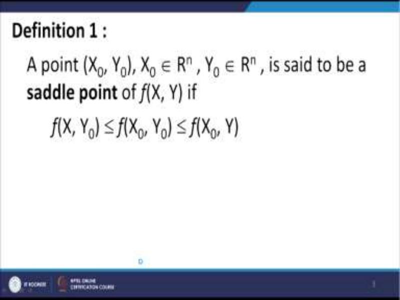

So, here comes a definition, a point (X0, Y0), X0  Rn , Y0  Rn , is said to be a **saddle point** of _f_ (X, Y) if the following condition holds, that is, _f_ (X, Y0)  _f_ (X0, Y0)  _f_ (X0, Y) . Remember, what is the saddle point, we have discussed this in the previous lecture. Saddle point is the max min and min max. So, if the max min and min max are both same, then it is said to be a saddle point. And if this condition does not hold, that is if they are not equal, then the conditions of the previous theorem they hold and accordingly for the point (X0, Y0). It is said to be a saddle point if this condition holds for the X0  Rn , Y0  Rn . 

**(Refer Slide Time: 04:01)** 

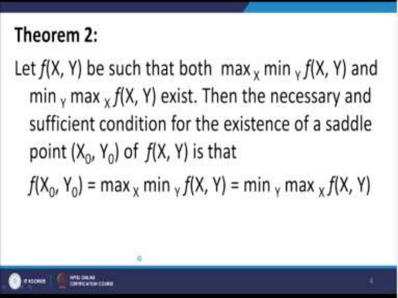

So, here is the theorem 2, Let _f_ (X, Y) be such that both  max X min Y _f_ (X, Y) and min Y max X _f_ (X, Y) exist,  where the min is over Y and max is over , then the necessary and the sufficient 

condition for the existence of a saddle point (X0, Y0) of _f_ (X, Y) is that 

_f_ (X0, Y0) = max X min Y _f_ (X, Y) = min Y max X _f_ (X, Y) 

You need not worry about the proof, although if you are interested, you can look at the literature for the proof of these theorems. 

**(Refer Slide Time: 05:04)** 

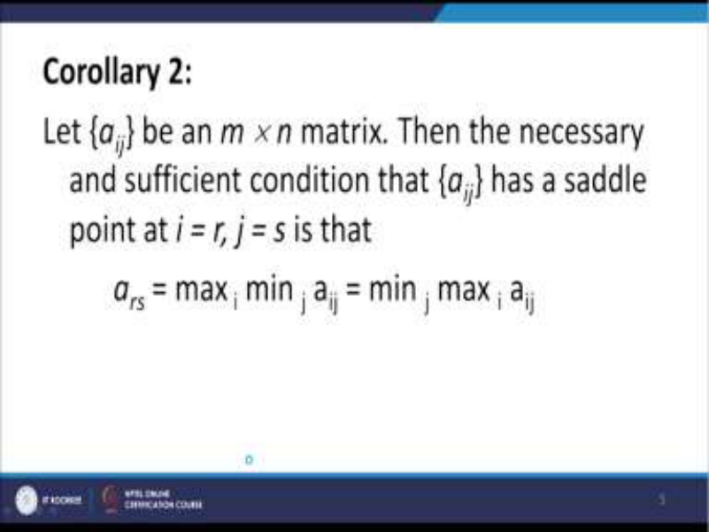

Here is a corollary based on the theorem 2. As before, let aij be a m x n matrix, then the necessary and the sufficient condition that { _aij_ } has a saddle point at _i = r, j = s_ is that 

_ars_ = max i min j aij = min j max i aij . 

Now the corollaries for the theorem 1 and the theorem 2 tells you that for the generalized function that is stated in the theorem, the results hold when we have the pay off matrix of the game theory. 

# **(Refer Slide Time: 05:58)** 

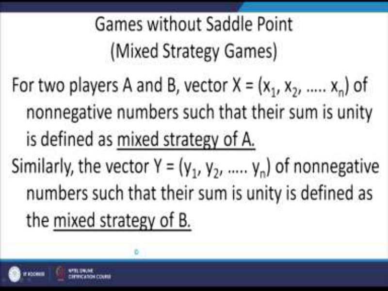

So, now let us look at the games without saddle points. They are also called the mixed strategy games and in this situation, we have the two players A and B and vector X = (x1, x2, ….. xn) of nonnegative numbers such that their sum is unity is defined as mixed strategy of A _,_ and similarly the vector Y = (y1, y2, ….. yn) of nonnegative numbers such that their sum is unity is defined as the mixed strategy of B _._ 

**(Refer Slide Time: 06:44)** 

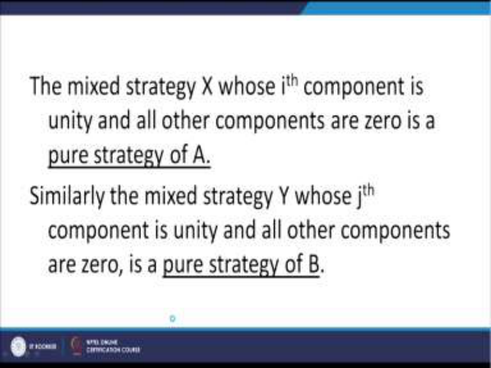

The mixed strategy X whose ith component is unity and all other components are 0 is a pure strategy of A and similarly the mixed strategies Y whose jth component is unity and all other components are 0 is the pure strategy of B. So, based on these definitions, it is obvious to note that the mixed strategies are the generalization of the pure strategies. 

**(Refer Slide Time: 07:23)** 

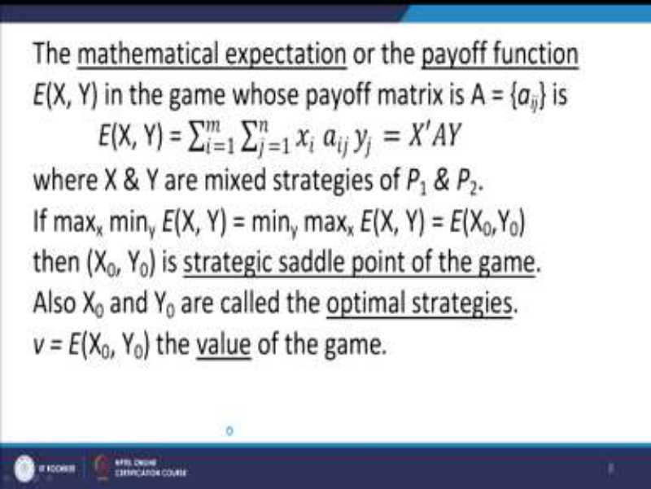

Now, coming to the definition of the mathematical expectation or the payoff function, it is denoted by capital E(X, Y) in the game whose payoff matrix is given by A= {aij} is defined like this 

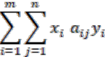

where i goes from 1, 2,… m and j goes from 1, 2,…. n because in general we have a m x n matrix A which is defining the payoff. This can also be written in the vector notation as X’ AY. Now, here X and Y are the mixed strategies of the two players, let us say P1 and P2 and the aij matrix as I said is the matrix corresponding to the strategies of the A and B, the payoff of the A and B. So, if the max X min Y E(X, Y) =min Y max X E(X, Y) = E(X0, Y0). Then, (X0, Y0) is called the strategic saddle point of the game. That is to say that this is the best strategy which the players should use. That is (X0 ,Y0) is the strategic saddle point of the game. Also, (X0, Y0) are called the optimal strategies and the function value that is E (X0, Y0) also we denote it by _v_ is called the value of the game. 

# **(Refer Slide Time: 09:31)** 

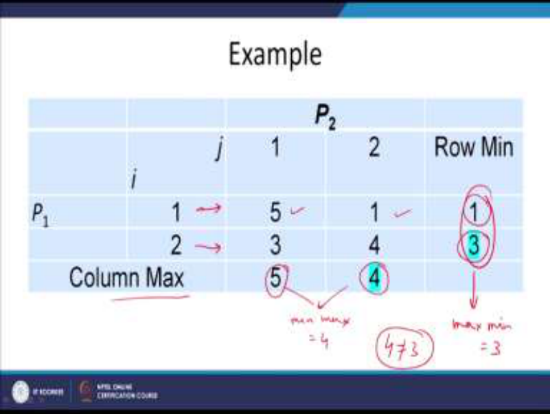

Now, let us look at an example. Here, you can see that the there are two players P1 and P2. So, P1 has the two strategies, 1 and 2 and P2 has the two strategies, 1 and 2. Now, this is a two by two game and we have to write down the row minimum and the column maximum to find out whether there is a saddle point to this game or not. Now, let us look at the first strategy for the player P1 and here we find that 5 and 1 says that the minimum is 1. 

So, we will write it in the third, the last column that is the row minimum column. Similarly, when the P1 (the player 1) is looking at the strategy 2 that is i=2, then we have to look at 3 and 4 and the minimum is 3. Then, we have to pick out the maximum of both these entries. 

So, max min this gives us 3. On the other hand, the same thing we have to do for the player P2 and we find that out of 5 and 3, maximum is 5 because we are writing the column maximum. And similarly for the second one, that is if P2 uses this strategy j=2, then between 1 and 4, the maximum is 4 and then we have to look at which of them is the minimum. So, min max and this comes out to be 4 and what do we find, we find that 4 is not equal to 3. Therefore this game does not have a saddle point. 

**(Refer Slide Time: 11:35)** 

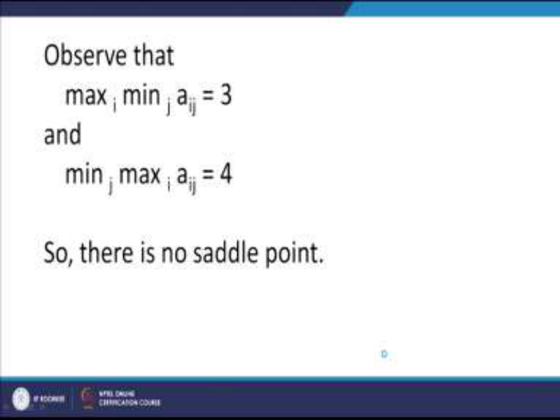

Yeah, I have written it again, that is max min of aij is 3 and min max of aij is 4, so there is no saddle point to this game. 

**(Refer Slide Time: 11:48)** 

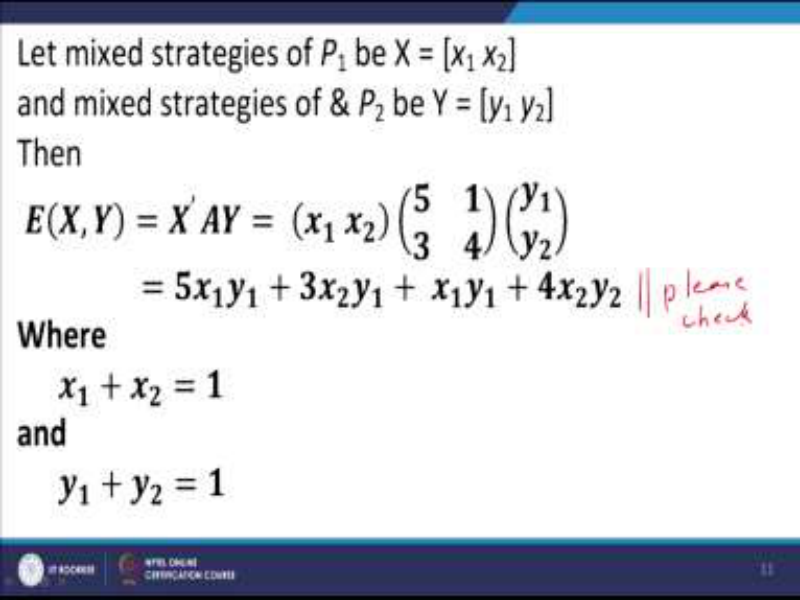

Now, let us look at the strategies of P1. The mixed strategies of P1, let it be denoted by X which is equal to x1 and x2 and, similarly let the mixed strategies of the player 2 be y1 and y2. 

Then, by the definition of the expected value E(X, Y) = X’ AY which in the vector notation can be written as (x1 x2)*(5 1; 3 4)*(y1 y2). Where did this (5 1; 3 4) come from? It came from the data that is given over here (5 1; 3 4). So, this is the payoff matrix. And in order to define the matrix multiplication, we need to write (x1 x2) as the row and (y1 y2) as the columns so that the multiplication is defined. Now, when you do the multiplication, this is what you get, you get 5x1y1+3x2y1+x1y1+4x2y2. So, I want you to please check the calculations and we also know that x1+x2 should be=1 and y1+y2 should be=1. These are the conditions that must be satisfied. 

# **(Refer Slide Time: 13:41)** 

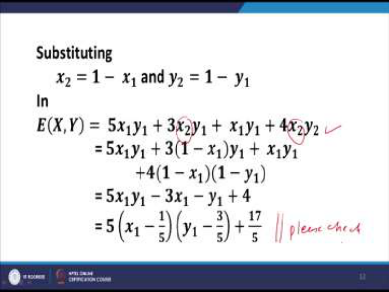

So, what we will do is we will use these conditions that is x2=1-x1 and y2=1-y1 and we will substitute it into the expected value expression. So, this expression is the one that I got in the previous slide, yeah that one 5x1y1+3x2y1+x1y1+4x2y2. So, in place of x2, we will substitute 1- x1 and in place of, we will open this out, in place of x2 we will substitute 1-x1 and similarly for y2 we will replace it by 1-y1. And when you simplify this, you should get the following expression. Please check this again. Check the calculations. You should get 5(x1-1/5) (y1-3/5) + 17/5. Now, as you know that the value of x1 should lie between 0 and 1 and similarly the value of y1 should also lie between 0 and 1. 

**(Refer Slide Time: 15:15)** 

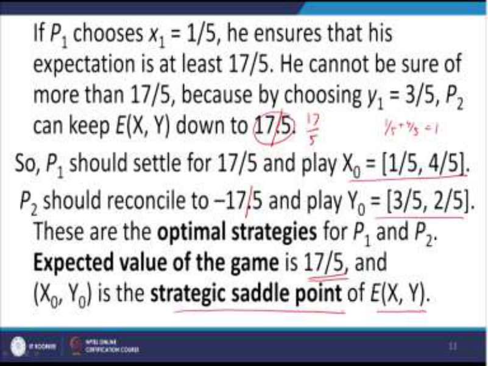

So, this expression tells us that if P1 chooses x1=1/5. Why is that so? x1=1/5 can you get this term. So, if the P1 chooses x1=1/5, he will ensure that his expectation is at least 17/5. Why is that so? Because this first term will become 0 and it will be left by, you will be left by 17/5. He cannot be sure of more than 17/5 because by choosing y1=3/5, P2 can keep E(X, Y) down to 17/5 sorry that is 17/5. So P1 should settle for 17/5 and play this strategy that is X0 = [1/5, 4/5]. Remember, the sum 1/5+4/5 should be=1. Now P2 should reconcile to -17/5 and play Y0 = [3/5, 2/5]. So, this is the same argument and accordingly sorry that should be 17/5, that is the typing mistake. These are the optimum strategies of P1 and P2 and the expected value of the game is 17/5 and [X0, Y0] is the strategic saddle E[X, Y]. 

So, X0 is given by [1/5, 4/5] and Y0 is given by [3/5, 2/5]. So, these are the [X0, Y0] is the strategic saddle point of the expected value E[X, Y]. **(Refer Slide Time: 17:32)** 

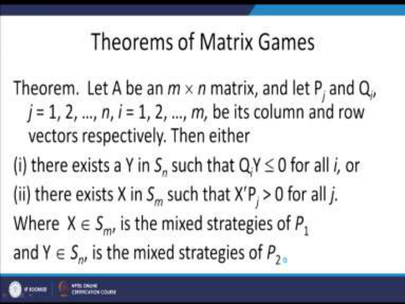

So, now let us come to the theorems of matrix games. The theorem says that let A be an _m_ x _n_ matrix and let Pj and Qi where j goes from 1, 2,… n and i goes from 1, 2,… m be its column and row vectors respectively. Then, the following two conditions hold, that is number 1, there exists a Y in Sn such that this condition holds QiY < 0 for all i or the second condition, there exists a X in Sm such that X’ Pj is strictly > 0 for all j. 

Please note the way in which the matrix multiplication has to be performed depending upon the way the number of columns and the number of rows are matching. Here, X  _Sm_ , is the mixed strategies of _P_ 1 and Y  _Sn_ , is the mixed strategies of _P_ 2. 

**(Refer Slide Time: 18:51)** 

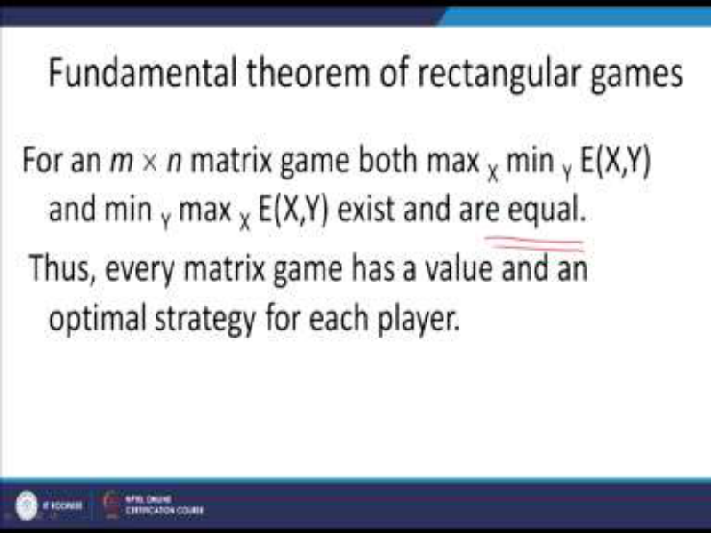

So, the fundamental theorem of the rectangular games for a _m_ x _n_ matrix game both max X min Y E(X,Y)  and min Y max X E(X,Y) exist and are equal. Thus, every matrix game has a value and an optimum strategy for the each player. So, this is a very important result in the game theory which says that every matrix game has a value and an optimal strategy for each player. 

**(Refer Slide Time: 19:45)** 

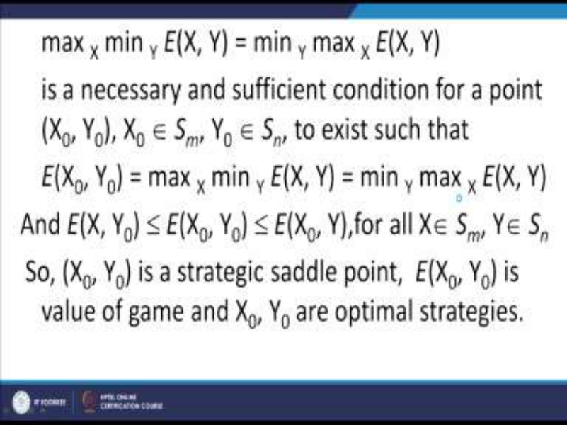

Now, let us look at it little closely, max X min Y _E_ (X, Y) = min Y max X _E_ (X, Y) is a necessary and a sufficient condition for a point (X0, Y0) where X0  _Sm_ , Y0  _Sn_ ,, to exist such that the _E_ (X0, Y0) = max X min Y _E_ (X, Y) = min Y max X _E_ (X, Y) . 

And the _E_ (X, Y0)  _E_ (X0, Y0)  _E_ (X0, Y), for all X  _Sm_ , Y  _Sn_ . So, therefore (X0, Y0) is a strategic saddle point and _E_ (X0, Y0) is the value of the game and X0 and Y0 are the optimal strategies for the game. 

**(Refer Slide Time: 21:26)** 

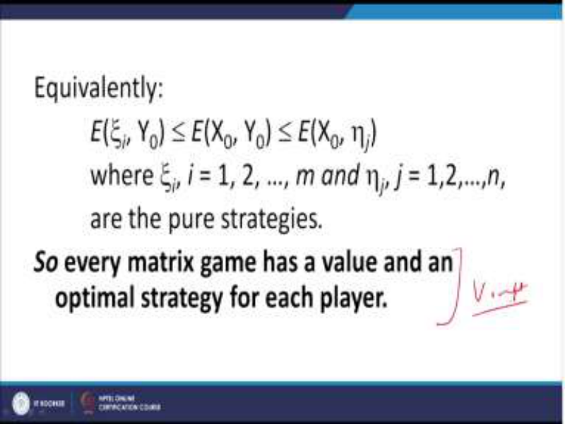

Equivalently, the following can be looked at. The following equation holds, _E_ (  _i_ , Y0)  _E_ (X0, Y0)  _E_ (X0,  _j_ ) and where the  _i_ , _i_ = 1, 2, …, _m and_  _j_ , _j_ = 1,2,…, _n_ , are the pure strategies _._ . So, every matrix game has a value and an optimal strategy for each player. So, this is a very important result right. 

**(Refer Slide Time: 22:26)** 

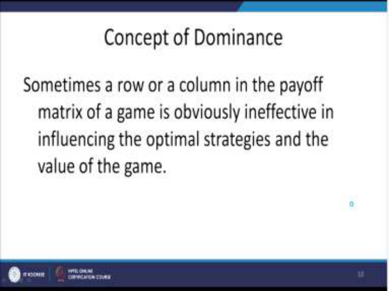

So, now let us come to another interesting concept. It is said to be the concept of the dominance. Now, sometimes a row or a column in the payoff matrix of a game is obviously ineffective in the influence of the optimal strategies and the value of the game. What does this mean? 

**(Refer Slide Time: 22:51)** 

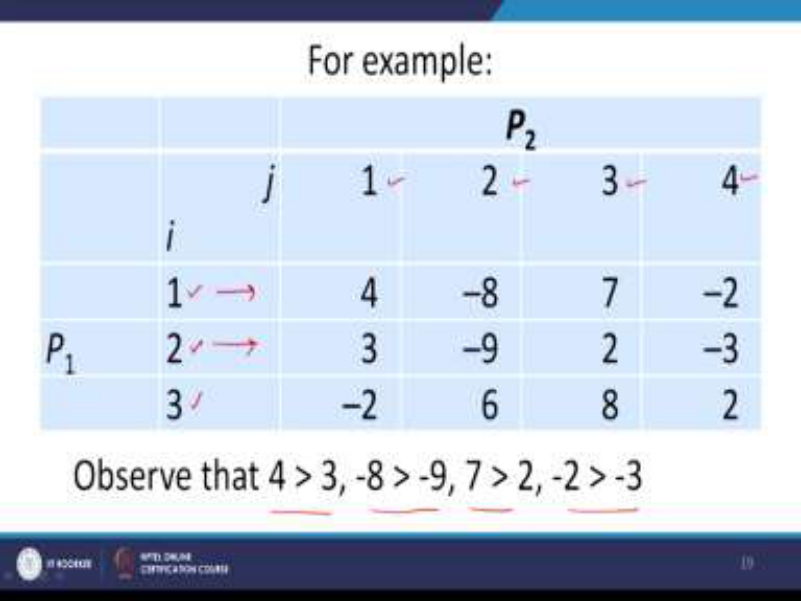

Let us take an example to understand this. So, suppose we have the player 1 who has three strategies 1 2 and 3. So P1 has three strategies, 1 2 and 3. Similarly, P2 has four strategies, 1 2 3 and 4 and the payoff matrix is given 4 -8 7 -2; 3 -9 2 -3; -2 6 8 and 2. Now, what do we find? We find that 4 > 3, look at the first and the second row, 4 > 3. Similarly, -8 > -9. We are looking at the first row and the second row and also 7 > 2 and -2 > 3. 

So, this is a special case where we find all the entries of the first row are greater than rather strictly greater than the corresponding entries of the second row. 

**(Refer Slide Time: 24:10)** 

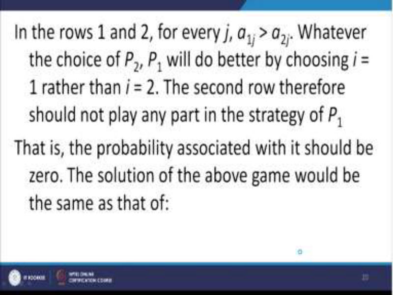

So, in row number 1 and 2 for every j, a1j > a2j and whatever the choice of P2, P1 will do better by choosing i=1 rather than i=2. So, therefore the second row should not play any part in the strategy of P1. That is, the probability associated with it should be 0 and the solution of the above game would be the same as that of the following game. 

**(Refer Slide Time: 24:52)** 

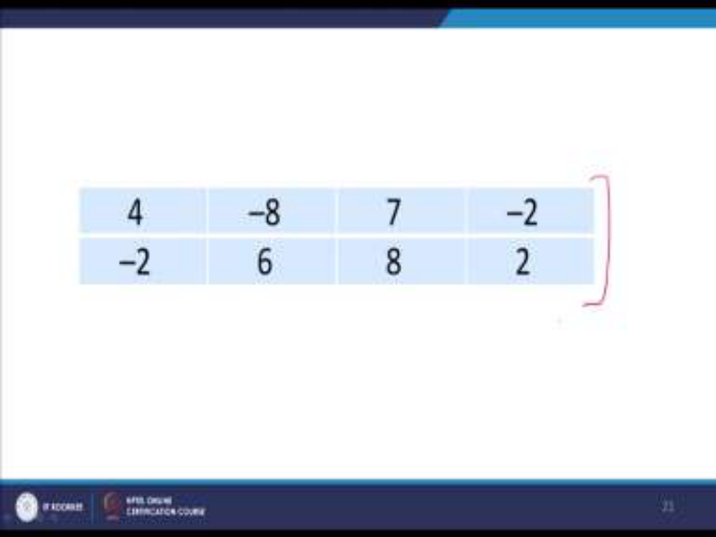

So, we can just forget about, look at this matrix. So, now the given matrix has been reduced to just these 2 rows, 4 -8 7 -2; -2 6 8 and 2. Let us look at the given matrix, so this second row could be easily deleted because it is ineffective. The first row is dominating the second 

row and therefore we can remove the second row and resulting matrix that we get of the payoff is the following. 

**(Refer Slide Time: 25:42)** 

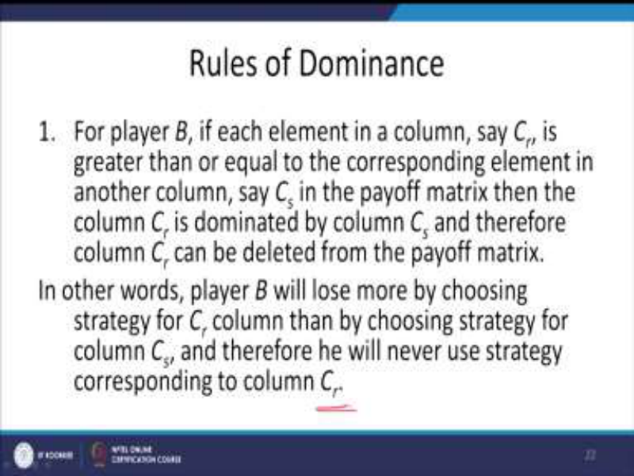

So, this is the concept of dominance and using the rules of dominance, we can reduce the given payoff matrix into a smaller dimension. This will help us in solving, finally the solution of the game. So, some of the rules for the dominance are as follows; number 1, for the player B if each element in a column, say Cr, is greater than or equal to the corresponding element in another column, say Cs, in the payoff matrix, then the column Cr is dominated by the column Cs and therefore Cr can be deleted from the payoff matrix. 

In other words, player B will lose more by choosing this strategy Cr column than by choosing this strategy for the column Cs and therefore he will never use this strategy corresponding to the column Cr. So, therefore Cr can be ignored. 

**(Refer Slide Time: 26:56)** 

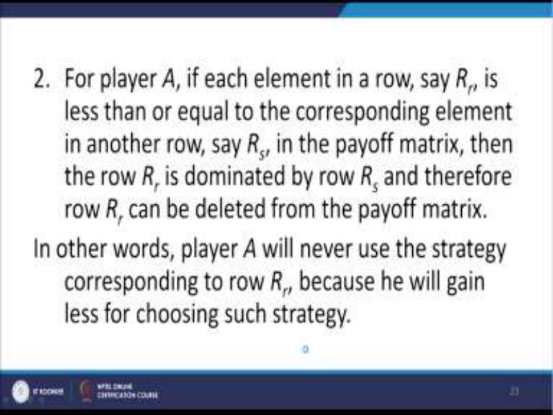

Now, the same kind of rule also holds for the player A. So, the number 2 rule says for the player A if each element in a row, say Rr, is less than or equal to the corresponding element in another row, say Rs, in the payoff matrix, then the row Rr is dominated by the row Rs and therefore the row Rr can be deleted from the payoff matrix. In other words, the player A will never use the strategy corresponding to the row Rr, because he will gain less by choosing such strategy. 

**(Refer Slide Time: 27:45)** 

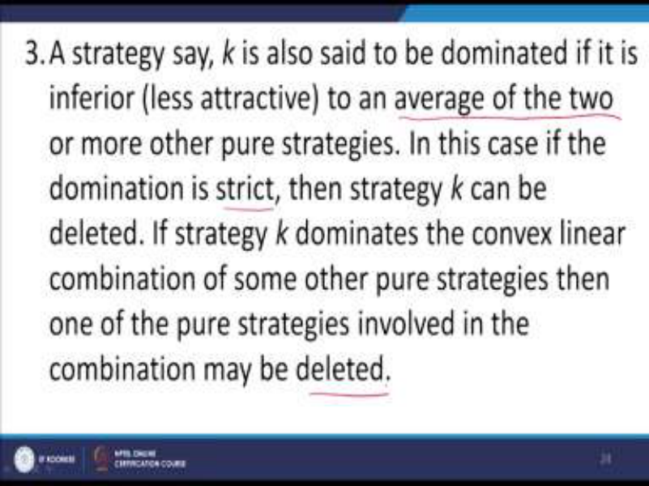

Rule number 3, a strategy, say k, is said to be dominated if it is inferior that is less attractive to an average of the two or more other pure strategies. So, here is another very interesting rule that is the average. In this case, if the domination is strict, then the strategy k can be deleted, so, if by strict it means that there should not be equality. 

So if the strategy k dominates the convex linear combination of some other pure strategies, then one of the pure strategies involved in the combination may also be deleted. So, this is also another trick to reduce the larger dimensional game to a lower dimensional game. 

**(Refer Slide Time: 28:48)** 

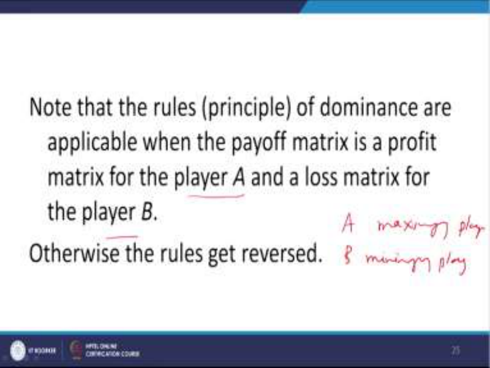

Note that the rules are the principles of dominance are applicable when the payoff matrix is a profit matrix for player A and a loss matrix for the player B. Otherwise, the rules will be reversed. So, this has to be kept in mind that these rules are corresponding to the case when the A is the maximizing player and B is the minimizing player. So A is the maximizing player and B is the minimizing player, otherwise the rules will be reversed. 

# **(Refer Slide Time: 29:36)** 

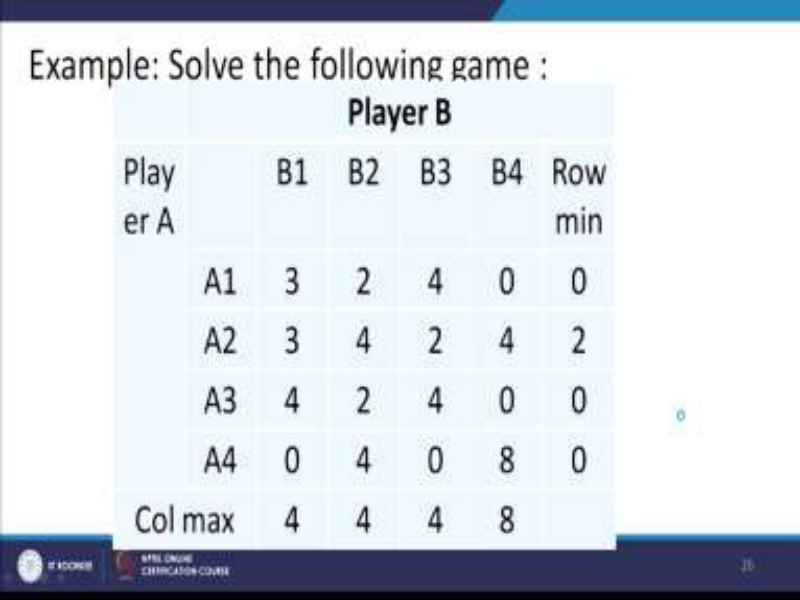

So, let us take another example. We have this two-player game, there is a player A and a player B and the player A has four strategies to choose from, that is A1 A2 A3 and A4 and, 

similarly the player B has 4 strategies to choose from that is B1 B2 B3 B4 and we will see whether there is any cases where we can use the principles of dominance and reduce this matrix. 

# **(Refer Slide Time: 30:14)** 

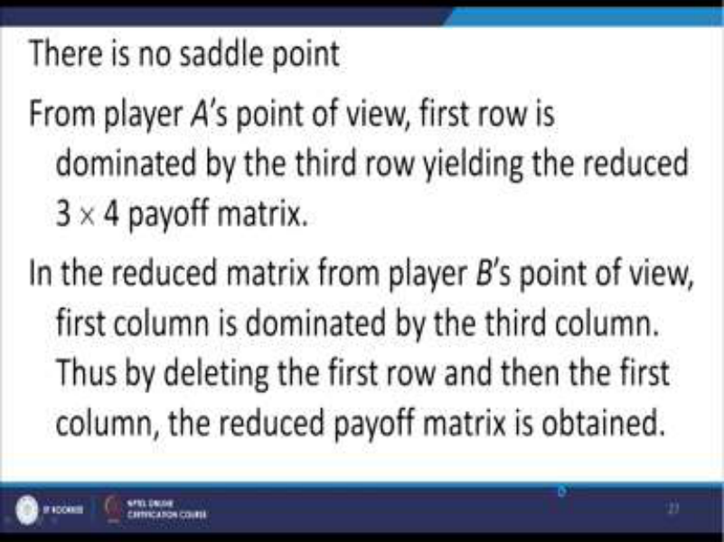

So, it is clear that there is no saddle point. You can just check it, here the minimum is 0, here it is 2 0 and 0 and this is the minimum. So, the maximum is 2 and similarly the 4 4 and 4, these are the maximums, the column maximums and you can see that the minimum is 4. So 4 is not equal to 2, so there is no saddle point. Now, from the point of view of the player A, the first row is dominated by the third row yielding the reduced 3 x 4 matrix. How is that so? **(Refer Slide Time: 31:01)** 

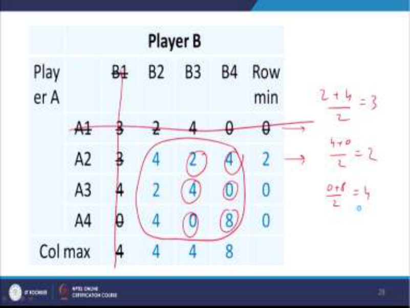

Just look at it, the first row is dominated by the second row, so therefore we can strike off the first row. Please you can check this and similarly once the 3 x 4 matrix has been obtained, in 

the reduced matrix from the player B's point of view, first column is dominated by the third column and thus we will delete the first row and then the first column and the reduced payoff matrix is obtained. 

So, here this is the first row that has been deleted and also the first column has been deleted. So, now we are left with 4 2 4; 2 4 0; 4 0 8. So, we are now left with this matrix. 

**(Refer Slide Time: 32:03)** 

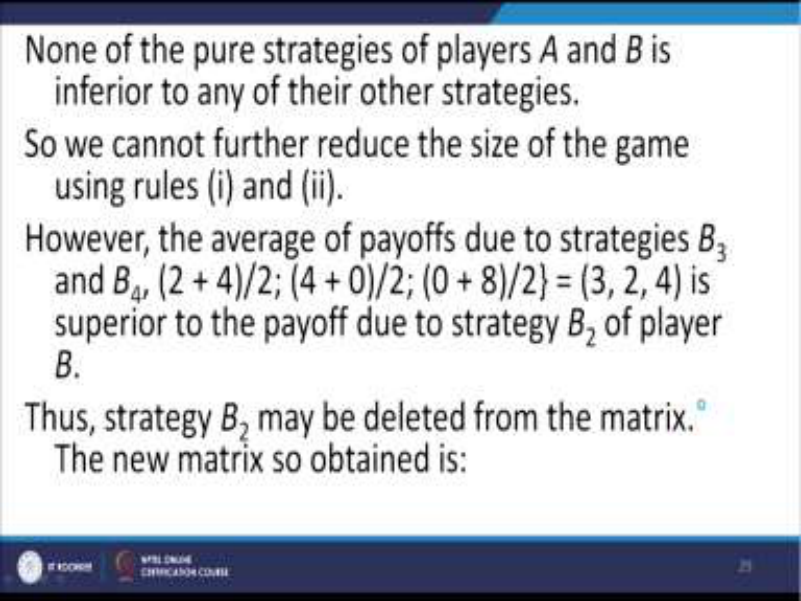

Next, none of the pure strategies of the player A and B is inferior to any other strategy. So, now the first rule of the dominance cannot be applied. So, we cannot further reduce the size of the game using the rule number 1 and rule number 2 but what happen, we find that the average of the payoffs due to the strategies B3 and B4, look at the strategies of the average of B3 and B4. So (2+4)/2 B3 and B4, so this is 2+4, so 2+4/2 and similarly 4+0, 4+0/2 and 0+8 that is 0+8/2. So, what do you get, you find that these averages gives rise to 3, 2 and 4. This is 3, this is 2 and this is 4 and now you compare this 3, 2, 4. This is superior to the payoff due to the strategy B2 of the player B. This is the superior to, 3, 2, 4 is superior to 4, 2, 4. So, therefore the strategy B2 may be deleted from the matrix and the new matrix obtained is as follows. 

**(Refer Slide Time: 33:42)** 

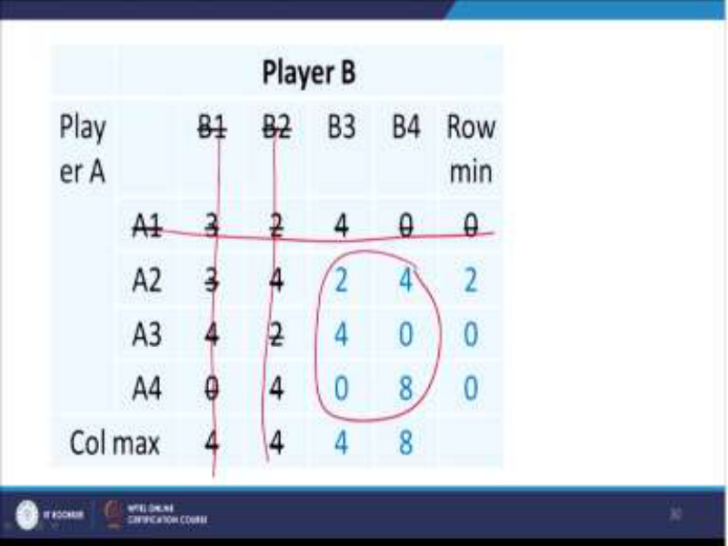

So B2 can also be deleted, earlier we deleted the first row and the first column, now we can delete the second columns. So, now we are left with just this matrix. 

**(Refer Slide Time: 33:56)** 

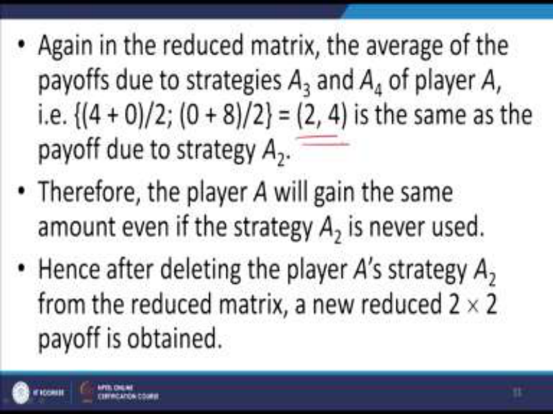

So, again in the reduced matrix, the average of the payoffs due to the strategies A3 and A4 of the player A that is 4+0/2, 0+8/2 which is comes out to be 2, 4 is the same as the payoff due to the strategy A2, you can just check it, 4+0/2 see 4+0/2, this is 2 and 0+8/2 which comes out to be 4. So, this is what we have verified. Therefore, the player A will gain the same amount even if the strategy A2 is never used. Hence, we can delete the player A’s strategy A2 from the reduced matrix and we can get a 2 x 2 resulting payoff as follows. **(Refer Slide Time: 34:52)** 

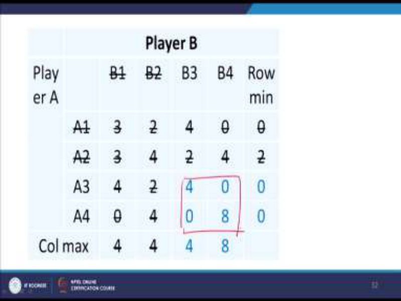

So, now only this matrix is remaining because all others have been deleted. **(Refer Slide Time: 35:02)** 

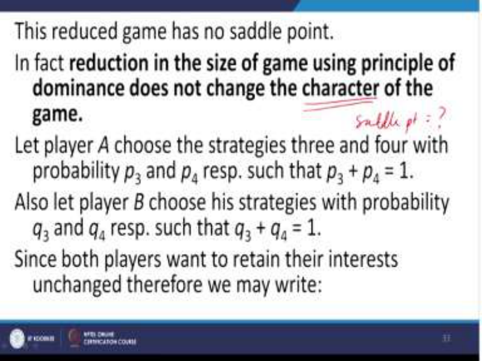

This reduced game has no saddle point, you can just check it. You can see that this game also has no saddle point because here it is 0 and here it is 8. So 0 is not equal to 8, so there is no saddle point. In fact, there is an important result which says that the reduction of the size of the game using the principle of dominance does not change the character of the game. By character of the game, I mean whether there is a saddle point or not. 

Now, let the player A choose the strategies 3 and 4 with a probability p3 and p4 respectively such that p3+p4=1 and also let the player B choose his strategies with the probability q3 and q4 such that q3+q4=1. 

**(Refer Slide Time: 36:15)** 

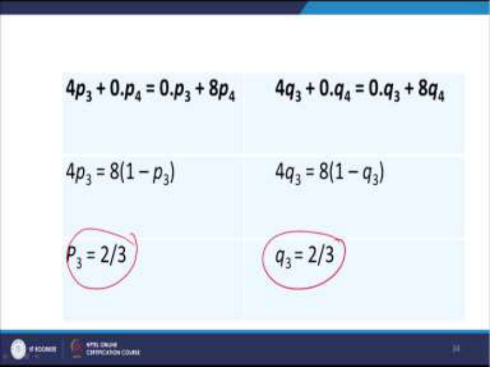

Since, both the players want to retain their interests unchanged, therefore we can write the following equations, 4 p3+0. p4=0. p3+8 p4 and this gives us that 4 p3=8(1-p3) and that gives us p3=2/3 and on the same way, 4 q3+ 0.q4 = 0. q3+8.q4 gives us 4 q3=8(1-q3) and this gives us q3=2/3. 

**(Refer Slide Time: 37:00)** 

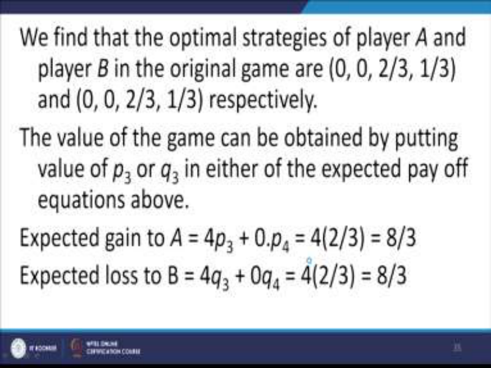

So, we find that the optimal strategies of the player A and the player B in the original games are (0, 0, 2/3, 1/3) and (0, 0, 2/3, 1/3) respectively. The value of the game can be obtained by putting the values p3 and q3 in either of the expected payoff equations above and therefore the expected gain of A turns out to be 4 p3 + 0 p4 which comes out to be 8/3 and similarly the expected loss of B=4 q3 + 0 q4 which comes out to be 8/3. 

So, with this we come to the end of this lecture based on some theorems and definitions related to game theory along with the concepts of dominance and their principles. Thank you. 

