# **Operations Research Prof. Kusum Deep Department of Mathematics Indian Institute of Technology - Roorkee** 

# **Lecture – 38 Games with Mixed Strategies** 

Good morning students, this is lecture number 38 on the topic of game theory and in this lecture we will study those games which have mixed strategies. 

**(Refer Slide Time: 00:42)** 

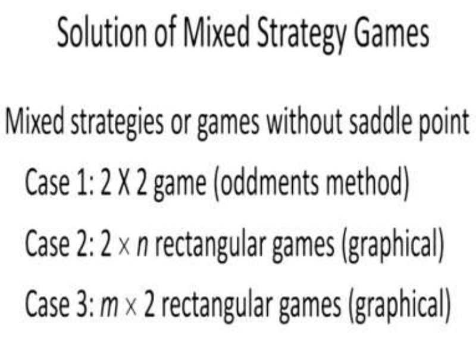

So in this lecture we will look at the following three cases; in the 1st case we have a 2 X 2 game and we will use the oddments method to solve this 2 X 2 game, the 2nd case is a 2 X n rectangular game and we will use the graphical method to solve this case. And similarly the 3rd case is the m X 2 rectangular game and we will use the graphical method to solve this case. **(Refer Slide Time: 01:18)** 

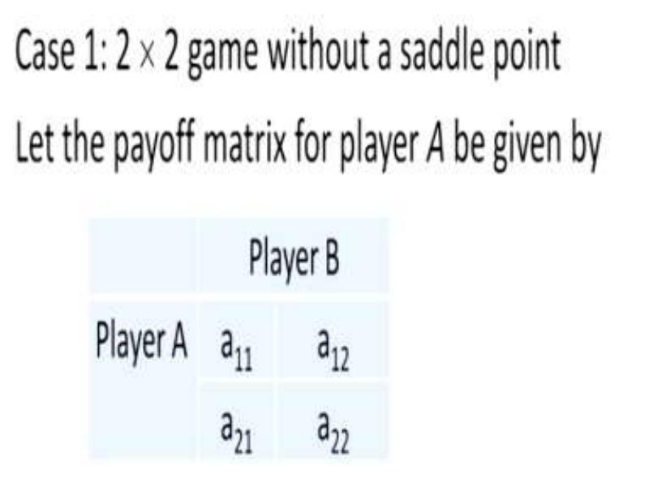

So first of all let us look at the case 1 which is the simplest case where we have a 2 X 2 game. Now since these are mixed strategy games so therefore these games do not have a saddle point. Now first let us look at the payoff matrix so there are two players player A and player B and these are the strategies of the both the players a11,a12, a21,a22. **(Refer Slide Time: 01:53)** 

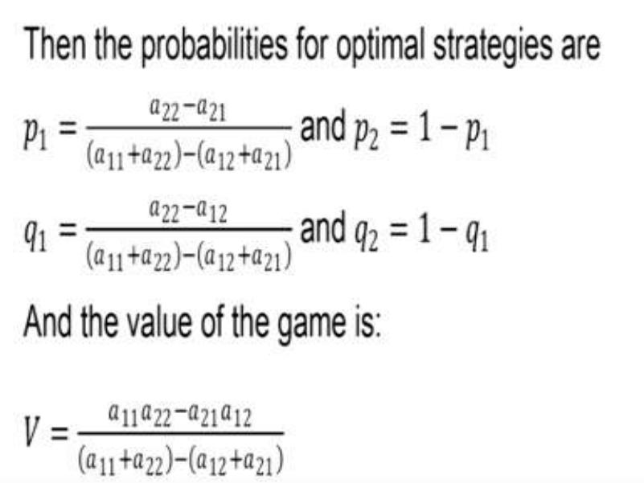

Then the probabilities for the optimum strategies can be obtained and using these formulas. If we say that p1 and p2 are corresponding to the 1st strategy of player A, and q1 and q2 are the strategies of player A corresponding to the 2nd strategy. These are the probabilities for the optimum strategies. Now these are the formulas that is p1 = (a22 - a21)/(a11 + a22) – (a12 + a21) and the sum of the p1 and p2 = 1. 

So, therefore we can say that p2 can be obtained using (1-p1). Similarly, for the 2nd strategy the q1 = (a22 - a12)/(a11 + a22) - (a12 + a21) and again using the same logic that q1+q2=1 we can obtain q2=1-q1 also we can derive the value of the game using the formula V= (a11a22-a21 a12)/(a11+a22) –(a12 + a21). Now it might be difficult to remember these formulas. And also we would like to understand how these formulas are derived. 

**(Refer Slide Time: 03:52)** 

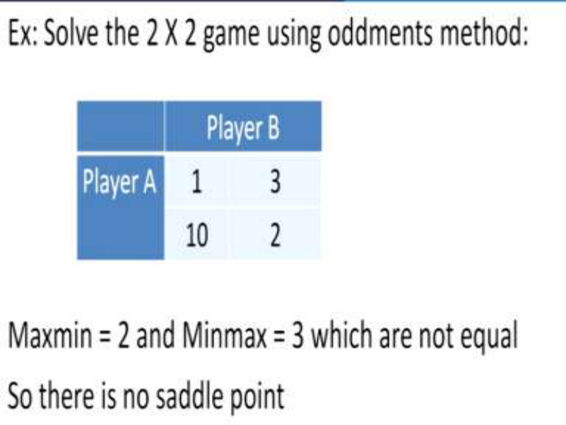

So let us take a simple example, in this example we have a 2X2 game where there are two players and they are payoff matrix is given by 1,3; 10 and 2. Now as you know, look at the row minimum and its maximum and then the column maximum and its minimum we find that Maxmin is 2 and Minmax is 3 which are not equal so there is no saddle point. So I hope all everybody knows how to determine the Minmax and the Maxmin. Now since this game does not have a saddle point. 

**(Refer Slide Time: 04:45)** 

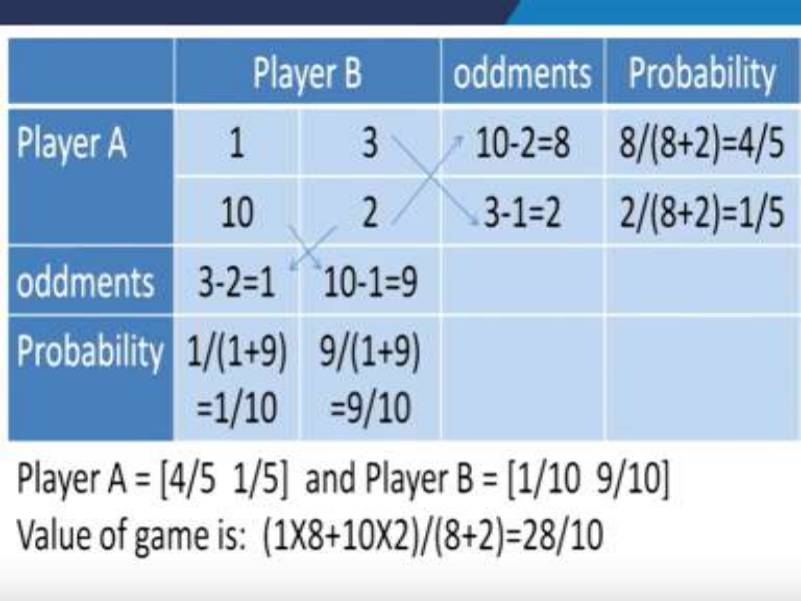

So we can use the mixed strategies like this. Now look at the payoff matrix along with the payoff matrix I have shown the oddments. Now this is the method that we want to learn so if you look at the 1st strategy corresponding to the player A, we find that there are two columns for B that is 1 and 3. Now we will find out the oddments by finding the difference between 3 and 1 and that is why this shows that in the 1st corresponding to the 1st row. We have 3-1 which 2, now this oddments has to be created by subtracting the smaller one from the larger one. No matter which one is smaller or which one is larger, always the oddments have to be calculated using the larger minus the smaller quantity. So in this case 3 is larger so therefore 3- 1= 2 and it has to be written in the other column not on the same row it has to be written on the different row. Then comes 10 and 2, now 10 is large so 10-2 and this entry has to be written in the 1st row and that comes out to be 8. So these are the two oddments corresponding to the strategies of the player A, now the same thing has to be done for the columns and as you can see 10-1 is 9. So this is again in the other column so this is 9 and similarly 3-2 has to be written in the other column so this is 1. 

So what we have done is we have just calculated the values of the oddments. Next we need to calculate the probabilities so for calculating the probabilities the formula that has to be used is 8/(8+2) where did this 8+2 come from this 8 and this 2. So 8/(8+2) which gives you 4/5; so this 4/5 is the probability corresponding to the 1st strategy of the player A and similarly we can calculate the probability corresponding to the 2nd strategy of the player A. 

This is calculated by 2/(8+2) and this comes out to be 1/5.  In the same way we will calculate for the columns and for the 1st 1 it is 1/(1+9) which is 1/10 and similarly for the 2nd one it is 9/(1+9) which is  9/10. So therefore the player A has the strategies 4/5 and 1/5 this is coming from these values and similarly for the player B 1/10 and 9/10 and the value of the game is obtained by (1X8+10X2)/(8+2)=28/10. You get the value of the game as 28/10 it can also be verified that if you do the same thing vertically you will get the same answer. **(Refer Slide Time: 08:52)** 

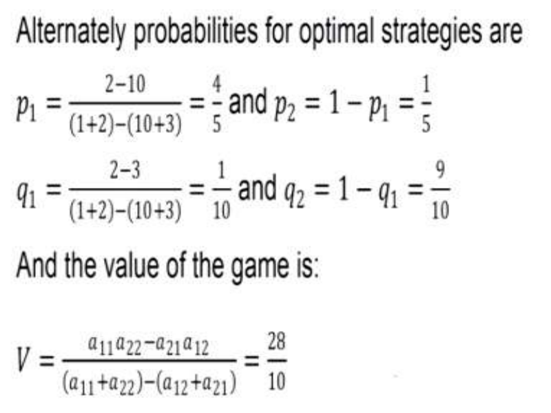

As I said using the formulas that I had given in the beginning we can also calculate the probabilities using those formulas and it is given by p1= (2-10)/(1+2) – (10+3) which gives you 4/5 and p2=1/5 because p2=1-p1 and similarly we can calculate q1 as (2-3)/(1+2)-(10+3) which is 1/10 and q2 = 1-q1 which is 9/10 and the value of the game can be determined by the formula (a11a22 - a21a12)/(a11+a22)- (a12+a21) which gives you 28/10. So that is the way to solve a 2x2 game which is does not have a saddle point. 

**(Refer Slide Time: 10:04)** 

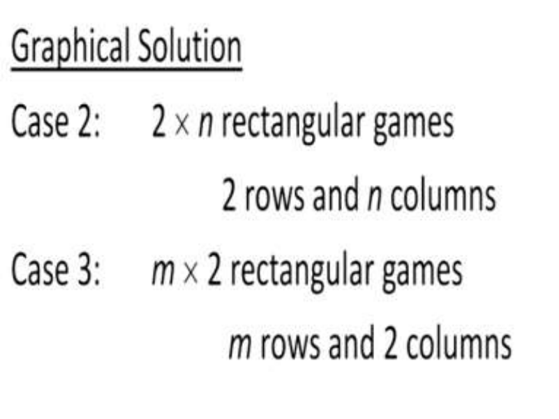

Now let us look at the second and the third cases where the second case is a 2xn rectangular game it consists of 2 rows and n columns and, similarly the case third that is mx2 rectangular game which has m rows and 2 columns. Both these cases can be solved using the graphical method. 

**(Refer Slide Time: 10:30)** 

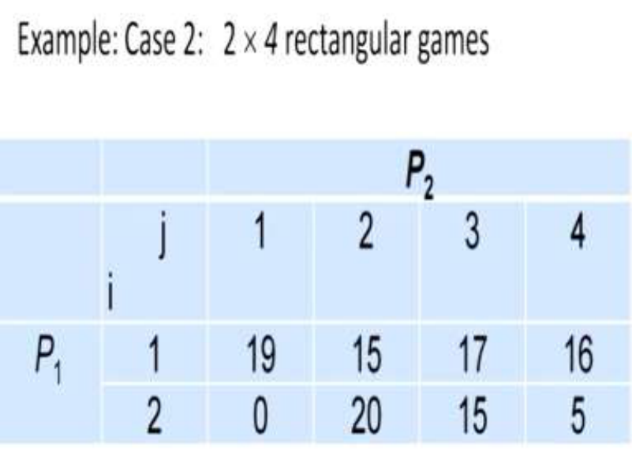

So let us look at the case 2 which is 2x4 rectangular game this is an example of two players. Let us say P1 and P2, and P1 has two strategies 1 and 2 and P2 has four strategies 1234 and the payoff matrix is given by 19,15,17,16,0,20,15 and 5. **(Refer Slide Time: 11:03)** 

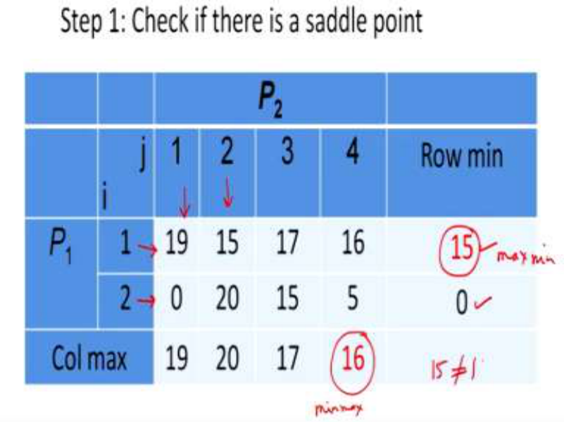

Now let us first check whether there is a saddle point or not and as you can see that in the last row I have mentioned the row minimum. So in the first row corresponding to the 1st strategy we find that the minimum value amongst 19,15,17 and 16 is 15 and similarly in the 2nd row the minimum amongst 0,20,15, 5 is 0 and since we want the maximum of these minimum values. So this 15 is the maximum then comes the columns. Amongst the columns we have to first choose the maximum entry. So in the 1st column that is for j=1 we have 19 and 0 so the maximum is 19 and similarly in the 2nd column we have 15 and 20, so maximum is 20; in the 3rd column we have 17 and 15 which gives us 17 as the maximum and in the 4th column we have the 16 and 5 and maximum is 16. Now amongst this 19 20 17 and 16 we find 16 is the one which is the minimum of these values. So this is the Minmax and obviously you can see that 15 is not equal to 16, so there is no saddle point in this game and therefore we can use the mixed strategies. So there is no saddle point and we can use the mixed strategies. **(Refer Slide Time: 12:56)** 

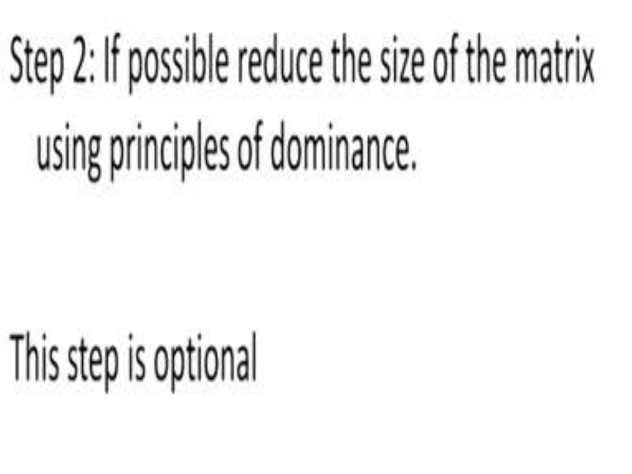

Now the second step in this method is to see if it is possible to reduce the size of the payoff matrix using the principle of dominance which we studied in the previous lecture. Usually it is easier to apply the principle of dominance to reduce the matrix so that the calculations are reduced but in general this step is optional, Because as I told you in the lecture on dominance the solution to the original matrix and the matrix after applying the principle of dominance remains the same. 

**(Refer Slide Time: 13:43)** 

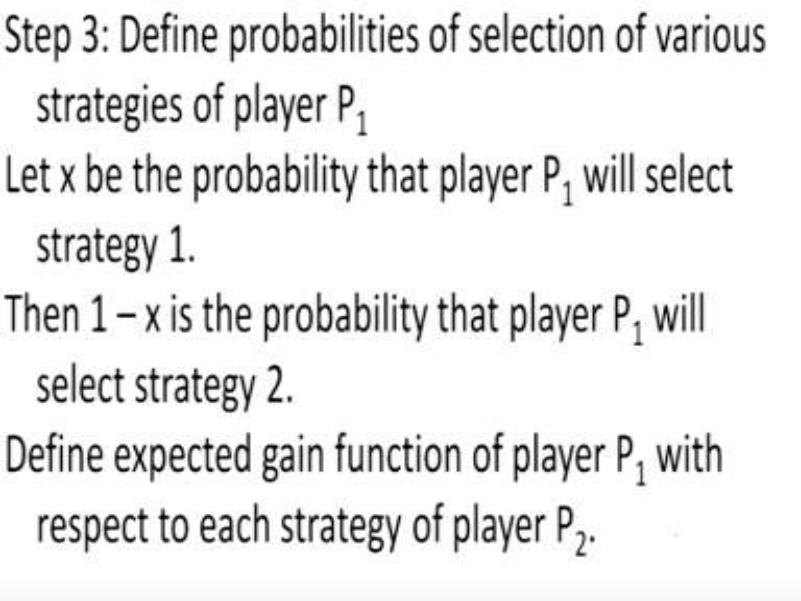

So now let us look at step number 3, this step tells us that we have to define the probabilities of selection of the various strategies of the 1st player P1. So what we will do is we will assume that x be the probability that the player P1 will select the 1st strategy then since their sum=1 we 

can say that (1-x) is the probability that the player P1 will select strategy 2. Then we can define the expected gain function fault for the player P1, with respect to each of the strategy of the player 2. 

**(Refer Slide Time: 14:39)** 

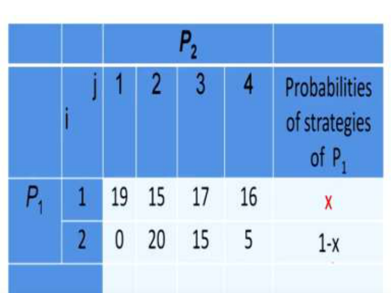

So this can be found out as follows, here in the last column we are assuming that the probability of the strategies of the player P1 are x and 1-x. **(Refer Slide Time: 14:55)** 

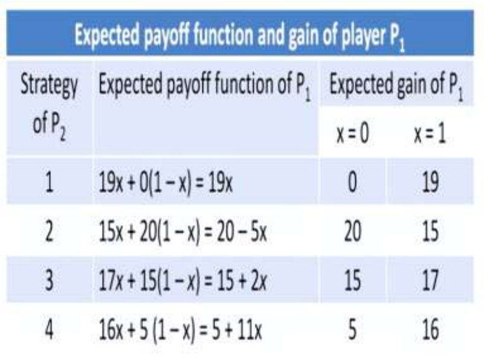

So now let us calculate the expected payoff function and the gain of the player P1. Now in the 1st column we have the strategies of the player P2 and remember that the P2 has four strategies 1234 and the expected payoff function of the player P1 can be written like this 19 x + 0 (1-x) 

which comes out to be 19x. Now how did this come the expected payoff function of P1. Let us go back to the table and we find if this is x is the probability corresponding to the 1st strategy, (1-x) is corresponding to the 2nd strategy so we will multiply 19 x 1st one I will do for you 19x + 0 (1-x) and that is what is shown here in the 1st row of the expected payoff function of the P1. And similarly we will do for the other cases also so this one will be 15x + 20 (1–x). And that is what is written here 15 x + 20(1-x) this comes out to be 20-5x when you simplify it and like that the 3rd one is 17x+15(1-x), which gives us 15+2x and finally the 4th one says 16 x+5(1-x) and this simplifies to 5+11 x. Now since this x is a probability and the value of the probability varies from 0 to 1. And these x it represents the probability this represents the expected gain of P1. Therefore the lower and upper range of x that is x= 0 and x=1 can be calculated so in this 19 x if you substitute x=0 you get 0 and if you substitute x=1 you get 19. So this tells us that the value of this expected function a payoff function will vary from 0 to 19 and like this for the other strategies strategy number 2 3 and 4. So what does it tell us? this tells us that we can plot these lines on the 2 dimensional graph. 

**(Refer Slide Time: 18:13)** 

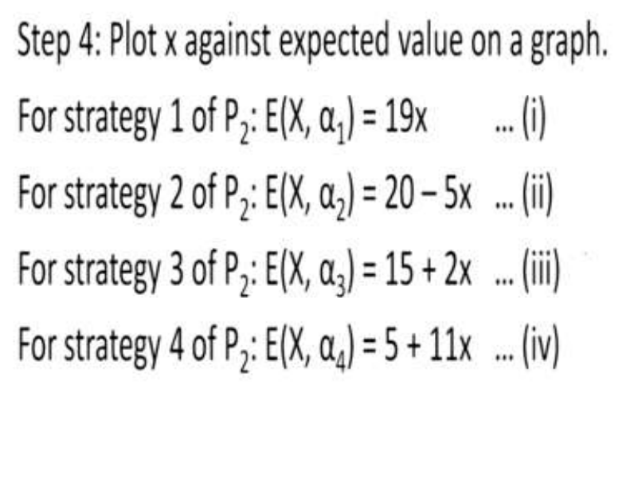

And that is what we have to do so in the step number 4 we will plot the x value against the expected value on a graph. So for strategy 1 of the player 2 we will denote the expected function let us say we will call it as E(X, α1) which is 19x and similarly for strategy to have the player P2 expected value of E(X, α2) it is 20-5x and like this for the strategy 3 and strategy 4 also. Now we will plot this on the 2 dimensional graph like this. 

# **(Refer Slide Time: 19:01)** 

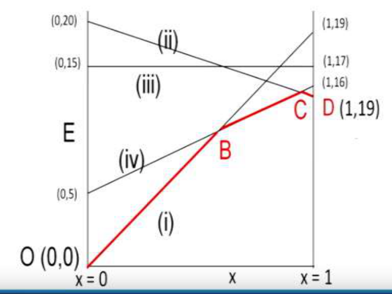

Now you find that this x=0 and x=1, actually on the x-axis you have x and on the y-axis you have expected value. So this 1st value corresponds to (0 0) and the 2nd value corresponds to (1, 19) and this is what is been shown here in this graph so this is x=0 at 0 it is 0 and at 1 it is 19. So this is the 1 and 19 and like this we can join these two points to construct a straight line this is corresponding to the 1st one. And similarly for the 2nd one I have drawn it here and similarly the 3rd one and the 4th one. So now we have got some lines these four lines representing the expected function and we have to find out the point which gives us the Maxmin. See this all these are minimum at each point for example let us say at this point this one is the minimum right. Similarly at this point this is the minimum. 

So the red line that has been drawn here that is A,B,C and D this is actually this area should be shaded this is the minimum and out of this minimum. we have to select that point which gives us the max. Because remember we are interested in the Maxmin so what do we find that the point given by see is the Maxmin. 

**(Refer Slide Time: 21:26)** 

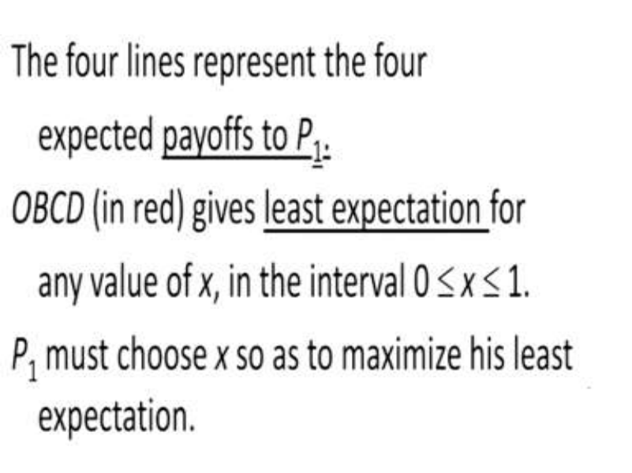

These four lines represents the four expected payoffs of the player P1 and the line OBCD which is shown in red colour gives the least expectation for any value of x between the interval 0<x<1 and in fact including the two points 0 and 1 as well. So P1 must choose x so as to maximise his least expectation so maximise his least expected corresponds to the Maxmin point and that is the reason why we are looking for C as the Maximin point. So C gives us the Maximin point so if P1 chooses x which corresponds to the maximum height, he will gain the maximum. 

**(Refer Slide Time: 22:25)** 

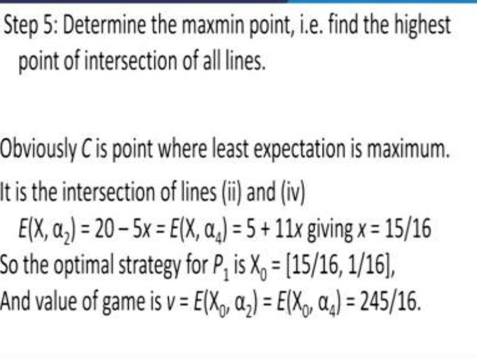

So let us look at this point and the corresponding expected value and this is obtained in the step number 5 determine the maximum point that is find the highest point of intersection of all these lines. So C is the point were the least expectation is maximum and it is the intersection of these 

two lines line number 2 and line number 4. So the expected value corresponding to the 2nd line that is _E_ (X, α2) = 20 – 5 _x_ . And similarly corresponding to the 4th line, _E_ (X, α4) = 5 + 11 _x_ and if you solve these two equations and you equate them because at the point of intersection these equations should be equated. So you get x=15/16 so this means that the optimum strategy of the player P1 should be 15/16 and 1/16. So as you know 1/16 has been obtained by subtracting from 1. Because both these sum of these strategies should be =1. So we have got x= 15/16. 1-x will be 1-15/16 which= 1/16 and also  I mean you could have done it the other way also by doing the other stuff also. But the value of the game v can be obtained as _E_ (X0, α2) or _E_ (X0, α4). See this this X0 is the point of intersection of the 2nd and the 4th line. So we can substitute this value into any of the two equations equation number 2 or equation number 4 and the value of the game that we will get is 245/16. 

**(Refer Slide Time: 25:03)** 

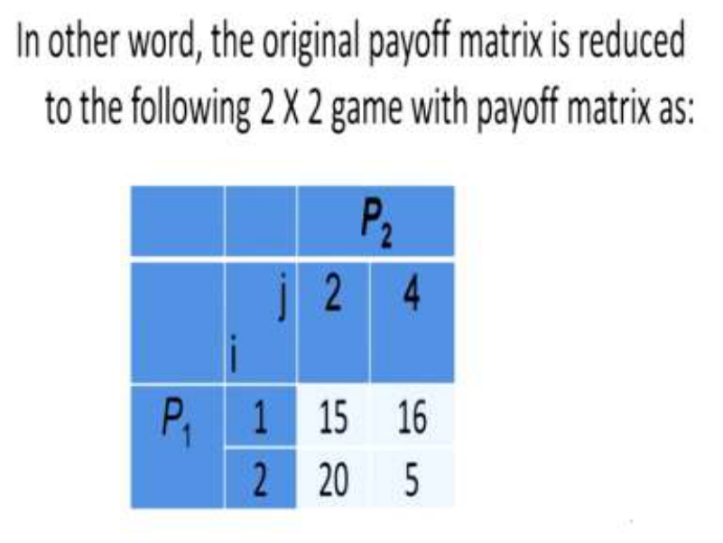

In other words the original payoff matrix is now reduced to the following 2x2 game with the payoff matrix given by 15,16,20,5. See the strategies of P2 are 2 and 4. So therefore you have reduced the original 2x4 matrix to the 2x2 matrix and as I have just mentioned this 2x2 matrix can be solved using the oddments method. **(Refer Slide Time: 25:44)** 

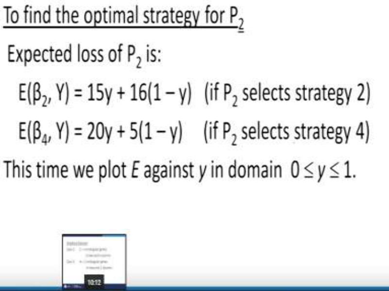

So to find the optimal strategies of P2 the expected loss of P2 is given by E(β2, Y) = 15y+16 (1y) this happens because if the player P2 selects the strategy 2 and also the E(β4, Y) = 20y + 5(1 – y) and this happens if the player P2 selects this strategy 4. Now this time we will plot the expected value against y in the domain 0  _y_  1. See we are doing this to find out the optimum strategies of the player P2 because till now we are found out only the optimum strategies of P1. **(Refer Slide Time: 26:50)** 

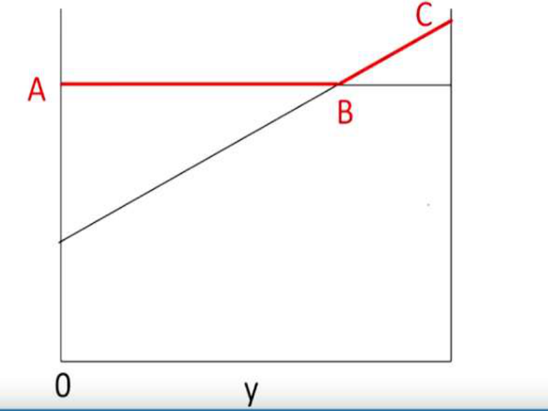

So this is the graph which represents the value of y so this is y=0 and this is y=1 on the y-axis we have the expected values. So therefore we will plot both these lines and as you know that since we are now looking at the strategies of the player P2. So therefore we are now interested in the Minmax point and it happens that the Minmax point is given by B. 

**(Refer Slide Time: 27:29)** 

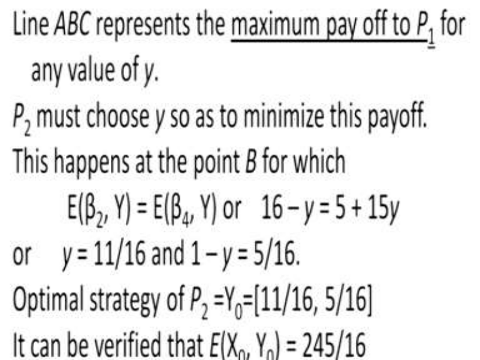

So the line ABC represents the maximum payoff to P1 for any value of y. So therefore P2 must choose y so as to minimise his pay off and this happens at the point B for which E(β2, Y) = E(β4, Y) or 16 – _y_ = 5 + 15 _y_ and when you solve this you get y=11/16 and 1- y=5/16. Therefore we conclude that the optimum strategies of the player P2 which is given by Y0 =[11/16, 5/16]. It can also be verified that the value of the game is 245/16. Now you will observe that the expected value of the game is the same for the player P1 as well as the player P2. This is not a coincidence there is a theory behind it and later on we will see why this happens. 

**(Refer Slide Time: 28:56)** 

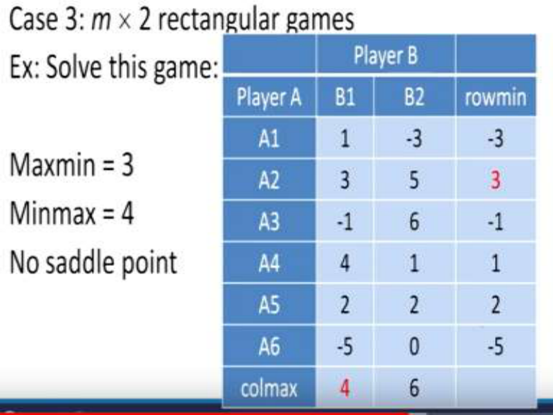

Now let us look at the 3rd case that is the case where mx2 rectangular games are given. So here we have two players A and B and the strategies of the player A are A1, A2 up to A6 and the strategies of the player B are B1,B2  and we have to solve this and very easily you can see that the Maxmin and the Minmax is shown here and you can see that the Maxmin is 3 and the Minmax is 4 and they are both different. So therefore this game has does not have a saddle point and we can use the mixed strategies to solve it. **(Refer Slide Time: 29:53)** 

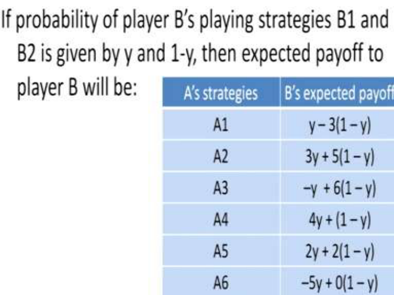

So if the probability of the player B’s playing this strategy B1 and B2 is given by y and 1-y then the expected payoff to the player B will be like this. So exactly in the same way in the same way which we did for the case 2 this time we will do for the player B. Because there are only 2 strategies where the player B has to play. So the corresponding to the two strategies of the player B we will say that we will assume that the probabilities are y and 1-y. And accordingly the corresponding strategies of the player A can be obtained using the formula y- 3(1-y) and similarly 3y+5(1-y) and like this. So you can correlate it is quite similar to the case 2 only thing is now instead of x we are using y why because we are now finding out the probabilities corresponding to the player B. **(Refer Slide Time: 31:10)** 

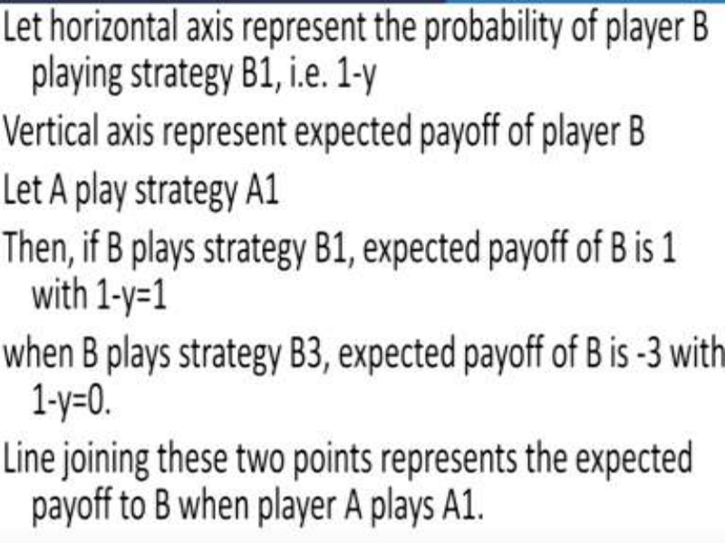

So let us now use the horizontal x-axis to represent the probability of the player B playing the strategy B1 that is (1- y) and the vertical axis will represent the expected payoff of the player B. So first of all let A play a strategy A1 and corresponding to the strategy A1 of the player A if B plays the strategy B1 then the expected payoff of B is 1 with 1-y=1 or in other words y=0 and when B plays a strategy B3 the expected payoff of B is - 3 with 1-y=0 that is y=1. I am sorry there is a slight correction this should be B2 okay. So the line joining these two points should represent the expected payoff to B when the player A plays the strategy A1. So it is exactly in the same lines as we have done in the case number 2. 

**(Refer Slide Time: 32:37)** 

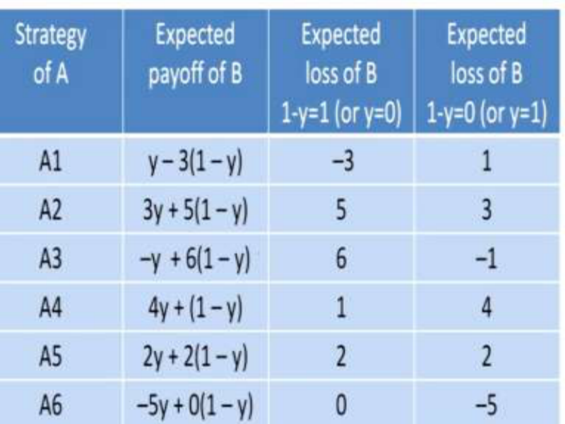

So in this table the 1st column shows the strategies of the player A that is A1,A2 up to A6. In the 2nd column is the expected payoff of the second player B which we have just obtained y- 3(1-y) etc and 3rd column shows the expected loss of B when 1-y= 1 or y=0 and similarly when 1-y=0 that is y=1 this can be obtained by substituting the value of y=0 and y=1 into the expected payoff of the player B just as we had shown in the previous case . 

**(Refer Slide Time: 33:31)** 

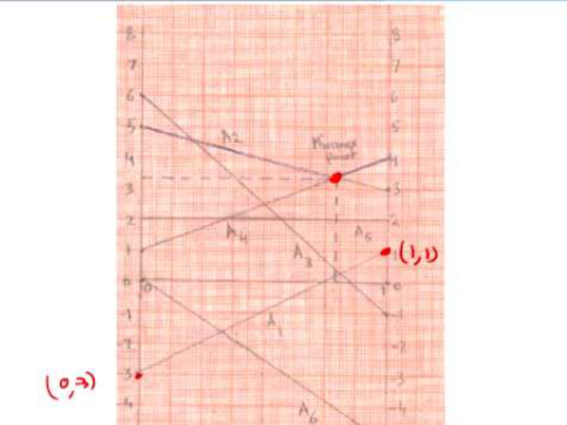

Next we will draw all these lines onto the graph , for 0 the expected value is - 3 so we have the point (0,-3) and the 2nd point is (1,1). So let us see how this is shown ,so (0,- 3) and (1,1). So these are the two points that have to be joined to get our 1st line so (0,-3) and (1,1) and similarly we will draw the other lines also. So that is (0,5) and (1,3) and like this the other lines so all these different lines we can draw the 2 dimensional graph and as before now we need the Minmax point so this is the Minmax points and this Minmax point as you can see has been obtained and this is our solution. **(Refer Slide Time: 35:28)** 

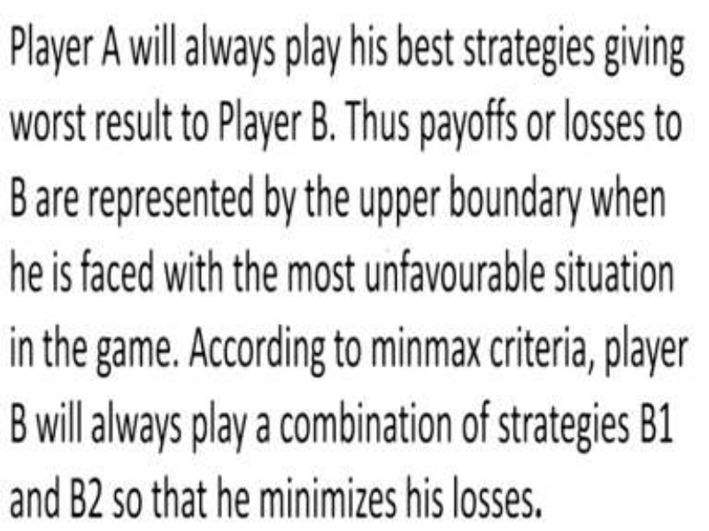

And the player A will always play his best strategy giving the worst results to the player B. Because remember our maximising player is the player A. So therefore the payoff or the losses to the player B are represented by the upper boundary when he is faced with the most unfavourable situation in the game and according to the Minmax criteria the player B will always play a combination of strategies B1 and B2  so that the he minimises his losses. **(Refer Slide Time: 36:08)** 

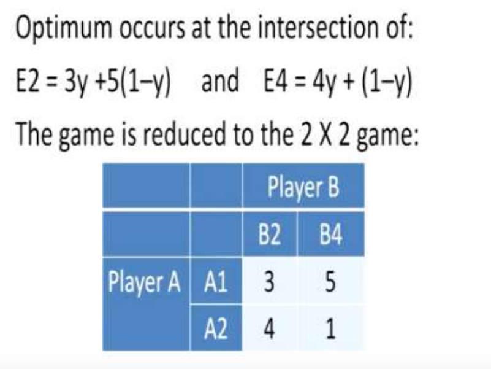

So therefore the optimum occurs at the intersection of E2 and E4. So E2 is given by 3y+5(1-y) and E4 is given by 4 y+(1-y) and therefore the game is now reduced to a 2x2 game where we have only two strategies corresponding to the player B that is B2 and B4. **(Refer Slide Time: 36:44)** 

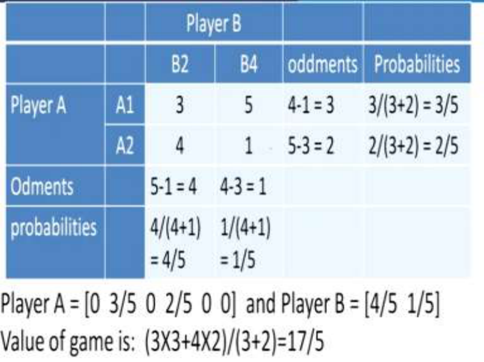

Again in order to get the strategies for the other player so we can now write down the oddments corresponding to A1 and A2 strategies. So again 4-1 should give me 3 and it has to be written into the 1st column and 3-5 or other 5-3 will give me 2 and this has to be written in the alternate rows. Same thing has to be written for the oddments corresponding to 4-3, 4-3 is 1 so it comes here and 5-1 gives me 4 so it comes to the other column. And once we have calculated the oddments then we need to calculate the corresponding probabilities which is given by 3/(3+2) which is 3/5 and 2/(3+2) which is given by 2/5. So we have got the probabilities 3/2 and 2/5 and similarly for the columns we can get the probabilities as 4/(4+1) which is given by 4/5 and 1/(4+1) which is given by 1/5. So this means that the player A has the strategies [0,3/5,0,2/5 0 0] why is that so?. This is so because remember that the player A had 6 strategies okay and only 2 and 4 are surviving. 2 is surviving and 4 is surviving rest of them are 0. So therefore when we write the final strategies of the player A then we have to write 0 corresponding to the 1st one corresponding to the 3rd one and similarly corresponding to the 5th one and the 6th one that is why the player is strategies are given by [0,3/5,0,2/5,0 0]. And similarly for the player B we have the strategies 4/5 and 1/5 these are obtained in this row. Also we can calculate the value of the game by using the formula for the oddments method which is given by (3X3+4X2)/(3+2) which gives me 17/5 and that is the value of the game. So this brings us to the end of this lecture on games without saddle point. Thank you. 

