# **Operations Research Prof. Kusum Deep Department of Mathematics Indian Institute of Technology - Roorkee** 

# **Lecture – 39 Solving m X n Games** 

<mark>Hello students, this is lecture number 39 and the title is we are going to study the most generalized m X n games. Now as you know, that we have first studied the simplest case that is the 2x2 game then we have studied by the mx2 game and then we have studied the 2xn game.</mark> 

**(Refer Slide Time: 00:53)** 

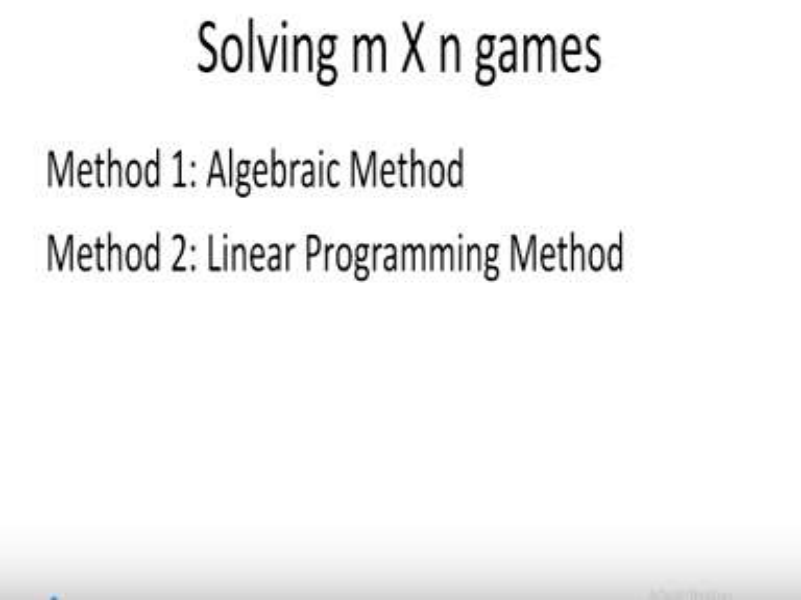

<mark>Now this is the most generalized situation where we have a</mark> _<mark>m x n</mark>_ <mark>game that is the payoff matrix is of the type a</mark> ij <mark>which is an m</mark> _<mark>x</mark>_ <mark>n matrix. Now we will study two methods for this kind of a scenario, the first one is called the algebraic method and the second one is the linear programming method.</mark> 

**(Refer Slide Time: 01:20)** 

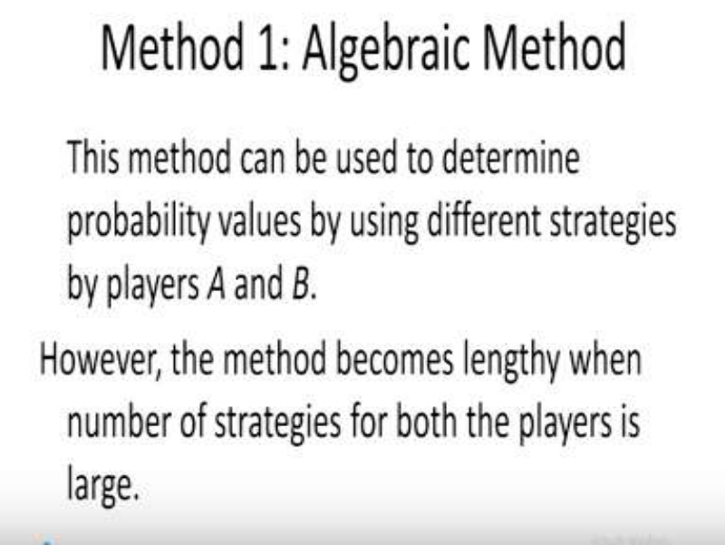

<mark>So the first method that is the algebraic method is fairly simple and it means that we are going to convert the problem into a set of equations and then determine the value of the p</mark> i’ <mark>s and the q</mark> i <mark>’s and the value of the game. So this method can be used to determine the probability values by using the different strategies by the players A and B. However, this method might become quite lengthy when the number of strategies for both the players is very large. So that is the limitation of this method.</mark> 

**(Refer Slide Time: 02:06)** 

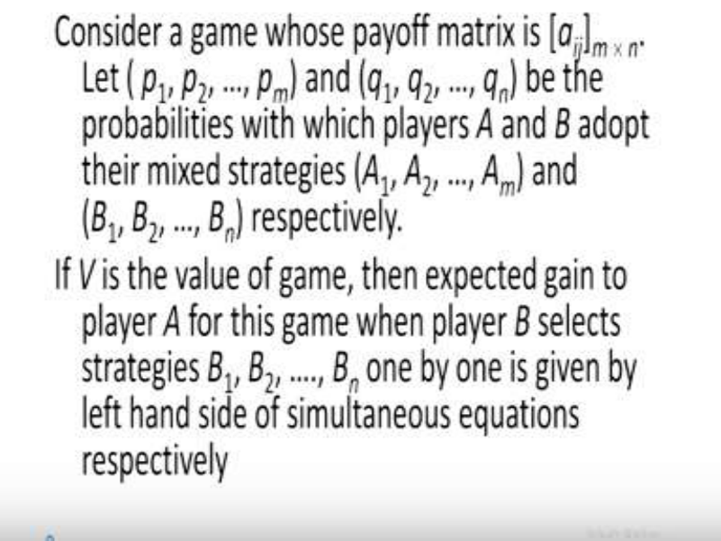

<mark>So look at this scenario suppose we have a game whose payoff matrix is given by the matrix [a</mark> ij <mark>] which is a m</mark> _<mark>x</mark>_ <mark>n matrix and let (</mark> _<mark>p</mark>_ 1 <mark>,</mark> _<mark>p</mark>_ 2 <mark>, …,</mark> _<mark>p</mark> m_ _<mark>)</mark>_ <mark>and</mark> _<mark>(q</mark> 1_ _<mark>, q</mark> 2_ _<mark>, …, q</mark> n_ _<mark>)</mark>_ <mark>be the probabilities with which the players A and B adopt their mixed strategies (</mark> _<mark>A</mark>_ 1 <mark>,</mark> _<mark>A</mark>_ 2 <mark>, …,</mark> _<mark>A</mark> m_ <mark>) and (</mark> _<mark>B</mark>_ 1 <mark>,</mark> _<mark>B</mark>_ 2 <mark>, …,</mark> _<mark>B</mark> n_ <mark>) respectively.</mark> 

<mark>If V is the value of the game then the expected gain to the player A for this game when the player B selects the strategies</mark> _<mark>B</mark>_ 1 <mark>,</mark> _<mark>B</mark>_ 2 <mark>, ….,</mark> _<mark>B</mark> n_ <mark>one by one is given by the left hand side of the simultaneous equations respectively.</mark> 

**(Refer Slide Time: 03:05)** 

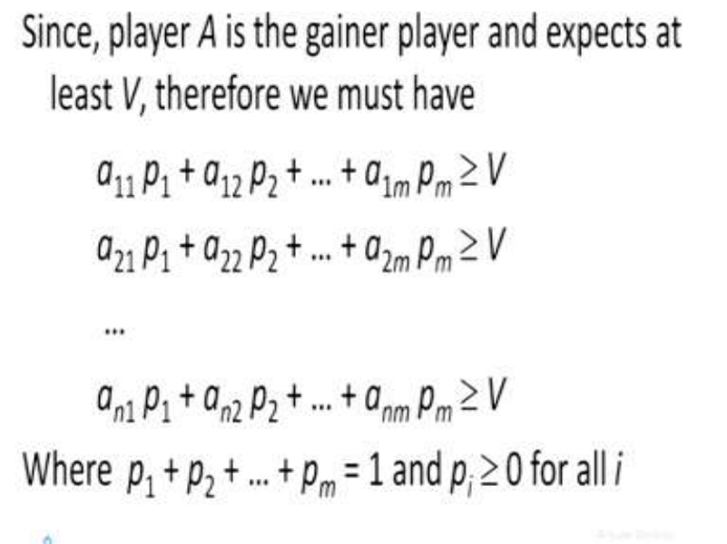

<mark>Now since the player A is the gainer player that is it is the winning player and the player A expects at least V that is the value of the game. Therefore we must have these conditions that is</mark> _<mark>a</mark>_ 11 _<mark>p</mark>_ 1 <mark>+</mark> _<mark>a</mark>_ 12 _<mark>p</mark>_ 2 <mark>+ … +</mark> _<mark>a</mark>_ 1 _m_ _<mark>p</mark> m_ <mark></mark> _<mark>V</mark>_ <mark>and like this we have n number of equations the last one being</mark> _<mark>a</mark> n_ 1 _<mark>p</mark>_ 1 <mark>+</mark> _<mark>a</mark> n_ 2 _<mark>p</mark>_ 2 <mark>+ … +</mark> _<mark>a</mark> nm_ _<mark>p</mark> m_ <mark></mark> _<mark>V</mark>_ <mark>with the condition that</mark> _<mark>p</mark>_ 1 <mark>+</mark> _<mark>p</mark>_ 2 <mark>+ … +</mark> _<mark>p</mark> m_ <mark>= 1 and all the p</mark> i <mark>’s should be > 0 for all i.</mark> 

**(Refer Slide Time: 04:09)** 

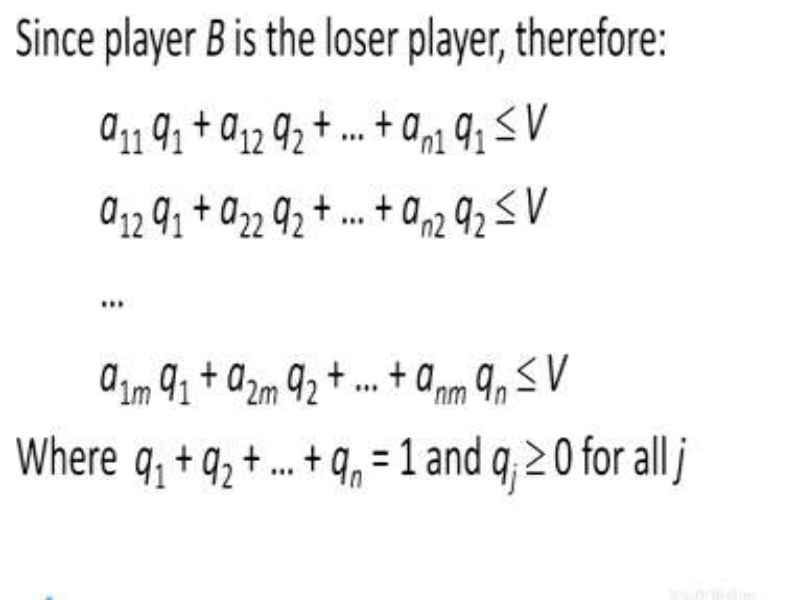

<mark>Since the player B is the loser player see there are two players, one is the A player and the second one is the B player so we are assuming for all such cases that player A is the winner player and player B is the loser player. Since B is the loser player therefore we must have the following conditions</mark> _<mark>a</mark>_ 11 _<mark>q</mark>_ 1 <mark>+</mark> _<mark>a</mark>_ 12 _<mark>q</mark>_ 2 <mark>+ … +</mark> _<mark>a</mark> n_ 1 _<mark>q</mark>_ 1 <mark></mark> _<mark>V</mark>_ <mark>and similarly</mark> _<mark>a</mark>_ 1 _m_ _<mark>q</mark>_ 1 <mark>+</mark> _<mark>a</mark>_ 2 _m_ _<mark>q</mark>_ 2 <mark>+ … +</mark> _<mark>a</mark> nm_ _<mark>q</mark> n_ <mark></mark> _<mark>V</mark>_ <mark>such that</mark> _<mark>q</mark>_ 1 <mark>+</mark> _<mark>q</mark>_ 2 <mark>+ … +</mark> _<mark>q</mark> n_ <mark>= 1 and q</mark> i <mark>’s should all be > 0.</mark> 

# **(Refer Slide Time: 05:06)** 

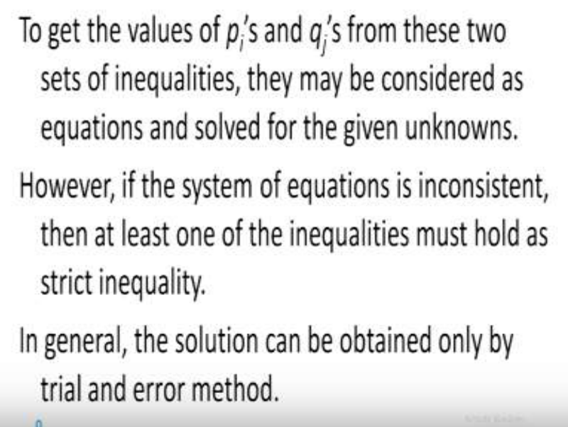

<mark>Now to get the values of p</mark> i <mark>’s and q</mark> i <mark>’s from these two sets of inequalities they may be considered as exact equations and solved for the given unknowns. However, if the system of equations is inconsistent then at least one of the inequalities must hold as strict inequality and in general the</mark> 

<mark>solution can be obtained only by trial and error method. So let us hope that our system is satisfying consistency.</mark> 

**(Refer Slide Time: 05:52)** 

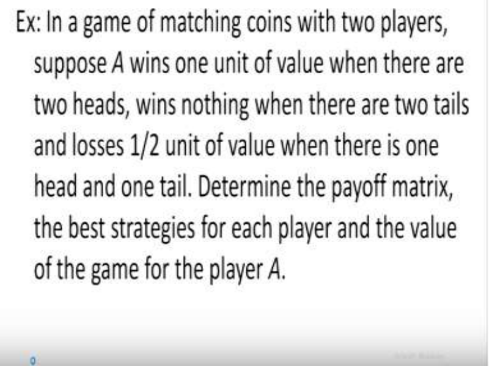

<mark>So in order to understand this method let us look at this example which says that in a game of matching coins with two players, suppose A wins one unit of value when there are two heads, wins nothing when there are two tails and loses 1/2 unit of value when there is one head and one tail. So this is a simple two player game and we are required to determine the payoff matrix and the best strategies for each of the two players and the value of the game for the player A.</mark> **(Refer Slide Time: 06:41)** 

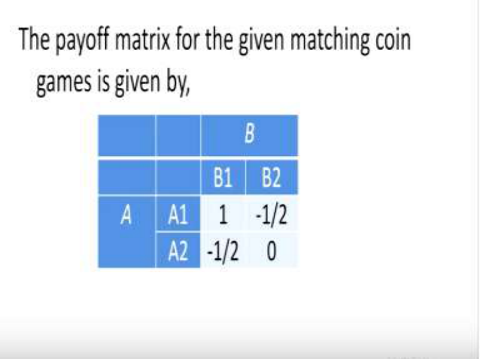

<mark>So first thing is we need to determine the payoff matrix, now the payoff matrix for the given matching coin game can be shown as in this table that is we have two players A and B and each of the player has two strategies. The player A has strategy A1 and A2 and the player B has two strategies B1 and B2 and according to the conditions given in the question, the payoff matrix can be written as 1 -1/2,-1/2 and 0.</mark> 

<mark>See read the question carefully according to this it says that A wins 1 unit of value when there are two heads he wins nothing when there are two tails and loses 1/2 unit of value when there is 1 head and 1 tail. So that is the reason why along with the 1/2 we have to write negative sign because it is a losing case so that is the way to write the payoff matrix.</mark> 

**(Refer Slide Time: 07:56)** 

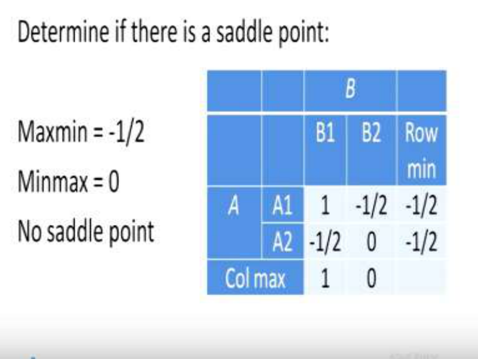

<mark>And now we need to make sure whether there is a saddle point or not. So we will determine the saddle point as follows, we will find out the row min for each of the rows and we find that the minimum of the first row is -1/2. Similarly, the minimum of the second row is also -1/2 and therefore we can say the Maxmin = -1/2. Then comes the column maximum, the first column maximum is 1 because we have 1 and -1/2 and for the second column we have -1/2 and 0 so there we have 0. And since we want the minimum of 1and 0 so therefore the minimum is 0 and since -1/2 is not equal to 0 therefore there is no saddle point in this game.</mark> 

**(Refer Slide Time: 08:57)** 

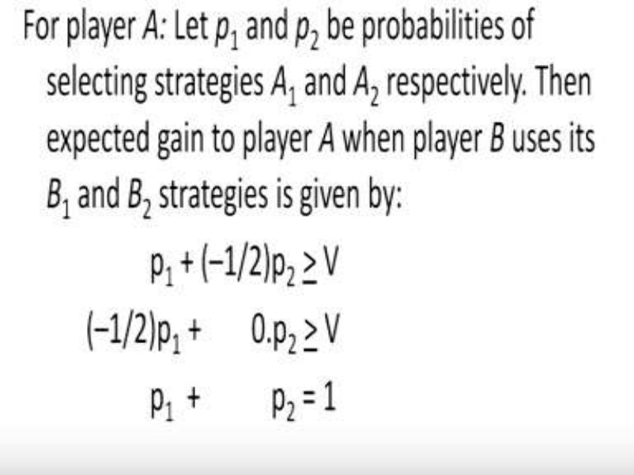

<mark>Now let us look, at the case of the player A and let us assume that p</mark> 1 <mark>and p</mark> 2 <mark>are the probabilities of selecting the strategies A</mark> 1 <mark>and A</mark> 2 <mark>respectively of the player A. Then the expected gain to the player A when the player B uses its strategies B</mark> 1 <mark>and B</mark> 2 <mark>is given by the following equations, p</mark> 1 <mark>+ (–1/2)p</mark> 2 <u><mark>> V and similarly (–1/2)p</mark></u> 1 <mark>+ 0.p</mark> 2 <u><mark>> V and also we must have the condition that p</mark></u> 1 <mark>+  p</mark> 2 <mark>= 1 because they are the probabilities.</mark> 

<mark>I hope you have understood how did we get these equations we got these equations by looking at the coefficients that are given in the payoff matrix 1,-1/2,-1/2, 0.</mark> 

**(Refer Slide Time: 10:11)** 

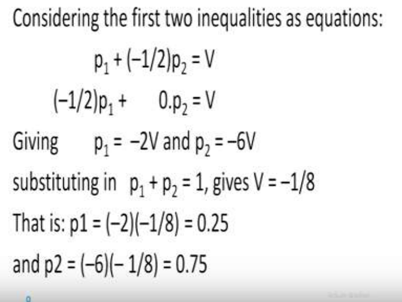

<mark>All right, so now we will consider the first two inequalities as equations that is they are being satisfied exactly =V and we have p</mark> 1 <mark>+ (–1/2)p</mark> 2 <mark>= V and similarly (–1/2)p</mark> 1 <mark>+ 0.p</mark> 2 <mark>= V  and when you solve this from the 2nd equation you can get p</mark> 1 <mark>=  –2V and if you substitute this p</mark> 1 <mark>back into the 1st equation you will get p</mark> 2 <mark>= –6V and we have the third condition that is p</mark> 1 <mark>+p</mark> 2 <mark>=1 so therefore we will substitute these values of p</mark> 1 <mark>and p</mark> 2 <mark>into this equation which will give us V=-1/8. Therefore, p</mark> 1 <mark>=0.25 and p</mark> 2 <mark>=0.75 so this is the way we have solved for the player A we have got the values of p</mark> 1 <mark>and p</mark> 2 <mark>.</mark> 

**(Refer Slide Time: 11:35)** 

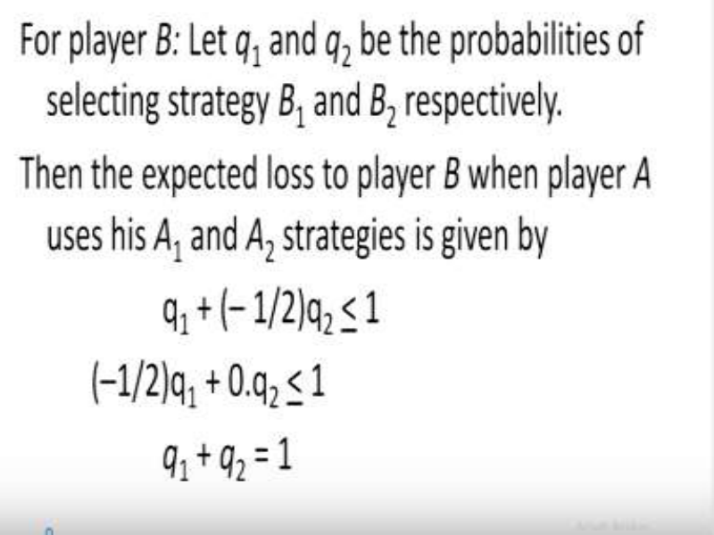

<mark>Now consider the player B and let q</mark> 1 <mark>and q</mark> 2 <mark>be the probabilities of selecting strategy B1 and B2 respectively. Then the expected loss to the player B when the player A uses his strategies A1 and A2 can be written by the equations q</mark> 1 <mark>+ (– 1/2)q</mark> 2 <u><mark>< 1 and similarly (–1/2)q</mark></u> 1 <mark>+ 0.q</mark> 2 <u><mark>< 1 and again</mark></u> <mark>we must remember the conditions that</mark> _<mark>q</mark>_ 1 <mark>+</mark> _<mark>q</mark>_ 2 <mark>= 1.</mark> 

**(Refer Slide Time: 12:23)** 

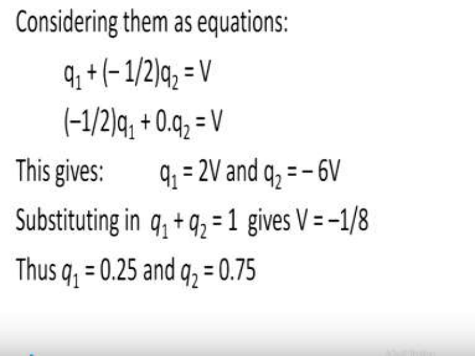

<mark>Now again in the same manner, we will consider these inequalities as equations and we will get q</mark> 1 <mark>+ (– 1/2)q</mark> 2 <mark>= V and similarly (–1/2)q</mark> 1 <mark>+ 0.q</mark> 2 <mark>= V. This will give us q</mark> 1 <mark>= 2V and q</mark> 2 <mark>= – 6V, the value of q</mark> 1 <mark>can be obtained from the 2nd equation and once we get this q</mark> 1 <mark>we can substitute it in the 1st equation and we will get the value of q</mark> 2 <mark>and finally we will substitute both the values of q</mark> 1 <mark>and q</mark> 2 <mark>into the third equation.</mark> 

<mark>That is q</mark> 1 <mark>+q</mark> 2 <mark>=1 which will give us V= -1/8. And again we will put all these values into our q</mark> 1 <mark>and q</mark> 2 <mark>and we should get q</mark> 1 <mark>=0.25 and q</mark> 2 <mark>=0.75.</mark> **(Refer Slide Time: 13:35)** 

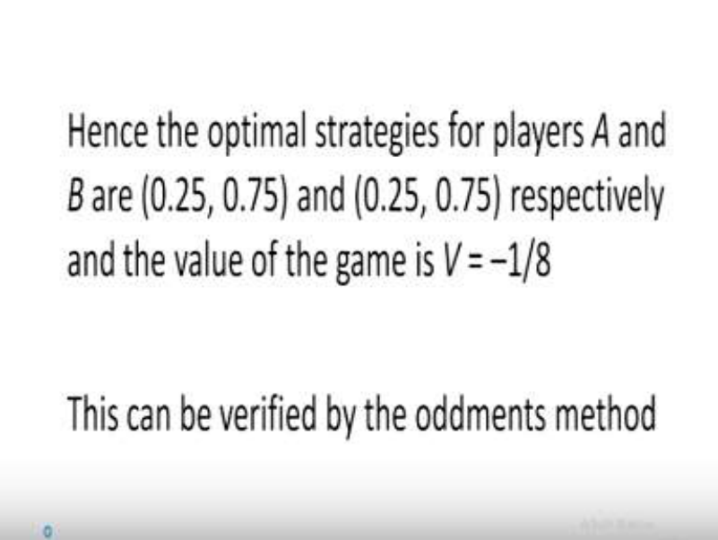

<mark>Hence what we have got? we have got the optimal strategies of the players A and B as follows, the optimal strategies of the player A are (0.25, 0.75) and the optimal strategies of the player B are (0.25, 0.75) and the value of the game is V= -1/8 and I would like to ask you to verify this result using the oddments method that we did in the previous lecture because remember this is 2x2 situation. So you can just verify that the results that you get using the oddments method is also the same.</mark> 

**(Refer Slide Time: 14:27)** 

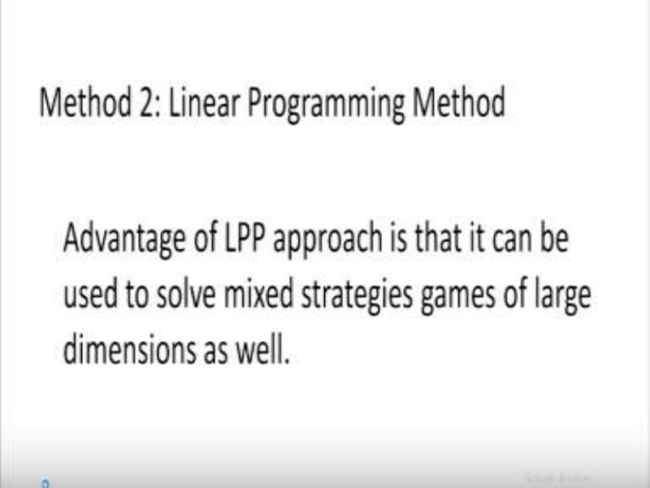

<mark>So now let us come to the 2nd method, in this method we will model the problem using a linear programming problem that is we will model the problem using the linear programming model and we will solve it using the simplex method. Now the advantage of using this LPP approach is that it can be used to solve the mixed strategies game for large dimensions as well. Remember the drawback of the method number 1 that is the algebraic method is that it can solve only very small sized problems, however, when the problem size is large then the 1st method that is the algebraic method might fail and here comes the 2nd method that is the linear programming approach.</mark> 

**(Refer Slide Time: 15:29)** 

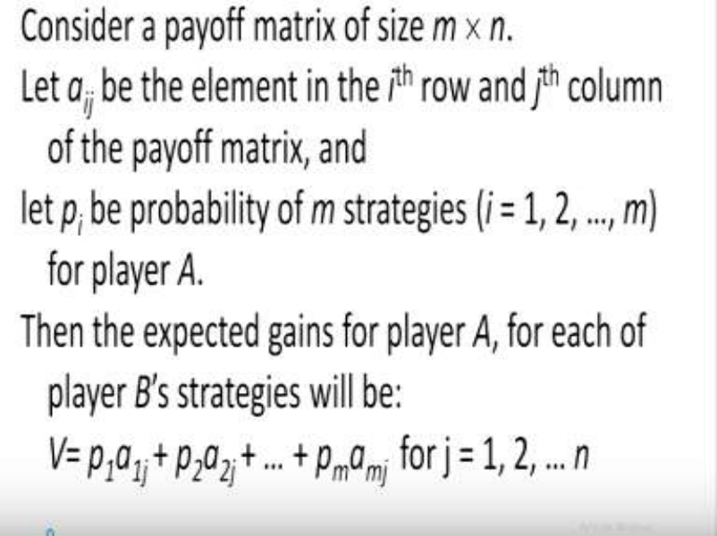

<mark>So let us look at a situation where we have a payoff matrix of the size m</mark> _<mark>x</mark>_ <mark>n and let a</mark> ij <mark>be the elements of the ith row and the jth column of the payoff matrix and let p</mark> i <mark>be the probability of m strategies that is i=1,2 up to m for player A. Then the expected gains for player A for each of the player B’s strategy can be written like this</mark> _<mark>V</mark>_ <mark>=</mark> _<mark>p</mark> 1_ _<mark>a</mark> 1j_ <mark>+</mark> _<mark>p</mark> 2_ _<mark>a</mark> 2j_ <mark>+</mark> _<mark>…</mark>_ <mark>+</mark> _<mark>p</mark> m_ _<mark>a</mark> mj_ <mark>for j = 1, 2, …</mark> _<mark>n.</mark>_ 

**(Refer Slide Time: 16:22)** 

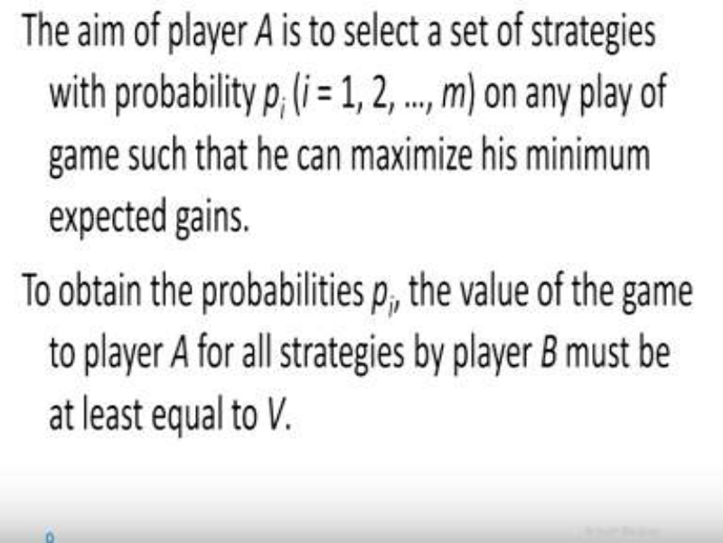

<mark>Now the aim of the player A is to select a set of strategies with the probabilities p</mark> i <mark>where i goes from 1,2 up to m on any play of game such that he can maximize his minimum expected gains this is what we have been doing till now. Now in order to obtain the probabilities the value of the</mark> 

<mark>game to the player A for all strategies by player B must be at least equal to V. So it is the other way round for B as compared to player A.</mark> 

**(Refer Slide Time: 17:06)** 

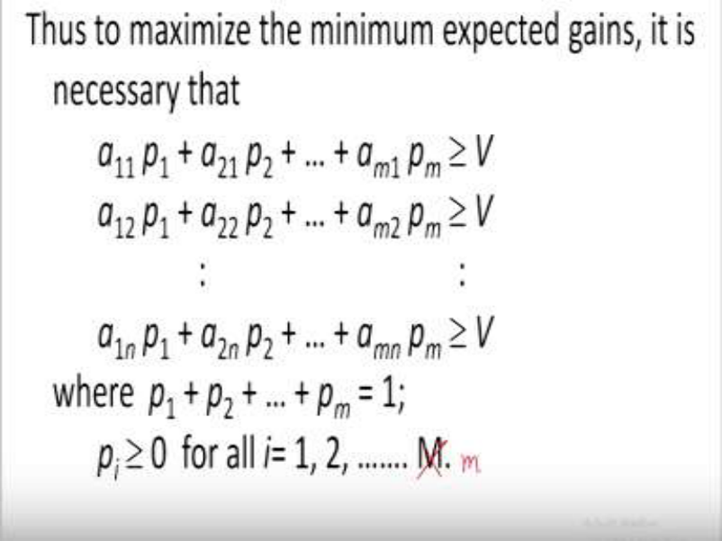

<mark>Thus to maximize the minimum expected gain we must have the following conditions that is</mark> _<mark>a</mark>_ 11 _<mark>p</mark>_ 1 <mark>+</mark> _<mark>a</mark>_ 21 _<mark>p</mark>_ 2 <mark>+ … +</mark> _<mark>a</mark> m_ 1 _<mark>p</mark> m_ <mark></mark> _<mark>V</mark>_ <mark>and similarly</mark> _<mark>a</mark>_ 12 _<mark>p</mark>_ 1 <mark>+</mark> _<mark>a</mark>_ 22 _<mark>p</mark>_ 2 <mark>+ … +</mark> _<mark>a</mark> m_ 2 _<mark>p</mark> m_ <mark></mark> _<mark>V</mark>_ <mark>and the last equation will be</mark> _<mark>a</mark>_ 1 _n_ _<mark>p</mark>_ 1 <mark>+</mark> _<mark>a</mark>_ 2 _n_ _<mark>p</mark>_ 2 <mark>+ … +</mark> _<mark>a</mark> mn_ _<mark>p</mark> m_ <mark></mark> _<mark>V</mark>_ <mark>and of course the conditions that is</mark> _<mark>p</mark>_ 1 <mark>+</mark> _<mark>p</mark>_ 2 <mark>+ … +</mark> _<mark>p</mark> m_ <mark>= 1 and all the</mark> _<mark>p</mark> i_ <mark> 0  where i goes from 1,2 up to m.</mark> 

**(Refer Slide Time: 18:05)** 

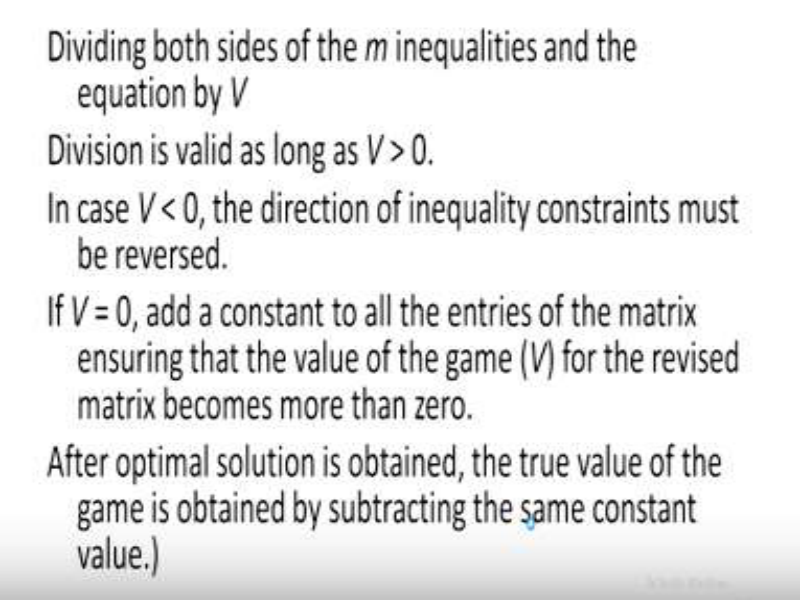

<mark>Now dividing both sides of the m inequalities and the equation by V, division is valid as long as V>0. So we can take the liberty of dividing the inequalities by V. However, in case V<0 the direction of the inequality constraints should be reversed and if V=0 then we can add a constant to all the entries of the matrix making sure that the value of the game V for the revised matrix becomes more than 0.</mark> 

<mark>So I will be taking some examples to illustrate this situation. Now after optimum solution is obtained, the value of the game is obtained by subtracting the same quantity from the entire results.</mark> 

**(Refer Slide Time: 19:07)** 

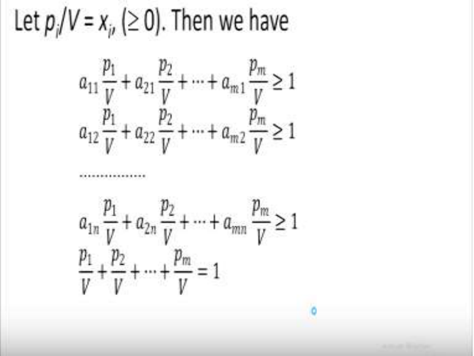

<mark>Now let us replace p</mark> i <mark>/V=x</mark> i <u><mark>(>0) scenario and in this case all the variables are now replaced by</mark></u> <mark>p</mark> i <mark>/V. So the 1st variable x1 is replaced by p</mark> 1 <mark>/V, x2 is replaced by p</mark> 2 <mark>/V and like this. So the entire system of inequalities has been changed by making this substitution and this substitution has also to be done for the p</mark> 1 <mark>+p</mark> 2, <mark>I mean p</mark> 1 <mark>/V+p</mark> 2 <mark>/V+…..+p</mark> m <mark>/V=1.</mark> 

**(Refer Slide Time: 19:58)** 

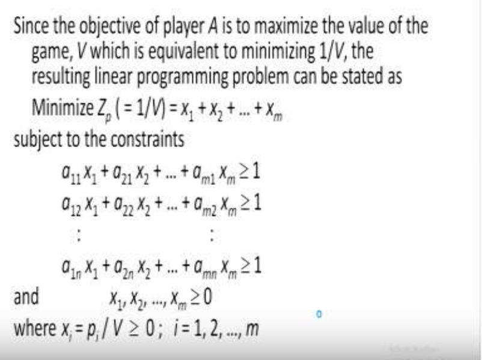

<mark>Now since the objective of the player A is to maximize the value of the game V which is equivalent to minimizing of 1/V therefore the resulting linear programming problem can be stated as follows, that is minimize 1/V=</mark> _<mark>x</mark>_ 1 <mark>+</mark> _<mark>x</mark>_ 2 <mark>+ … +</mark> _<mark>x</mark> m_ <mark>subject to the constraints</mark> _<mark>a</mark>_ 11 _<mark>x</mark>_ 1 <mark>+</mark> _<mark>a</mark>_ 21 _<mark>x</mark>_ 2 <mark>+ … +</mark> _<mark>a</mark> m_ 1 _<mark>x</mark> m_ <mark> 1 and like this the last equation will be</mark> _<mark>a</mark>_ 1 _n_ _<mark>x</mark>_ 1 <mark>+</mark> _<mark>a</mark>_ 2 _n_ _<mark>x</mark>_ 2 <mark>+ … +</mark> _<mark>a</mark> mn_ _<mark>x</mark> m_ <mark> 1. All the</mark> _<mark>x</mark>_ 1 <mark>,</mark> _<mark>x</mark>_ 2 <mark>, …,</mark> _<mark>x</mark> m_ <mark> 0 where</mark> _<mark>x</mark> i_ <mark>=</mark> _<mark>p</mark> i_ <mark>/</mark> _<mark>V</mark>_ <u><mark>> 0. Now remember that in a linear programming problem we</mark></u> <mark>must have all the decision variables > 0.</mark> 

**(Refer Slide Time: 21:12)** 

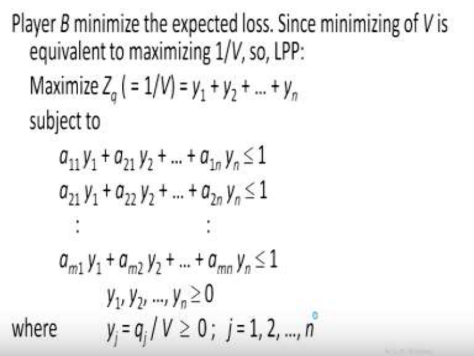

<mark>Now coming to the player B the player B minimizes the expected loss because remember we have said that the player A is the maximizing player and the player B is the minimizing player</mark> 

<mark>since the minimization of V is equivalent to maximization of 1/V. So the LPP can be written as maximize 1/V =</mark> _<mark>y</mark>_ 1 <mark>+</mark> _<mark>y</mark>_ 2 <mark>+ … +</mark> _<mark>y</mark> n_ <mark>subject to</mark> _<mark>a</mark>_ 11 _<mark>y</mark>_ 1 <mark>+</mark> _<mark>a</mark>_ 21 _<mark>y</mark>_ 2 <mark>+ … +</mark> _<mark>a</mark>_ 1 _n_ _<mark>y</mark> n_ <mark> 1 and similarly</mark> _<mark>a</mark> m_ 1 _<mark>y</mark>_ 1 <mark>+</mark> _<mark>a</mark> m_ 2 _<mark>y</mark>_ 2 <mark>+ … +</mark> _<mark>a</mark> mn_ _<mark>y</mark> n_ <mark> 1.</mark> 

<mark>Also the conditions</mark> _<mark>y</mark>_ 1 <mark>,</mark> _<mark>y</mark>_ 2 <mark>, …,</mark> _<mark>y</mark> n_ <mark> 0 where each of the</mark> _<mark>y</mark> j_ <mark>=</mark> _<mark>q</mark> j_ <mark>/</mark> _<mark>V</mark>_ <mark> 0 ;</mark> _<mark>j</mark>_ <mark>= 1, 2, …,</mark> _<mark>n.</mark>_ 

**(Refer Slide Time: 22:30)** 

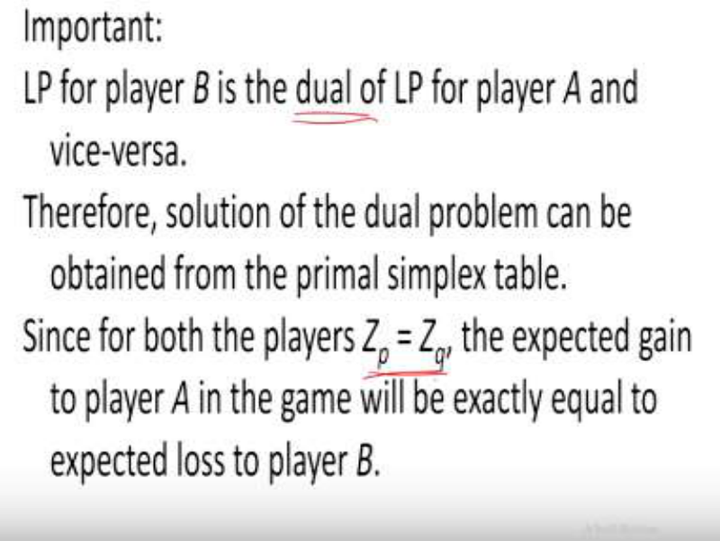

<mark>Now you must have observed a relationship between the LP for the player A and the LP the player B, the LP for the player B is the dual of the LP of the player A and vice-versa. This is a very important result and it shows another very important application of the duality theory which we have studied in the previous lectures. Therefore, the solution of the dual problem can be obtained from the primal simplex table.</mark> 

<mark>Remember we have seen a result where from the optimum table of the primal we can actually derive the solution of the dual and vice-versa. Now since for both the players the objective function value that is Zp and Zq they are both same remember the value of the game for the player A and the value of the game for the player B is always same the expected gain to player A in the game will be exactly equal to the expected loss to the player B.</mark> 

<mark>So this is also a very important consequence, that is, the value of the game for both the players will be same.</mark> 

# **(Refer Slide Time: 24:01)** 

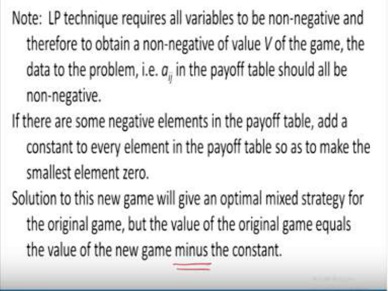

<mark>It needs to be noted that the LP technique requires all the variables to be non-negative remember they should be > 0 and therefore to obtain a non-negative value of V of the game the data to the problem that is the a</mark> ij <mark>’s in the payoff table should all be non-negative, remember in the 1st method we had the payoff matrix there was some negative entries. In such type of situations, we need to add a quantity so that all the entries in the payoff table become > 0. If there are some negative elements in the payoff table, we must add a constant to every element in the payoff table. So as to make the smallest element 0, now the solution to this new game will give an optimal mixed strategy for the original game. But the value of the original game equals the value of the new game minus the constant. So we must make sure that whatever we have added has to be subtracted from the results.</mark> 

# **(Refer Slide Time: 25:26)** 

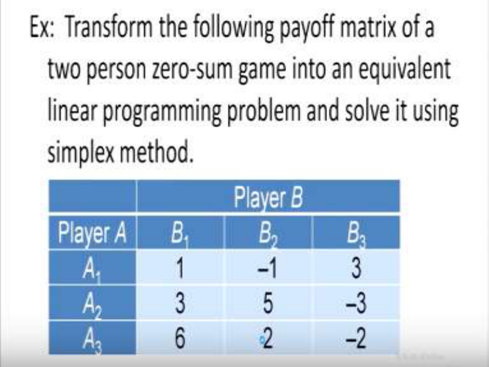

<mark>So now let us take a numerical example to illustrate how we can use the linear programming technique to solve this game problem. Transform the following payoff matrix of a 2 person zerosum game into an equivalent linear programming problem and solve it using the simplex method. Now you can see that there are two players A and B both have three strategies each that is A1,A2,A3 and B1,B2,B3 and the payoff matrix is given by 1,-1,3;3,5,-3;6,2 and-2.</mark> 

<mark>And as I said that moment you find any entry in the payoff matrix negative you must make sure that it has to be removed by adding a constant such that all the entries they become 0 or >0.</mark> 

**(Refer Slide Time: 26:33)** 

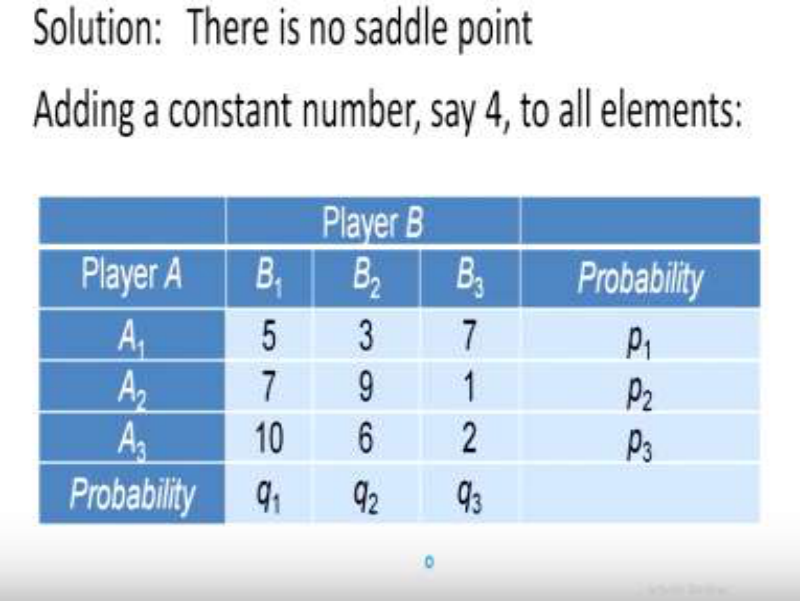

<mark>So in the solution to this problem 1st thing we find is that there is no saddle point in the game and once we have sure that now we can apply the mixed strategies therefore we will add a constant to all the elements of the matrix. Now in the payoff matrix what we find is that we if we add 4 to all the entries then as a result we get the following payoff matrix 5,3,7;7,9,1;10,6 and 2.</mark> 

<mark>Now you could have added 3 also that is not a problem if you had added 3 then 1 of the entries would have become 0 that is also fine but in this case I have added the constant 4. Now all the entries in the payoff matrix have become > 0. Now let us call the probabilities of A1,A2,A3 as p</mark> 1 <mark>,p</mark> 2 <mark>,p</mark> 3 <mark>and similarly the probabilities corresponding to the strategies B1,B2,B3 as q</mark> 1 <mark>,q</mark> 2 <mark>,q</mark> 3 <mark>.</mark> 

**(Refer Slide Time: 27:57)** 

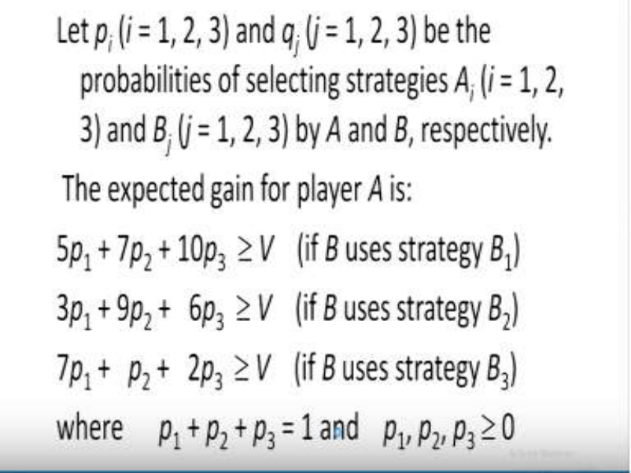

<mark>So let p</mark> i <mark>and q</mark> j <mark>be the probabilities of selecting the strategies A</mark> i <mark>, i goes from 1 to 3 and B</mark> j <mark>where j goes from 1 to 3, by the two players A and B respectively. Then according to our method the expected gain for the player A can be written as 5</mark> _<mark>p</mark>_ 1 <mark>+ 7</mark> _<mark>p</mark>_ 2 <mark>+ 10</mark> _<mark>p</mark>_ 3 <mark></mark> _<mark>V</mark>_ <mark>this comes if B uses strategy B</mark> 1 <mark>and similarly the 2nd equation that is 3</mark> _<mark>p</mark>_ 1 <mark>+ 9</mark> _<mark>p</mark>_ 2 <mark>+   6</mark> _<mark>p</mark>_ 3 <mark></mark> _<mark>V</mark>_ <mark>this happens if B uses the strategy B</mark> 2 <mark>and the third equation is 7</mark> _<mark>p</mark>_ 1 <mark>+</mark> _<mark>p</mark>_ 2 <mark>+   2</mark> _<mark>p</mark>_ 3 <mark></mark> _<mark>V</mark>_ <mark>this comes if B uses the strategy B</mark> 3 <mark>. Of course we must have the conditions</mark> _<mark>p</mark>_ 1 <mark>+</mark> _<mark>p</mark>_ 2 <mark>+</mark> _<mark>p</mark>_ 3 <mark>= 1 and all</mark> _<mark>p</mark>_ 1 <mark>,</mark> _<mark>p</mark>_ 2 <mark>,</mark> _<mark>p</mark>_ 3 <mark> 0.</mark> 

**(Refer Slide Time: 29:13)** 

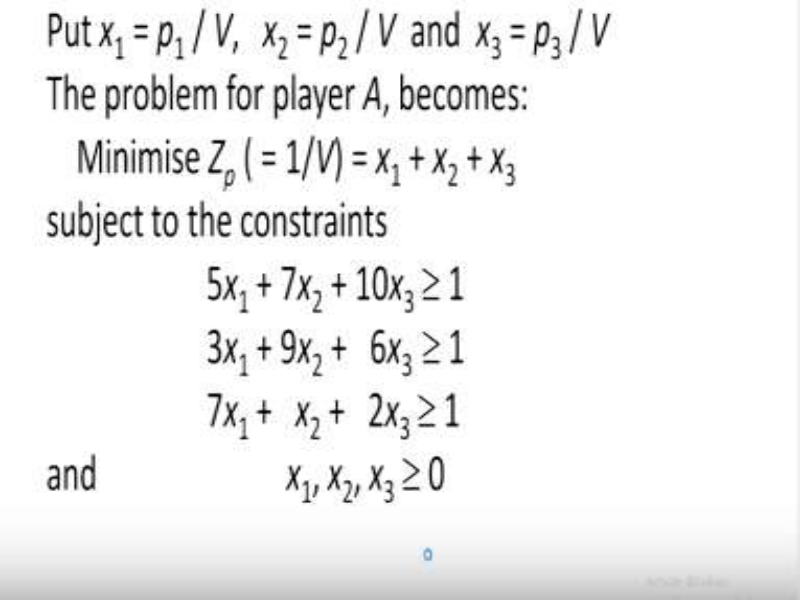

<mark>Now we will adopt our strategy by making this substitution as</mark> _<mark>x</mark>_ 1 <mark>=</mark> _<mark>p</mark>_ 1 <mark>/</mark> _<mark>V</mark>_ <mark>,</mark> _<mark>x</mark>_ 2 <mark>=</mark> _<mark>p</mark>_ 2 <mark>/</mark> _<mark>V</mark>_ <mark>and</mark> _<mark>x</mark>_ 3 <mark>=</mark> _<mark>p</mark>_ 3 <mark>/</mark> _<mark>V</mark>_ <mark>and the problem for the player A will become minimize</mark> _<mark>Z</mark> p_ <mark>( = 1/</mark> _<mark>V</mark>_ <mark>) =</mark> _<mark>x</mark>_ 1 <mark>+</mark> _<mark>x</mark>_ 2 <mark>+</mark> _<mark>x</mark>_ 3 <mark>subject to the constraints 5</mark> _<mark>x</mark>_ 1 <mark>+ 7</mark> _<mark>x</mark>_ 2 <mark>+ 10</mark> _<mark>x</mark>_ 3 <mark> 1, 3</mark> _<mark>x</mark>_ 1 <mark>+ 9</mark> _<mark>x</mark>_ 2 <mark>+   6</mark> _<mark>x</mark>_ 3 <mark> 1, 7</mark> _<mark>x</mark>_ 1 <mark>+</mark> _<mark>x</mark>_ 2 <mark>+   2</mark> _<mark>x</mark>_ 3 <mark> 1 and all the three variables</mark> _<mark>x</mark>_ 1 <mark>,</mark> _<mark>x</mark>_ 2 <mark>,</mark> _<mark>x</mark>_ 3 <mark> 0.</mark> 

**(Refer Slide Time: 30:09)** 

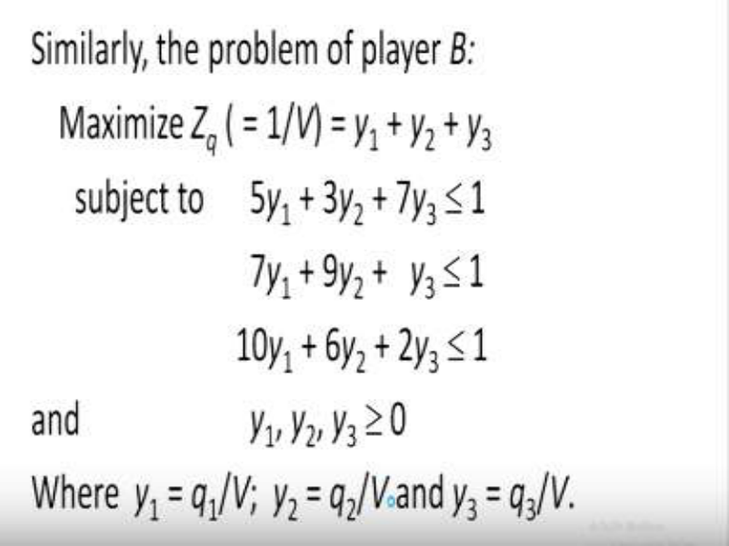

<mark>Now similarly for the player B, we will have the corresponding problem as maximize</mark> _<mark>Z</mark> q_ <mark>( = 1/</mark> _<mark>V</mark>_ <mark>) =</mark> _<mark>y</mark>_ 1 <mark>+</mark> _<mark>y</mark>_ 2 <mark>+</mark> _<mark>y</mark>_ 3 <mark>which is subject to 5</mark> _<mark>y</mark>_ 1 <mark>+ 3</mark> _<mark>y</mark>_ 2 <mark>+ 7</mark> _<mark>y</mark>_ 3 <mark> 1, 7</mark> _<mark>y</mark>_ 1 <mark>+ 9</mark> _<mark>y</mark>_ 2 <mark>+</mark> _<mark>y</mark>_ 3 <mark> 1, 10</mark> _<mark>y</mark>_ 1 <mark>+ 6</mark> _<mark>y</mark>_ 2 <mark>+ 2</mark> _<mark>y</mark>_ 3 <mark> 1 all the</mark> _<mark>y</mark>_ 1 <mark>,</mark> _<mark>y</mark>_ 2 <mark>,</mark> _<mark>y</mark>_ 3 <mark> 0 and we have remember made the substitution that</mark> _<mark>y</mark>_ 1 <mark>=</mark> _<mark>q</mark>_ 1 <mark>/</mark> _<mark>V</mark>_ <mark>;</mark> _<mark>y</mark>_ 2 <mark>=</mark> _<mark>q</mark>_ 2 <mark>/</mark> _<mark>V</mark>_ <mark>and</mark> _<mark>y</mark>_ 3 <mark>=</mark> _<mark>q</mark>_ 3 <mark>/</mark> _<mark>V</mark>_ <mark>.</mark> 

# **(Refer Slide Time: 31:03)** 

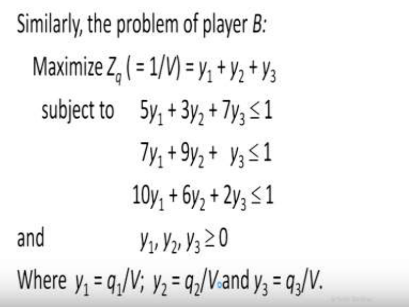

<mark>So the problem of player B turns out to be maximize y</mark> 1 <mark>+y</mark> 2 <mark>+y</mark> 3 <mark>. Now we are converting this inequalities over here in this LP corresponding to the player B we have less than constraints. So remember we can add the slack variables to make this</mark> <u><mark><</mark></u> <mark>constraint as equality constraint. Remember that if we do it for the player A we will not be able to do it properly because there we have the</mark> <u><mark>></mark></u> <mark>constraints. And we will need to subtract the surplus variable and then we will not have a BFS so we will need some artificial variables. So therefore it is much more convenient to look at the < constraints corresponding to the player B.</mark> 

**(Refer Slide Time: 31:59)** 

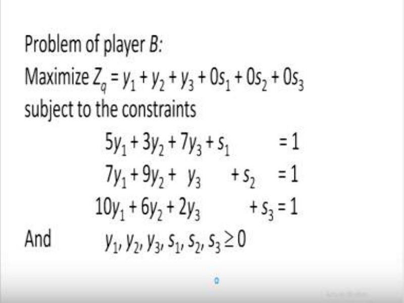

<mark>And we can simply add the slack variables into each of these equations as shown here in these equations and of course they have 0 coefficients in the objective function and of course as you know that the slack variables should also be</mark> <u><mark>></mark></u> <mark>0. So now we have a resulting six variable problem which we can solve using the simplex procedure.</mark> 

**(Refer Slide Time: 32:23)** 

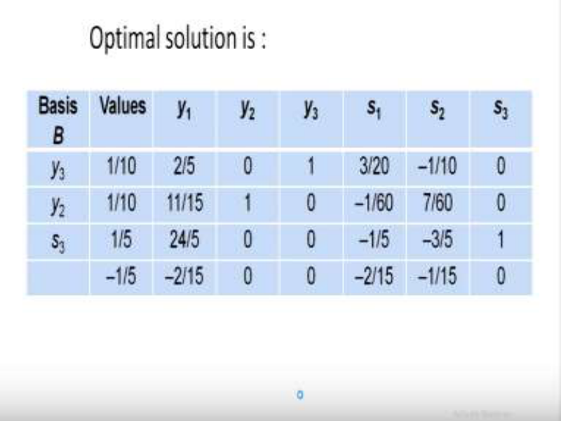

<mark>I will omit the proof and the detailed solution but the solution that I obtained for this 6 variable problem is shown here in this table and you can use this table to get the results corresponding to the player B and as I told you that the player LP corresponding to the player A and the LP corresponding to the player B are the dual of each other. So therefore from the optimum table of this problem corresponding to the player B you can get the solution of the dual which is corresponding to the solution of the player A.</mark> 

**(Refer Slide Time: 33:12)** 

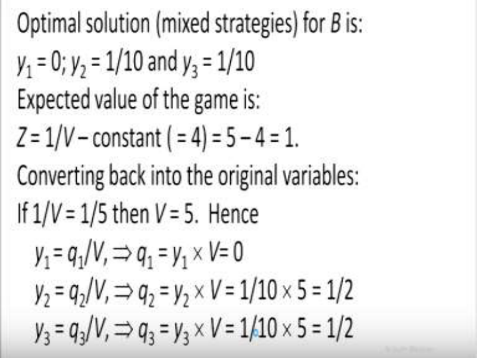

<mark>So we find that the optimum solution for the player B is</mark> _<mark>y</mark>_ 1 <mark>= 0;</mark> _<mark>y</mark>_ 2 <mark>= 1/10 and</mark> _<mark>y</mark>_ 3 <mark>= 1/10 and the expected value of the game or rather the objective function is Z=1/V- constant which we actually had used to make all the elements as positive we had added this constant 4 into all the elements of the payoff matrix. So we get the value of Z=5-4 which is 1 and now we will want to convert this into the original variables remember the original variables were the p</mark> i <mark>’s and the q</mark> i <mark>’s.</mark> 

<mark>So in this case for the player B we have to convert all the variables that is the y</mark> i <mark>variables as q</mark> i <mark>’s so if 1/V=1/5 then V=5 and also</mark> _<mark>y</mark>_ 1 <mark>=</mark> _<mark>q</mark>_ 1 <mark>/</mark> _<mark>V</mark>_ <mark>, </mark> _<mark>q</mark>_ 1 <mark>=</mark> _<mark>y</mark>_ 1 <mark></mark> _<mark>V</mark>_ <mark>= 0; similarly</mark> _<mark>y</mark>_ 2 <mark>=</mark> _<mark>q</mark>_ 2 <mark>/</mark> _<mark>V</mark>_ <mark>, </mark> _<mark>q</mark>_ 2 <mark>=</mark> _<mark>y</mark>_ 2 <mark></mark> _<mark>V</mark>_ <mark>= 1/10  5 = 1/2  and similarly</mark> _<mark>y</mark>_ 3 <mark>=</mark> _<mark>q</mark>_ 3 <mark>/</mark> _<mark>V</mark>_ <mark>, </mark> _<mark>q</mark>_ 3 <mark>=</mark> _<mark>y</mark>_ 3 <mark></mark> _<mark>V</mark>_ <mark>= 1/10  5 = 1/2. So what we have done is we have converted the y</mark> 1 <mark>, y</mark> 2 <mark>variables of the dual which was corresponding to the player B. Back into the q</mark> i <mark>’s where q</mark> i <mark>’s were the probabilities corresponding to the strategies of B.</mark> 

**(Refer Slide Time: 35:16)** 

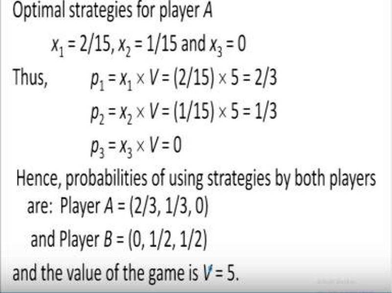

<mark>So the optimum strategies of the player A now let us come to the optimal strategies of the player A this can be derived as I said these are the dual, so the dual variables can also be read the solution from the primal. So the values of</mark> _<mark>x</mark>_ 1 <mark>= 2/15,</mark> _<mark>x</mark>_ 2 <mark>= 1/15 and</mark> _<mark>x</mark>_ 3 <mark>= 0 and then converting back into the probabilities p</mark> 1 <mark>, p</mark> 2 <mark>we can write</mark> _<mark>p</mark>_ 1 <mark>=</mark> _<mark>x</mark>_ 1 <mark></mark> _<mark>V</mark>_ <mark>= (2/15)  5 = 2/3. Similarly</mark> _<mark>p</mark>_ 2 <mark>=</mark> _<mark>x</mark>_ 2 <mark></mark> _<mark>V</mark>_ <mark>= (1/15)  5 = 1/3  and</mark> _<mark>p</mark>_ 3 <mark>=</mark> _<mark>x</mark>_ 3 <mark></mark> _<mark>V</mark>_ <mark>= 0. Hence the probabilities of using the strategies by both the players are as follows player A has the strategies (2/3,1/3, 0) and player B has the strategies (0, ½, ½) and the value of the game V=5.</mark> 

# **(Refer Slide Time: 36:38)** 

<mark>So with this we come to an end of the topic on game theory and before I close I would like to mention some of the general type of strategic games The Prisoners Dilemma, The Arms Race, the Bach and Stravinsky, the Matching Pennies, the Stage Hunt and many more. So those of you are interested in this part of the operation research that is the game theory you can read about these strategic games in details.</mark> 

<mark>So in the next lecture I will give you some exercises and some quiz questions. So with that I will close this lecture. Thank you.</mark> 

