# **Operations Research Prof. Kusum Deep Department of Mathematics Indian Institute of Technology – Roorkee** 

# **Lecture - 04** 

# **Convex Sets** 

Good morning students, today is the lecture number 4. The title of today's lecture is convex sets and their properties. 

**(Refer Slide Time: 00:47)** 

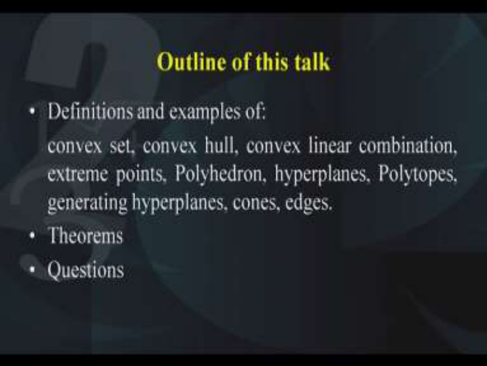

So, we will be talking about some definitions and some examples of various definitions like convex sets, convex hull, convex linear combination, extreme points, polyhedrons, hyperplanes, polytopes and generating hyperplanes, cones and edges. Apart from the definitions and examples, we will also cover some basic theorems and see how these concepts of these definitions that we are going to talk about, are applicable to the theory of linear programming and how they are useful for this topic. 

At the end of this lecture, you will be given some questions to solve. 

So, first of all let us define what do we mean by a convex set. Now in general, all the definitions that I am going to discuss today are going to be related to any n-dimensional space where in general n is a positive integer >=2. **(Refer Slide Time: 02:12)** 

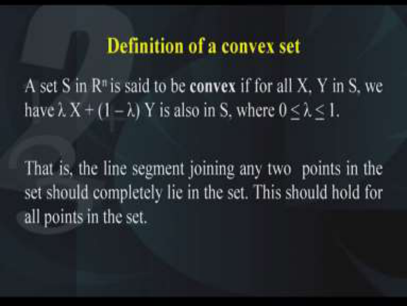

So, we define a set S in an n-dimensional space that is Rn , a real n-dimensional space is said to be convex if it satisfies the following property, that is, for all X and Y belonging to the set S we have λ X + (1 – λ) Y also belongs to the set S where X and Y are the points belonging to the set S whereas 0 < λ < 1. It can also take the end values that is 0 as well as 1. 

Now please note that the notations that have been used are capital X and capital Y. This indicates that they are n-dimensional points which belong to the set S. So, in general we are talking about n-dimensional space and n-dimensional sets. If you look closely at this definition, we find that this definition tells us that a set S is said to be convex if the line segment joining any two points of the set also belongs to the set completely. So for this let us look at some examples. 

**(Refer Slide Time: 03:48)** 

Now in this slide, we see six examples where we can show that no matter any two points you take in the set and draw a straight line joining these two points then the line segment joining these two points will completely lie in the set itself. Please note that this box, the rectangular box also is a 3-dimensional box and it indicates that if you take any two points and draw the line segment joining these two points then that straight line is expected to lie into the set S and that is the reason why these are all examples of convex sets. 

**(Refer Slide Time: 04:45)** 

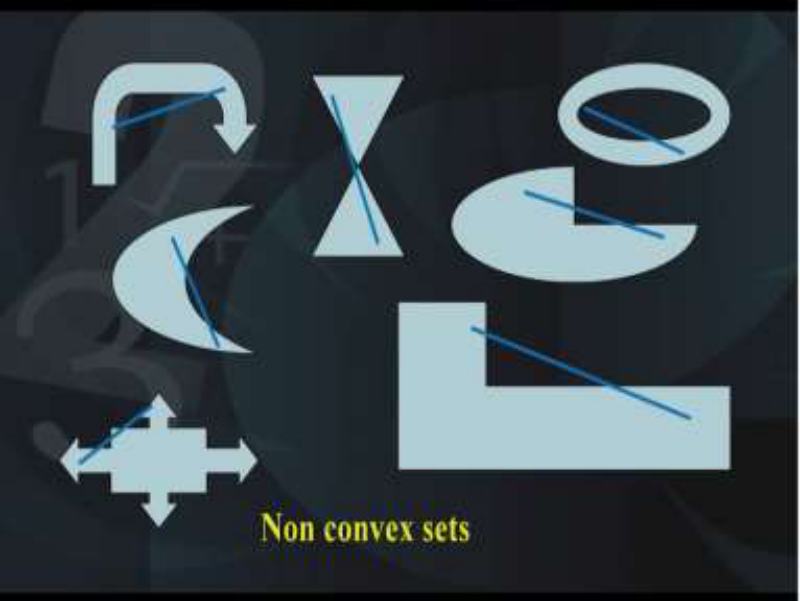

On the other hand, let us look at these examples. These are all examples of non-convex sets. Now what does this mean? It means that even if you can find just one single combination of any two points such that the line segment joining these two points does not belong to the set, then that means that it is no longer a convex set and this is what we see here in all these examples. I have drawn such a situation where the two points are taken and the line segment joining these two points is not lying completely in the set S and that is the reason why these are non-convex sets, examples of non-convex sets. Now you would say why did I particularly choose these combination of points. The answer to this is that according to the definition of convex set, this should be satisfied for all such points X and Y belonging to the set S. So even if you get one just combination which violates this condition, then that means the set ceases to be a convex set. So, in order to check whether a given set S is convex or not, usually all the time it is not possible to show it graphically. Therefore, we need to apply the definition of the convex set. So in this example, the set S1 is given to be X such that |X|  1. **(Refer Slide Time: 06:46)** 

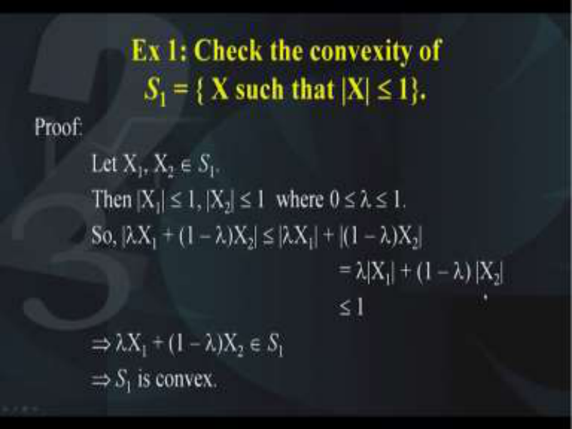

So, in order to show that this is a convex set, what we will do is we will take any two points X1 and X2 belonging to the set S1 and since X1 belongs to S, therefore it satisfies the condition |X1|  1. Similarly, |X2|  1  because both of them belong to the set S1 and we have to make sure that lambda should lie between 0 and 1 both inclusive. Therefore, we want to look at this condition  X1 + (1 –  )X2. Now, why we are looking at this expression, we are looking at this expression because this expression indicates the set of all points aligned between X1 and X2. Here we are assuming that the value of lambda is between 0 and 1. So let us now solve this inequality. We get  X1 + (1 –  )X2 and the modulus can be taken inside and the  because it is a real number, so  can be pulled out and you get  |X1| + (1 –  ) |X2|. Now since modulus of |X1|  1 and modulus of |X2|  1, so therefore this entire inequality will also be  1. So, that means what we have done. We have shown that this expression  X1 + (1 –  )X2  S1  because we have shown that |  X1 + (1 –  )X2|  1 and according to the definition of the set S1, this point also belongs to the set S1, therefore S1 is convex. **(Refer Slide Time: 09:11)** 

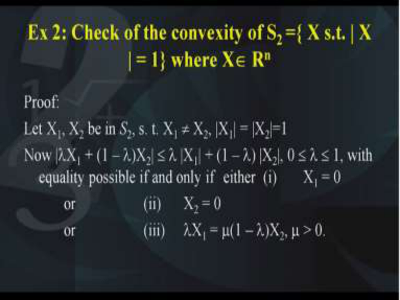

Now let us take another example and we see that this we want to check the convexity of this set S2 where X such that |X| = 1. So, that is the circumference of the unit circle where X  Rn . Now, everybody can visualize that this circle of unit radius that is the circumference of this circle is not a convex set but how to prove it, it is not convex. 

Let us take two points X1 and X2 belonging to the set S2 and of course we have to make sure that both of them are distinct points, that is, X1  X2. Since they belong to the set S2, therefore |X1| = |X2|=1. Now, if we will prove this theorem with the help of contradiction and that is that let us suppose that |  X1 + (1 –  )X2|   |X1| + (1 –  ) |X2|,  and 0    1, the value of lambda has to be between 0 and 1. The equality in this condition will be possible if and only if either one of the following conditions hold, so what are those conditions. First one is that X1 = 0, second one is X2 = 0 and the third one is  X1 =  (1 –  )X2,  > 0 . Now where does this condition come from? This condition comes from the fact that if it is a multiple,  X1 is a multiple of (1 –  )X2, only then will this condition be=1. 

So, in this inequality (less than or equal to), we are trying to investigate under what conditions this inequality will become an equality and we have seen that these are the three possibilities; number 1 X1 = 0, number 2 X2 = 0 and number 3  X1 is equal to some scalar times (1 –  )X2 , where this scalar which I am representing with the help of the symbol  >0. 

Now, let us investigate each of these conditions separately. So what do we find? **(Refer Slide Time: 12:23)** 

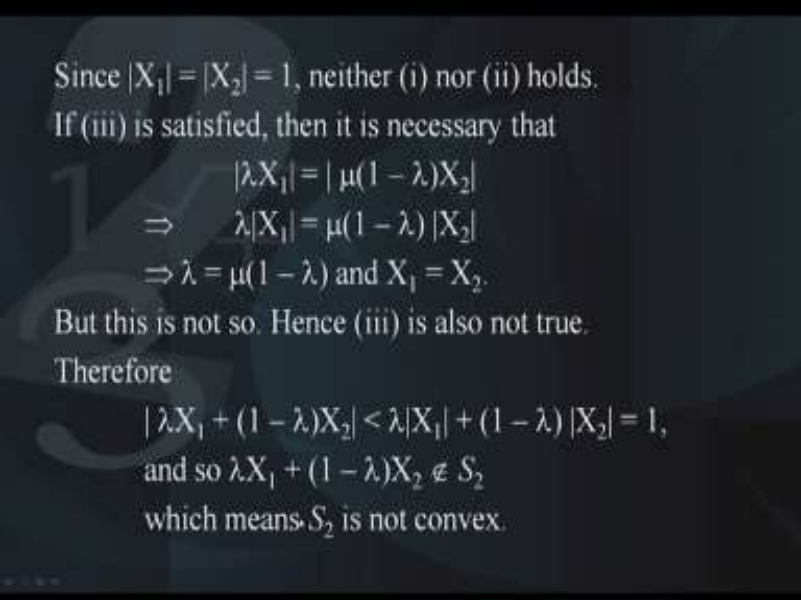

Since |X1| = |X2| = 1, neither 1 and 2 hold, we were expecting that X1 = 0, X2 = 0. Since this condition holds that |X1| = |X2| = 1, so, it is not possible that both of them will be 0, either of them will be 0, none of them will be 0 in fact. Therefore, now we only remain to check is the third condition. 

Now in the third condition, if the third condition is satisfied then it is necessary that  X1| = |  (1 –  )X2|, that means you can pull out the  ,  |X1| =  (1 –  ) |X2| and this modulus will remain inside and the scalars will go out. That means that the scalar  =  (1 –  )  and this means that X1 = X2, but this is a contradiction because this is not true because we have assumed that X1 and X2 should not be equal amongst each other, hence third is also not true. 

Therefore, what do we conclude that |  X1 + (1 –  )X2| <  |X1| + (1 –  ) |X2| = 1 and so we conclude that  X1 + (1 –  )X2  S2 and this means that S2 is not a convex set. 

So, in general the method for proving that set X is convex, we need to show that if you take any two points in the set S, then the line joining those two points should also belong to S and if we have to show that a given set S is not convex, then by some method of contradiction show that the line segment joining these two points does not belong to the set S. 

Now another definition is regarding the convex linear combination. The definition is as follows. 

**(Refer Slide Time: 15:06)** 

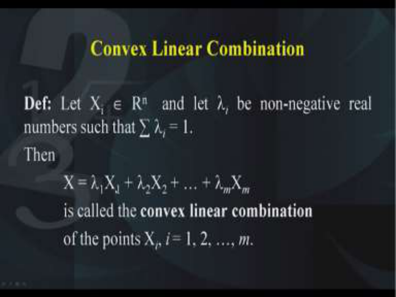

Let Xi  Rn , so what is this Xi, Xi’s are the points, let us say X1, X2, Xn. So, suppose there are _n_ number of points which belong to the set Rn and let us suppose that we have some scalars  ’s be non-negative real numbers such that their summation that is ∑  _i_ = 1. Then, this point, this new point which we will call as X which is given by  1X1 +  2X2 + … +  _m_ X _m_ is called the convex linear combination of all the points where these points are given by X1, X2, X3 up to Xm. So in other words, this combination where the scalars should have their sum=1 is called the convex linear combination of the points X1, X2,… Xm. **(Refer Slide Time: 16:17)** 

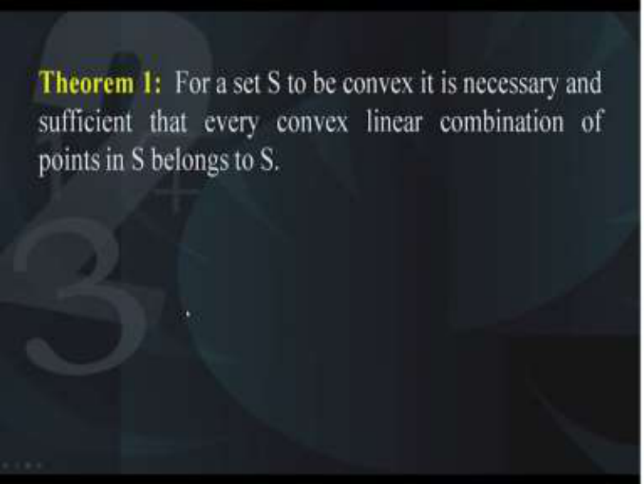

Now let us come to a theorem. The theorem says that for a set S to be convex, it is necessary and sufficient that every convex linear combination of points in S also belongs to the set S. Now, please note that this is a necessary and a sufficient condition. So both ways the logic 

should work. Some interesting set theoretical properties we would like to look at, so the union of convex sets. 

**(Refer Slide Time: 17:02)** 

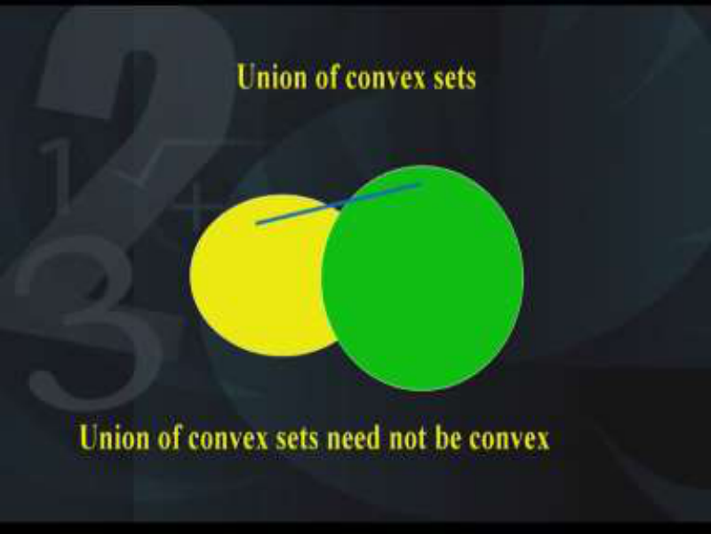

Now, you can see that here is the yellow circle is representing the set S1, similarly the green circle is representing the second set that is the set let us say S2 and we want to look at the union of these 2 sets. So, the union of these two sets is given by this total area and if you take any two points in this union and draw the line segment joining these two points, you find that this line segment is not completely lying in the union. Therefore, the union of convex sets need not be convex. Now when can this be convex? So, I can leave this as an exercise for you. Under what conditions can the union of two convex set also be convex? So, this is very simple, just think about it. As I have mentioned, it is the union may or may not be convex. So I am asking you, you have to think of a situation under which the union of two convex sets should also be convex. 

**(Refer Slide Time: 18:24)** 

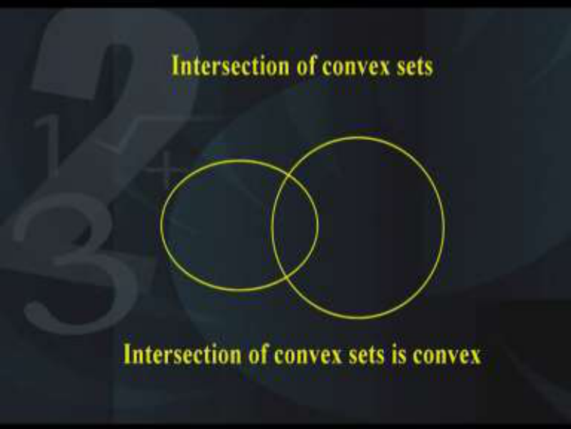

Next, let us look at the case of intersection. So, this is the set S1 and this is the set S2, both of these circles are convex as we can very well see and also the intersection of these two circles and we can very well see that it is convex. So, the intersection of any two convex sets is also convex. This is always true. 

**(Refer Slide Time: 18:55)** 

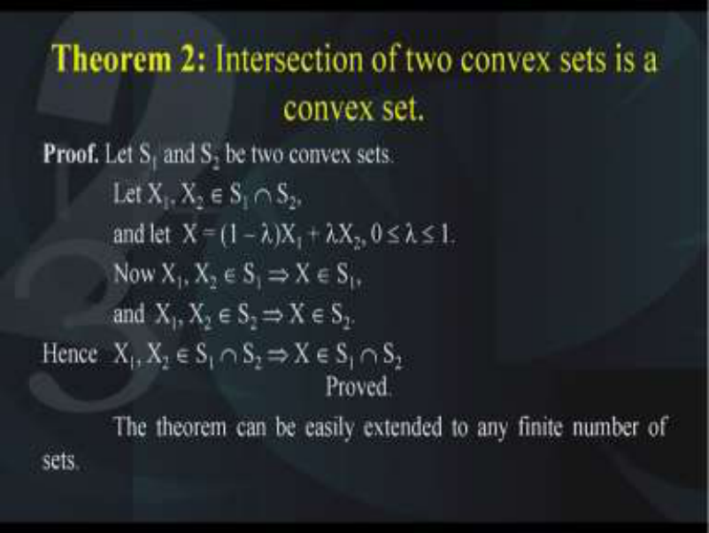

Now, let us look at another theorem, theorem number 2. It says that the intersection of two convex sets is also a convex set. This is exactly the same example that we have just now done. We will like to prove it. So, how to prove it let us see. Let S1 and S2 be two convex sets and we will take any two points, let us say X1 and X2 belonging to the intersection and we need to show that the convex linear combination of X1 and X2 should belong to the intersection. 

So how do we do it? Consider the convex linear combination that is X = (1 –  )X1 +  X2, this is the convex linear combination of X1 and X2 where 0    1. Now, since X1, X2  S1, therefore we can say that X  S1 , because it is the convex linear combination. Similarly, X1, X2  S2  X  S2. So, what we have proved is we have proved that X also belongs to S1 and X also belongs to S2 and according to the definition of intersection X  S1  S2. So what we have proved is that given any two points X1 and X2 belonging to the intersection, we have shown that they are convex linear combination that is given by X also belongs to the intersection. Hence, the theorem is proved. 

Please note that this theorem can be easily extended for any finite number of sets. So if you have let us say S1, S2, S3,…, Sk, then the intersection of these finite sets, finite number of sets will also be a convex. Now, suppose we have a set which is not convex, can we design a definition by which we can associate a convex set with that non-convex set? And the answer to this is yes. The definition of the convex hull tells us this. 

**(Refer Slide Time: 21:51)** 

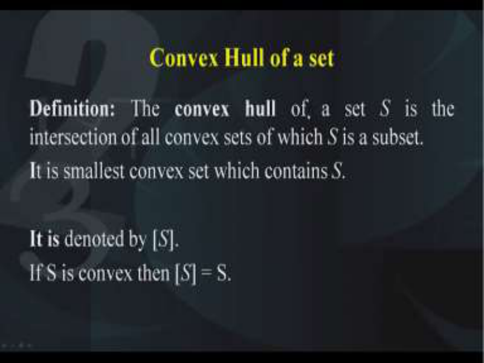

So, the convex hull of a set S is the intersection of all convex sets of which S is a subset. Please note that in this definition, it is not necessary that the set S is convex. In general, S may or may not be convex. So, the definition says that the convex hull of a set S is the intersection of all convex sets of which S is a subset. It is the smallest, in fact it is the smallest convex set which contains S. 

Now, usually the notation for convex hull is written like [S]. If S is convex, then both of them are same that is S is given by convex hull of S is the set S itself. However, if it is not a convex set, then they are different. Let us look at some examples. 

**(Refer Slide Time: 23:07)** 

So, here is the set S on the left hand side, we have this L-shaped figure and you can see that this is not a convex set. S is not a convex set because if you take two points over here and you join the two points, then the line segment joining these two points will not lie completely in the set S. So, according to the definition of convex hull, this is what the convex hull will look like. So, it is consisting of this entire region and you can very well see that this convex hull is a convex set. 

**(Refer Slide Time: 23:48)** 

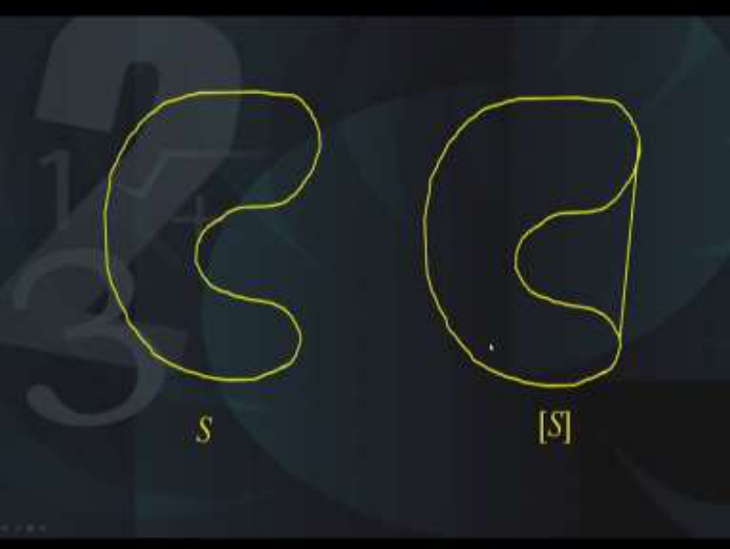

Another example, so here we have a figure on the left hand side which again you can see is not convex. So, we want to see what will be the convex hull of this. So, if you draw a line joining these two points (as you can see in above figure), then this region is going to look like this and this is what is the convex hull of this set S. So on the left hand side, we have the nonconvex set S and on the right hand side we have the convex hull. So, this is the set S and this is the convex hull of that set S. 

# **(Refer Slide Time: 24:28)** 

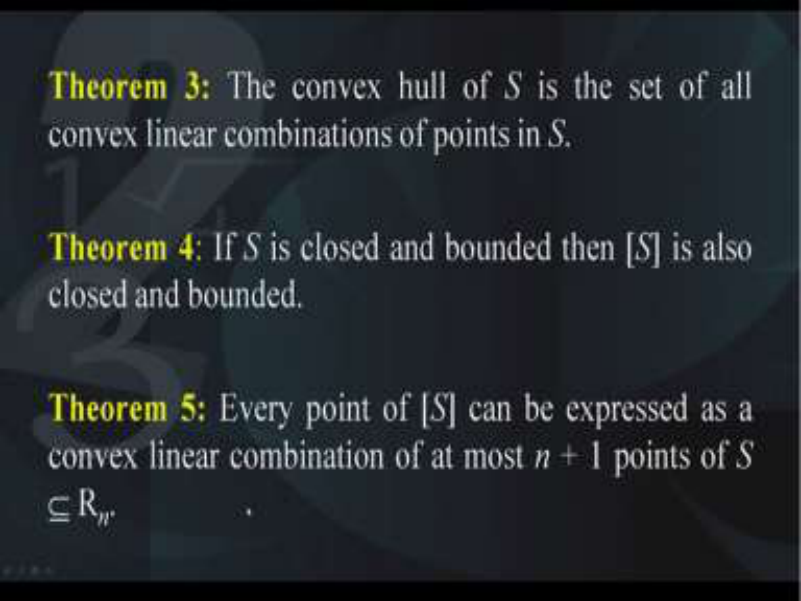

So some more theorems, theorem number 3. The convex hull of a set S is the set of all convex linear combinations of points in the set S. Now, this theorem can be proved intuitively because that is the way the convex hull is defined. So, I can leave this the proof of this theorem as an exercise. 

Next comes the theorem number 4; if S is closed and bounded, then the convex hull [ _S_ ] is also closed and bounded. So, again this is a very simple result and you can prove it yourself. 

Theorem number 5, every point of the convex hull can be expressed as a convex linear combination of at most n+1 points of the set _S_  R _n_ . Now, this is a very interesting result and we want to look at it more closely. So, suppose will take the example of R2 and let us suppose S is a subset of the 2-dimensional space and S is _S_ = {X| X = X _i_ , _i_ = 1, 2, 3, 4}. **(Refer Slide Time: 25:58)** 

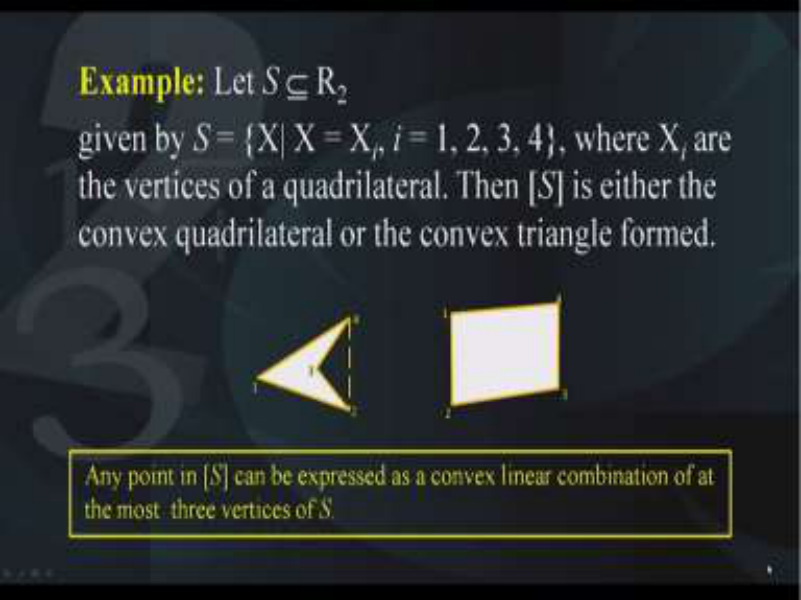

That is X=X1, X2, X3, X4 where each of these Xi's are the vertices of a quadrilateral. Then, the convex hull of S is either the convex quadrilateral or the convex triangle formed as shown bin figure. Now what does this mean, let us look at it closely. Now, the figure on the left hand side shows that the three vertices X1, X2, X3 are satisfying this property whereas on the right hand side it is showing that it is a quadrilateral. Therefore, with the help of this example, we can conclude that any point in the convex hull can be expressed as a convex linear combination of at most three points of this set S. Next comes the definition of vertices or in other words extreme points of convex sets. So, first of all let us look at the definition of a point. 

**(Refer Slide Time: 27:20)** 

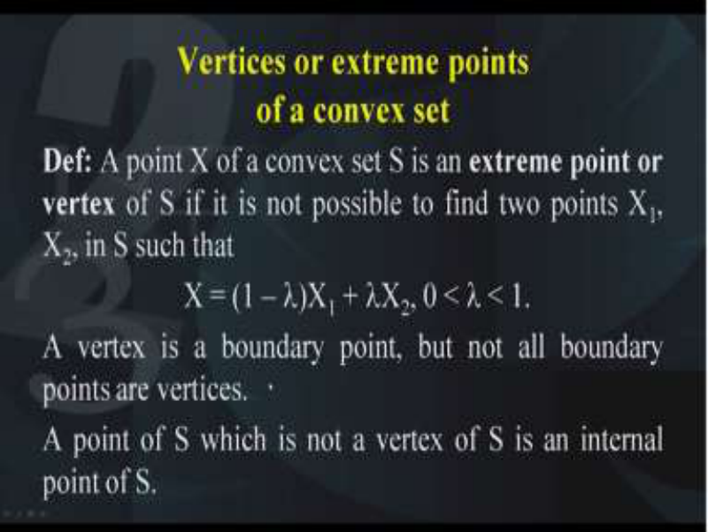

A point X of a convex set S is an extreme point or a vertex of S if it is not possible to find two points X1 and X2 in the set S such that X = (1 –  )X1 +  X2, where 0 <  < 1. So that means a vertex is a boundary point but not all boundary points are vertices. For example, let us take the case of a circle, so any point on the circumference of a circle is a boundary point but it is not a vertex. Also, a point of S which is not a vertex of S is an internal point of S. Let us look at another theorem, theorem number 6. 

**(Refer Slide Time: 28:32)** 

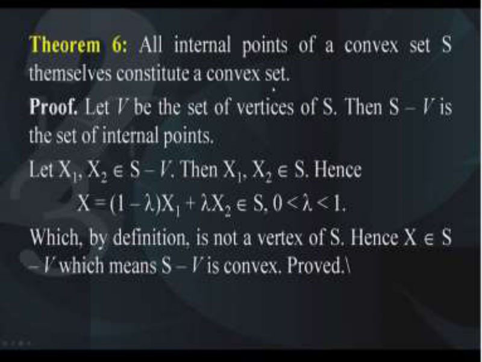

All internal points of a convex set S themselves constitute of a convex set. Now, the proof of this theorem, let us suppose V be the set of all vertices of the set S then the difference that is S-V is the set of all internal points. Therefore, let us take any two points X1, X2  S _– V_ . So if X1 and X2 are belonging to the set S-V, we will show that their convex linear combination also belongs to the set S-V. Therefore, X1, X2  S, hence X can be written like X = (1 –  )X1 +  X2, this also belongs to the set S where 0 <  < 1, which by definition is not a vertex of S, hence X  S _– V_ which means S-V is a convex set and hence the theorem is proved. **(Refer Slide Time: 29:59)** 

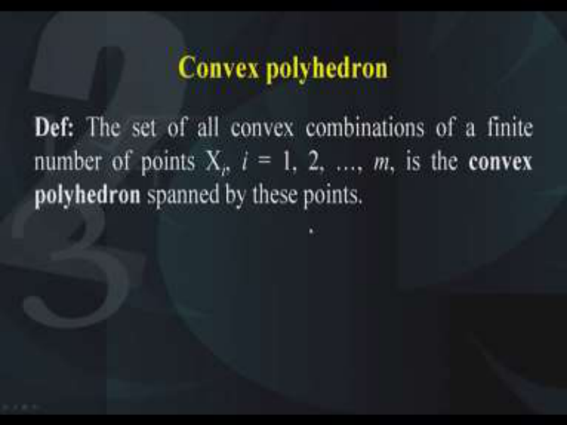

Another concept related to convex sets is the definition of a convex polyhedron. It is defined as follows, the set of all convex combinations of a finite number of points X1, X2,…,Xm is the convex polyhedron spanned by these points, so that is the definition of a convex polyhedron. **(Refer Slide Time: 30:34)** 

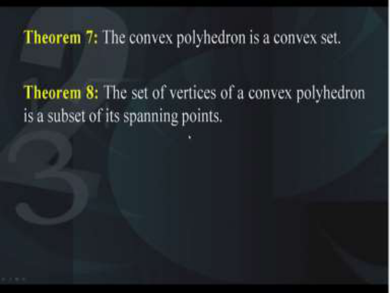

Theorem number 7, the convex polyhedron is a convex set. This is very clear because that is the way the definition has been given. 

Theorem number 8, the set of vertices of a convex polyhedron is a subset of its spanning points. Now let us look at this example in order to understand this theorem. **(Refer Slide Time: 31:04)** 

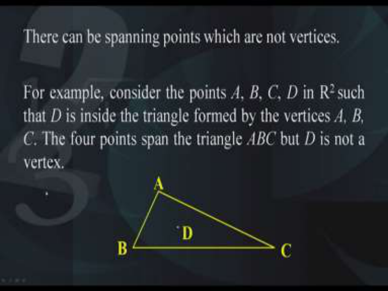

There can be spanning points which are not vertices. Now how does this example help us to understand this? Let us look at these four points A, B, C and D. Consider the points A, B, C, D in the 2-dimensional space such that D is in the inside of the triangle formed by the vertices A, B and C. So, as you can see the point D is in the interior of the triangle formed by A, B and C. Then, what do we find, we find that the four points which span the triangle ABC but D is not a vertex and that is what the theorem tells us. **(Refer Slide Time: 31:57)** 

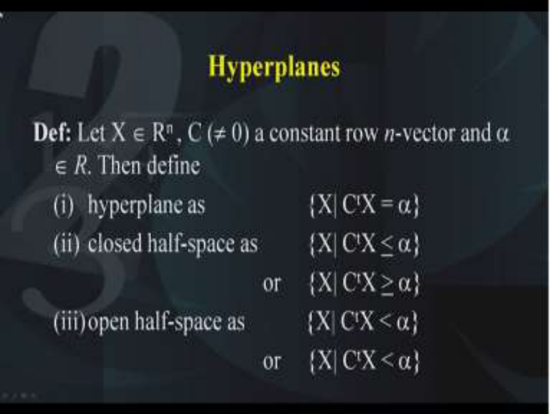

Now, let us look at another definition. This definition is about a hyperplane, it is defined as follows. Let X  Rn and let C be a constant row vector that is not equal 0. So, C is a nonzero constant row n-vector and alpha is a real number. Then, we define a hyperplane by the set of all X such that Ct X =  . Then, we also defined closed half-spaces as the set of all X such that Ct X <  or the other side. Similarly, we define the open-half spaces as X such that Ct X <  

and X such that Ct X >  . As you can very well see that a given hyperplane divides the entire space into two half-spaces. So they can be closed hyper half-spaces if you take the inequality into account and if it is a strict inequality, then it can be defined as the open half-spaces. In order to visualize this concept, let us look at this hyperplane. 

**(Refer Slide Time: 34:03)** 

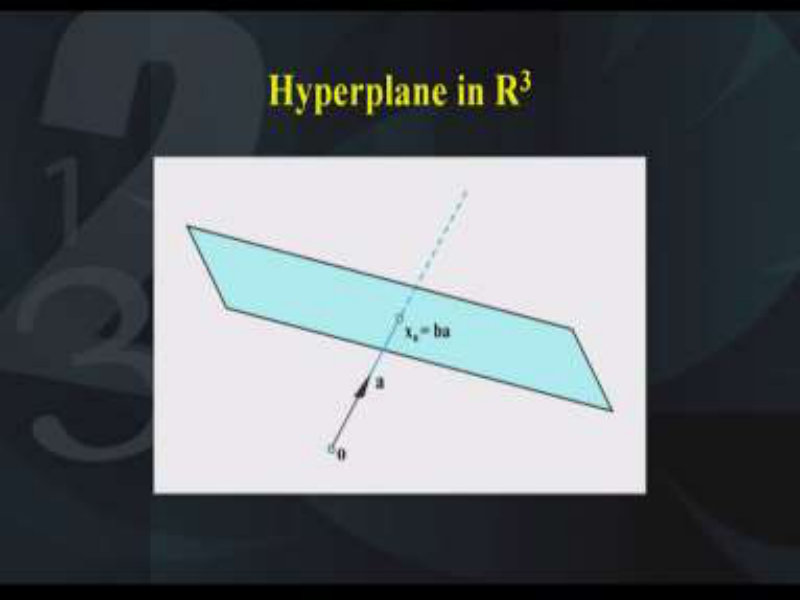

You can see that this hyperplane divides the space into two parts, one above the hyperplane and one below the hyperplane and as I mentioned that if less than equal to is considered then it is considered to be a two half-spaces and if it is only a strict inequality then they are said to be open half-spaces. 

**(Refer Slide Time: 34:32)** 

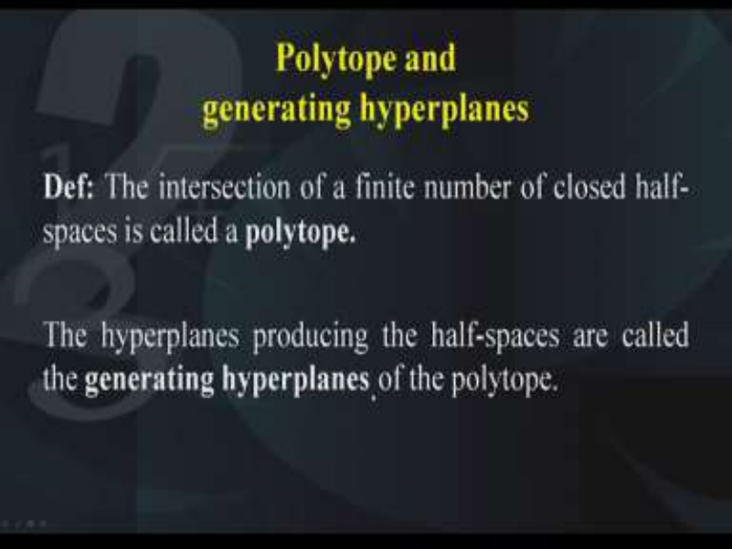

Some more definitions; polytope and generating hyperplanes. This is defined as follows, that is the intersection of a finite number of closed half-spaces is called a polytope. That is if you 

have more than one hyperplanes and you take their intersection, then the half-spaces they intersect and that intersection is called a polytope. The hyperplanes producing the half-spaces are called the generating hyperplanes of the polytope. 

**(Refer Slide Time: 35:15)** 

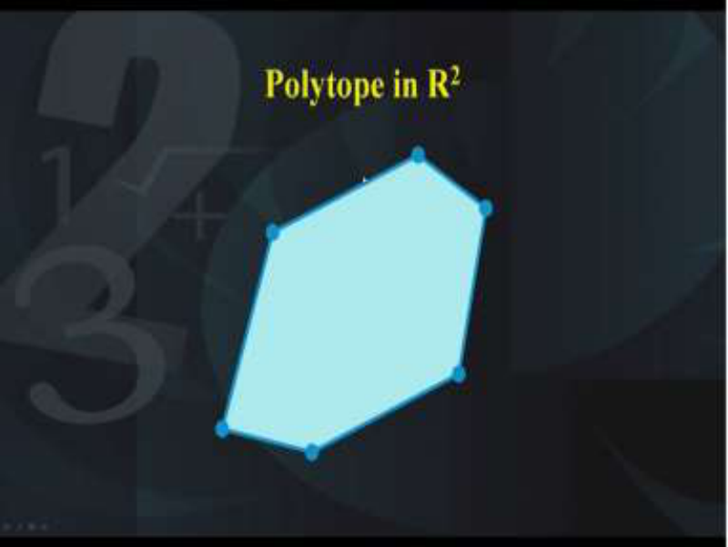

Let us look at an example. Now in this example, you find that this is a polytope because it is obtained by the intersection of a finite number of hyperplanes which are dividing the space into lower and upper categories. 

**(Refer Slide Time: 35:37)** 

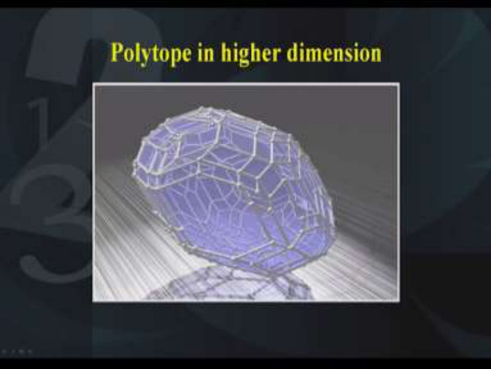

Similarly, we can define higher dimensional cases of polytopes as is shown here in this diagram. 

**(Refer Slide Time: 35:49)** 

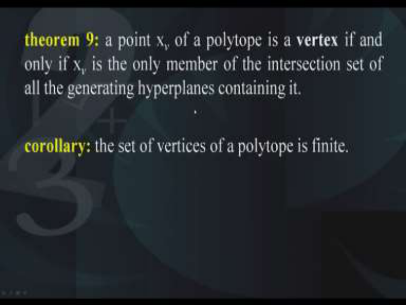

Theorem number 9, a point Xv of a polytope is a vertex if and only if this point Xv is the only member of the intersection set of all generating hyperplanes containing it. So, this is intuitive that is the way the vertex is defined. Corollary, the set of vertices of a polytope is finite. So, as an exercise you can try to prove this statement. 

**(Refer Slide Time: 36:31)** 

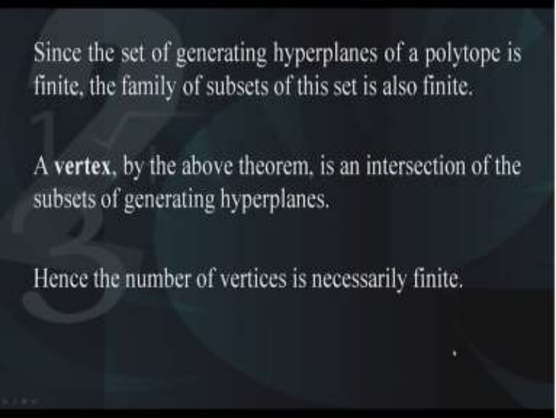

Since the set of generating hyperplanes of a polytope is finite, the family of subsets of this set is also finite. Therefore, we can say that a vertex by the above theorem is nothing but the intersection of the subsets of generating hyperplanes. Hence, the number of vertices is necessarily finite. 

**(Refer Slide Time: 37:03)** 

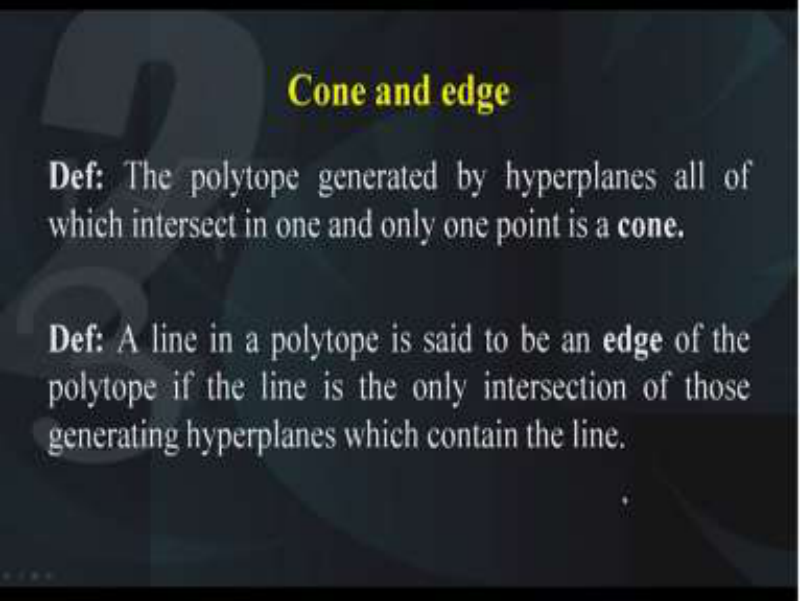

Some more definitions; the cone and edge, so let us define the cone first. The polytope generated by hyperplanes all of which intersect in one and only one point is a cone and similarly a line is in a polytope is said to be an edge of the polytope if the line is the only intersection of these generating hyperplanes which contains the line. 

**(Refer Slide Time: 37:43)** 

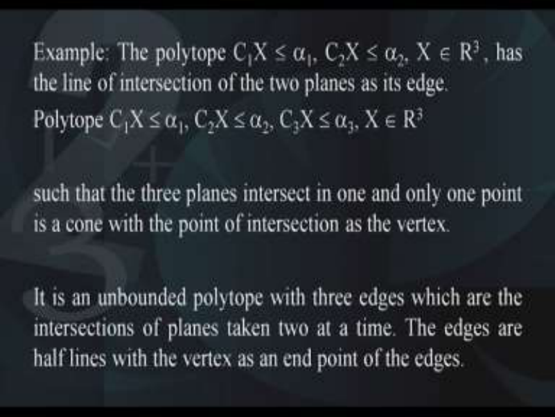

Let us take some examples to understand this. The polytope C1X   1, C2X   2, C3X   3, X  R3 has the line of intersection of the two planes as its edge, that is polytope C1X   1, C2X   2, C3X   3,  where X  R3 such that the three planes intersect in one and only one point in a cone with the point of intersection as the vertex. It is an unbounded polytope with three edges which are the intersection of the planes taken two at a time and the edges are half lines with the vertex as an endpoint of the edges. 

**(Refer Slide Time: 38:50)** 

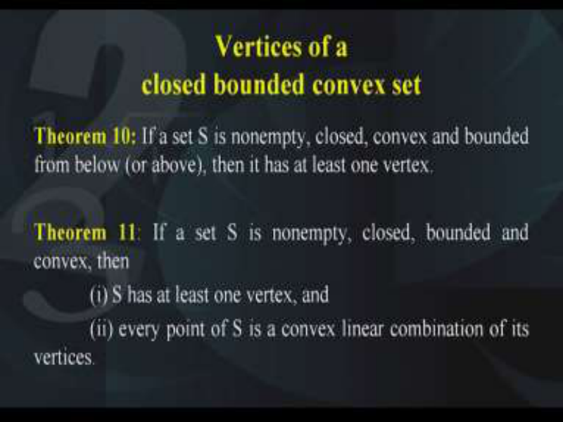

Now let us look at what do we mean by the vertices of a closed bounded convex set. Theorem 10 tells us that if a set S is nonempty, closed, convex and a bounded set from below or let us say above, then it has at least one vertex. Similarly, theorem 11 tells us if a set S is nonempty, closed, bounded and convex, then (i) S has at least one vertex and (ii) every point of S is a convex linear combination of its vertices. 

**(Refer Slide Time: 39:49)** 

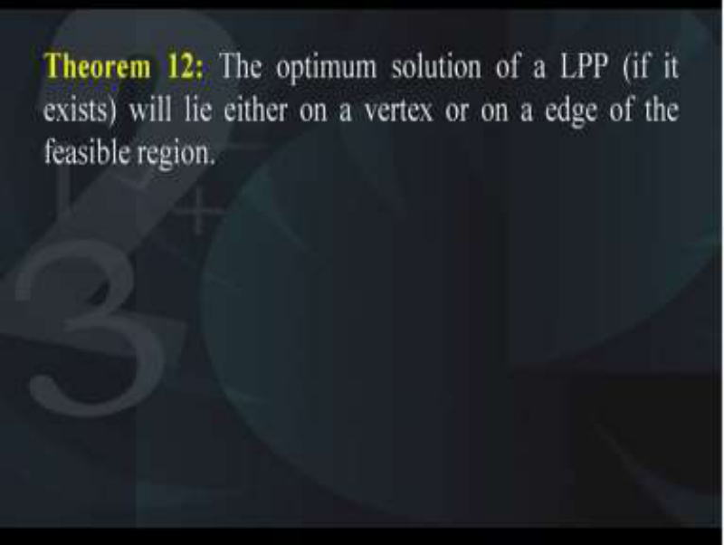

Theorem 12 tells us that the optimum solution of a LPP (if it exists), then it will either lie on a vertex or on a edge of the feasible region. Now this theorem 12 tells us what is the importance of studying these concepts of convex sets and polytopes with respect to the linear programming what we are studying. **(Refer Slide Time: 40:20)** 

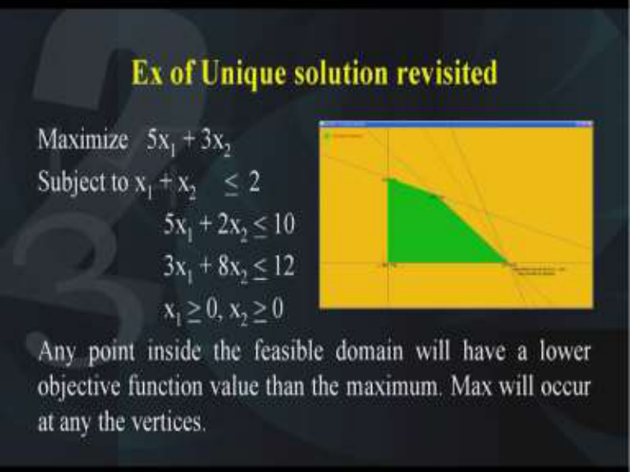

In order to understand this theorem, let us look at the graphical method that we did in the previous lecture and we saw the example of the unique solution case. Now this example illustrates that we have an LP as shown here that is maximization of 3x1+5x2 subject to x1 + x2 <u><  2, 5x1 + 2x2 < 10, 3x1 + 8x2 < 12 and both x1  and x2 > 0. Now, we find that the feasible</u> region is given in figure which is shaded in green color to indicate that this is the feasible region. The solution of this problem is shown here at this vertex and you can see that the solution will either lie on one of the vertices or it will lie on an edge and by edge we mean the line segment joining any two vertices. In fact, any point inside the feasible domain will have a higher value, objective function value, a lower objective function value than the maximization because it is a maximization problem. So therefore, any point lying inside the feasible region will have a lower value that is an inferior value as compared to the maximum. Therefore, maximum will occur only at the vertices or on an edge. 

Similarly, let us look at the example of multiple solution case. **(Refer Slide Time: 42:17)** 

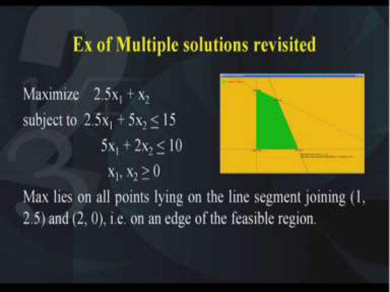

Here again we find that the problem is maximization of 2.5x1+x2 subject to 2.5x1 + 5x2 <u>< 15,</u> 5x1 + 2x2 <u>< 10 and x1 and x2 > 0. We find that the maximum lies on all points lying on the</u> line segment joining these two points that is (1, 2.5) and (2, 0), that is, the solution lies on the edge. In fact, it lies on all points which are obtained on joining these, the line segment joining these two points. 

**(Refer Slide Time: 43:06)** 

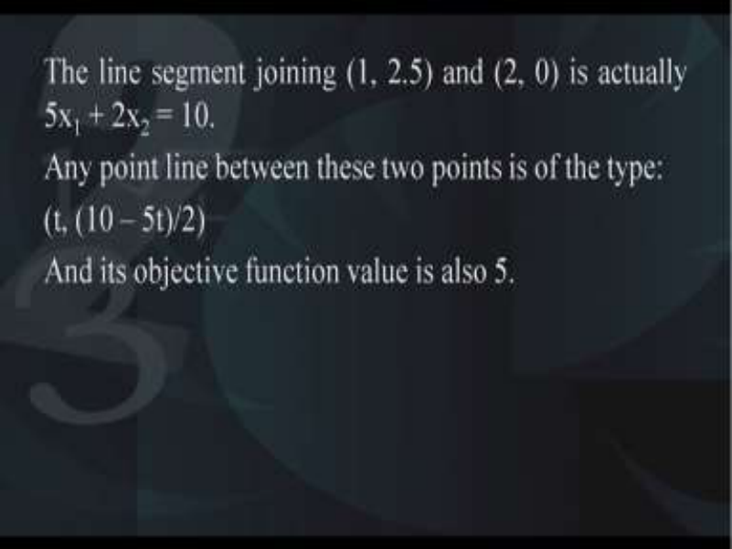

The line segment joining (1, 2.5) and (2, 0) is actually this line 5x1+2x2=10 and if you try to find out the coordinates of this then any point which lies between these two points will be of the type given by (t, (10-5t)/2) and its objective function will also be 5 and hence this will give the optimum solution and as I explained in the last lecture that there will be multiple such points and in fact there will be unbounded number of such points. **(Refer Slide Time: 43:50)** 

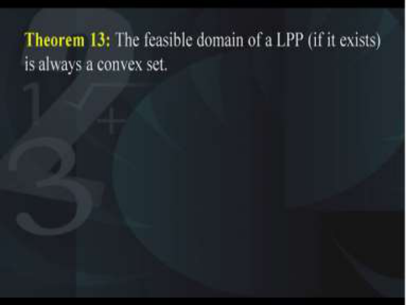

Theorem 13, the feasible domain of a LPP if it exists is always a convex set. Now again this is one of the reasons why we were studying convex sets with respect to linear programming problems. On the other hand, if you take a look at a feasible domain of a nonlinear programming problem then you find that the feasible domain of any nonlinear programming problem may or may not be convex. 

**(Refer Slide Time: 44:20)** 

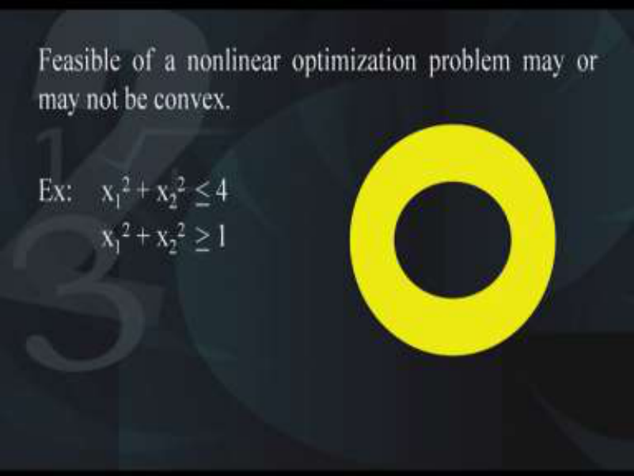

So here is an example to show you that the feasible domain of a nonlinear programming problem could be convex. As you can see that this feasible domain is nothing but a torus of two circles and that is x12 + x22 <u>< 4 and similarly x1</u>2 + x22 <u>> 1.</u> **(Refer Slide Time: 44:50)** 

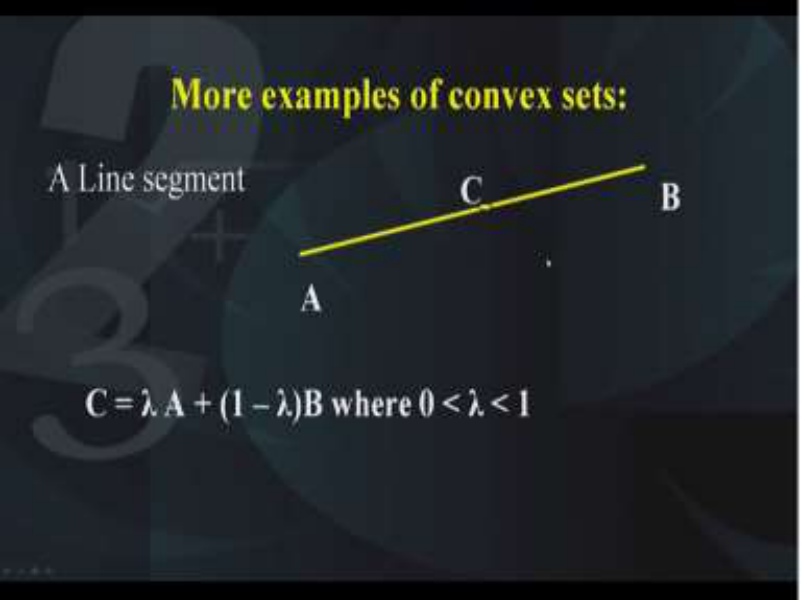

Some more examples of convex sets with respect to linear programming. As I said, the line segment joining any two points is always a convex set. So here is an example to show you that if you have this line segment A and B. So, this line segment is a convex set. Why is it convex? Because if you take any point C on this line segment then it can be written like this, C = λ A + (1 – λ)B, where 0 <u><</u> λ <u>< 1. In fact, if this strict inequality is converted into</u> inequality, that is, if equality is also included then it will also take into account the endpoints A and B, but in this example I am trying to show that the line segment joining any two points A and B is also a convex set and also let us look at unbounded sets. **(Refer Slide Time: 46:06)** 

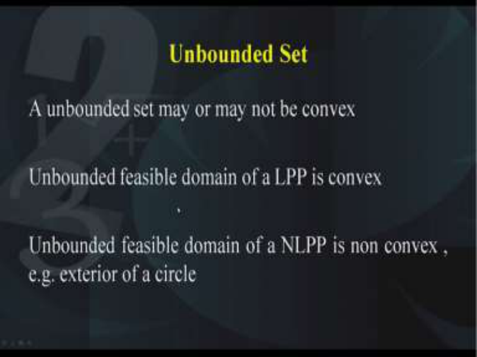

An unbounded set may or may not be convex and an unbounded feasible domain of a LPP is convex. Unbounded feasible domain of a NLPP is not convex, that is, for example the exterior of a circle. So in the end, I would like to conclude that we have studied today some 

concepts related to convex sets and their properties and we have also seen how they have a lot of importance with respect to our subject of concern that is linear programming. 

We have also seen a number of theorems which shows some of the results related to the convex sets and their properties. In the end, I would like to mention that you should check out these examples and exercises. 

# **(Refer Slide Time: 47:06)** 

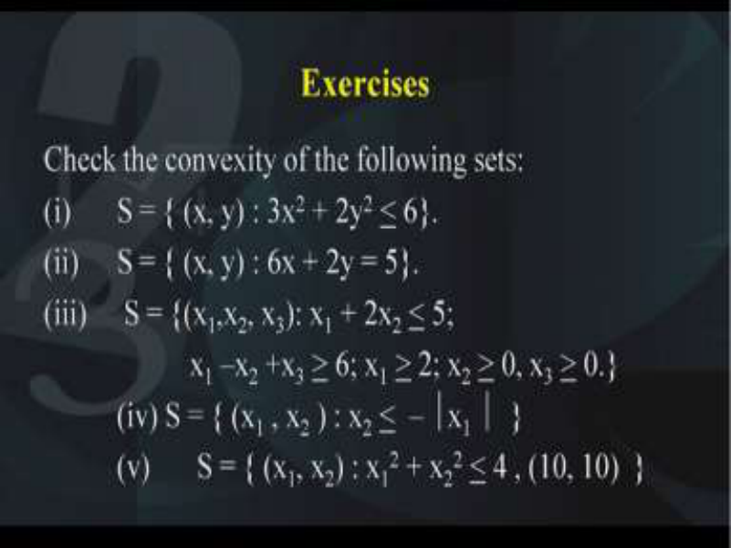

I want you to check the convexity of the following sets; (i) S = { (x, y) : 3x2 + 2y2 <u>< 6}, as</u> you can see that this is nothing but a circle. (ii) S = { (x, y) : 6x + 2y = 5}, as you can see that this is nothing but a straight line and the third example is S = {(x1,x2, x3): x1 + 2x2 <u>< 5;  x1 –x2</u> +x3 <u>> 6; x1 > 2; x2 > 0, x3 > 0} The fourth example is S = { (x1 , x2 ) : x2 <  –</u>  x1  }  and the fifth example is S = { (x1, x2) : x12 + x22 <u><</u> 4 , (10, 10)  }. So with these five examples, I conclude this chapter. Thank you. 

