# **Operations Research Prof. Kusum Deep Department of Mathematics Indian Institute of Technology – Roorkee** 

# **Lecture - 05 Simplex Method** 

Good morning students. Till now, we have studied how to solve a 2-dimensional linear programming problem using the graphical method. Next, we want to see how we can solve any n-dimensional linear programming problem. For this, we have the well-known simplex method introduced by Dantzig. This method can be used to solve any n-dimensional linear programming problem. 

**(Refer Slide Time: 01:04)** 

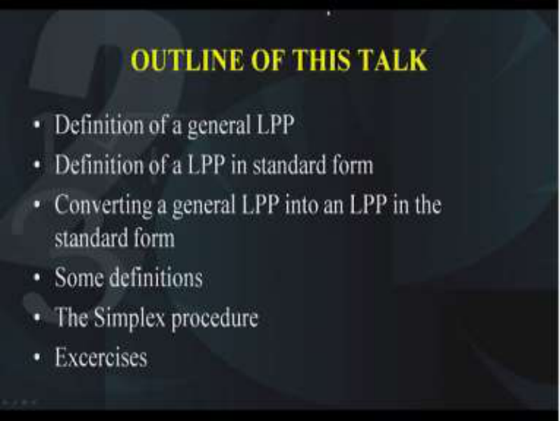

The outline of today's talk is definition of a general linear programming problem. Then, we will like to look at the definition of a linear programming problem in the standard form. Then, we will see how we can convert a general linear programming problem into a LPP in the standard form, then some definitions and then the simplex method with the help of an example and finally an exercise for you. 

**(Refer Slide Time: 01:41)** 

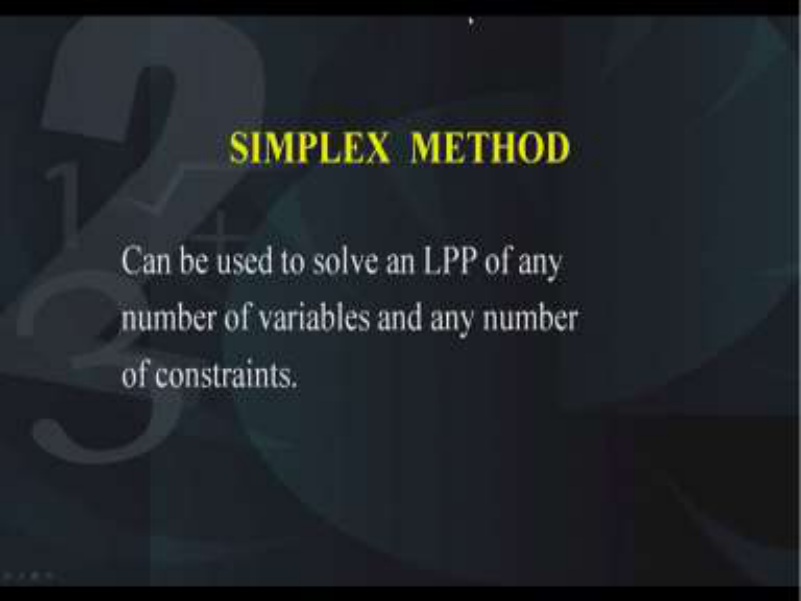

So, the simplex method can be used to solve an LPP of any number of decision variables and any number of constraints. 

**(Refer Slide Time: 01:53)** 

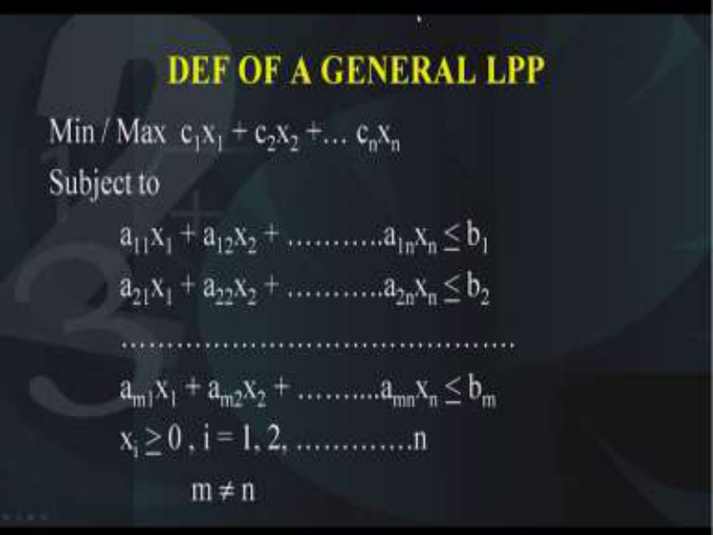

First of all, let us give the definition of a most general linear programming problem. It is defined like this, minimize or maximize c1x1 + c2x2 +… cnxn subject to a11x1 + a12x2 + ………..a1nxn <u>< b1, a21x1 + a22x2 + ………..a2nxn < b2 and the mth constraint is am1x1 + am2x2</u> + ……....amnxn <u>< bm. All the decision variables xi > 0 , i = 1, 2, ………….n. In general</u> m  n. So, this is the definition of the most general linear programming problem. **(Refer Slide Time: 02:59)** 

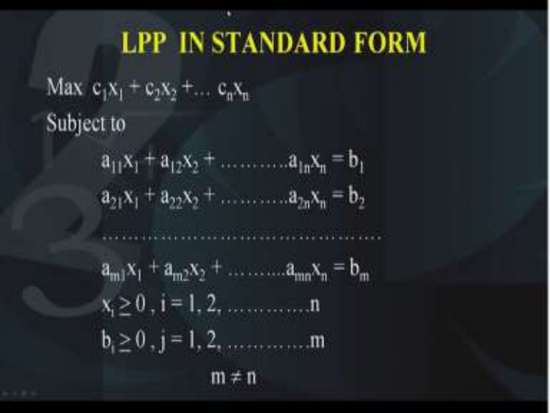

Now, let us define an LPP in the standard form. It is defined as follows, maximization of c1x1 + c2x2 +… cnxn subject to a11x1 + a12x2 + ………..a1nxn = b1 and like this the last constraint is am1x1 + am2x2 + ……....amnxn = bm. All xi <u>> 0 , where i = 1, 2, ………….n and the right hand</u> side that is the bj's, bj <u>></u> 0, where  j = 1, 2, ………….m and as before m  n in general. It could be equal but in general m  n. Now, the observations are as follows. The difference between the LP in the general form and LP in the standard form is the following that is the objective function has been converted to the maximization type. If the LP is having a minimization type, then the minimization should be converted to the maximization type by multiplying by the negative sign. Also, you will observe that the second difference is that the right hand side entries are all >=0 that is b1, b2, bm are all >=0 and the third difference between the general LP and the LP in the standard form is that each of the inequality has been converted into equality. Of course, please note that all the coefficients aij’s, cj’s and bj’s they have to be real numbers. 

**(Refer Slide Time: 05:25)** 

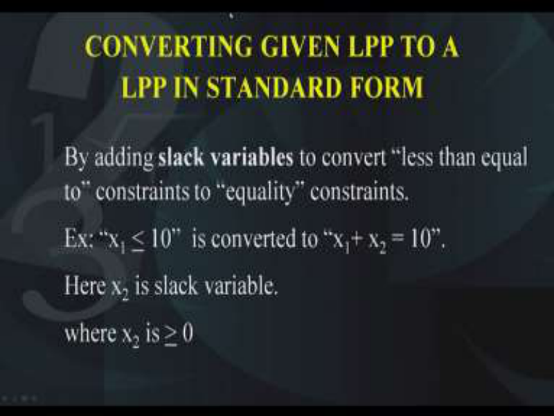

So, the question is how to convert these inequalities into equalities. Let us see how that is to be done. So, we have to convert the given LP into the LP in the standard form. This is done by the following procedure. We can add slack variables to convert the less than equal to inequalities into an equality. For example, if you have a constraint let us say x1 <u>< 10, then this</u> constraint can be converted to an equality by adding another variable let us say x2 such that x1+ x2 = 10. Here x2 is called the slack variable because it is converting the less than inequality into an equality. Of course, we have to make sure that this slack variable x2 must be <u>> 0.</u> 

**(Refer Slide Time: 06:34)** 

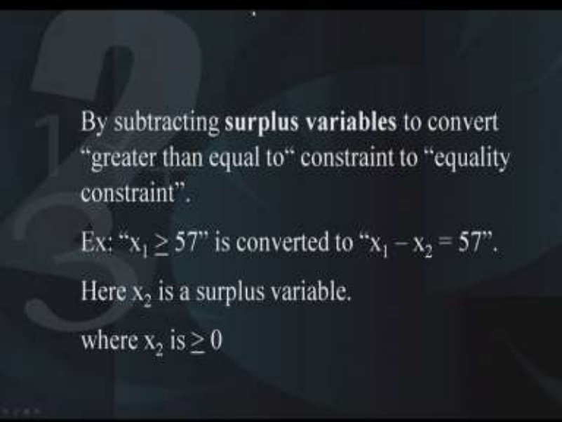

The second situation arises when we have a greater than inequality and we have to convert this greater than inequality into an equality. So, how to convert it, this is done by subtracting a positive variable which is called as the surplus variable and this with the help of this surplus 

variable, we can convert a greater than equal to inequality into an equality and of course the surplus variable has to be subtracted. 

So as an example, suppose we have x1 <u>> 57. Here we have the greater than equal to sign. So</u> in order to convert it into an equality, we will subtract another variable let us say x2 that is x1 – x2 which will make it into an equality. Of course, x2 should be <u>></u> 0 otherwise it will not work and x2 is called a surplus variable. 

**(Refer Slide Time: 07:52)** 

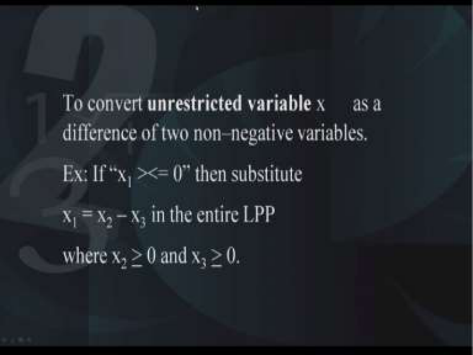

Now there could be a situation where we have an unrestricted variable let us say x1. So in this situation, we can convert this unrestricted variable as a difference of two non-negative variables that is because we want that all the xi's should be > 0. Suppose in the general LP we have a situation where a particular variable is not necessarily >0. So in such a situation, we can replace that variable as a difference of two non-negative variables. 

Let us take an example. Suppose, we have the variable x1 which is <u>>or<0. That is it is</u> unrestricted in sign. Then, we will substitute x1 = x2-x3 in the entire LPP. That is this substitution has to be made in the objective function as well as all the constraints that are there in the problem. Of course, we have to make sure that x2 and x3 should both be >0. **(Refer Slide Time: 09:22)** 

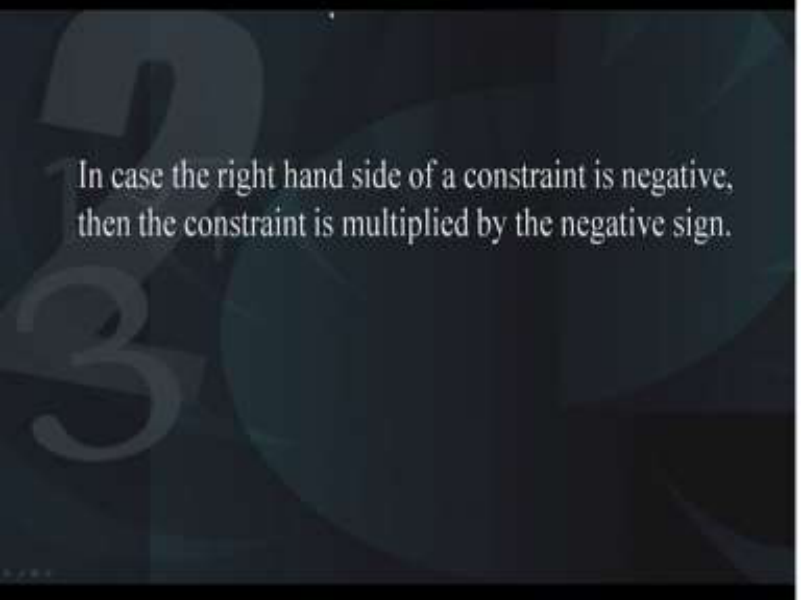

Now let us look at the right-hand side. In case, the right-hand side is negative then we have to multiply that particular constraint with the negative sign so that the right-hand side becomes positive. 

# **(Refer Slide Time: 09:41)** 

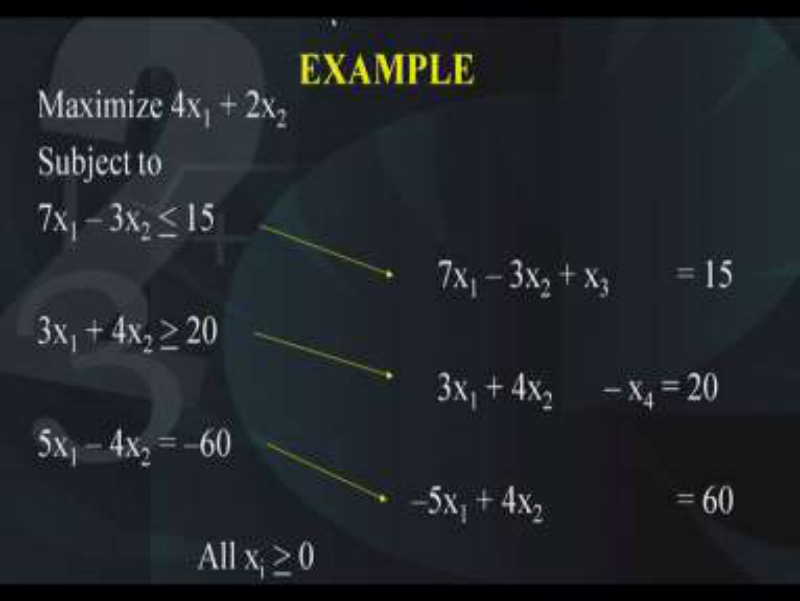

So I hope that you have understood the method of converting any general LPP into an LPP in the standard form. So, let us take an example to understand this procedure. Suppose, we have a LPP which is given to be maximization of 4x1+2x2 subject to 7x1 – 3x2 <u>< 15  , 3x1 + 4x2 ></u> 20, 5x1 – 4x2 = –60 and all xi <u>> 0. So, let us look at the way in the format in which the LPP in</u> the standard form should be. 

The first thing is that the objective function should be of the maximization type. In our case, it is already in the maximization type, so we do not have to do anything. Next, let us look at the first constraint. This constraint is of the type less than equal to, so we need to add a slack 

variable and that is the way we will do it. This constraint will become 7x1-3x2+x3 =15. Here x3 is a slack variable and it should be > 0. 

Coming to the second constraint, this is greater than or equal to constraint. So we need to subtract a surplus variable. Here it becomes 3x1+4x2-x4=20 and of course x4 should also be <u>>0. Coming to the third equation, we find that although it is already an equality but the right</u> hand side is negative but we want that the right hand side should be positive. Therefore, all we need to do is multiply it with the negative sign and that is what it looks like -5x1+4x2=60. Of course, we have to make sure that all the decision variables should be >0. In this case, we do not have any unrestricted variable, so therefore now we have been successful in converting the given LPP into an LPP in the standard form. 

**(Refer Slide Time: 12:52)** 

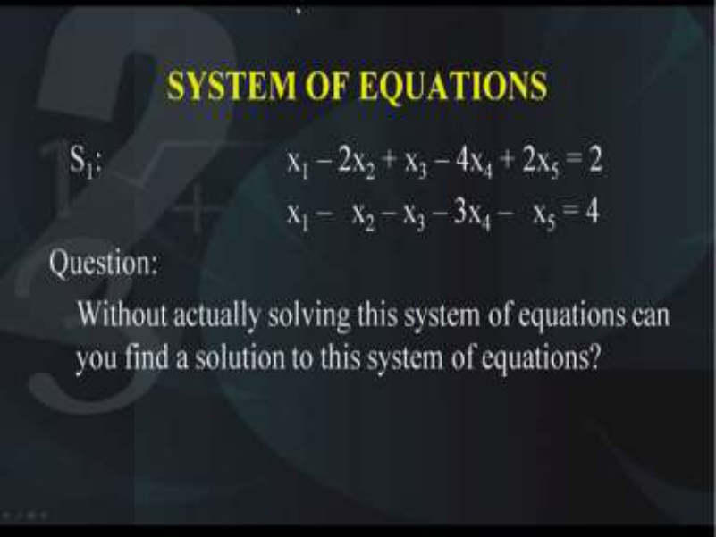

Now let us look at the way in which we can prepare ourself for starting the simplex procedure. Before we do that let us look at this system of equations, let us call this system of equations as S1. So this is a system of two equations in five unknowns. These equations are x1 – 2x2 + x3 – 4x4 + 2x5 = 2 and the second equation is  x1 – x2 – x3 – 3x4 –  x5 = 4. Now, I have a question for you. Without actually solving this system of equations, can you give me a solution to this system of equations? Can you find a solution to this system of equations? Obviously, you know that since the number of unknowns is 5 and the number of equations are 2, so 2<5. Therefore, this system of equation will have infinite number of solutions. Therefore, if you can just give me one solution out of these infinite solutions that is what I want. 

So, if you want to get a solution, you have to try the hit and trial method and see if you can get a solution. Some of you must have got it. 

# **(Refer Slide Time: 15:00)** 

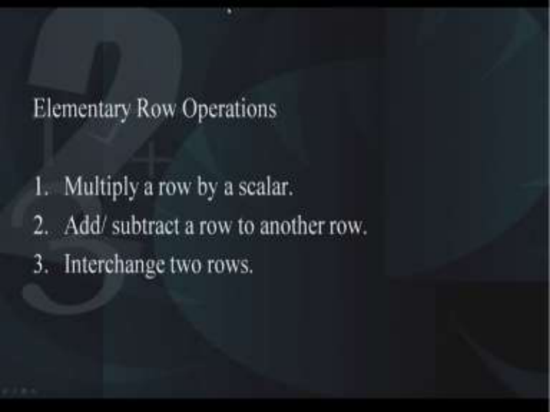

In general, what we will do is we will apply elementary row operations. Now the elementary row operations are as follows. There are three such operations. The first one is multiply a row by a scalar; a scalar means a real number. So, the first operation is multiply a row by a real number. Second operation is either add or subtract a row from another row and the third operation is interchange any two rows. 

**(Refer Slide Time: 15:46)** 

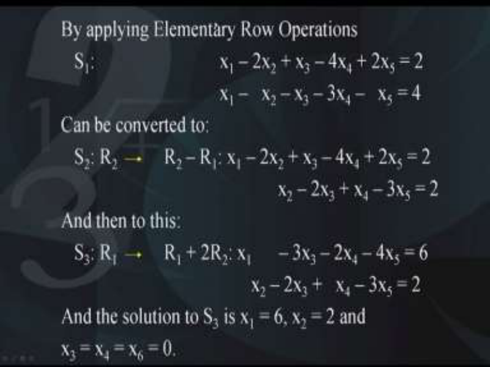

So, these are the three elementary row operations and using these elementary row operations, we will convert the given system of equations S1 into an equivalent system of equations. How we will see in a minute. First of all, we will apply the elementary row operations to this given system of equations S1 as follows. We will replace the second row that is R2 by R2-R1 and once we do this operation, we will get another system of equations which we will call as S2. 

So what is this system of equation S2? The first row is as before, the second row will be replaced by the following x2 – 2x3 + x4 – 3x5 = 2. What you have observed is that in the second equation x1 coefficient has become 0 that is there is no x1 term in the second equation. This has been done purposely and that is the way the elementary row operation which has to be applied is decided. It is decided by looking at the coefficient of x1 in the first system of equation S1. Next, we will apply another elementary row operation which is as follows, R1 that is the first row will be replaced by R1+2R2 and after this we will get another system of equations that is called as S3. In this system of equations, the second row is as same as that of S2 but the R1 will be replaced by x1 – 3x3 – 2x4 – 4x5 = 6. 

Now what we see here, we have converted S1 into S3 by applying a series of elementary row operations. In such a way that if you observe the system of equations S3, you can easily get a solution to this system of equations. What is that solution? The solution is x1=6, x2=2 and the remaining variables that is x3, x4 and x5 all of them equal to 0. 

# **(Refer Slide Time: 19:08)** 

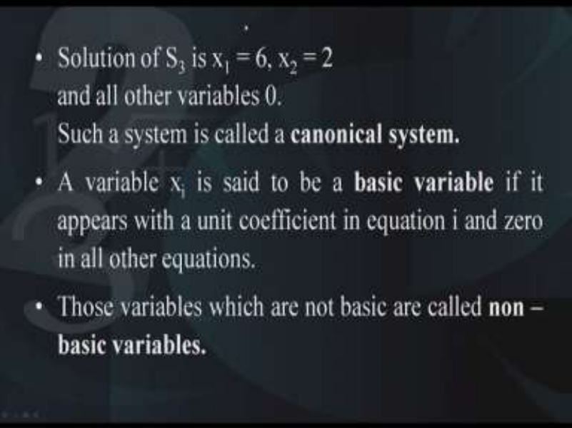

If you try to substitute this solution into S1, you will find that this solution will satisfy S1 as well and that is the beauty about this procedure wherein you are applying a series of elementary row operations such that you get this kind of a system of equations in which you can set some of the decision variables equal to the right hand side and the rest of the variables as 0. 

Now the solution of S3 as I said is x1=6 and x2=2 and all other variables=0. Such type of a system of equations is called a canonical system. We observe that there are some variables in this canonical system of equations which can be equated to the right hand side and the 

remaining variables can be put=0. So, we can define a variable xi to be a basic variable if it appears with a unit coefficient in the equation number i and 0 in the remaining. According to this definition, we find that in the canonical system S3, x1 is a basic variable in the first equation and similarly x2 is a basic variable in the second equation. That is to say these two variables are satisfying the definition of a basic variable. Those variables which are not basic are called as non-basic variables. So, in the canonical system of equations, the basic variables are set equal to the right-hand side whereas the non-basic variables are set =0. And this is a solution to the system of equations that is the canonical form of the system of equations. 

**(Refer Slide Time: 21:52)** 

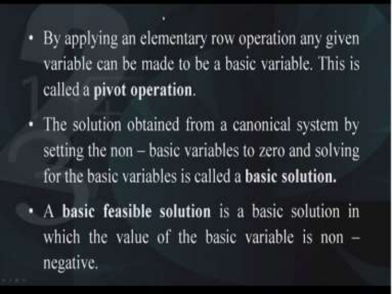

Now as you have seen with the help of this example that by applying a series of elementary row operations any particular variable can be converted into a basic variable and this operation is called as a pivot operation. The solution obtained from a canonical system by setting the non-basic variables to 0 and setting the basic variables and solving for the basic variables is called a basic solution. So, the basic solution is nothing but a solution in which the basic variables are set equal to right-hand side and the non-basic variables are set is equal to 0. This is called as a basic solution but remember that we must have that the right-hand side should be >=0. Therefore, a basic feasible solution is a basic solution in which the value of the basic variable is non-negative. We do not want the right-hand side to be negative. **(Refer Slide Time: 23:18)** 

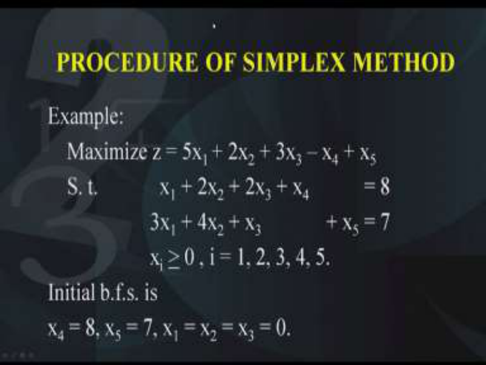

So with these definitions, we are now ready to start the procedure of the simplex method. If you recall the graphical method, we saw that the solution of the LP lies on vertices and what are vertices, they are nothing but the point of intersection of the various constraints. So actually this system of equations that we solve are nothing but the point of intersection of each of these constraints. 

So let us take an example. The example is as follows, maximization of z = 5x1 + 2x2 + 3x3 – x4 + x5. So this is a five variable problem and we have two constraints. Suppose, the constraints are x1 + 2x2 + 2x3 + x4 = 8 and the second constraint is 3x1 + 4x2 + x3  + x5 = 7. All the decision variables xi are > 0 where i goes from 1, 2 up to 5. You will observe that this problem has already been converted into a LP in the standard form. 

The objective function is of the maximization type and the constraints are of the equality type, also right hand sides are > 0. So, assuming that our problem is already in the standard form, now let us begin our simplex procedure. As you can see that in the first equation x4 is a basic variable because it is appearing with a unit coefficient in the first equation and 0 in the second equation. Similarly, in the second equation x5 is a basic variable because it is appearing with unit coefficient in the second equation and 0 in the first. Therefore, an initial basic feasible solution or an initial BFS in short is x4=8 and x5=7 and the remaining x1 = x2 = x3 = 0. So, we have got a vertex of the point of intersection of all the constraints and we will see how we can move from one vertex to an adjacent vertex. So starting with this BFS, we will start the simplex procedure. 

**(Refer Slide Time: 26:54)** 

First of all, we will like to record all these entries in an initial table. Let us look at this table how it is constructed. Under the basis column, we have the two basic variables that we have just now identified that is x4 and x5 and then we have on the top the coefficients of x1, x2 etc in the objective function. So, we have these coefficients 5, 2, 3, -1, 1. These are the coefficients of the objective function corresponding to each of the x1, x2 etc. 

The column corresponding to x1 is written under the x1 column that is 1 and 3, column under x2 is 2 and 4 and column under x3 is 2 and 1 and x4 is a basic variable, so it is having coefficient 1 and 0. Similarly, x5 is having a coefficient, it is a basic variable, so it is having the column as 0 and 1 and finally the right-hand side, the right-hand side is 8, 7. 

Also, you will find that in the first column by the side of the basis, we have -1 and 1. These entries are nothing but the coefficient of the basic variables in the objective function. So x4 is the basic variable and x5 is the basic variable and if you look at x4, the coefficient of x4 is -1 that is why -1 is coming in that first column. Similarly, coefficient of x5 is 1 in the objective function, therefore 1 is coming here. 

So, I hope everybody has understood how this initial table is constructed. Then, we calculate this last row of this table. This is calculated as follows, it is actually called the deviation entries that is how much deviation is occurring from the objective function of the decision variables. Therefore, you can just write down these entries and then I will tell you how they have been obtained. These entries are 3, 0, 4, 0 and 0. 

Now these entries have been obtained by the following; The coefficient of x1 in the objective function is 5, so 5 – (–1 1) (1  3)t , this will give me 3. Next, this coefficient of x2 is 2 and 2 – (–1 1) (2  4)t = 0. 

# **(Refer Slide Time: 30:54)** 

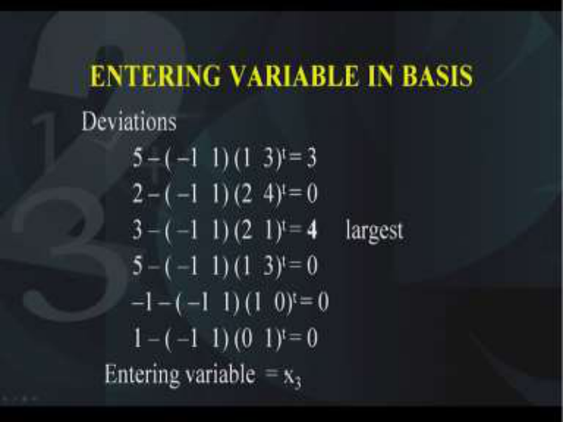

Let us look at the next slide where these calculations have been shown. The first entry was 5 – ( –1  1) (1  3)t and this will also become a scalar and you will get entry 3. Similarly, 2 – ( – 1  1) (2  4)t = 0, the third one is 3 – (–1  1) (2  1)t , which comes out to be 4 and then the next entry is 5 – (–1  1) (1  3)t which comes out to be 0. Then, the fourth one is –1 – (–1  1) (1  0)t which is equal to 0 and the last one is 1 – (–1  1) (0  1)t which is equal to 0. 

So these entries are 3 0 4 0 0 0. Let us go back to the table, here they are 3 0 4 0 0. You will observe that the entries corresponding to the basic variables are 0. That is the entries in the deviation row corresponding to the basic variables that is x4 and x5, so these entries are 0 in the deviation rows. This means that there is no deviation from the basis. This is not a chance, it will always happen, whenever there is a basic variable, it will have a corresponding entry in the deviation rows as 0. 

Now if you substitute this BFS that is x4=8 and x5=7 in the objective function, you will get the value of Z and that value comes out to be -1. So that is why in the last row and last column, we have Z=-1. The next thing we need to see, how we can traverse to the next adjacent vertex where this vertex is nothing but the point of interest section of the constraints. So for this, we need to move to the adjacent vertex. By adjacent vertex I mean out of the basic variables, in our case there are two basic variables x4 and x5; we have to replace either x4 or x5 with any other non-basic variable into the basis. So therefore, we have to take two decisions. The first decision is which variable should be made a basic variable and the second 

decision is which variable should leave the basis. So for this, the first decision that is which variable should enter the basis, this decision is answered by observing these entries in the deviation rows. That entry corresponding to the largest entry should be made entered into the basis and here we can see that the entry third entry that is 4 is the largest and therefore the variable corresponding to this entry that is x3 should be made to enter into the basis. So that is the reason why we take a decision that the entering variable is x3. 

# **(Refer Slide Time: 35:25)** 

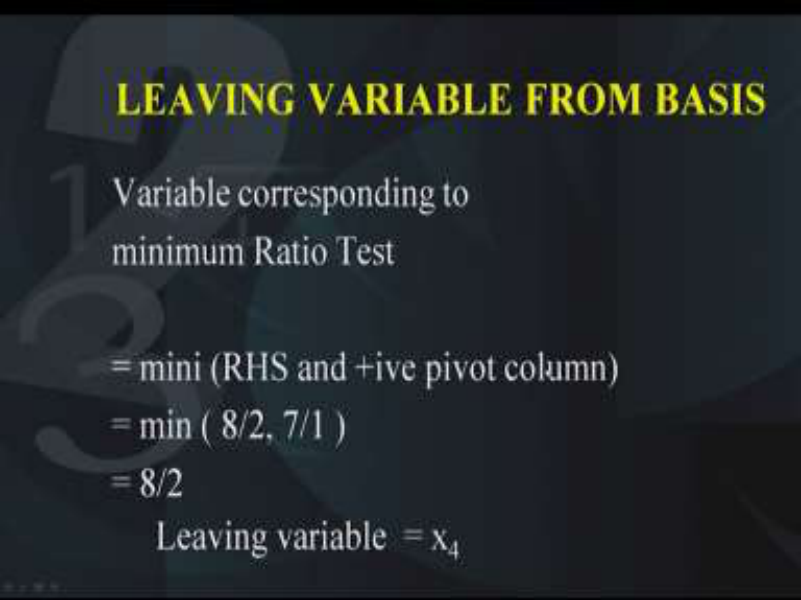

So the next point is how to decide which variable should leave the basis, for this we have to calculate what is called as the minimum ratio test. The minimum ratio test is performed between all entries of the right-hand side and all the positive quantities in the pivot column. Pivot column is the column which corresponds to that variable which we have decided should enter into the basis. So the minimum of 8/2 and 7/1 has to be performed. If you look at the this initial table, we have to perform a minimum ratio test and the minimum ratio test has to be performed between right-hand side and the pivot column. So right-hand side is 8 and 7 and the pivot column is 2 and 1 because we have already decided that x3 should enter the basis. Therefore, the minimum ratio test has to be performed between 8 and 2 and similarly 7 and 1, so 8/2 and 7/1. The minimum out of these two is what 8/2 is 4 and 7/1 is 7, so that means the minimum is the first one. This tells us that the variable x4 should be the variable which should leave the basis and that is what has been shown here. This is the variable x3 should be entering variable and we can say that because 8/2 is 4 is the minimum. Therefore, the leaving variable is x4. 

# **(Refer Slide Time: 37:37)** 

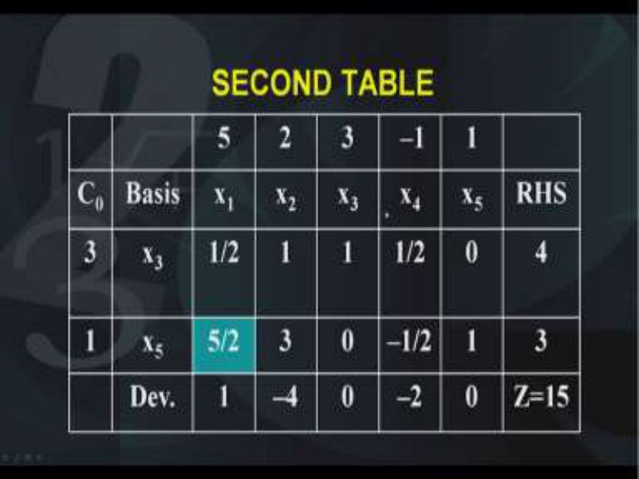

This tells us that the new basis becomes x3 and x5 because we found that the corresponding deviation entry of x3 was the largest and therefore x3 should enter and also we found that the minimum ratio test indicated that x4 should leave the basis. That is the reason why in the second table, the new basis will become x3 and x5. If you observe the previous table, it was x4 and x5 and in this table it is x3 and x5. This indicates that only the first basic variable has been changed, the other one is the same. That is why it is called as an adjacent BFS. So, the BFS corresponding to this table is x3=4 and x5=3 and how is this table obtained? This table is obtained by applying elementary row operations on the initial table. As you have seen, the elementary row operations are nothing but the way in which this x3 should be made as a basic variable. That is it should be (1 0) and x5 is already a basic variable. Before you proceed, please note that the first column which is written as C0 has also to be changed corresponding to the x3 variable because x3 is appearing with a coefficient 3 in the objective function right. The coefficient of x3 in the objective function is 3. Therefore, this column has also to be changed and again the elementary row operations have to be performed in such a way that these entries are all changed and how do you make these elementary row operations? If you look at the first table, the initial table, **(Refer Slide Time: 40:07)** 

this cell I would call it which has been shown by the green color is showing an entry 2 and we want that this is has to be converted to 1. Why? Because we have to make this x3 as a basic variable, so instead of (2 1) this column should be changed to (1 0) and how is that to be done? That has to be done by applying the appropriate elementary row operations. So, first of all we have to convert this entry 2 as 1 and how do we do that? We will replace the first row that is R1 by R1/2, so the entire row has to be divided by 2. So we will get 1/2 1 1 1/2 0 and 4. Let us see at this table, that is it 1/2 1 1 1/2 0 and 4. I hope it is clear how we have applied this elementary row operation. We have divided this row by 2 and how did we decide this we have to divide by 2 because the pivot element was 2 and we had to make it into 1. 

Next comes the second row. What elementary row operations should be applied on the second row such that the entry under the x3 column becomes 0? So let us come back to the first table. We have to make this entry under x3 in the second row as 0. So all you need to do is apply an elementary row operation as R2 should be replaced by (R2-R1). Now the R1 that you will be using will be the new R1. Therefore, you will get 3-1/2. Let us see what do we get here that is right, 3-1/2 is 5/2 and similarly the other entries. So what we have done is, we have applied elementary row operations in such a way that this column under x3 has become a basic variable that is x3 has the column (1 0). Of course, x5 will remain as (0 1), it will not be changed. This completes one iteration of the simplex method. 

Again, repeat this process and how do you do that, first of all you compute the deviation entries. The deviation entries are nothing but 5-(3 1)*(1/2 5/2) which is 1, 2-(3 1)*(1 3)t 

which is -4,  3-(3 1)*(1 0)t which is 0, anyway it is a basic variable and similarly -1-(3 1)*(1/2 -1/2)t which is -2 and x5 is a basic variable, so the entry is 0. 

So at this iteration, our BFS becomes x3=4 and x5=3, all other variables 0. 

If you substitute this BFS into the objective function, you get the value of the objective function Z=15. So what you have seen that just in one iteration you have improved the objective function value from -1 to 15 and that is the whole idea behind the simplex method. At each iteration, we move from one BFS to another BFS such that the objective function value improves. 

# **(Refer Slide Time: 45:10)** 

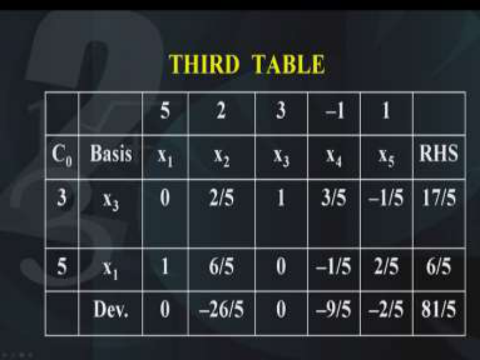

Same way you get the third table. The third table is as follows; you have the first row as x3 is 0 2/5 1 3/5 -1/5 and 17/5 and the second row becomes x1 that is 1 6/5 0 -1/5 2/5 and 6/5 and if you try to calculate the deviation entries, you get the following, 5-(3 5)*(0 1)t is 0, anyway it is a basic variable. Then, you have 2-(3 5)*(2/5 6/5)t , you get -26/5, x3 is a basic variable, so you get 0.  x4 you get  as -1- (3 5)*(3/5 -1/5)  is -9/5, and  1-(3 5)*(-1/5 2/5) you get -2/5. 

If you look at this BFS that is x3=17/5 and x1=6/5, the remaining variables as 0 then if you substitute this into the objective function, you get the value of Z as 81/5 and again this is a significant improvement over the previous value. Again, you calculate the deviation rows, the deviation rows are 0 -26/5 0 -9/5 and -2/5 and what do you observe? You observe that all the entries in the deviation row are either 0 or having negative value. 

So you cannot decide which variable should enter the basis and in fact that is what is the stopping criteria. The stopping criteria is if all the entries in the deviation row become either 0 or a negative, then the simplex procedure stops and we get the final optimal solution. 

**(Refer Slide Time: 48:05)** 

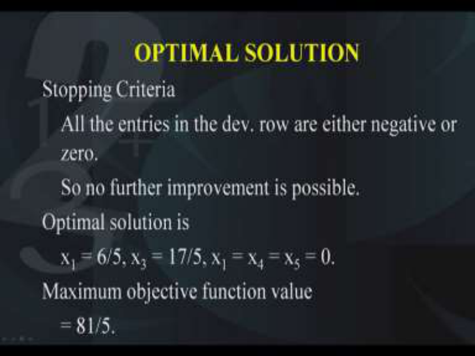

So, the optimal solution is obtained by the stopping criteria that is all the entries in the deviation row should be either negative or 0. Therefore, no further improvement is possible and the optimum solution is x1=6/5, x3=17/5 and the remaining variables as 0 and the maximum objective function value is 81/5. 

**(Refer Slide Time: 48:39)** 

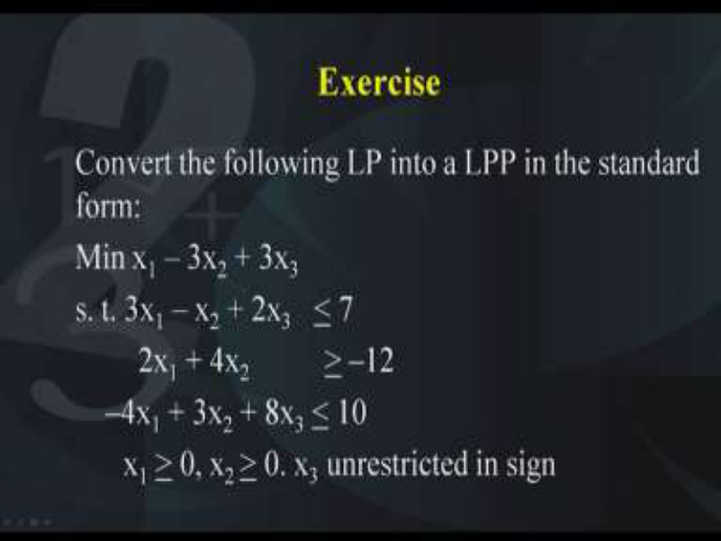

So, I hope everybody has understood how the simplex method works and how at each iteration you have to decide which variable should enter the basis and which variable should leave the basis. So as an exercise please note down this problem. So I want you to convert the 

following LP into an LPP in the standard form. The given LPP, the general form of the LPP is as follows. 

Minimize x1 – 3x2 + 3x3 subject to 3x1 – x2 + 2x3 <u>< 7,  2x1 + 4x2 > –12, –4x1 + 3x2 + 8x3 <10, x1 > 0, x2 > 0.  However x3 unrestricted in sign.</u> 

**(Refer Slide Time: 49:50)** 

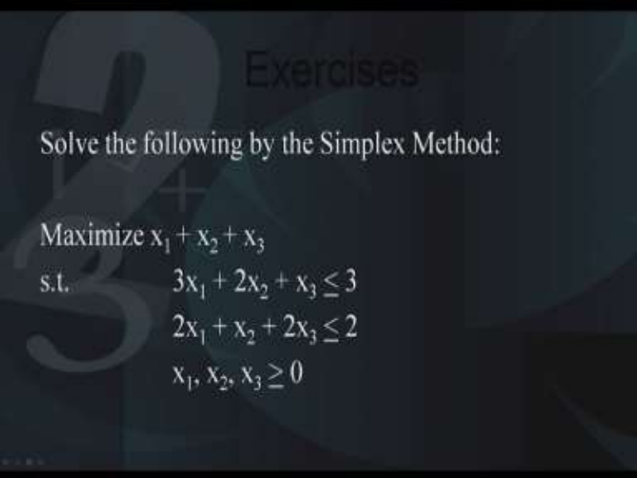

The second exercise is I want you to solve the following LPP by the simplex method. The problem is maximize x1 + x2 + x3 subject to 3x1 + 2x2 + x3 <u>< 3, 2x1 + x2 + 2x3 < 2 and all the</u> three variables x1, x2, x3 <u>></u> 0. Let me give you a hint. All you need to do is add a slack variable in each of the two constraints and proceed, you will get an initial BFS, keep on applying the simplex procedure rules and stop when the stopping criteria is satisfied. Thank you. 

