# **Operations Research Prof. Kusum Deep Department of Mathematics Indian Institute of Technology – Roorkee** 

# **Lecture - 06 Big M Method** 

Good morning dear students. Today, we are going to look at linear programming module lecture number 6. The title of today's lecture is the Big M method. Continuing our discussion on how to solve a general linear programming problem last time we studied the simplex method. Today, we will be talking about the Big M method. This is a system method of the simplex method and is applied to linear programming problems which have a slightly different kind of a situation. So, let us see how this method works. 

**(Refer Slide Time: 01:25)** 

The title the outline of this talk is as follows, we will be studying at LPP with <u>> constraints,</u> then we will talk about the Big M method, then we will look at an example and finally some exercises. 

**(Refer Slide Time: 01:50)** 

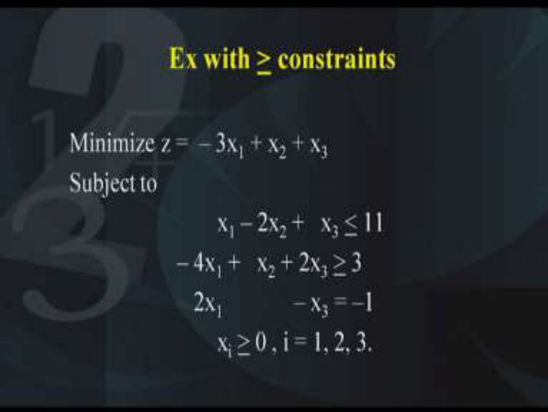

Let us look at this linear programming problem. The problem says we want to minimize a function of three variables as follows – 3x1 + x2 + x3 which is subject to three constraints where the first constraint is of the less than equal to type, the second constraint is of the greater than or equal to type and the third constraint is of the equality type. The first constraint is x1 – 2x2 +   x3 <u>< 11. The second constraint is – 4x1 +   x2 + 2x3 > 3 and the third</u> constraint is 2x1 – x3 = –1. All the xi’s that is x1, x2 and x3 should be > 0. Now what is the way in which we apply the simplex method that we learned last lecture. Yes, we need to convert the given LPP into the LPP in the standard form. What does this mean? It means that the objective function should be converted to the maximization type, all the inequalities should be converted into equality constraints and thirdly all the right-hand quantities of the constraints should be > 0. 

**(Refer Slide Time: 03:55)** 

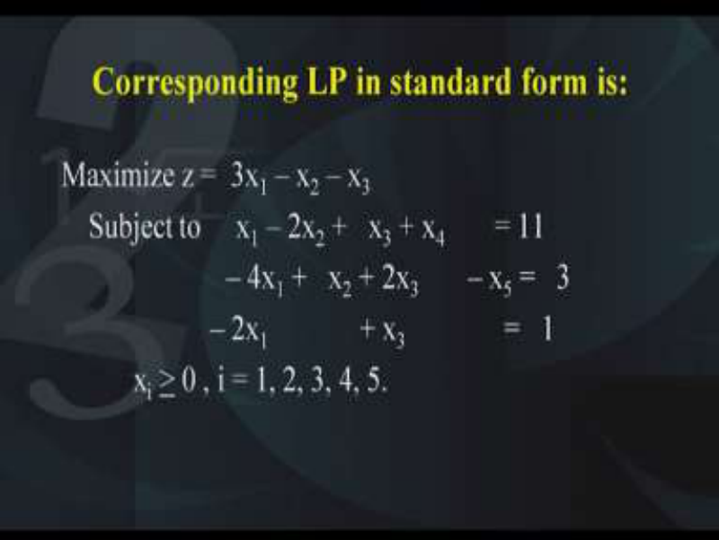

So, let us convert the objective function into the maximization type and for this we will multiply the entire objective function with the negative sign. As a result, we get 3x1 – x2 – x3 , so this is the objective function for the LPP in the standard form. Now the first constraint was of the less than equal to type and therefore in order to convert this inequality into an equality, we need to add a variable which we will call as x4 and what is this x4? This x4 is called as the slack variable. So the original inequality x1 – 2x2 +   x3 <u>< 11 will become x1-</u> 2x2+x3+x4=11 and as you know x4 should be <u>>0. Coming to the second constraint, the</u> second constraint – 4x1 +   x2 + 2x3 <u>> 3 will need to be converted into an equality constraint</u> by subtracting a positive variable and that positive variable is called as the surplus variable. So therefore, we lead to an equation – 4x1 +   x2 + 2x3  – x5 =   3. Please note, x5 should be <u>>0.</u> 

Now you might ask why do not we write x4 in both the equations, no we cannot write x4 in both the equations because the inequalities are different. Both the inequalities, the first inequality and the second inequality are totally different inequalities and therefore we need to use different variables and that is what we do. In the first inequality, we add a slack variable which is called as x4 in our case. And similarly in the second inequality, we subtract a positive variable which is called as the surplus variable. So –x5 has to be subtracted from the equation. 

Now coming to the third equation, in the given problem, we have got twice x1-x3=-1. Although, it is an equality it is fine but the trouble is that the right-hand side is not positive. So therefore, we need to convert the third equation in a form where the right-hand side is positive. Therefore, we will convert this equation like this -2x1+x3=1 and x1, x2, x3 were already <u>>0. On the other hand, the two new variables that we have introduced x4 and x5, they</u> also have to be <u>>0. So therefore, we have converted our given LPP into the LPP in the</u> standard form. 

**(Refer Slide Time: 08:09)** 

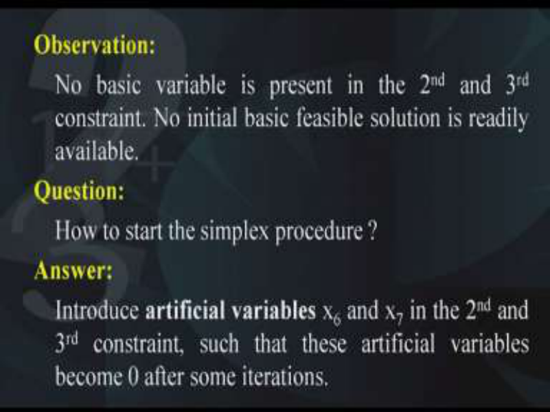

So we have a question before us, how to start the simplex procedure because we do not have an initial BFS and the answer to this question lies by introducing artificial variables in those equations which do not have a basic variable and we will introduce one artificial variable in the second equation. Let us call it x6, similarly we will introduce another artificial variable in the third equation, we will call it x7. So the artificial variables x6 and x7 will be added to the second and the third equations. However, we have to make sure that these variables should be <u>>0 and when we apply the simplex method at some iteration or the other, these artificial</u> variables should be reduced to 0 and how can they be reduced to 0, they can be reduced to 0 by throwing them away from the basis and that is what we are going to do. **(Refer Slide Time: 09:41)** 

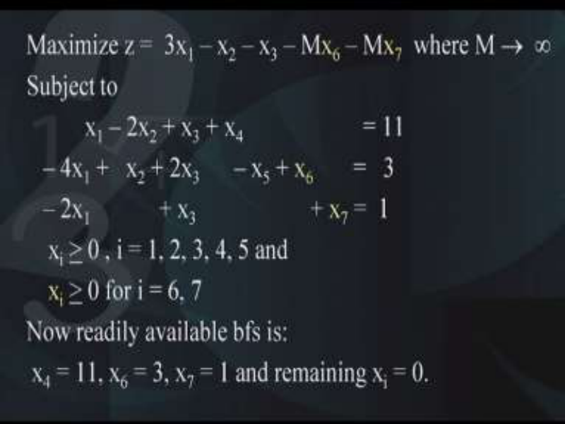

So therefore, our given problem becomes the following. Maximize 3x1 – x2 – x3 – Mx6 – Mx7, where M is a very large number going to infinity. What is the reason behind introducing 

these two terms in the objective function? Because as I said, these artificial variables x6 and x7 are in the beginning of the simplex calculations, they are non-zero that is they are in the basis. Because what is the BFS in this system of equations, the initial BFS is x4=11, x6=3 and x7=1, all others 0. But we do not want x6 and x7. Therefore, in order to reduce them to 0, we will need to make some modifications in the objective function and what are those modifications? We will multiply these artificial variables with a very large quantity with a negative sign. And since we are going to maximize the objective function, therefore they will be pulled to 0. That is the reason why we need to add two terms -Mx6 and -Mx7 into the objective function. Now you will observe the first equation is as it is x1 – 2x2 + x3 + x4 = 11, the second equation    – 4x1 +   x2 + 2x3 – x5 + x6  =   3. Here as you remember x5 is the surplus variable whereas x6 is the artificial variable which was originally not present in the problem but we had to introduce x6 because we did not have an initial basic variable in the second equation. 

Similarly, in the third equation, it becomes – 2x1 + x3  + x7 =  1. Again, x7 is an artificial variable because it was not present earlier and we did not have an initial basic variable in the third equation. Of course, all the variables xi’s from i=1, 2, 3, 4, 5, 6 and 7 should be >0 and once we get this model, now a readily available BFS is there and what is that BFS, x4=11, x6=3 and x7=1. 

This is a canonical system and we have got initial BFS to start the simplex procedure. Of course, we have to incorporate these modifications into the objective function to take care of these artificial variables so that at some iteration of the simplex method, they are reduced to 0. 

**(Refer Slide Time: 13:58)** 

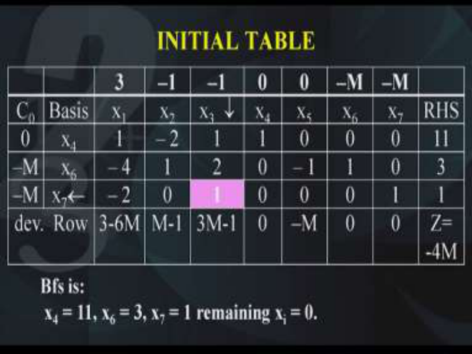

So let us now write down the initial table of the simplex procedure. As you can remember, the second column is the basis column, so we have x4, x6 and x7 as the basis and we write down x1, x2, x3, x4, x5, x6 and x7. Under these columns, we write down the coefficients that are given in the problem. So I want everybody to write down these values. Here you find the coefficients of x1 are 1, -4, -2. 

Similarly, the coefficients of x2 are -2, 1 and 0. Similarly, under x3 we have 1, 2 and 1. So under x3 write 1, 2 and 1. Now x4 is the basis, so therefore x4 is the basis, its coefficients are 1, 0 and 0. Similarly, the coefficients of x5 are 0, -1, 0. So under x5 we write 0, -1, 0. Again x6 is the basic variable, so therefore it will have coefficients 0, 1, 0. Here x6 is 0, 1, 0 and similarly x7 is 0, 0, 1. 

In the last column, we will write the right-hand side of the problem that is 11, 3 and 1. On the first column, we need to write the coefficients of the basic variables in the objective function. So what are the coefficients of objective function? The coefficients of the objective function are 3, -1, -1. So this will be written on the topmost line, so here they are 3, -1, -1. 

x4 and x5 do not appear in the objective function. Therefore, their coefficients are 0; however, x6 and x7 they appear in the objective function with a coefficient –M, therefore the coefficient of x6 and x7 are -M in each case. In the first column, we need to repeat these values of the coefficients of the basic variables which appear in the objective function. So the coefficient of x4 is 0, the coefficient of x6 is –M, coefficient of x7 is –M. 

Next, we need to look at how we should apply the next iteration and as you remember; we need to calculate the deviation rows. So how are the deviation rows calculated? They are 

calculated for each variable by subtracting the product of the C0 vector with the column x1 vector and subtracted from the coefficient of x1 in the objective function. 

**(Refer Slide Time: 18:01)** 

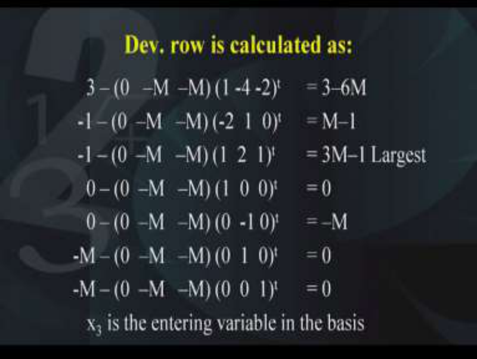

Therefore, what will be the first one, the first one will be 3 – (0   –M  –M) (1 -4 -2)t . Now if you multiply (0 -M –M) with (1 -4 -2)t and subtract it from 3, you will get 3-6M. Please check, you should get 3-6M. Similarly, so this 3-6M we will write over here in the first entry below the x1 column, so 3-6M. 

Next, we will again calculate the second entry and what is the second entry?  -1 – (0  –M   – M) (-2  1  0)t and the answer that you get is M-1. And this M-1 will come at the place in the deviation rows under the x2 variable column. Similarly, for the x3 we have  -1 – (0  –M   –M) (1  2  1)t and that gives us 3M-1. So this value comes under the x3 column 3M-1. The fourth entry is 0 – (0  –M   –M) (1  0  0)t which comes out to be 0 and this is written under the x4 column. Next, the x5 entry, this is 0 – (0  –M   –M) (0  -1 0)t which comes out to be –M. It will be written under x5. Similarly, for x6 and x7 we have the entries as 0. Therefore, our deviation row is completed and what is the criteria for deciding which variable should enter into the basis, we did it in the last lecture, yes the criteria is to look at each of these entries in the deviation row and determine the largest of them. What do we find? We find that 3M-1 is the largest entry in the deviations row. Therefore, this indicates that 3M-1, the variable corresponding to 3M-1 that is x3 should be the entering variable. So here is our decision x3 should be the entering variable in the basis. Now we have decided x3 should enter the basis. **(Refer Slide Time: 21:56)** 

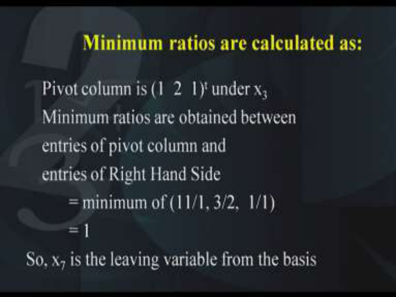

Now we want to see which variable should leave the basis and what is the method for determining that? Yes, the method is to find out the minimum ratios. So the minimum ratios are calculated as follows. Now the pivot column is 1 2 1. Why 1 2 1? Because it is under the x3 column, look at this under the x3 column, this is the pivot column 1 2 1 under x3. So we need to perform the minimum ratios between the right-hand side and the pivot column and what are the minimum ratios? The minimum ratios are 11/1, 3/2 and 1/1 and which one of them is the minimum, 1 that is the last entry. Therefore, what does this indicate, this indicates that x7 is the variable which should leave the basis because the minimum ratio corresponding to x7 is indicating that it should leave the basis. Therefore, this indicates that the entry which is highlighted in the pink cell that is 1 that is the pivot. So 1 is the pivot indicating that x3 should enter the basis, x7 should leave the basis and in order to perform iteration, we need to apply the elementary row operations in such a way that this pivot column now becomes 0 0 and 1. **(Refer Slide Time: 24:09)** 

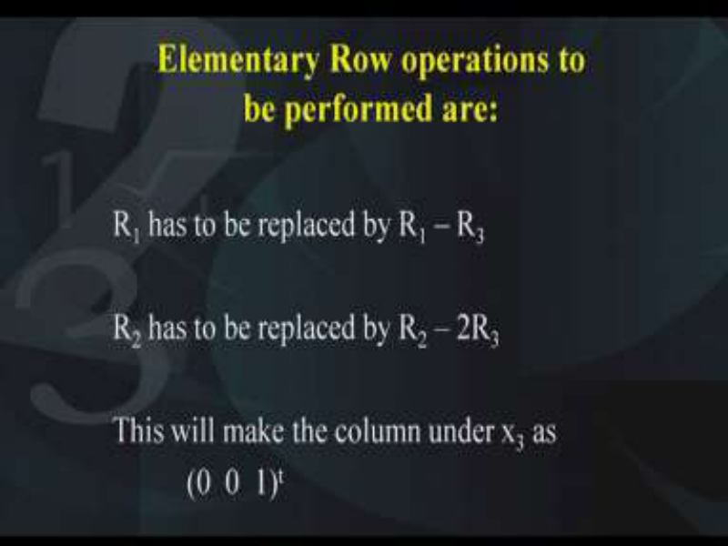

So what are the pivot operations that we need to perform? The elementary row operations to be performed should be R1 has to be replaced by R1-R3 that is this operation has to be applied into the entire R1, all the entries of R1. Similarly, R2 has to be replaced by R2-2R3 and what will happen, this will make the pivot column as 0 0 and 1 under the x3 variable. So the column corresponding to the x3 variable becomes 0 0 and 1. **(Refer Slide Time: 25:05)** 

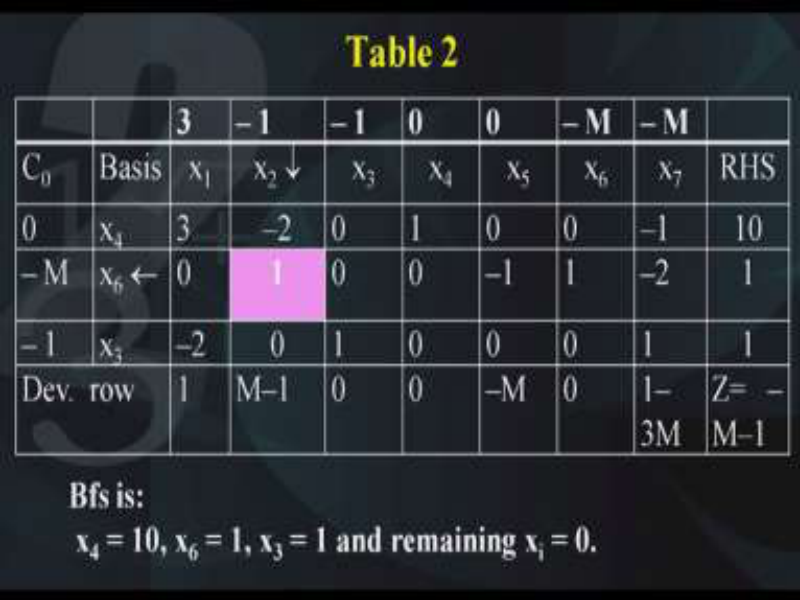

And that is what we wanted because x3 has now entered the basis and the resulting table looks like this. So here you can see, under the x3 column we have entries 0 0 and 1. So that completes our first iteration. Again, we need to repeat this procedure and since we now have the new basis according to the criteria, the corresponding entries of the coefficients of the objective function will be introduced into the basis. 

And similarly the left-hand side, the first column will become 0 -M and -1. Why is –M? Because here we have in the coefficients of the objective function 0 –M and -1. You must make this change in the C0 column. Otherwise, the calculations will become wrong. **(Refer Slide Time: 26:15)** 

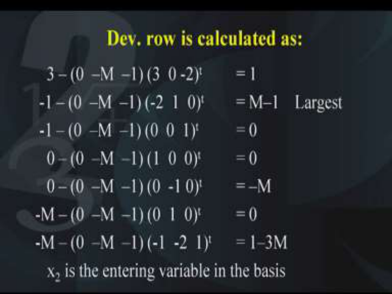

Therefore, now we need to repeat the process, obtain the deviation rows as before. So the deviation rows become as follows; 3- (0 –M -1)*(3 0 -2)t which comes out to be 1. Similarly, the second entry -1- (0 -M -1)*(-2 1 0)t which comes out to be M-1 and the third entry is -1-( 0 -M -1)* (0 0 1)t which comes out to be 0. Next one is 0- (0 -M -1)*(1 0 0)t which again comes to be 0. Next one is 0- (0 -M -1)*(0 -1 0)t which comes out to be –M; -M- (0 -M - 1)*(0 1 0)t which comes out to be 0 and the last one is –M- (0 -M -1)*(-1 -2 1)t which comes out to be 1-3M. All these entries will be recorded in the last row of the table number 2 and you can see 1 M-1 0 0 -M 0 1-3M. These are all the entries which we have obtained after calculating the deviations and as before what is the criteria for deciding which variable should enter the basis? 

Yes, we need to look at the largest of these entries and which one is the largest? The largest is M-1; it corresponds to the variable x2. Therefore, our decision becomes that x2 should enter into the basis. So x2 is the entering variable in the basis. Therefore, this is the pivot column x2; the column under x2 is the pivot column. 

Next, we need to decide which variable should leave the basis. For this, we need to perform the minimum ratio test between the right-hand side and the pivot column. 

**(Refer Slide Time: 29:34)** 

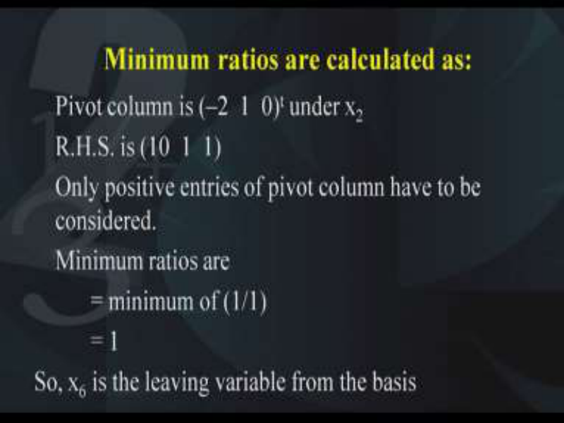

So how do we perform that? The pivot column is -2 1 and 0 and the right-hand side is 10 1 and 1. Please note that the minimum ratios have to be performed only for the entries in the pivot column which are>0. The negative ones have to be ignored. So here only one positive entry is available in the pivot column. Therefore, we have only one minimum ratio that is 1/1, rest of the two are not to be included in the minimum ratio test because they are either negative or they are 0. So we have no choice and we find that the leaving variable is x6. So x6 is the leaving variable and therefore x6 will leave this basis. Therefore, what do we find, we find that the entry marked in the pink cell that is 1, this becomes the pivot and this is the pivot and therefore in the next iteration we need to convert this pivot column as 0 1 0 that is how we will make sure that x2 is in the basis. Now you will observe that fortunately only the first entry that is -2 has to be converted. So we need to apply the elementary row operations in such a way that this column under x2 variable becomes 0 1 0. So what are those elementary row operations? 

**(Refer Slide Time: 31:34)** 

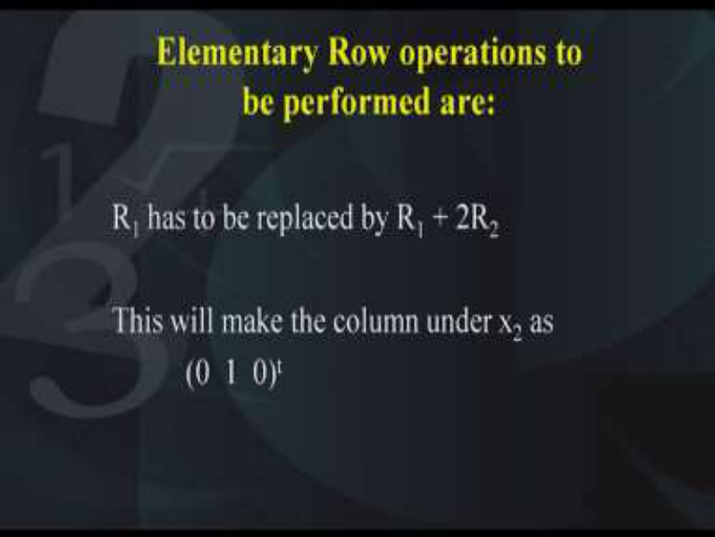

The elementary row operation is only one that has to be performed and that is R1 should be replaced by R1+2R2 and once this is done, the resulting column will become 0 1 0 and that completes our second iteration. 

**(Refer Slide Time: 31:57)** 

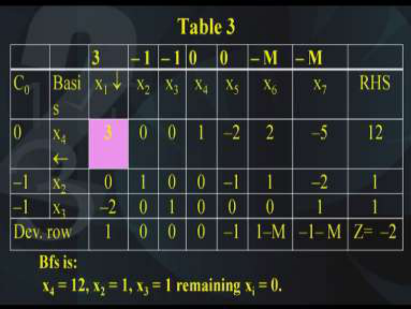

So the third table looks like this. We have applied the elementary row operations on the first row and therefore again what is the BFS here, the BFS is x4=12, x2=1, x3=1 and remaining 0s, i.e, all other variables 0s. So again we repeat the process, we obtain the deviation rows as before and before we do that we need to make the necessary changes in the C0 column because now the basis has changed. The coefficient of x4 is 0, the coefficient of x2 is -1, the coefficient of x3 is also -1. Now you will observe now both the artificial variables x6 and x7 have been removed from the basis and that is what we wanted you remember. We do not 

want any artificial variable in the basis and that is what we have got over here in this table. So as before, we will calculate the deviations. 

**(Refer Slide Time: 33:24)** 

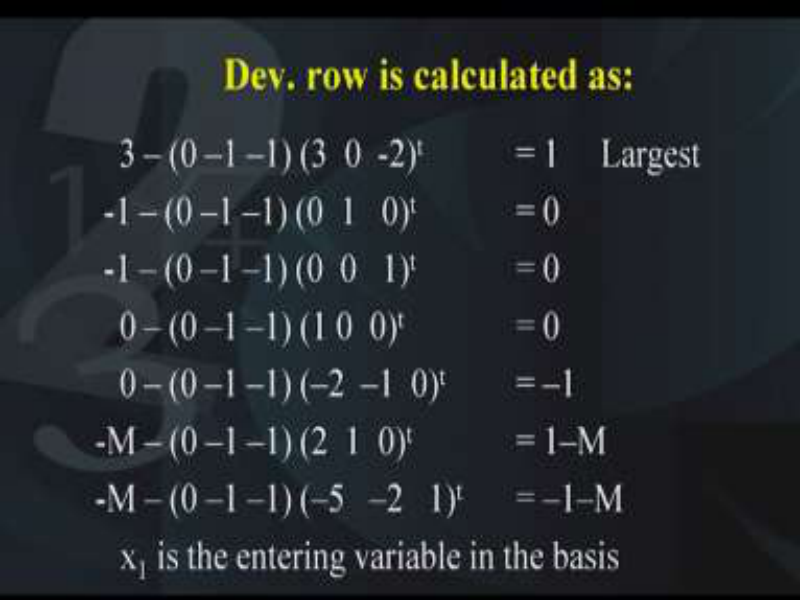

What are the deviations? 3- (0 -1 -1)(3 0 -2)t which comes to be 1, second one is -1- (0 -1 - 1)*(0 1 0)t which comes out to be 0, third one is -1-(0 -1 -1)(0 0 1)t which comes out to be 0. Next one is 0- (0 -1 -1)(1 0 0)t which again comes out to be 0. Next one is 0-(0 -1 -1)*(-2 -1 0)t which comes to be -1. Next one is –M-(0 -1 -1)(2 1 0)t which comes out to be 1-M and the last one is –M-(0 -1 -1)(-5 -2 1)t which comes out to be -1-M. These entries we will record in the last row that is the deviation row of table number 3 and what is the criteria for deciding the entering variable? The criteria is to determine the largest entry in this deviation row and we find that the largest entry is the first one 1, rest of them are all negative. So therefore, largest entry is in the first one indicates that x1 should enter into the basis and the pivot column becomes 3 0 -2. 

The next step is to determine which variable should leave the basis and what do we find? We need to determine the minimum ratio between the right-hand side and the pivot column. So what are those? 

**(Refer Slide Time: 36:08)** 

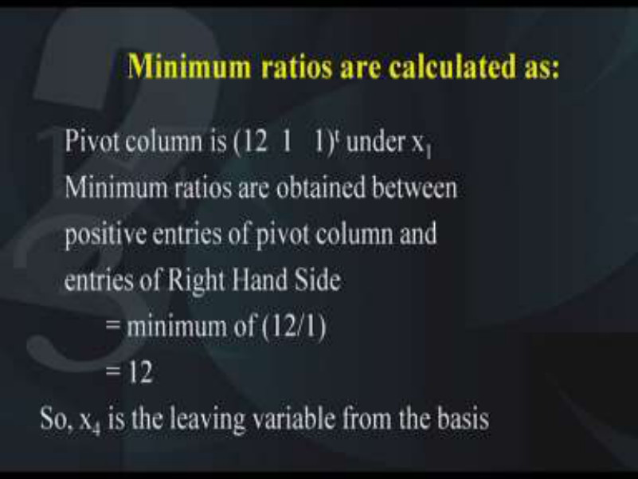

The pivot column is the right-hand side is 12 1 1 and the minimum ratios are obtained between the positive entries of the pivot column and the entries of the right-hand side. So therefore, minimum ratios are there is only one, 12 and 1 because you find that here second entry should not be considered because it is 0, third entry should not be considered because it is -2, we need to look at only the first one. So the first one is 12/3, so therefore the first variable x4 should be the leaving variable and now we need to apply the elementary row operations in such a way that this column becomes 1 0 and 0. So what are the elementary row operations that we perform? 

**(Refer Slide Time: 37:20)** 

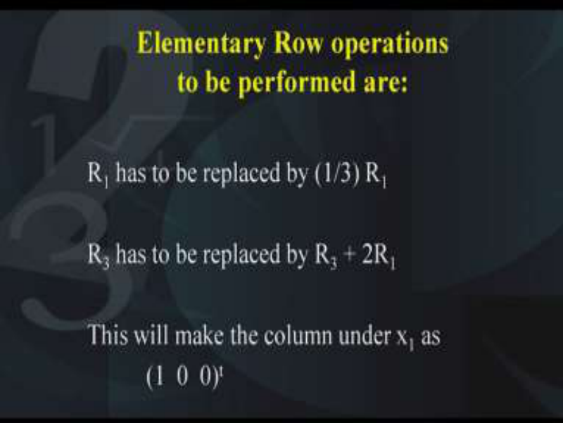

Yes, we perform these elementary row operations. R1 has to be replaced by 1/3 R1. Similarly, R3 has to be replaced by R3+2R1 and this will make our pivot column 1 0 and 0. **(Refer Slide Time: 37:45)** 

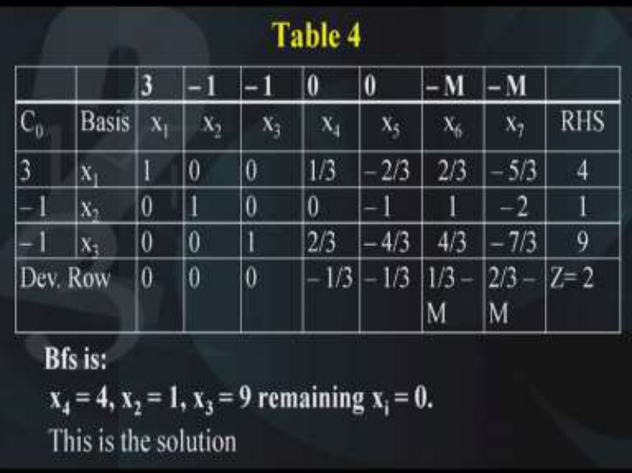

As a result, we will get the table number 4 and in the table number 4, you find that when you calculate the BFS, the BFS obtained is x4=4, x2=1, x3=9 and remaining all as 0. So we will look at how we can calculate the deviation rows and the deviation rows are calculated as before. I have just recorded them here in the last row. Please check these entries and you will find that all the entries in the deviation row are either 0 or negative. 

This indicates that the simplex procedure is supposed to stop and the solution is the current BFS. So the current BFS is the solution and the current BFS is nothing but x4=4, x2=1, x3=9 and remaining 0 and that is the solution to the problem. 

So therefore what did we find? We find that in the Big M Method, we take care of those inequalities which are of the greater than or equal to type. Because in the greater than equal to type constraints, we have to subtract a surplus variable and because we are subtracting a surplus variable, we do not have a basic variable in that equation. Therefore, we need to add an artificial variable and because we are adding an artificial variable we need to make some adjustments in the objective function in such a way that at some later iteration those artificial variables will disappear from the basis. 

Ultimately, we find that is what happens. Here as you see in this example also, the two artificial variables x6 and x7 are 0, they are no longer in the basis and they are 0. So therefore, our objective is satisfied and that is how the greater than equal to constraint is taken care of. **(Refer Slide Time: 40:16)** 

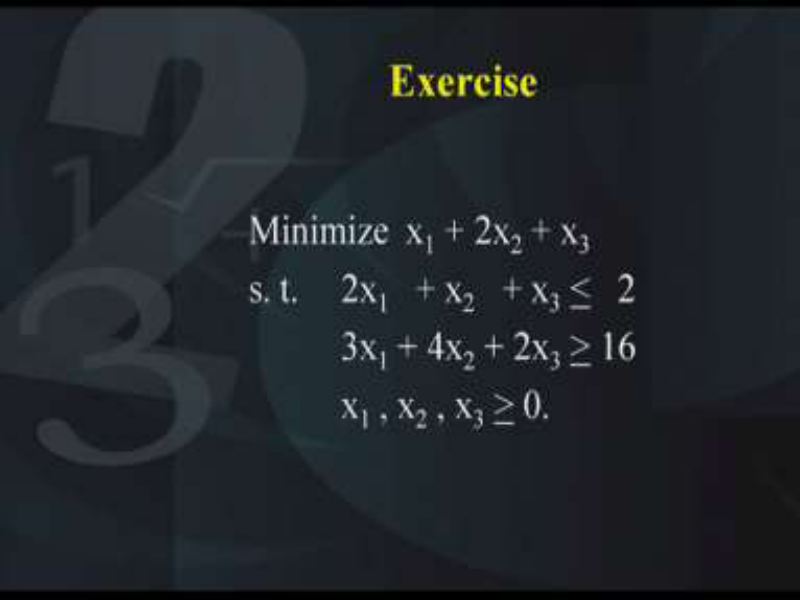

Now I hope everybody has understood the basic principle behind the Big M Method. As an exercise, I want you to solve this question. It is again you have two constraints, one constraint is of the less than equal to type and the second constraint is of the greater than equal to type. So in the first constraint you will add a slack variable, in the second constraint you will subtract a surplus variable and you will get a basic variable in the first equation but you will not get a basic variable in the second equation. For that reason, you will need to introduce an artificial variable in the second equation. Accordingly, you will have to make adjustments in the objective function. So please write down this question, minimize x1 + 2x2 + x3  subject to 2x1   + x2   + x3 <u><   2 and the second constraint is 3x1 + 4x2 + 2x3 > 16  and all x1, x2, x3 >0. I</u> hope everybody will be able to do this question, it is very simple and it is based on what we have discussed today. 

**(Refer Slide Time: 41:45)** 

Now after you have done this exercise, I want you to give a thought to what happens if in the simplex calculations how can you recognize the following conditions; that is the LPP has a unique solution, the LPP has a multiple solution, the LPP has an infeasible solution and the LPP has a unbounded solution. Remember all these cases we had discussed when we were studying the graphical method. But the graphical method is only for a two variable problem; however, in the simplex method and the Big M Method, we can solve an LPP in any number of variables. So how to identify in the simplex calculation all these four situations needs to be known. So please try to think about how you can find out the conditions in the simplex method for looking at these four conditions. Thank you. 

