# **Operations Research Prof. Kusum Deep Department of Mathematics Indian Institute of Technology - Roorkee** 

# **Lecture  – 07 Two Phase** 

Good morning students this is the 7th lecture on the series linear programming. The title of todays lecture is the two phase method. The two phase method is an alternative method for taking care of the artificial variables in a linear programming problem. 

# **(Refer Slide Time: 00:53)** 

The outline of todays talk is as follows we will learn the two phase method which is an alternative to the big M method that we studied in the previous lecture that is the two phase method can take care of the constraints which are of the type >. So we will study the working of the two phase method. We will also look at the similarities and with the help of the exercises and examples what is the difference between the big M and the two phase method. 

We will look at some example and then some exercises. 

# **(Refer Slide Time: 01:45)** 

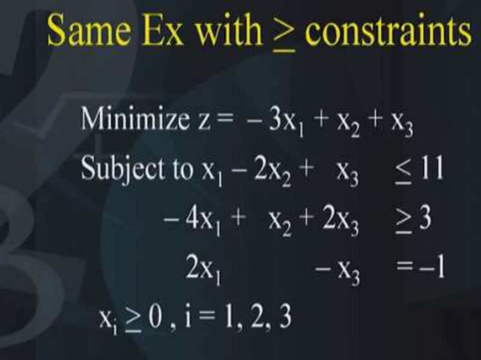

So let us look at the same example that we studied during the previous lecture so that we can make a comparison between the calculations of the big M method and the two phase method. So our problem is to minimise this three variable problem. Please write down this problem minimize z =  – 3x1 + x2 + x3 subject to x1 – 2x2 +   x3 <u>< 11 and the 2nd constraint is  – 4x1 +</u> x2 + 2x3 <u>> 3. The 3rd constraint is 2x1 – x3 = –1and all the three variables x1, x2 and x3 should</u> be > 0.  So this is a same example as we had done in the previous lecture. **(Refer Slide Time: 03:08)** 

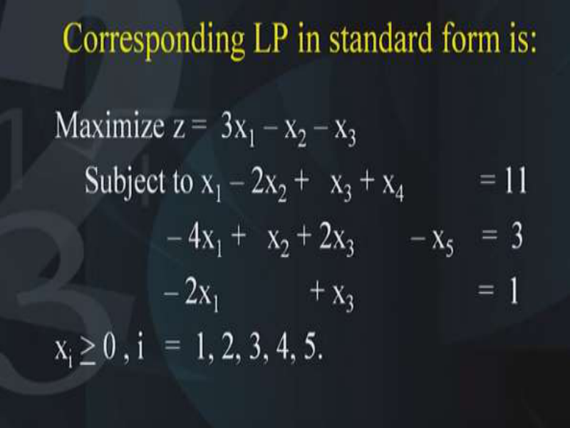

Now as you know in order to solve this problem we have to convert it into the LP in the standard form. And what are the requirements for an LP into the standard form? Yes the objective function should be of the maximization type. So the objective function will become 

3x1 – x2 – x3 because in the given problem it was of the minimization type. So we have to multiply it with the negative sign in order to make it into a maximization problem. Now let us look at each of the constraints one by one. Since the 1st constraint was of the type < = so we how to add a slack variable and we will call that slack variable as x4. So the equation becomes x1 – 2x2 + x3 + x4 = 11. In this equation x4 is a slack variable now coming to the 2nd constraint since it was of the <u>></u> type therefore we have to subtract a surplus variable and the equation becomes – 4x1 +   x2 + 2x3 – x5  = 3. The 3rd constraint – 2x1 + x3= 1. Now as you remember the LP in the standard form must have the right hand side should be <u>> 0. But in the given</u> problem the 3rd constraint was having -1 in the right hand side which is actually not allowed. Therefore we have to multiply the entire equation entire 3rd equation in with the negative sign so that the right hand side becomes positive. Now the slack and the surplus variables have also to be <u>></u> 0. Now the problem is we do not have a BFS to begin our algorithm to begin our simplex method. 

**(Refer Slide Time: 05:50)** 

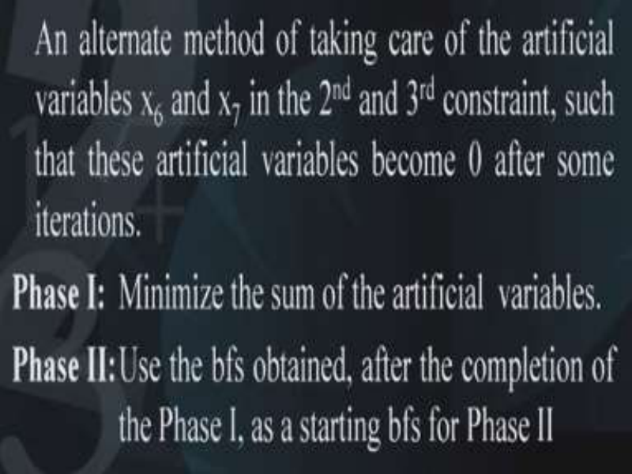

So what we need to do is we will look at an alternative method of taking care of the artificial variables x6 and x7 in the 2nd and the 3rd constraints. Such that these artificial variables become 0 they vanish and for this we will employ two phases. Let us try to understand what is the objective of the 1st phase and similarly what is the objective of the 2nd phase. So what we will do in the 1st phase. We will set aside the original objective function we will set us aside and we will ignore it at the moment temporarily and we will replace the objective function with another 

objective function and that new objective function is nothing but the sum of the artificial variables. So the artificial variables since they have to be made 0 somehow or the other. So therefore what we will do is we will minimize the sum of the artificial variables. 

What will happen is when the solution of the 1st phase is obtained then that means that all the artificial variables have become 0 and that is what we want. We want that all the artificial variables should reduce to 0. Please note that this is possible only if all the artificial variables are > 0 because if they are not >0 then the minimization will go something towards the negative which is not allowed. Therefore we have to make sure that the artificial variables are <u>> 0 and</u> they are some has to be minimized. This will ensure that at the end of the phase 1 we will have all the artificial variables becoming 0. Once this phase is completed then we can start the 2nd phase and by bringing back the original objective function into our simplex stable so that by using the BFS which is obtained at the end of the phase 1. 

We can then proceed with the normal way in which the simplest calculations are done. So let us see with our example how this happens. 

**(Refer Slide Time: 08:37)** 

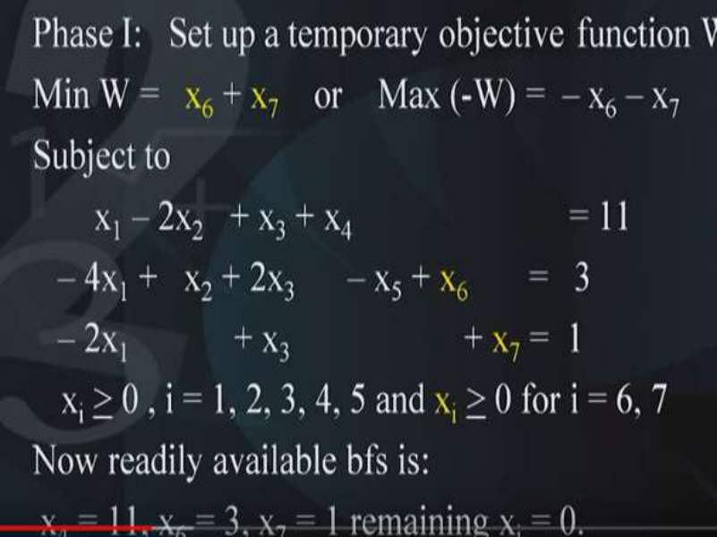

Now as you know that in the phase 1 we will set up a temporary objective function and what is that objective function it is nothing but minimization of the some of the artificial variables. So the artificial variables are x6 and x7 as you know that just in the previous method we have also introduced x6 as an artificial variable in the 2nd equation and x7 in the 3rd equation. So we will 

call this objective function as W. So that we can differentiate between our original objective function which we called as Z. So our new objective function becomes minimization of x6+x7. Now in the 2nd and the 3rd equation we have added the artificial variables. So now we have a readily available BFS and what is that readily available BFS? It is nothing but x4=11 why x4? Because x4 is a basic variable in the 1st equation. 

Similarly the artificial variable x6 is basic variable in the 2nd equation. So x6 = 3 and similarly in the 3rd equation x7= 1 because x6 and x7 are particularly have been purposely introduced so that they can take care of the initial BFS which we want for our simplest calculations to work. So we will solve this with the help of the simplex method but before we do that we need to convert the objective function into the maximisation form. For that we will convert the objective function as -W=-x6-x7 , so I hope you have understood we have got phase 1 where the objective function is the sum of the artificial variables and we have a BFS which is nothing but x4 = 11 x6=3 x7=1 and all other variables as 0. 

**(Refer Slide Time: 11:09)** 

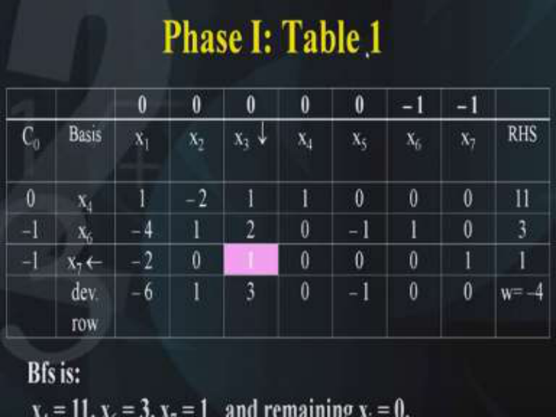

So let us tabulate all this information into the table 1 of the first phase. So phase 1 table 1 here you will find what we have done is we have under the basis column we have written the basic variables. So what are the basic variables as I just mentioned they are nothing but x4 x6 and x7 and in the each of the columns under the variables x1 we write down the coefficients of x1 similarly under the column x2 we write down the coefficients of x2. Similarly x3 we write down to coefficients of x3 x4 x5 x6 and the right  hand side. So till now all the entries are the same as 

that of the big M method however there is a difference in the topmost line you will observe that since the objective function is different now we have set aside the original objective function and we have considered a new objective function which is nothing but the sum of the artificial variables. 

So our objective function -W has coefficients corresponding to x1 x2 x3 x4 x5 and all these are 0. So they have to the corresponding entries in the top line over here this should be 0. So this top line has to be 0 only the entries corresponding to x6 and x7 they will be -1 right. Also you have to make sure that the corresponding entries of the basic variable that is x4 is 0 in the objective function, x6 has to be -1 and x7 has to be -1. So like this we have prepared the table number 1 of the first phase. We can see that the basic feasible solution for the first table is x4=11 x6=3 x7=1 and all remaining 0. So next what we need to do is we need to start our simplex calculation by computing the deviation rows and how do you compute the deviation rows you have to subtract 0 minus this vector multiplied by this vector. 

**(Refer Slide Time: 14:09)** 

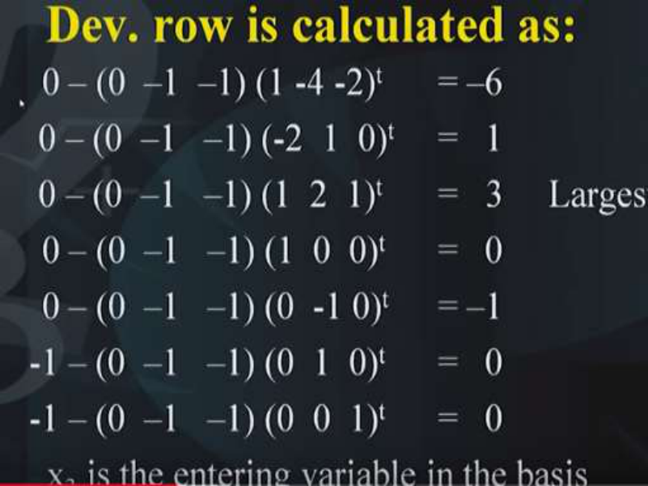

Let us see how this is done here they are. These are the calculations for obtaining the deviation rows you will see 0-(0-1-1) (1-4 2)t , So the corresponding entry becomes -6 and that is what we have written over here. So this first entry is -6 similarly the 2nd entry is nothing but 0-(0-1-1) (- 2 1 0)t and this comes out to be 1, so this entry is 1 here is this entry 1 and then comes the 3rd entry 0-(0-1-1) (1 2 1)t and this comes out to be 3. 

The next entry is 0 –(0 -1 -1) (1 0 0)t which comes out to be 0. Similarly 0–(0 -1 -1) (0 -1 0)t which comes out to be -1. And then the next entry is -1 –(0 -1 -1) (0 1 0)t =0 and similarly the last entry is -1-(0 -1 -1) (0 0 1)t which comes out to be 0. 

Before I proceed I would like you to make an observation you will find that the entries in this deviation rows corresponding to the basic variables. Just let us look at these entries I mean that now in this table we have x4 as the basic variable. So what is the entry of the basic variable in the deviation rows it is 0. Similarly for x6 because x6 is a basic variable so therefore the entry in the deviation rows corresponding to x6 is also 0 and similarly for x7 the entry in the deviation rows is 0. Now this is not a chance this will always happen that whenever you compute the entries in the deviation rows. There will be 0 corresponding to the basic variable in that particular table therefore all these entries corresponding to x4 x6 and x7 is 0 in the deviation rows. 

So once you computed all these entries next we want to look at the largest of these deviations why we need to do that we need to do that because we want to see which variable should enter into the basis and as you can see out of these deviations the 3rd entry that is the value 3. This is the largest and this indicates that x3 should enter into the basis. So the criteria for entering the basis is largest deviation rows and therefore x3 has to enter the basis. Next comes another decision which you have to make that is we want to find out which variable should leave the basis so what are we going to do? Yes we are going to compute the minimum ratio test. 

**(Refer Slide Time: 18:47)** 

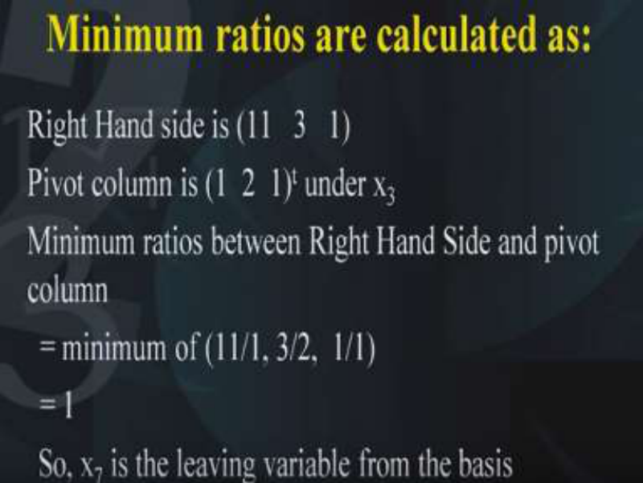

So the minimum ratio tests is obtained that is we will look at the right hand side which is nothing but 11 3 and 1 and similarly we will look and the pivot column which is nothing but 1 2 and 1 and we will look at these ratios the minimum ratios. So what are the ratios 11/1 3/2 and 1/1 and what do you conclude? You conclude that out of this the minimum is 1 and since minimum is 1 this means it is corresponding to the variable x7. Therefore x7 has to leave the basis. So in the first table, we find this self is the pivot and this has to be made 1 and the remaining entries in that column have to be made 0 with the help of the elementary row operations that we studied last time. So that is what we are going to do. 

**(Refer Slide Time: 20:02)** 

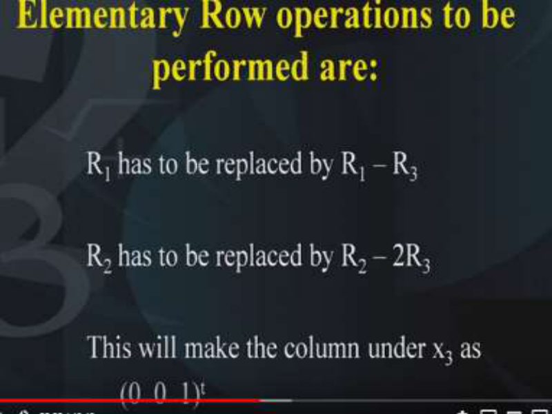

We will perform the elementary row operations like this, that is, the first row R1 has to be replaced by R1-R3 because we have to make this 3rd column as 0 0 1. The last entry 1 is already there so you do not need to do anything only thing is you have to make the first entry as 0 and the 2nd entry as 0. So the first elementary row operation is R1 has to be replaced by R1-R 3 and similarly the 2nd row that is R2 has to be replaced by R2-2R3. Once you apply these elements to operations you will get a column like this 0 0 and 1 and that is what you wanted. 

**(Refer Slide Time: 21:00)** 

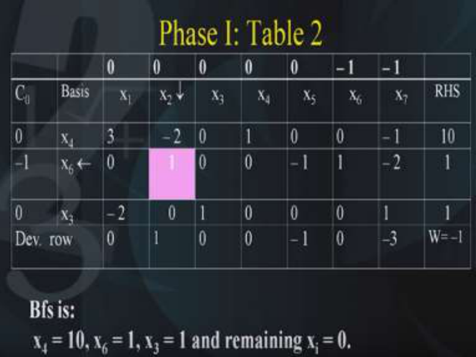

So the resulting table will look like this the 3rd column as you can see is 0 0 1 that completes the first iteration. Now again we will do the same procedure we will repeat and before we repeat that we have to make sure that the entry corresponding to the first column that has to be changed because now x3 has entered into the basis. So here we need to write the corresponding objective function value of x3 and that is 0. So in the first column we will write 0 -1 and 0 the first column is 0 -1 0 and the corresponding BFS becomes x4=10 x6 =1 and x3=1 and remaining 0s. Again as before we will do the calculations for obtaining the deviation rows and what are those calculations? these are the calculations. As before you can see that all those entries which are corresponding to the basic variables that is x4 x6 and x3 automatically they will become 0. **(Refer Slide Time: 22:28)** 

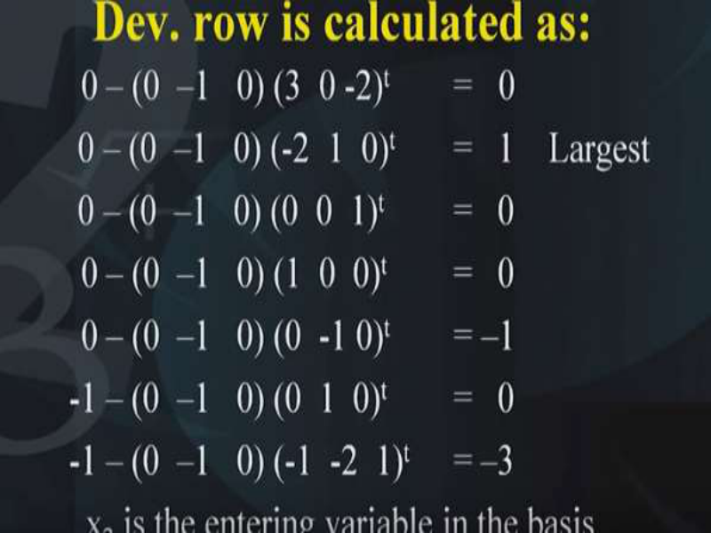

And the remaining entries you have to calculate as before 0 – (0 -1 0)(3 0 -2)t which comes out to be 0 similarly 0-(0-1 0)(-2 1 0)t =1 and similarly 0-(0 -1 0) (0 0 1)t which comes out to be 0 and 0-(0 -1 0)(1 0 0)t which is 0 and similarly the other ones will become -10 and -3. Once all these deviation entries have been calculated then we need to see which one of them is the largest because that is the criteria for making sure that a particular variable is to enter the basis and what do we find? We find that the entry in the 2nd place that is 1 is only the positive 1 and it is the largest. So this indicates that the variable x2 has to enter the basis. **(Refer Slide Time: 23:54)** 

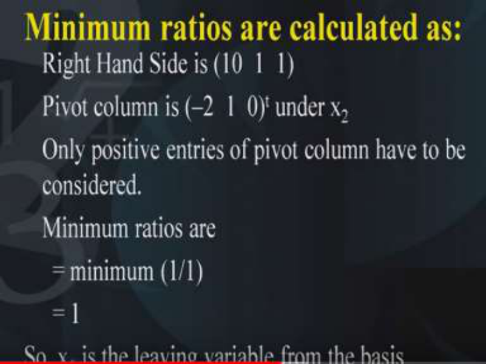

We have to next take a decision regarding the fact that which variable should leave the basis and for this we need to perform the minimum ratio test. The minimum ratio test is the ratios 

between the right hand side which is nothing but 10 1 and 1 and the pivot column which is nothing but -2 1 and 0. Now you will observe that in the pivot column the first entry is -2 and the last entry is 0 now these 2 entries have to be avoided. The minimum ratio test has to be performed only with the positive entries. So in this particular case we are left with only one choice that is the 2nd entry. So the minimum ratio will become 1/ 1 and that is nothing but 1. So there is no other choice in this particular case and automatically this variable corresponding to the 2nd entry that is x6 is the leaving variable and with this decision let us look at this table again here you are. You find that x6 is the variable which should leave the basis and that is the reason why this particular cell is highlighted to indicate that this is the pivot. 

**(Refer Slide Time: 25:33)** 

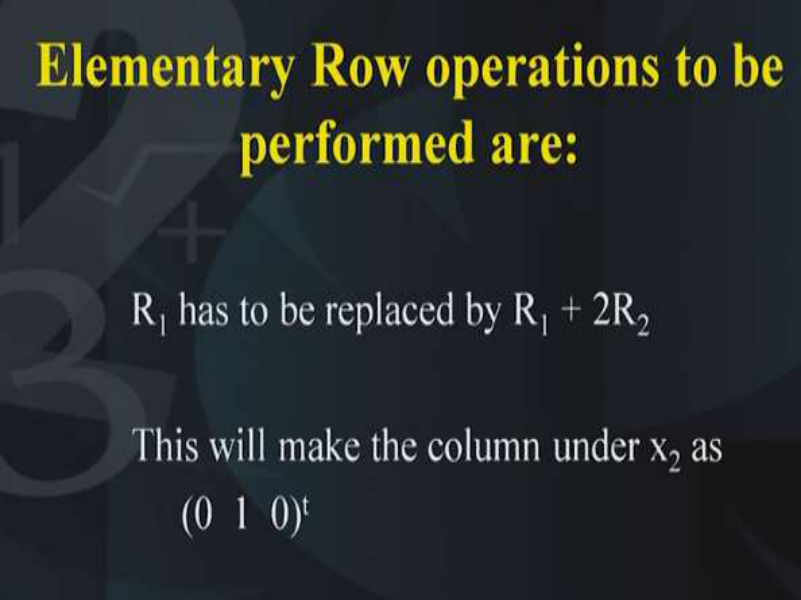

Again we will perform the elementary operations in order to make this pivot as 1 and the other entries as 0s. So what are the elementary row operations you need to perform only one elementary operation that is like that elementary row operation is R1 has to be replaced by R1 + 2R2 and with this suppression our pivot will become 0 1 and 0. 

Please note that the 2nd entry was already 1 so we did not need to do anything about it. The 3rd entry was already 0 so we did not need to do anything about it, only problem was with the first element. So first entry we wanted to make as 0 and that is the reason why we applied this elementary row operation and made this particular pivot column as 0 1 0. **(Refer Slide Time: 26:30)** 

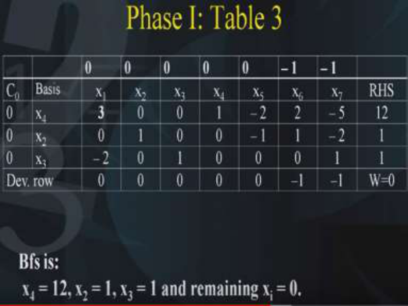

Thus we come to the table 3 of our phase 1 and what do you find? Please note you find that in this table the both the artificial variables are not there. So you have observed that during this table 3 all the artificial variables have disappeared because what is our BFS is  x4 =12 x2=1 and x3=1 and all others are 0 and all other means x6 and x7 also as 0 and that is what we wanted. 

So what is the use of this phase 1 has been achieved remember our objective of applying the phase 1 was to make sure that these artificial variables disappear from the basis and that is what has happened. So phase 1 is complete because the value of the objective function is also becomes 0 and they the artificial variables have disappeared from the basis that is what we wanted. Next we will come to the phase. **(Refer Slide Time: 27:58)** 

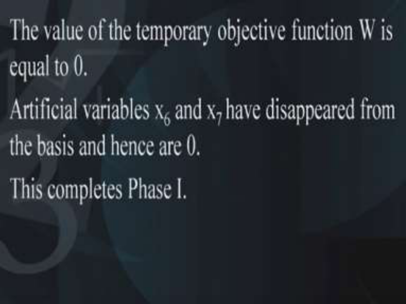

So this is just an explanation the value of temporary objective function has become 0. Artificial variables x6 and x7 have disappeared and this indicates that the phase 1 is complete. **(Refer Slide Time: 28:13)** 

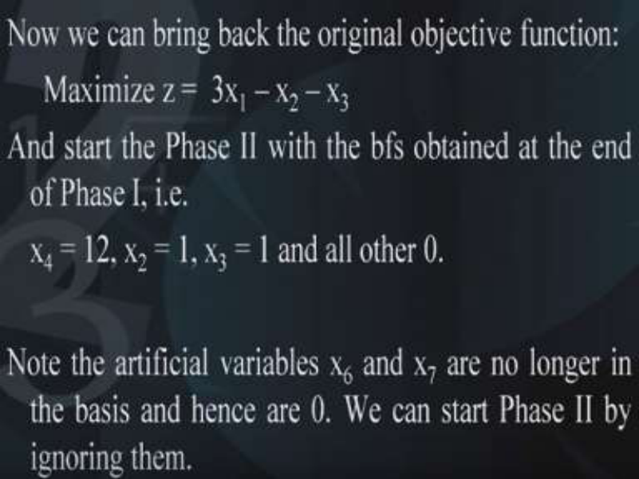

So we can say that now phase 1 is complete and now we can move on to the 2nd phase. So now we can bring back our original objective function which was maximization of  z =  3x1 – x2 – x3 and we can start the phase 2 with the help of the BFS which we have obtained at the end of the phase 1. So at the end of the phase 1 we had this BFS x4 = 12, x2 = 1, x3 = 1 and all other 0. So now we can start the phase 2. 

However before starting the phase 2 we will observe that the artificial variables are x6 and x7 are both 0. So they are not required,,i.e., they are redundant and we do not want them so we can just drop them, we can just ignore them and that will help us in reducing our calculations since they are 0. 

# **(Refer Slide Time: 29:33)** 

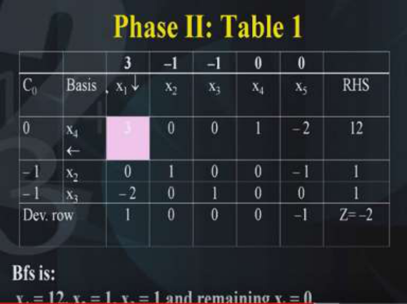

So what are we going to do is we will remove the two columns corresponding to x6 and x7 and therefore our calculations have decreased. To by removing these two columns corresponding to x6 and x7 our calculations have reduced to quite an extent and you will observe that in the top row here in this row we have brought back the coefficients of the original objective function 3x1 -x2 -x3 etc. And the phase 2 table 1 has all these entries as same corresponding to these entries in the columns and the rows all these entries are same what is the difference? the only difference is this top row has the coefficients corresponding to the original objective function as well as these entries  0 -1 and -1 why are these different because they are the entries corresponding to the basic variables in the objective function. Since now we have brought back our original objective function so therefore these entries have also to be changed. The starting BFS is nothing but the same, that is, x4 = 12 x2 = 1 and x3 = 1 and all others 0s. So what we will do is we will again calculate the deviation rows and mind you these initial rows will be different from the deviation rows of the table number 3 of the phase 1 why will they be different? Can you think why will be the different. 

Yes they will be different because they are obtained from the objective function and since our objective function has changed therefore these entries will also change and how are they calculated? 

**(Refer Slide Time: 32:06)** 

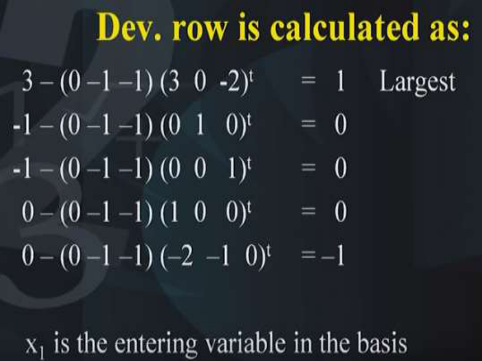

Let us see yes here they are they are calculated as usual 3 – (0 -1 -1) (3 0 -2)t which comes out to be 1. Similarly -1 – (0 -1 -1) (0 1 0)t which is 0 and obviously as I said this is a basic variable. x2 is basic variable x3 is basic variable and x4 is basic variable. So therefore their entries have to become 0 only the non zero entry will be the first one and the last one. And the last one is nothing but 0 – (0 -1 -1)(-2 -1 0)t which comes out to be -1 and this tells us that amongst these deviation entries the entry number 1 the first one that is the largest and this indicates that x1 should be the entering variable at this particular stage. **(Refer Slide Time: 33:23)** 

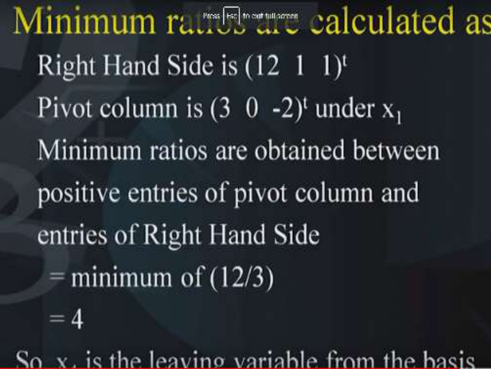

Next comes the minimum ratio test for determining which variable should leave the basis. Now you will observe that the right hand side is 12 1 1 whereas the pivot column is 3 0 -2 and as you know that 0 has to be excluded -2 has to be excluded and therefore what will happen is we are left with only one choice that is the 12/3 and there is no other choice. Therefore this means that x4 is the leaving variable the first entry that is x4 is the leaving variable. **(Refer Slide Time: 34:13)** 

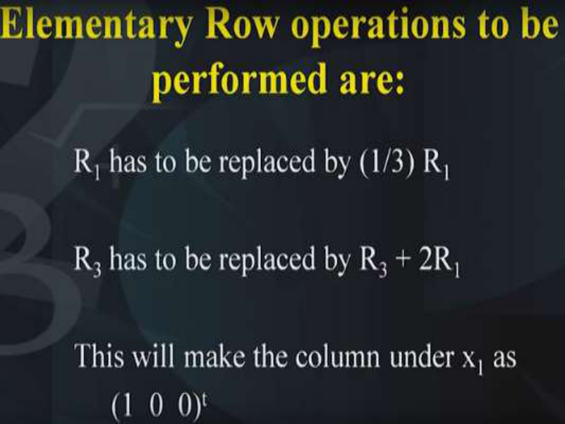

Now we want the first column has to be 1 0 0 therefore accordingly we will apply the elementary rule operations so what are the elementary operations? the first row that is R1 has to be replaced by R1/3 that is it has to be multiplied 1/3 can you tell me why this is so? This is so because the coefficient of this entry is 3 but we want to make it as 1. So in order to make it as 1 

we have to divide the entire row by 3. Similarly the other row operations that is R3, R3 has to be replaced by our R3 + 2R1 this will make it as 0.You will observe that are corresponding to R2 the entry is already 0, so nothing has to be done in our previous table see here the first column over here is 3 0 -2. So 3 has to be made 1 and how will you make it 1 you will divide the entire row by 3. 

So the first entry will become 1, 2nd entry is already 0 you wanted to make it is already 0. So you do not have to do anything about it the 3rd entry is -2 so you have to apply the elementary row operations in such a way that this -2 becomes 0 and that is what we have done. So this means that our pivot column has become 1 0 0 and that is what we wanted. 

**(Refer Slide Time: 36:18)** 

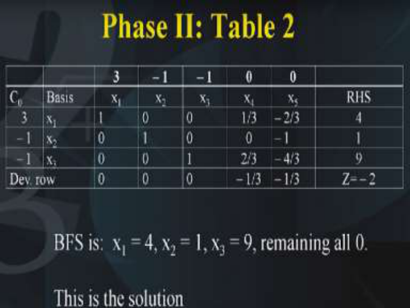

So the resulting table number 2 for the phase 2 looks like this. Now you will observe that in this table as usual we will compute the deviations and the deviations tells us that the first three entries are 0 whereas the 4th and the 5th entries are negative and as you know what is the stopping criteria for the simplex method? Yes the stopping criteria is that all the entries in the deviation roles should either be 0 or should be negative. And that is what is happening here in this particular table all the entries in the deviation rows are either 0 or negative this indicates that the stopping criteria has been achieved and therefore this is the solution to the given linear programming problem and what is the solution? The solution is the current BFS what is the current BFS? x1 = 4, x2 = 1 and x3 =9. 

# **(Refer Slide Time: 37:41)** 

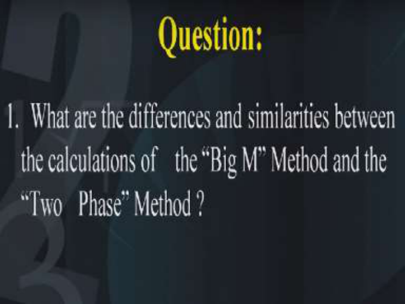

So I hope everybody has understood what is the basic idea behind the Two phase method I have a question for you and the question is what are the differences and the similarities between the big M method and the two phase method during the calculations of the big M method and the Two phase method, do you observe any differences? Do you observe any similarities? and we have to identify what are those differences and similarities. 

So in my next lecture I will reply to this question but at the moment I want you to give it a thought to identify what are the differences and what are the similarities between the big M method and the two phase method. So please think it over compare the calculations of both the methods and see what are the similarities and differences. 

**(Refer Slide Time: 38:50)** 

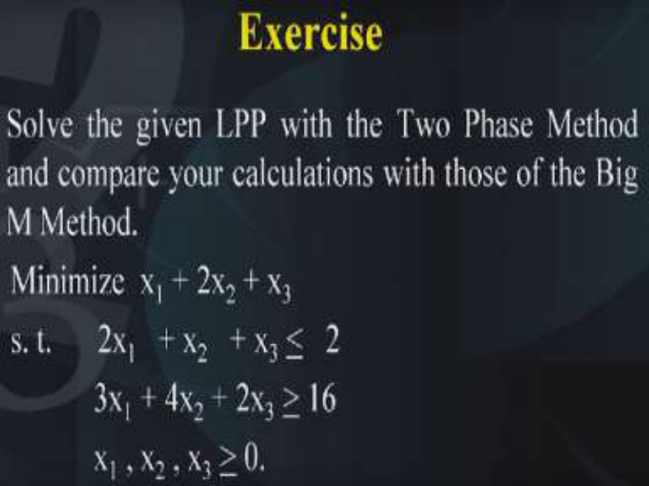

So as an exercise I would like you to solve this, a programming problem. So please solve this problem you can write it down solve the game linear programming problem with the two phase method and also I want you to compare your calculations with a big M method. So the problem is minimization of x1 + 2x2 + x3  and it has two constraints subject to 2x1   + x2   + x3 <u><   2 and</u> similarly 3x1 + 4x2 + 2x3 > 16  and x1, x 2 and x3 have to be > 0. 

So I hope you can do this question with both the methods the big M method as well as the two phase method and keep your calculations side by side put them side by side and see what are the similarities and the differences right. Thank you very much. 

