# **Operations Research Prof. Kusum Deep Department of Mathematics Indian Institute of Technology - Roorkee** 

# **Lecture – 08 Multiple Solutions of LPP** 

Good morning students, this is the lecture number 8 on the series of linear programming. The title of todays lecture is multiple solutions. As you have seen in the previous lectures that there are many possibilities for the solution of a linear programming problem there could be a unique solution there could be multiple solutions there could be unbounded solutions and there could be no solutions. 

So todays lecture is focusing on the case where we have multiple solutions and we will be looking at the comparison between the calculations of the simplex method viz-a-viz with the graphical method. 

**(Refer Slide Time: 01:30)** 

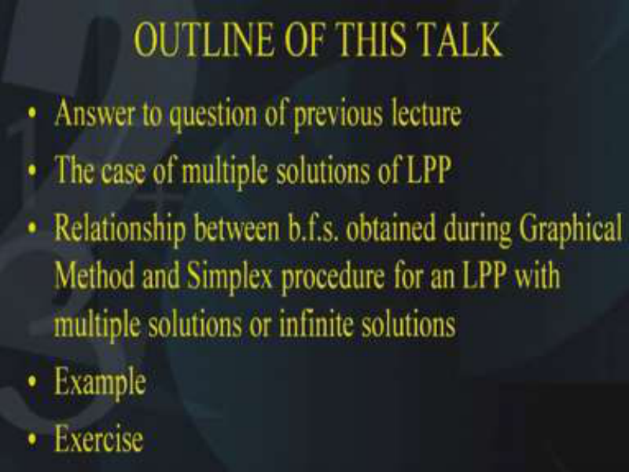

So the outline of todays talk is as follows, firstly, I will answer the question that I had post to you in the lecture number 7 that is the previous lecture and secondly, we will discuss the case of multiple solutions of the linear programming problem then we will look at the relationship between the BFS, that is, the basic feasible solution when we are talking about the calculations of the simplex method viz-a-viz the graphical method. 

And this we will do particularly for the case of the multiple solutions or the alternate solutions. We will do this with the help of an example and finally I will give you an exercise to solve it. **(Refer Slide Time: 02:32)** 

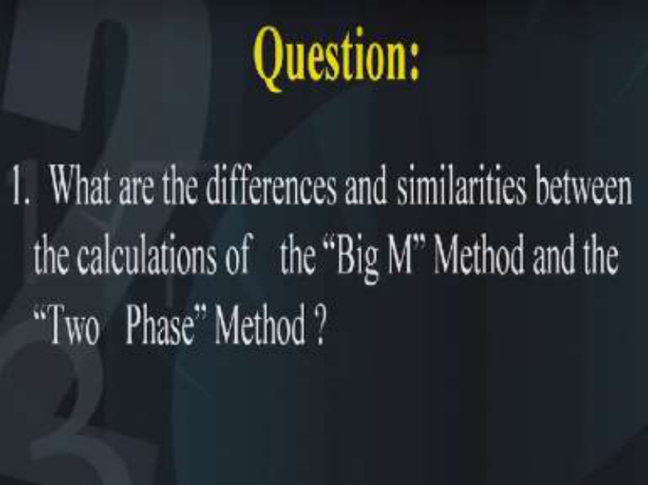

So, if you recall in the previous lecture that is lecture number 7, I had posed a question and the question was what are the differences and the similarities between the calculations of the Big M method and the two phase method for solving a linear programming problem. I am sure you must have tried to answer this question by comparing the calculations of the various iterations or the various tables that you have during the calculations of the big M and the two phase method. **(Refer Slide Time: 03:16)** 

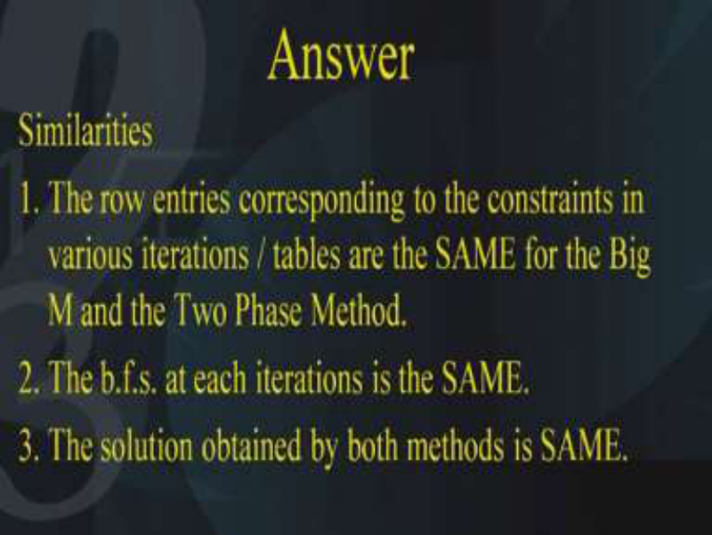

Now the answer lies in the following, first of all let us look at what are the similarities or how they are similar. So, first of all you must have observed that the row entries corresponding to the constraints of the variables. During the iterations or during the tables they are the same for the big M and the two phase method. By this I mean the entries which are in the pivot rows and the pivot columns. Also the other rows and the other columns inside the table, they are the same for each of the iterations for both of the methods that is the first similarity. Next the BFS at each iteration is the same that is the basic feasible solution for each of the iterations in each of the two methods is the same and thirdly the solution obtained by both the methods is same that is no matter which method you are applying the final solution that you obtain should be the same. So these are the similarities between the two methods. 

**(Refer Slide Time: 04:50)** 

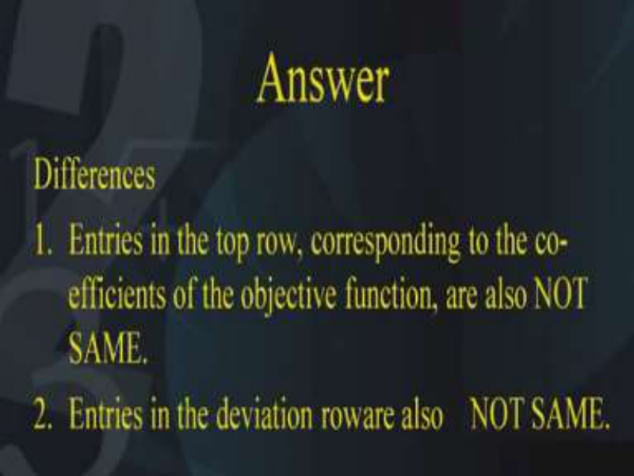

Next let us look at the differences between the two methods. Now first of all you will observe that the entries in the top row that is those entries which are corresponding to the co-efficient of the objective function they are placed on the top row they are not same why is that so, the reason is because in the Big M method you have everything in terms of M and in the two-phase method for the first phase. You put aside the original objective function and replace it with the help of a temporary objective function. Since the objective function has changed therefore the coefficients corresponding to the objective function they have also changed and that is the reason why the first difference is that the entries corresponding to the coefficient of the objective function in the top row they are not same. 

Secondly the entries in the deviation rows they are also not same why they are not same because the entries in the deviation rows they are obtained from the coefficients of the objective function and they are subtracting the vector multiplication of the coefficients of the objective function and the various columns. So therefore these entries are also different so I hope everyone has followed what are the similarities and the differences between the Big M and the two-phase method. 

**(Refer Slide Time: 06:49)** 

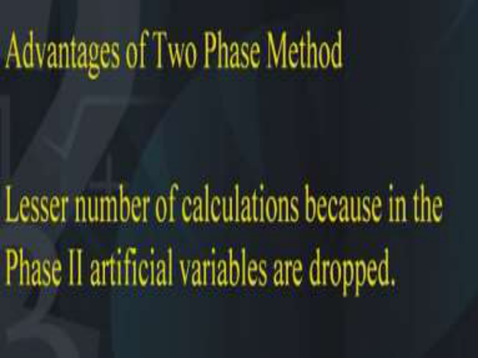

So next, we also want to look at after all what are the advantages of the two-phase method over the Big M method and you will observe that there are lesser number of calculations because in the two-phase method the artificial variable are dropped. As you have seen that the objective of the first phase in the two-phase method is to obtain a readily available BFS and at the end of the phase 1. You will find that the artificial variables have disappeared from the basis and since they have disappeared from the basis, that is, they are 0 therefore in the phase 2, we can drop them and therefore the calculations will be decreased. So that is one of the very good advantage of the two-phase method over the Big M method. **(Refer Slide Time: 07:56)** 

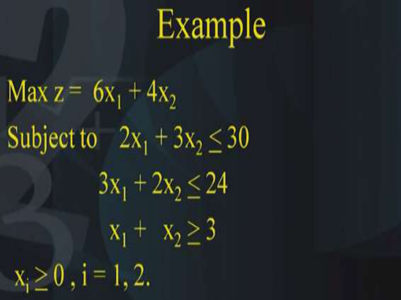

So now let us take an example to understand what happens in the case of a multiple solution in an LP. Now you will observe that in this example we have maximization of 6x1 + 4x2 which is subject to 2x1 + 3x2 <u>< 30, 3x1 + 2x2 < 24 and x1 + x2 > 3 and x1 and x2 should be > 0.</u> 

Now without solving this LP can you tell whether this problem has multiple solutions or not, just look at the various coefficients and the coefficients of the objective function. Can you see some method by which you can tell that the problem has multiple solutions, yes you can just look at the slope of the objective function and look at the slope of the various constraints and you will find that the slope of the second constraint is the same as the slope of the objective function? So this indicates that the problem has multiple solutions. 

# **(Refer Slide Time: 09:39)** 

Now first of all let us try to look at the solution using the graphical method now you will see that the each of the three constraints can be plotted as I have explained in the method using the graphical method and the 1st two constraints imply that the feasible domain is below the line whereas in the 3rd constraint applies that the feasible domain is above the constraint. Therefore, the feasible region turns out to be the point A given by (8,10), point B given by (2.4, 8.4) the point C given by (8,0) the point D given by (3,0) and the point E given by (0,3). This is the feasible domain of the problem and what are the solutions of the problem. The solutions of the problem are all points on the line segment joining the points B and C how is that possible that is possible because if you evaluate the objective function at the point B and if you evaluate the objective function at the point C. You will find they have the highest objective function value and in fact if you evaluate any point on the line segment joining B and C you will find that also has the same objective function value. Let us try to evaluate all these points A B C D and E. **(Refer Slide Time: 11:55)** 

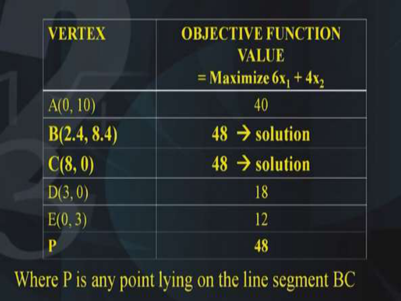

So let us look at the value of the objective function at each of these vertices A B C D and E in this table you will find in the 1st column mentions the vertices A B C D E and in the 2nd column the value of the objective function at each of these points at A the value of the objective function is 40, at B it is 48, at C it is 48, at D it is 18, at E it is 12 and this implies that the highest objective function value is being attained at both the points B as well as C. 

This indicates that the maximum value of the objective function is attained at both the points B and C. Now if you look at any point P which lies on the line segment joining B and C this point P will also have an objective function value 48 why is that so? **(Refer Slide Time: 13:26)** 

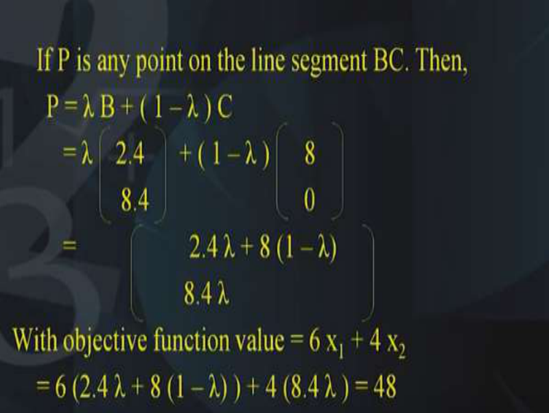

Let us look at the calculations suppose P is any point on the line segment joining B and C then P can be written as a convex linear combination of the two points B and C, that is, mathematically P can be written as λ B + ( 1 – λ ) C. The coordinates of B are (2.4, 8.4) similarly the coordinates of C are (8, 0) and if you multiply λ (2.4, 8.4) + (1- λ) (8, 0), you get a point which is 2.4 λ+8 (1λ) and in the 2nd coordinate you will have 8.4 λ. Now this point P if you substitute in the objective function, the objective function is nothing but 6x1+4x2 when you substitute this point into the objective function you get a value 48 this implies that no matter what point P you choose on the line segment between B and C the value of the objective function will be 48. 

Please note that the value of λ should be between 0 and 1 if the value of lambda is 0 then the point B is nothing but the point C whereas if λ =1 then the point P is nothing but the point B. And for all values of λ lying between 0 and 1 you will get all points lying on the line segment B and C and this indicates that not only the points B and C. But also all the points lying on the line segment B and C are the solutions to the LP. Because they are having objective function value 48 this is the case of multiple solutions and now we will look at what happens if we solve this problem with the simplex method and the objective behind this is to look at the calculations with respect to the basic feasible solution viz-a-viz both the methods. 

**(Refer Slide Time: 16:42)** 

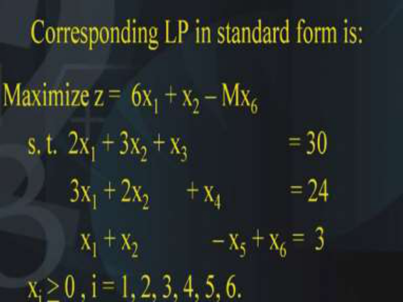

So in order to solve this problem with the simplex method we need to write the constraints in this fashion that is 2x1 + 3x2 + x3 = 30, 3x1 + 2x2 + x4 = 24 and x1 + x2 – x5 + x6 =  3. I hope everyone 

has followed that since the 3rd constraint was of the > type we had to subtract a surplus variable and since we do not have a basic variable in the 3rd equation. So therefore we need to add a artificial variable which is x6 in the 3rd constraint. Of course as you know that in the LP in the standard form the objective function has to be of the maximization type. Also since x6 is a artificial variable it has to be incorporated into the objective function by multiplying M times x6 and subtracting this term –Mx6. 

# **(Refer Slide Time: 18:08)** 

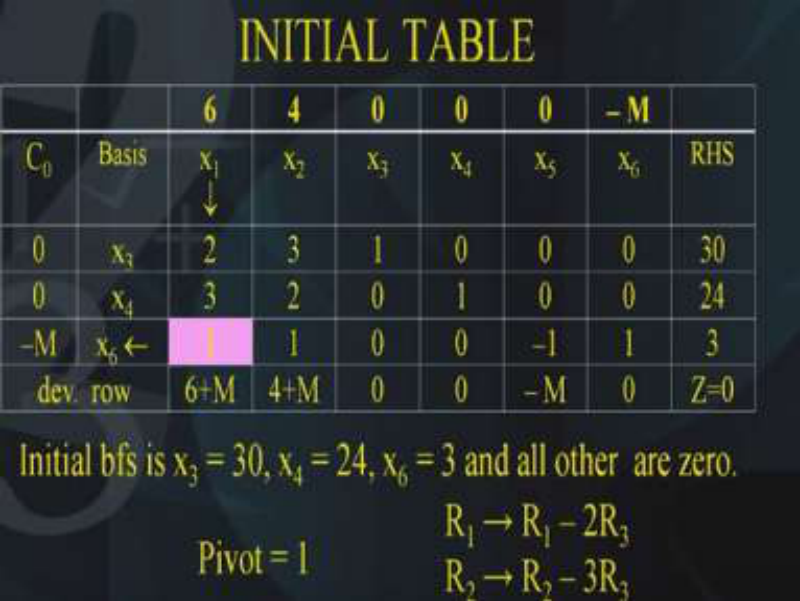

Now let us look at the calculations as before we will look at what is the basis. The basis is nothing but x3, x4 and x6 and this we will write in the 1st column here it is. The 1st column is x3, x4 and x6. x1, x2, x3, x4 and x5 and x6 these entries we will write down from the given problem 3, 2, 3, 1, 3, 2, 1, 1, 0, 0, 0 ,1, 0, 0, 0, -1, 0, 0, 1 and the right hand side is 30,24, 3. Also we will write down the objective function coefficients that is 6,4 0, 0, 0 and -M. So these are the coefficients of the objective function and they have to be repeated over the 1st column over here 0, 0 -M. Now if you look at this iteration the initial iteration you find that the initial BFS the initial basic feasible solution is nothing but the basic variables equated to the right-hand side. And what does that mean this means that the initial BFS is nothing but x3 = 30, x4 =24 x6=3 and the remaining variables as 0 so this is the BFS you will find that neither x1 nor x2 is appearing in the BFS. Both x1 and x2 are 0 that means that this corresponds to the origin that is when we were solving the problem with the help of the graphical method this initial BFS is corresponding to the origin. 

Now we want to look at what happens in the next iteration. So what we will do as before we will calculate the deviation rows and they are calculated like this 6 –(0, 0 –M)(2 3 1)t so you will get 6+M. Similarly 4- (0,0-M)(3 2 1) and you will get 4+M, similarly 0-(0,0,-M)(1,0,0)t which comes out to be 0. In fact I had mentioned earlier also since x3 is a basic variable, so the coefficient of the deviation row the entry in the deviation row will also be 0 corresponding to the basic variable and the same applies for the variable x4 because x4 is also a basic variable. So therefore this entry in the deviation row becomes 0 the same thing applies for the last variable also because this is a basic variable. So therefore this entry has also to be 0. 

We need to look at what happens with x5 variable, we have the calculations as 0-(0, 0,-M)(0,0,1)t and you get -M. So that is the way the entries in the deviation rows is calculated. Now what is the criteria for finding out which variable should enter the basis we have to look at the deviation rows and we find that among the deviation rows the 1st entry is the largest that is 6 +M. You can compare it with the remaining entries you will find that 6+M is the largest entry and this indicates that the 1st variable x1 should enter the basis. Next we need to decide which is the leaving variable and for this we will perform the minimum ratio test between the right-hand side and the pivot column. So what do we find that the right-hand side is 30,24,3 and the pivot column is 2,3 and 1 and this indicates that 3 / 1 is the least because the 1st one is 30/2 that is 15 2nd one is 24/3 that is 8 and the 3rd one is 3/1 which is 3. So this indicates that this variable should leave the basis and that is the reason why this box 1 is highlighted and it indicates that at this iteration pivot is the entry 1. Now since we want to make x1 enter into the basis therefore we need to convert this column as 0, 0 and 1. And how were going to do that we are going to apply the following elementary row operations that is R1 has to be replaced by R1-2R2 and similarly R3 has to be replaced by R2 -3R3. So with these elementary row operations we can make this column as 0, 0 and 1. 

**(Refer Slide Time: 25:30)** 

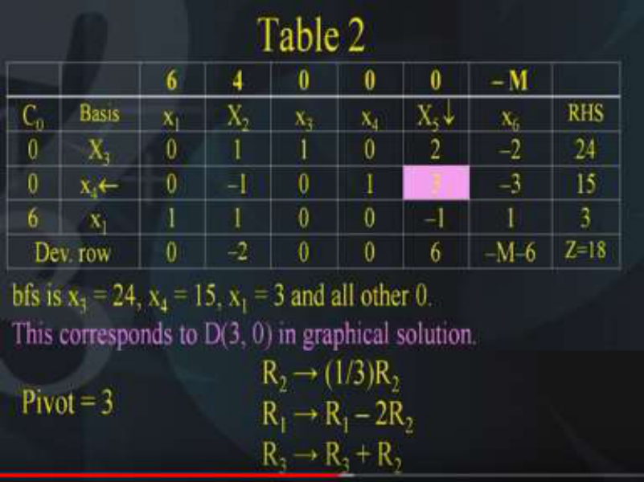

And what happens when we apply these elementary row operations yeah there you see this column has become 0, 0 and 1. Similarly of course the other entries in the in these rows and columns will also change according to the elementary row operations that we have applied. You will observe that this entry was earlier -M because we had x6 over there. But now since x1 has entered so we need to change this entry as well. So this entry has to become 6 because the coefficient of x1 in the objective function is 6. So therefore this entry will also change next we need to calculate the deviation rows and you find the deviation rows are 6-(0, 0, 6)( 0, 0, 1)t which is nothing but 0 because it is a basic variable what are the other basic variables yes x3 is a basic variable so the corresponding entry is 0. x4 is a basic variable, so the entry corresponding to x4 is also 0, only entry has to be calculated is for x2 that is 4–(0,0,6)(1,-1,1)t which comes out to be -2. And similarly corresponding to this variable that is x5; 0-(0,0,6)(2,3,-1)t vector and this comes out to be 6 and the final last column also –M- (0, 0, 6)(-2,-3,1)t which comes out to be - M+6 once these deviation entries are calculated. 

We need to observe which of them is the largest and you find 6 is the largest. Please note the last entry is 6-M so although M is a very large number but it is appearing with a negative coefficient, so 6 - M it will be smaller than 6 and this indicates that this variable corresponding to 6 that is the variable x5  should enter the basis and the current BFS if you look at the current BFS. 

What is the current BFS? The current BFS is x3 =24, x4=15 and x1=3 and all others 0. Now if you look at this BFS carefully you find that x1 is in the basis, but what about x2, x2 is not in the basis so x2 is 0 that means it is corresponding to the point D in the graphical method. So D is the point (3, 0). let us go back to the graphical method to see yeah here it is so the point D is the point (3, 0). You will find that, in the initial table we had started from the origin that is the (0, 0) and immediately after 1st iteration we have come to the point D that is (3,0), this indicates that from the initial iteration to the 1st iteration we have come to the next point that is (3,0) this means that we need to look at the next iteration. And in order to do that we need to calculate the deviation rows which we have already done next we need to look at which is the largest. So 6 is the largest therefore x5 should enter the basis. We also need to see which variable should leave the basis and in order to see that we need to calculate the minimum ratio test. And what is the minimum ratio test it is nothing but the ratios of the right-hand side with the pivot column. And what are the ratios the ratios are you find that 24/2 and 15/3 the 3rd one has not to be considered because it is negative and you find that the 2nd entry is the least. So this tells us that variable x4 should leave the basis and the pivot is this box. So pivot is 3 and we will apply the elementary row operations again in such a way that this vector becomes 0,1 and 0. So we want that x5 should become 0, 1, 0 so what are the elementary row operations that we should apply yes we should apply the following elementary row operations. 

First of all, the 2nd row should be divided by 3 because the coefficient the pivot is the 3 and we want the pivot to be 1 so the entry corresponding to the pivot should be 1 and in fact we need to multiply the entire row by the scalar 3. So that is why this elementary row operation tells us R2 has to be replaced by 1/3 R2. Next comes the elementary row operation, R1 has to be replaced by R1-2R2 this will make the entry in the pivot column as 0. Next R3 has to be replaced by R3+R2. So once these three elementary row operations are applied we will get the corresponding entry or the corresponding column as 0, 1 and 0. 

**(Refer Slide Time: 33:11)** 

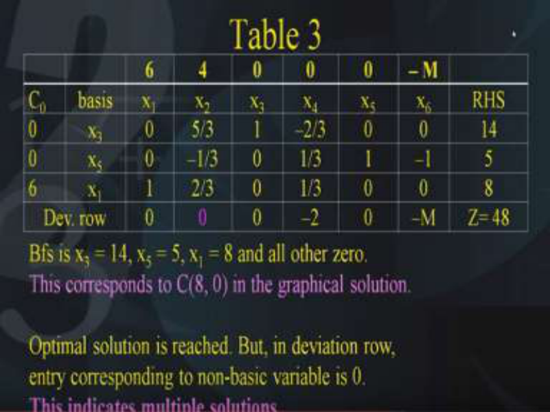

So what happens let us look at the next iteration yes this entry corresponding to x5, this has become 0, 1 and 0 and that is what we wanted. Let us observe the BFS that we have now the BFS that we have is as follows x3=14, x5=5 and x1 =8 and all others 0. Now what does this mean this means that this particular BFS is corresponding to the point C, which is given by (8, 0). Because you will see x1 is 8 but x2 is 0 so this particular BFS which we have obtained in table number 3 is corresponding to the point C given by (8,0) in the graphical method. Let us look at the point C in the graphical method here it is so this is the point C what do we find in the 1st iteration we started with (0, 0) in the 2nd table we got the point D and in the 3rd table we have got the point C. 

If you look at the deviation rows, as we have to first calculate the deviation rows obviously the deviation rows are calculated using the same method 6- (0,0,6)(0,0,1)t which is coming to be 0. Similarly, other entries are 0 0 -2, 0 and –M. You will observe that this entry is 0 because it is the basic variable x1 is in the basis. Similarly x3 is in the basis therefore at this entry is 0. x5 is in the basis so therefore this entry is 0.- 2 and -M corresponds to non-basic variables and that’s why entries are non-zero. But the most important thing is this entry x2 is not in the basic variable, but it is having an entry 0 now this is something which needs to be taken care of because if there is a variable which is non-basic but it is having a entry 0 then this is an indication that the problem has multiple solutions. 

So what is the indication in the simplex method to find out whether a problem has multiple solution. Yes, the criteria to note is that if in the deviation row any entry corresponding to a nonbasic variable is 0 in the division rows then that indicates, it is a case of a multiple solution. So that is what it says in the bottom line, optimum solution has been reached but in the deviation rows the entry corresponding to a non-basic variable is 0. This is an indication that the problem has multiple solutions. Now as you know in the graphical method we have seen that C is one of the multiple solutions. How to get the other multiple solution that is D, now that has to be seen and for this what we should do is although the stopping criteria has been achieved. But we need to find out one more multiple solution so we need to perform one more iteration. How to perform one more iteration we need to make one variable enter the basis now the question is which variable should we enter the basis. The best method is to choose this x2, because x2 is corresponding to a non-basic variable and it is corresponding to a 0 entry in the deviation rows. Therefore, we can make x2 enter into the basis. 

So if x2 enters into the basis then we need to find out the minimum ratio test. By performing the minimum ratio test we can see which variable should leave the basis and accordingly we will proceed further. 

# **(Refer Slide Time: 38:46)** 

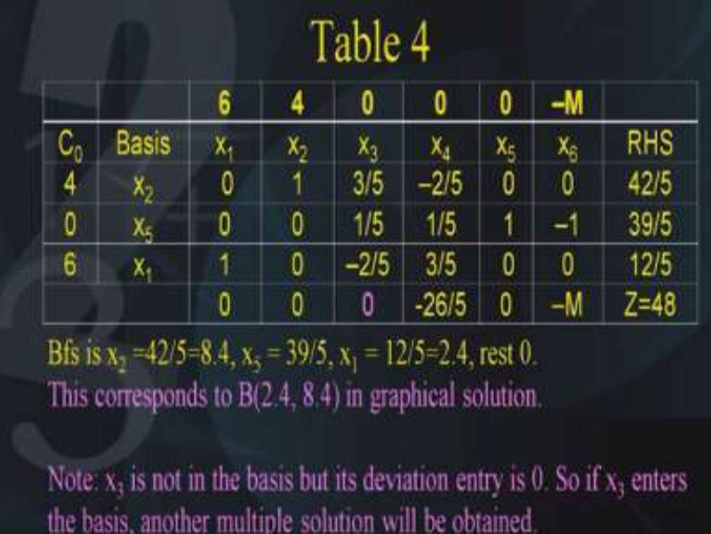

This is the next table, we find that the BFS that we get is nothing but x2=42/5 which is nothing but 8.4 similarly the next variable x3 is 39/5 and the other basic variable is x1=12/5 which is 

nothing but 2.4 and of course the rest of them are 0. So this BFS is actually nothing but the point corresponding to the point B given by (2.4 8.4) in the graphical method. 

Let us go back to the graphical solution yeah here it is B is nothing but the point (2.4, 8.4). Now this tells us that we started with the origin that is the (0,0) in the 1st iteration we move to the point D that is (3,0), next iteration we move to the point C that is (8,0). 

We found that the stopping criteria has been achieved and that indicated that due to one of the entry in the deviation rows corresponding to a non-basic variable was 0. So this was the case of a multiple solution and therefore we performed one more iteration and since we performed one more iteration we found that the next solution obtained is the point B given by the coordinates (2.4, 8.4). So the solution that we obtained in the graphical method that is B and C has been verified. What do you find, we find that not only the point B and the point C, but also all those points lying between the point B and C are also solutions. 

**(Refer Slide Time: 41:12)** 

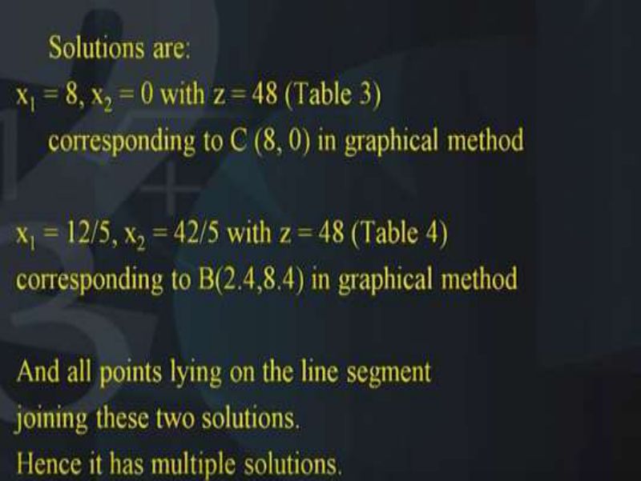

Since we will note that the basic feasible solution that corresponding to the iterations in the simplex method are nothing but the vertices of the simplex that we have seen in the graphical method. What do we conclude? We conclude that there are the following two solutions number one the solution number 1 is (8, 0) x1=8 and x2=0 and it has an objective function value as 48. This corresponds to the table number 3 that we have just now obtained. 

This also corresponds to the point C given by (8, 0) in the graphical method. The 2nd solution is nothing but the point x1=12/5 and x2=42/5 and this also has the objective function value 48 and this corresponds to the table number 4 and it also corresponds to the point B(2.4, 8.4) in the graphical method. So I hope you have tried to correlate the BFS during each iteration of the simplex method as well as the points on the graphical method. 

So we know that the two points B and C are the solutions and as I mentioned earlier all points lying on the line segment joining B and C are also solutions. This is the case of the multiple solutions or alternate solutions by the way how many such solutions do you think exist. Can you count these number of solutions yes you cannot count these solutions because the value of lambda because there are infinitely many points lying between B and C. As I mentioned in the previous slide here all points lying on the line segment B and C can be obtained using that formula where the value of lambda lies between 0 and 1. Since lambda is a real number assuming values between 0 and 1 this indicates that the number of Ps that are possible are infinite and that is the reason why we say there are multiple solutions to this problem. There are alternative solutions to this problem. 

So this is the case of the multiple solution and in the end let us try to recapitulate what we have done in this lecture. We have tried to look at the multiple solution case by comparing the calculations of the simplex method along with the graphical method. We have seen how in the simplex method we move from one vertex to another vertex and those vertices are nothing. But the BFS which are the corresponding BFS in the simplex calculations. 

**(Refer Slide Time: 44:47)** 

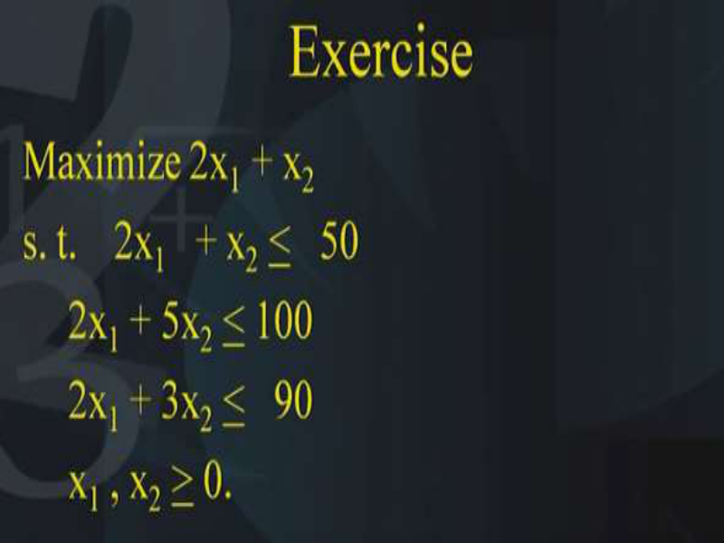

So finally we conclude this lecture and as an example as an exercise I want you to solve this problem maximize 2x1 + x2  subject to 2x1   + x2 <u><  50, 2x1 + 5x2 < 100, 2x1 + 3x2 <   90 , and</u> both x1 , x2 <u>></u> 0. I want you to observe this problem and you will find that the slope of the objective function is the same as the slope of the 1st constraint and this indicates that the problem has multiple solutions. 

So, just as we have done in this lecture we have solved the problem using the graphical method and we have solved the problem using the simplex calculations. Try to find out the movement of the vertices along with the movement of the BFS which is obtained at each of the iteration of the simplex method. And finally in the final table you will see that there will be some non-basic variable which is having a 0 entry in the deviation rows. 

This is an indication that the problem has multiple solutions and in order to get the next solution you make that variable enter into the basis and you will get the next solution. Thank you. 

