# **Operations Research Prof. Kusum Deep Department of Mathematics Indian Institute of Technology - Roorkee** 

# **Lecture – 11 Revised Simplex Method** 

Good morning students, this is lecture number 11 on the series linear programming, the title of today's lecture is the revised simplex method. Till now we have studied the simplex method which is used for solving a generalized linear programming problem. Today, we will see a shorter version of this simplex method, the objective being that this revised simplex method can be easily implemented on the computer, so that it requires lesser computational efforts, lesser computational memory. Also it requires some constants which are called as the simplex multipliers and we will see; what are the advantages of these simplex multipliers. 

**(Refer Slide Time: 01:32)** 

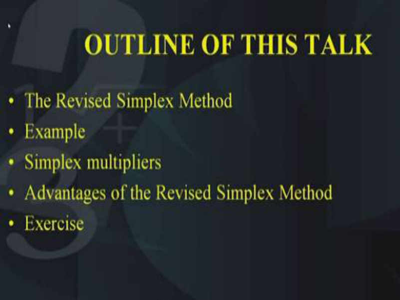

So, let us look at the outline of today's talk, first of all the revised simplex method then, we will take an example to understand the working procedure of the revised simplex method. During this, we will also see the simplex multipliers, what is the meaning of simplex multipliers; how they are obtained and how they are useful and then we will look at the overall advantages of the revised simplex method. 

**(Refer Slide Time: 02:14)** 

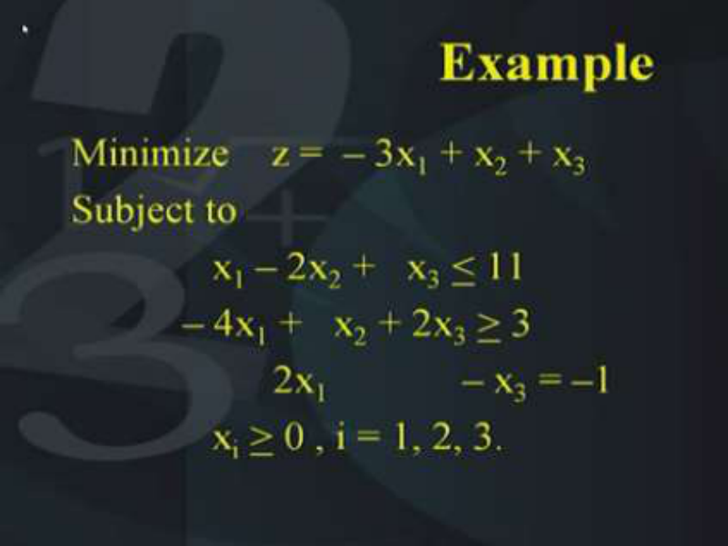

In the end, I will give you an exercise to solve so, if you recall in the simplex method lecture we had solved this particular problem. Now, particularly I am taking this problem, so that you can make a comparison between what we did using the simplex procedure and what we are going to do using the revised simplex procedure. So, the problem is the same, that is minimization of z = – 3x1 + x2 + x3 

Now, this is a minimization problem and we need to convert it into a maximization problem when we are going to solve it using the simplex procedure. So, the objective function is minimization of z = – 3x1 + x2 + x3 subject to the three constraints that we have x1 – 2x2 +   x3 <u><</u> 11. The second constraint is   – 4x1 +   x2 + 2x3 <u>> 3 and the third constraint is 2x1 – x3 = –1. All</u> the xi’s from 1, 2 up to 3, they are all > 0. Now, this is the most general linear programming problem in which there is one inequality of the less than equal to type, one equality of the greater than or equal to type and the third constraint is equality type. **(Refer Slide Time: 04:12)** 

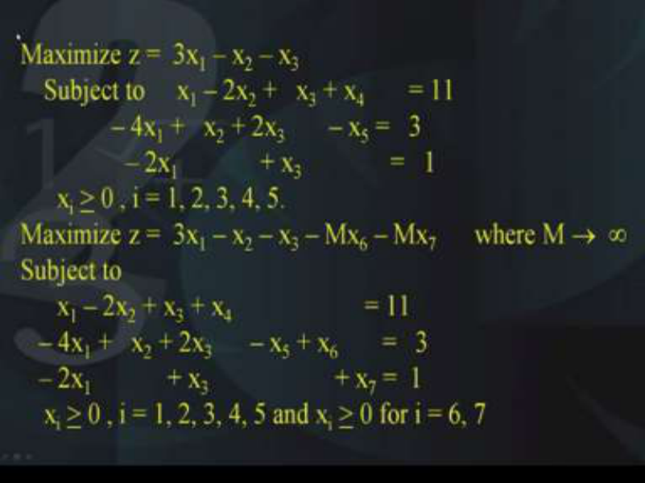

So, as before the first thing we need to do is; we need to convert it into the LP in the standard form, so for this we need the objective function in the maximization form that is maximization of 3x1 – x2 – x3 and this is subject to x1 – 2x2 +   x3 + x4 = 11. Now, as you can see x4 is a slack variable because we need to convert the less than equal to inequality into a equality. 

Now, in the second constraint; the second constraint is of the greater than or equal to type, so we need to subtract a surplus variable. And the surplus variable is nothing but x5, so the constraint becomes – 4x1 +   x2 + 2x3 – x5 = 3 and the third constraint that is given to us is having the right hand side as negative but since we want that the right hand side should be positive, so here we have to multiply the entire equation with the negative sign and we get – 2x1 + x3 =   1. All the xi’s from 1, 2 up to 5 are > 0. 

Now, let us suppose we solve this problem with the Big M method. We have already studied this Big M method, so what we do is; the variables that we have introduced the x6 and the x7 which are nothing but the artificial variables into the constraints. They are introduced in the objective function with a -M factor, so the original objective function that is 3x1 – x2 – x3 in this thing we add, -M x6 and - M x7 where M goes to infinity that is M is a very large number. And this is subject to the previous conditions; the previous constraints except that we have added the artificial variables in the second constraint as well as in the third constraint. If you recall we need to add the artificial variables because we do not have a readily available BFS and we need a readily available BFS to start the simplex procedure. So, therefore we are now ready to solve this problem with the revised simplex method. **(Refer Slide Time: 07:23)** 

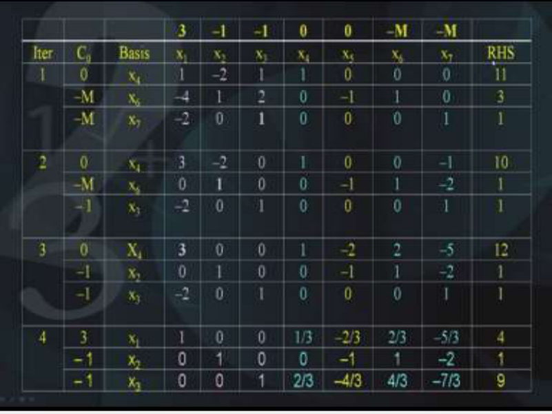

Till now, the formulation is the same, if you recall these are the computations that have been recorded during the four iterations that we had performed using the simplex procedure. The first column shows the iteration number or the table number, second column shows the basis at each of the iteration or rather the CB that is the basis; the coefficient of the basis in the objective function. Then the third column shows the basis; the basis is x4, x6 and x7 and so on and then the subsequent columns they show the various coefficients that each of the variables x1, x2, x3……..  In the top you will find we have the objective function coefficients that is 3, - 1, - 1, 0, 0, -M and – M; now, these are the objective function coefficients and then in the last column we have the right hand side that is the value of the decision variables. 

Now, please look at the colour coding to understand this fact that the variable x4 for example initially, in the initial table the variable x4 is 1 0 0, so it is a basic variable, x4 is a basic variable, similarly, x6 and x7 they are also basic variables. x6 is 0 1 0 and x7 is 0 0 1. As in how the iterations proceed and in the end, we reach the table 4; 1 0 0 this column it becomes 1/3, 0, 2/3. So, if you look at this particular column the 4th column, instead of 1 0 0 it has now at the end reached to a column which is 1/3, 0, 2 /3. Similarly, the x6 variable, it is 0 1 0 in the initial table and in the final table it is 2/3, 1 and 4/3 and the finally the last variable that is x7, this is 0 0 1 and it has now in the end become -5/3, - 2 and 7/3. So, what we find from this table is that the basic variables keep on proceeding and proceeding iteration by iteration. 

In the end, they come to a form which is highlighted in the blue colour now, on the other hand please look at the pink coloured columns, what you find is that if you look backwards that is let us suppose if you look at the last iteration number 4, in the last iteration number 4 you find the x1 column is 1 0 0 right and if you go back and look at this particular column that is 1 0 0 under the x1 column, you find it is 1, – 4, -2. 

So, starting from 1, -4, -2 we reached at 1 0 0; similarly, x2 starting from – 2, 1 and 0, we reached at 0 1 0 and similarly, the third column that is 1 2 1, it reaches 0 0 1. Now, my question to you is can you try to imagine what could be the relationship between these blue entries and the pink entries, I think some of you may have observed the following fact that is the matrix obtained by these three columns in the beginning that is at iteration number 1 and in the end that is at iteration number 4. They are related to each other by the following fact that is these matrices the 3x3 matrix formed, they are the inverse of each other how is that so? 

**(Refer Slide Time: 12:47)** 

Here, look at this observation, what do you find; 1 - 4 -2; -2 1 0; 1 2 1, this matrix is nothing but the pink matrix in the beginning in the iteration number 1, right and similarly, the blue matrix is the second one that is 1/3 0 2/3; 2/3 1 4/3; – 5/3 - 2 and – 7/3. Now, if you multiply these two matrices, you find that it turns out to be the identity matrix now, this is not a chance and this is in fact the theory behind the simplex procedure that is the first matrix is the inverse of the second matrix. This basic concept we are going to use in the revised simplex method, so that we can shorten the calculations of the simplex method. **(Refer Slide Time: 14:04)** 

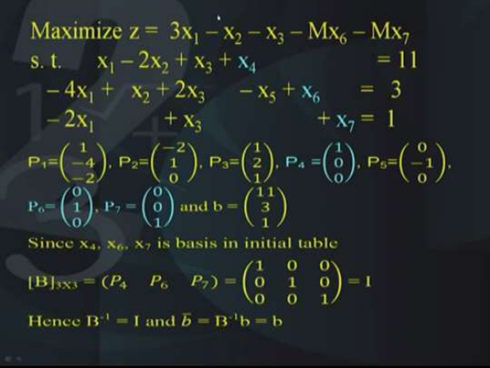

So, now we will see how this revised simplex method is going to work so, let us come back to the original formulation of our problem where we have added the slack and the surplus variables and the artificial variables and we call each of the columns by the name P1, P2 etc., so P1 for example is the first column that is 1 -4 -2, P2 is -2 1 and 0, P3 is 1 2 1, P4 is 1 0 0, P5 is 0 -1 0, P6 is 0 1 0 and P7 is 0 0 1 and right hand side is 11, 3 and 1. 

You will observe that the columns P4, P6 and P7, these have been highlighted in the blue colour to identify that these are nothing but the basic variables, so P4 is corresponding to the basic variable x4 similarly, P6 is corresponding to the basic variable x6, P7 is corresponding to the basic variable x7. Now, since these are the basic variables of the initial table, let us look at the matrix called capital B which is a 3x3 matrix formed by these three columns that is P4, P6 and P7. So, this is nothing but the identity matrix and if you try to take the inverse of this B, you will get nothing but the identity matrix and we can get the new B, the small b, the new small b is nothing but capital B inverse multiplied by b. So, what is this new b; new b is the right hand side and we will record it in the table like this. **(Refer Slide Time: 16:39)** 

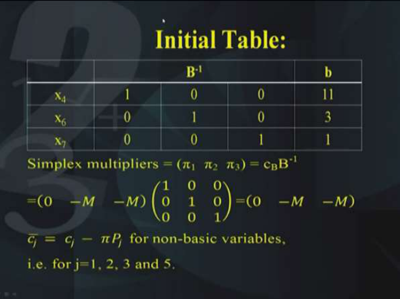

So, the initial table can be written in this concise form that is x4, x6 and x7, the right hand side is written in the last column that is 11, 3 and 1 and **B****-1** is indicated in the middle. Now, we will calculate simplex multipliers, we will be denoting them by π1, π2 and π3 , they are nothing but the product of cB multiplied by B-1 . Now, what is cB; cB is nothing but the coefficients of the basic variables in the objective function. The cB is nothing but the coefficients of the objective function in the basic variables, now what are the basic variables; x4, x6 and x7, so the coefficient of the basic variable x4 in the objective function is 0 similarly, the coefficient of the basic variable x6 in the objective function is -M and similarly the coefficient of x7 in the objective function is also – M, so therefore cB is nothing but 0, -M and –M. 

Now, this has to be multiplied by B-1 and this is what you get; B-1 as I have said initially it is the inverse of the identity matrix which is nothing but the identity matrix itself, so therefore in the beginning, in the initial table, the simplex multipliers are nothing but 0, -M and –M. Now, we will see how these simplex multipliers can be traced out in the table of the calculations of the simplex method. 

Now, you will find that as before we need to calculate the deviation rows, so therefore the deviation rows are calculated by the formula j = j – j  for the non-basic variables and in this case, the non-basic variables are j = 1, 2, 3 and 5. **(Refer Slide Time: 19:24)** 

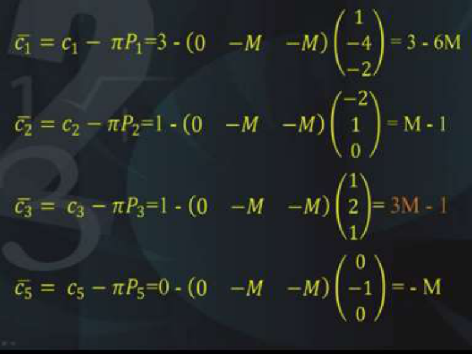

So, let us calculate these cj's corresponding to the non-basic variables, so x1 is a non-basic variable so, we need to calculate 1  that is the new deviation rows, so 1 = 1 – 1 and the c1 is nothing but the coefficient of x1 in the objective function, so that is nothing but 3. Now is the simplex multipliers which we have just now obtained that is 0, -M, -M. Then we have the P1; P1 is nothing but the column that we have identified in the beginning and it is nothing but 1, - 4 and – 2. Now, if you solve this, you multiply and then subtract from 3, you get 3 – 6M, you please check the calculations and try to understand how we have got this. Please note P1 is a column vector, is a row vector, so when you multiply it, you will get a scalar, okay. 

So, 3 – (0 -M –M) (1 - 4 –2)t , this will give you 3 -6M, like this you need to calculate 2, 3, 5; these are to be calculated for the non-basic variables because for the basic variables, they will be 0, so 2 bar is nothing but 2 – 2 which is = 1 – (0 - M – M) (- 2 1 0)t which is nothing but M – 1, 3 = 3 – 3 which is = 1 – (0 - M – M)(1 2 1)t which is nothing but 3M – 1. Similarly, 5 = 5 – 5 which is = 0 – (0 - M – M) (0 - 1 0)t and this turns out to be – M. Now, these deviation rows have to be recorded in the end of that table, that is, the last row of the table and in order to find out which variable should enter the basis, we have to look at these entries and identify which one of them is the maximum and as you can see the maximum is nothing but 3M- 1 which is corresponding to the third variable. **(Refer Slide Time: 23:03)** 

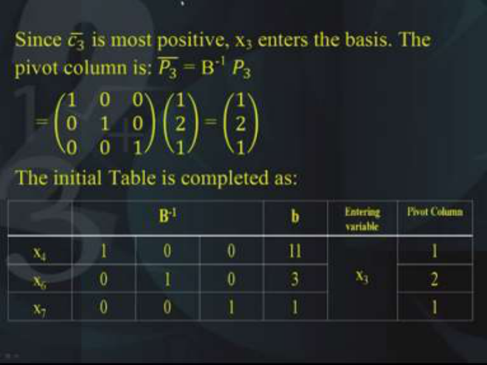

So, this tells us that x3 variable is the variable which should enter into the basis, since c3 is the most positive of the entries, therefore x3 should enter the basis and the pivot column is like this, 3 = B-1 3.  Now, here you will see that we are just picking up P3 instead of the whole thing, (instead of the whole matrix we are just picking up P3) and finding out the new 3. 

So, B-1 is nothing but 1 0 0; 0 1 0; 0 0 1 and P3 is 1 2 1, so once you multiply it you will get the same thing initially, it will be the same but later on in the next iterations, it will change. Then the initial table can be now completed by adding these two columns now, in the last ; in the second last column we have the entering variable which is nothing but x3 and the pivot column. So, the pivot column is 1 2 1, this we have obtained just now by multiplying B-1 3 multiplied by P3. 

# **(Refer Slide Time: 24:30)** 

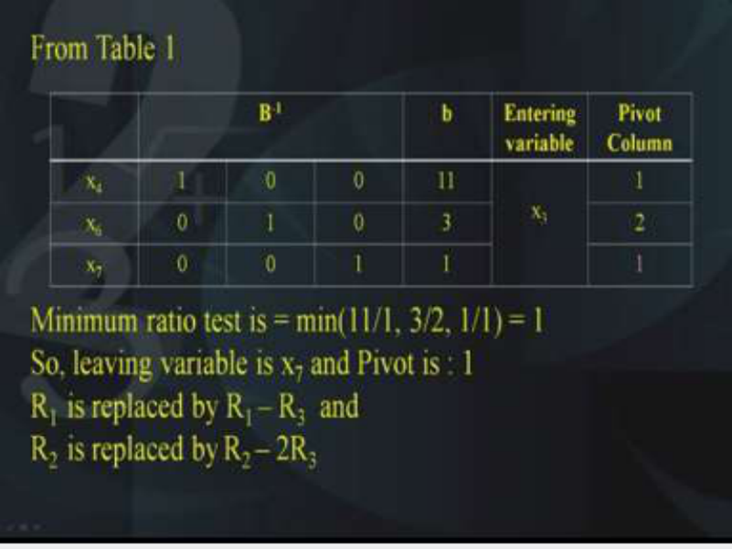

So, from the table this is what we get, you will find that the minimum ratio test has to be applied in order to make sure which variable should leave the basis and the minimum ratio test tells us that the minimum of 11/1, 3/2 and 1/1 has to be taken which is nothing but 1, therefore this indicates that the leaving variable is nothing but x7 and the pivot is 1 so, we apply the elementary row operations as we did in the simplex method. That is R1 is replaced by R1 - R3 and similarly, R2 is replaced by R2 - 2R3. So, the operations are the same as the simplex method, the only difference is that lesser number of computations have to be recorded in the computer memory so that for large scale problems, we can solve, we can write the code and solve it with lesser computations. 

**(Refer Slide Time: 26:10)** 

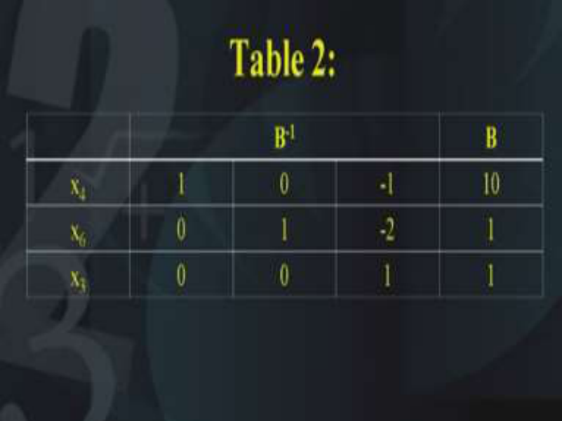

Therefore this is what the table 2 looks like now, in the table 2 you find that the base is now is changed, the basis has become x4, x6 and x3, okay and the rest of the things are recorded as it is and you will find that now B-1 has become 1 0 0; 0 1 0; -1 -2 1 and of course, the right hand side has become 10 1 and 1. **(Refer Slide Time: 26:33)** 

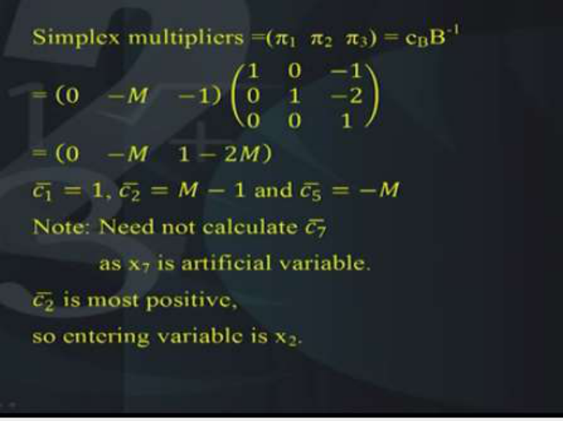

So, this completes one iteration, same thing is repeated for the second iteration and the simplex multipliers are obtained as π1, π2, π3 using the same formula that is cB B-1 .Now, you will note that cB has to be changed because the third basic variable is now x3 and the coefficient of x3 in the objective function is -1, so therefore the simplex multipliers are to be obtained using cB. 

So, cB is 0 -M -1 and the B-1 now is 1 0 0; 0 1 0; -1 -2 1 and when you multiply the two, you will get the simplex multipliers. So, the simplex multipliers are 0  –M  2M-1. Now, look at the new c bars that is the deviation rolls as before as we have calculated, the new deviation entries have to be obtained for the non-basic variables. Now, what are the non-basic variables? x1 is the non-basic variable similarly, x2 is the non-basic variable. So, we need to calculate their deviation entries and as before you know how to do that 1 turns out to be 1, 2  turns out to be M-1 and 5 turns out to be –M, you will know note that we need not calculate 7 why? Because x7 was an artificial variable, we had introduced x7 as an artificial variable and now it has been removed from the basis, so we need not calculate 7. Because it is an artificial variable and it has already left the basis so, now the entering variable becomes x2, if because 2  is the one that is telling us that this is the most positive and therefore the corresponding variable x2 should enter the basis. 

**(Refer Slide Time: 29:21)** 

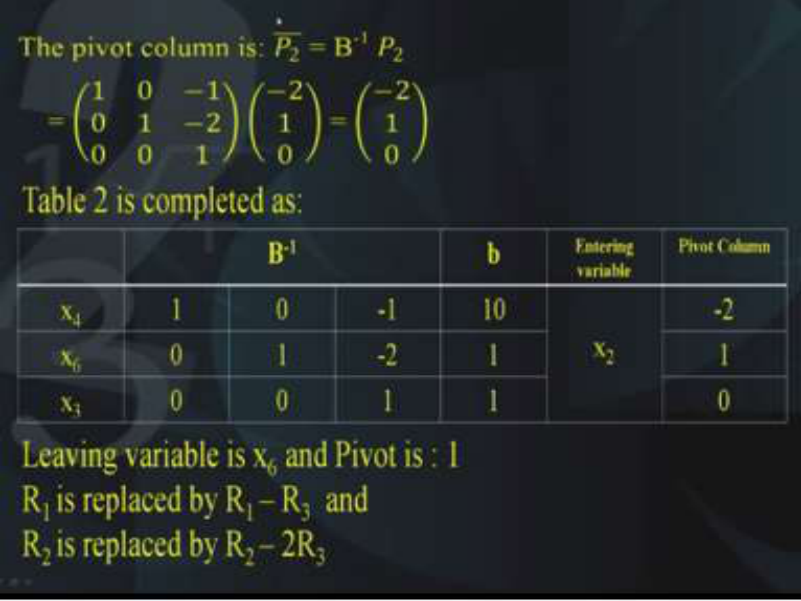

So, as before the pivot column has to be calculated so, pivot column is calculated using the formula 2 = B-1 2  and this is obtained like this, 1 0 0; 0 1 0, -1 -2 1 multiplied by - 2 1 0 and this turns out to be - 2 1 0 and therefore the table 2 which we got in the beginning has to be completed by adding the last 2 entries; last 2 columns that is it says that because of this calculations, the entering variable is x2 and the pivot column is -2 1 and 0. Also we need to perform the minimum ratio test to find out the leaving variable so, the leaving variable is nothing but x6 and the pivot is 1 as before we perform the elementary row operations. **(Refer Slide Time: 30:36)** 

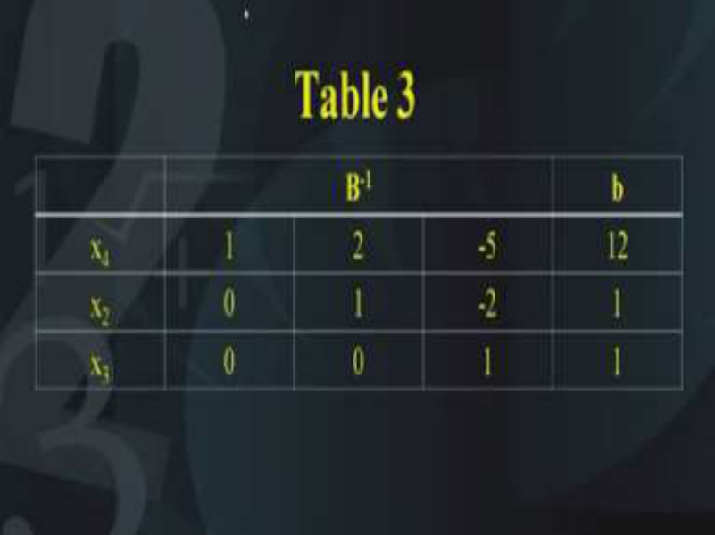

The elementary row operations tells us that this is a table 3 now, what does the table 3 tells us; that we now have a new basis so, this completes the second iteration. **(Refer Slide Time: 30:54)** 

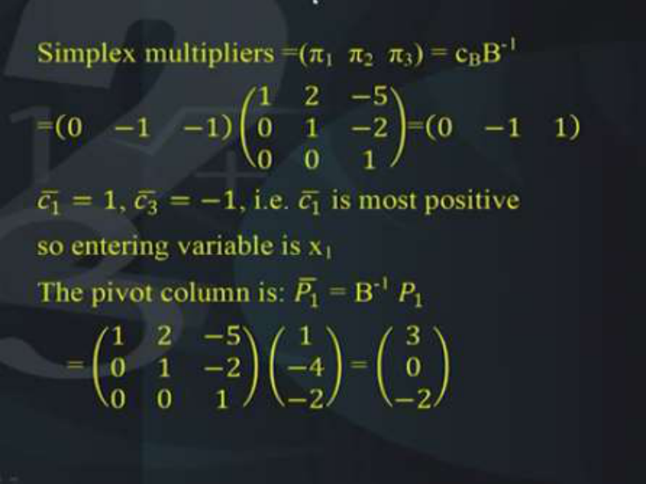

Like this, the next iteration starts, we calculate the simplex multipliers like this as before that is cB B-1 which is 0 -1 -1. Please note that cB is changed now because the basis has changed and the B-1 is nothing but 1 0 0; 2 1 0; -5 -2 1 which is nothing but 0 -1 and 1. So, at this stage the simplex multipliers are obtained as 0 -1 1. Again, we need to calculate the deviation entries. The deviation entries are obtained like this so, the 1 is the first non-basic deviation entry, it is 1. Similarly, 3  is -1 and we find that 1  is the most positive, therefore the entering variable is x1 because it is the most positive. The pivot column has to be obtained as 1 = B-1 1 and this is obtained as follows; 1 0 0; 2 1 0; -5 -2 1 multiplied by 1 -4 -2 which is equal to 3 0 -2. So, we have got the new P1 bar. **(Refer Slide Time: 32:45)** 

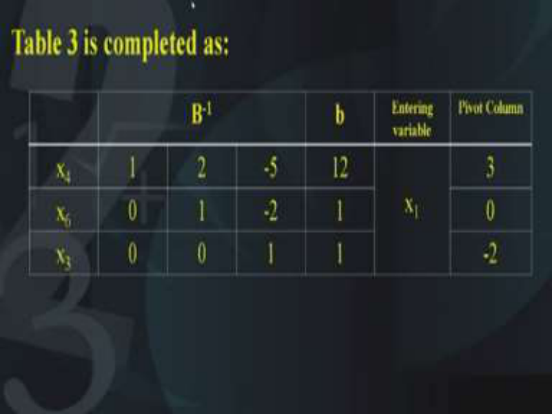

Table 3 is completed like this, so that is the complete table 3 as before we have added two more columns. 

# **(Refer Slide Time: 32:59)** 

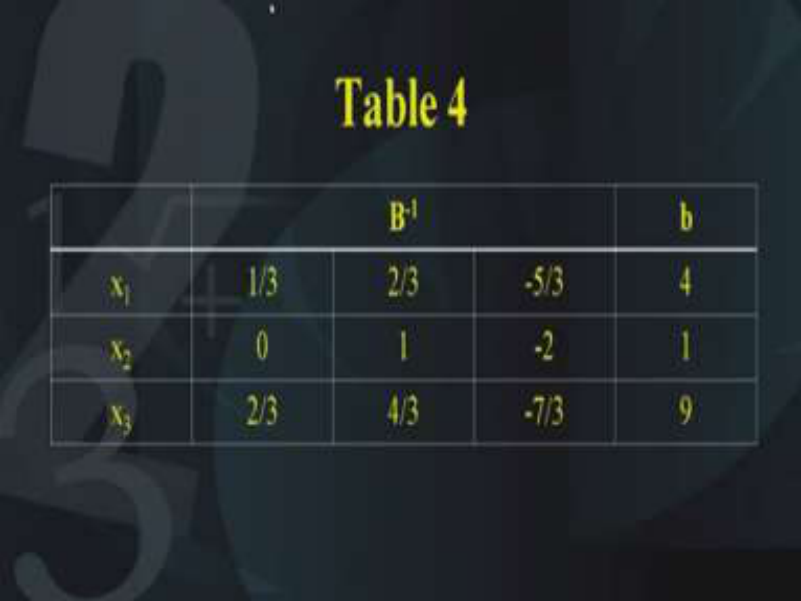

Then we get the table 4 like this and what do we find; we find that the right hand side is now 4 1 9 and the basic variables are nothing but x1, x2, x3. So the BFS in the table 4 is x1 = 4, x2 = 1, x3 = 9 and we have got the B-1 which is indicated in this table; table number 4. 

# **(Refer Slide Time: 33:34)** 

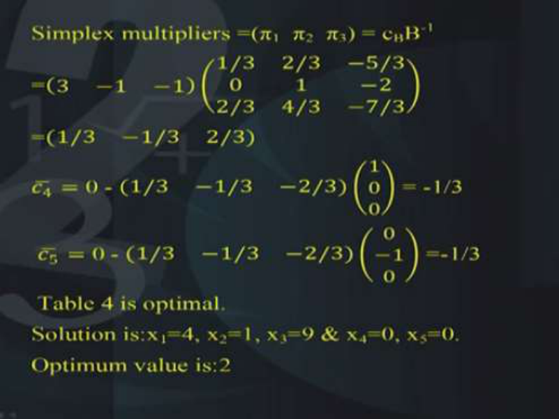

The simplex multipliers are again obtained as follows; 3 -1 -1 multiplied by 1/3 0 2/3, 2/3 1 4/3, -5/3 -2 -7/3 which turns out to be 1/3 -1/ 3 and 2/3 and we calculate the deviation entries and we find that all the deviation entries are negative. Now, this is an indication that the stopping criteria has been satisfied and therefore table 4 is the optimal solution to the problem. So, our solution that is x1 = 4, x2 = 1 and x3 = 9 and all others as 0 is the optimum solution to the problem. 

# **(Refer Slide Time: 34:44)** 

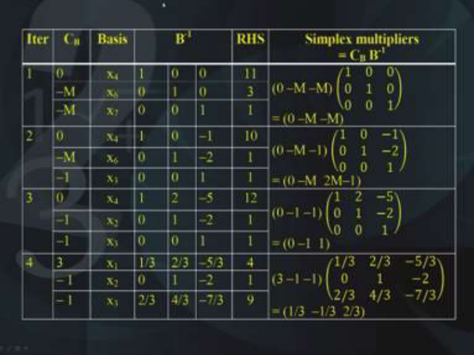

So that is the reason why it is necessary to obtain the simplex multipliers at each iteration and now, we are in a position to rewrite all this information that we have got in the form of a table. Now, if you look at this table, it shows the calculations iteration wise, from iteration number 1 to iteration number 4, you will see the first column shows the iteration numbers, second column shows the cB that is the coefficient of the basic variables in the objective function. The third column shows the basic variables; then you can see the B-1 that is at each iteration, what is the B-1 . Then the next column shows the right hand side, then the next column shows the simplex multipliers. Now, you will observe that at each stage we are getting the simplex multipliers by performing the multiplication between cB multiplied by B-1 and later on we will see how this cB multiplied by B-1 . 

This simplex multipliers will be the solution of the dual program programming problem of the original linear programming problem, so therefore they are a very valuable information. **(Refer Slide Time: 36:13)** 

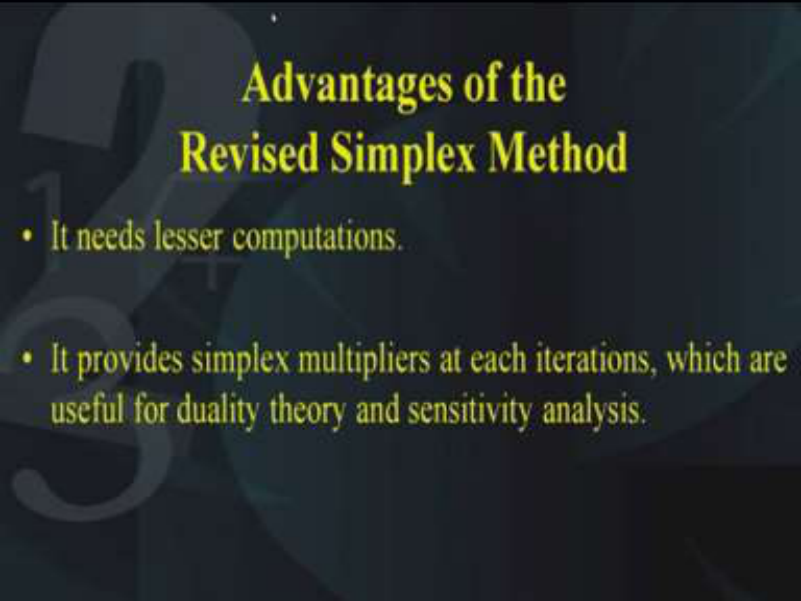

Now, we will like to see what are the advantages of the revised simplex method so, the first advantage is that it needs lesser computations as compared to the simplex method because you do not need to calculate the entire table, you just need to calculate the P bars; the P bars are the simplex multipliers. Secondly, it provides simplex multipliers at each iteration which are useful for the duality theory that is the dual problem; they are the solution of the dual problem. Also they are helpful in sensitivity analysis which is nothing but a procedure to find out what happens if a slight change is made in the initial data of the linear programming problem. So, in our subsequent lectures we will be talking about the duality theory and the sensitivity analysis, there we will see how the simplex multipliers help us to solve the dual and also perform sensitivity analysis. 

**(Refer Slide Time: 37:34)** 

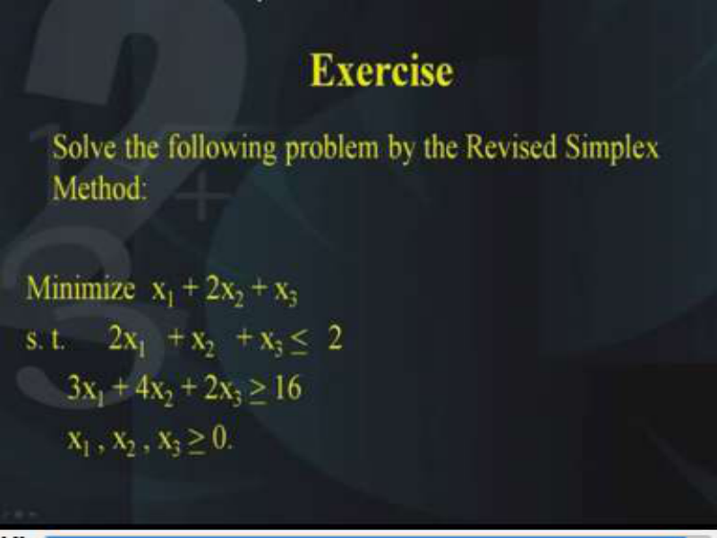

In the end, I would like to give you an exercise to solve the following problem using the revised simplex method, here is the problem; minimize x1 + 2x2 + x3   and this is subject to 2x1   + x2 + x3 <u><   2  and the second constraint is 3x1 + 4x2 + 2x3 > 16  and x1, x2 and x3 are all > 0. Now,</u> there are two constraints and there are three variables so, the hint is that you need to look at the less than and the greater than sign in order to decide what variables you have to add or subtract. So, in the first constraint we have the less than sign that means, we need to add a slack variable, in the second constraint the sign is greater than so, therefore we need to subtract a surplus variable, therefore we will not have a basic variable in the second constraint. So, you need to add an artificial variable into the second constraint in order to get an initial BFS. Once you do that then you are ready to solve it using the revised simplex method. At each iteration please record the simplex multipliers so that at the end you get the simplex multipliers, later on we will see how these simplex multipliers are useful in solving the dual. Thank you, thank you very much. 

