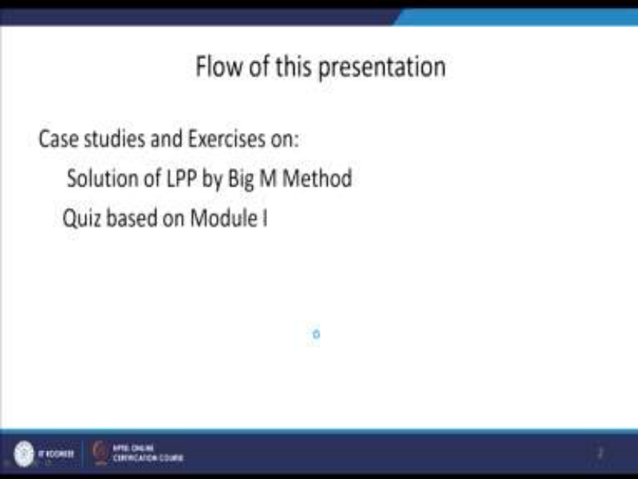
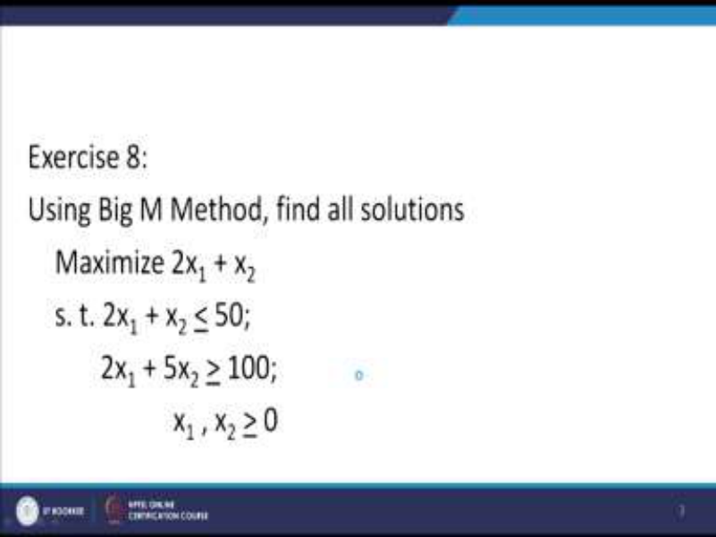
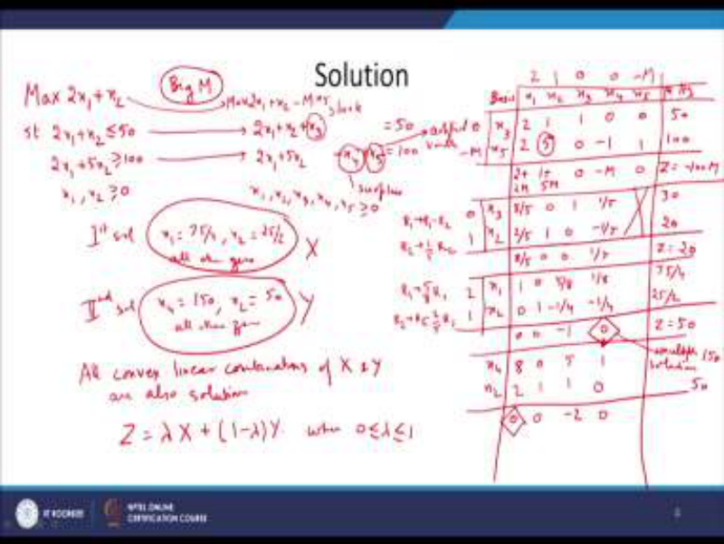
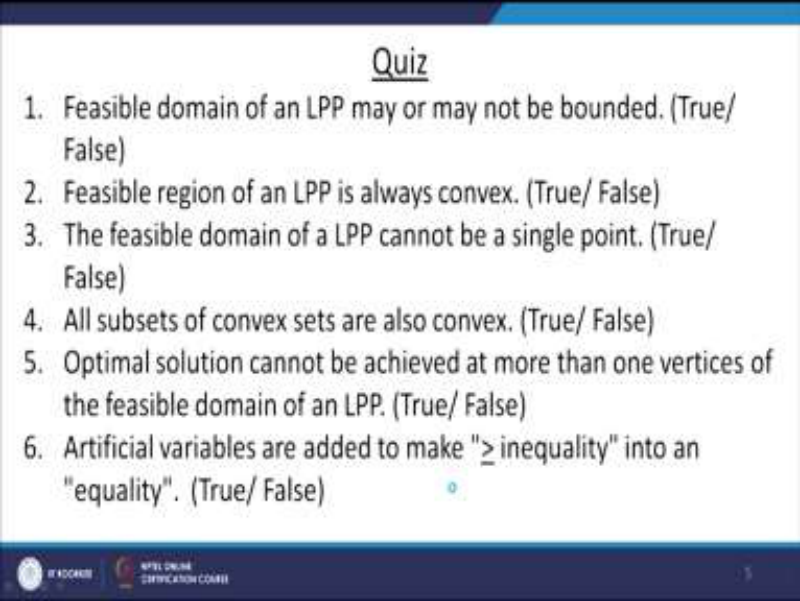
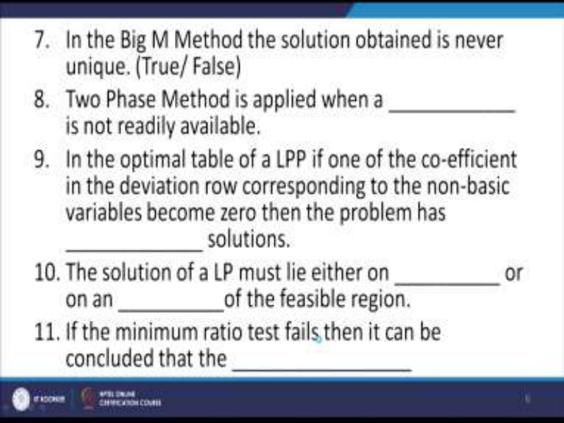
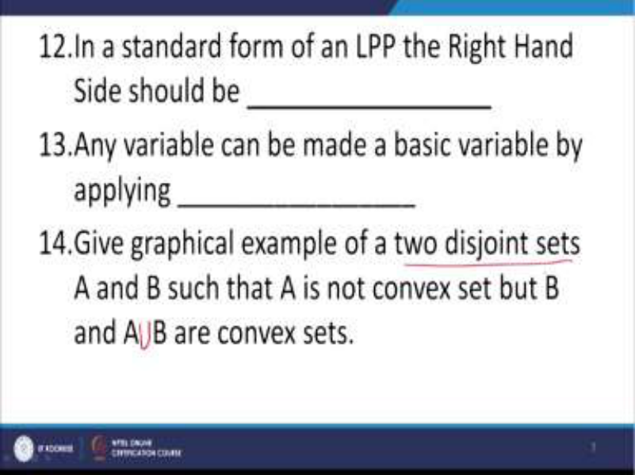
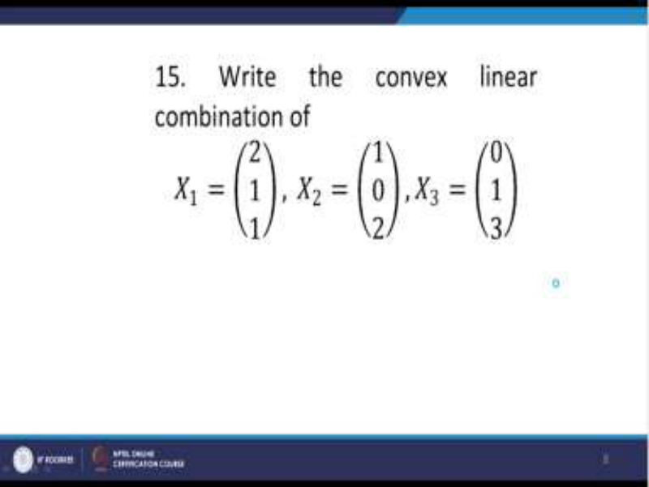
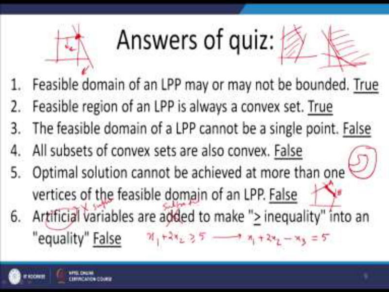
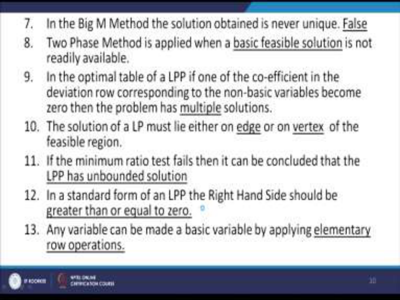
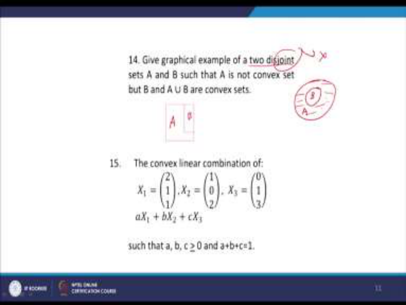

# **Operations Research Prof. Kusum Deep Department of Mathematics Indian Institute of Technology – Roorkee** 

**Lecture - 14 Case Studies and Exercises - III** 

Good morning students. This is lecture number 14 which is based on the exercises and case studies. 

**(Refer Slide Time: 00:42)** 

In this lecture, we will study some examples that is on the solution of an LPP by the Big M 

Method and later you will be given a quiz which is a short answer type quiz based on the module 1. After that, I will provide you the solution of this quiz. So let us begin. 

**(Refer Slide Time: 01:08)** 

Now the exercise number 8 is as follows. Using the Big M Method, find all solutions to the problem, maximize 2x1 + x2 subject to 2x1 + x2 <u>< 50, 2x1 + 5x2 > 100, x1 and x2 are both> 0.</u> Now my first question is without solving the problem, can you identify the nature of the solutions of this problem? Yes, you can because the slope of the objective function is the same as the slope of first constraint. That means this particular problem has multiple solutions and therefore without solving the problem, we can know that this problem will give rise to multiple solutions. 

# **(Refer Slide Time: 02:28)** 

So let us write the solution to the problem maximize  2x1 + x2  subject to 2x1 + x2 <u>< 50, 2x1 +</u> 5x2 <u>> 100, x1 and x2 are both > 0. Now since we have to solve it using the Big M Method, so</u> you know that we need to convert this problem into the standard form. Therefore, the first constraint we will rewrite as 2x1 + x2 + x3 =50 and the second constraint can be rewritten as 2x1 + 5x2- x4 =100. Remember that x3 is a slack variable, x4 is a surplus variable, this is required to convert the less than equal to constraint into the equality constraint and similarly the greater than equal to constraint into the equality constraint, but we have now to start the simplex procedure with a BFS but there is no basic variable in the second constraint. Therefore, we need to add x5 in the second constraint and as you know that this is called as a artificial variable. Since we have incorporated the artificial variable, therefore the objective function has also to be modified as follows, maximize 2x1 + x2 –M x5. I hope you recall why we have to do this because at some stage, at some iteration we want that the artificial variable should disappear from the basis. Of course, you need to make sure that all the variables from x1 to x5 should be > 0. 

Now let us begin our simplex procedure as before. So we will write the basis of the initial table x1, x2, x3, x4, x5 and right-hand side. The coefficients of the objective function are 2 1 0 0 and –M. The basis is x3 and x5, why is that so because in the first constraint x3 is a basic variable and in the second constraint x5 is a basic variable. Then, we need to write the coefficients under x1 it is 2 and 2, under x2 it is 1 and 5 and under x3 it is 1 0 because it is a basic variable. Then, we have 0 -1 again 0 1 because again this is a basic variable and the right-hand side as 50 and 100. Now we need to calculate the deviation entries and they are as follows, 2+2M 1+5M etc. I hope you all recall how we calculate the deviation entries. Under the basic variables, we can immediately write 0 and under x4 we can write -M and you can also see that the objective function value is -100M, so these are the deviation entries. 

Coming to the next iteration, we need to see which variable should leave the basis and which variable should enter the basis. According to the rule for the entering variable, we find that this 1+5M is the largest, so therefore x2 should enter the basis and according to the minimum ratio test, we find that x5 should leave the basis. So here you are, 5 is the pivot and we have to apply the elementary row operations in such a way that this variable becomes x2 enters the basis and x5 leaves the basis. 

So the new basis becomes x3 and x2 and this is again has to be rewritten using the elementary row operations, R1 should be replaced by R1-R2 and R2 should be replaced by 1/5 R2. So what do we get? We get 8/5 0 1 1/5 and in fact we can forget about this last variable because it is no longer there in the basis, right-hand side is 30 and in the second row we have 2/5 1 0 - 1/5 and right-hand side is 20. 

Now again we need to calculate the deviation entries. They are as follows, 8/5 0 0 1/5 and the objective function value is 20. Now we find that the new basis becomes x1 and x2. So I will leave this as an exercise, how we decided that x1 should enter the basis and x3 should leave the basis. This is the normal way we have been doing. Accordingly, we will apply the elementary row operations as follows. 

R1 is to be replaced by 5/8 R1, R2 is to be replaced by R2-2/5 R1 and the resulting table that we get is 1 0 0 1 5/8 -1/4 1/8 -1/4 and the right-hand side becomes 75/4 and 25/2. Let us now calculate the deviation entries and we get 0 0 -1 and 0 and we find that this entry is 0, although it is not a basic variable so that gives us an indication that this problem has a multiple solution. 

Remember the condition for multiple solutions is that the coefficient of a non-basic variable if it gives rise to a 0 entry in the deviation row, then this is an indication that the problem has multiple solutions but the multiple solutions have to be obtained. I mean the other multiple solution has also to be obtained. So this is an indication that you are having multiple solutions to this problem. Of course, the objective function value is Z=50. 

In order to get the other multiple solution, what we will do is we will make this variable enter into the basis because we are not left with any other choice. So therefore, we will make x4 enter into the basis and our new basis will become x4 and x2 and what do we find, we find that the entries are as follows, 8 2 0 1; 5 1 1 0 and the right-hand side is 150 and 50 and again if you look at the deviation entries, you get 0 0 -2 0. 

Here again you find that this entry 0 is occurring although this is not a basic variable. Therefore, what do we get, we get that we have two solutions. What are the two solutions that we have? The first solution that we got is x1=75/4, x2=25/2, all other 0 and in the next iteration, we got the second solution as x4=150 and x2=50, all other 0. So if I call this first solution is let us say capital X and this solution as Y, then the multiple solution tells us all convex linear combinations of X and Y should also be solutions to the given problem. So all convex linear combination of X and Y are also solutions and this we can write let us say Z = λ X+ (1- λ) Y where the value of λ lies between 0 and 1 and this tells us that since we were required to obtain all the solutions, therefore we have now got all the solutions of this problem. I hope everybody has followed how we got all the solutions to the problem. 

**(Refer Slide Time: 15:04)** 

So now here comes the quiz which is based on the entire syllabus that we have learnt in the module 1. So I will be giving you some time to find out the answer to this short answer quiz. Question number 1, the feasible domain of an LPP may or may not be a bounded set, true or false. Please write down the answer in your notebooks. The feasible domain of an LPP may or may not be a bounded set, true or false. 

Question number 2, feasible region of an LPP is always a convex set, true or false. Question number 3, the feasible domain of an LPP cannot be a single point, true or false. Question number 4, all subsets of convex sets are also convex, true or false. Question number 5, optimal solution cannot be achieved at more than one vertices of the feasible domain of an LPP, true or false. Question number 6, artificial variables are added to make a greater than equal to inequality into an equality, true or false. 

# **(Refer Slide Time: 18:34)** 

Question number 7, in the Big M Method the solutions obtained is never unique, true or false. Question number 8, the two-phase method is applied when a ___ is not readily available. Question number 9, in the optimal table of an LPP if one of the coefficients in the deviation row corresponding to the non-basic variable becomes zero then the problem has ____ solutions. 

Question number 10, the solution of a LPP must lie either on ____ or on ____ of the feasible region. Question number 11, if the minimum ratio test fails, then it can be concluded that the 

_____. 

**(Refer Slide Time: 21:27)** 

Question number 12, in the standard form of an LPP, the right-hand side should be _____. Question number 13, any variable can be made a basic variable by applying _____. Question number 14, give a graphical example of two disjoint sets A and B such that A is not a convex set but B and, A union B are convex sets. Please note that the example that you give should be for two disjoint sets. 

**(Refer Slide Time: 23:31)** 

And question number 15 is write the convex linear combination of the following three points X1, X2 and X3 where X1 is given by (2 1 1), X2 is given by (1 0 2) and X3 is given by (0 1 3). Please make sure that you write the complete definition of a convex linear combination of three points. So I hope everybody has written down the answers to all these questions that have been given in the quiz and now comes the time to give you the answers to this quiz. **(Refer Slide Time: 24:38)** 

So the first question is feasible domain of an LPP may or may not be bounded, the answer is true. You know that the feasible domain could be a bounded set or an unbounded set. So here is an example of a bounded set, the feasible region is bounded, this is the region and also here is an example of a feasible region which is unbounded, for example this one. So therefore, both the conditions are possible, both the situations are possible. Therefore, the answer to this question is true. 

Question number 2, feasible region of an LPP is always a convex set; the answer to this is true because we have learnt a theorem which says that the feasible region of an LPP is always a convex set. 

Question number 3, the feasible domain of an LPP cannot be a single point. Now the answer is false. Why is it false? Because you could have the feasible region as follows, so there is only one point in the feasible region. This is the one point in the feasible region, so the answer to question number 3 is false. Question number 4, all subsets of convex sets are also convex, that is not true, the answer is false. How is that so? Let me give you an example. Here is a convex set and you can have a non-convex set inside it. So therefore the answer to question number 4 is false. 

Question number 5; optimal solution cannot be achieved at more than one vertices of the feasible domain of an LPP. That is also not true because as you know in the case of a multiple solution, suppose our feasible region is like this, so there could be a possibility that the optimum solution lies at both these vertices as well as all the points lying on the line segment joining these two points, so A and B and all points lying on the line segment joining A and B. 

Question number 6, artificial variables are added to make a greater than inequality into an equality. Now remember if we have an equation like this, we want to convert this into a equality because the standard form says that our constraints should be in the equality form. So what do we do, we subtract surplus variable so that it becomes equality. So this artificial variable is wrong and in its place we should write a surplus variable is subtracted. That is the reason why the answer to this is false. 

# **(Refer Slide Time: 28:50)** 

Question number 7, in the Big M Method the solution obtained is never unique, the answer is false because just now we did an example and we saw that this is not true. Using the Big M Method, we got multiple solutions. Question number 8, the two-phase method is applied when a basic feasible solution is not readily available. Question number 9, in the optimum table of an LPP, if one of the coefficients in the deviation row corresponding to the non-basic variable becomes a zero then the problem has multiple solutions. This condition also we saw in the last example we that we did. 

Question number 10, the solution of a LPP must lie either on an edge or on a vertex of the feasible region. 

Question number 11, if the minimum ratio test fails, then it can be concluded that the LPP has an unbounded solution. 

Question number 12, in the standard form of an LPP, the right-hand side should be > 0. 

Question number 13; any variable can be made a basic variable by applying elementary row operations. 

**(Refer Slide Time: 30:38)** 

Question number 14, give a graphical example of two disjoint sets A and B such that A is not convex but B and, A union B are convex. So here you can see that we have two disjoint sets A and B, A is not convex, this is A it is not convex but B is convex. So the L-shaped region is A this is a non-convex set and B is a convex set and A union B is also a convex set. This happens if it is a disjoint. The condition is that A and B should be disjoint. Suppose this condition is not there, then you could write A and B like this. Here you can see that A is not convex, this is A and this is B, so the conditions are satisfied. 

Question number 15 says that the convex linear combination of these three points have to be obtained and by the definition we can write all convex linear combinations of X1, X2, X3 is a X1+b X2+c X3. 

Of course, a, b and c should be all > 0 and the a+b+c should be=1. So I hope everybody has done your self-evaluation to know how much you have learnt. Thank you. 

