# **Operations Research Prof. Kusum Deep Department of Mathematics Indian Institute of Technology – Roorkee** 

# **Lecture - 15 Primal Dual Construction** 

Good morning students. Today, we are going to start a new section the title of which is the duality theory and sensitivity analysis. By this time, you are now all experts in modeling a real-life problem into a linear programming problem and then solve the linear programming problem by the various techniques that we have studied. Under this section, we will learn how given a linear programming problem there exists a corresponding linear programming problem which is called its dual. 

The title of today's lecture is the construction of primal and dual. So we will see how from a given linear programming problem which we will call as the primal problem, we can construct a related linear programming problem which is called as the dual problem. 

**(Refer Slide Time: 01:39)** 

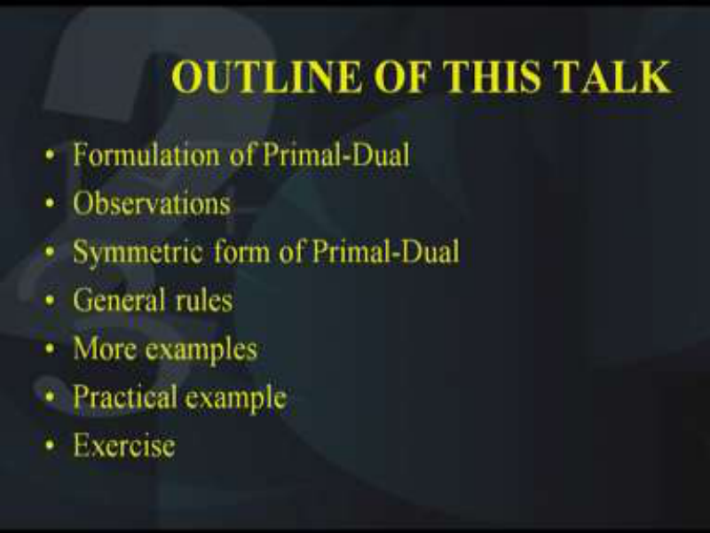

The outline of today's talk is as follows. Formulation of the primal and the dual, then we will make some observations and try to see what is the relationship between the primal and the dual. Then, after that we will see the symmetric form of the primal-dual, we will look at some general rules which should be obeyed while writing the dual of a given primal. Then, I will be taking some more examples. 

Then we will look at a practical example from real life to understand what exactly is the physical significance of a dual, finally I will give you an exercise. 

**(Refer Slide Time: 02:39)** 

Now let us look at this primal and dual which is written here. Now what do you find? You find that there are two linear programming problems. The first one is called the primal problem and the second one is called the dual problem. Both of them are linear programming problems. The first one is maximization of a function _f_ = 7 _x_ 1 + 2 _x_ 2 – 3 _x_ 3 + 4x4 which is subject to 5 _x_ 1 + 2 _x_ 2 + 2 _x_ 3 – 3 _x_ 4  25, 2 _x_ 1 + _x_ 2 – 3 _x_ 3 + 2 _x_ 4  15and all the decision variables _x_ 1, _x_ 2 , _x_ 3 , _x_ 4  0, this is the primal linear programming problem. 

On the other hand, the dual linear programming problem is minimization of a function which we will call as  which is 25 _y_ 1 + 15 _y_ 2 and this is subject to the following four constraints 5 _y_ 1 + 2 _y_ 2  7, 2 _y_ 1 + _y_ 2  2, 2 _y_ 1 – 3 _y_ 2  – 3 and the last constraint is – 3 _y_ 1 + 2 _y_ 2  4 and both the decision variables _y_ 1, _y_ 2  0. Do not worry if you have the right-hand side of a constraint as negative. We are right now not talking about the solution and we are not talking about the standard form of a linear programming problem, we are only trying to find out what is the relationship between these two linear programming problems, the primal problem and the dual problem. Now when you observe these two primal and the dual linear programming problems, you find a relationship between the two. 

Now the question is what is the relationship? Let us look at it carefully. Now what do you find? In the primal, the objective function was to be maximized whereas in the dual it has to 

be minimized. So the primal maximization of f becomes the dual minimization of  that is the first relationship we have observed. Secondly what do we find? The coefficients of the objective function of the primal they have become the right-hand side of the dual. This is indicated by the red colored entries. Similarly, if you look at the right-hand side of the primal, you find that this has now become the cost coefficients of the objective function of the dual. This is indicated in the blue color. Another difference you find is that the matrix A which corresponds to the coefficients of all the x1, x2 etc the variables. That is in all the constraints that has taken a form which is that of its transpose. As you can see that each of the column, let us say the column corresponding to x1 that has now become the row of the dual this is indicated by the different colors, the purple color and the green color and the pink color and the light blue color. So the A matrix of the primal has become A transpose matrix of the dual. Another difference you will observe is regarding the sign of the inequalities. 

In the primal, we have less than or equal to sign in the constraints. Now this has become greater than or equal to in the dual. Of course, the decision variables have to be renamed because in the primal, there are four decision variables whereas in the dual there are only two decision variables and of course these decision variables will be different. The primal variables will be x1, x2 etc and the dual variables will be y1, y2. 

**(Refer Slide Time: 08:47)** 

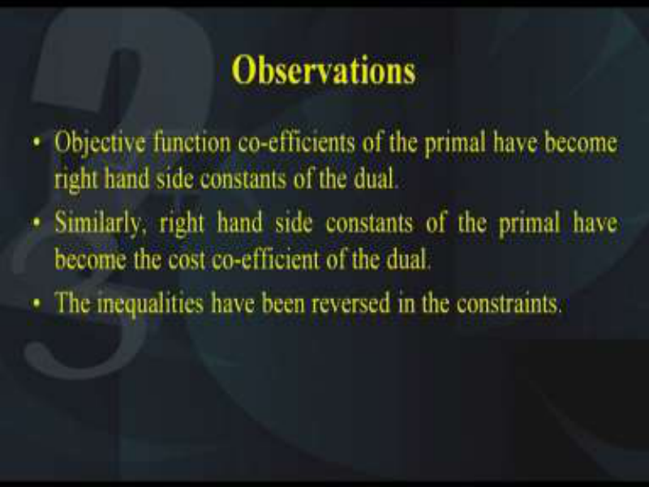

So this is the primal and the dual relationship and we need to find out, rewrite these observations which I have just now shown. So we need to carefully look at what are the observations that we record. The first observation as I said is the objective function coefficients of the primal have become the right-hand side constraints of the dual. 

The objective function constants have become the right-hand side of the dual. That is the first observation. Secondly, the second observation is right-hand side of the primal has become the cost coefficients of the objective function. Next, observation is that the inequalities have been reversed that is in the primal we had the less than equal to inequalities whereas in the dual the inequalities have been changed to greater than or equal to. 

**(Refer Slide Time: 10:07)** 

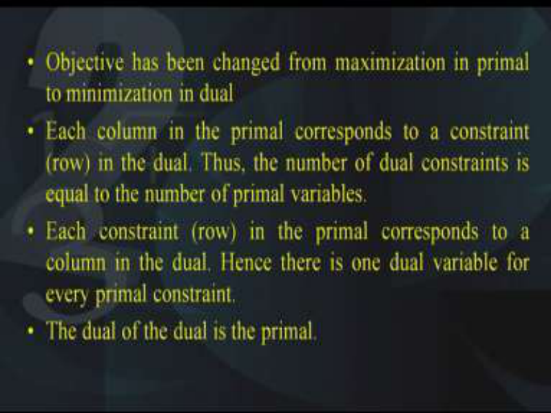

Apart from this, we also observe the following. The objective function has changed from maximization to the minimization. So maximization of the primal now becomes the minimization of the dual. Another observation, each column in the primal this corresponds to each row in the dual, this is done by taking the transpose of the Aij entries of the xi’s that are appearing in each of the constraints. 

So what do we find that each column in the primal has become a corresponding row in the dual. Of course, this means that the number of dual constraints is equal to the number of primal variables. Another observation, each constraint or in other words the row of the primal corresponds to a column in the dual and hence there is one dual variable corresponding to every primal constraint. 

Finally you can very well guess that if you write the dual of the dual, you will get back the primal, so the dual of the dual is the primal. 

**(Refer Slide Time: 11:52)** 

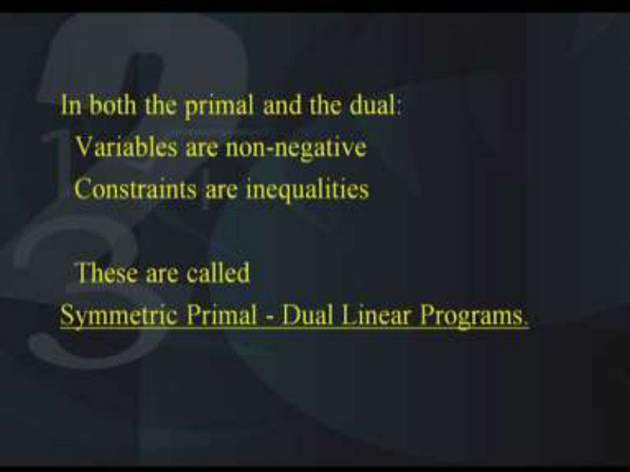

So in both the primal and the dual, what we have seen is that the variables are all nonnegative, that is there is no unrestricted variable, all of them are non-negative, they are greater than or equal to zero in the primal as well as in the dual and all the constraints are inequalities. That is either they are greater than equal to 0 or they are less than equal to 0. Now this is a special case and this kind of a special case is called to be a symmetric primal dual problems. So in other words, if in a primal and a dual, all the variables are greater than or equal to 0 and all the constraints are either less than equal to type or greater than equal to type, then it is said to be symmetric primal-dual programming problems. Later on, we will see what do we mean by asymmetric primal-dual problems. **(Refer Slide Time: 13:20)** 

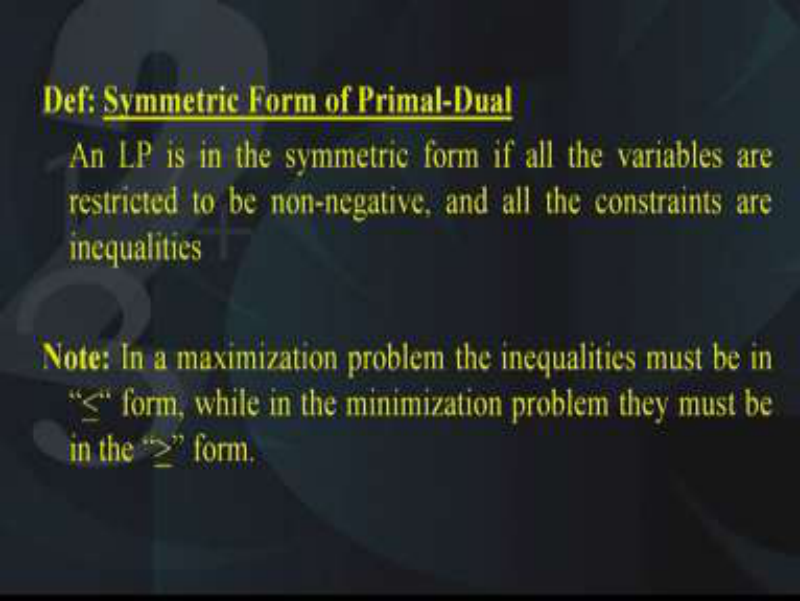

So therefore, we can give a definition of the symmetric form of the primal-dual as follows and LP is in the symmetric form if all the variables are restricted to be non-negative and all 

the constraints are of the form of inequalities. If both these conditions are satisfied in both the primal as well as the dual, then the primal-dual is called as a symmetric primal-dual. 

Now you will note that in the maximization problem, the inequalities must be of the less than equal to type, if they are greater than, then they have to be converted to less than by multiplying with the negative sign and similarly if the problem is of a minimization type, then the inequalities should be greater than or equal to type. So no matter which you call as primal and which you call as dual, maximization should go with less than equal to constraints and minimization should go with greater than or equal to constraints. 

**(Refer Slide Time: 14:42)** 

Now let us look at the same thing in the vector notation. In the vector notation, the primal can be written as maximization f(X) = Ct X subject to AX  B and X  0. On the other hand, the dual takes the form minimization of  (Y) = Bt Y and this is subject to AT Y  C and Y  0. You will observe that in the primal, the vector X is a column n-vector, that means that we have n number of decision variables and in the primal the Ct is a row n-vector, so when you multiply Ct transpose with X, you get C1x1+C2x2 like this. On the other hand, in the dual Y is a column m-vector. That is to say there are m number of decision variables y1, y2 etc in the dual and of course we find that the Bt is a row m-vector in the dual. 

So same thing has been written in the form of a vector notation for better understanding. Also the other form of the same thing could be written as follows. 

**(Refer Slide Time: 17:09)** 

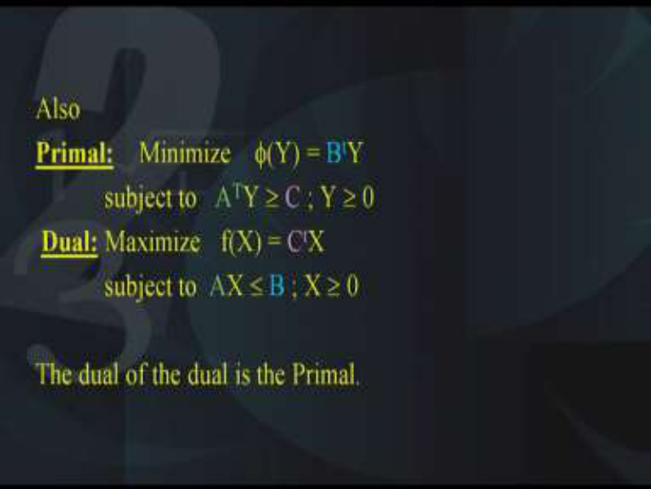

You could write primal in the form of minimization  (Y) = Bt Y subject to AT Y  C and Y  0 and the dual could be written as maximization of  f(X) = Ct X  subject to AX  B, X  0. The idea is that you can call a primal as maximization with the less than constraints and the dual as the minimization and greater than constraint or in other words you could do it the other way around. That is you could call minimization and greater than constraints as the primal and the dual can be called as maximization and less than, but you have to be very careful that with the maximization the constraints should be less than equal to type and with the minimization the constraints should be greater than or equal to type. So you can call either of the two as the primal and the other one as the dual. 

From this, you can also very well see that the dual of the dual is the primal. So what are the general rules that we should adopt for writing the primal and the dual. **(Refer Slide Time: 18:54)** 

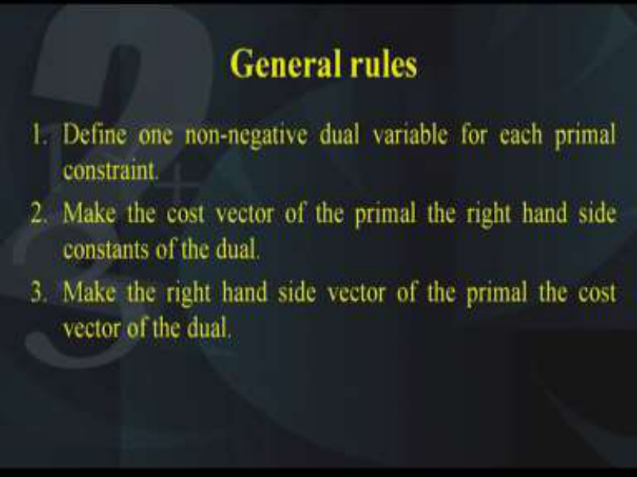

The first rule is that we need to define one non-negative dual variable for each primal constraint. We need to define one non-negative variable which is a dual variable corresponding to the primal constraint. The second rule is that make the cost vector of the primal, the right-hand side constants of the dual. The third rule is make the right-hand side vector of the primal as the cost vector of the dual. 

**(Refer Slide Time: 19:50)** 

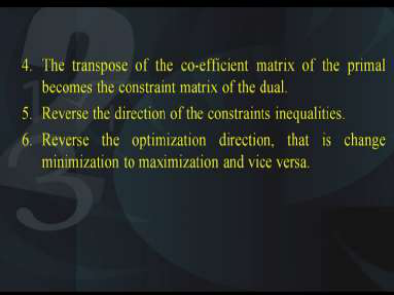

Similarly, the fourth rule is that the transpose of the coefficient matrix of the primal becomes the constraint matrix of the dual. Fifth rule is reverse the direction of the constraint inequalities, that is you have to convert the less than equal to to the right-hand greater than equal to and the greater than equal to has to be converted into less than equal to and the sixth rules says reverse the optimization direction. 

That is if it is a maximization problem, convert the dual as the minimization and if in the primal it is a minimization, then the dual becomes maximization. So with these general rules, we will be able to write the dual of a given primal. So now is the time for an example. Let us look at this linear programming problem. 

**(Refer Slide Time: 21:13)** 

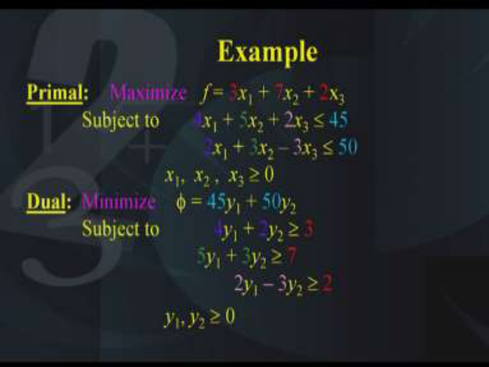

This is in the form of a primal and you find that the objective function is to be maximized f which is equal to given by these coefficients of x1, x2, x3 and this has two inequalities and now using the rules that we have studied, the general rules that we have studied we will try to write down the dual of this. Here is the dual, the color-coding indicates what the general rules have defined. 

We find that the primal had a maximization objective, so the dual becomes minimization. Similarly, the cost coefficients of the primal have now become the right-hand side of the dual. Then, the right-hand side of the primal has become the coefficients of the objective function in the dual. Also, the Aij matrix in the primal has become its transpose in the dual and finally the less than equal to inequalities of the primal have become the greater than equal to inequalities in the dual. 

Of course, the number of decision variables of the primal that is x1, x2, x3 have now become the constraints of the dual and similarly the constraints of the primal have become the decision variables of the dual. So with a little practice, you will be able to write the primal of a given problem. 

**(Refer Slide Time: 23:39)** 

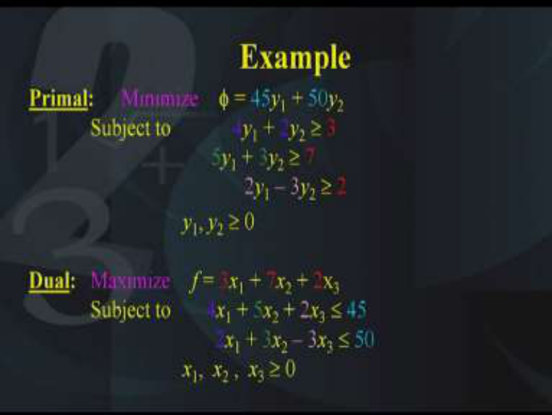

Another example here, what we find is that the objective function is of the minimization type and the inequalities are of the greater than equal to type. So the primal is now minimization of objective function with greater than equal to constraints in the primal and when you write its dual, this is what the dual looks like. That is the objective function has become maximization. In the primal it was minimization, in the dual it has become maximization. Similarly, the coefficients of the objective function have become the coefficients of the righthand side of the dual. Similarly, the right-hand side of the primal have become the coefficients of the objective function in the dual. Also the inequalities have been reversed, that is in the primal we had the greater than equal to inequalities whereas in the dual we have the less than equal to inequalities. Also the Aij matrix has taken its form as that of a transpose. **(Refer Slide Time: 25:06)** 

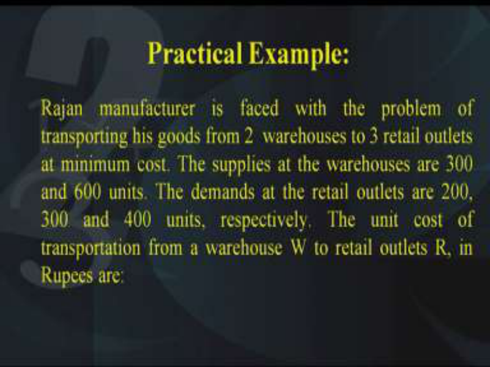

Next comes a practical example. Now you will say what is the use of writing the dual for a given primal problem, we will see in the next couple of lectures, duality theory plays a very important role in performing the sensitivity analysis. However, we also need to look at the physical significance or you can say the actual reason behind which we are trying to write the dual and how does that dual help us in solving real-life problems. 

So here is an example which will illustrate the use of writing the dual and of course solving the dual. So look at this problem, Rajan manufacturers is faced with the problem of transporting some goods from 2 warehouses to 3 retail outlets with a minimum cost. So the objective of the manufacturer is to achieve minimum cost. The supplies at the warehouses are given to be 300 and 600 units. Also the demands at the retail outlets are given to be 200, 300 and 400 units respectively. Now the unit cost of transporting from a warehouse W to a retail how outlet R is given in the following table. 

**(Refer Slide Time: 27:21)** 

So this table tells us that there are 2 warehouses W1 and W2 and there are 3 retail outlets R1, R2 and R3. The supply at the 2 warehouses is given to be 300 and 600 and the demands at the retail outlets is given to be 200, 300 and 500. Now the entries in the table indicate the cost of transporting one unit of the goods from Wi to Rj. So for example, in the first entry we have 2 that means from the warehouse 1 to the retail outlet 1, that is, from W1 to R1, the cost of transporting one unit of good is 2 rupees. Similarly for the other entries 2 4 3 5 3 and 4. The problem that is faced with the manufacturer is to determine the least cost shipping schedule which will meet the demands and the available supplies. So the demands of the supplies have 

to be met and we need to determine how many units of the product should be sent from Wi to Rj. 

So first of all, we need to model the problem as a LP. So here is the solution. We need to define xij decision variables, as you can see there are six decision variables, xij is the quantity supplied from warehouse i to retail outlet j. 

**(Refer Slide Time: 29:52)** 

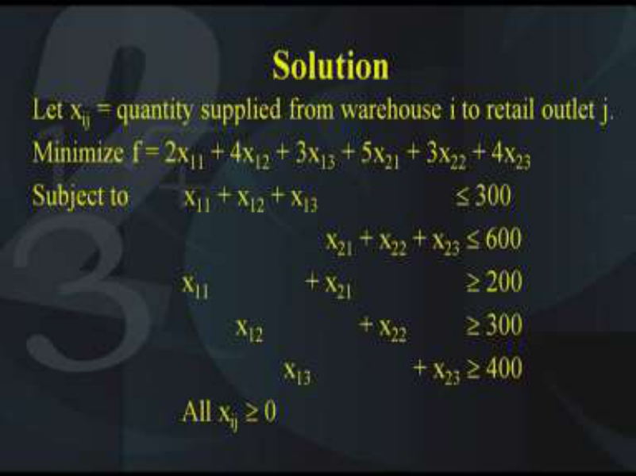

So xij, i varies from 1, 2 up to 3 and j varies from 1 to 2 and with this decision variables you can write the objective function. Now since the objective function is to achieve a minimum cost, therefore the objective function becomes minimization of f = 2x11 + 4x12 + 3x13 + 5x21 + 3x22 + 4x23. Now where has these coefficients come from, these coefficients have come from the data that is given to us in the problem. Because the data that is given in the problem is corresponding to only one unit but here we have xij units. So therefore, in each of the terms we have to multiply and then finally take the sum. Now since the supply and the demands have to be met, therefore we need to impose the following constraints x11 + x12 + x13  300 and similarly x21 + x22 + x23  600. 

Since the demands have to be met, therefore x11 + x21  200 and similarly for the other columns also. Of course, we have to make sure that all xij’s should be  0. You will find that these constraints are some of them are less than equal to and some of them are greater than or equal to, but since we are interested in looking at the primal and its corresponding dual, so we need to convert all the inequalities into either less than equal to or greater than equal to type and that is what we are going to do. 

**(Refer Slide Time: 32:55)** 

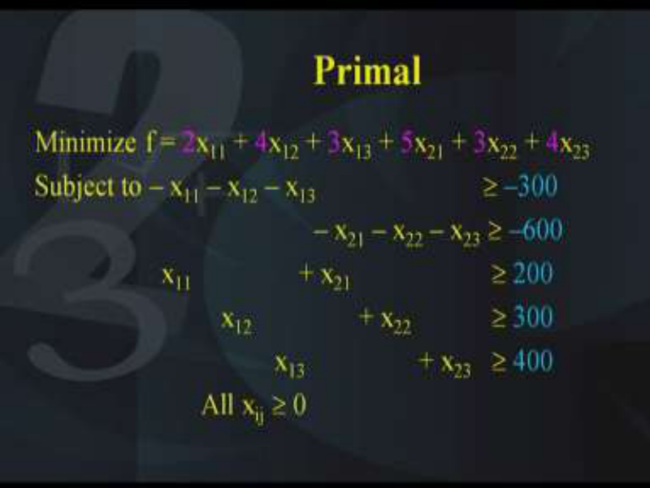

Now if you look at this form of the problem, we find that the objective function is as it is minimization of f = 2x11 + 4x12 + 3x13 + 5x21 + 3x22 + 4x23, there is no change in this. The change that has occurred is in the constraints, right-hand side of the constraints that is the inequality sign. All the constraints have now been converted into greater than equal to type. Remember, for maximization objective we must have less than constraints and for the minimization type we must have greater than constraints. So here is the minimization objective function, therefore all the constraints should be in the greater than equal to type and that is what we have done. So the first two constraints have been converted into the greater than equal to type and now all the 5 constraints are in the greater than equal to type. This is a standard form of the primal. Let us now try to write the dual. **(Refer Slide Time: 34:07)** 

So I think everybody is now comfortable in writing the dual. Of course, the objective function coefficients of the primal have now become the right-hand side of the dual and that is what is indicated over here. So maximization of  = –300y1 –600y2 +200y3 +300y4 + 400y5 and the constraints they have become less than equal to type. That is the decision variables are now y1, y2 etc. And the objective function coefficients have become the right-hand side, the right-hand side have become the objective function and the Aij matrix has taken its transpose. So I hope everybody is comfortable now in writing the dual. Now once we have written the primal and the dual, primal we have written because we have tried to understand what the manufacturer wanted. 

The question is if we write the dual, what is its physical significance as far as the manufacturer is concerned? Let us see how that has to be done. 

# **(Refer Slide Time: 35:40)** 

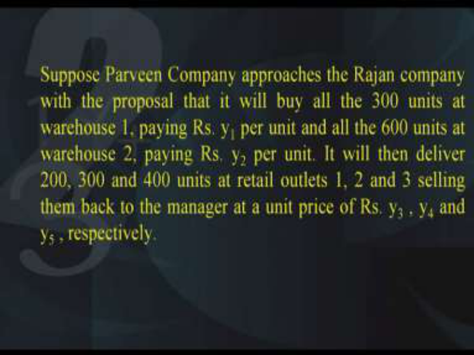

Now suppose there is another company which is called as Parveen Company approaches the 

Rajan Company with the proposal that it will buy all the 300 units of warehouse 1 by paying rupees y1 per unit and all the 600 units of warehouse 2 paying rupees of y2 per unit and once it has done this then it will then deliver 200, 300 and 400 units at the retail outlets 1, 2 and 3 selling them back to the manager at a unit price of rupees y3, y4 and y5. So basically the idea is that an intermediate manufacturer, let us say by the name of Parveen Company has entered into the picture and he has given a proposal that first it will transport from the warehouses and then supply them to the retail and this is done with the help of new variables y1, y2, y3, y4 and y5 as has been mentioned just now. 

**(Refer Slide Time: 37:19)** 

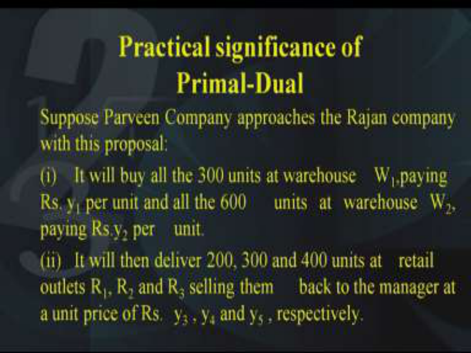

Once this is done, we need to see what is the practical significance of the primal-dual. Now suppose, the Parveen Company approaches the Rajan Company with this proposal as has been mentioned earlier, it will buy all the 300 units at warehouse Wi by paying rupees y1 per unit and all the 600 units of warehouse Wi by paying y2 per unit and secondly it will then deliver 200, 300 and 400 units of retail outlet R1, R2, R3 by selling them back to the manager at a unit price of rupees y3, y4 and y5 respectively. **(Refer Slide Time: 38:25)** 

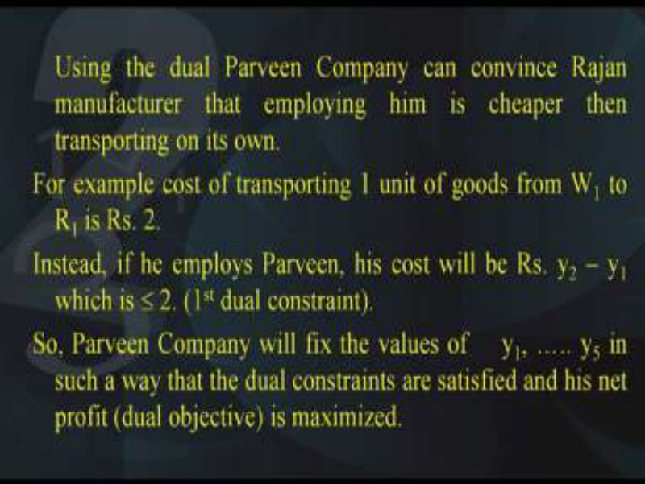

Using this concept of the dual, the Parveen Company can convince the Rajan Company that employing him will be cheaper than by transporting the goods on his own. Now this is really very interesting. In order to prove this, let us look at an example. For example, the cost of transporting 1 unit of goods from W1 to R1 is rupees 2 right. That is given in the problem, so the first entry is 2. 

Now instead of this, instead of doing this if the Parveen Company is employed his cost will be rupees y3 – y1 and which is  2. Why? Because it is the first dual constraint, it is the first dual constraint, similarly for the other entries of the table. Therefore, what do we conclude that the Parveen Company will fix the values of y1, y2, y3 etc in such a way that the dual constraints are satisfied and he is met with the dual objective is maximized. So therefore, although it looks very surprising but we have shown with the help of the primal and the dual construction instead of transporting the items on his own if the given company Rajan Company hires a Parveen Company who will do the intermediate part. That is first buy from the warehouse and then supply to the retail outlets; this is going to cost less. Therefore, the significance of taking the primal and the dual is justified. 

**(Refer Slide Time: 41:03)** 

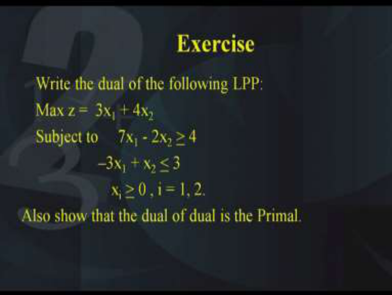

So we come to the conclusion and I have an exercise for you. Write down the dual of the following linear programming problem. Maximization of 3x1 + 4x2 subject to 7x1 - 2x2 <u>> 4,</u> –3x1 + x2 <u>< 3, all the decision variables x1 and x2 should be > 0. Once you have written the</u> dual, I also want you to show or prove that the dual of the dual is the primal. 

You will observe that purposely I have given you 2 constraints in which one of them is of the greater than equal to type; the other is of the less than equal to type. Before you write the dual, make sure that maximization objective function goes with less than equal to inequalities and vice-versa. So we conclude this lecture and I hope that you will be able to write this exercise. Thank you. 

