# **Operations Research Prof. Kusum Deep Department of Mathematics Indian Institute of Technology – Roorkee** 

# **Lecture - 16 Weak Duality Theorem** 

Good morning students. Today, we will learn the weak duality theorem which is a theorem which shows a relationship between the feasible solutions of the primal viz-a-viz the dual. 

**(Refer Slide Time: 00:44)** 

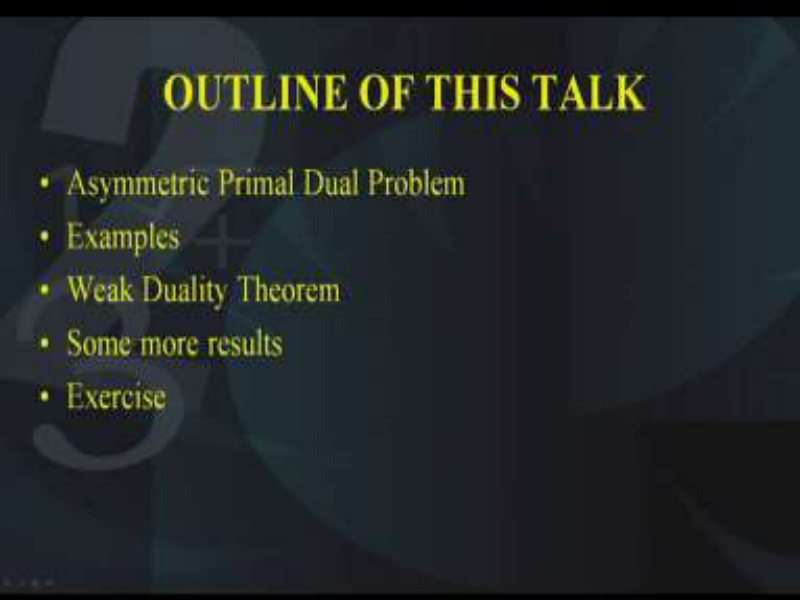

The outline of today's talk is as follows. First of all, we will learn what is the meaning of asymmetric primal dual. You remember, in the last lecture we had learned the definition of a symmetric primal dual problem. Today, we will learn what is the definition of an asymmetric primal dual problem. We will take an example and after that we will learn the weak duality theorem, its statement and its proof in two ways. 

Then, we will look at some of the results that can be derived from the weak duality theorem. Finally, I would like to give you an exercise as homework. **(Refer Slide Time: 01:45)** 

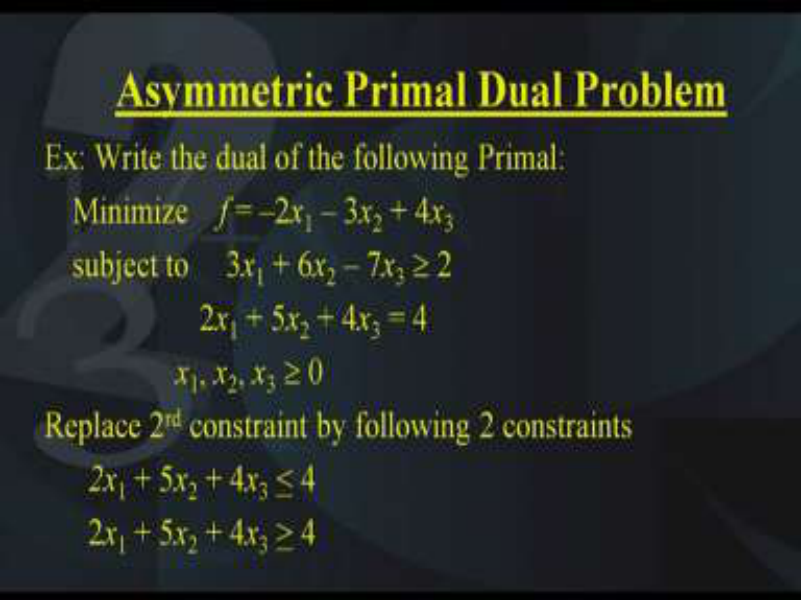

So the first thing we need to learn is the definition of an asymmetric primal dual problem. This can be understood with the help of the following example. Suppose, we have to write the dual of the following linear programming problem, that is minimize f which is –2 _x_ 1 – 3 _x_ 2 + 4 _x_ 3, this is subject to 3 _x_ 1 + 6 _x_ 2 – 7 _x_ 3  2 and the second constraint is 2 _x_ 1 + 5 _x_ 2 + 4 _x_ 3 = 4; x1, x2 and x3 are all greater than or equal to 0. 

Now in this problem, we find that this is not in the standard form of the primal or it is not in the standard form of the dual because if you recollect from the previous lecture, the primal standard form is minimization of objective function and greater than equal to type constraints or maximization of objective function and less than equal to constraints, but in this given problem we have the second constraint as an equality. Therefore, we need to think what we can do about it. One suggestion is we can rewrite the second constraint like this. That _2x_ 1 + 5 _x_ 2 + 4 _x_ 3 <u>< 4 and similarly 2</u> _x_ 1 + 5 _x_ 2 + 4 _x_ 3 <u>> 4. That means we have written the equality in</u> terms of both the conditions that is greater than as well as less than. Since we are going to take the intersection of all the constraints, automatically if we impose these two constraints then the equality will be satisfied. 

**(Refer Slide Time: 04:45)** 

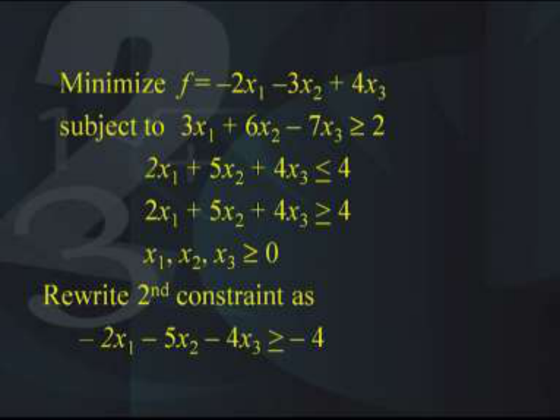

But still it is not in the standard form, so therefore what we need to do, we need to write it in the standard form and the second constraint has been replaced by these 2 constraints where one is with the less than sign and the other is with the greater than sign. However, since it is not in the standard form, we need to convert all the constraints in the greater than type. 

Therefore, we will convert the second constraint like this, _– 2x_ 1 – 5 _x_ 2 – 4 _x_ 3 <u>> – 4. Why we</u> have done this? We have done this because we have to convert the problem in the standard primal or the standard dual form and with the minimization we need to have the constraints of the type greater than or equal to. So therefore, the second constraint is now converted to greater than or equal to type. 

**(Refer Slide Time: 05:57)** 

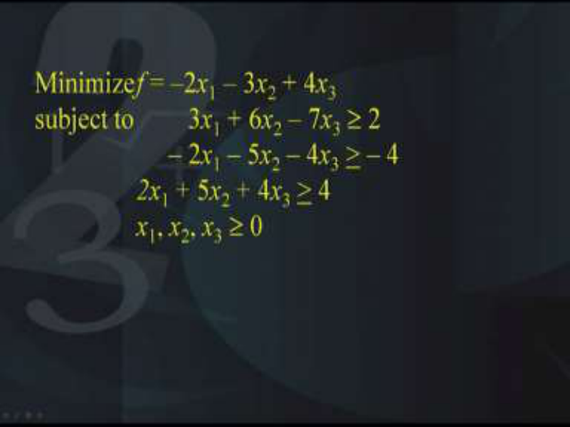

And that is what we get, we get 3 constraints, all the three constraints are of the greater than equal to type. Of course, x1, x2, x3 are all  0. Please do not worry about the right-hand side being negative because at the moment we are not bringing it in the standard form for solving the problem by the simplex method. We are only interested in converting the given problem in the standard form of the primal. 

# **(Refer Slide Time: 06:36)** 

So now that we are ready with the primal form, the standard form of the primal problem that is we are having the objective function as minimization of –2 _x_ 1 – 3 _x_ 2 + 4 _x_ 3 subject to 3 _x_ 1 + 6 _x_ 2 – 7 _x_ 3  2 and the second constraint is – 2 _x_ 1 – 5 _x_ 2 – 4 _x_ 3 <u>> – 4 and the third constraint is</u> _2x_ 1 + 5 _x_ 2 + 4 _x_ 3 <u>> 4. This is in the standard form for the primal and now we are ready to write its</u> dual. 

So as before, we will write the dual as follows. The objective function will become maximization and the right-hand side coefficients of the primal will become the coefficients of the objective function. So therefore, the color code indicates that the right-hand side entries of the primal that is 2 -4 and 4, they will be the coefficients of the objective function and that is what is happening. So we will be maximizing 2y1 – 4y2 + 4y3 right. Again, the conditions on the inequalities, the coefficients have to be changed as far as these Aij’s are concerned, so the transpose has to be taken, the rows becomes the columns and the columns become the rows. So therefore, we should have 3y1 – 2y2 + 2y3 <u>< – 2. Similarly, 6y1 – 5y2 + 5y3 < – 3, –</u> 7y1 – 4y2 + 4y3 <u>< 4 and all the three variables y1 , y2 , y3 > 0.</u> 

The cost coefficients of the primal have become the right-hand side of the dual as is being indicated with the color coding. So is this all my question is should we be satisfied by this 

form of the problem or not? So let us look at if we can simplify it further or not. Can you make an observation by which we can further simplify this dual? I am giving you the hint regarding the coefficients of y2 variables and y3 variables in the entire dual. 

Yes, that is right; you can observe that the coefficients of y2 and y3 are the same. Therefore, what we are going to do is the following. We are going to replace y2 – y3 variable by another variable let us say y* in the entire problem. So once we do this substitution, we will be left with 2 variables in the dual instead of the 3 variables in the dual. 

**(Refer Slide Time: 10:53)** 

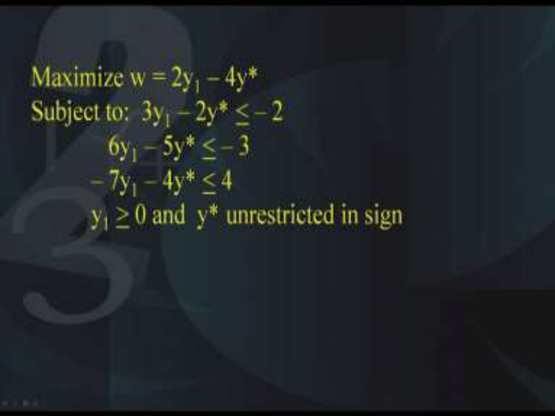

So therefore, what do we get, we get the following problem, maximization of 2y1 – 4y* subject to 3y1 – 2y* <u>< – 2, 6y1 – 5y* < – 3, – 7y1 – 4y* <</u> 4. Of course, y1 <u>></u> 0 and y* is unrestricted in sign that is y* could take either positive values or negative values. So that is what is the trick behind the entire substitution that we have substituted y* in place of y2-y3. What is the benefit of this? The benefit is that we have reduced the number of variables from 3 to 2 and we have got a relationship between the primal and the dual. 

Now the question is what is that relationship, the relationship is that corresponding to the equality constraint of the primal we have an unrestricted variable of the dual because let us go back to the problem. The given problem was this that is in the second constraint we had the equality and therefore the equality constraint of the primal is reflected as an unrestricted variable in the dual. Let me repeat, the equality constraint of the primal is reflected as an unrestricted variable of the dual and that is what is happening here if you look at the final dual that we have, y* is the dual variable which is unrestricted in sign and this is corresponding to the equality constraint of the primal. 

# **(Refer Slide Time: 13:28)** 

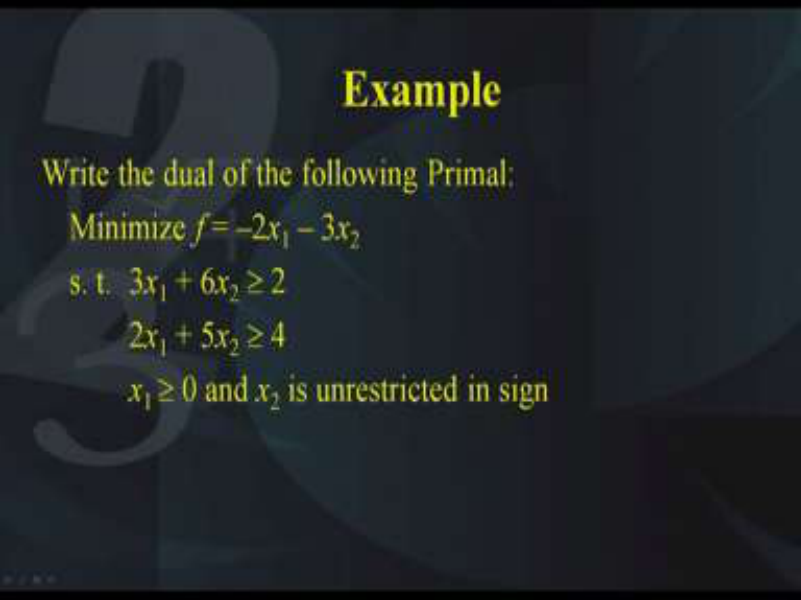

Okay another example, suppose we want to write the dual of the following problem, the problem is minimization of –2 _x_ 1 – 3 _x_ 2 subject to 3 _x_ 1 + 6 _x_ 2  2 and the second constraint is 2 _x_ 1 + 5 _x_ 2  4, x1 is  0 whereas x2 is unrestricted in sign. Now this is the primal that is given to us and we have to think how we can write its dual. As you know that when you have an unrestricted variable, it can be represented as the difference of two variables which are both  0. So we are going to make this substitution. Substitute _x_ 2 = _x_ 3 – x4  in the entire problem and we know that _x_ 3 <u>> 0, x4 > 0. So with this substitution, although we will be increasing the</u> number of decision variables from 2 to 3 but the advantage that we will get all the decision variables will be > 0. 

# **(Refer Slide Time: 15:16)** 

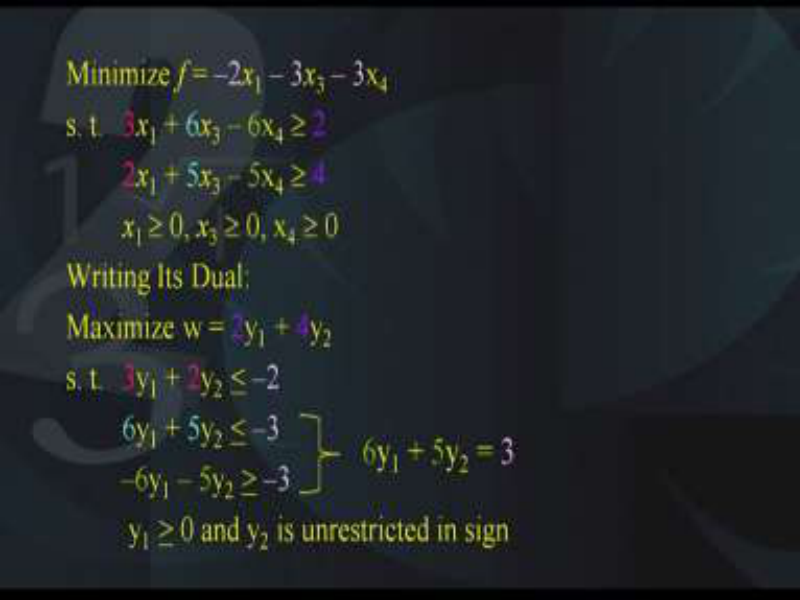

So we make the substitution in the entire problem and that is the problem that we get. We get minimization of –2 _x_ 1 – 3 _x_ 3 + 3x4 subject to the conditions again where we have substituted x3-x4 in place of x2. This has to be done in the entire problem and of course we have to make sure that x1, x3 and x4 are all  0. Now this is the primal in the standard form. Now we are ready to write its dual. 

So the dual is as follows, maximization of 2y1 + 4y2 subject to 3y1 + 2y2 <u>< –2, 6y1 + 5y2 < –3,</u> –6y1 – 5y2 <u><</u> 3and y1 , y2 <u>></u> 0. So we have now successfully written the dual of the given problem but is there a way in which we can simplify this problem further. If you observe the constraints, you will find that the second constraint and the third constraint have a relationship and what is the relationship? that is you can write them as an equality so here you are. The second and the third constraint can be written as 6y1+5y2=-3 and y1 is <u>> 0 and</u> y2 is an unrestricted variable. 

# **(Refer Slide Time: 17:36)** 

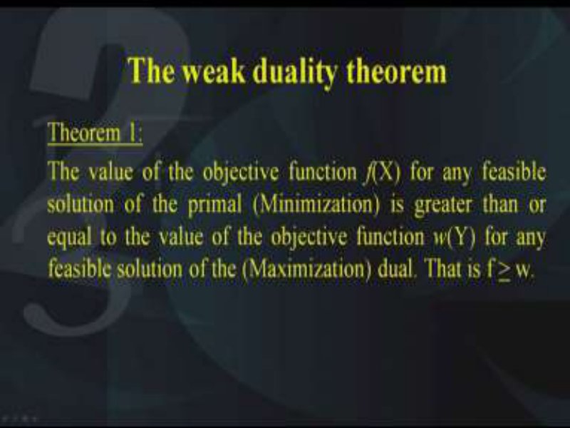

So with the help of this example, I hope we have understood what is the way in which the unrestricted variables of the primal are related with the equality constraints of the dual. Now let us look at what we mean by the weak duality theorem. This theorem is stated as follows. The value of the objective function f(X) for any feasible solution of the primal which is in the form of the minimization type is greater than or equal to the value of the objective function let us say w(Y) for any feasible solution of the maximization dual. In other words, the theorem states that f > w. Please note that the primal should be in the minimization type and of course the constraints should be greater than type and the dual should be of the maximization type and the constraint should be less than equal to type. Only then this condition f is greater than or equal to w will be satisfied. 

# **(Refer Slide Time: 19:06)** 

It is a very famous theorem and it tries to give you a relationship between the feasible solutions of the primal and the dual. Please note, they are not necessarily the optimum solutions, they are the feasible solutions. So we need to find out the proof for this. Here is the proof. Let us suppose that the primal problem is given by minimization of f(X) = c1x1 + c2x2 + … + cnxn  and this is subject to a11x1 + a12x2 …+ a1nxn <u>> b1, am1x1 + am2x2 … + amnxn > bm,</u> all the xi’s are  0. So this is the standard form of the primal where the objective function is in the minimization type and the constraints are in the greater than type. 

**(Refer Slide Time: 20:32)** 

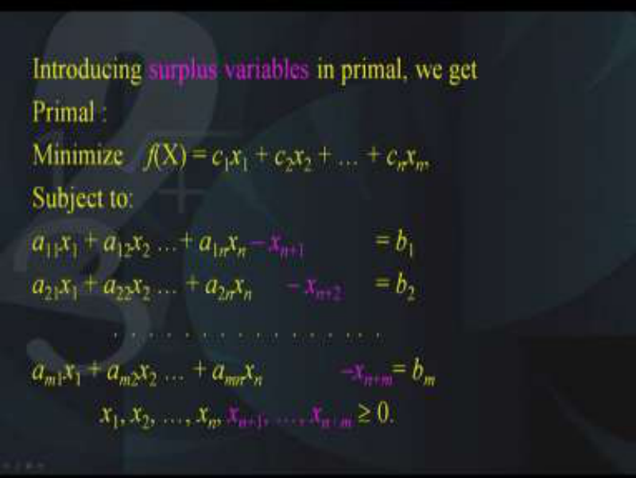

Now the corresponding dual of this problem can be written but before that we will need to introduce the surplus variables because we have the greater than constraints. So the greater than constraints have to be converted into the equality type. Therefore, we need to introduce 

the surplus variables in the primal and we get the following problem, minimization of c1x1 + c2x2 + … + cnxn  subject to a11x1 + a12x2 …+ a1nxn – xn+1 = b1. Please note we have to introduce this purple-colored variable which is nothing but a surplus variable. Now the surplus variables have to be subtracted from each of the constraints because in the primal our constraints were of the greater than equal to type. Since we have to convert the greater than equal to type to the equality type, we need to subtract the surplus variables. Once we have done this, then all the constraints are converted into equality type. Therefore, we have the decision variables x1, x2, …, xn, xn+1, …, xn+m, all of them will be greater than or equal to 0. 

**(Refer Slide Time: 22:17)** 

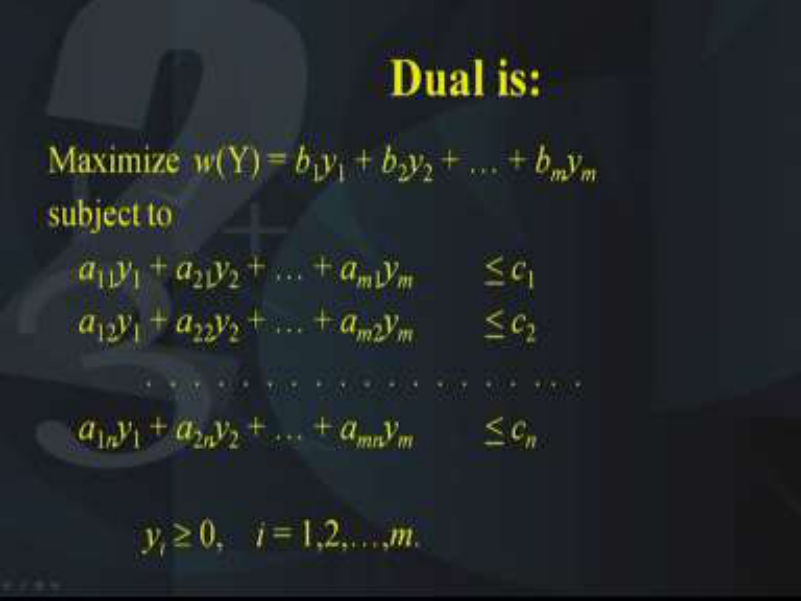

Now coming to the dual of the problem, the dual of the problem can be written as maximization of w(Y) = b1y1 + b2y2 + … + bmym and this is subject to the conditions of the type less than equal to. So you have a11y1 + a21y2 + … + am1ym <u>< c1, so all these constraints</u> are of the less than equal to type. Of course, the decision variables yi’s of the dual have also to be greater than or equal to 0 and they are m in number. **(Refer Slide Time: 23:15)** 

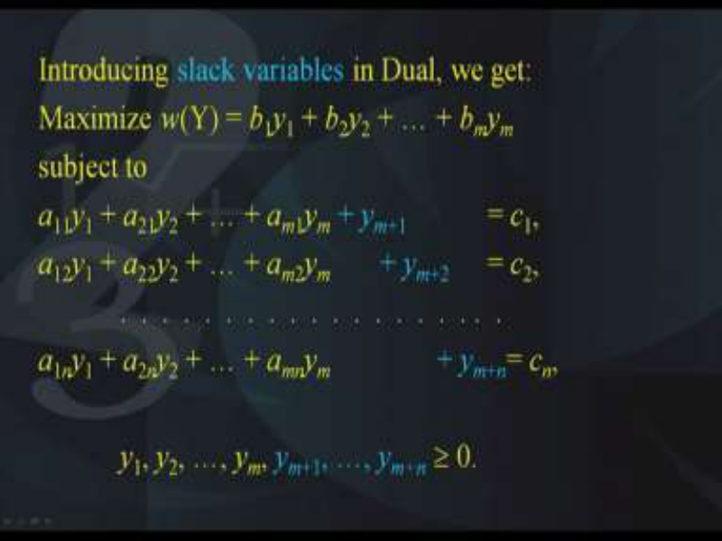

Again, we need to convert the constraints of this dual into equality and for doing this we need to add slack variables to each of the constraints. Therefore, we will add slack variable by ym+1 to the left-hand side of the first constraint. Similarly, we will add ym+2 to the second constraint and like this and finally we get a system of equations where which are all in the form of equality. 

So what we have done basically, in the primal we have subtracted the surplus variables to make the inequalities into equalities and similarly in the dual we have added the slack variables to convert the less than equal to sign to the equality sign. Of course, all the variables have to be > 0. 

# **(Refer Slide Time: 24:27)** 

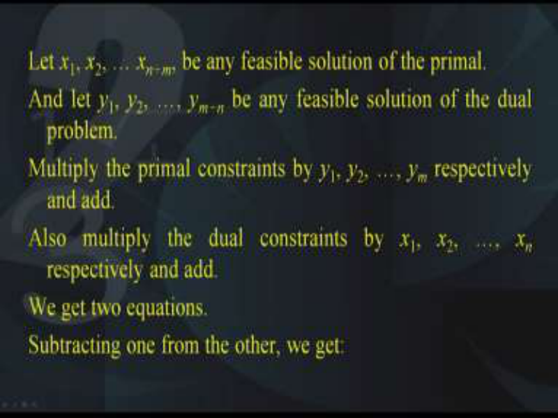

Now let us suppose that x1, x2, … xn+m be any feasible solution of the primal because remember we have to show the condition for any feasible point. So let x1, x2, … xn+m be any feasible solution of primal and similarly let y1, y2, …, ym+n be any feasible solution of the dual. Now we will multiply all the primal constraints by the respective variables y1, y2 etc. That is the first constraint will be multiplied by y1, second constraint will be multiplied by y2 etc and all this will be added. Similarly, we will multiply all the dual constraints by their respective variables, that is x1, x2 etc. That is the first constraint of the dual will be multiplied by x1, the second constraint will be multiplied by x2 and so on and they will be added. Now we get two equations corresponding to the first and the second and when we do this we subtract one from the other. So these two equations have now to be subtracted and on subtracting we get the following. 

# **(Refer Slide Time: 26:16)** 

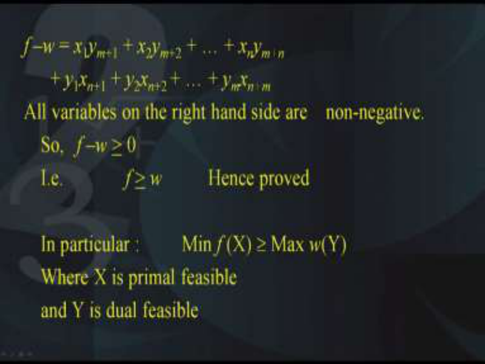

We get f –w = x1ym+1 + x2ym+2 + … + xnym+n + y1xn+1 + y2xn+2 + … + ymxn+m. Now if you observe the right-hand side of this equation how do you find? Yes, you find that all the variables on the right-hand side are <u>> 0 because that is what they are the primal variables and</u> the dual variables. None of them is unrestricted in sign, all of them are <u>></u> 0. Therefore, the right-hand side is > 0 and this implies that f > w. 

Hence, we have proved the theorem that for any feasible solution of the primal and any feasible solution of the dual, we have the following relationship that f <u>></u> w. Please note, in particular what happens, minimization of _f_ (X)  maximization of _w_ (Y) where X is the primal feasible and Y is the dual feasible because this result is actually a corollary to this theorem because this theorem is applicable for all feasible solutions. 

And therefore, since minimization has to be taken over all the feasible solutions, hence this corollary follows from the theorem immediately. 

**(Refer Slide Time: 28:21)** 

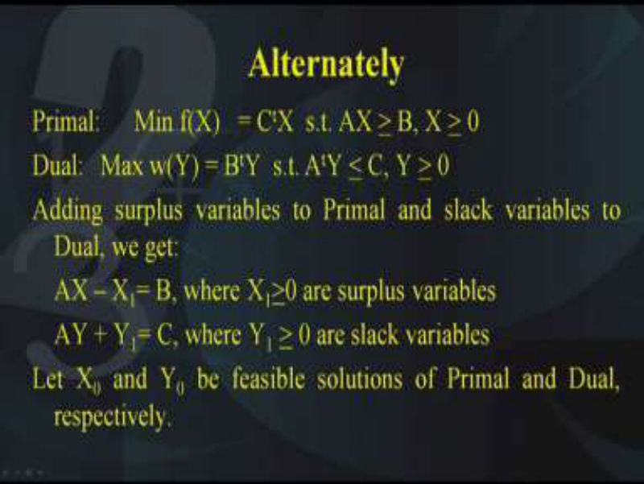

Alternatively, we can write the proof of the theorem as follows. Let the primal be minimization of f(X)   = Ct X  subject to AX > B, X > 0 and dual be maximization of w(Y) = Bt Y subject to At Y <u><</u> C, Y <u>></u> 0. Now adding surplus variables to the primal and slack variables to the dual, we get AX-X1=B where of course your X1 should be <u>> 0, they are the</u> surplus variables. Similarly AY+Y1 should be=C where Y1 is <u>> 0 are the slack variables.</u> Now, this is basically the way in which we can prove the theorem in the vector notation. So I hope you understand that capital X stands for small x1, x2, xn; capital Y stands for small y1, y2, ym. 

Now let X0 and Y0 be feasible solutions to the primal and the dual respectively. 

**(Refer Slide Time: 29:55)** 

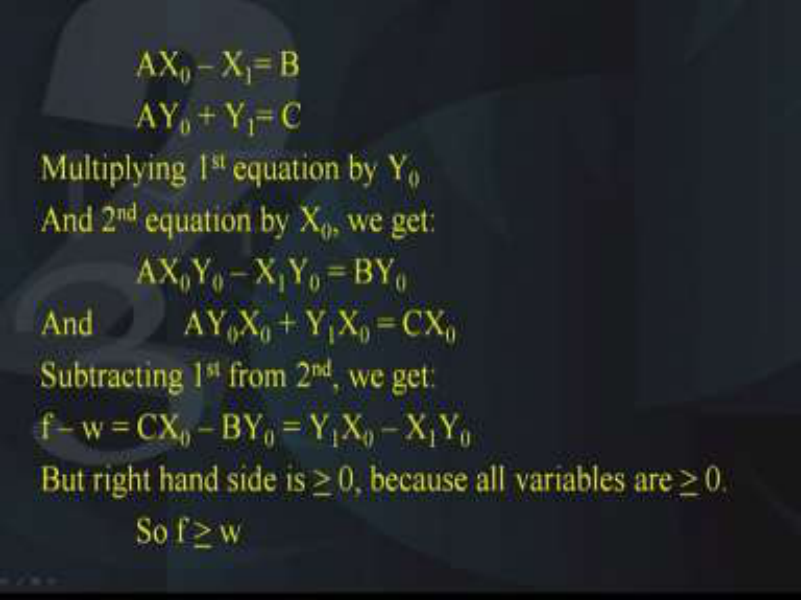

Therefore, we can substitute this in the given conditions and we get AX0 – X1= B, similarly AY0 + Y1= C. Now we will multiply the first equation by Y0 and we will be taking their sum and add second equation by X0 and then we add them and we get AX0Y0 – X1Y0 = BY0, that is the first equation. Similarly, AY0X0 + Y1X0 = CX0. Now subtracting the first equation from the second, we get f – w = CX0 – BY0 = Y1X0 – X1Y0 . 

Now the right-hand side as you know is all greater than or equal to 0 because they are the primal variables and the dual variables. Hence, f > w, so this is just another alternative way in which the weak duality theorem can be proved. 

**(Refer Slide Time: 31:30)** 

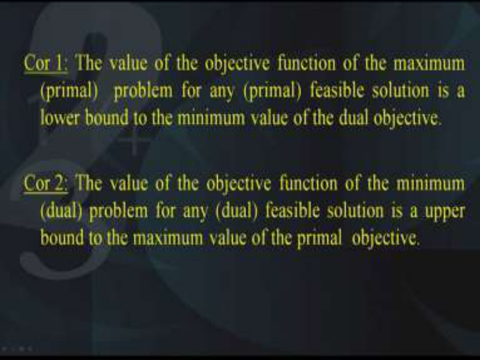

Now we have some results which can be derived from the weak duality theorem. The first corollary I will call it as corollary 1 is as follows. The value of the objective function of the maximum primal problem for any primal feasible solution is a lower bound to the minimum 

value of the dual objective. So therefore, the weak duality theorem gives us a lower bound for any feasible solution of the dual objective. 

Similarly, we can write corollary 2 as follows. The value of the objective function of the minimum dual problem for any dual feasible solution is a upper bound to the maximum value of the primal objective. The idea is that these 2 corollaries give us a lower and an upper bound for the primal and the dual respectively using the theorem and they are intuitive and follow directly from the theorem. 

**(Refer Slide Time: 32:57)** 

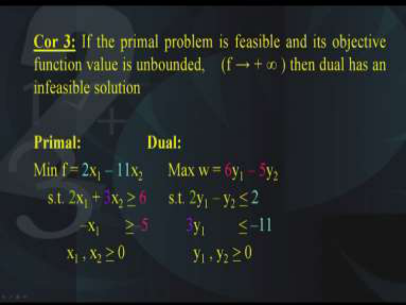

Another interesting corollary is the third corollary that is if the primal problem is feasible and its objective function value is unbounded that is if f → + ∞  then the dual problem has an infeasible solution. So till now we have not been talking about the unbounded case and the infeasible case but the third corollary tells us the relationship between unbounded solution and infeasible solution of the primal and the dual respectively. That is if the primal problem is there which is feasible and its objective function is going to infinity that is it is unbounded, then automatically the dual will be infeasible. Now this needs some clarification. Therefore, let us take a primal at a dual, so the primal is a simple two variable problem that is minimization of f = 2x1 – 11x2 subject to 2x1 + 3x2 <u>></u> 6 and the second constraint is –x1 <u>> –5, both x1 and x2 are > 0.</u> 

Now if you write the dual of this problem, the dual of the problem is maximization of w = 6y1 – 5y2 subject to 2y1 – y2 <u>< 2, 3y1 < –11 and y1 and y2 are > 0.</u> 

**(Refer Slide Time: 35:04)** 

Next, let us look at the solutions and see what happens in the solutions. So there are the solutions of the primal and the dual respectively, what do you find, you find that the objective function value of the primal is unbounded. Here you can see that the objective function value is going towards infinity, +infinity in fact, it is going to +infinity. It is going towards the upward direction as is being indicated by the family of straight lines which represents objective function. Of course, the domain is feasible but the objective function value is going to infinity, this is the primal. The feasible domain is unbounded and it is feasible and unbounded and objective function is going to infinity. 

Now if you look at the dual, the dual can be plotted and you can see clearly that the dual is infeasible. The dual has an infeasible solution and therefore what we had mentioned in the third corollary. 

That is if the objective function goes to infinity of the primal, then the dual will become infeasible. 

**(Refer Slide Time: 36:41)** 

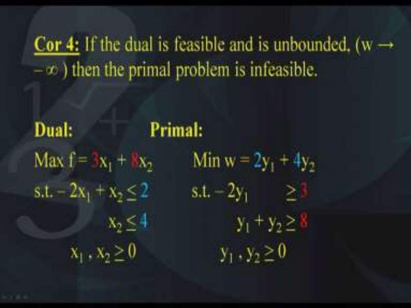

Okay the corollary number 4, if the dual is feasible and is unbounded that is w goes to negative infinity that is it is unbounded in the negative direction, then the primal problem is infeasible. So here again let us look at this dual and its corresponding primal. The dual is f = 3x1 + 8x2 subject to – 2x1 + x2 <u>< 2, x2 < 4, x1 and x2 are > 0 and the corresponding primal is</u> minimization of w = 2y1 + 4y2 subject to – 2y1 <u>> 3 and y1 + y2 > 8 and y1 and y2 are > 0. So</u> we need to check the solutions of both the dual and the primal. **(Refer Slide Time: 38:07)** 

So the dual should be unbounded, let us see whether it is unbounded or not. Yes, here are the graphs, you can look at the graphs and you find that the feasible domain of the dual is unbounded and objective function value is going to -infinity and on the other hand the primal is infeasible. Hence, it can be clearly seen that the corollary 4 is satisfied. **(Refer Slide Time: 38:42)** 

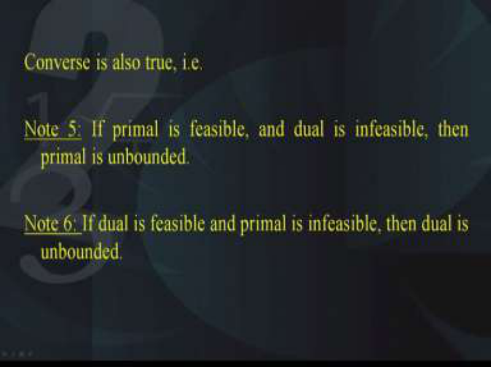

What about the converse, now the converse is also true, how, let us look at note 5. If the primal is feasible and dual is infeasible, then primal is unbounded and also if the dual is feasible and the primal is infeasible, then dual is unbounded. So both these notes are related to the converse of what we had done in the corollary 3 and the corollary 4 okay. **(Refer Slide Time: 39:22)** 

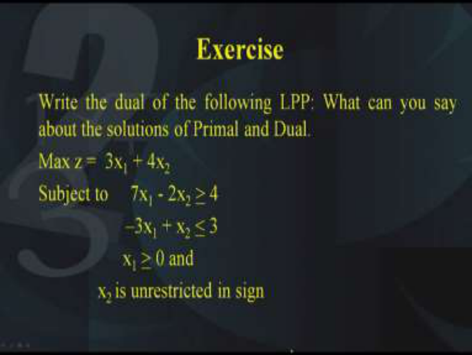

So with this we come to an end of this lecture but before I depart, I want you to write the primal and the dual and also try to find out the solutions of the primal and the dual and then in the next lecture we will see what other relationships exist between the primal and the dual. So we have an exercise for you that is write the dual of the following LPP and what can you say about the solutions of the primal and the dual. 

Try to find out the solutions of the primal and the solution of the dual and see if you can find out a relationship between the two. So the problem is maximization of z =  3x1 + 4x2  subject to 7x1 - 2x2 <u>> 4, –3x1 + x2 < 3 and x1 is > 0 whereas x2 is unrestricted in sign. Remember, in</u> the symmetric problem we have all the constraints are of the inequality type and all the decision variables are greater than or equal to type. 

However, in the asymmetric cases, this need not hold. There could be a situation where the constraints are of the equality type and the decision variables are of the unrestricted type and in this example we have it is given to us that x2 is unrestricted in sign. So I wish you all the best and try to find out the solution of the primal and the dual. Thank you. 

