# **Operations Research Prof. Kusum Deep Department of Mathematics Indian Institute of Technology- Roorkee** 

# **Lecture  –20 Sensitivity Analysis-I** 

Good morning students. Today we will be learning lecture number 20 on the topic duality and sensitivity analysis. The title of todays lecture is sensitivity analysis. Till now we have seen what do we mean by duality, its theorems and what are the relationships between the primal and the dual. 

**(Refer Slide Time: 00:56)** 

So, for today’s lecture we will look at the topic of sensitivity analysis. The meaning of sensitivity analysis is that suppose a linear programming problem is given to us, and we have obtained its solution by any of the methods that we have studied till now. Now we want to make a slight change in the initial data of the problem whether it is in terms of the cost coefficients or whether it is in terms of the right hand side or whether it is in terms of decision variables or constraints. Then what will be the effect of that slight change in the initial data on to the final optimum solution. So we will study the various methods how to analyse given a problem, how to analyse the effect of small change of the initial data on to the final optimum solution instead of solving the entire problem all over again. 

So the outline of todays lecture is we will look at some of the various possibilities that could exist in terms of the slight change that we are talking about. We will study all this with the help of an example and finally an exercise. So let us suppose we are given LPP of this form that is minimization of CX subject to AX < b ; X > 0 where the c is matrix of the type c1,c2,…cn etc. A is a matrix aij. 

Similarly B is the right hand side that is bj; b1, b2,….,bm and X is the decision variables x1,x2,…xn. So we are assuming that we have n decision variables and we are having m constraints. Now sensitivity analysis is the effect of the changes in the input data on the final optimum results. So basically it means instead of solving the problem all over again we want to observe what happens if a slight change is made in the initial data. 

**(Refer Slide Time: 04:21)** 

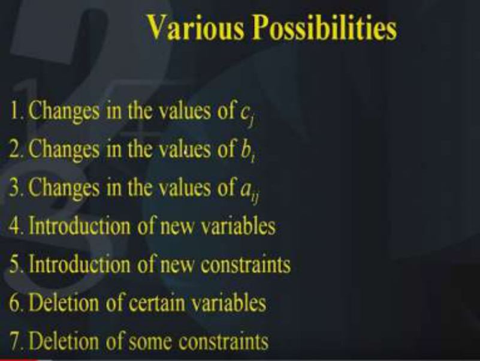

So what are the various possibilities? Let us study each of them. First of all suppose there are changes in the values of the cost coefficients, that is, the cj’s (c1,c2,…..,cn). Secondly, we will study what happens if there are changes in the values of the right hand side, that is, the bj’s. Thirdly, we will look at the changes in the values of aij that is the coefficients of the constraints. Forth, we will see what happens if we want to introduce a new variable into the problem. Fifth, we would like to introduce a new constraint into the problem. Sixth suppose we want to delete a certain variable we want to see what will be effect its effect and seventh is the deletion of some constraint. So let us look at each of these possibilities separately one by one. 

# **(Refer Slide Time: 05:37)** 

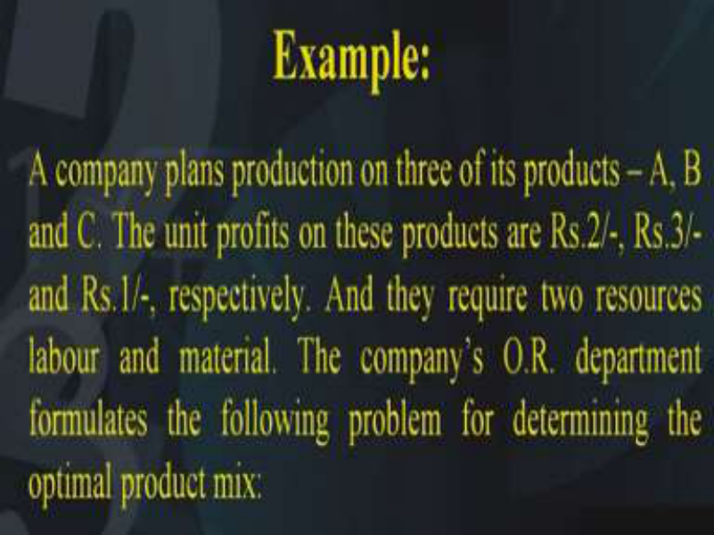

We will study with the help of this example. Now suppose there is a company which plans production on three of its products A, B and C. The unit profits on these products are given to be rupees 2, rupees 3 and rupees 1 respectively. And they require two resources labour and material. The company’s O.R. department formulates the following problem for determining the optimum product mix. **(Refer Slide Time: 06:30)** 

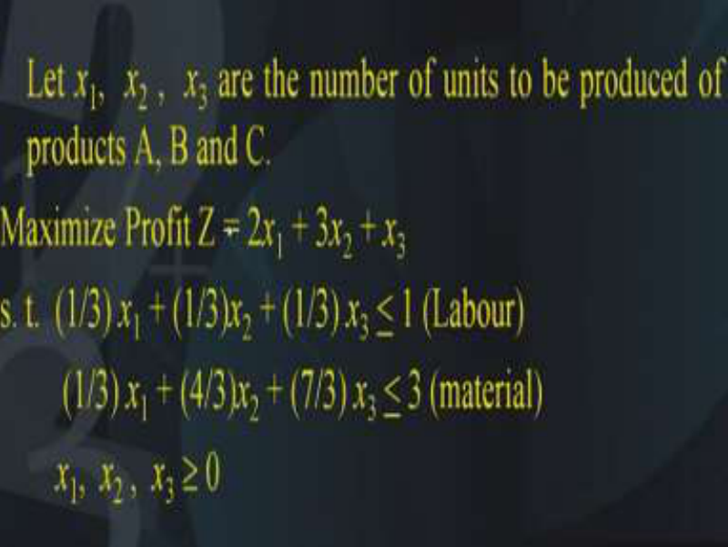

Let us assume that the variables are x1, x2 and x3. These are the number of units to be produced of the products A, B and C. Now we want to maximize the profit. So the profit is z = 2 _x_ 1 + 3 _x_ 2 + _x_ 3.Why is that so? because it is given in the problem, that the profit of one unit of x1 is 2, the profit of one unit of x2 is 3 and the profit of one unit of x3 is 1. So overall profit is 2 _x_ 1 + 3 _x_ 2 + 

_x_ 3. Now there are two constraints one is for the corresponding to the labour and the second is corresponding to the material. It is given that the labour constraint is (1/3) _x_ 1 + (1/3) _x_ 2 + (1/3) _x_ 3 <u>< 1  and the second constraint for the material is (1/3)</u> _x_ 1 + (4/3) _x_ 2 + (7/3) _x_ 3 <u>< 3. And of course</u> all the three variables x1, x2 and x3 should be  0. 

**(Refer Slide Time: 08:24)** 

Now this is the LP model that is given to us. We will solve it with the help of our usual simplex method and record the initial table and the final table in this tableau. So in the top row if you look at it we will write down the entries corresponding to the objective function coefficients that is 2,3,1,0 and 0. Now the initial table has the basis x4 and x5 because both the constraints are of the < type and therefore we need to add slack variables. So the basis will be x4 and x5 and their coefficients in the objective function is 0 and 0. The column under x1 will be 1/3, 1/3. Similarly column under x2 will be 1/3, 4/3; column under x3 will be 1/3,7/3; and x4 will be 1,0; x5 will be 0,1 and the right hand side is 1,3. As you know that next we need to find out the deviation entries. So therefore 2 – (0, 0) (1/3, 1/3)t gives you 2 and similarly the other entries this will come out 3,1,0,0. x4 and x5 are the basic variables so the entry will be 0 and the objective function value is Z=0. Why? Because x4 and x5 are not appearing in the objective function. So this is our initial table now suppose we have performed our simplex method and we have got the optimum solution. 

The optimum solution to this problem is as follows. The basis is x1 and x2; entries in table are 1,0; 0,1; -1,2; 4,-1; -1,4 and the right-hand side is 1,2. The coefficients of x1 is 2 in the objective function and coefficient of x2 is 3 in the objective function. And let us now calculate the deviation entries 2 – (2, 3) (1, 0)t is 0 anyway this is a basic variable. So straight away we can put these two entries as 0.  And third entry is 1- (2, 3) (-1, 2)t which comes out to be -3; similarly fourth entry is- 5 because it is nothing but 0 – (2, 3) (4,-1)t which comes out to be -5 and similarly last entry -1. Now what you find, you find that all the entries in this deviation rows is either 0 or negative. And it means this is the final optimum solution. With an objective function value Z = 8. Now if you watch carefully in this table I have highlighted certain entries. What are those entries? It is this sub matrix this sub matrix is (1/3, 1/3; 1/3, 4/3) and similarly (4,-1;-1, 1). Now why are these entries shown in a different colour is because 4,-1 corresponds to 1, 0. So 4,-1 is in the optimum table and 1, 0 is in the initial table. Similarly-1, 1 is in the final table, this corresponds to 0,1 in the initial table and similarly 1/3,1/3 corresponds to 1,0 in the final table and 1/3,4/3 of the initial table corresponds to 0,1 of the final table. 

And as you already know that this is nothing but b and this is nothing but b inverse. So this matrix shown in blue in the initial table is nothing but the inverse of this matrix which is shown in the final table. And this is the way the simplex multipliers are obtained as you have seen in the case of duality. 

# **(Refer Slide Time: 14:22)** 

So now coming to our problem of looking at the sensitivity analysis, suppose we have a slight change in the initial data, what will happen to the solution? First of all we will study the variations in the coefficients of the objective function. That is what was the objective function let us go back to the objective function. The objective function was 2x1+3x2+x3. Now we will look at the first case. 

The Case 1 is corresponding to the non-basic variable of the optimum table. So we will look at the optimum table what is the optimum table? What is the non-basic variable in the optimum table? x3 is the non-basic variable in the optimum table. So we need to change cB = (2, 3). Then we will calculate the deviation entries corresponding to c3, 3  is obtained as 3= c3 - (2,3) (-1,2)t why is that so? why is (-1,2)? Let us go back here it is (-1, 2). So the cB is this vector (2, 3) and it has to be multiplied by (-1, 2), in order to calculate this deviation entry. So what do we have 3= c3 - (2,3) (-1,2)t and this we get an expression in terms of c3 that is c3– 4? 

Now as you know that for optimality 3 should be < 0. So 3  is now c3 – 4 that means that this quantity should be < 0, that is c3 should be < 4. Therefore what do we conclude? We conclude that as long as the unit profit on the product number C is < rupees 4 it is not economical to produce product C because then this constraint will be violated and it will become > 0. Therefore in order to maintain optimality c3 should be < 4. Now this was the case when we had made changes in the non-basic variable. 

# **(Refer Slide Time: 18:24)** 

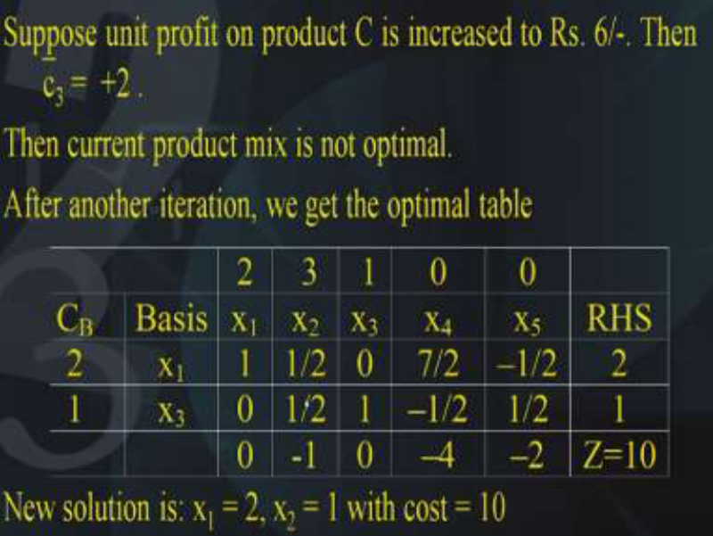

Suppose the unit profit on product C is increased to rupees 6, we have seen that it should be < 4. Suppose it is increased to 6 then what will happen? Then 3 will become +2, means it will become > 0.  And this means that the optimality has been disturbed because this current product mix is not optimum. This solution is not optimum any longer because the 3  entry has become > 0 and as you know that this entry should be < 0.  Therefore what is the remedy? The remedy is that we have to perform another iteration and by performing another iteration this is the optimum table that we get. We get the basis as x1 and x3 and its coefficients in the objective function as 2 and 1, bases is 1,0; x2 is 1/2,1/2; x3 is 0,1; x4 is 7 /2,-1/2; x5 is-1/2,1/2 and the right hand side is 2 and 1. Of course you can just make sure that this is the optimum table by observing the entries in the deviation row.  And what are these entries? 0 because it is the basic variable,-1 because this is obtained by 3 – (2, 1) (1/2, ½). Again x3 is a basic variable, so it is entries 0, this one is 0 – (2, 1) (7/2,-1/2)t which comes out to be – 4 and this entry is 0 – (2, 1) (- 1/2, ½)t which comes out to be –2. And these are all either 0 or negative hence this is the optimum solution and the objective function value that is the profit is 10 rupees. 

So the new solution that is obtained is x1=2 and x3=1 with a cost of rupees 10. So what does this mean? This means that if the cost has been changed to rupees 6, then the solution remains no longer optimum and we have to perform another iteration to reach to the optimum solution. Now let us look at case number 2 . 

**(Refer Slide Time: 22:04)** 

This case number 2 corresponds to a change which is made in the basic variable of the optimum table. For example we want to ask this question, what will be the range on c1 as optimality is maintained or not? Is optimality maintained or not? So as before we have to express each of the non-basic variables in terms of the coefficient c1. And what do we get we get 3 = 1– (c1, 3) (-1, 2)t . Why is that so? because this is the coefficients of the top row multiplied by (c1, 3) because that is the we have to find out what is this value of the c1. And this is that column under c3 and if you solve this you get c1-5 this means that c1 should be < 5. Because we have to make sure that this entry has to be < 0. Similarly we will calculate 4 . What is 4 ? It is equal to 0 – (c1, 3) (4,-1)t and this turns out to be (3- 4c1) and that means c1 <u>> 3/4. Next comes</u> 5  this comes out to be 0- (c1, 3) (-1, 1)t and this is = c1- 3. Now since this has to be < 0 this means c1 should be < 3. Now these are the three conditions that should be satisfied by c1 so that optimality is retained. And if you take the common value of all these three conditions you get this common condition that is the value of c1 should lie between 3/4 and 3. If this condition is satisfied then automatically all these three conditions are satisfied. Therefore for maintaining optimality the value of c1 should lie between 3/4 and 3. Therefore we have obtained a condition on c1 so that optimality is maintained. 

**(Refer Slide Time: 25:29)** 

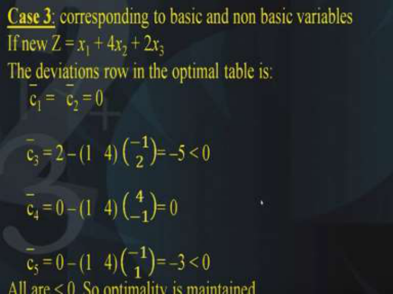

Next comes the case 3 this is corresponding to the basic variables as well as the non-basic variables and this can be illustrated with the help of this example. Suppose we have a new objective function that is our new Z is _x_ 1 + 4 _x_ 2 + 2 _x_ 3. Now let us calculate the deviation entries the deviation row in the optimum table will be 1 and 2 will both be 0. Our 3 will become 2– (1, 4) (-1, 2)t which is =-5.  As you know-5 is < 0. 4  is 0 -(1, 4) (4,-1)t which comes out to be 0. And finally 5 = 0 – (1, 4) (-1, 1)t which is =-3 and that is < 0. So what does it mean? This means that all the entry in the deviation rows are either 0 or < 0. This concludes that optimality is maintained if the original objective function is changed to this objective function then optimality is changed. Because we have verified all the entries of the deviation row and we have illustrated how each of them is either 0 or < 0. **(Refer Slide Time: 27:36)** 

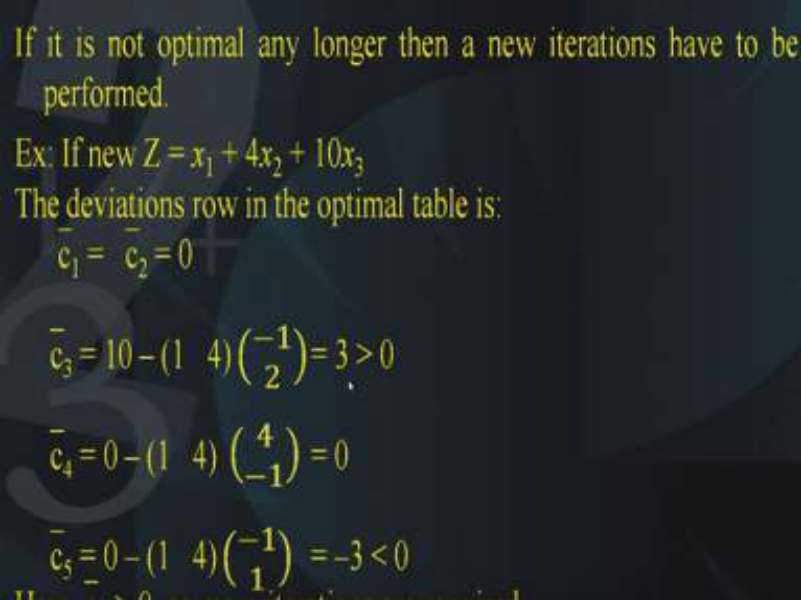

On the other hand, if it is not optimum any longer then a new iteration has to be performed. In order to illustrate this let us take this example. Suppose the original objective function is changed to _x_ 1 + 4 _x_ 2 + 10 _x_ 3. Now let us look at the deviation entries what we find the deviation entries in the optimum table now are c1 and c2 are both 0. So no problem 3  is 10 – (1, 4) (-1, 2)t which is = 3 and this means that this is > 0. 

Again 4 is 0 – (1, 4) (4, -1)t which = 0. And finally 5 is 0 – (1, 4) (-1, 1) which =-3 which is < 0. Now what do we observe? We observe all the cases to be either 0 or negative except this entry c3, 3 is 3, it is positive. So this indicates that this is not optimum any longer. Therefore we have to perform another iteration since 3 is > 0, so one more iteration has to be performed. **(Refer Slide Time: 29:40)** 

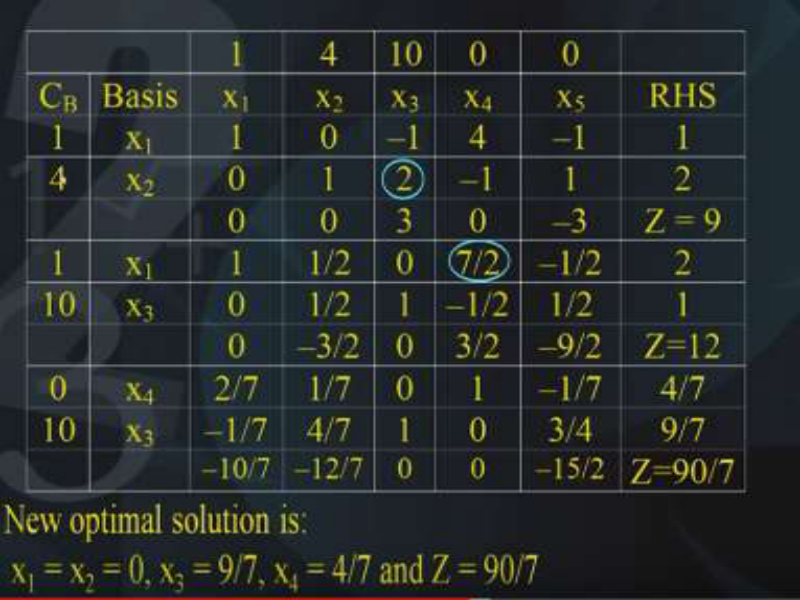

Let us perform this iteration. Here you are, this was our initial table right that is the basis was x1, x2. The coefficients of the cB were 1,4; basis is 1,0,0,1,-1,2,4,-1,-1,1 and the right hand side is 1 and 2. Now since the entries of the objective function are now 1, 4 and 10 and of course 0, 0; therefore the deviation rows will become 0,0 because they are basic variables 3,0,-3 and; objective function value is 9. 

We will perform the next iteration by observing these entries in the deviation. And as you can see 3 is the largest, then we will perform the minimum ratio test 2/2 and 1/-1 is not allowed so only option remains with 2 and therefore 2 is the pivot. Therefore, this variable x3 will enter the basis and x2 will leave the basis and here it is in the next iteration. We have the new basis as x1 and x3 which is shown like this 1,0  it is the basic variable 1/2,1/2,0,1,7/2,-1/2,-1/ 2,1/2. And the right hand side is 2 and 1. Again we will calculate the deviation entries of course, we have to make sure that the coefficients of this column are changed, x1 is as it is 1 and x3 is 10. So the deviation entries become 0 because it is a basic variable, and -3/2,0,3/2,-9/2 and objective function value is 12. Again observe this deviation row and you find that this 3/2 is the largest and then we perform the minimum ratio test. Of course the second one is not allowed because1/2 is negative, so only possibility is 7/3, therefore the pivot is 7/3. This indicates that x4 is the variable that has to enter the basis and x1 is a variable which has to leave the basis therefore, our new basis becomes x4 and x3. Of course they are coefficients in the objective function value are 0 and 10. And by applying the elementary row operations we have 2/7,-1/7,1/7,4/7. This is a basic variable x3, So it is 0,1. x4 is 1,0; x5 is-1/7,3/4; and the right hand side is 4/7 and 9/7. Let 

us look at the deviation entries are -10/7,-12/7, 0, 0 and-15/2 with an objective function value as 90/7. This indicates that the new optimum solution is x1 and x2=0, x3=9/7, x4=4/7and Z=90/7. So with this example, we have seen how if the objective function values are changed such that they do not satisfy optimality, Then the problem has to be solved in this way and a new optimum solution is obtained. 

**(Refer Slide Time: 35:02)** 

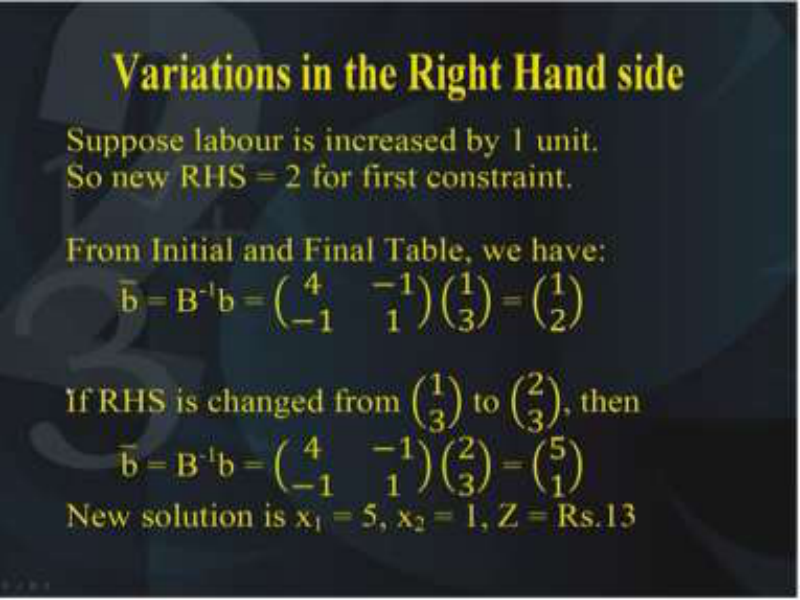

Now let us look at the second case that is variation in the right-hand side, suppose the labour is increased by 1 unit, as you know the right-hand side is nothing but the requirement of the labour and the material, so let us assume that labour is increased by 1 unit. Therefore, the new right-hand side will become 2 for the first constraint, earlier it was 1 now it has increased by 1 so 1+1 is 2. So right hand side now becomes 2 for the first constraint. 

Now from the initial and the final table you observe that what is ? it is nothing but B-1 b. Let us go back to the initial and the final table if you look at the initial and the final table here it is, you observe that the right hand side can be obtained from the original right hand side by multiplying by B inverse so here what is the b right hand side, it is 1,3. So 1,3 if you multiplied by B-1 that is (4,-1;-1,1). If you multiply it then you will get (1, 2), that is, the right hand side of the final table. Now if we thought of making a change in this entry 1, suppose this entry we want to make as 2. So since this entry is now 2; so we will multiply this B-1 i.e. (4,-1; -1, 1) with (2, 3) and we will get the new right-hand side of the optimum table. 

So let us see this how this is done, yes here it is in the initial table we found this was nothing but B-1 b, (4,-1;-1, 1) (1, 3)t which came out to be (1, 2). Now if the new right-hand side is changed from (1, 3)  to (2, 3) then the new will become B-1 b = (4,-1;-1,1) (2, 3) and if you solve this, you will get (5, 1). Therefore, the new solution is x1=5 and x2=1 and the objective function value is Z=13. 

**(Refer Slide Time: 38:43)** 

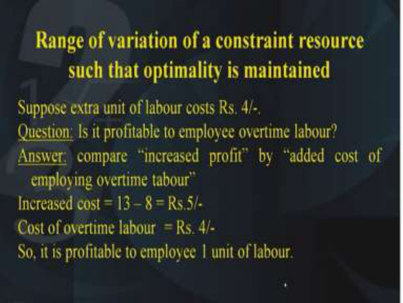

So we want to find out what happens to the range of the variation of a constraint resource such that optimality is maintained. By constant resource we mean the right hand side; there is a constraint, the labour constraint and its resource, so what should be the range on this constraint resource, by range we mean the lower and the upper limit. So for finding out that, suppose extra unit of labour costs rupees 4 because if you employ more labour it will involve some cost and let us suppose that cost is rupees 4. So the company poses this question is it profitable to employee overtime labour? this is the question that is addressed is it profitable to employee overtime labour what is the answer? We have to answer that we have to compare the increased profit by added cost of employing overtime labour. Now the profit has been increased, but at what cost? the cost is that we had to employee more labour. So therefore we will compare both these two quantities. What are the two quantities? first one is the increased cost what is the increased cost? and we will compare it with the cost of the overtime labour. So the increased 

cost is nothing but 13-8 earlier it was 8 now it is 13, so the difference between 13 and 8 is 5 rupees. However the cost of the overtime labour is rupees 4, so what does this indicate?. This indicates that it is profitable to employee 1 unit of labour because the cost of employing a labour is 4 which is less than the increased cost because the increased cost is 5. 

**(Refer Slide Time: 41:15)** 

Now this leads to a definition of what is called as a shadow price. Shadow prices are defined as follows, the increased profit in our case rupees 5 (in our previous example) per unit increase of labour availability is called the shadow price for the labour constraint. Now the shadow price is basically reflect the net changes in the optimum value of Z that is a profit, per unit of increase on the constraint resource, as long as the variations in the constraint resource does not change the optimum basis. Therefore, we can define a shadow price corresponding to every constraint. So for every constraint, there is a shadow price, there is a shadow price for the labour constraint, there is a shadow price for the materials constraint. 

**(Refer Slide Time: 42:36,)** 

Now let us find the range of the variation on availability of labour such that optimality is maintained. Now in order to find the range, let us denote by d the amount of labour availability and let b* be the new right hand side. Therefore b* is denoted by (d, 3). d is corresponding to the first availability of labour, So therefore we want to see what should be the range on d. Now as you know for optimality we have to make sure that B-1 b* <u>> 0. Therefore what does this mean?</u> this means that B-1 is nothing but (4,-1;-1,1) multiplied by (d, 3) which is = (4d-3 and 3-d). Now as you know this should be > 0. 

**(Refer Slide Time: 44:07)** 

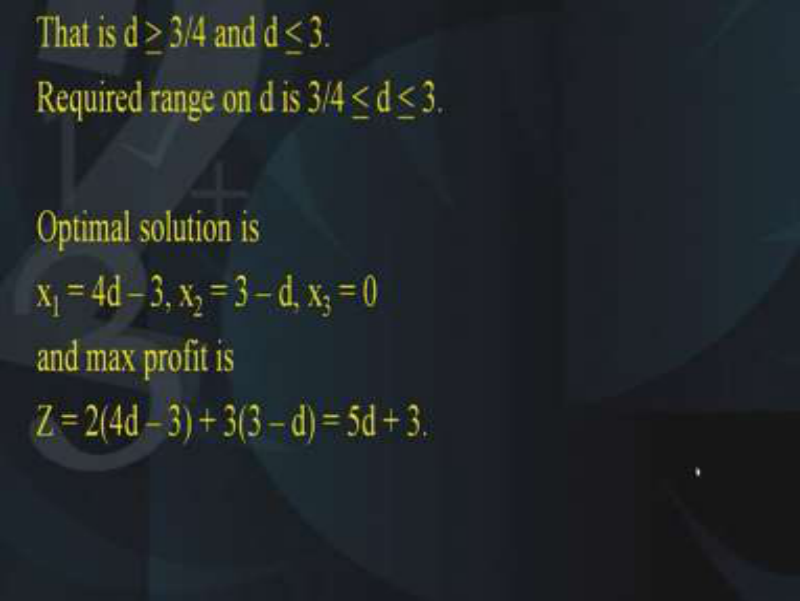

In order to make sure that this is <u>> 0; d should be > 3/4 and d should be < 3. Therefore, the</u> range on d should lie between 3/4 and 3. Of course, the optimal solution will be x1=4d -3, 

x2=3-d and x3=0. And of course the maximum profit is, if you substitute this in our objective function z=2(4d-3) + 3(3-d) =5d+3. 

**(Refer Slide Time: 45:14)** 

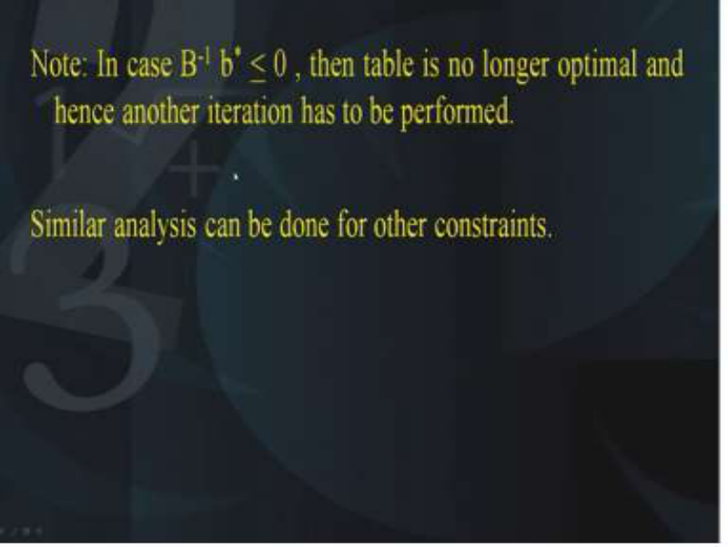

Now it may be noted that in case B-1 b* < 0, then the table is no longer optimum and hence another iteration has to be performed. Now similar analysis can be performed for other constraints as well. 

**(Refer Slide Time: 45:41)** 

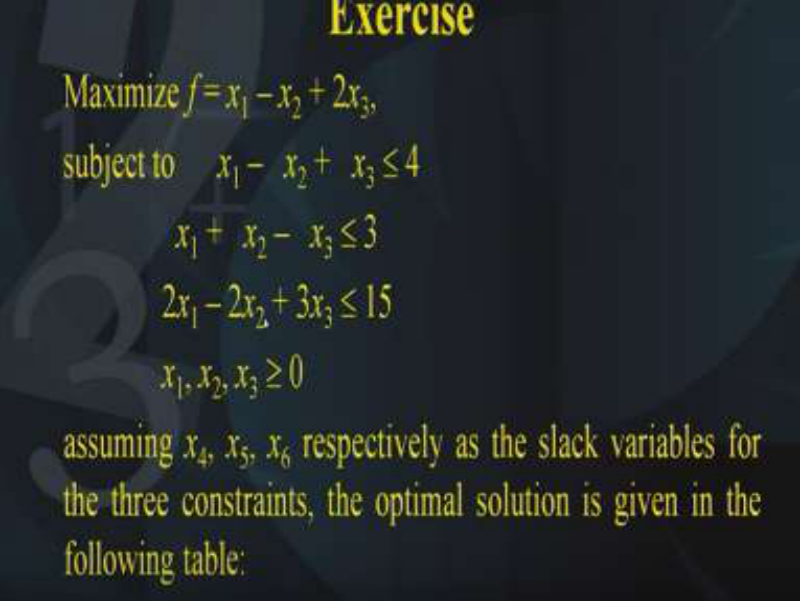

Therefore we have studied what happens if a change is made in the objective function coefficients and we have studied what happens if the there is a change in the right hand side. So at the end of the lecture, I would like you to solve this question maximize _f_ = _x_ 1 – _x_ 2 + 2 _x_ 3 

,subject to _x_ 1 – _x_ 2 + _x_ 3  4 , _x_ 1 + _x_ 2 – _x_ 3  3 ,2 _x_ 1 – 2 _x_ 2 + 3 _x_ 3  15; _x_ 1, _x_ 2, _x_ 3  0. Assuming _x_ 4, _x_ 5, _x_ 6 respectively as the slack variables for the three constraints, the optimal solution is given in the following table. Now how that has been obtained is another story, you know how to solve it using the simplex method. 

# **(Refer Slide Time: 47:04)** 

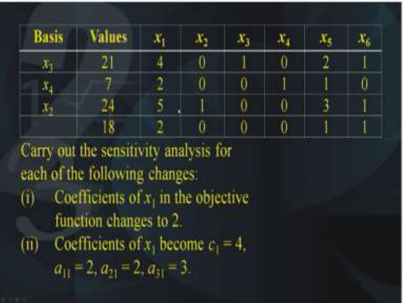

So it is given that this is the solution, the solution is x3, x4, x2. Right hand side is 21,7,24  x1 is 4,2,5 x2 is 0,0,1 x3 is 1,0,0 x4 is 0,1,0 x5 is 2,1,3 x6 is 1,0,1 and the cost is 18 and these are the deviation entries. Now the question says, carry out the sensitivity analysis for each of the following changes, number 1 coefficient of x1 in the objective function is changed to 2 that is the first part. Second part is coefficient of x1 becomes c1=4 and a11=2, a21=2 and a31=3. **(Refer Slide Time: 48:28)** 

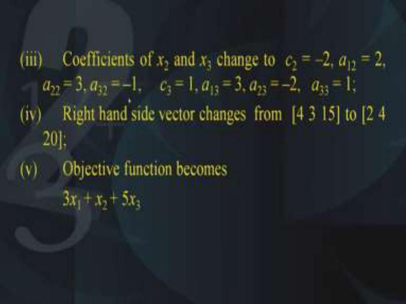

Third part is coefficient of x2 and x3 change to c2=-2,a12=2,a22=3,a32=-1,c3=1,a13=3,a23=-2 and a33=1. Next part, right hand side vector changes from 4,3,15 to 2, 4 and 20 and finally objective function becomes 3 _x_ 1 + _x_ 2 + 5 _x_ 3. So each of these parts have to be solved one at a time separately. Thank you. 

