# **Operations Research Prof. Kusum Deep Department of Mathematics Indian Institute of Technology - Roorkee** 

**Lecture – 21 Sensitivity Analysis - II** 

Good morning students, today we will continue our discussion on the topic of sensitivity analysis which we have studied last time. So, the title of today's lecture is sensitivity analysis, 

part II. 

**(Refer Slide Time: 00:44)** 

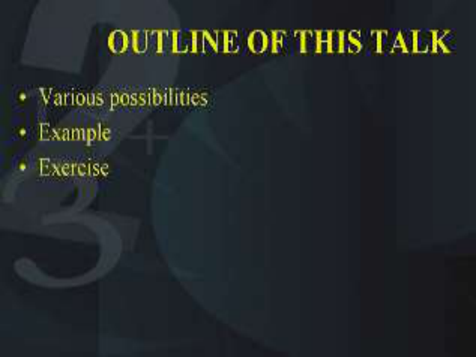

The outline of today's talk is the various possibilities that could exist. We will take the same example that we had taken last time and finally, an exercise. 

**(Refer Slide Time: 01:01)** 

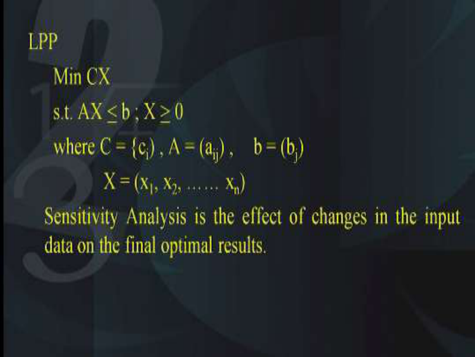

As you know, that sensitivity analysis means that if we make slight changes in the input parameters of a linear programming problem, what will be its effect on the final solution? Do we need to solve the problem all over again or we can make some conclusions from the initial and the final table which is given to us. 

So, let us first define the given linear programming problem. This we had done in the last lecture also, but I am repeating it for the sake of continuity. We want to minimize CX which is subject to AX < b, X > 0; C is the coefficients of the objective function, A is (aij), b is bj and X is the unknown parameters that is x1, x2, …… xn. The sensitivity analysis is nothing but the effect of the change in the input data on to the final optimal table. So, this is the definition we had given for the sensitivity analysis as defined last time. 

**(Refer Slide Time: 02:39)** 

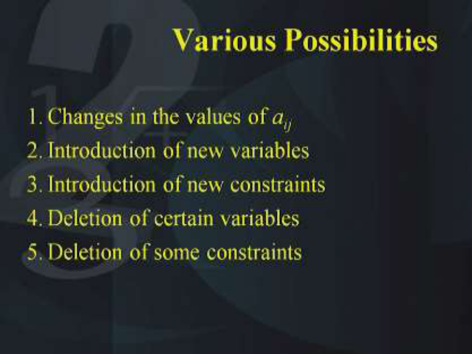

Now, we have to look at the various other possibilities that could exist. We had in the last lecture looked at the variations in the values of ci’s, that is the cost coefficients. We had also looked at the possibilities of variation in the right hand side that is the bj’s. Now, in today's lecture, we will study the changes in the values of aij. These are the coefficients of the constraints that exist in the problem. 

Then, we will also look at the situation where we want to introduce a new variable into the problem. Thirdly, we want to look at a situation where we would like to introduce a new constraint into the problem. Fourth; we would like to look at the situation when, we would like to delete a particular variable from the problem and finally, we would like to look at what happens if we want to delete some constraint. 

**(Refer Slide Time: 04:06)** 

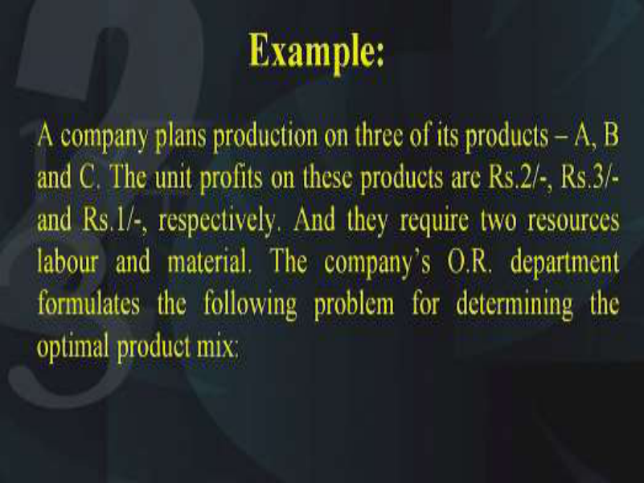

So, in this lecture, we will cover all these 5 possibilities. Now, the example that we had taken in the first part, let us read that again, I am taking particularly the same problem, so that the continuity is maintained. So, the problem is that a company plans to produce 3 of its products, let us say A, B and C. The unit profit on these products is given to be rupees 2, rupees 3 and rupees 1 respectively and they require two resources that is labour and material. 

The company's O.R department has formulated the following problem for determining the optimal mix. 

# **(Refer Slide Time: 05:03)** 

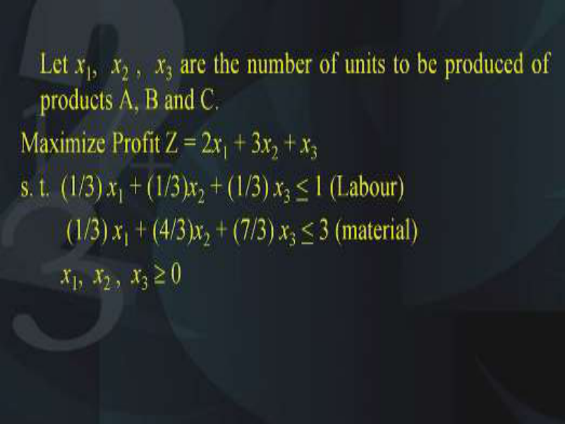

We will assume that the three variables; x1, x2, x3 are the number of units to be produced of the three products, that is,  A, B and C, we want to maximise the profit, which is given by Z = 2 _x_ 1 + 3 _x_ 2 + _x_ 3  and there are two constraints of the problem. One is corresponding to the labour which 

is given by (1/3) _x_ 1 + (1/3) _x_ 2 + (1/3) _x_ 3 <u>< 1 and the second constraint is corresponding to the</u> material and it is given by (1/3) _x_ 1 + (4/3) _x_ 2 + (7/3) _x_ 3 <u>< 3 and x1, x2, and x3 should be > 0.</u> **(Refer Slide Time: 06:19)** 

Now, as in the last lecture, the initial and the final table can be seen, in this table. In the initial table, we have the basis given by x4 and x5;  and under the x1 column, we have 1/3, 1/3. Under x2 we have, 1/3, 4/3; under x3 we have 1/3 7/3; under x4 we have 1, 0 and under x5 we have 0, 1 and the right hand side is 1, 3. Now, since the coefficient of x4 and x5 is 0 in the objective function, therefore in the first column, we need to write the value 0, 0. 

On the top row, we have the coefficients of the objective function that is 2, 3, 1, 0 and 0. Now, we will calculate the deviation entries and they are the same, that is, 2, 3, 1, 0 and 0, this is the initial table. Now, coming to the final table; in the final table, we have the basis x1 and x2 and corresponding coefficient of x1 and x2 in the objective function is 2 and 3; so, it goes to the first column. And we have the columns under x1, x2 etc., 1 0, 0 1 -1 2 4 -1 -1 1 and; 1 and 2 and the objective function value that is the cost (that is a profit) is 8 and the deviation entries in the final table are 0 0 -3 -5 and -1. So, this is the initial and the final table that is sort of given to us. 

**(Refer Slide Time: 08:49)** 

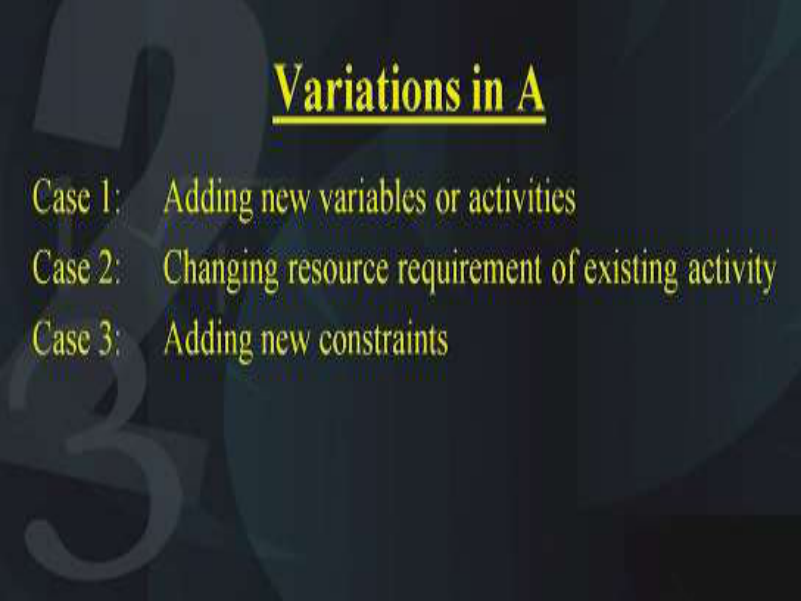

Now, we want to look at the variations in the A that is the aij’s. Now, if you try to look at this carefully, there arise three cases. In case number 1, we can consider adding new variables or activities that is more and more variables, what happens we want to see, what happens if more and more variables are introduced into the problem. Second case is changing the resource (requirement) of the existing activities and the third is adding new constraints. **(Refer Slide Time: 09:39)** 

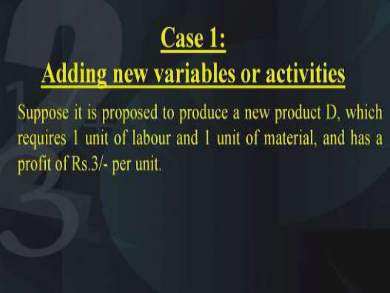

So, what does it mean? Let us look at each of the cases one by one; in the case number 1, we will talk about adding new variables or activities into the problem. What does this mean? Suppose, in our given problem, it is proposed to produce a new product, which we will call as D and it is given that this product D requires 1 unit of labour and 1 unit of material respectively and has a profit of rupees 3 per unit. 

So, we want to see whether it is beneficial to produce D or not; that is the question, we have to answer. Therefore, the question is; is it economical to produce D or not? Now, the answer to this question leads us to the fact that we need to introduce a new variable into the problem; a new variable has to be introduced into the problem. Now, how do we introduce a new variable? **(Refer Slide Time: 11:11)** 

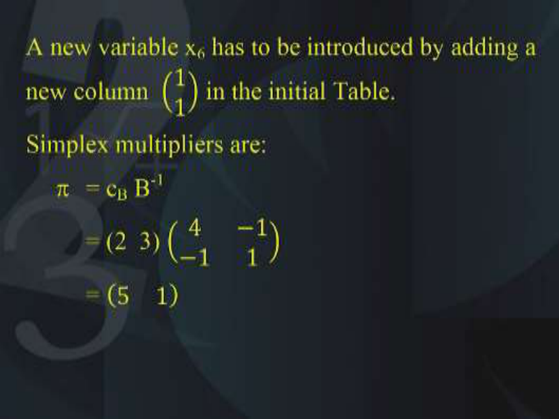

Now, a new variable; let us call it x6, because already we have five variables; x1, x2, x3 are corresponding to A, B and C; and x4 and x5 are the slack variables. So, let us use x6 as a variable which is corresponding to the new activity or rather new variable or new product. So, a new variable x6 has to be introduced by adding a new column that is, what is this new column; 1 1 in the initial table. Now, why is it 1 1? It is 1 1 because 1 is corresponding to the first resource that is labour and the second one is corresponding to the material, it is given in the problem that if D has to be produced, then D requires 1 unit of labour and 1 unit of material. Therefore, this column vector 1, 1 will have to be introduced into the initial table. After doing that we will now calculate the simplex multipliers. 

As before, the simplest multipliers are nothing but = cB B-1 . Now, you know what a cB; cB is the coefficients of the variables; the missing variables in the objective function so, cB is nothing but 2 and 3 and B-1 is the matrix (4 -1; -1 1) and if you multiply the 2, you will get row vector which is given by 5 1. 

**(Refer Slide Time: 13:18)** 

Now, corresponding to the variable x6, the entry in the deviation rows have to be calculated. So, all the other entries are already there, except 6. So, we will calculate 6  which is given by c6 – 6. What is c6? c6 is 3, why it is 3; it is given in the problem, it is given in the problem that the product D will have a profit of rupees 3 per unit. Therefore, this 3 comes from the given data; what is ; here just now obtained is the simplex multipliers 5 1. And then multiplied by 1 1 that is the column vector corresponding to this new variable and if you multiply this, you will get -3, as you know -3 is < 0 and this indicates that if you produce D then it will not increase the profit, the profit will remain as it is; means, the problem will remain optimum and it will have the same solution as the original problem. Therefore, producing D will not increase the profit. 

# **(Refer Slide Time: 15:08)** 

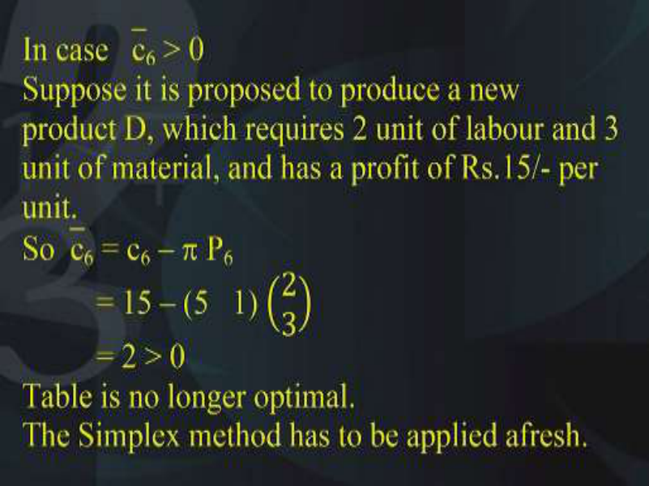

Now, on the other hand, it might not be so, always suppose, 6  is > 0, right then that means, the solution is not optimum any longer. So, suppose it is proposed to produce a product, let us say D which requires 2 units of labour and 3 units of material and has a profit of rupees 15 per unit. So, all the data has changed again, let us calculate 6   which is given by c6 – 6 , that is given to be as 15 – (5 1) (2 3)t , this comes out to be 2. 

Now, 2 > 0, this indicates that the solution is no longer optimum. So, the table is no longer optimum and therefore, the simplex method has to be applied afresh, you have to apply the simplex calculations afresh. 

# **(Refer Slide Time: 16:50)** 

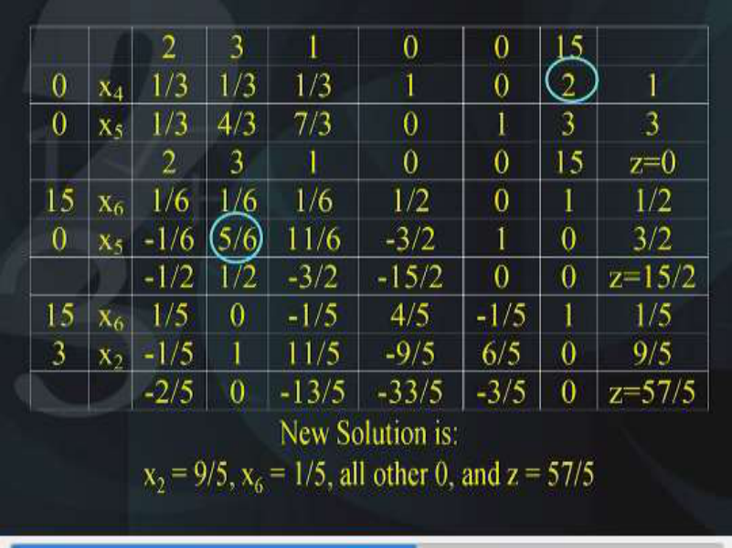

Let us do it. How we will do it? If you look at this table, this x4 and x5 are already there; 1/3 1/3, 1/3 4/3, 1/3 7/3, 1 0, 0 1, this is all this is the initial table that we have been given in the problem. Now, we will like to add (2 3) over here, because this is the new data that has been given and 15 is the profit. So, on the top we have to write 15 and the right hand side is 1 3. So, the last column of the rather last but 1 column has to be added into the initial table. 

We have to perform the simplex calculations all over again and this means we have to look at the deviation entries. So, if you look at the deviation entries, you get 2 3 1 0 0 and 15 and what does this mean? This means that 15 is the largest. So therefore, the x6 variable should enter the basis and then we will perform the minimum ratio test and we find that 2 is the pivot. Accordingly, we will apply the elementary operations and get the second iteration as follows. 

In the first column we will write 15 0, second column we will write x6 and x5, then next column 1/6 -1/6 1/6 5/6 1/6 11/6 1/2 -3/2 0 1 1 0 and finally right hand side is 1/2 and 3/2. Again, we 

will need to calculate the deviation entries, they are nothing but -1/2 1/2, -3/2, -15/2, 0 0 and the cost Z = 15/2. Now, we find that there is one entry in these deviation rows, which is not < 0 which indicates that this variable should enter into the basis.  And after applying the minimum ratio test, we find that 5/6 is the pivot element, accordingly we need to apply the elementary row operations and we get the third table as follows. In the first column, we have 15 3, second column, we have the basis as x6 and x2, then we have 1/5 and -1/5, 0 and 1, -1 and 5, 11/5, 4/5 - 9/5, -1/5 6/5, 1 0, 1/5 9/5, and similarly, the deviation entries; -2/5 0, -13/5 -33/5 -3/5 0 and the value of the objective function as 57/5. 

So, what does this mean? This means that the solution now is optimum, because all the entries in the deviation rows is negative or 0. This indicates that the solution which is now obtained, the new solution is x2 = 9/5, x6 = 1/5, all others as 0 and Z = 57/5. 

Next, let us look at case 2; in the case 2, we want to see what happens when the changing resource requirement of the existing activity takes place. 

**(Refer Slide Time: 22:04)** 

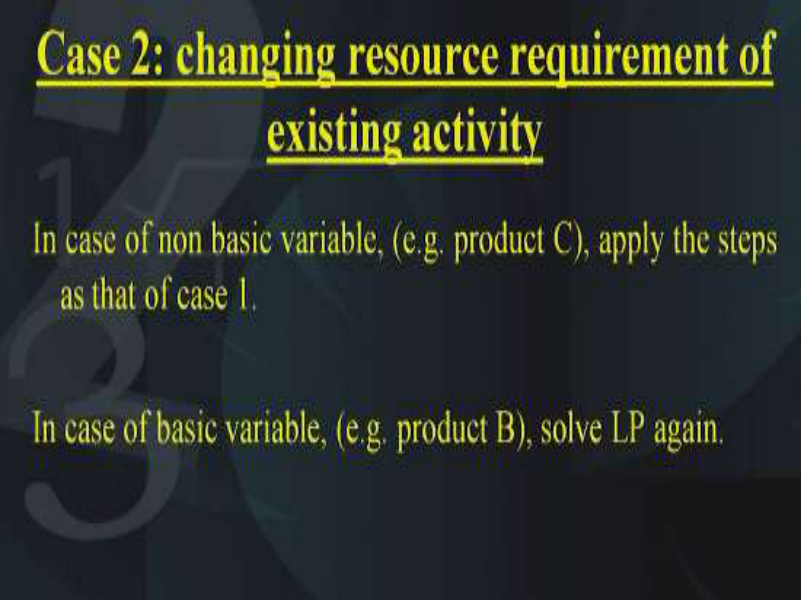

That is in case of the non-basic variable, let us say for example product C; we have to apply the same steps as that of case 1. However, in case of basic variable for example, product B, we have to solve the LPP again, no other alternative is possible. **(Refer Slide Time: 22:32)** 

Case 3; adding new constraints, now suppose products A, B and C required 1, 2 and 1 hour of administrative services. So, as you know, there were earlier there are only 2 conditions; one was corresponding to the labour and the other was corresponding to the material. Now, we have a third constraint which is corresponding to the administrative services. So, when we introduce this third constraint, the available service of this administrative service is 10. 

So, all this data can be clubbed together in the form of third constraint as follows; x1 + 2x2 +x3 <u>< 10 and now, we want to see if the optimum solution which has been obtained till now satisfies</u> these constraint or not. So, let us substitute the solution obtained into this equation and what do we get; 1 + 2 x 2 + 0 is <= 10, in this case, it is satisfied. 

**(Refer Slide Time: 24:21)** 

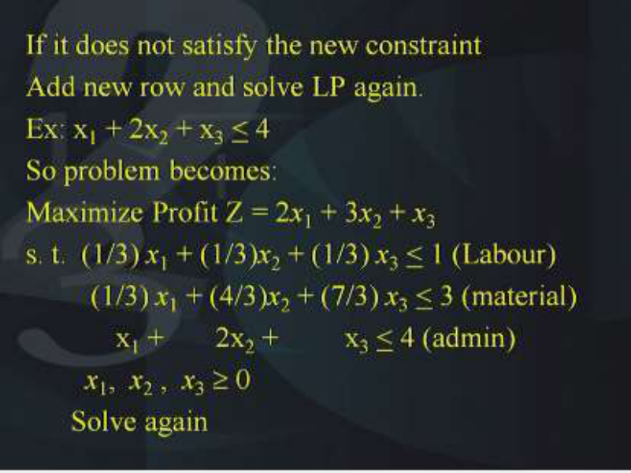

Therefore, what do we conclude? We conclude that if we add this additional constraint into the problem, then our solution will remain the optimum (the solution will remain optimal), there will be no change in the solution. Now, on the other hand, if this does not happen, then what to do; if it does not satisfy the new constrain that is the solution does not satisfy the new constraint, then we need to add a new row and solve the LP again, okay. Because the new constraint has to be incorporated in the initial table itself and therefore, once we do that, then we have to solve the entire problem again. For example, if we have this new constraint x1 + 2x2 + x3 <u>< 4, so the problem becomes, as before we have to maximise the profit, Z = 2</u> _x_ 1 + 3 _x_ 2 + _x_ 3 subject to (1/3) _x_ 1 + (1/3) _x_ 2 + (1/3) _x_ 3 <u>< 1 that is the labour requirement.  Second constraint is</u> (1/3) _x_ 1 + (4/3) _x_ 2 + (7/3) _x_ 3 <u>< 3, this is the material constraint and the new constraint that we</u> have added regarding the administration is given by x1 + 2x2 + x3 <u>< 4, all the variables</u> _x_ 1, _x_ 2 , _x_ 3  0. Now, what we have to do? We have to solve the problem again, there is no other alternative. 

# **(Refer Slide Time: 26:55)** 

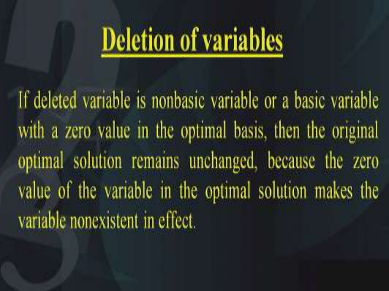

Next, let us looked at what happens if we want to delete a variable. So, if the deleted variable is non-basic variable or a basic variable with a zero value in the optimum basis, then the original optimum solution remains unchanged, because the zero value of the variable in the optimum solution makes the variable non-existent in effect, so, that is very straightforward. **(Refer Slide Time: 27:42)** 

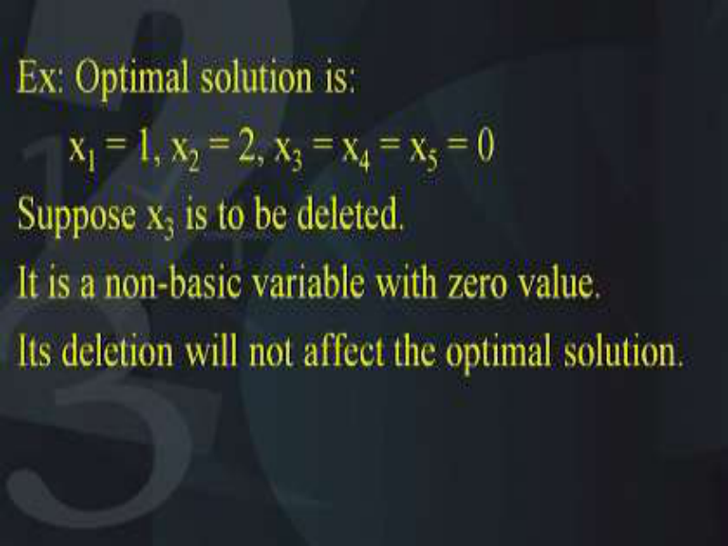

Now, let us look at the initial and the final table again, so this is the same table that we have seen in the beginning of the lecture. I have just shown it again, just to indicate the initial and the table and the final table entries. Now, if you look at this initial and final table, there are a couple of observations. For example, the optimum solution is given by x1 = 1, x2 = 2, x3, x4, x5 all the three are = 0. 

Suppose, we want to delete x3 that is, x3 has to be deleted. Now, it is a non-basic variable with zero value, it is a non-basic variable with zero value, so its deletion will not affect the optimum solution. 

# **(Refer Slide Time: 28:55)** 

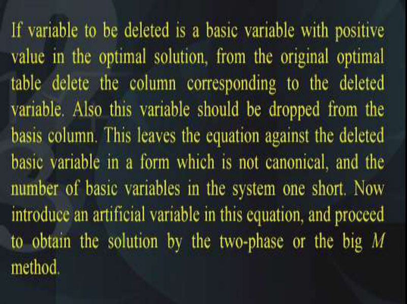

On the other hand, if the variable to be deleted is a basic variable with positive value in the optimum solution, then from the original optimum table, delete the column corresponding to the deleted variable. Also, the variable should be dropped from the basis column. This leaves the 

equation against the deleted basic variable in a form which is not canonical and the number of basic variable in the system one short that is one less. Now, introduce an artificial variable in this equation and proceed to obtain the solution by the two phases or the big M method, so that is the way it has to be done. 

**(Refer Slide Time: 30:17)** 

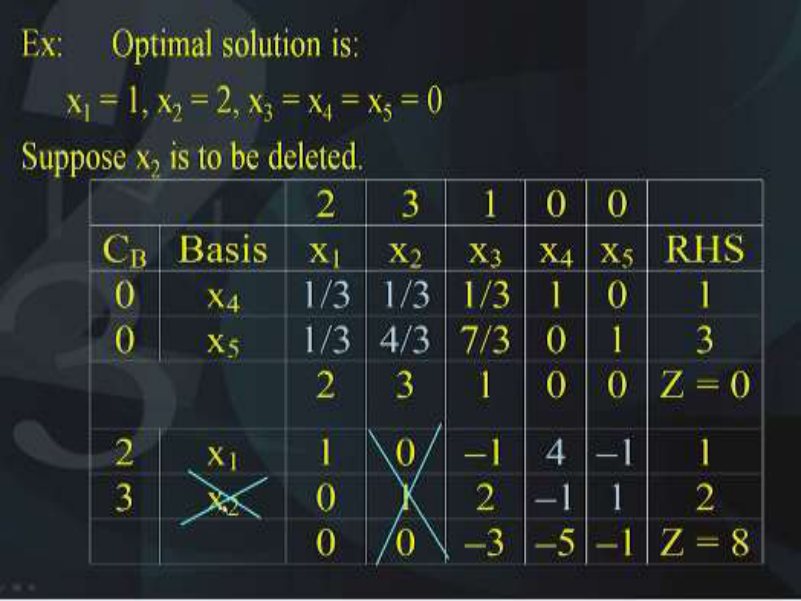

Let us take an example; now, the optimum solution is x1 = 1, x2 = 2, x3, x4 and x5 = 0. Now, suppose x2 has to be deleted so, what do we do? We look at this column x1, x2, x3, x4, x5. This is the initial table and since x2 has to be deleted, I have placed a cross at this column and the second column. So, this column has to be deleted and correspondingly, this variable in the basis x2 has to be deleted. 

**(Refer Slide Time: 31:07)** 

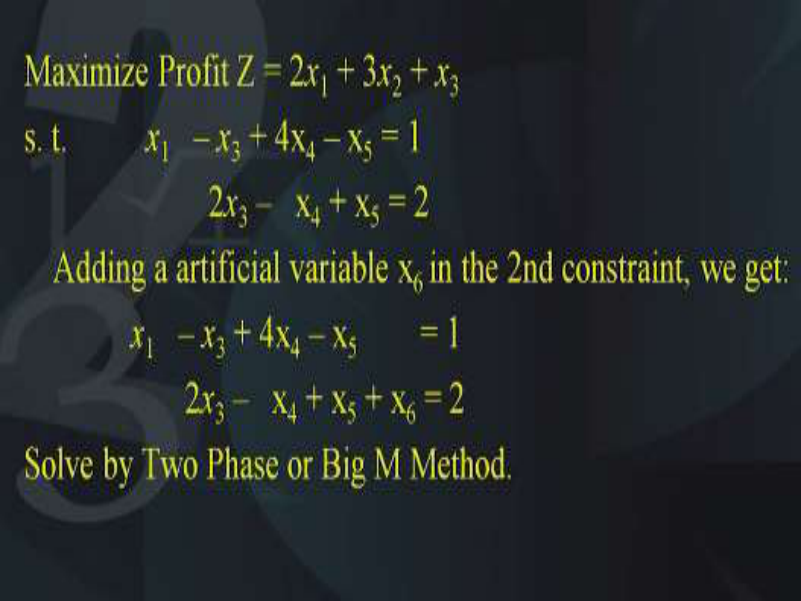

So, the problem becomes maximisation of Z = 2 x1 + 3x2 + x3 subject to _x_ 1   – _x_ 3 + 4x4 – x5 = 1 , 2 _x_ 3 –   x4 + x5 = 2  and adding an artificial variable, let us say, x6, in the second constraint, we get the new second constraint as 2 _x_ 3 –   x4 + x5 + x6 = 2  and what do we need to do; we need to solve this problem by the two phase method. 

**(Refer Slide Time: 32:05)** 

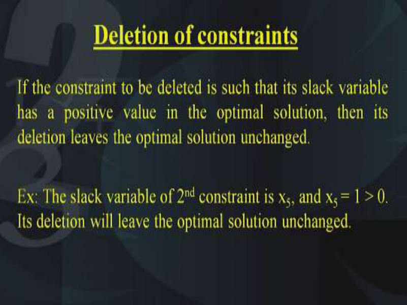

Next comes the deletion of the constraint. Now, if the constraint to be deleted is such that its slack variable has a positive value in the optimum solution, then the deletion leaves the optimum solution unchanged. For example, the slack variable of the second constraint is x5 and x5 = 1 which is > 0, so its deletion will leave the optimum solution unchanged. 

**(Refer Slide Time: 32:50)** 

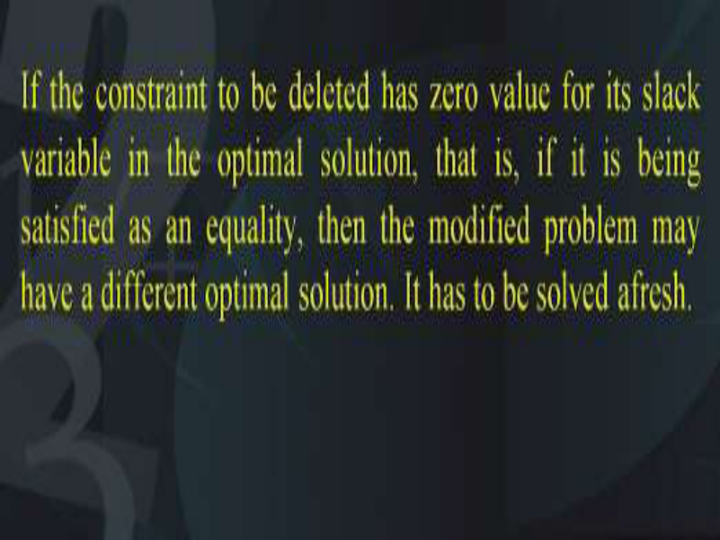

If the constraint to be deleted has zero value for its slack variable in the optimum solution that is, if it is being satisfied as an equality, then the modified problem may have a different optimum solution and therefore, it has to be solved again. 

**(Refer Slide Time: 33:19)** 

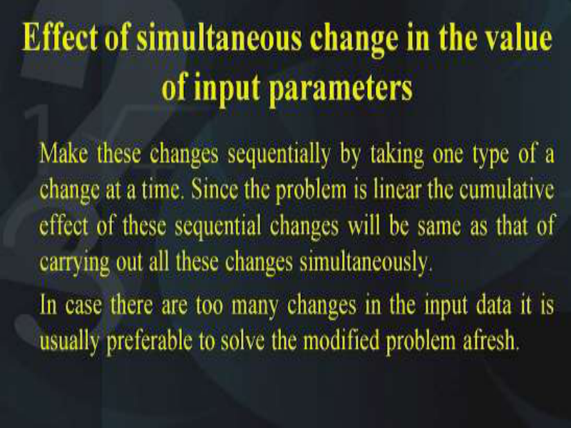

Now, let us look at the effect of the simultaneous changes in the value of the input parameters. Now, suppose you have to make changes simultaneously in many parameters, then make these changes sequentially that is one after the other by taking one type of a change at a time. Since, the problem is linear and the cumulative effect of these sequential changes will be the same as that of carrying out all these changes simultaneously. 

In case there are too many changes in the input data, it is usually preferable to solve the modified problem all over again. 

**(Refer Slide Time: 34:23)** 

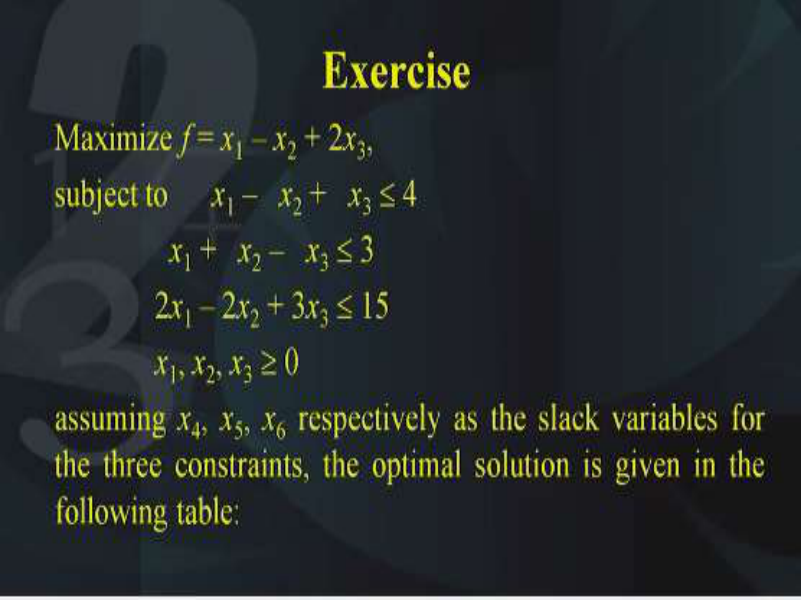

So, finally, we will look at an exercise, and I would like you to solve this exercise as a homework. The problem is; maximisation of  f = _x_ 1 – _x_ 2 + 2 _x_ 3 subject to _x_ 1 – _x_ 2 + _x_ 3  4, _x_ 1 + _x_ 2 – _x_ 3  3,  2 _x_ 1 – 2 _x_ 2 + 3 _x_ 3  15 and all xi’s are  0, assuming x4, x5 and x6 respectively, as the slack variables to the three constraints. The optimum solution is given in the following table. **(Refer Slide Time: 35:32)** 

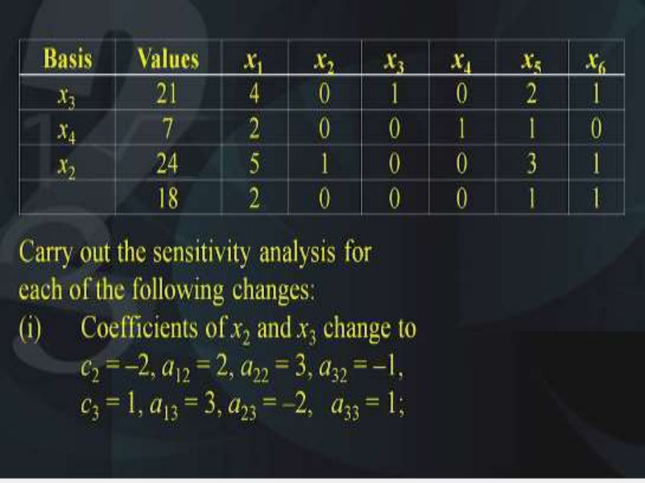

Now, this is a table that is given, I think this is the same table as in the previous lecture, you have to carry out the sensitivity analysis for each of the following changes. Number 1, coefficient of x2 and x3 change to the following that is c2 = -2, a12 = 2, a22= 3, a32 = -1, similarly, c3 = 1, a13 = 3, a23 = -2 and a33 =1. Secondly, first constraint is to be deleted. **(Refer Slide Time: 36:33)** 

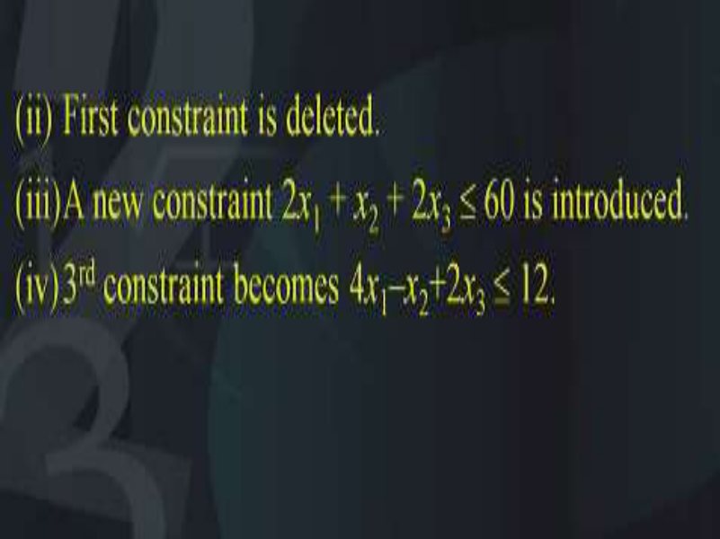

The third part is a new constraint is to be introduced and that constraint is given by 2 _x_ 1 + _x_ 2 + 2 _x_ 3  60. And finally, the fourth part is the third constraint becomes 4 _x_ 1– _x_ 2+2 _x_ 3  12. Now each of these four parts have to be done one at a time and not simultaneously. Thank you. 

