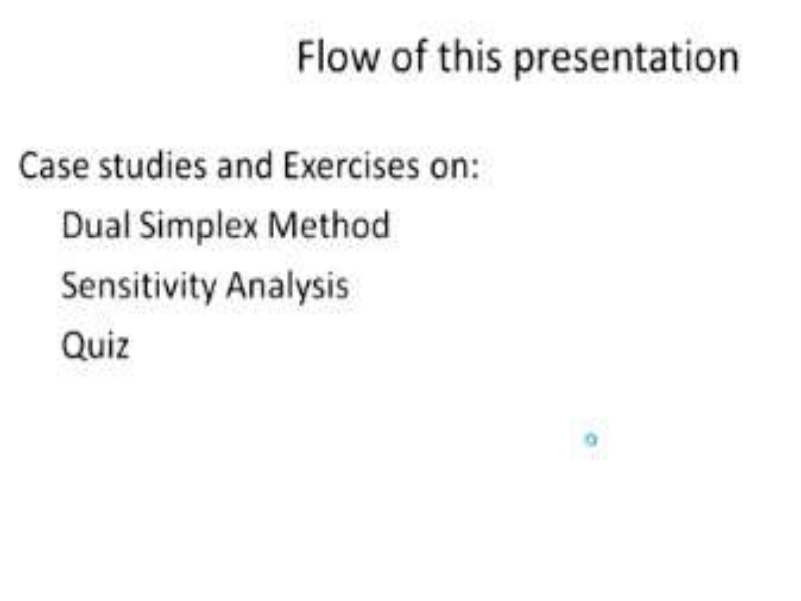
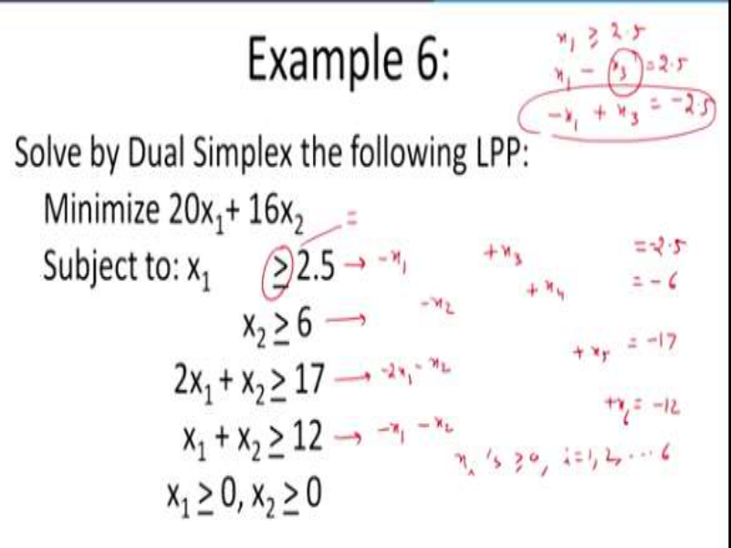
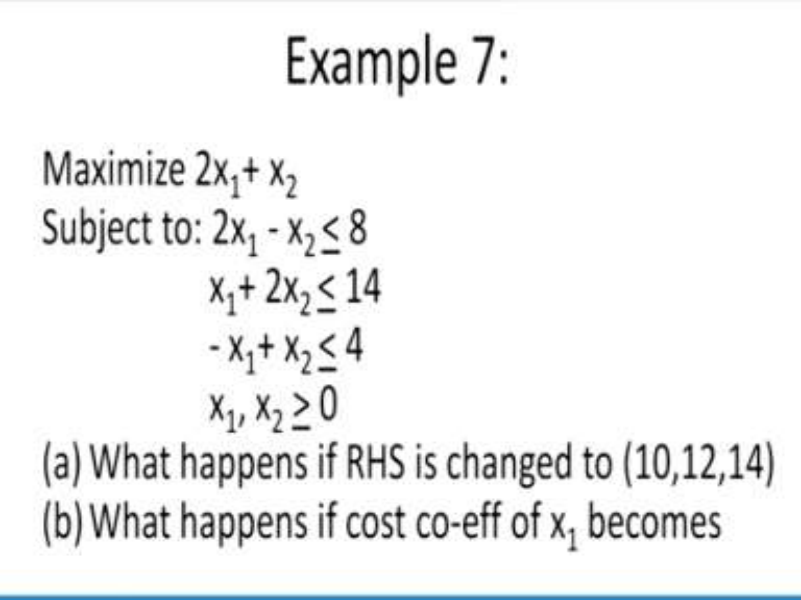
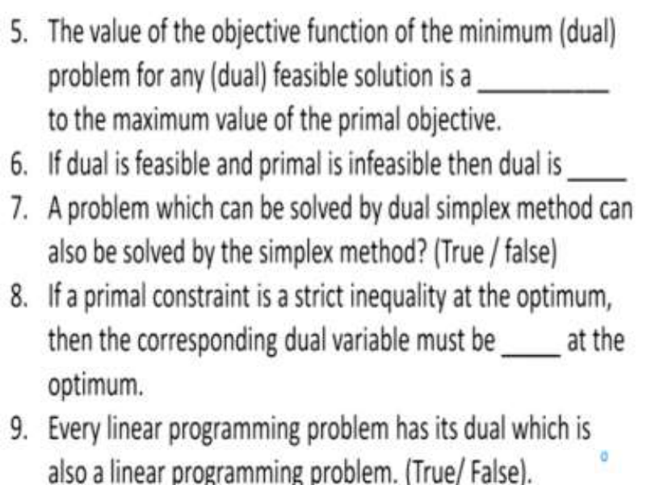
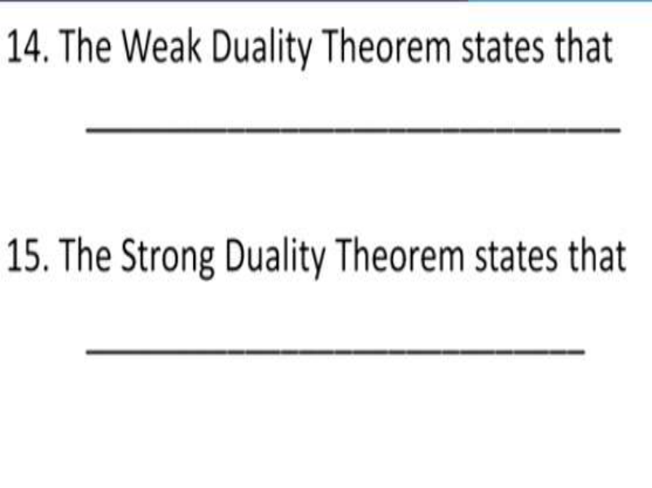
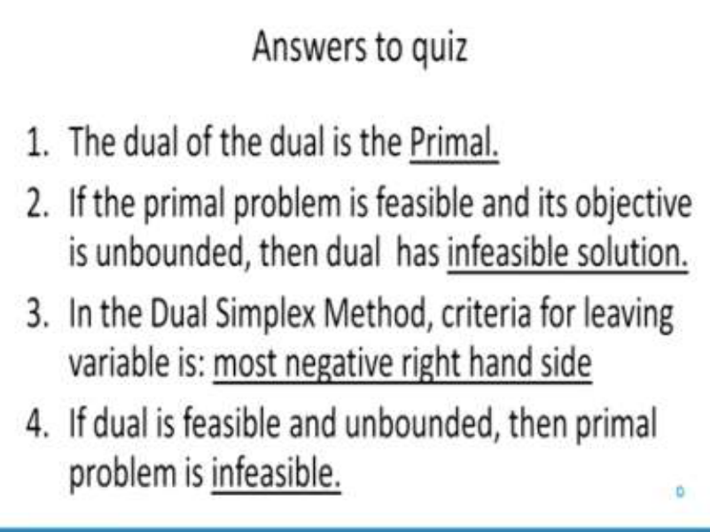
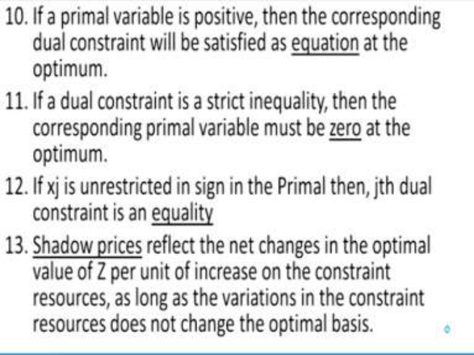
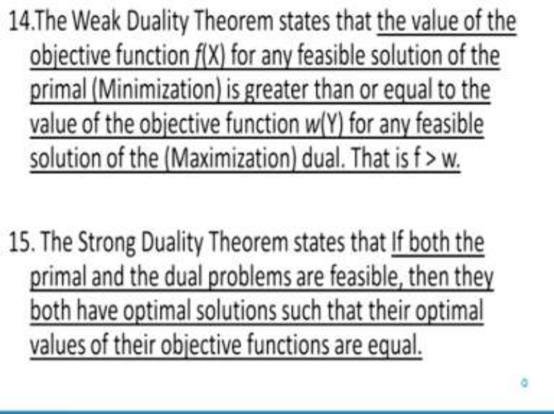

# **Operations Research Prof. Kusum Deep Department of Mathematics Indian Institute of Technology - Roorkee** 

**Lecture – 23 Case Studies and Exercises - II** 

In this lecture, we will study some more case studies and examples which will be based on the dual simplex method and the sensitivity analysis. 

**(Refer Slide Time: 00:44)** 

And finally, in the end we will have a quiz based on module 2, so let us begin. 

**(Refer Slide Time: 00:51)** 

So, example number 6; this is based on the dual simplex method, remember dual simplex method is another way of handling the greater than or equal to constraints where we do not 

have a readily available BFS and therefore, we need to add an artificial variable. In the dual simplex method, there is another way of treating the greater than or equal to constraints, so look at this problem we have minimize 20x1+ 16x2  subject to x1 <u>> 2.5, x2 > 6, 2x1 + x2 > 17, x1 + x2 ></u> 12. And of course x1 and x2 should be > 0. So, what do we need to do first of all; we need to convert the greater than inequalities into equalities, so how we should do that? First of all, we will write the first equation as –x1 + x3 = 2.5, why this has been done? Remember, because we have to convert the greater than equal to constraints into equalities. Second constraint will become –x2 + x4 = - 6. The third constraint will become -2x1 – x2 + x5 = -17and the fourth constraint will become –x1 – x2 + x6 = -12, I hope you understand why I have done this because for example, this x1 > 2.5, first, I will need to subtract some variable let us say, x3 and this will become 2.5 but since this is a coefficient, this is appearing with a coefficient -1. So, in order to make it +1 as a basic variable, I will multiply it with the negative sign. And that is the reason why this first constraint looks like this of course, all the variables should be > 0 where i goes from 1, 2 up to 6. 

# **(Refer Slide Time: 04:19)** 

Now, let us write down the solution using the dual simplex approach so, here we go, first of all we will write x1, x2, x3, x4, x5, x6 and the right hand side. The coefficients of the objective function will be 20 and 10 as before and the basis is x3, x4, x5, x6 and their coefficients in the objective function also has to be rewritten so, the entries are as follows; -1, 0, -2, -1, 0, -1, -1, - 1, 1, 0, 0, 0, 0, 1, 0, 0, 0, 0, 1, 0 and the right hand side is -2.5, -6, -17, -12. Now, remember in the dual simplex method, the criteria for incoming variable are choose the one which is most negative right hand side. 

And what do you find; -17 is the most negative right hand side; then, comes the criteria for the entering variable so, the deviation entries are 20, 16 and remaining 0 and you have to find out the ratio which is called the maximum ratio test, the maximum ratio between deviation entry and negative entries of the pivot row, so therefore what are we left with; we are left with maximum of 20/- 2, 16/-1. And this tells us that -2 should be our pivot remember, in the dual simplex procedure, first we decide the incoming variable and then we decide the outgoing variable which is reverse as far as the simplex procedure is concerned and therefore accordingly, we have 2 as our pivot. This tells us that our new basis is x3, x4, x1, x6 and what is this? This is coming out to be 0, 0, 1, 0, 1/2, -1, 1/2,-1/2. Then we have 1, 0, 0, 0, 0, 1, 0, 0, - 1/2, 0, -1/2, -1/2, 0, 0, 0, 1 and the right hand side is 6, -6, 17/2 and -7/2. Then as before the deviation entries have to be calculated for this, the deviation entries are 0, 6, 0, 0, 10 and 0. Now, the again the criteria for the incoming ones gives us that variable corresponding to -6 should enter the basis, I mean that is the largest negative entry. And accordingly, -1 is the pivot therefore, the next iteration becomes x3, x2, x1 and x6 and this gives us 0, 0, 1, 0, 0, 1, 0, 0, 1, 0, 0, 0, 1/2, -1, 1/2 and – 1/2 and also we have – 1/2, 0, -1/2, -1/2 and finally, the right hand side is 3, 6, 11/2 and -1/2. Again, we find that -1/2 is the only negative one that is remaining therefore, the new basis turns out to be x3, x2, x1 and x4 and accordingly, you will find that the entries are as follows; 0, 1, 0, 0, 1, 0, 0, 0, 0, 0, 0, 1, -1, 1, - 1, 1 and finally 1, -2, 1, -2 and the right hand side is 5/2, 7, 5 and 1 and I will leave it as an exercise, the deviation entries in the last table, this is the last table are 0, 0, 0, 0, 4 and 12, please verify it and the objective function of this problem turns out to be - 212 and this solution is x1 = 5, x2 = 7, x3 = 5/2, x4 = 1, all other 0. So, we have seen that this dual simplex procedure is another way of taking care of the greater than or equal to constraints, okay. 

**(Refer Slide Time: 12:01)** 

The next example is; maximize 2x1+ x2 subject to 2x1 - x2 < 8 and x1+ 2x2 < 14, - x1+ x2 < 4. A part of the question says using the sensitivity analysis that we have learnt, find out what happens if the right hand side is changed to the following vector 10, 12 and 14 and also the where the B part says what happens if the cost coefficient x1 becomes; what will it become? **(Refer Slide Time: 12:56)** 

So, let us see the solution now, you can see that the problem given to us is 2x1+ x2 subject to 2x1 - x2 < 8, x1+ 2x2 < 14, - x1+ x2 < 4 and the non-negativity constraints. So, the tabular goes as follows; we will need five variables, I can just skip the way in which the inequalities have to be converted. So, the basis will be x3, x4 and x5, you can guess these are the slack variables corresponding to all the three constraints that we have. And on top, we have 2, 1, 0, 0, 0 and this becomes 2, 1, 1, -1, 2, 1, 1, 0, 0, 0, 1, 0, 0, 0, 1 and the right hand side is 8, 14 and 4. Now, I will write down this is the initial table and I will not solve it entirely and I will just write the 

optimum table. The optimum table is x1, x2 and x5 and here the entries are as follows; 2/5, -1/5, 3/4, 1/5, 2/5, -1/5 and 0, 0, 1, right hand side is 6, 4 and 6. 

Now, as you know that there is a relationship between the initial table and the final table if we call this matrix as capital B, then this matrix is nothing but B-1 and using this, we can calculate what happens to our objective function. So, if our right hand side has been changed so, therefore the right hand side; the new right hand side is 10, 12 and 14 so therefore, this 8, 14 and 4 has been changed to 10, 12 and 14. We want to see what will be the effect of this change so, all we need to do is; we will get this multiplication so, the new solution will become multiply this matrix 2/5, -1/5, 3/5, 1/5, 2/5, -1/5, 0, 0, 1, with right hand side 10, 12 and 14; and when you do this, what you get is; 6.4, 2.8 and 7.6, so this is the first part of the question. The second part of the question says what happens if our cost coefficient, earlier it was 2, 1, 0, so what will be the new cost? 

I mean what will be (2 + ∆, 1, 0) that is, what are the lower and the upper bounds for this delta? So, again what we are going to do; we are going to operate this as follows; so, this will become (0.6 + 4 ∆, 0.8 + 0.2 ∆ and 0) and this tells us that for optimality, this should be <u>></u> 0, so therefore this implies that the value of ∆ should be > -1.5 and ∆ should be > -4. So, from these 2 conditions, we can derive that ∆ is > -5. 

The optimum value of the objective function is given by (2 + ∆) x1 + x2, so therefore we find that we can easily use the sensitivity analysis to make some changes in the given data similarly, if there is a problem where we need to add a constraint or delete a constraint or if there is a situation where a new variable is to be added or a new variable is to be deleted, then also the rules of the sensitivity analysis can be used to get the optimum results. 

**(Refer Slide Time: 19:25)** 

So, finally we come to another quiz which is based on the module 2 so, I will be giving you some time to write your answers in your booklets, so please write the answers in your booklets. Question number 1; the dual of the dual is the _____; 

Question number 2; if the primal problem is feasible and its objective function is unbounded, then the dual has _____. 

Question number 3; in the dual simplex method, the criteria for the leaving variable is ____, question number 4; if dual is feasible and unbounded, then the primal problem is _____. 

**(Refer Slide Time: 21:27)** 

Question number 5; The value of the objective function of the minimum (dual) problem for any 

(dual) feasible solution is a _____ to the maximum value of the primal objective. 

Question number 6; if dual is feasible and primal is infeasible, then dual is _____. 

Question number 7; a problem which can be solved by a dual simplex method can also be solved by the simplex method, true or false? 

Question number 8; if a primal constraint is a strict inequality at the optimum then, the corresponding dual variable must be ____ at the optimum. 

Question number 9; every linear programming problem has its dual which is also a linear programming problem, true or false? 

**(Refer Slide Time: 24:42)** 

Question number 10; if a primal variable is positive, then the corresponding dual constraint will be satisfied as a ____ at the optimum. 

Question number 11; if a dual constraint is a strict inequality, then the corresponding primal variable must be _____ at the optimum. 

Question number 12; if xi is unrestricted in sign in the primal, then the jth constraint is a _____. Question number 13; _____ reflect the net changes in the optimum value of Z per unit of increase on the constraint resources, as long as the variations in the constraint resources does not change the optimum basis. 

**(Refer Slide Time: 27:15)** 

Question number 14; the weak duality theorem states the following; so you have to write the statement of the weak duality theorem. 

Question number 15; write the statement of the strong duality theorem. So, I hope everyone has completed the answers to these 15 questions of the short quiz. 

**(Refer Slide Time: 28:19)** 

Now, comes the time to see the answers of this quiz so, the question number 1; the dual of the dual is the primal, I hope everybody has got that correct. Question number 2; if the primal problem is feasible and its objective function is unbounded, then the dual has infeasible solution. Question number 3; in the dual simplex method criteria for the leaving variable is most negative right hand side. Question number 4; if the dual is feasible and unbounded, then primal is infeasible. 

**(Refer Slide Time: 29:12)** 

Question number 5; the value of the objective function of the minimum dual problem for any dual feasible solution is a upper bound to the maximum value of the primal objective. Question number 6; if dual is feasible and primal is infeasible, then dual is unbounded. Question number 7; a problem which can be solved by the dual simplex method can also be solved by the simplex method, answer is true. 

Question number 8; if a primal constraint is a strict inequality at the optimum then, the corresponding dual variable must be 0 at the optimum. Question number 9; every linear programming problem has its dual which is also a linear programming problem, true. 

**(Refer Slide Time: 30:26)** 

Question number 10; if a primal variable is positive, then the corresponding dual constraint will be satisfied as an equation at the optimum. Question number 11; if a dual constraint is a strict inequality, then the corresponding primal variable must be 0 at the optimum. Question number 

12; if xj is unrestricted in sign in the primal, then the jth dual constraint is an equality. Question number 13; this is the definition of the shadow prices. 

Shadow prices reflect the net changes in the optimum value of Z per unit of increase on the constraint resources as long as the variations in the constraint resources does not change the optimum basis. 

# **(Refer Slide Time: 31:41)** 

Question number 14; the statement of the weak duality theorem is that the value of the objective function f(X) for any feasible solution of the primal minimization is greater than or equal to the value of the objective function w(Y) for any feasible solution of the maximization dual or in other words f should be > w, where X and Y are the feasible solutions for the primal and the dual. 

So, the weak duality theorem tells us a relationship between the feasible solutions of the primal and the dual. 

Question number 15 is the strong duality theorem, this tells us a relationship between the optimum solutions of the primal and the dual, it states that if both the primal and the dual problems are feasible, then they both have optimal solutions such that their optimal values of their objective functions are equal. 

So, please self-evaluate yourself and find out how was your attempt, with this we come to an end of this lecture, thank you. 

