# **Operations Research Prof. Kusum Deep Department of Mathematics Indian Institute of Technology – Roorkee** 

# **Lecture - 25 Goal Programming** 

Good morning students. Today, we will learn another interesting specialized kind of a linear programming problem which is called as the goal programming problem. As the name indicates, in this kind of a linear programming problem, a goal is specified before solving the problem and the linear programming problem has to be solved in such a way that that particular goal is achieved. 

**(Refer Slide Time: 01:02)** 

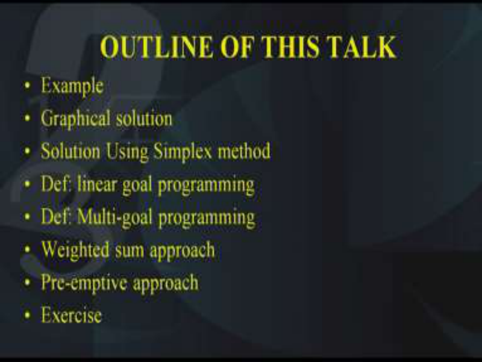

The outline of today's talk is as follows. First of all, we will consider an example of the goal programming problem. Then, we will try to solve the problem with the graphical method. Then, we will obtain the solution using the simplex method. Then, we will define what exactly do we mean by a linear goal programming problem. After that another definition which is for the multi-goal programming problem. And then, we will look at the weighted sum method and the pre-emptive method and finally an exercise, so let us begin. **(Refer Slide Time: 01:55)** 

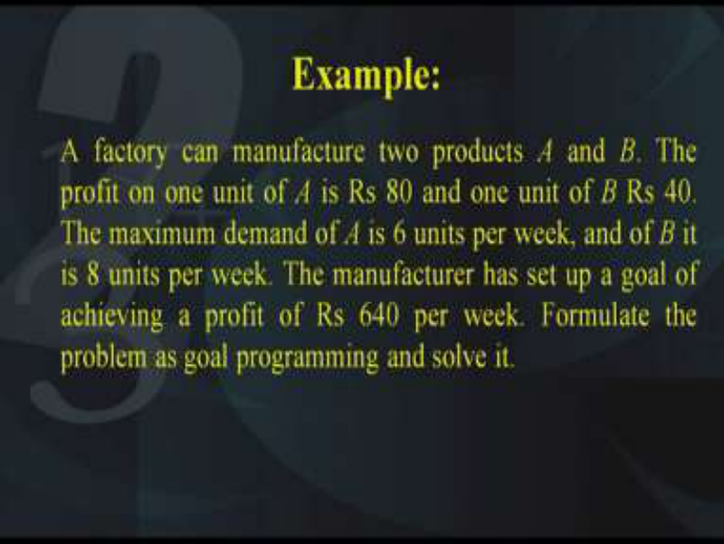

Here is an example of a real-life situation. Suppose, a factory can manufacture two products A and B. The profit on one unit of A is rupees 80 and one unit of B is rupees 40. The maximum demand of A is 6 units per week and of B is 8 units per week. The manufacturer has set up a goal of achieving a profit of rupees 640 per week. We are required to formulate the problem as a goal programming problem and solve it. **(Refer Slide Time: 02:53)** 

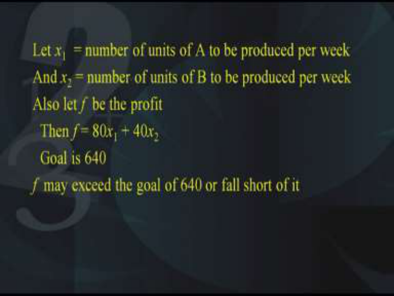

Now as you see in this problem, the profit of rupees 640 per week has been specified by the manufacturer before solving the problem. Now coming to the solution of the problem, let us define two variables x1 and x2 as follows. Let x1 be the number of units of A to be produced per week, similarly let x2 be the number of units of B to be produced per week. Also, let f denote the profit. 

Then as before, the expression for the profit f can be written as 80 _x_ 1 + 40 _x_ 2. Also, the goal is 640 rupees. Now if that is the profit, may exceed the goal of 640 or may fall short of it; So, these are the two possibilities and the third possibility is that it may be exactly equal to 640. So, let us try to visualize all these situations with the help of defining variables. 

**(Refer Slide Time: 04:39)** 

So therefore, let u and v be two variables which are defined as follows. Let u > 0 denote the shortfall that is the under-achievement of the goal. Similarly, let v > 0 be the excess or the over-achievement of the profit from the goal. Now as I said, there will be three possibilities that could exist. The cost will be as follows. The goal will be as follows. The goal will either be exactly achieved, this will happen when u and v are both equal to zero. The second possibility is the over-achievement of the goal that is u=0 whereas v is strictly > 0. The third possibility is the under-achievement of the goal, in this situation, u will be strictly >0 whereas v will be exactly=0. So only these three situations are possible. Therefore, only those solutions of the linear programming problem are acceptable in which at least one of the variables u or v is 0 or both of them are 0. 

**(Refer Slide Time: 06:31)** 

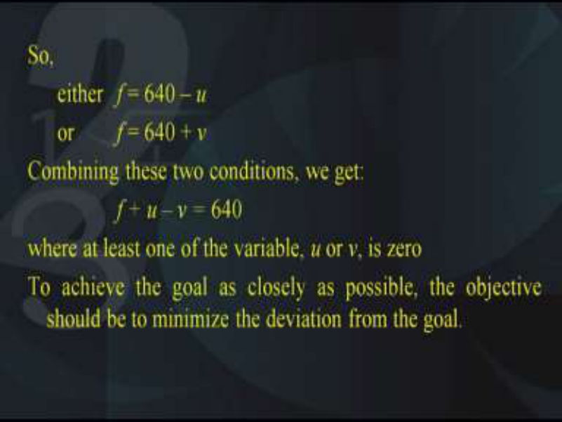

Therefore, either the value of f should be = 640-u or the value of f should be 640+v. Now, if we combine these two conditions, we get one consolidated condition as follows, f+u-v=640 where at least one of the variables u or v is 0. So, this condition f+u-v = 640 should be taken along with the condition that at least one of the variables u or v should be 0 or both of them should be 0. 

Now, in order to achieve the goal as closely as possible, the objective should be to minimize the deviations from the goal. This will be possible only if we minimize the deviations from the goal. 

**(Refer Slide Time: 08:05)** 

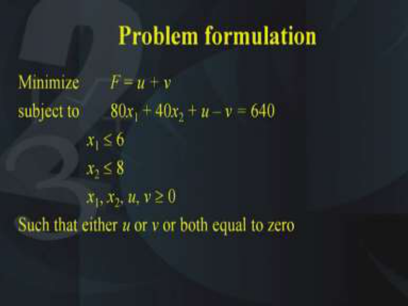

Therefore, let us set up another objective function and this will give rise to the problem formulation, minimize the deviations that is minimize. Let us denote it by capital F=u+v subject to the conditions 80 _x_ 1 + 40 _x_ 2 + _u – v =_ 640 and _x_ 1  6, _x_ 2  8 and all the four 

variables, x1, x2, u and v should be > 0. We have to ensure the conditions that either u or v or both should be equal to 0. This is the problem formulation for the given problem. 

**(Refer Slide Time: 09:13)** 

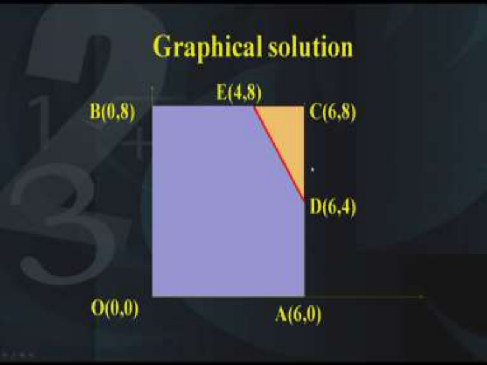

Next, let us try to solve this problem first with the graphical solution. Now, in the graphical solution we assume that for the moment we will plot on the horizontal axis the x1 variable and on the vertical axis the x2 variable and if you plot this constraints x1 <u>< 6 and x2 < 8. You</u> get this rectangular shape and the straight line the first condition, let me go back, the first constraint 80x1+40x2 for the moment if you ignore u and v, then this is equal to 640. So 80x1+40x2=640 can be plotted as follows. It is shown in the red color in the diagram which is shown by joining the points D and E. Now, if you look carefully at this diagram, here we have ignored the u and the v variables; only the x1 and x2 variables have been considered but if you look at the line segment DE, all the points on the line segment DE have either have both the values u and v=0. 

**(Refer Slide Time: 11:06)** 

This has been explained in this slide considering the function _f_ = 80 _x_ 1 + 40 _x_ 2, we find that on the line DE as shown in the red color, the value of f=640. Thus, the goal can be exactly met by choosing x1 and x2 such that x1, x2 lies on the line segment DE. Now, let us come to the points on DE. For points on DE, u and v are both 0 giving the minimum value of capital F. That is all the points on the line segment DE; the goal will be exactly satisfied. 

The second situation arises if the points x1, x2 falls in the region denoted by DEC. This is shown by the peach colored area. In this region, the profit is over and above 640. This indicates by the variables u=0 and v is strictly>0. The third situation arises if x1 and x2 fall in the region for OADEB as shown in the purple color of the diagram. The points in this region is < 640 which is indicated by the variables u is strictly>0 and v=0. 

**(Refer Slide Time: 13:22)** 

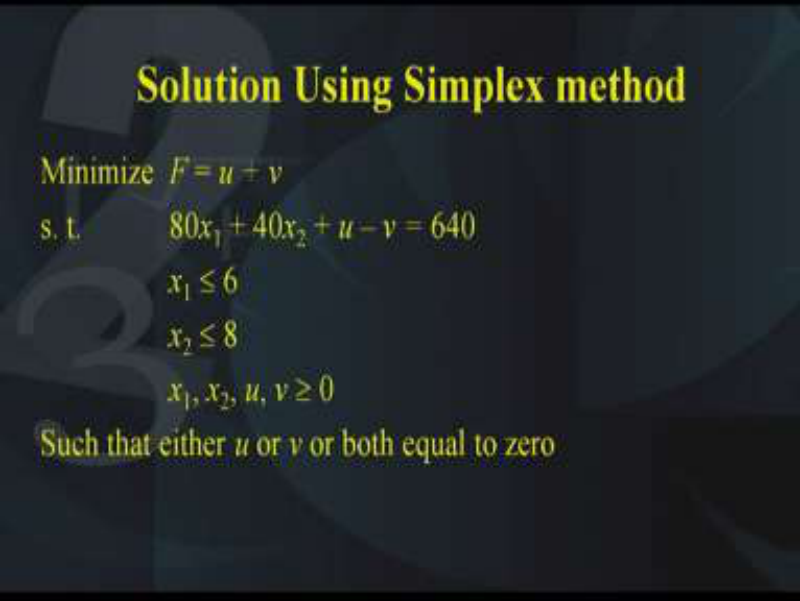

Now, let us try to solve the same problem with the help of the simplex method. The reason why I have taken this particular example is to illustrate viz-a-viz the graphical solution what happens in the simplex calculations because this was only a two variable problem. However, when a larger sized problem is encountered, then it is not possible to solve with the graphical method. Therefore, we will solve it with the simplex method. So, coming to the simplex formulation, the formulation is as before minimization of  F=u+v subject to 80 _x_ 1 + 40 _x_ 2 + _u – v =_ 640, _x_ 1  6 and _x_ 2  8 and all the four variables x1, x2, u and v should be > 0 such that either u or v or both are equal to 0. 

**(Refer Slide Time: 14:43)** 

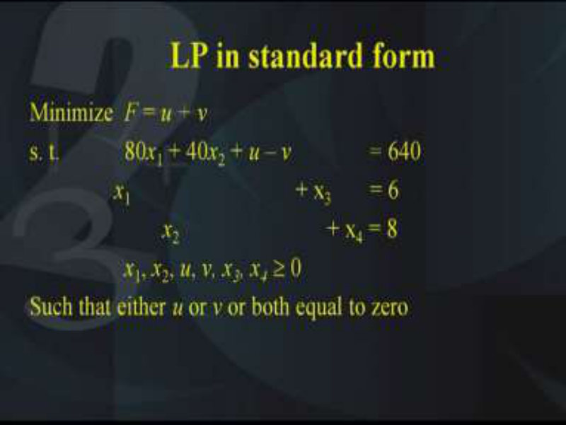

So, in order to solve the problem, we first need to convert the problem in the standard form. Therefore, we need to add slack and surplus variables and this is what the formulation looks like, minimization of u+v subject to 80 _x_ 1 + 40 _x_ 2 + _u – v =_ 640 and the second constraint becomes x1+x3=6, here x3 is a slack variable because this was a constraint of the less than equal to type and similarly the third constraint becomes x2+x4=8. Of course all the six variables x1, x2, u, v, x3 and x4 should be > 0 with the condition that either u or v or both are 0. 

**(Refer Slide Time: 15:57)** 

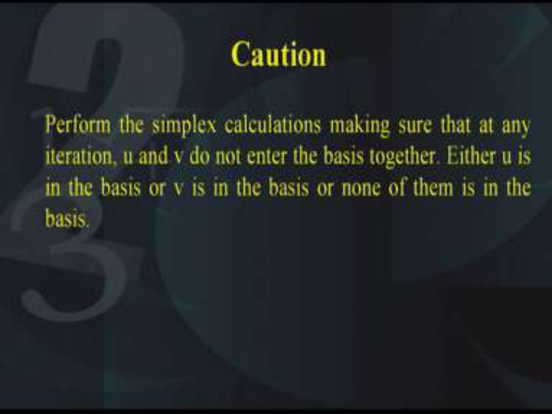

Now, when we solve this problem with the simplex method, we have to be very careful because we have to perform the simplex calculations making sure that at any iteration u and v do not enter the basis together. Either u should enter the basis or v should enter the basis. So, therefore, we have to make sure that in the entire simplex calculations, this condition is hold. **Refer Slide Time: 16:37)** 

In this table, I have illustrated the simplex calculations and as you can see that at each iteration we are getting either one of the variable u or the other variable v into the basis and at some iterations both of them have left the basis. The idea is that u and v should not enter into the basis together. So therefore, in the first iteration, we have the basis as 0 u, x3 and x4; similarly u, x1 and x4 and finally x2, x1 and x4. 

So, this indicates that we have to perform the simplex calculations as before only making sure that the conditions on u and v should be followed. Now, if you look at the last table, the final table, you find that the condition for multiple solution is holding and what is the condition for multiple solution? It is that the deviation entries corresponding to the non-basic variable is 0. So, here you can see that this entry corresponding to the x3 variable in the deviation row of the final table is 0. This is an indication that the problem has multiple solutions. So, what we need to do? We need to perform another iteration to get the other multiple solution. 

**(Refer Slide Time: 18:36)** 

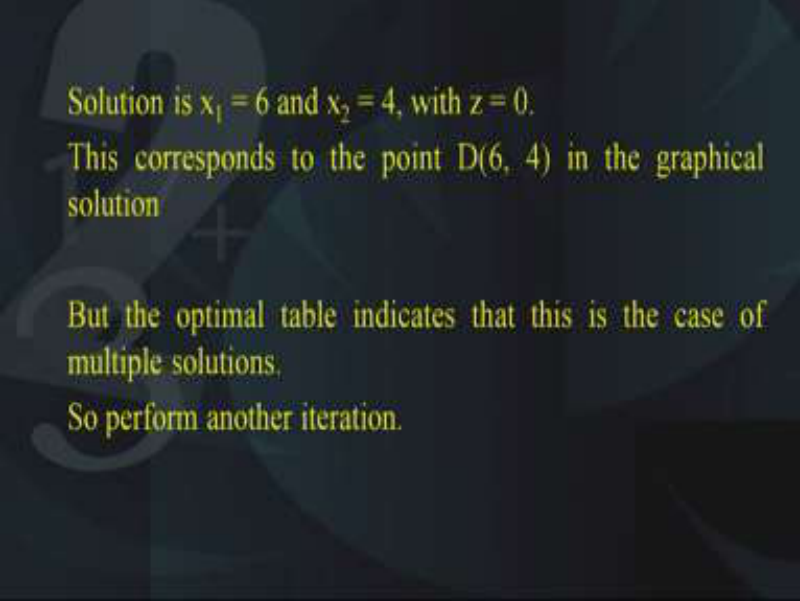

So, the solution is x1=6, x2=4 with z=0. This corresponds to the point D in the diagram. So, if you look at the diagram, the point D given by (6, 4) is the solution what we have obtained using the simplex method, but the optimal table indicates that this is the case of multiple solutions, so we need to perform another iteration. 

**(Refer Slide Time: 19:13)** 

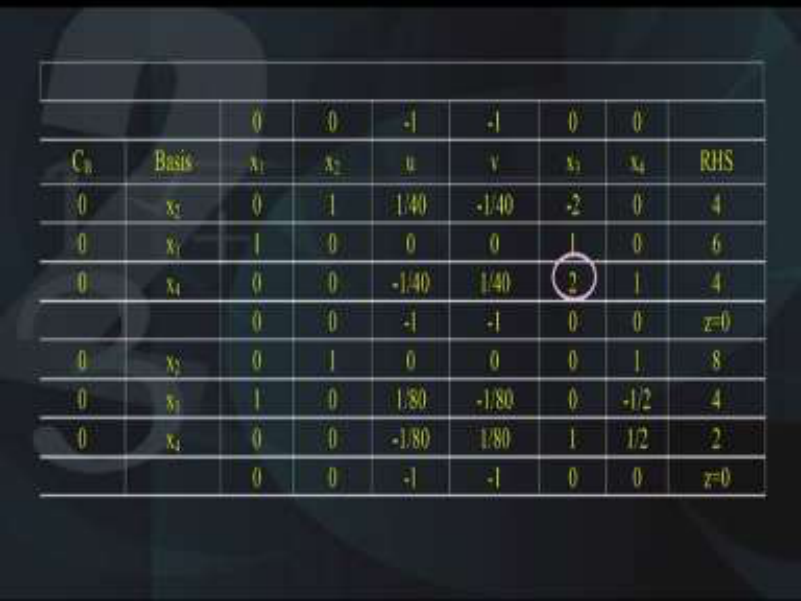

And we find that when we perform another iteration, we get another solution and what is that solution? This solution is shown in the second iteration of this slide, which gives us the answer as follows. 

**(Refer Slide Time: 19:34)** 

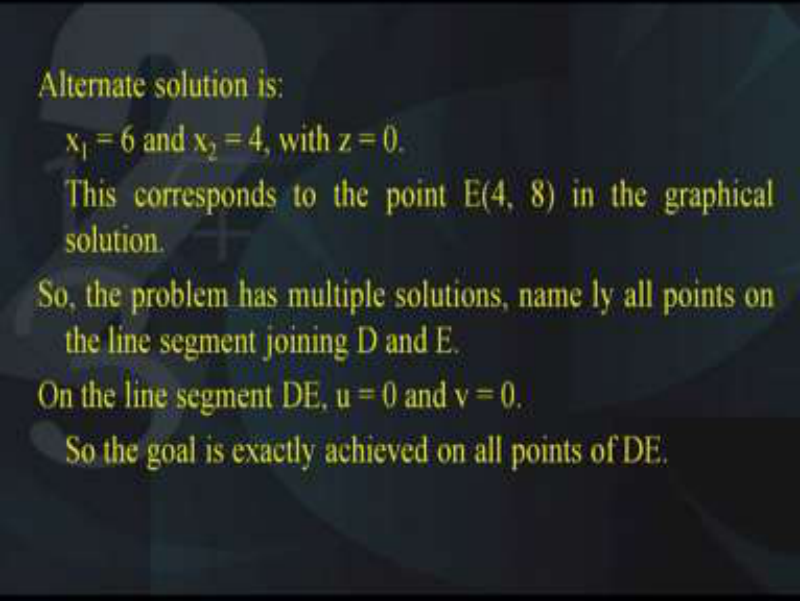

That is the alternate solution is x1=6 and x2=4 with z=0. This corresponds to the point E given by (4, 8) in the graphical solution. Therefore, the problem has multiple solutions namely all points on the line segment D and E. On the line segment D and E, u is also 0 and v is also 0. So, on all points of the line segment D and E, the goal is exactly satisfied on all the points of the line segment DE and this matches with our graphical solution. So, the goal is exactly achieved on all points of DE. Of course, using the simplex method it is difficult to identify the under-achievement and the over-achievement solutions. 

**(Refer Slide Time: 20:44)** 

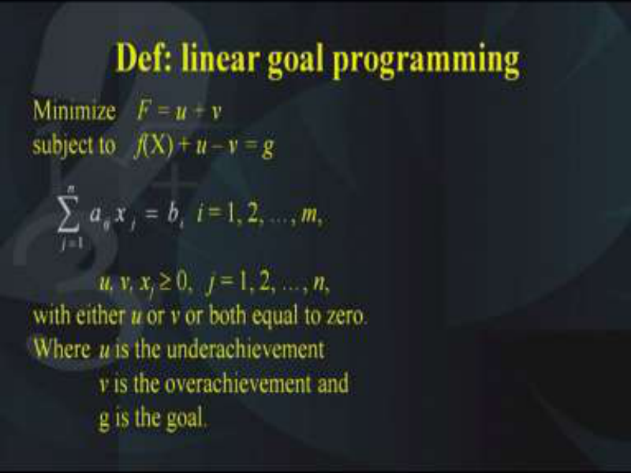

So, once we have finished with this example, now let us try to generalize the definition of a linear goal programming problem. It can be written as follows, minimization of capital F=u+v where u and v are the underachieved and the overachieved variables and this should be subject to f(X). This f(X) is nothing but the objective function of the problem that is f(X) +u-v=g, g is the goal and this is subject to the conditions, = _bi_ , where i goes from 1, 2 up to m and u, v, xj <u>> 0 where j=1, 2, n with either u or v or both=0 where u is the under-</u> achievement, v is the over-achievement and g is the goal. This describes the most general linear goal programming problem. **(Refer Slide Time: 22:08)** 

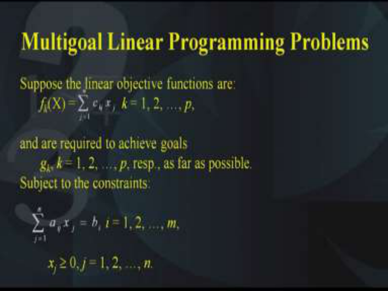

Now, in reality there may be a possibility that there are multiple goals of the problem. What does this mean? Suppose, the linear objective functions in a problem are p in number, so suppose there is one objective function let us say f1(X), another objective function f2(X), 

another objective function fp(X). So, there are p objective functions and each of the objective function has a different goal. So, let us try to denote the goals by gk and the value of k goes to 1, 2 up to p. So, we want that each of the objective function fi should reach the corresponding goal gi as closely as possible. Of course, the constraints will be all common to all the objective functions. So, what are the constants? They are the usual constraints. = _bi_ and of course the decision variables xj should be > 0. 

**(Refer Slide Time: 23:35)** 

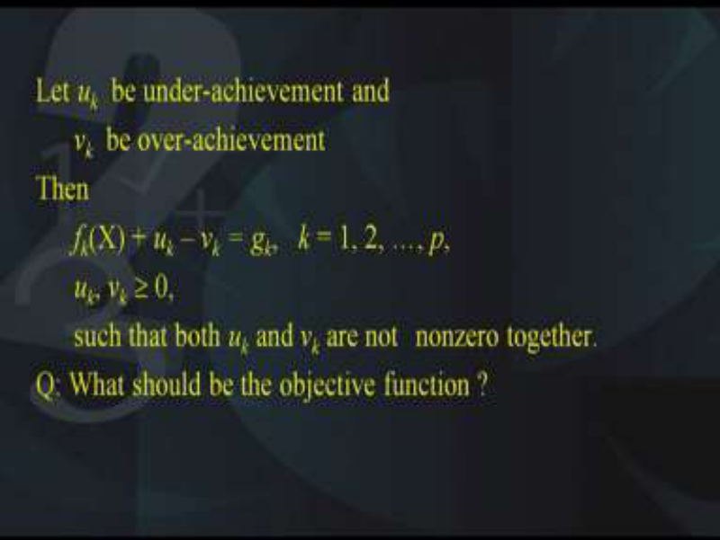

Now, let us denote by _uk_ the under-achievement variables and similarly _vk_ the overachievement variables. Then, we can denote _p_ number of equality constraints as before, that is fk(X) + uk - vk=gk where the value of k goes from 1, 2 up to p and uk and vk should be > 0 such that both uk and vk are not nonzero together. Now the question is what should be the objective function of the multi-goal programming problem? So, can you guess? 

Yes, it is similar to the case of the single goal programming problem. All you need to do is club together, all the uk’s and the vk’s and take their summation and minimize them. **(Refer Slide Time: 24:56)** 

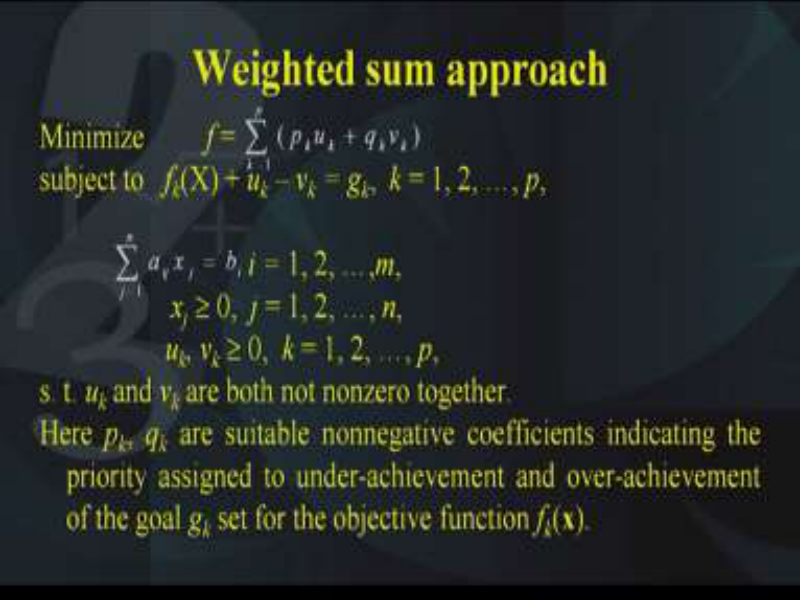

So, therefore the weighted sum approach tells us that we need to minimize f= _+ qk vk ,_ where pk and qk are the corresponding weights that you would like to assign to each of the uk's and the vk’s. Of course, it is subject to the original conditions, the p conditions that we are talking about, that is fk(X) + uk - vk = gk and the conditions of = _bi_ , i=1, 2,…, m; xj > 0; j=1, 2,… n and uk and vk should be > 0 such that uk and vk are both not nonzero together. As I said pk and qk are suitable non-negative coefficients which indicate the priority that should be assigned to the under-achievement and the over-achievement of the goals gk set for the objective functions fj(x). 

That is you are given the freedom of assigning suitable weights to each of the objectives. 

Next, we have the pre-emptive method. **(Refer Slide Time: 26:50)** 

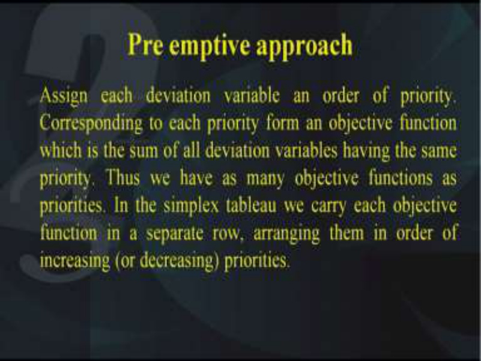

Here in this method, we assign each deviation variable an order of priority that is we want to say that each variable should be given different priority depending upon the user. Corresponding to each priority form an objective function which is the sum of all the deviation variables having the same priority. Thus, we have as many objective functions as priorities. In the simplex calculations, we carry out each objective function in a separate row and arranging them in order of their increasing or decreasing priorities. So, the same calculations can be rearranged in the simplex calculation corresponding to each of the objective functions. 

**(Refer Slide Time: 27:47)** 

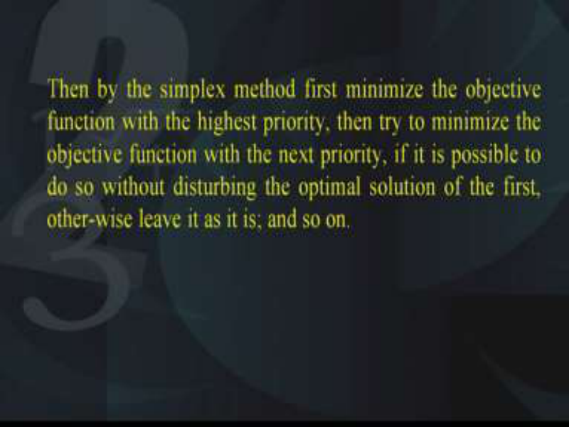

Then, by the simplex method first minimize the objective function with the highest priority, then try to minimize the objective function with the next priority, if it is possible to do so without disturbing the optimal solution of the problem, otherwise leave it as it is and move on to the next objective function. So, let us now take another example. **(Refer Slide Time: 28:25)** 

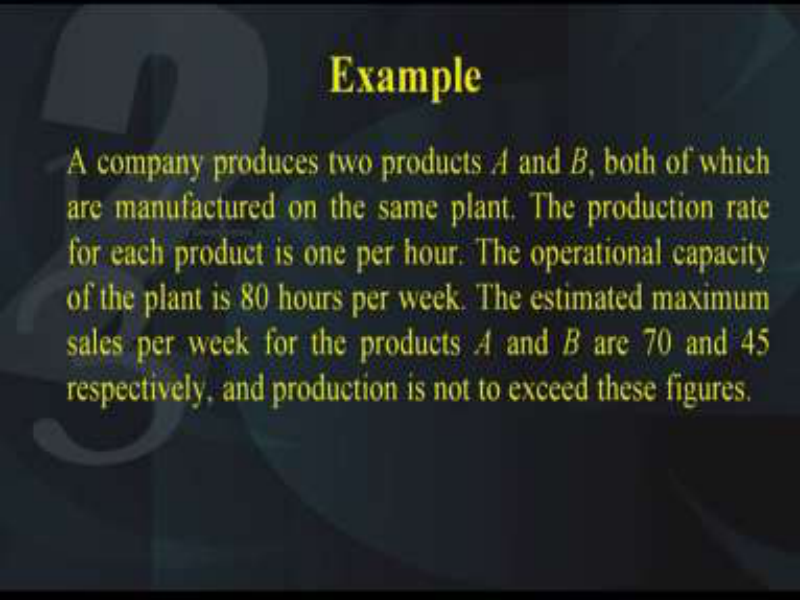

Suppose, a company produces two products A and B, both of which are manufactured on the same plant. The production rate for each product is one per hour. The operational capacity of the plant is 80 hours per week. The estimated maximum sales per week for the product A and B are 70 and 45 respectively, and the production is not to exceed these figures. **(Refer Slide Time: 29:04)** 

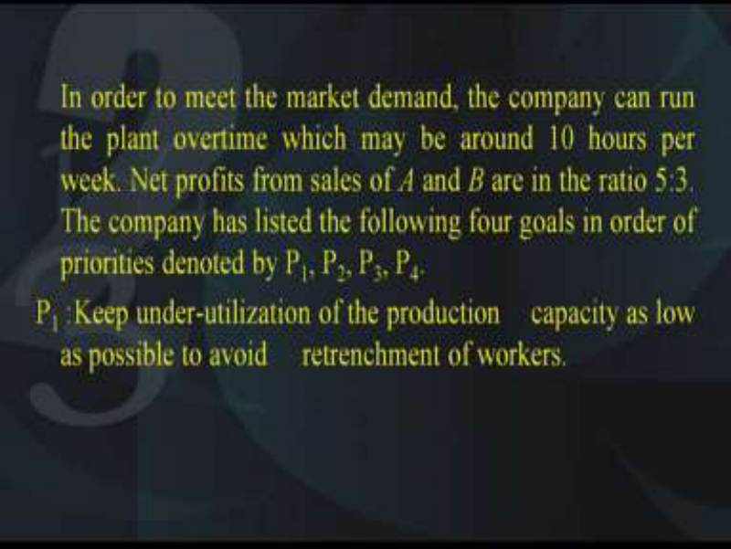

In order to meet the market demand, the company can run the plant overtime which may be our around 10 hours per week. Net profits from the sale of A and B are in the ratio of 5:3. The company has listed the following goals in order of priority P1, P2, P3 and P4. The first goal P1 is keep under-utilization of the production capacity as low as possible to avoid retrenchment of workers. 

**(Refer Slide Time: 29:59)** 

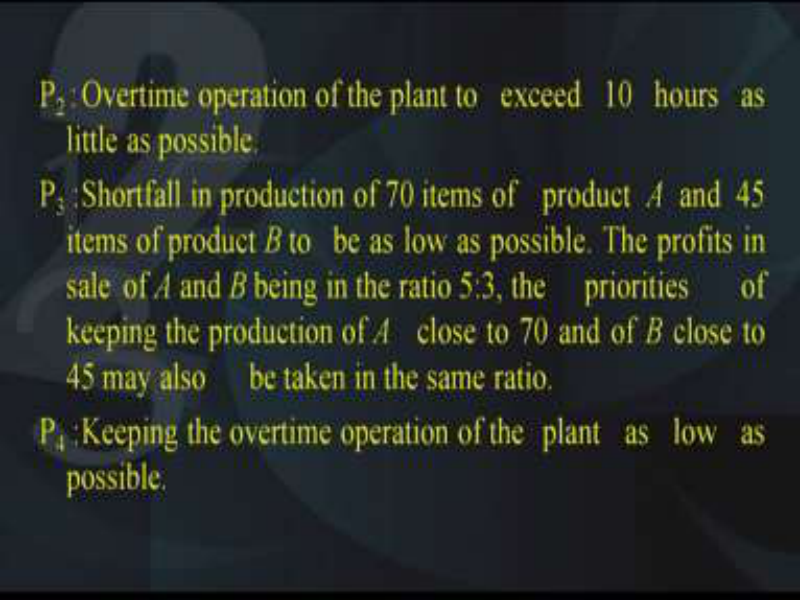

Similarly, the second goal P2 is overtime operation of the plant to exceed 10 hours as little as possible. The third goal P3 is shortfall in production of 70 items of product A and 45 items of product B to be as low as possible. The profits on sale of A and B being in the ratio of 5:3, the priorities of keeping the production of A close to 70 and that of B close to 45 may also be taken in the same ratio and the last goal P4 is keeping the overtime operations of the plant as low as possible. 

**(Refer Slide Time: 31:06)** 

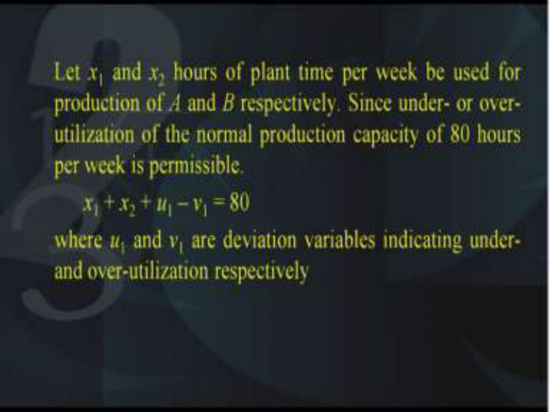

So, let us now try to model this. Let x1 and x2 hours of plant time per week be used for production of A and B respectively. Since under or over-achievement of the normal production capacity of 80 hours per week is allowed. Therefore, we have a constraint _x_ 1 + _x_ 2 + _u_ 1 – _v_ 1 = 80, where u1 and v1 are the deviation variables indicating under-achievement and over-achievement respectively. 

# **(Refer Slide Time: 31:57)** 

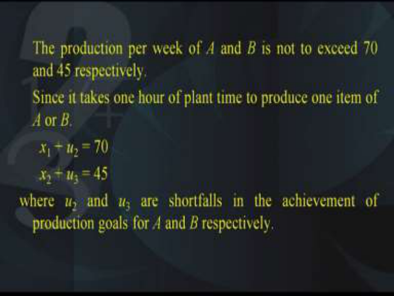

Then, the production per week of A and B is not to exceed 70 and 45 respectively. Since it takes one hour of plant time to produce one item of A or B therefore we have the conditions; _x_ 1 + _u_ 2 = 70, _x_ 2 + _u_ 3 = 45, where the variables u2 and u3 are shortfalls in the achievement of the production goal for A and B respectively. 

**(Refer Slide Time: 32:55)** 

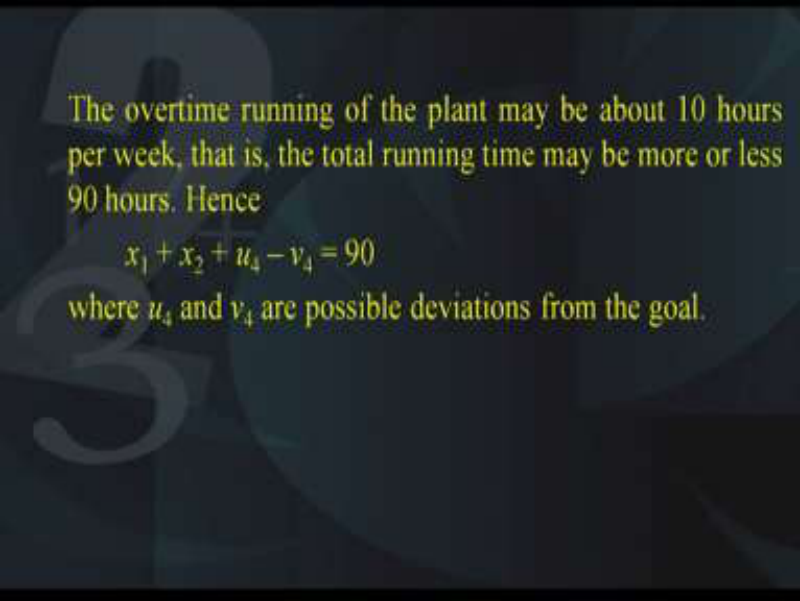

Then, the overtime running of the plant may be about 10 hours per week that is the total running time may be more or less 90 hours. Hence, we have a condition _x_ 1 + _x_ 2 + _u_ 4 – _v_ 4 = 90, where u4 and v4 are the possible deviations from this goal. **(Refer Slide Time: 33:25)** 

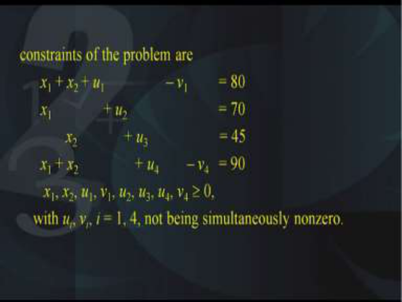

Therefore, the constraints of the problem look like this _x_ 1 + _x_ 2 + _u_ 1– _v_ 1 = 80, _x_ 1 + _u_ 2 = 70, _x_ 2 + _u_ 3 = 45, then the fourth constraint is _x_ 1 + _x_ 2   + _u_ 4  – _v_ 4    = 90 and all the variables _x_ 1, _x_ 2, _u_ 1, _v_ 1, _u_ 2, _u_ 3, _u_ 4, _v_ 4  0 such that the conditions _ui_ , _vi_ , _i_ = 1, 4 should not be 0 simultaneously. 

**(Refer Slide Time: 34:28)** 

Now using the weighted sum, we can tabulate the priorities of the goal in this table. In the first column, we have the priorities of each of the four goals and in the second column, we have the corresponding decision variables and finally in the third column, we have the corresponding weights of these goals, priorities. As you can see, P1 has a decision variable u1 and let us assume that its weight is 10. Similarly, P2 has the decision variable v4 and let us assume that its weight has 8. Similarly, P3, it has two variables u2 and u3 and they have their weights as 5 and 3, and the P4 has the decision variable v1 and it has weight 1. So, combining 

all these information into one, we can frame the objective function as _f_ = 10 _u_ 1 + 8 _v_ 4 + 5 _u_ 2 + 3 _u_ 3 + _v_ 1. So, this is the overall objective function of this problem. **(Refer Slide Time: 36:34)** 

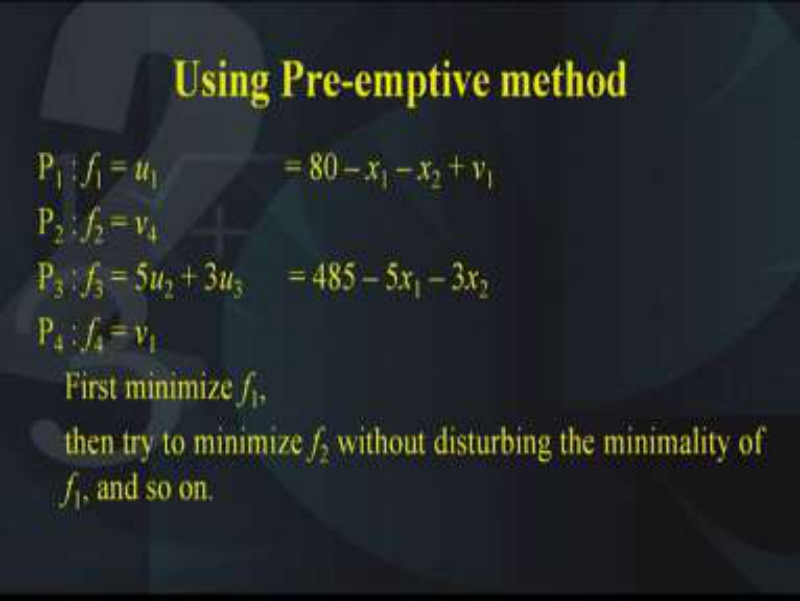

So, using the pre-emptive method we can say that P1 has _f_ 1 = _u_ 1 which is = 80 – _x_ 1 – _x_ 2 + _v_ 1, P2 has _f_ 2 = _v_ 4, P3 has _f_ 3 = 5 _u_ 2 + 3 _u_ 3  = 485 – 5 _x_ 1 – 3 _x_ 2, P4: _f_ 4 = _v_ 1. The first minimum f1, first of all we will minimize f1 then we will try to minimize f2 without disturbing the minimality of f1 and so on. So, we will keep on retain the minimality of the previous function so that the next one can be minimized. So, at the end, now I would like to give you an exercise. **(Refer Slide Time: 37:34)** 

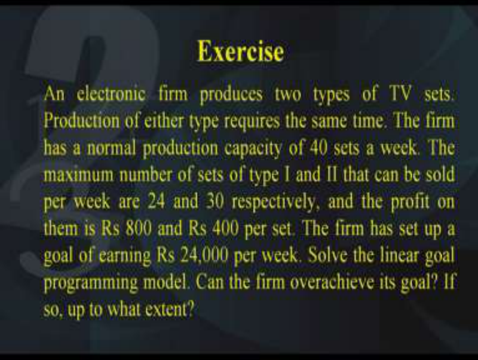

An electronic firm produces two types of TV sets. Production of either type requires the same time. The firm has a normal production capacity of 40 sets a week. The maximum number of sets of type I and II that can be sold per week are 24 and 30 respectively, and the profit on 

them is rupees 800 and rupees 400 per set. The firm has set up a goal of earning rupees 24,000 per week. 

Solve the linear goal programming model and can the first can the firm over achieve its goal? If so, up to what extent? Now, the answer to the problem is written here. 

**(Refer Slide Time: 38:43)** 

It is minimize _u + v_ subject to 800 _x_ 1 + 400 _x_ 2 + _u_ – _v_ = 24000 subject to the conditions _x_ 1 + _x_ 2  40, _x_ 1  24, _x_ 2  30 and _x_ 1, _x_ 2, _u_ , _v_  0 and u and v are not simultaneously nonzero. The solution to the problem is (24, 12) or (20, 20) or any convex linear combination of these two points. The firm can over achieve its goal up to rupees 25000 by producing 25 color and 16 black and white TV sets. 

So, like this we have illustrated that we can formulate multi-goal linear programming problem or a single-goal programming problem depending upon the requirement of the problem. Thank you. 

