# **Operations Research Prof. Kusum Deep Department of Mathematics Indian Institute of Technology - Roorkee** 

# **Lecture – 29 Assignment Problem** 

Good morning students, this is lecture number 29, it is based on special types of LPPs and today we are going to learn the assignment problem. Now the assignment problem is a special class of the linear programming problems and it is actually a special case of the transportation problem that we have studied earlier. 

**(Refer Slide Time: 00:59)** 

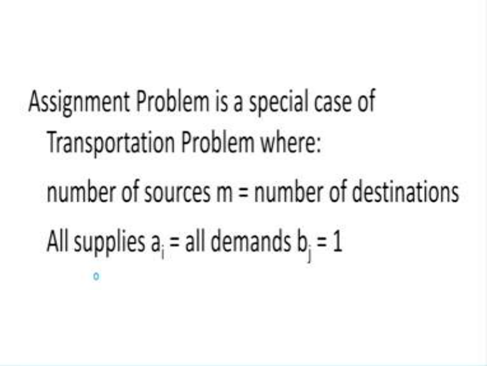

Now in this case, the transportation problem when the number of sources which is usually equal to m and the number of destinations which is usually equal to n when they are both same. And also all the supplies at the sources and all the demands at the destinations they are all equal to 1. So the generalized transportation problem when it satisfies these conditions then it is said to be an assignment problem. 

**(Refer Slide Time: 01:37)** 

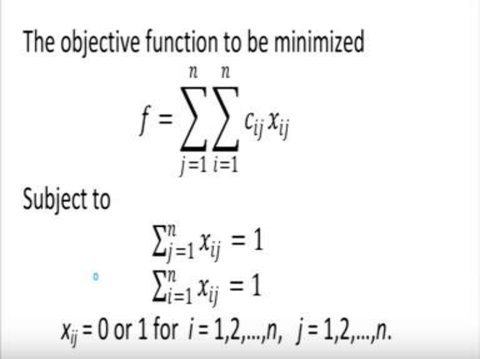

Now let us look at it mathematically, the objective function to be minimized is ,  which is subject to = 1 and = 1. Now xij’s, they should be either 0 or 1 for all i and j going from 1 to n. Now the constraints are actually the row sums =1 and the 2nd set of constraints is the column sums =1. cij’s are the real numbers, which denote the cost coefficient corresponding to the matrix that we have. 

**(Refer Slide Time: 02:40)** 

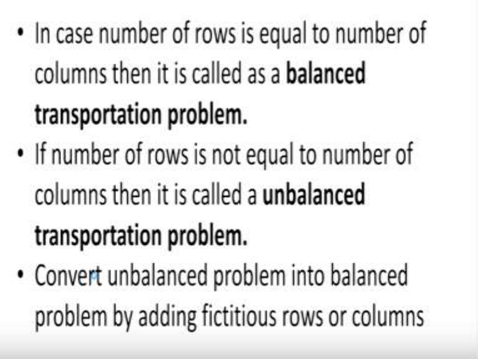

Now in case, the number of rows = the number of columns then it is called as a balanced transportation problem or a balanced assignment problem, whereas if the number of rows is not equal to the number of columns then it is called as a unbalanced transportation problem. 

However, in case the problem is a unbalanced problem then as I have already explained in the case of the transportation problem, the dummy rows or the dummy columns have to be added so that the problem when it is an unbalanced problem that becomes a balanced one. 

**(Refer Slide Time: 03:31)** 

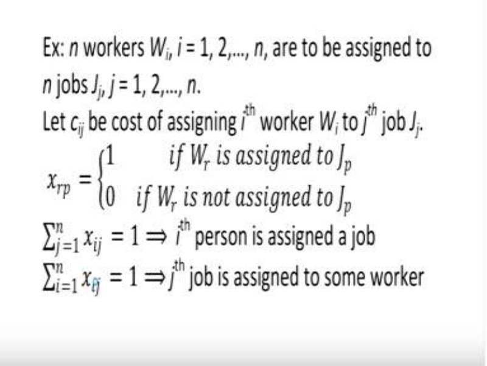

Now let us consider the following example, let us suppose that there are n workers W1, W2,…., Wn and these workers are supposed to be assigned to n jobs j1, j2,…,jn and let us suppose that cij are real numbers is the cost of assigning the ith worker Wi to the jth job Jj. Now since our xij’s are the decision parameters, we can define our xrp as 1 if Wr is assigned to Jp ; and 0 if Wr is not assigned to Jp. So it becomes a 0-1 programming problem that is the decision parameters are taking only two values either 0 or 1. Also the row sums =1 that is = 1, this implies that the ith person is assigned to a job and the column sum that is = 1 , i goes from 1 to n implies that the jth job is assigned to some worker. So this assignment has to be uniquely defined. 

**(Refer Slide Time: 05:14)** 

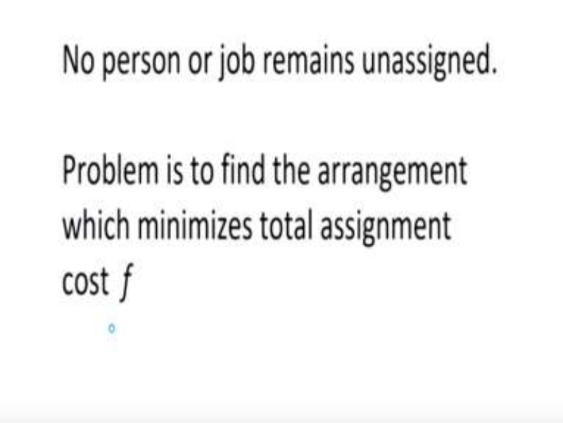

In other words no person or job remains unassigned and the problem becomes we have to find out the arrangement which minimizes the total cost of the assignment denoted by f. **(Refer Slide Time: 05:36)** 

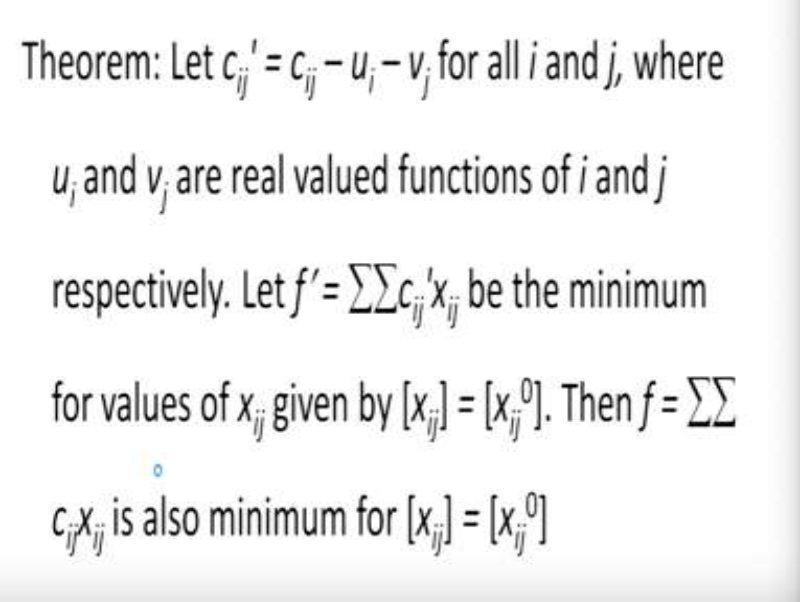

So in order to solve this special kind of problem we need a theorem which states the following, let _cij' = cij – ui – vj ;_ for all i and j, where ui and vj are real valued functions of i and j respectively. And let _f_  _=_  _cij'xij_ be the minimum for the values of xij given by [ _xij_ ] _=_ [ _xij_0 ]. Then Then _f =_  _cijxij_ is also minimum for [ _xij_ ] _=_ [ _xij_0 ].  The meaning of this theorem states that if we want to subtract some constants from the cij’s which is the cost coefficient matrix then the optimality will not be affected. So this theorem allows us to subtract any kind of a constant 

from the cost matrix. This is the basis, based on which the method for solving the assignment problem has been designed. 

**(Refer Slide Time: 07:07)** 

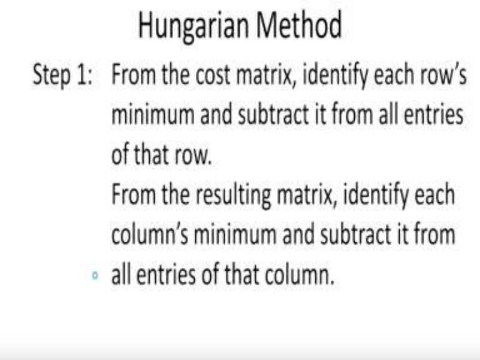

To solve the assignment problem, the well-known Hungarian method is there and it has the following steps: step number 1; from the given cost coefficient matrix identify each rows minimum and subtract it from all entries of that row. What does this mean? this means that suppose from the 1st row find out its minimum value and subtract that minimum value from all entries of that row. This has to be done for all the rows and once all the rows are completed then from the remaining entries repeat this for the column and that is the 2nd part of the step number 1; that is from the resulting matrix identify each column’s minimum and subtract it from all entries of that column. Now I will explain this method side by side with the help of an example. **(Refer Slide Time: 08:20)** 

So, let us suppose the workers that we have the 5 workers W1,W2 up to W5 they have to be assigned to 5 jobs, that is J1, J2, Jn and the cost coefficient matrix is given here in this table. So what we need to do is, we need to find out the minimum of each of the rows so as you can see, that from the 1st row the minimum is 7 it is written in a blue colour, so we need to subtract 7 from all the entries of the 1st row. 

Similarly the minimum of the 2nd row is 6, so we need to subtract 6 from all the entries of the 2nd row. And like this, we need to subtract 6 from all entries of the 3rd row and we need to subtract 8 from all the entries of the 4th row and 5 from all the entries of the 5th row. When we perform these operations this is the resulting matrix that we get. So as you can just check 8-7 is 1, 10-7 is 3, 14-7 is 7, 12-7 is 5, and 7-7 is 0. Like this you can check all the rows have been used by subtracting the minimum of each row. And this means that in each row somewhere or the other you will get a 0 entry. Now once you have done this for all the rows, you have to repeat the process for the columns and you can see that in the 1st column the entries are now 1,0,6,3,0 so what is the minimum? minimum is 0, 2nd column 3,10,5,0,5; so minimum is 0. 3rd one 7,7,0,5,10 minimum is 0 and the 4th column is 5,6,2,4,4, here the minimum is 2 and like this the last column also minimum is 0. So again the same thing we have to do that is we have to subtract 0 because that is a minimum so that will not affect. Only the 4th column will be effected because the minimum of the 4th column is 2 and we have to subtract 2 from all entries of the 4th column. 

So the resultant matrix will look like this, please check 1,3,7,3,0; 0,10,7,4,4; 6,5,0,0,1; 3,0,5,2,0; 0,5,10,2, and 9. Now you will observe that in some rows or columns 0 is appearing more than once; does not matter. Now the next step has to be implemented so this 1st step is completed. 

**(Refer Slide Time: 11:58)** 

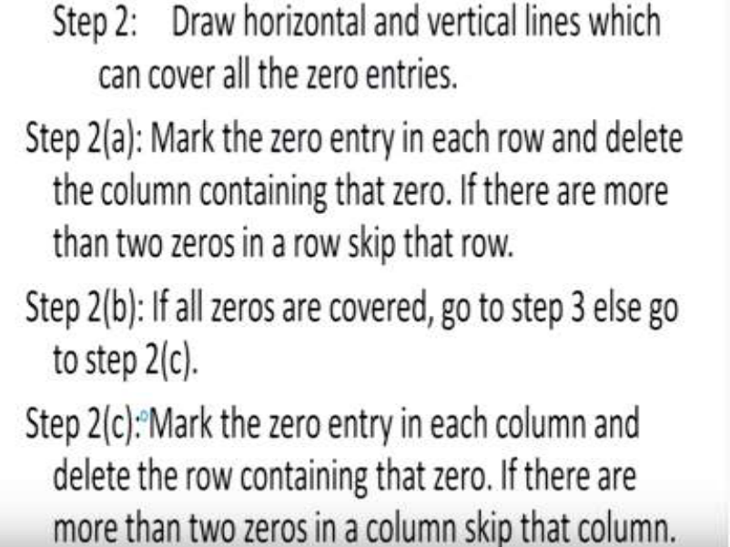

Now what is the 2nd step, the 2nd step says we have to draw horizontal and vertical lines which can cover all the 0 entries, what does this mean? It means that we have to identify all the zeros and we have to delete those rows so the step 2(a) says mark the 0 entry in each row and delete the column containing that 0. Of course, if there are more than two zeros in a row skip that row. 

And the step 2b says, if all the 0s are covered go to step 3 else go to step 2c and 2c says, mark the 0 entry in each column and delete the row containing that 0. If there are more than two zeros in a column skip that column. 

**(Refer Slide Time: 13:06)** 

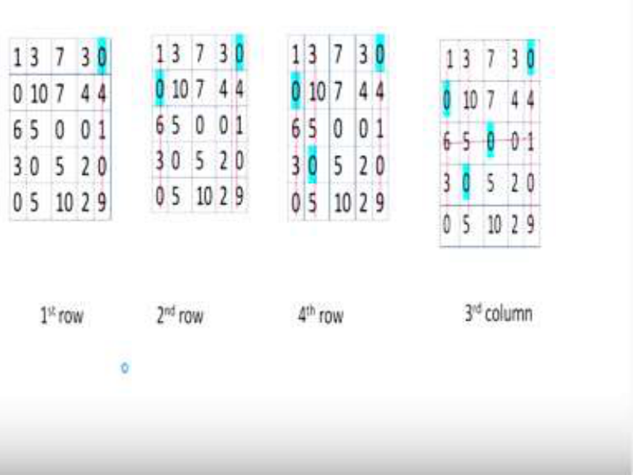

Now what does this mean again coming back to our example, let us look at the 1st row, in the 1st row the row says 1,3,7,3,0 so there is only one 0 in this row, so we have to mark this 0 and after marking 0 we have to draw a vertical line that is which is going to cross the last column the 5th column. Once this is done, then we come to the 2nd row. From the 2nd row, we find 0 is at the 1st place, and this means that we have to delete or draw the vertical line in the 1st column. Then comes the 3rd row, now in the 3rd row there are two zeros. So according to the step 2(a), we are just not supposed to do anything with the 3rd row and just skip this row and then we go to the 4th row, so in the 4th row we find 0 is there and therefore we have to draw a vertical line which is going to contain that 0. 

Again coming to the 5th row we find that there are no 0’s; so again you do not have to do anything and this part of the step 2 is over. Once you have completed all the rows that is you have scanned all the rows then you have to repeat this process with the columns. So this is what happens, the 1st column is already crossed so you do not have to do anything, 2nd column already crossed so nothing to be done.  Look at the 3rd column, in the 3rd column we have a 0 so therefore we have to draw a horizontal line which will cross this 0 and that is what we have done here in this last table as you can see in the last table, 0 has been crossed out. So, 0 was found in the 3rd column and therefore it has been crossed out with a horizontal line. Remember when you are scanning the rows and you find a 0. You have to draw a vertical line and when you are scanning the columns and you find a 0 you have to draw a horizontal line. 

# **(Refer Slide Time: 15:49)** 

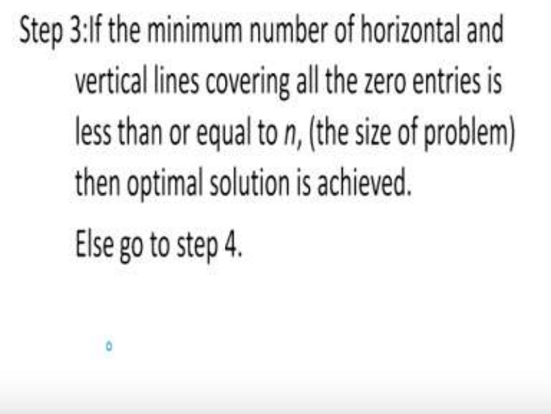

So once this is done then we move to the step 3, in the step 3 if the minimum number of horizontal and vertical lines covering all the 0 entries is < n and what is n? n is the size of the problem that is in our case n is 5 then this means that optimum solution is achieved. However if this is not true then we have to go to step 4. 

**(Refer Slide Time: 16:22)** 

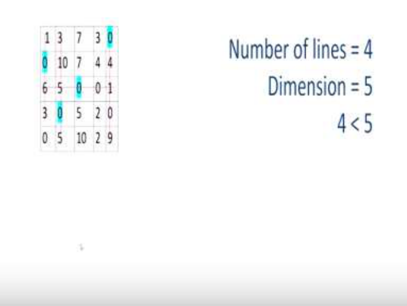

Now what does it mean, look at this table that we got in the previous step here we find that the number of lines =4; 4 lines, there are 3 vertical lines and 1 horizontal line. So there are total 4 lines crossing the zeros and the dimension of the problem is 5 which means 4 < 5 therefore the stopping criteria is not satisfied and we have to do the next step that is the step number 4. 

**(Refer Slide Time: 16:56)** 

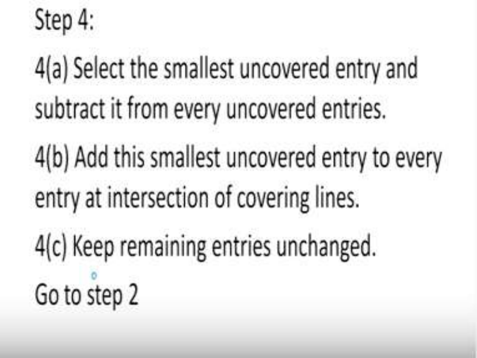

Now the step number 4 says select the smallest uncovered entry and subtract it from every uncovered entry, now you will see that there are some entries which were not crossed out. So we have to pick out the one which is the smallest from the uncovered entries and subtract it from all the uncovered entries in the table. Once you have done this then the 4(b) says add this smallest uncovered entry to every entry at the intersection of the covering lines. So there are covering lines that we have drawn there are some of the intersection points at those intersection points we have to add the smallest entry. And the 4(c) part says that all the remaining entries have to be left unchanged. So once this is done again go to step 2 and repeat the process. **(Refer Slide Time: 18:05)** 

So, let us look at this step 4 again, here the smallest uncovered entry is 2 what do you mean by uncovered entry? those entries which have not been crossed out at the moment, so the uncovered entries are 7,3,7,4,5,2,10 and 2 and among these 2 is the smallest. So therefore what we are going to do we have to subtract 2 from all the uncovered entries and once you do this this is what you get 7-2 is 5, 3-2 is 1, 7-2 is 5, 4-2 is 2, 5-2 is 3, 2-2 is 0, 10-2 is 8 and 0-0 is 0. So all the uncovered entries 2 has been subtracted from all the uncovered entries. The next part of the step says that we have to add 2 why 2 because 2 was the smallest uncovered entry; So we have to add 2 to all the intersection points of the horizontal and the vertical line. Now there are three places where the verticals and the horizontal lines are intersecting what are those three points? they are 6,5 and 1( in 3rd row). Therefore we have to add 2 to all these three entries and this is the resulting matrix that you get. This completes the 4th step. **(Refer Slide Time: 20:05)** 

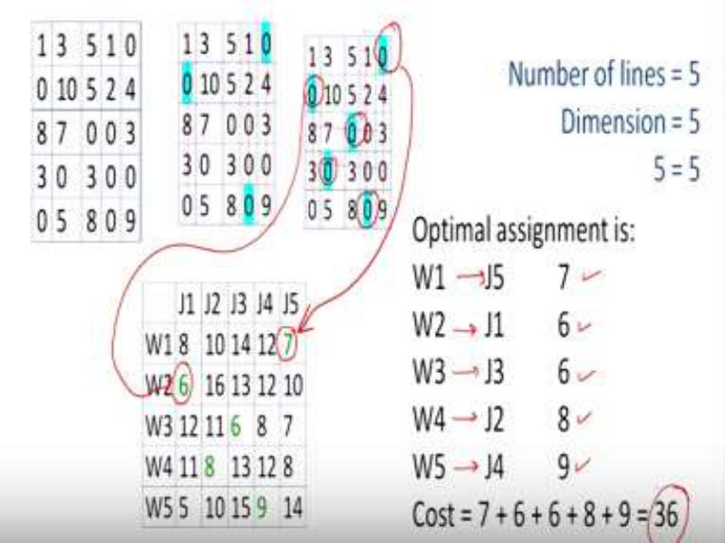

Again we have to go to step 2 and repeat the process on the leftmost we have the table that we have got 1,3,5,1,0, etc. Again we have to repeat step 2, that is, we have to determine the 0’s at each of the row. So in the 1st row we find a 0 in the last entry that is the 5th entry therefore we will draw a vertical line at the last column. Then again in the 2nd row we find there is a 0 entry at the 1st place so we again need to draw a vertical line at the 1st column.  Then coming to the 3rd column, 3rd column says there are two zeros so therefore we have to skip this line and again in the 4th row we find that there is a 0 entry so therefore the same procedure has to be repeated. And once we had to complete this then we find that the number of lines that is the number of horizontal and vertical lines is 5 and which is equal to the dimension of the problem which is =5, this means that our stopping criteria has been satisfied. 

So therefore our stopping criteria is satisfied and if you look at the original data that was given and you look at this final table that you have, this means that the assignment that is we were looking for the optimum assignment. So the optimum assignment is the one which is corresponding to the 0 entries in the last table. So W1 should be assigned to J5 why is this so? W1 is assigned to J5 why because there is this 0 entry over here. Similarly W2 is assigned to J1 why is this because there is a 0 entry over here and similarly W3 is assigned to J3 and W4 is assigned to J2 and W5 is assigned to J4 so this is the optimum assignment. Now let us look at the cost, the cost corresponding to the assignment of worker 1 to the 5th job is 7 why did this from where this 7 has come? This has come because this 7 is corresponding to this entry.  Similarly 

W2 is assigned to J1 so this 6 has come because of this entry and like this you will find that the cost corresponding to W3, J3 is 6 and the cost corresponding to W4,J2 is 8 and the cost corresponding to W5, J4 is 9. And therefore the total cost will be the total of all these costs which is 7+6+6+8+9 and that comes out to be so 36. So the overall cost of the optimum assignment is 36. 

**(Refer Slide Time: 24:04)** 

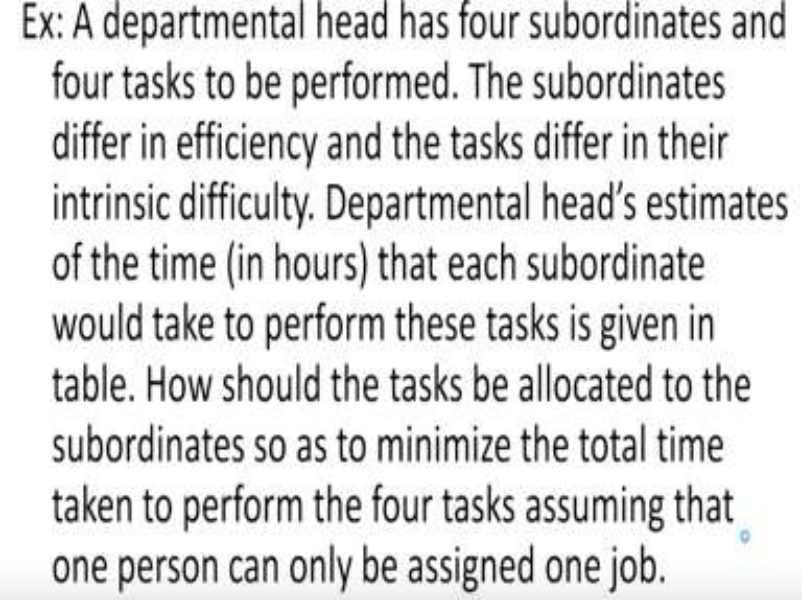

So with this I have a exercise for you, a departmental head has four subordinates and four tasks to be performed. The subordinates differ in efficiency and the tasks differ in their difficulty. The departmental heads estimates of the time in hours that each subordinate would take to perform these tasks is given in the table. How should the tasks be allocated to the subordinates so as to minimize the total time taken to perform the four tasks. 

Assuming that one person can only be assigned 1 job. 

**(Refer Slide Time: 24:52)** 

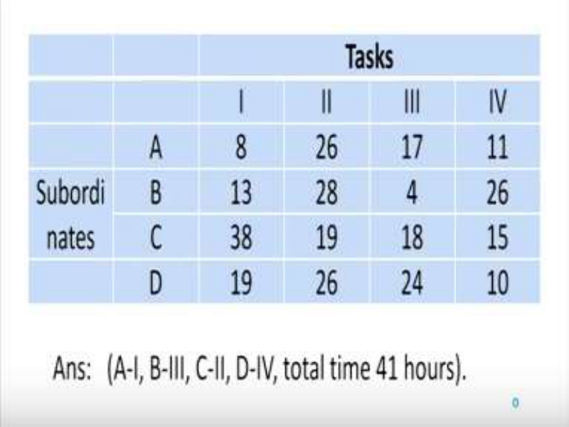

Now, the data in this problem is given as follows, that there are four subordinates ABCD and there are four tasks 1,2,3,4 and we have to assign the subordinates the various tasks and the data is given in this table. I want you to please solve this exercise I have given the answer A should be assigned to 1, B should be assigned to 3, C should be assigned to 2 and D should be assigned to 4 and the total time is 41 hours. 

So just as we have learnt in this assignment problem please use this Hungarian method to solve this problem. So using the Hungarian method please solve this example the way in which we have learnt in this lecture. Thank you. 

