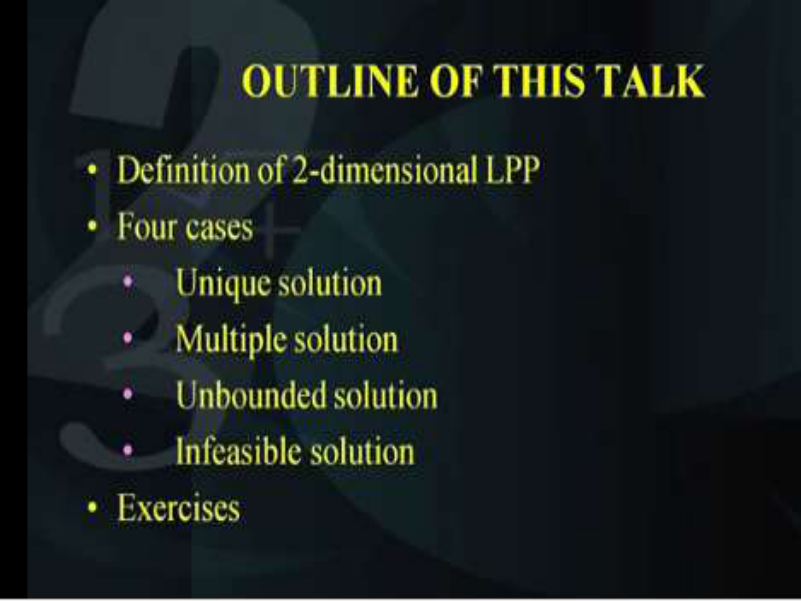
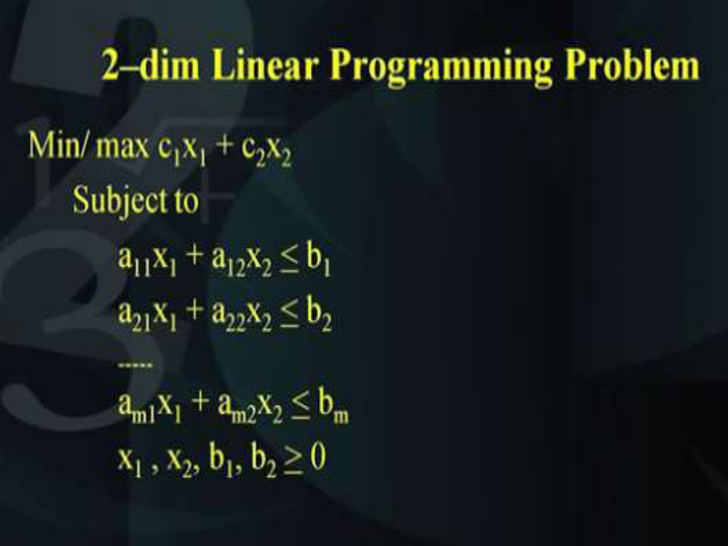
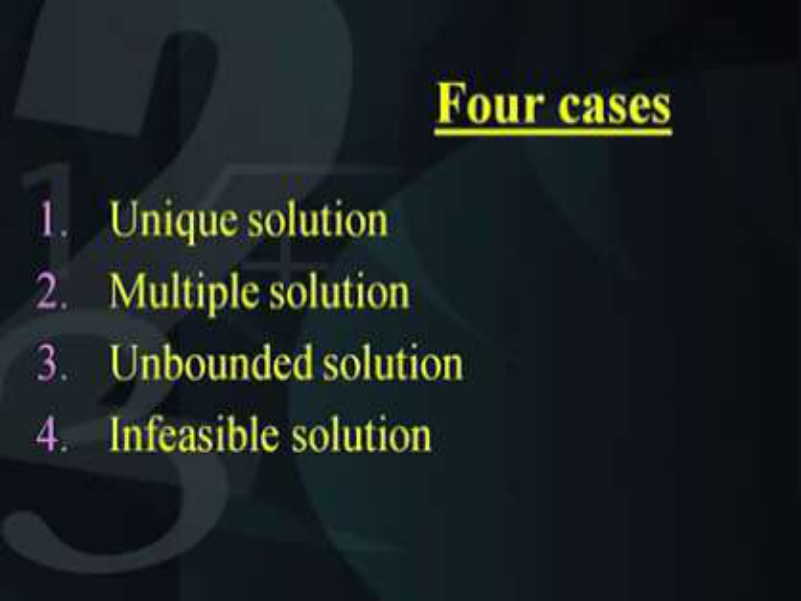
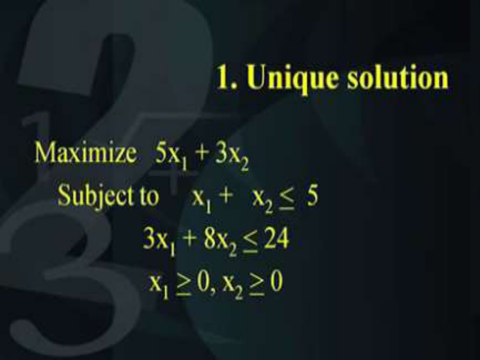
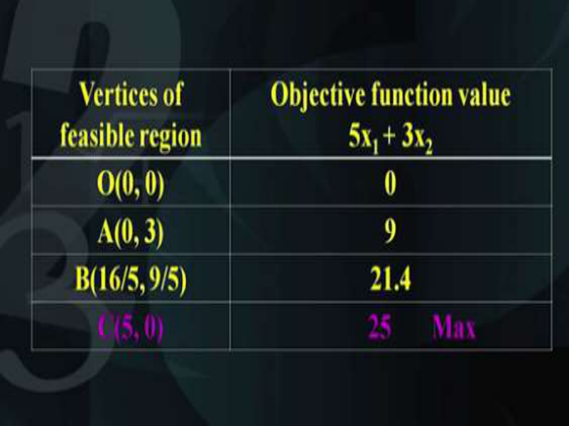
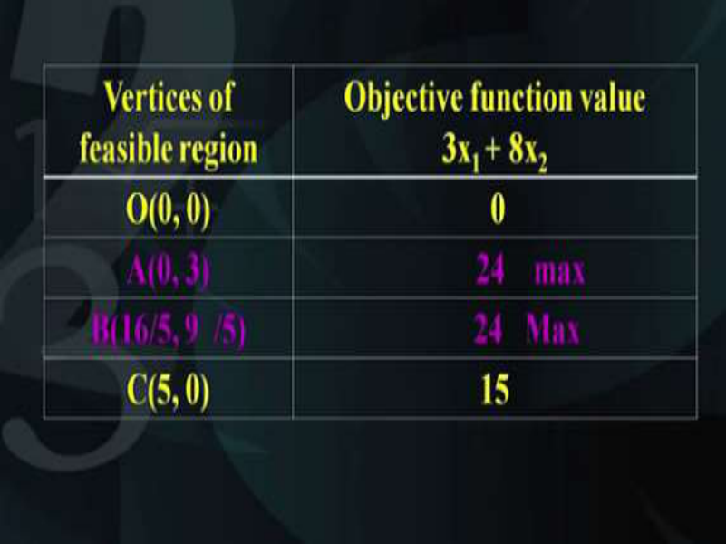
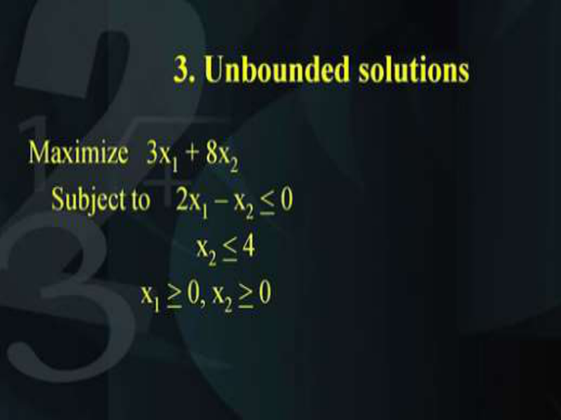
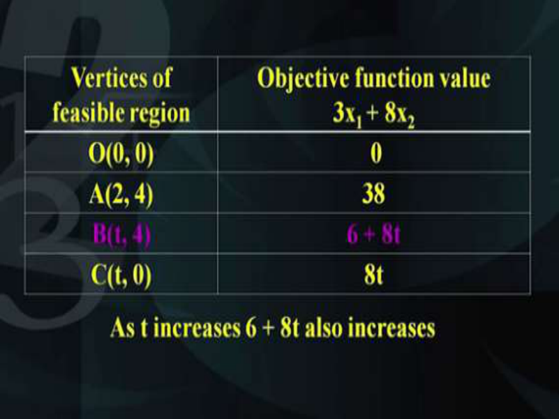
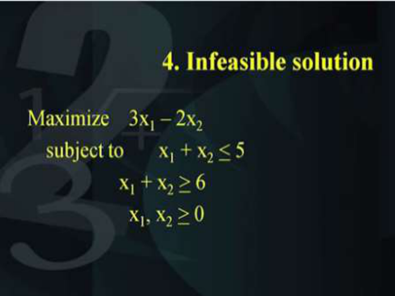
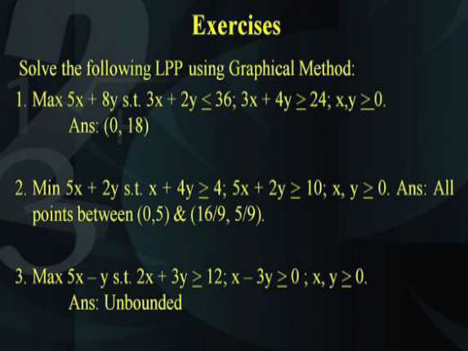

# **Operations Research Prof. Kusum Deep Department of Mathematics Indian Institute of Technology - Roorkee** 

# **Lecture – 03 Graphical Method for LPP** 

Good morning students, this is the lecture number 3, the title of this lecture is graphical method. Till now, we have seen how we can model real life problems into linear programming problems. We have also seen the definition of a general linear programming problem of n variables, as a special case the 2 dimensional linear programming problems can be solved with the graphical method and that is what we are going to study today. 

# **(Refer Slide Time: 01:09)** 

The outline of this talk is as follows; we will first look at the definition of a 2 dimensional linear programming problem, then we will study the four cases that are likely to arise while solving a 2 dimensional linear programming problem and finally, we will look at some exercises. So, first of all let us look at the definition of a 2 dimensional linear programming problem. 

**(Refer Slide Time: 01:51)** 

It states that we want to minimize or maximize c1x1 + c2x2 subject to a11x1 + a12x2 <u><</u> b1 and similarly a21x1 + a22x2 <u>< b2 and like this we could have m number of constraints that is am1x1 +</u> am2x2 <u>< bm, x1 and x2 are the decision variables and they have to be > 0 and all the aij’s and the</u> b’s and the c's they have to be real numbers. So, while solving we will see that there are four possibilities. 

**(Refer Slide Time: 02:56)** 

The first one is the unique solution, second one is the multiple solutions, third; unbounded solution and finally, infeasible solution. So let us look at each of these cases separately. The first example that we will study is for the unique solution case. **(Refer Slide Time: 03:30)** 

Now, the problem is as follows; we have to maximize 5x1 + 3x2, subject to x1 + x2 <u>< 5, 3x1 +</u> 8x2 <u><</u> 24 and x1 <u>> 0 and x2 ></u> 0. Now, this indicates that we are interested only in the first quadrant. 

**(Refer Slide Time: 04:09)** 

So, we will first plot the x-axis on the horizontal axis, that is, the x1 variable will be represented on the x-axis and the vertical axis will represent the x2 variable. The origin will be denoted by O(0, 0). Now, first let us look at how we will plot the first constraint that is x1 + x2 <u><  5, this can</u> be plotted as follows. This is the straight line passing through the two points (0, 5) and (5, 0). Now, as you probably know that a line uniquely passes through two points and this can be obtained by putting x1 = 0 and getting the corresponding value of x2 similarly, putting x2 = 0 and getting the corresponding value of x1. So, this line that we have plotted joining (0 5) and (5 0), is the straight line x1 + x2 = 5 but we are interested in knowing which side of this straight 

line is the feasible region whether it is below the line or whether it is above the line. This can be determined by substituting the origin into the inequality x1 + x2 <u><  5 and when you substitute</u> the origin (0, 0) on to the inequality x1 + x2 <u><  5, you get 0 is < 5. Now, you have to evaluate</u> whether this is true or not, if this is true that means the origin belongs to the feasible domain and in this case, the origin belongs to the feasible domain therefore the feasible domain is below this line, this is indicated by this arrow and it says that the feasible domain is below the line. 

Like this we will plot the other constraints as well. So, what is the next constraint? This is again the straight line which represents the second constraint and it passes through the two points (0, 3) and (8, 0). So, again we will make a decision whether the feasible domain lies below the line or above the line, this can be determined by substituting the value of the origin in the inequality. It tells us that again the feasible domain is below the line now, since there were only two constraints in the given problem, therefore the feasible domain has to be the intersection of the region that is covered by both these constraints and this is determined by the two lines like this, the four points; A, B, C and O. 

Now, you can easily determine the coordinates of the point B by solving the equations represented by the constraint. The coordinates of B are as follows, that is, (16/5 and 9/5), so, the feasible region is nothing but the points given by A (0, 3); B (16/5 and 9/5); C (5, 0) and O the origin that is (0, 0). Usually it is a good practice to shade this region. Now, this is the feasible domain and all points satisfying all points belonging to this region will satisfy the constraints of the problem but the question is which point will give us the optimum value. By optimum value I mean the maximum value of the objective function. Now, for this we will evaluate the value of the objective function at each of these points; the corner points A, B, C and O and try to get what is the value of the objective function at each of these points. Also, we will try to draw the family of straight lines which represent the objective function. So this is the family of straight lines which represents the objective function, they are all parallel. Because we know the slope and we do not know the right hand side, so by varying the right hand side of the objective function we can easily draw the family of straight lines which represent the objective function. Now, the solution to the problem is that member of this family of straight lines which is intersecting the feasible domain and which is farthest from the origin. 

This is a maximization problem, had it been a minimization problem we would have chosen that member of this family of straight lines which is nearest to the origin but in this case since our objective function is maximization, so we will be interested in that member of this family of 

straight lines which is farthest from the origin and at the same time which intersects the feasible domain and which is that member? This is the member that is highlighted, this one and it is intersecting the feasible domain at this point C that is C(5, 0). So, this is the solution of the problem. 

**(Refer Slide Time: 11:21)** 

Now, in this table I have tried to locate the corner points of the feasible region that is O(0, 0); A (0, 3); B(16/5, 9/5) and C(5,0) and on these points, I have tried to evaluate the value of the objective function that is 5x1 + 3x2 and you can see that at this point origin, the value is 0; at the point A, the value of the objective function is 9; at the point B the value of the objective function is 21.4 and the value of the objective function at the point C is 25. Now, we will look at each of these values and we find that the maximum occurs over here that is 25 is the largest so, 25 is the maximum and this indicates that the solution is obtained at the point C given by 5, 0. Therefore this indicates that the solution to the problem is x1 = 5, x2 = 0 and the objective function value is 25. 

**(Refer Slide Time: 13:14)** 

Now, in the second example that I will be talking about we have the case of a multiple solution exactly in the same way the objective function is changed here, maximization 3x1 + 8x2, x1 + x2 <u><</u> 5, 3x1 + 8x2 <u><</u> 24, x1 and x2 are both <u>></u> 0. Now, you will observe that the slope of this second constraint that is 3x1 + 8x2 is the same as the slope of the objective function. So, this indicates the multiple solution, in fact before solving the problem you can conclude that since the slope of the objective function is the same as the slope of one of the constraints. Therefore, this problem is likely to have multiple solutions. So as before let us look at how we can plot this problem on the 2 dimensional space, so as before this is the x1 axis, this is the origin, this is the x2 axis. We will plot the each of the constraints and this is the first line and again these are the points; (0, 5) and (5, 0) and again as before the region is below the line. The second constraint is given by this line segment. It passes through the 2 points; (0, 3) and (8, 0), the point of intersection of these two lines is B(16, 5) and (9, 5) and the feasible domain is the intersection of both these constraints, that is, the region which is common to both these constraints. So, the feasible region is given by A(0, 3); B(16/5, 9/5); C(5, 0) and O(0, 0) and the feasible region is the same as before I have particularly chosen the same problem to indicate how the same problem may have different objective functions and accordingly, the solution will also be different. 

So, we will look at the family of straight lines which represents the objective function for this problem and we find that these are the straight lines which represent the objective function and as you can see they are parallel to the second constraint, out of this family of straight lines, the one that is intersecting the feasible region that is going to give us the optimum solution. 

You can see that the solution the optimum solution will lie on these 2 points A and B, so the solution lies on the points A and the point B and in fact it will lie; the solution will lie on all points on the line segment joining A and B. Let me repeat; it will the solution will lie not only on A and B but also it will lie on all points lying on the line segment A and B and in fact how many such points are there on the line segment A and B, can you count these points? 

Yes, you cannot count these points and in fact there are multiple numbers of points which lie on the line segment A and B and all of them will give the maximum solution that is why this kind of cases is sometimes called as multiple solution cases. 

**(Refer Slide Time: 17:58)** 

Now, looking at the vertices of the feasible region and their corresponding objective function value we find that the at the origin, the value is 0; at the two points A and B, the value of the objective function is 24 and at the point C the value of the objective function is 15. Now, this indicates clearly that the highest value amongst all these four is being attained at these two points, so 24 values is being attained at both these points A and B. As I said before if you take any other point on the line segment A and B, you will find that point will also give a value 24 so, I can leave this as an exercise for the students, choose any point on the line segment A and B, how will you choose a point, you know the equation of the line AB, so you can choose a point any point on the line segment AB and substitute in this objective function, you will get 24 as its objective function value. 

**(Refer Slide Time: 19:40)** 

Now, the third example that we are going to study is the case of the unbounded solution, you will find that in this problem we have maximization of 3x1 + 8x2 subject to 2x1 – x2 <u>> 0 and we</u> have x2 <u>< 4 and x1 and x2 are both > 0. So, let us plot these two constraints on the x1, x2 axis.</u> **(Refer Slide Time: 20:07)** 

So, as before this is the x1-axis for the first variable, this is the x2-axis for the second variable and this is the line which represents the first constraint and as before we will look what side of the line is the feasible region. Now, since it is passing through the origin as I mentioned earlier we will substitute the origin to determine which side of the line is the feasible domain. But in this case, this line is passing through the origin so, we cannot substitute the origin to find out which side of the line is the feasible region, therefore in such cases we will choose any other point other than the origin for example, you choose let us say (5, 0). (5, 0) is a point which we 

know is on the x axis, so we will substitute (5, 0) into this equation of this line and we find that it satisfies this line, therefore the feasible region is below the line. 

Next, we will plot the second line these are the points, O(0, 0) is the origin, A(2, 4) is the intersection of the first constraint and the second constraints. This is the second constraint x2 = 4 and as before the feasible region is below the line and if you look at the coordinates of these points that lie on the uppermost line that is it is B, I have written (t, 4). Now, (t, 4) represents that for any value of t > 2, we can represent a point B by the coordinates (t, 4). 

Similarly, the point C is on the x1-axis and it can be represented by the point (t, 0), so what do you find that the feasible region is given by A(2,4); B(t, 4); C(t, 0) and O(0, 0). So as before let us shade the feasible region and that is the feasible region now, the feature about this feasible region is that it is unbounded. How is it unbounded? It is extending towards infinity on the right hand side, so this indicates that the reason is; the feasible region is unbounded on the right hand side. Now, coming to the family of straight lines which represent the objective function let us plot this family, this is the first member of this family of straight lines which represents the objective function, this is the second member, the third member and so on. 

But what do you observe; you observe that no matter which member of this family of straight line you choose, the value of the objective function will keep on increasing and increasing and increasing up to infinity and that means that the problem has a unbounded solution because our objective function is maximization. Please note had it been a minimization problem then probably, the solution would have lied on the lower side that is on the origin in this particular case. But since it is maximization therefore the value of the objective function will keep on increasing and increasing. 

**(Refer Slide Time: 25:10)** 

This can be represented in the form of this table which have shown here, as before the value of the objective function at the point O(0, 0) is given by 0; the value of the objective function at the point (2, 4) is obtained as 38 similarly, the value of any point B given by (t, 4) is like this (6 + 8t). So, if you substitute (t, 4)  in that equation, you will get (6 + 8t), similarly the value of the objective function at the point C given by (t, 0) is 8t. 

Now, you find that if you substitute any value of t > 2, you will keep on getting higher and higher values of these expressions and obviously this one is higher than this one, so therefore we can conclude that this point B is can be increased and increased as on how the value of t is increased and that is the reason why that as t increases, 6 + 8t also increases and this means that the problem has a unbounded solution. 

**(Refer Slide Time: 26:58)** 

The fourth example that I am considering is the case of an infeasible solution. Now, what is the characteristics of this problem; maximization of 3x1 – 2x2 subject to x1 + x2 <u>< 5, x1 + x2 > 6 and</u> x1 and x2 are > 0. 

**(Refer Slide Time: 27:23)** 

So, as before let us try to draw the feasible domain, this is the x1 axis, this is the x2 axis and this is the origin. The first constraint is represented by this straight line and the feasible region is below this line, this line is passing through the points (0, 5) and (5, 0) and the feasible region is likely to lie below the line. Again, the second constraint is represented by this straight line and this straight line passes through the two points; (0, 6) and (6, 0). The feasible domain is expected to lie above this line and as you can very well see that the feasible domain lies below the first line and it lies above the second line and we find that there is no common region or no intersection of these two lines. Therefore, the feasible domain of this problem is does not exist and we say that the solution of the problem is infeasible, no matter what the value of the objective function is. Therefore, we say that this is the case of a infeasible solution. 

So based on the four cases that we have studied I would like you to solve these three examples at your homes, we need to solve the following LPP using the graphical method. **(Refer Slide Time: 29:16)** 

The first problem is maximization of 5x + 8y subject to 3x + 2y < 36, 3x + 4y > 24, x and y should be > 0. I have given the answers for the problems for you to check. The first problem has the answer (0, 18). Similarly, the second problem is minimization of 5x + 2y, this is subject to x + 4y > 4, 5x + 2y > 10 and both x and y should be > 0. As you can see that the slope of the objective function is the same as the slope of the second constraint. Hence it indicates that this is a case of a multiple solution so, the multiple solution exists on the points lying between (0, 5) and (16/9, 5/9) and the third problem is maximization of 5x - y subject to 2x + 3y > 12, x - 3y > 0, x and y are > 0 and you will find that this the answer to this third problem is unbounded. So, I request you all to please use graph paper and a paper and a pencil and a rubber to solve these problems on the graph paper. Make a habit of shading the feasible region and also determining the vertices of the feasible region and then plot the values of the vertices in the form of a table and obtain the corresponding value of the objective function, this way you will get the final solution, so that completes this lecture, thank you. 

