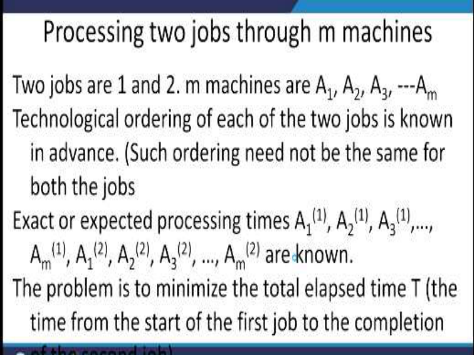
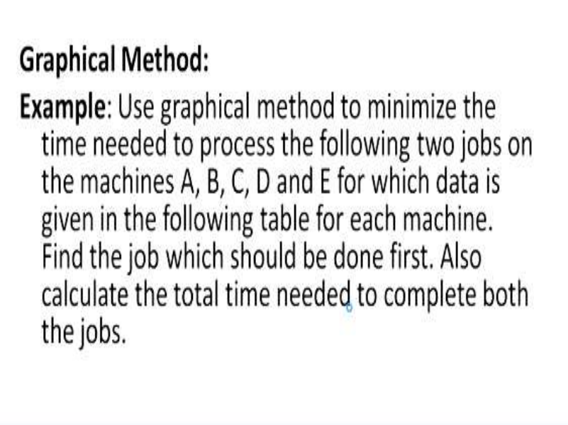
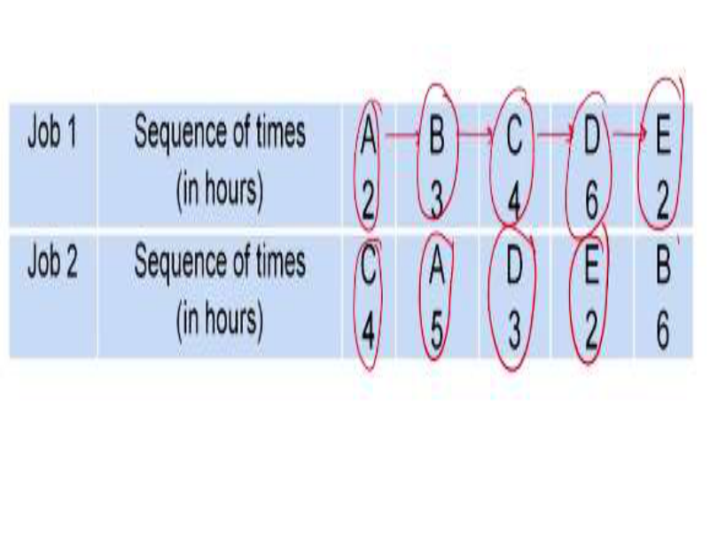
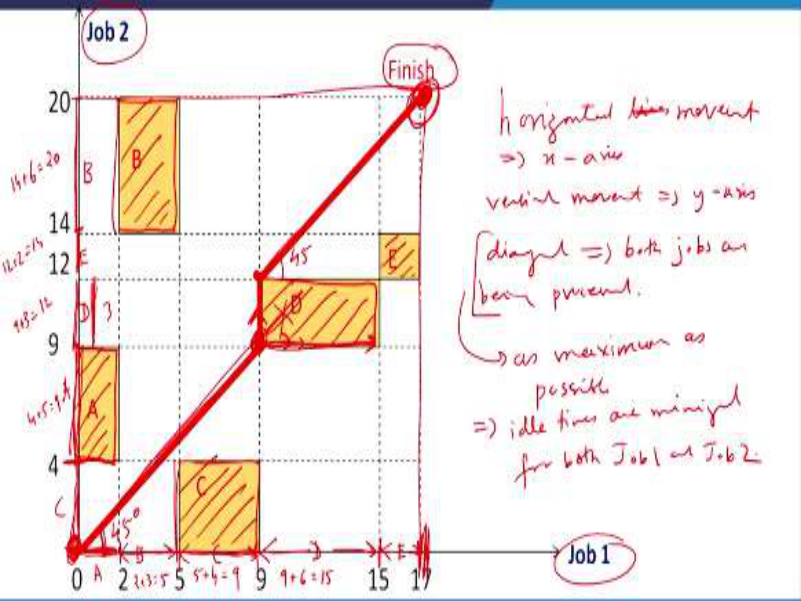
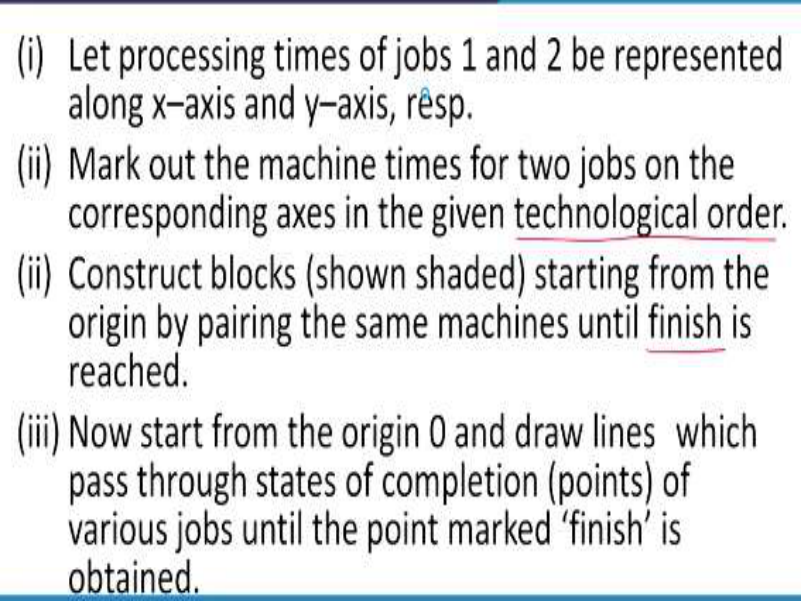
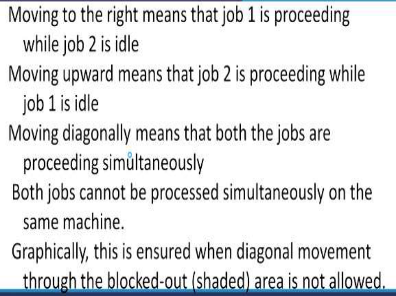
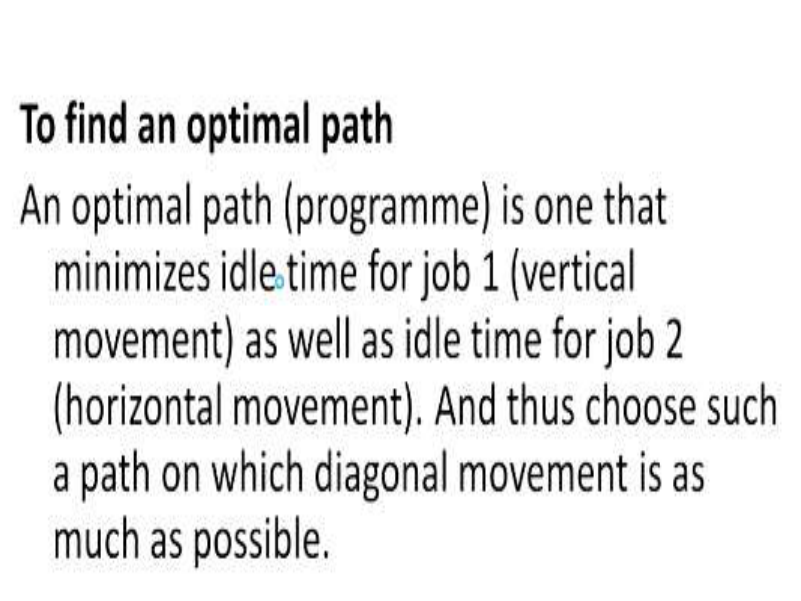

# **Operations Research Prof. Kusum Deep Department of Mathematics Indian Institute of Technology - Roorkee** 

# **Lecture – 33** 

# **Processing 2 Jobs on m Machines** 

Good morning students, this is the lecture number 33 on the sequencing and scheduling topic and we are going to study the third case in this topic, where we are going to learn the processing of 2 jobs on m machines. So, the processing two of 2 jobs through m machines is done as follows; we are assuming that the jobs are numbered as 1 and 2. 

**(Refer Slide Time: 01:07)** 

There are m machines, let us say A1, A2, A3, ---Am and the technological ordering of each of the 2 jobs is known in advance now, what is the technological order? It means that first, the first job has to be done and then the second job has to be done, such ordering need not be the same for both the jobs, exact or expected processing times A1(1) , A2(1) , A3(1) ,…, ; and similarly Am(1) , A1(2) , A2(2) , A3(2) , …, Am(2) are known. So, the times which are required are known, this is given in the problem. 

Now, the problem turns out to be to minimize the total elapsed time denoted by  T and now the as you know the definition of the total elapsed time says, the total time from the start of the first job to the completion of the last job. 

**(Refer Slide Time: 02:16)** 

Now, for solving these kind of problems we have the graphical method where we are going to solve this particular case. Now, the example that we are going to use to understand this method is as follows; use graphical method to minimize the time needed to process the following 2 jobs on the machines A, B, C, D and E for which the data is given in the following table for each machine. 

Find the job which should be done first and also calculate the total time needed to complete both the jobs. 

**(Refer Slide Time: 03:11)** 

Now, this means that we are given the following information, so there are 2 jobs; job 1 and job 2 and the time required in hours is given. Also the sequence of the times is  given that is first A has to be done and the time required is 2, then B time required 3, then C time required 4, D time 

required 6, E time required 2, now this is for the job 1 and the job 2 says that first C should be done that is it will take 4 times; 4 hours and then A, it will require 5 hours, D it will require 3 hours, E it will require 2 hours and then B it will require 6 hours. So, the technological order is given, the job 1 has to be processed, first on A, then on B then on C and then on D and then on E whereas, the job 2 has to be processed in this sequence; C, A, D, E and B. Now, how to solve this particular case? 

# **(Refer Slide Time: 04:32)** 

This is solved with the help of this graph now, we have to understand what is being represented here now, on the x-axis we have the job 1, it is the x-axis, the horizontal axis is showing the job 1 and on the vertical axis is showing the job 2, as you know there are only 2 jobs; job 1 and job 2. Now, since the job 1 has this, the first one is A, look at the table again, look at the table again, A requires 2 hours okay. So, therefore this distance is 2, A is requiring 2 then, comes B so, what is B? B requires 3 hours so, how I am going to mark it; 2 + 3 is 5 so, this is B, right because it requires 3 so, 2 + 3 is 5 then, comes the third one that is C so, C requires 4 hours, so from 5 units, we have to add 4 so, 5 + 4 = 9 so, this means this is C, right. Then again, the fourth one is D, it requires 6 hours, so from 9 + 6 is 15 and this is D. And finally, the last one E, it requires 2 hours therefore, this is 15 + 2 is 17, so here is our E, this is our E, right. So, I hope everybody has followed how this demarcation has been done on the x-axis that is corresponding to this sequence A, B, C, D and E, this is the technological order of performing the job 1, this has been marked on the x-axis like this. So, first we have 8 then we have B. Then, we have C and then D and then E. 

Next we have to do the same thing for the job number 2 but the technological order is difference, here the technological order is first you have to do C, then you have to do A and then D and then E and then B, so we have to follow this technological order. Also we note that C requires 4 hours, so therefore what we need to do? First of all from 0, we need 4 hours for doing the C job. Look at the table, first we have to do C and C requires 4 hours therefore, this demarcation is shown here that is C. Next comes the A and A requires 5 hours, so therefore from 4 to; 4 + 5 is 9 so, this is our E. Then comes D; D requires 3 hours, so therefore 9 + 3 is 12 and this is D and the fourth one is E, it requires 2 hours, so therefore 12 + 2 is 14, so this one is E. Then in the end, we have B which requires 6 hours. So, from 14; 14 + 6 is 20 and this is B. So, once you have done the demarcation on the y axis and on the x axis, next comes the construction of the rectangles which is shown here in the shaded region, so since this one is A and this one is A, so therefore we have to do the pairing and construct the rectangle like this, as you can see this is A, then comes B; B on the x axis is here and on the y axis is here. So, the rectangle that has to be constructed is this one, this is B, third is the C, so here is C on the x axis and here is C on the y axis so, the rectangle that is obtained is this one, then comes D, this is the rectangle corresponding to D and finally, the rectangle corresponding to E. 

**(Refer Slide Time: 11:02)** 

So, this is the way we have constructed the rectangles, before we proceed further, let us just look at the steps that have been written in the next slide, let the processing times of jobs 1 and 2 be represented along the x axis and the y axis respectively, this I have already explained this what is the meaning of the processing times, how the processing times have to be plotted on the x axis and on the y axis corresponding to job 1 and job 2. 

Second step says mark out the machine times for the 2 jobs on the corresponding axis in the given technological order. Now, remember that the technological order for job 1 is different and the technological order for the job 2 is different. Step 3 is constructed blocks as shown in the shaded rectangles starting from the origin by pairing the same machines until the finish point is reached. So, you can just look at the finished point, we have to complete all the pairing and then construct the rectangles. Step number 4 says now, start from the origin O and draw lines which pass through the states of completion points of various jobs until the point marked finish is obtained now, this has to be understood carefully. We will now determine the optimum path; we have to determine the optimal path starting from the origin to the finish. And how do we have to do this; we have to construct a line in such a way that the 45 degrees angle is made over here, okay and keep on moving like this until you hit across a particular rectangle now, we have hit across this rectangle the one given by B and this means that now we have to decide whether we have to go in the horizontal direction like this or we have to go on the vertical direction. Now, here this decision will depend upon which is the smallest so, in this case we find that the vertical distance is the smallest, right and therefore, we move this line in the vertical direction and come to the corner of this rectangle and once we reach this corner, then again we move at a 45 degrees and proceed like this to the finish. 

# **(Refer Slide Time: 14:15)** 

This is outlined in the step number next, moving to the right means that job 1 is processing while job 2 is idle, if you move to the right then, this means job 1 is processing okay and if you move up that means, job 2 is processing. If you are moving upward then, it means job 2 is processing and if we are moving towards the right then, it means job 1 is processing. 

Also, when job 1 is processing, then job 2 is idle and when job 2 is processing, then job 1 is idle also, moving diagonally means that both the jobs are processing simultaneously, so see the objective is to minimize the elapsed time therefore, it is important that we should make the diagonal movements as much as this possible so, both the jobs cannot be processed simultaneously on the same machine. 

Obviously, it is understood that both the jobs cannot be processed simultaneously on both the machines graphically, this is ensured when the diagonal movements are done through the blocked out shaded region, this is not allowed. So, when you come across for example, this point you cannot move in this diagonal direction, this is not allowed therefore, you have to either move in the horizontal direction or in the vertical direction. 

**(Refer Slide Time: 16:05)** 

Now, to find the optimum path; an optimal path or a program is the one which minimizes the idle time for job 1 that is the vertical movement as well as idle time for job 2 that is the horizontal movement and thus we have to choose a path such that on which the diagonal movement is as maximum as possible. 

**(Refer Slide Time: 16:34)** 

Now, to find the elapsed time, we have to look at the elapsed time is obtained by adding the idle time for either of the jobs to the processing time for that job so, what is the elapsed time for job 1? It is the processing time for job 1 + idle time for job 1 and the processing time of job 1 is 17 hours and the idle time for job 1 is 3 hours, let us just verify this. See this is the 17, this is the processing time and the idle time is this distance, this one; 3 hours. So, therefore 17 + 3 is 20 hours and similarly, for the job 2, the elapsed time is processing time of job 2 + idle time of job 2, now the processing time of job 2 is 20 but there is no idle time for 2, so therefore the total time is 20. With that we come to an end of this case of the sequencing and scheduling, thank you. Okay, I will give the closing once again so, this means that we have the elapsed time for job 1 and the elapsed time of job 2 as 20 hours and 20 hours for job 1 and 20 hours for job 2. 

Now, if you look at the graph, just look at this graph this is what we have, we have the finish, this finish is at 17 hours over here and 20 hours over here, understand the reason why we are using a diagonal movement for finding out the optimum path, why we are using the diagonal movement? The reason is that we want that job 1 and jobs 2 should be processed simultaneously as much as possible. Because if job 1 is processing and job 2 is not processing or in other words, if job 2 is processing and job 1 is idle, we do not want that so, this sort of a situation should not arise, I mean this should be as minimum as possible so, let me again horizontal lines or horizontal movement implies like this that we are moving in the x axis direction and vertical movement implies y axis, okay. 

Since the diagonal means both jobs are being processed so, this diagonal movement should be as maximum as possible because this will mean that the idle time are minimized for both the job 1 and job 2 and that is the reason why we are encouraging more and more diagonal 

movement, so therefore the final answer says that our elapsed time for job 1 is 20 hours and the job 2 is 20 hours. 

These kind of an application problems arise in the industries where there are let us say, a number of machines and there are let us say 2 jobs and you have to determine the optimum path which should be adopted, so that both the jobs can be run on all the machines that are available and the elapsed time is minimum, with that we come to an end of this case, thank you. 

