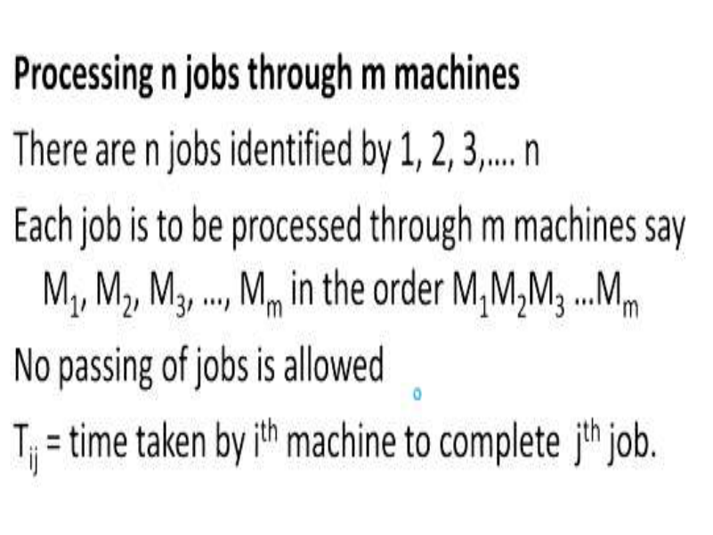
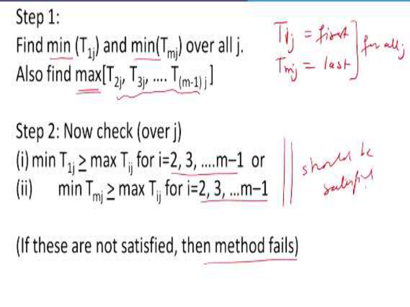
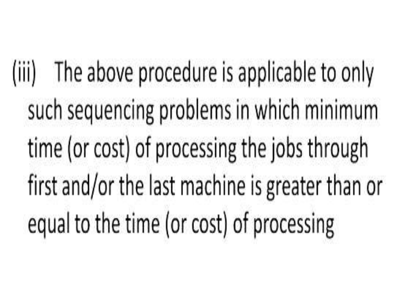
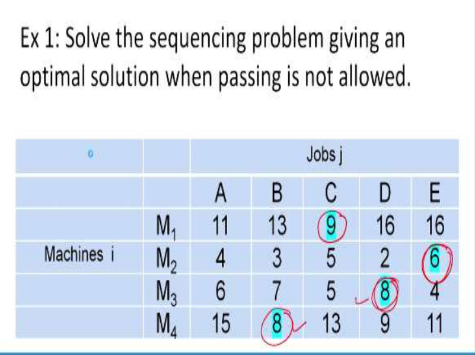
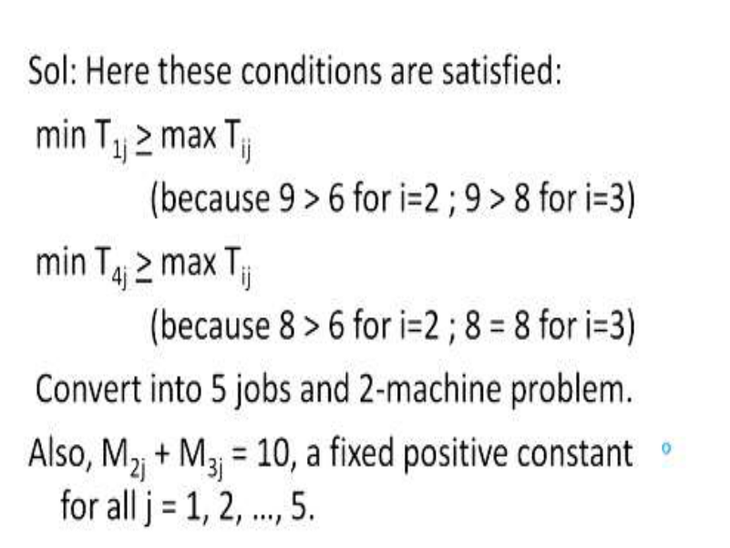
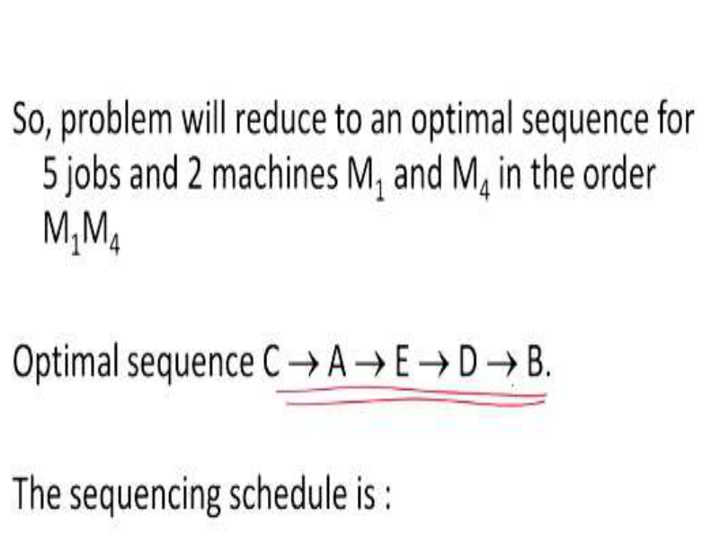
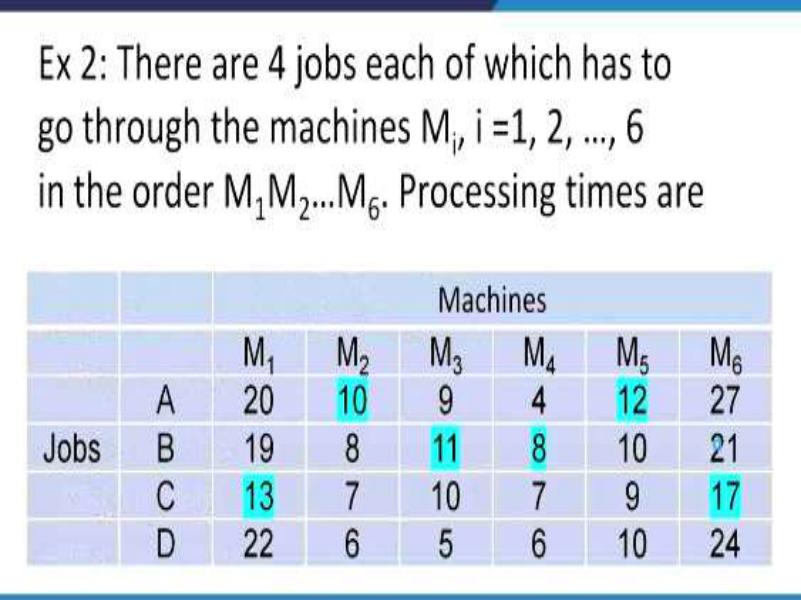
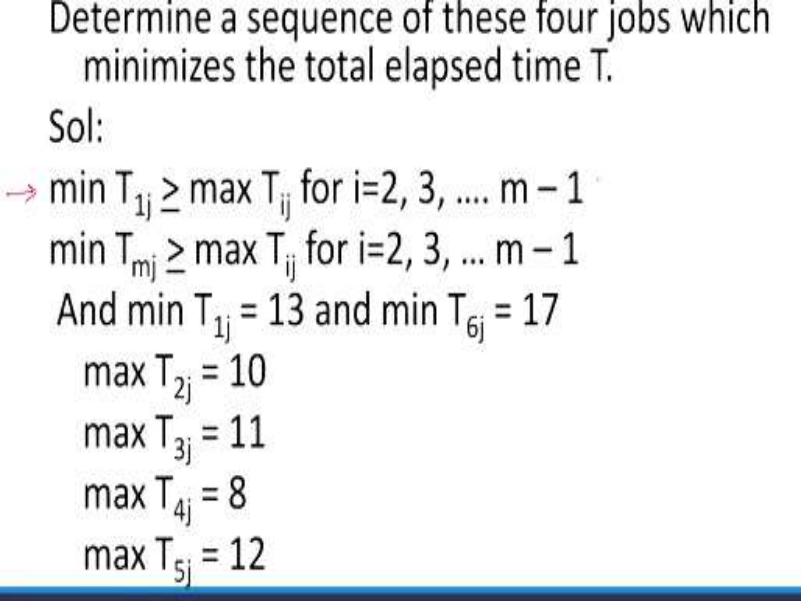
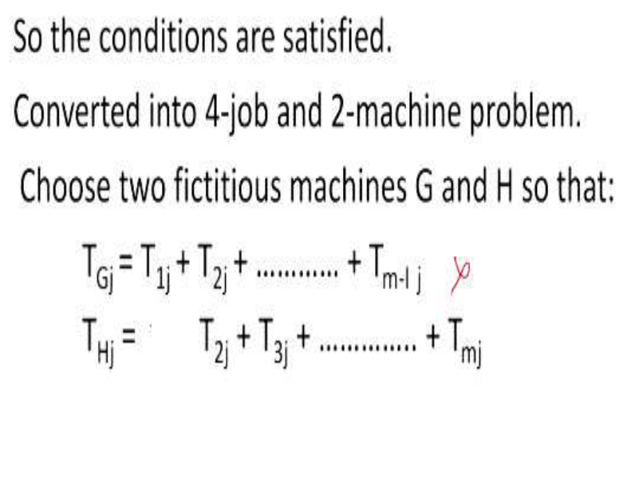
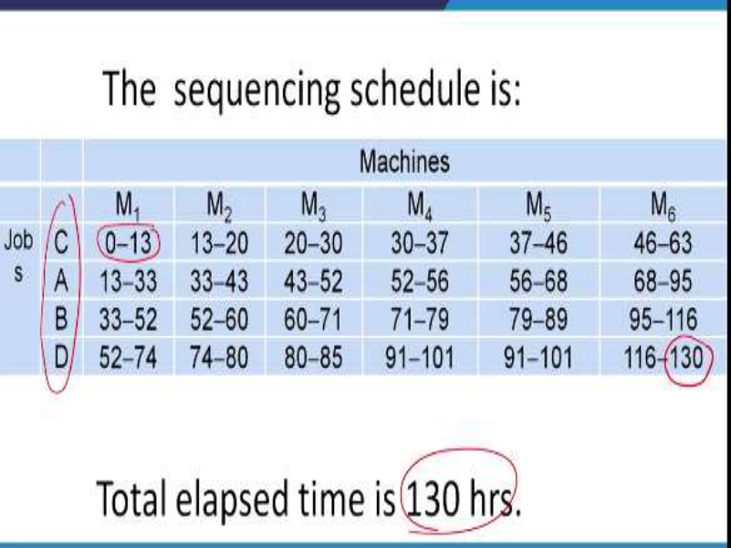

# **Operations Research Prof. Kusum Deep Department of Mathematics Indian Institute of Technology - Roorkee** 

# **Lecture – 34** 

# **Processing n Jobs Through m Machines** 

Good morning students, we are learning the topic of sequencing and scheduling and this is lecture number 34 and this is the fourth case that is processing of n jobs on m machines. You remember we have studied the earlier three cases where we had n jobs on 2 machines, n jobs on 3 machines and then 2 jobs on m machines. This processing of n jobs and m machines is the most generalized case of the sequencing and the scheduling problem. 

**(Refer Slide Time: 01:16)** 

So, let us look at this case more closely, there are n jobs and we are going to identify them by 1, 2, 3 and n and each job has to be processed through m machines. Let us say these m machines are called M1, M2 and Mm and the order that has to be adopted is M1, M2, M3 and Mm. No passing of jobs is allowed that is the no passing rule is to be adopted. Let us denote by Tij as the time taken by the ith machine to complete the jth job. 

**(Refer Slide Time: 02:14)** 

So, the first step that has to be worked out is; we have to check whether the following conditions is there or not, find the minimum of T1j and the minimum of Tmj, overall j, also find the maximum of T2j , T3j, Tm – 1j. Please note that this T1j means the first one and Tmj means the last one, in each j, this is for all j and these ones are the intermediate ones, so for this you have to find out the minimum and for this also is the minimum. 

But for the intermediate ones you have to find the maximum, this is the step number 1, then comes the step number 2; now check over j, first whether minimum of T1j <u>>  maximum of Tij</u> for i = 2, 3 up to m – 1. Again, please note that this is for the intermediate ones, the first one and the last one has to be left out and the second one is minimum of Tmj is > maximum of Tij for i = 2, 3 up to m – 1. 

Again, this has to be checked for the intermediate ones, the first and the last one have to be left out so, therefore we have to check T1j <u>></u> maximum of Tij , and second is minimum of Tmj <u>></u> maximum of Tij; whereas, this i is going to vary only for the intermediate ones. If these conditions are not satisfied then, the method fails. So it is important that these conditions should be satisfied. 

**(Refer Slide Time: 05:03)** 

So, the step 3 says convert the m machine problem into an equivalent 2 machines problem by introducing 2 fictitious machines G and H, you remember that we have the 2 machines case, so in this n machine case also, we will convert it into the case where we have 2 machines G and H and also once you do this, you need to calculate the times. So, the first one will be TGj = T1j + T2j + Tm – 1j, so this is the first machine. 

The second machine is THj, so the times have to be calculated again, T2j, T3j and finally Tmj, they have to be all added, please note in the G case (in the first one) last term is missing i.e. the mth term is missing; and in the second case, the first term is missing, so that is how you have to calculate the times for the two fictitious machines G and H. 

Now, determine the optimal sequence of n jobs through 2 machines by using the previous case that we have studied that is the 2 machines optimal sequence algorithm so, now the problem has been reduced to the 2 machines case. 

**(Refer Slide Time: 07:04)** 

Before you do that the following points must be noted, first of all if in place of the conditions given in step 3 that is T2j + T3j + Tmj = C (a fixed positive constant) for all j = 1, 2 up to n, then also the algorithm for determining the optimal sequence of n jobs and 2 machines M1 and M2 in the order M1 and M2 can be used. So, here is another interesting condition that is T2j + T3j + Tmj = C (a fixed positive constant). But this has to be satisfied for all j = 1, 2 up to n then, also the 2 machines case can be used and the second point that has to be noted is; if in addition to the conditions given in step 3, T1j = Tmj and TGj = THj for i = 1, 2 up to n, then a number of optimum sequences will exist so, this is the case of multiple solutions. **(Refer Slide Time: 08:48)** 

And the third point says the above procedure is applicable to only such sequencing problems in which the minimum time or of course the cost as may be given in the problem, of processing 

the jobs through first and or the last machine is greater than or equal to the time or cost of processing. 

**(Refer Slide Time: 09:20)** 

So, let us look at an example, solve the sequencing problem given in the optimum solution when passing is not allowed, so here you see we have four machines; M1, M2, M3 and M4 and there are the jobs A, B, C, D and E. Now, what do we find; the table that has been given is the cost coefficients; 11, 13, 9, 16, 16, 4, 3, 5, 2, 6, 6, 7, 5, 8, 4, 15, 8, 13, 9 and 11. **(Refer Slide Time: 10:20)** 

Now, in order to solve this problem, we have to check whether the conditions are satisfied, what are those conditions? Minimum of T1j <u>></u> maximum of Tij, why is that so? Let us see minimum of T1j is 9, in the first row here you see it is 9 and the maximum of Tij is 6 for i = 2 

and 8 for i = 3. For i = 2, it is 6 and for i = 3, it is 8, right, then comes the second condition; minimum of T4j <u>> maximum of Tij.</u> 

Why is that so? Because minimum of T4j is 8, this is > 6 for i = 2, and it is > 8 for i = 3, it is equal so, here this is equal but since the inequality says that we are allowed to use greater than or equal to so, both the conditions are acceptable and since the conditions are acceptable therefore, we can convert into the 5 jobs and 2 machine case. 

Also, in addition to the above conditions, we note the additional conditions that M2j + M3j = 10, this is a fixed positive constant for all j = 1, 2 up to 5, M2j + M3j =10, M2j + M3j = 10. **(Refer Slide Time: 13:10)** 

So, therefore the problem will reduce to an optimum sequence for 5 jobs and 2 machines, M1 and M4 in the order M1M4 and the optimum sequence can be obtained as before that is the optimum sequence is C, A, E, D and B. 

**(Refer Slide Time: 13:43)** 

And also the sequencing scheduled can be obtained like this so, you have this is the sequence that we got, C, A, E, D and B. The first machine M1 will begin at 0, the time in will be 0 timeout will be 9 and then it will go to the M2 machine, so it will be time in will be 9, time out will be 14, for M3 it will be passing on to 14, so time in will be 14, time out will be 19 and again, the time in for M4 will be 19 and time out will be 32. 

Remember how did we get this 9, from 0 to 9; this is the data that is given in the table, so that is how we know the time in and the time out and like this, you can check for the remaining ones as well, please note for example, the time out for A job on M1 is 20 and the time in for M2 is also 20 similarly, time out is 24 for M2 and time in is 24 for M3, however this 30 is different and this 32 is different, they are not equal. Do you know the reason for this? The reason for this is that once this 30 has been obtained that is the timeout for this A job has been done for M3 but this M4 is still working, so this there is an gap over here that is 32 - 2 that is 30. So, this is the idle time over here, there is a gap over here because the machine is not free, and that is a reason why there is this gap. Similarly, you can also observe that at many places this gap is provided, because the machine is not free and as before we have learnt, we can calculate the elapsed time as 83 because this is the total time required when all the jobs are completed on all the machines. **(Refer Slide Time: 16:39)** 

Now, let us look at another example, there in this example, there are 4 jobs, each of which has to go through the machines Mi where i goes from 1, 2 up to 6 in the order M1, M2, M3, M4, M5 and M6. The processing times for all the jobs on all the machines is given in this table; 20, 10, 9, 4,12, 27, 19, 8, 11, 8, 10, 21, 13, 7, 10, 7, 9, 17, 22, 6, 5, 6, 10 and 24. 

**(Refer Slide Time: 17:47)** 

Now, with this data we need to determine a sequence of the 4 jobs which minimizes the total elapsed time T, so we have to look at the conditions given in our step number 1. What is the first condition? The first condition is we have to check whether minimum of T1j <u>> maximum of</u> Tij, for i = 2,3, m – 1 and as you can see that the second condition is minimum of Tmj <u>></u> maximum of Tij , for i = 2, 3, m – 1. Now, the minimum of Tij is 13 and the minimum of T6j is 17, let us just look at it. 

Minimum of Tij is 13, here it is and the minimum of T6j is 17. Also, maximum of T2j is 10 and maximum of T3j is 11 and also maximum of T4j is 8 and the maximum of T5j is 12, so once we have identified these entries now, let us see whether this condition is satisfied or not and similarly, whether this condition is satisfied or not. 

**(Refer Slide Time: 20:01)** 

And we find that the conditions are satisfied and therefore, now we can convert this problem into the 4 job and 2 machine case therefore, we will have two fictitious machines G and H such that we can calculate their times as follows; for the first fictitious machine G, the times can be calculated as TGj = T1j + T2j +……+ Tm-1j and similarly, for the second machine, we have the times THj = T2j + T3j +….+ Tmj. 

Again, please note that here in the first case, the last entry is missing and in the second case, the first entry is missing. 

**(Refer Slide Time: 21:13)** 

So, the 4 jobs and 2 machine problem is as follows; we have two fictitious machines, G and H and we have the 4 jobs A, B, C, D as follows; 55, 56, 46, 49 and for the G machine 62, 58, 50 and 41 and once you get this two machines case, then you can use the previous case to solve it and the optimum sequence that you get is C, A, B and D; this is the way in which this most generalized situation of n jobs on m machines can be used to solve this generalized problem. **(Refer Slide Time: 22:15)** 

So, the sequencing scheduled is as follows, that is we have the 6 machines; M1, M2, M3, M4, M5, M6 and the 4 jobs A, B, C and D and we will calculate the time in and time out on each of the machines depending upon the data that is given in the problem. So, first one is for the job C, see this is the optimum sequence, look at it, what we have obtained, C, A, B, D, therefore C, A, B, D is the right sequence. 

And on the machine 1, time in is 0, timeout is 13, on the machine 2 time in is 13, timeout is 20, on the machine M3 time in is 20, timeout is 30 and for M4; 30 is the time in, timeout is 37 and like this for M5, M6. Also, the time in and time out is depending upon the data that has been given. Now, you will observe again the gap that is obtained wherever the time out and the time in of the previous one is not matching. You find that the total elapsed time is 130 hours because the time out of the last machine M6 on the last job that is D is 130 hours, so like this we can complete the entire sequencing scheduled of all the machines and all the jobs. 

So, students with that we come to an end of this topic on sequencing and scheduling of various jobs on various machines, we have seen the four cases and accordingly the algorithms that are required to solve them. Thank you. 

