# **Operations Research Prof. Kusum Deep Department of Mathematics Indian Institute of Technology – Roorkee** 

# **Lecture - 35** 

# **Case Studies and Exercises** 

Hello students. This is lecture number 35 and this is the last lecture on the topic of sequencing and scheduling and today we will be studying some case studies and some exercises and at the end, I will give you a small quiz. So, let us get started. First of all, let us look at this example. 

**(Refer Slide Time: 00:52)** 

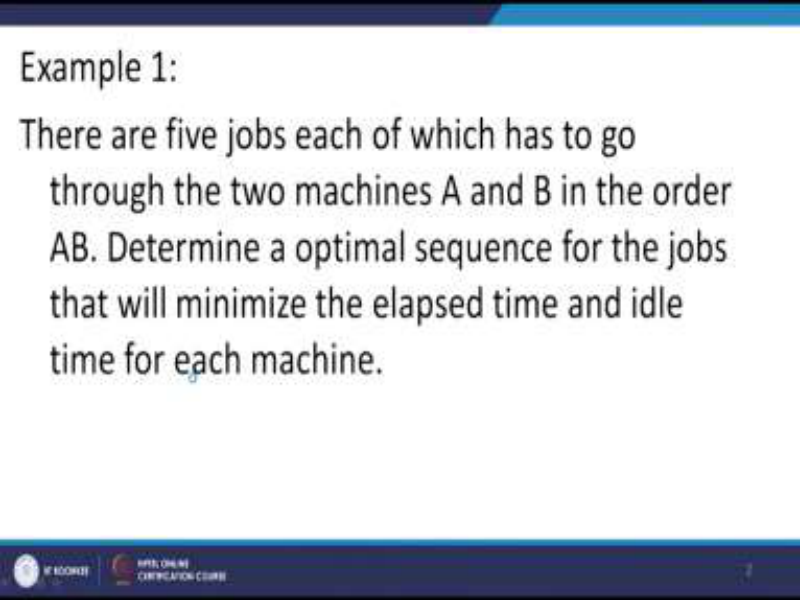

Example number1, there are 5 jobs each of which has to go through the two machines A and B in the technological order AB. We have to determine an optimal sequence for the jobs that will minimize the elapsed time and the idle time for each machine. 

**(Refer Slide Time: 01:21)** 

Now, the data that has been given in the problem is that there are 5 jobs; 12 3 4 5 and there are two machines A and B and the time required of processing the each job on each of the machines is given as 4 6 4 7 9 and on B it is given as 8 7 6 2 and 8. Now, we have to solve this sequencing problem. So, the reason why I have taken this example is that in this case we might find a tie and I will be telling you how to take care of the ties. 

**(Refer Slide Time: 02:16)** 

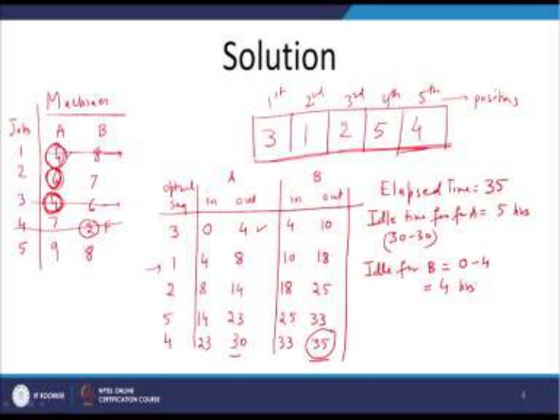

So, let us start. So, as I told in the previous lecture also, we have to write the data that is the machines. There are two machines A and B and the jobs are 1 2 3 4 and 5 and the data that is given to us is as follows 4 6 4 7 and 9, and on the B machine it is given as 8 7 6 2 and 8. Now, as you know that the first thing that we have to look that entry, which is the minimum. 

Now, as you know that we have to fill the 5 positions of the jobs. So how are they to be filled in? First position, second position, third position, fourth and fifth position. These are the positions that we have to fit in into our schedule. Now, we do not know whether the first job is going to come at the first position or the second job is going to come at the second position. But according to the Johnson’s rule, we have to first find out the overall minimum and if you look at the data that is given, we find that 2 is the minimum at the first place. So, this is the first iteration or you would say first way in which we have found out that 2 should be the minimum. So, what we will do is, we will strike off this particular row and then the second one we have to find out from the remaining ones. Now, you see that from the remaining ones, we have minimum as 4, 4 at the first job at A machine and 4 at the third job at the A machine. So, there is a tie. Now, we have to decide which one to take. The next minimum we should take the one at job 1 or the one at job 2. So, by convention, we will look at the B machine. So, corresponding to the third machine we have 4 and 6 on the B machine and on the first, we have 4 and 8. So, we will take 4 as the first one and by the way when we have got this 2 over here, therefore, this means that the fourth job should be placed at the last position. This is according to the Johnson’s rule. Remember, if 2 was on the A column, we would have put it at the first place, but since this 2 is at the B machine, so it has to be put in the end. Now similarly, when we are looking at 4 over here at the third machine, we have to put this third machine at the first position. Remember if this 4 was at the B column at the second column, we would have put it in towards the last, but since it is at the A column. Therefore, we are putting it at the first column. Then, comes the second, the tie, so the tie as you can see is over here at 1 job, first job and it is at the A machine. So, therefore 1 will come at the second position. Again, then the remaining ones we have to see which one to do. So, this one is crossed off, this one is crossed off. Out of the remaining times, we find that 6 is the least and 6 is at the A column. So, we have to put job 2 at the third position and also now we are left with only one situation. So therefore, the only option that is left is 5. So, this is the way that the jobs should be placed. Now, apart from this, we have to find out the idle time. 

Now, in order to find the idle time, we need to write down the optimal sequence. So, what is the optimal sequence which we have just now found out? It is 3 1 2 5 and 4 and for the A machine, we have to look at the time in and the time out and similarly for the B machine, we have to look at the time in and the time out. So, remember how we did this before. First of all, the system starts at t=0. That is the third job when it goes to the A machine, the time is 0 and the third job it requires how much time on the A machine, it requires 4. So, therefore, timeout 

is 4. Also, when the first job is to be completed, started then the first job, we have to put 1 over here. At the one position, we have to put time in as 4 and the time required to complete the first job is again 4. So, therefore, 8 will come here. And like this, the second job is, the next one is the second job, so it will time in is 8 and it requires 6 hours on the second job, here you are 6, so therefore, 8+6 is 14 and similarly the fifth job is 14 and 23 and finally 23 and 30. So, please check these calculations. Coming to the B machine, we find that the time in of the first job that is the third number job is 4 because as soon as the time out of the A machine has been completed, it will go to the B machine and this requires 6 hours, so time out is 10. Again, we have 10 over here in the first row and so the time in on the machine B is 10 for the job number 1 and time out is 18 and then for job number 2, time in is 18 and time out is 25 and again for the job number 5 time in is 25 and time out is 33 and like this for the last job that is 4 job, time in is 33 and time out is 35. Now, we need to find out the elapsed time. So, what do we mean by the elapsed time? 

Remember elapsed time is the time required for completion of all jobs on machines and as you can see that the elapsed time is 35. Then, comes we have to find out the idle time for A machine, for machine A, this is equal to 5 hours. How did I get this 5 hours? Because from the 30 to 35 hours, the machine A is idle, then comes idle for B. This means that during the time 0 hours to 4 hours, the machine B is idle and therefore the idle time is 4 hours. 

So, like this we have calculated the elapsed time and the idle time of both the machines. The important aspect about this question is that we have to look at what to do when there is a tie and you have to break the tie in such a way that you have to look at the time required by the machine or the other machine. Here we found that the job number 1 and job number3, they were requiring 4 hours. So, in order to break this tie, we have to look at the time required on the B machine. So, that is the important thing that has to be seen in this example. **(Refer Slide Time: 12:20)** 

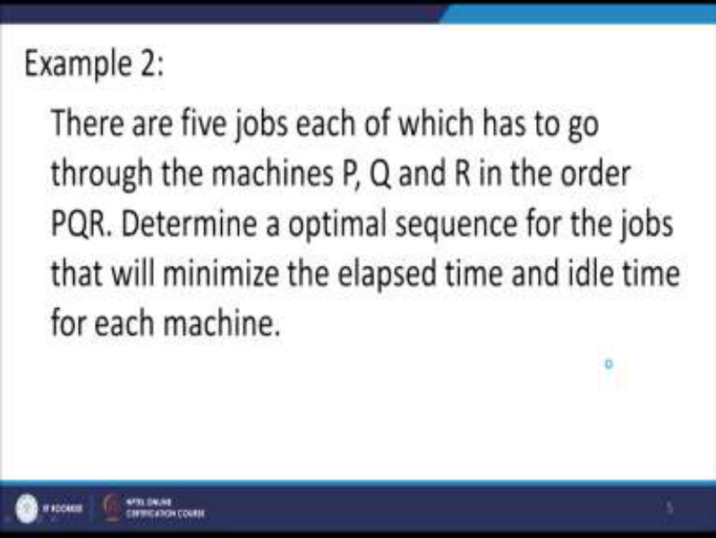

Now, let us look at example number 2. In this case, there are 5 jobs each of which has to go through the machines P, Q and R in the technological order PQR. We have to determine an optimal sequence for the jobs that will minimize the elapsed time and the idle time for each of the machines. Now, as you know that this is the three machine case and therefore, we have to see whether it is possible to solve it with the help of the Johnson’s method. 

**(Refer Slide Time: 13:03)** 

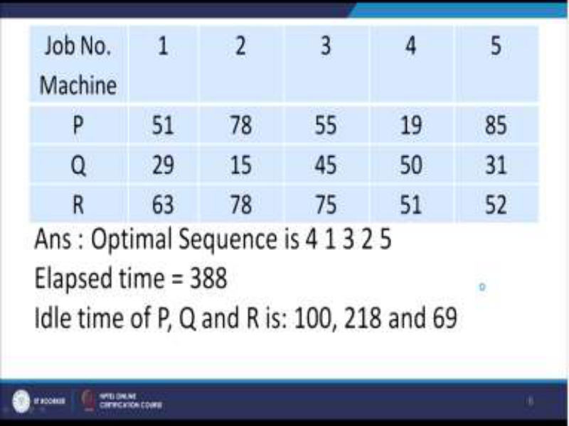

But that is possible only if certain conditions are satisfied. So, let us look at the data that has been provided. The job numbers are 1 2 3 4 5 and the three machines are numbered as P, Q, R and their times are shown in the table and also I have written the answer, optimal sequence 4 1 3 2 5 and the elapsed time is 388. Now, the question is how did we get it? **(Refer Slide Time: 13:32)** 

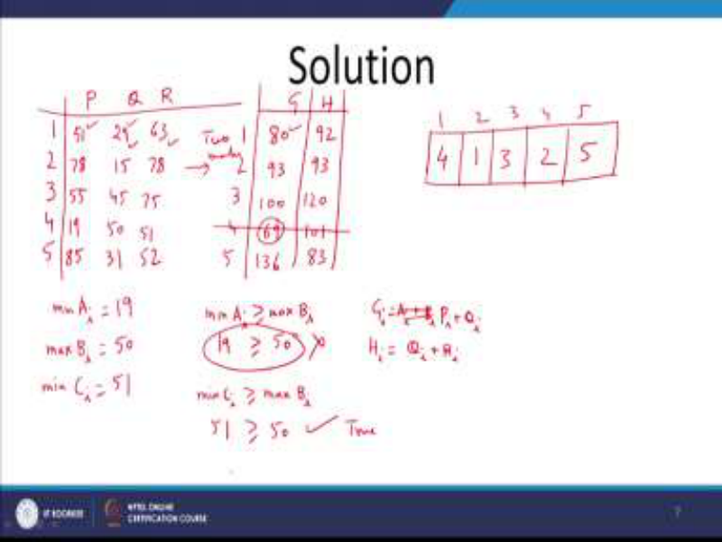

So, let us plot all this information in the form of the table as before. So, we have 1 2 3 4 and 5 and we have the data for P, Q and R. So for P we have 51, 78, 55, 19, 85 and for Q we have 29, 15, 45, 50 and 31 and for R we have 63, 78, 75, 51 and 52. Now, remember that this is a three machine case, so we have to convert it into the two machine case. So what are the two machine case? They are the two fictitious machines G and H but before we do that, we also need to look at whether the conditions are satisfied for allowing us to convert it into the two machine case. So, what are the conditions? First of all, we want to find out minimum of Pi. Now, look at the times under the first column and you find that minimum of Pi is 19. Then, you have to look at maximum of all the Qi’s and you find that under the second column, the maximum is 50. Then, you also have to look at minimum of Ri and you find that it is 51. Now, we have to look at whether this condition is satisfied minimum of Pi <u>> maximum of Qi</u> or not. So, minimum of Pi is 19 and maximum of Qi is 50, but this is not true. So, this condition is not satisfied okay. Now, let us look at the second condition. What is the second condition? Minimum of Ri <u>> maximum of Qi. So what do we find? Minimum of Ri is 51 and</u> maximum of Qi is 50. Is this true? Yes, this is true. Therefore, according to the rule, we are allowed to convert this three machine problem into the two machine problem and as before, let us write down the sums. So, what is Gi’s? Gi’s = Pi’s + Qi’s, so what is the Gi have to write? This will come out to be 80, 93, 100, 69 and 136 because this is Gi = Pi + Qi. So we have to add let us say 51 and 29, you should get 80 and like this you can get for the entire column. Also, we have to get the Hi’s. Now what is Hi’s? Hi’s is also obtained by Qi, Ri, that is, Hi = Qi+Ri. 

So, look at 29 and 63. So, what do you get? You get 92 and then you get 93 and then you get 120 and 101 and 83. So, this is the case of two machines G and H and as before we can solve it to get the optimum sequence and what is the optimum sequence? The minimum one is 69, so this will be crossed off first of all and as before we will put in the positions. So, like this, we have five positions. First of all, the minimum is 69, so it is at the fourth place. So, at the first position fourth job will come and then the next one is the second one is the minimum out of the remaining ones. So, that is over here at 5 and then 1 and then 3 and then 2. So, this is the way that the three machine case has to be converted into the two machine case. 

# **(Refer Slide Time: 18:51)** 

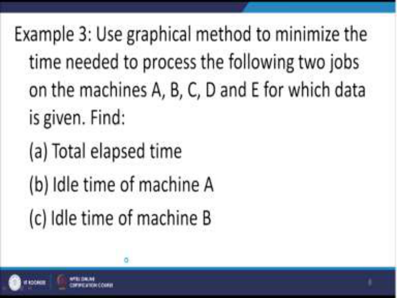

Next, let us look at the third example in which we are supposed to use the graphical method to minimize the time needed to process the following 2 jobs on the machines A, B, C, D, E for which the data is given and we are required to find the total elapsed time and the idle time of machine A and the idle time of machine B. So, how are we going to do it? Let us write down the entire information using the graphical method. 

**(Refer Slide Time: 19:40)** 

So, I need to draw the x-axis and the y-axis and accordingly I need to draw the times that are required. Now, the data that has been given to us is as follows; A B C D E and this is given to be 2 3 1 9 and 2 and for the second one, it is given as B E D A and C and the time is given as 4 5 3 2 and 1. Now, we have to plot all this information on this axis. So, let us do it 1 2 3 4 5 6 7 and similarly on the y-axis. 

Now, the first thing that we have to see is how to plot these times for the A B C. So, the A job requires 2 hours. So, we will do the demarcation over here. This is our A. Then, we need 3 hours, so 1 2 and 3, so this is our B. Then, we need 1 hour, so this our C and then we need D that is 9 hours, so 1 2 3 4 5 6 7 8 9. This is our D and finally we need two more, so 16 and 17 have to be added. 

So, this one is the last one that is E. I hope everybody has understood how this data has to be implemented on the x-axis. Now, the same thing has to be repeated for the y-axis, but for the B first one is the B, so it requires 4 hours. So, 1 2 3 4 up to here, so this one is B and then comes E, E is for 5 units 1 2 3 4 5, so this is E. Then, it is 3, 1 2 3 so this is D, then it is A for 2 1 2 this is A and for the final one it is C. So, this is the way demarcation has to be done and now we have to do the pairing and what do we find? The pairing has to be done like this because the first one is A, so this A will come over here and as you can see this is our A. Then comes the B, so where is B, B is over here and it is over here. So, this is the way we have to do the B. So, this is shaded over here. Then, comes C, so where is C, C is at the top, there it is. 

So, we just quickly need to go to the top here and it is only one unit. So, this is our C. Then, comes D, so where is D, D is here and we need to complete the rectangle for the pairing. Actually, if you draw it on the graph paper, it will become easy. So, this is the D, actually it should be right up to here and then comes the E. So, where is E, E is over here. This is our E. Now, the question is how to find the optimal path? Now, in order to find the optimal path, in this particular problem there are many ways in which you it can be done. So, what do I mean by saying that there are many ways. As I told you that we have to make sure that the optimal path is obtained in such a way that maximum diagonal movement is done. Now, suppose I take the diagonal movement over here, then this is not going to give me the optimum path. And similarly, if I take another movement over here and I go like this, then also this will not give me the optimum path. So, you can just verify, but when you take the path like this, from here from the origin, from the origin to this point and then move up to this point and then move up to this point and then move up to the finish. So, this is the finish, this point is the finish and you will find that this is the optimal path and I can just share with you how we get the elapsed time. So, the elapsed time is given by 6+11+4 which is 21 hours okay and the idle time for job 1 is 4 hours and the idle time for job 2 is 6 hours. This is job 1 and this job 2. So, like this, we have got the optimal path. As I said that you could have taken the other paths also, but all these paths, they will not give you the optimum sequence. The optimum sequence will be obtained only if you follow this path which I have marked as optimum, otherwise it will not give you the optimum path. So, this is the optimum path as I have shown over here. This is the optimal path. 

**(Refer Slide Time: 27:45)** 

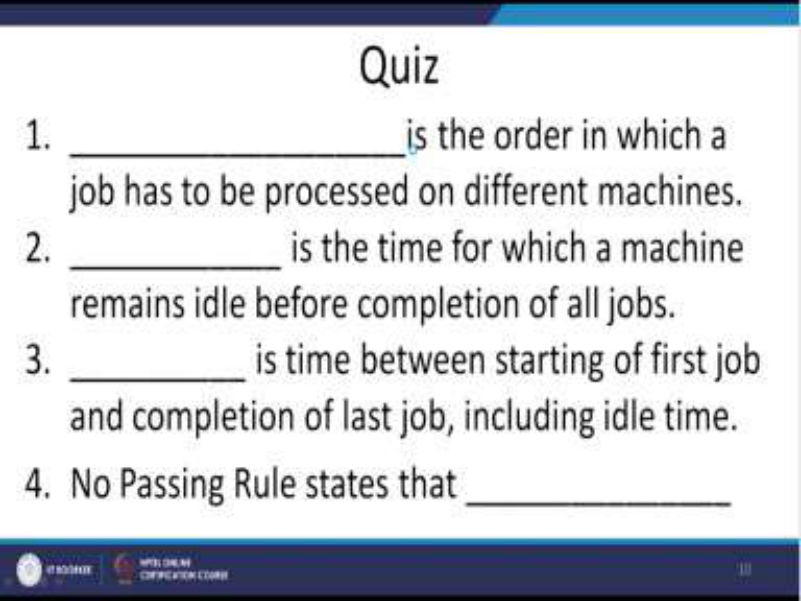

So, next we come to the quiz, which is based on this topic. So, I will be giving you some time to write the answers to the quiz. Question number 1; _____ is the order in which a job has to be processed on different machines. Question number 2, _____ is the time for which a machine remains idle before completion of all jobs. Question number 3, _____ is the time between starting of the first job and completion of the last job including their idle times. Question number 4, no passing rule states that _____. So, it says what is the no passing rule. 

**(Refer Slide Time: 29:27)** 

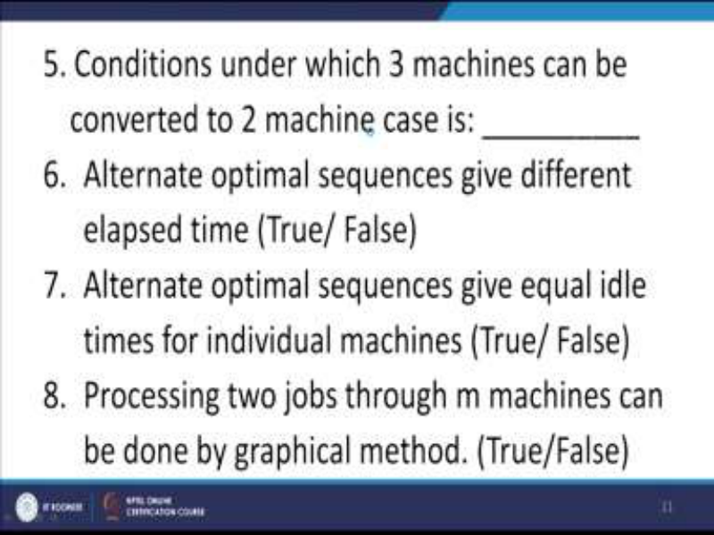

Question number 5, the conditions under which 3 machines can be converted to a two machine case is ______. Question number 6, alternate optimum sequences give different elapsed time, true or false. Question number 7, alternate optimal sequences give equal idle times for individual machines, true or false. Question number 8, processing two jobs through m machines can be done graphically, true or false. 

**(Refer Slide Time: 31:16)** 

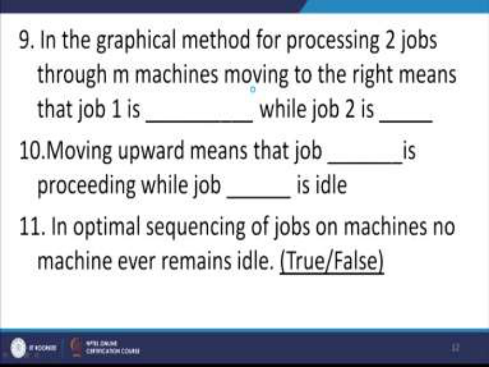

Question number 9, in the graphical method for processing two jobs through m machines moving to the right means that job 1 is ____ while job 2 is ____. Question number 10, moving upwards means that job ____ is processing while job _____ is idle. Question 11, in the optimal sequencing of jobs on machines, no machine ever remains idle, true or false. 

**(Refer Slide Time: 32:44)** 

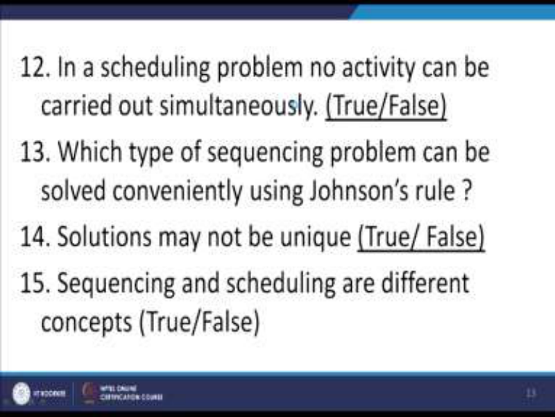

Question number 12, in a scheduling problem, no activity can be carried out simultaneously, true or false. Question number 13, which type of sequencing problems can be solved conveniently using the Johnson's rule. Question about 14, solutions may not be unique, true or false. Question number 15, sequencing and scheduling are different concepts, true or false. 

I hope everybody has written down their answers in their notebooks. So, now here comes the answers to the quiz. 

# **(Refer Slide Time: 34:10)** 

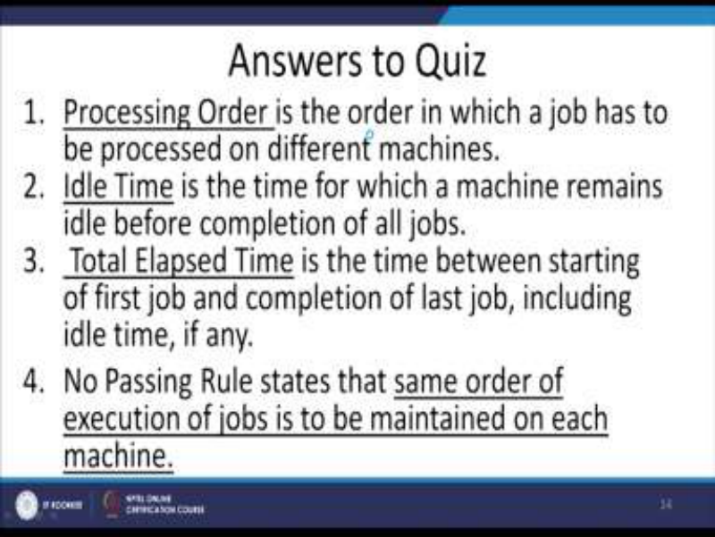

Question number 1, processing order is the order in which a job has to be processed on different machines. Question number 2, idle time is the time for which a machine remains idle before completion of all jobs. Question number 3, total elapsed time is the time between starting of the first job and completion of the last job including idle time. Question number 4 is the no passing rule, which states that the same order of execution of jobs is to be maintained on each of the machines. 

# **(Refer Slide Time: 35:02)** 

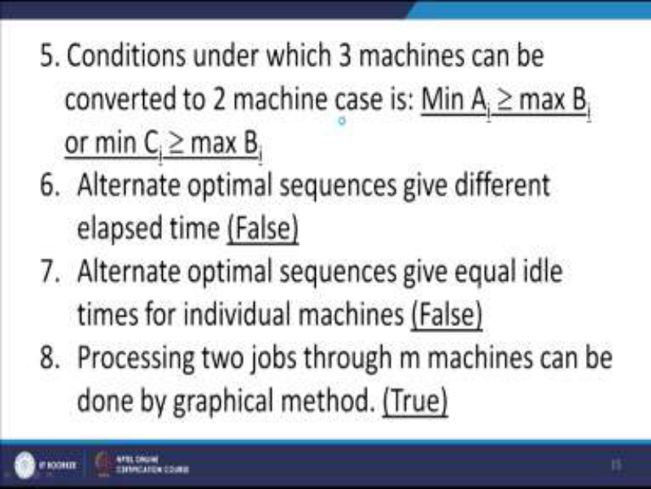

Question number 5, the conditions under which the three machine case can be converted to the two machine case is minimization of Ai should be > maximization of Bi or minimum of Ci <u>> maximum of Bi. So, either of the two conditions should be satisfied. Question number 6,</u> alternate optimal sequences give different elapsed time, the answer is false. 

Question number 7, alternate optimal sequences give equal idle times for individual machines, answer is false. Question number 8, processing two jobs through m machines can be done by the graphical method, true. 

**(Refer Slide Time: 36:02)** 

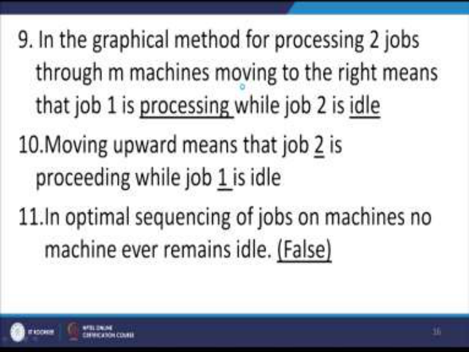

Question number 9, in the graphical method for processing two jobs through m machines moving to the right means that job 1 is processing while job 2 is idle and question number 10, moving upward means that job 2 is processing while job 1 is idle. Question number 11, in optimal sequencing of jobs on machines, no machine ever remains idle, that is not true, false. **(Refer Slide Time: 36:42)** 

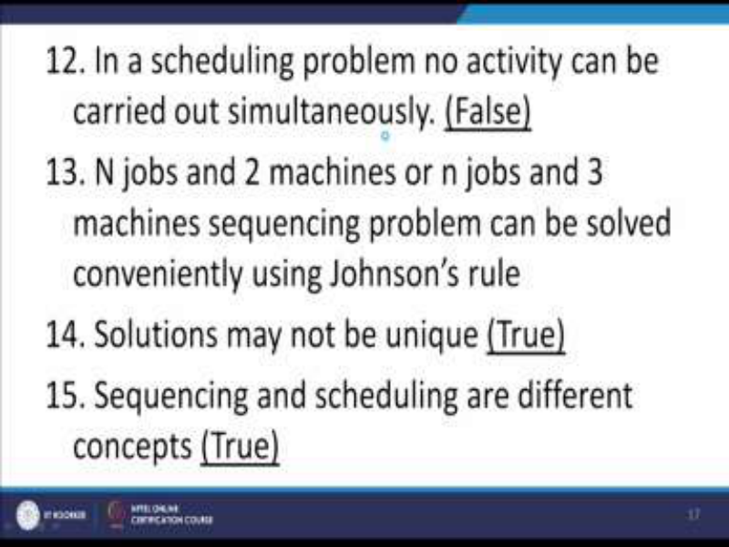

Question number 12, in a scheduling problem, no activity can be carried out simultaneously, answer is false. Question number 13, N jobs and 2 machines or N jobs and 3 machines 

sequencing problem can be solved conveniently using the Johnson's rule as we have seen in the today's example also. Question number 14, solution may not be unique as we have seen in the sequencing and scheduling problem, the solution may not be unique, true. Question number 15, sequencing and scheduling are different concepts. So, sequencing means, the sequence in which the jobs should be processed whereas scheduling means finding out the total elapsed time, the idle time and elapsed time. That is how the schedule should take place for processing the jobs. So, with that we come to an end of this topic on sequencing and scheduling. Thank you. 

