# **Operations Research Prof. Kusum Deep Department of Mathematics Indian Institute of Technology - Roorkee** 

# **Lecture – 40 Case Studies and Quiz** 

<mark>Hello students, this is lecture number 40 and this is the last lecture on the game theory as well as the last lecture of this course. So, in this lecture we will study some examples and also at the end of this lecture, I will give you a quiz for your self-assessment.</mark> 

**(Refer Slide Time: 01:12)** 

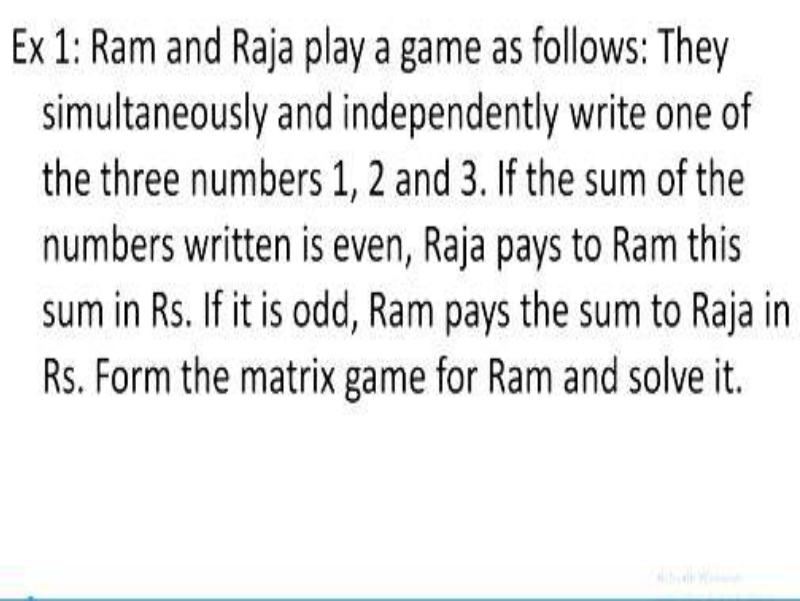

<mark>So let us begin, here we have a first example which says that Ram and Raja play a game as follows, they simultaneously and independently write one of the three numbers ;1, 2 and 3 and if the sum of these numbers written is even then, Raja pays to Ram this sum in terms of rupees and if this sum is odd then, Ram pays these sum to Raja in terms of rupees. So, we are required to formulate this problem as a matrix game for the first player that is Ram and solve it.</mark> **(Refer Slide Time: 01:53)** 

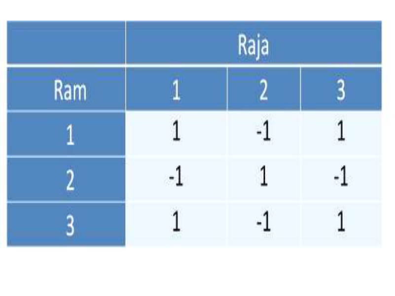

<mark>So, as you know this is a very simple 3 by 3 game and this is the way we can write its payoff matrix so, on the left we have the Ram that is the first player who is the winning player and on the top, we have Raja who is the losing player and Ram has to select the three numbers 1, 2, 3 and similarly, Raja has to select 1, 2, 3. Now, according to the conditions if the sum of 1 and 1 is even then Raja has to pay Ram, so that is why its entry should be 1. If it is odd then it has to be - 1, so that is the way we can write the entire payoff matrix 1 -1 1 -1 1 -1 1 -1 1 and as you can see this is a simple 3 x 3 matrix but we can use the principles of the dominance that we have learnt and we can see that since two of the rows; the first row and the last row and similarly, the first column and the last column they are identical so, we can delete them.</mark> **(Refer Slide Time: 03:15)** 

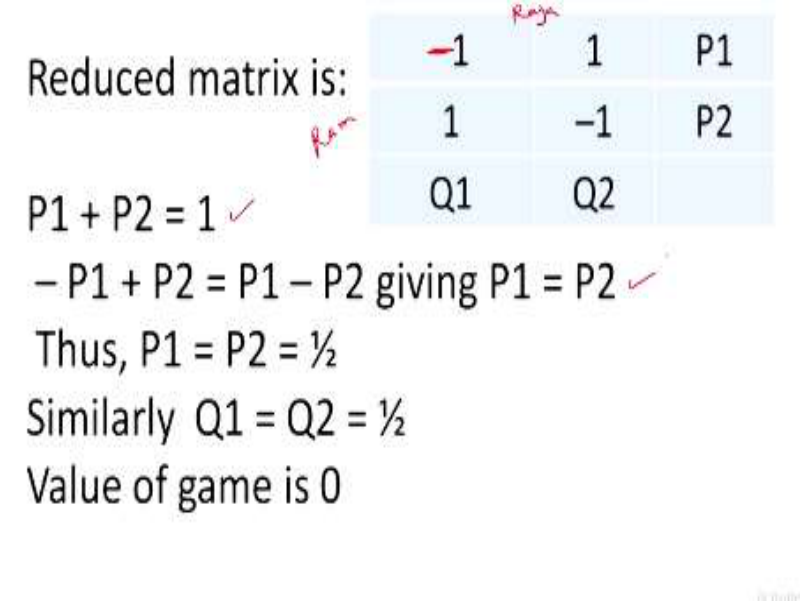

<mark>And therefore, we can reduce this game into a simple 2 x 2 matrix game, where the payoff matrix is 1 1 1 and -1 sorry, this should be-1 so, this is the first player Ram and this is the second player Raja. Accordingly, we can write the probabilities that is P1 and P2 on the last column and similarly the probabilities for the strategies of the second player Q1 and Q2, you know that P1 + P2 =1. Also -P1 + P2 should be equal to P1 - P2 that is the column sums which gives us that P1= P2 and using P1 + P2 = 1 and P1 = P2 using these two conditions, we can deduce that both the values of P1 and P2 should be 1/2 and similarly, the same logic gives us that Q1 and Q2 should also be = 1/2 and coming to the value of the game, it is very easy to see that the value of the game is 0.</mark> 

**(Refer Slide Time: 04:45)** 

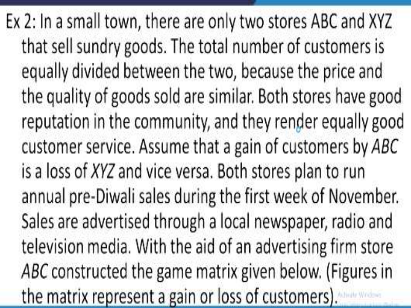

<mark>So, now let us come to another very interesting example, where in a small town, there are only two stores let us say, they are called as ABC and XYZ, who sell sundry goods. The total number of customers is equally divided between the two because the price and equality of goods sold are similar now, both the stores have good reputation in the community and they render equally good customer service.</mark> 

<mark>Assume that a gain of customers by ABC is a loss of XYZ and vice versa. Both stores plan to run annual pre Diwali sales during the first week of November, sales are advertised through a local newspaper, radio and the television media. With the aid of an advertising firm, store ABC</mark> 

<mark>constructed the game matrix given below and the figures that are given in the matrix represent again or a loss of the customers.</mark> 

**(Refer Slide Time: 06:13)** 

<mark>Now, this is the formulation of the problem in terms of rectangular game on the first player is the strategy of the ABC store and that is the winning player and the second one that is a losing player is the XYZ and both of them have the three three strategies; newspaper, radio and television and the payoff matrix is given as 30, 40, -80, 0, 15, - 20, 90, 20 and 50. Now, we have to determine the optimal strategies and the worth of such strategies for both these stores ABC and XYZ.</mark> 

<mark>So, considering that both these stores are players and they are playing a rectangular game so, let us use our knowledge of game theory to solve this problem.</mark> 

**(Refer Slide Time: 07:22)** 

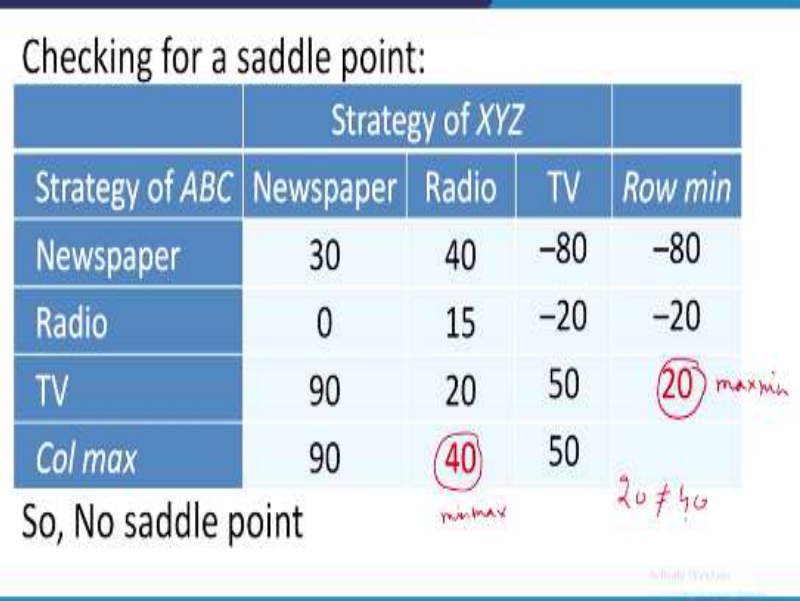

<mark>Now, first thing that you need to do is; identify whether there is a saddle point or not so, as you can see in the first row, we have 30, 40 and -80 so, the row minimum is -80 and in the second row, we have 0, 15 and -20 so, row minimum is -20. Third row; 90, 20 and 50 so, row minimum is 20 and now from this row minimum, we have to select the maximum so, the max min is 20, this is max min. And likewise we look at the columns so, in the first column, the maximum of 30, 0 and 90 is 90, maximum of 40, 15 and 20 is 40, maximum of -80, -20 and 50 is 50 and amongst this 90, 40 and 50, we have to choose the minimum so, 40 is the min max. Now, both of them are not equal so, we know that 20 not equal to 40 so, this means that there is no saddle point in this particular problem. So, therefore we can apply the mixed strategies that we have learnt.</mark> 

# **(Refer Slide Time: 08:56)** 

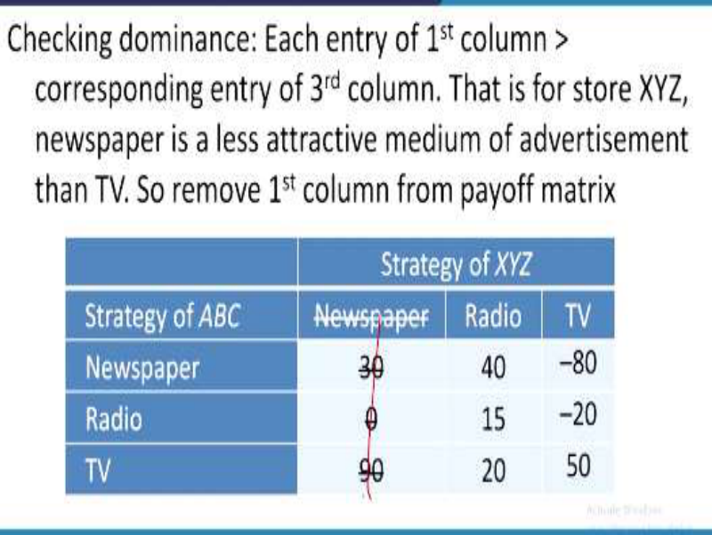

<mark>And the next step that we need to do is; to check whether any row or column is dominating any other row or column or not so, we will use the principles of dominance that we have learnt so, let us look at each entry of the first column. So, we find that each entry of the first column is greater than the corresponding entry of the third column, so that means that the store XYZ newspaper is a less attractive medium, newspaper is the first column, okay. So that means that newspaper is not an attractive medium so, therefore as compared to the TV; the newspaper is not an attractive medium of advertisement so, we can remove this so, first column can be removed, so that is what I have done, I have removed this first column.</mark> 

**(Refer Slide Time: 10:03)** 

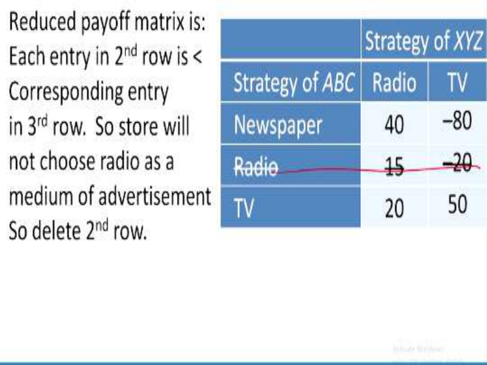

<mark>And on the same logic now, let us see what happens to the rows and we find that the radio is not a good strategy for the ABC player because each entry of the second row is less than the corresponding entry in the third row, so this means that we can strike off this particular row because this radio is not an attractive advertisement medium for the first player.</mark> 

**(Refer Slide Time: 10:56)** 

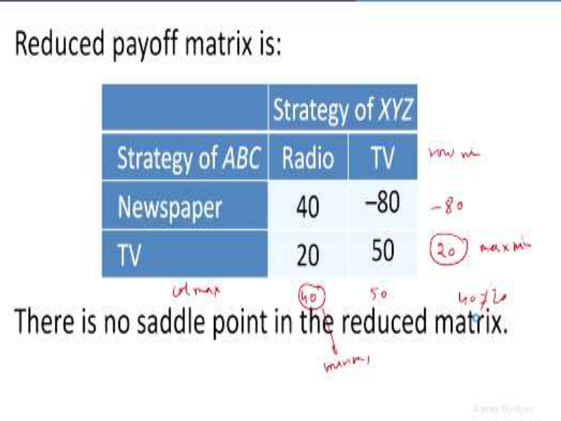

<mark>So, we are using the principles of dominance, we have reduced our 3 x 3 payoff matrix into a 2 x 2 payoff matrix now, this is what the payoff matrix looks like 40, - 80, 20 and 50 and you can verify that this particular 2 x 2 payoff matrix also does not have a saddle point, there is no saddle point to this game, let us just verify this because the row minimum is -80 for the first case and for the second case, it is 20 and the max min is 20 that is our max min. And on the other hand, the column maximum; column maximum is 40 and here it is 50, so therefore the min max turns out to be 40, so this is our min max and 40 is not equal to 20 and you will observe that this 40 and 20 is actually the same that we had in the original matrix. So, as I also told you a result that the rules of dominance that is the principles of dominance, they do not affect the value of the game, they do not affect the saddle point of the game and so on.</mark> 

<mark>So, therefore we have verified this result as far as the reduced matrix is concerned so, now let us try to solve this game.</mark> 

# **(Refer Slide Time: 12:56)** 

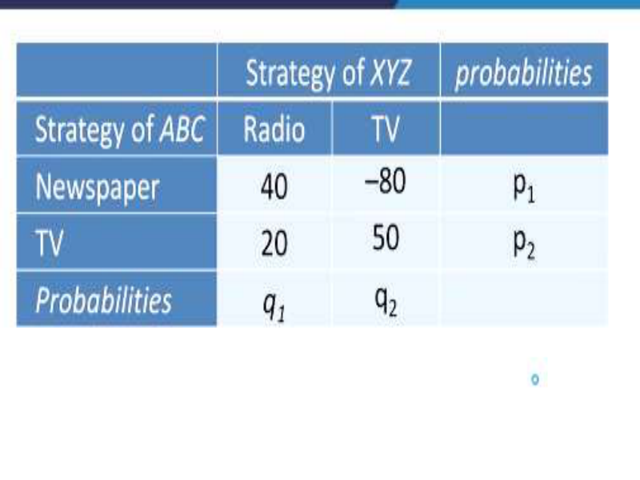

<mark>So, therefore we will assume the probabilities p</mark> 1 <mark>and p</mark> 2 <mark>for the first player and similarly, q</mark> 1 <mark>and q</mark> 2 <mark>for the second player.</mark> 

**(Refer Slide Time: 13:09)** 

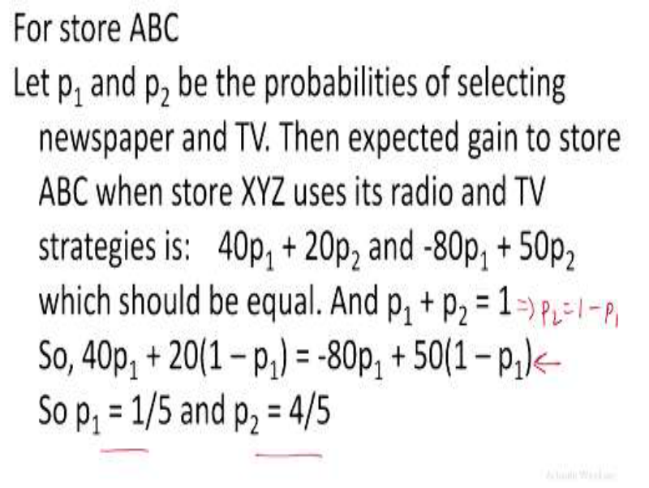

<mark>And we will write the for the store ABC, we have assumed that p</mark> 1 <mark>and p</mark> 2 <mark>are the probabilities of selecting the strategies newspaper and TV so, for the ABC player, there are only two strategies remaining that is the newspaper and TV because radio has been deleted. Then the expected gain to the store ABC when the store XYZ uses its radio and TV strategy is given by 40p</mark> 1 <mark>+ 20p</mark> 2 <mark>. Why did this come, from where did this come?</mark> 

<mark>This came from the first column, look at this first column so, 40p</mark> 1 <mark>+ 20p</mark> 2 <mark>and similarly, for the second column; -80p</mark> 1 <mark>+ 50p</mark> 2 <mark>.Therefore, both these strategies should be equated and we should also use the condition that p</mark> 1 <mark>+ p</mark> 2 <mark>= 1. So, we will substitute this condition that p</mark> 2 <mark>= 1 - p</mark> 1 <mark>from here, in the equation and when we do this; we will get the value of p</mark> 1 <mark>as 1/5 and p</mark> 2 <mark>as 4/5.</mark> 

**(Refer Slide Time: 14:58)** 

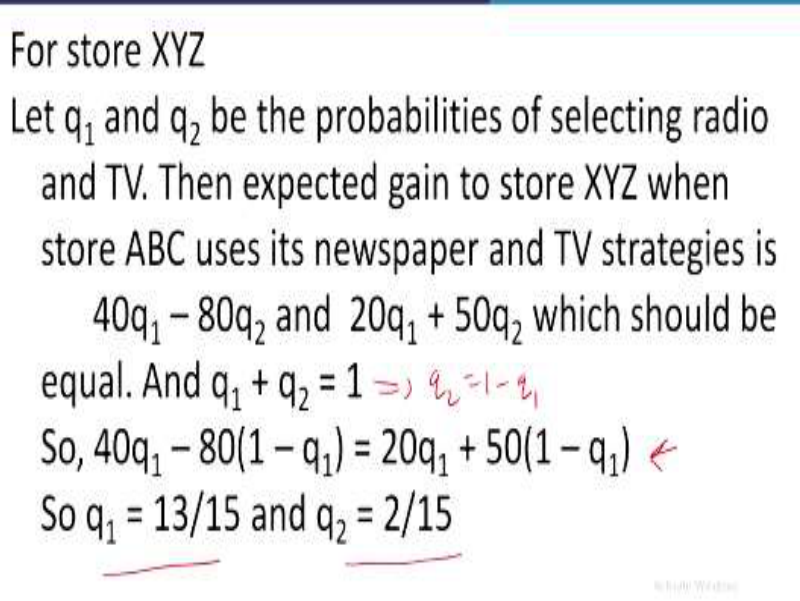

<mark>So, these are these strategies p</mark> 1 <mark>and p</mark> 2 <mark>corresponding to the first player that is the store ABC now similarly, let us look at what happens for the store XYZ. So, let q</mark> 1 <mark>and q</mark> 2 <mark>be the probabilities of selecting radio and TV because in this case, after applying the principles of dominance, the newspaper strategy has been deleted then, the expected gain to the store XYZ when the store ABC uses its newspaper and TV strategies is given by 40q</mark> 1 <mark>– 80q</mark> 2 <mark>. How did this come? 40q</mark> 1 <mark>– 80q</mark> 2 <mark>, the first row so, this is 40q</mark> 1 <mark>– 80q</mark> 2 <mark>. And similarly, for the second row 20q</mark> 1 <mark>+ 50q</mark> 2 <mark>, so this is the second row and they should both be equated along with the condition that q</mark> 1 <mark>+ q</mark> 2 <mark>= 1 again, from here we will use q</mark> 2 <mark>= 1 - q</mark> 1 <mark>and substitute in this equation and when we do that we get q</mark> 1 <mark>= 13/15 and q</mark> 2 <mark>= 2/15.</mark> 

**(Refer Slide Time: 16:32)** 

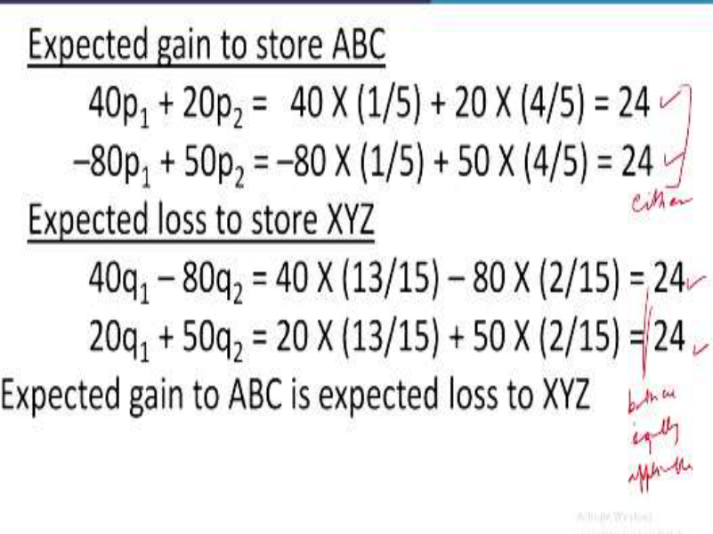

<mark>So, therefore we have concluded that these are the two strategies now, coming to the expected gain for the store ABC, we have the value of the game has to be calculated like this; 40p</mark> 1 <mark>+ 20p</mark> 2 <mark>you substitute the value of p</mark> 1 <mark>and p</mark> 2 <mark>and you should get 24, alternatively if you substitute in the second condition then, also you should get 24 you remember, you have to do it either of them and they will give you the same results.</mark> 

<mark>And also coming to the XYZ store, they are also if you substitute, 40q</mark> 1 <mark>– 80q</mark> 2 <mark>, the value of q</mark> 1 <mark>and q</mark> 2 <mark>is 13/15 and 2/15, they are also the value of the game will come out to be 24 no matter which one you use, so both are identical, both are equally applicable. So, the expected gain to ABC is the expected loss to the XYZ store. So, I hope this simple example has helped you to understand the theory that we have learnt.</mark> 

**(Refer Slide Time: 17:54)** 

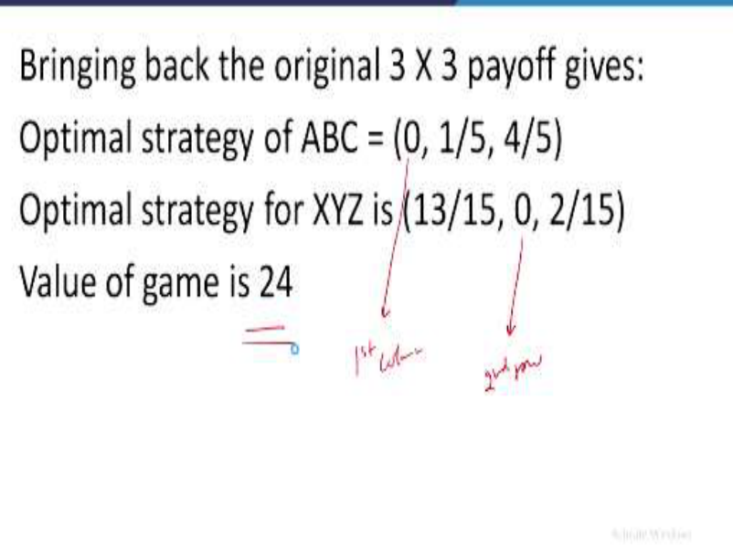

<mark>So, now we will bring back the original 3 x 3 payoff game and we will substitute 0 value in the first place for the ABC store now, this is because we had deleted the first column, right for the ABC store and similarly, we had deleted the second row, so because of this reason, we have a zero entry for the first place corresponding to these strategies; optimum strategies of the player ABC and similarly for the store XYZ, we have the zero entry at the second place.</mark> 

<mark>So that is the reason why because we had deleted this first column and the second row using the rules of the dominance also, the value of the game is 24, why is this 24; we have just now calculated here in the previous slide. So, with this we completely solve this game.</mark> **(Refer Slide Time: 19:11)** 

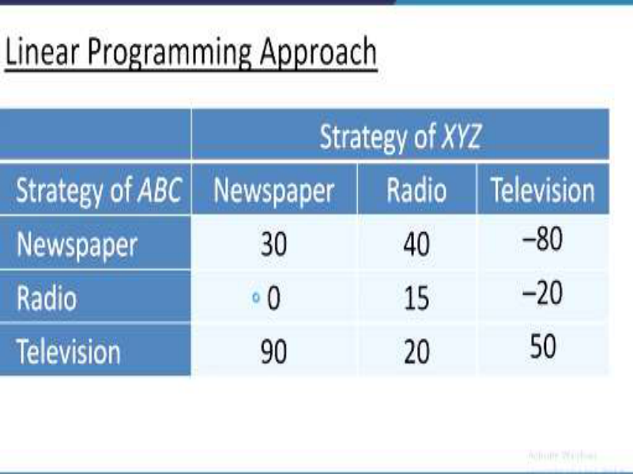

<mark>Now, alternatively let us try to solve the same problem by the linear programming approach, the data is as before; 30, 40, -80, 0, 15, - 20, 90, 20 and 50 now, as you remember we will model this problem as a linear programming problem.</mark> 

**(Refer Slide Time: 19:35)** 

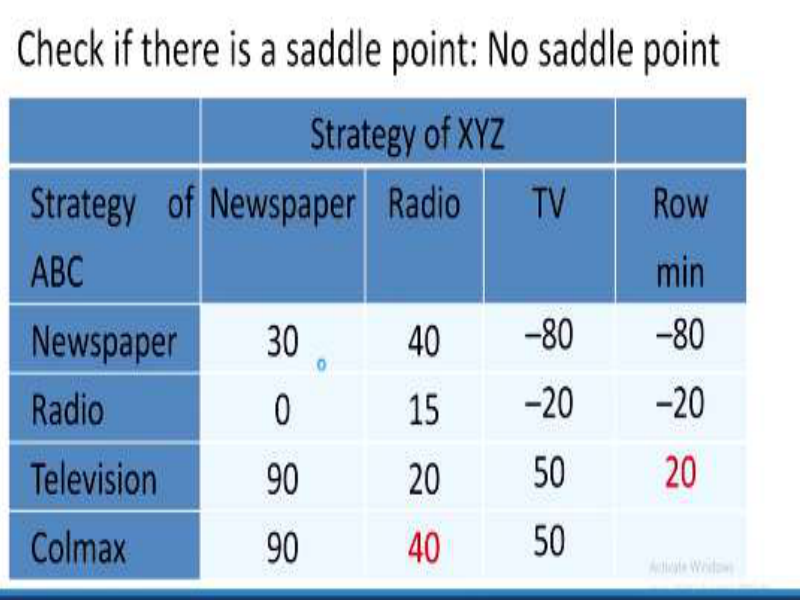

<mark>So, first thing is we need to check whether there is a saddle point or not, we have already done this so, we see that 20 is not equal to 40 so, there is no saddle point and therefore we can use the mixed strategies and formulate the linear programming problem.</mark> 

**(Refer Slide Time: 19:51)** 

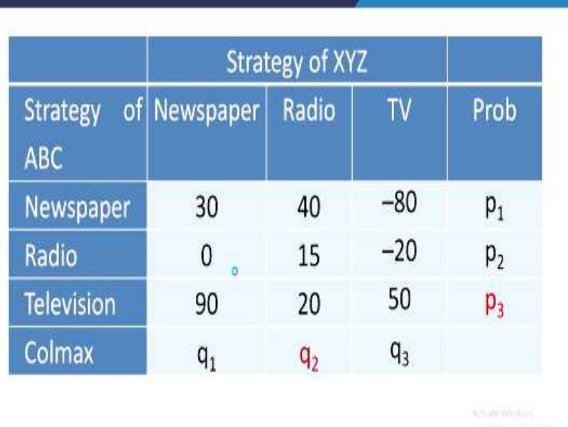

<mark>Now, we will write down the probabilities; p</mark> 1 <mark>, p</mark> 2 <mark>, p</mark> 3 <mark>for the ABC store and q</mark> 1 <mark>, q</mark> 2 <mark>, q</mark> 3 <mark>for the store XYZ.</mark> 

# **(Refer Slide Time: 20:07)** 

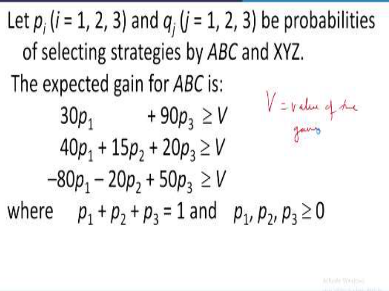

<mark>Of course, you can use the rules of dominance here also but just to illustrate, I have not used the rules of dominance for this analysis so, let p</mark> i <mark>from i = 1, 2, 3 and q</mark> i <mark>’s; i = 1, 2, 3 be the probabilities of selecting the strategies of ABC and XYZ and the expected gain for the first store ABC is 30</mark> _<mark>p</mark>_ 1 <mark>+ 90</mark> _<mark>p</mark>_ 3 <mark></mark> _<mark>V</mark>_ <mark>where V is the value of the game. How did this come? Look at the first column; 30, 0, 90 so, 30, 0, 90 tells us that 30</mark> _<mark>p</mark>_ 1 <mark>+ 90</mark> _<mark>p</mark>_ 3 <mark></mark> _<mark>V</mark>_ <mark>, where V is the value of the game. And likewise, we have the second constraint that is   40</mark> _<mark>p</mark>_ 1 <mark>+ 15</mark> _<mark>p</mark>_ 2 <mark>+ 20</mark> _<mark>p</mark>_ 3 <mark></mark> _<mark>V</mark>_ <mark>, this is the second column 40, 15 and 20 similarly, the third constraint –80</mark> _<mark>p</mark>_ 1 <mark>– 20</mark> _<mark>p</mark>_ 2 <mark>+ 50</mark> _<mark>p</mark>_ 3 <mark></mark> _<mark>V</mark>_ <mark>, this is corresponding to the third column; - 80, -20, 50. Of course we must not forget that</mark> _<mark>p</mark>_ 1 <mark>+</mark> _<mark>p</mark>_ 2 <mark>+</mark> _<mark>p</mark>_ 3 <mark>= 1  and they should be all  > 0.</mark> 

**(Refer Slide Time: 21:48)** 

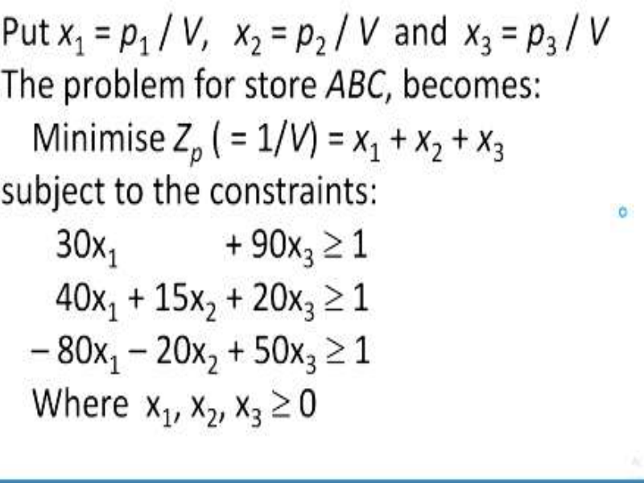

<mark>Now, remember that in order to solve this problem using the LP approach, we make the following substitution, let</mark> _<mark>x</mark>_ 1 <mark>=</mark> _<mark>p</mark>_ 1 <mark>/</mark> _<mark>V</mark>_ <mark>,</mark> _<mark>x</mark>_ 2 <mark>=</mark> _<mark>p</mark>_ 2 <mark>/</mark> _<mark>V</mark>_ <mark>and</mark> _<mark>x</mark>_ 3 <mark>=</mark> _<mark>p</mark>_ 3 <mark>/</mark> _<mark>V</mark>_ <mark>therefore, the problem for the store ABC becomes minimize Z</mark> p <mark>( = 1/</mark> _<mark>V</mark>_ <mark>) =</mark> _<mark>x</mark>_ 1 <mark>+</mark> _<mark>x</mark>_ 2 <mark>+</mark> _<mark>x</mark>_ 3 <mark>subject to the constraints 30x</mark> 1 <mark>+ 90x</mark> 3 <mark> 1;  similarly, 40x</mark> 1 <mark>+ 15x</mark> 2 <mark>+ 20x</mark> 3 <mark> 1 ,  – 80x</mark> 1 <mark>– 20x</mark> 2 <mark>+ 50x</mark> 3 <mark> 1 and of course, x</mark> 1 <mark>, x</mark> 2 <mark>, x</mark> 3 <mark> 0. Now, if you compare this problem with the previous one, you will find that p</mark> 1 <mark>+ p</mark> 2 <mark>+ p</mark> 3 <mark>= 1, need not be added here because this will be automatically satisfied, right.</mark> 

**(Refer Slide Time: 23:06)** 

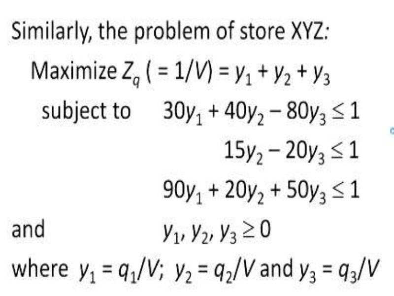

<mark>Now, on the same logic, we can write the problem for the store XYZ which turns out to be maximize</mark> _<mark>Z</mark> q_ <mark>( = 1/</mark> _<mark>V</mark>_ <mark>) =</mark> _<mark>y</mark>_ 1 <mark>+</mark> _<mark>y</mark>_ 2 <mark>+</mark> _<mark>y</mark>_ 3 <mark>and this is subject to 30</mark> _<mark>y</mark>_ 1 <mark>+ 40</mark> _<mark>y</mark>_ 2 <mark>– 80</mark> _<mark>y</mark>_ 3 <mark> 1, remember that</mark> 

<mark>both these problems that is the problem corresponding to ABC and the problem corresponding to XYZ, they are the dual of the each other. So, look at this previous one, it was minimization with greater than equal to constraints. And for the XYZ, it is maximization with less than equal to constraints and the a</mark> ij <mark>matrix corresponding to the decision variables, they are becoming the transpose, remember we have learnt this is the way the dual works. So, now for the store XYZ, we have the dual which is in terms of y</mark> 1 <mark>, y</mark> 2 <mark>, y</mark> 3 <mark>. Of course, we have not to forget that the substitution that we are made is that</mark> _<mark>y</mark>_ 1 <mark>=</mark> _<mark>q</mark>_ 1 <mark>/</mark> _<mark>V</mark>_ <mark>;</mark> _<mark>y</mark>_ 2 <mark>=</mark> _<mark>q</mark>_ 2 <mark>/</mark> _<mark>V</mark>_ <mark>and</mark> _<mark>y</mark>_ 3 <mark>=</mark> _<mark>q</mark>_ 3 <mark>/</mark> _<mark>V</mark>_ <mark>.</mark> 

**(Refer Slide Time: 24:28)** 

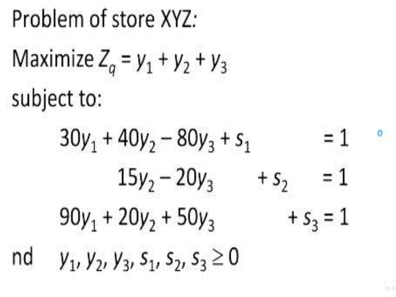

<mark>So, the problem of the store XYZ, we will solve this, remember that since the primal and the dual their solutions can be derived from the optimum solutions one from the other, so it is convenient to solve this problem corresponding to the store XYZ because the constraints are of the less than equal to type, if we solve the previous problem that is the problem corresponding to ABC, then it is going to be difficult. Because there the dual will have the greater than or equal to constraints and therefore, it is difficult to solve the greater than equal to constraints because in each constraint, you need to subtract a variable and then you have to use the big M and the two phase method by adding some artificial variables but less than equal to constraints are easy to handle because you just need to add some slack variables, so that is what we are doing here. We will solve this problem for XYZ and whatever solution we will get from the optimum table we will try to deduce the solution of the primal. So, we have added s</mark> 1 <mark>, s</mark> 2 <mark>, s</mark> 3 <mark>into the three equations.</mark> 

**(Refer Slide Time: 25:52)** 

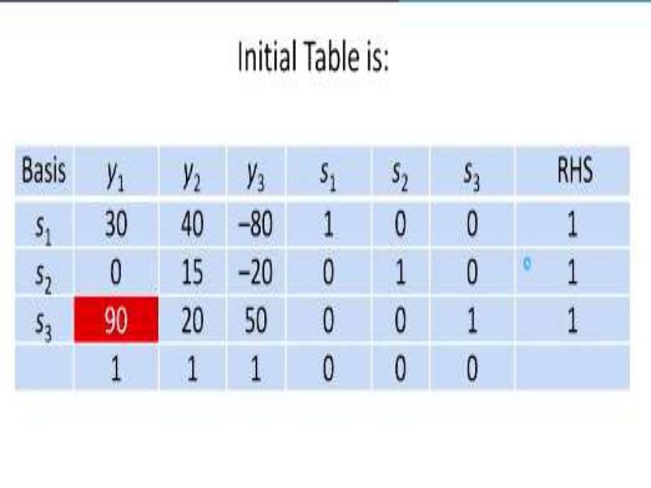

<mark>And tabulated this information in our initial table, you can see the basis is s</mark> 1 <mark>, s</mark> 2 <mark>, s</mark> 3 <mark>we have,</mark> _<mark>y</mark>_ 1 <mark>,</mark> _<mark>y</mark>_ 2 <mark>,</mark> _<mark>y</mark>_ 3 <mark>,</mark> _<mark>s</mark>_ 1 <mark>,</mark> _<mark>s</mark>_ 2 <mark>,</mark> _<mark>s</mark>_ 3 <mark>and the right hand side and then, we calculate the deviation row, we find that there is a tie 1 1 1 so, we will use the first index, so that means 90 is our pivot which is being highlighted in this cell in this table.</mark> 

**(Refer Slide Time: 26:25)** 

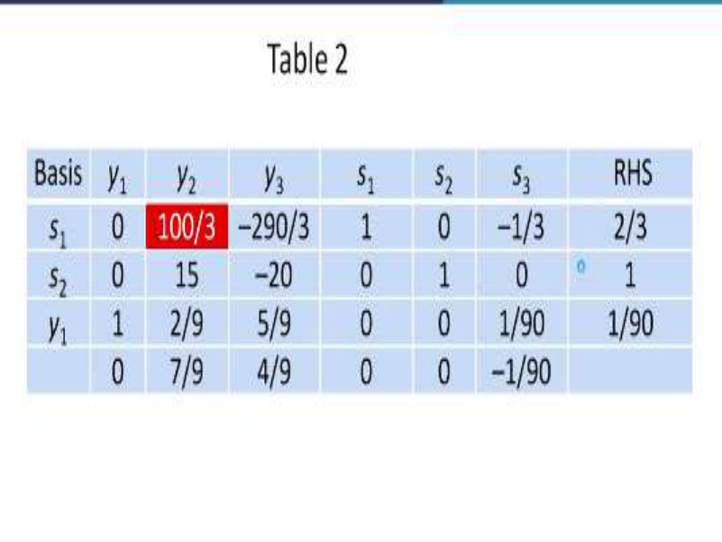

<mark>And using this 90 as a pivot, we will compute the table number 2, this is the table number 2 and again, we will calculate the deviation entries and we find that 100/3 is the pivot.</mark> **(Refer Slide Time: 26:40)** 

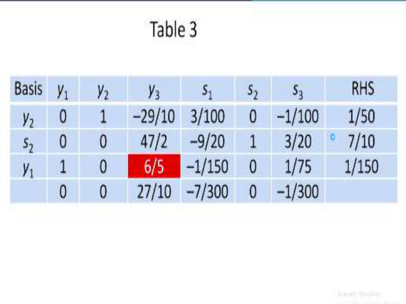

<mark>Similarly, the table number 3, again we find that 6/5 is the pivot.</mark> **(Refer Slide Time: 26:51)** 

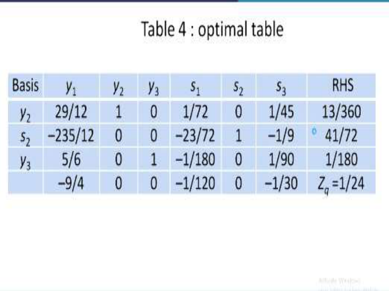

<mark>And the optimum table, you find over here, the optimum table is given in table number 4 because here the all the entries in the deviation row are 0 or negative which indicates that stopping criteria has been satisfied and therefore, we should stop here. Now, the solution we get the solution from this table. This optimum table tells us the solution of this problem as well as its dual.</mark> 

**(Refer Slide Time: 27:42)** 

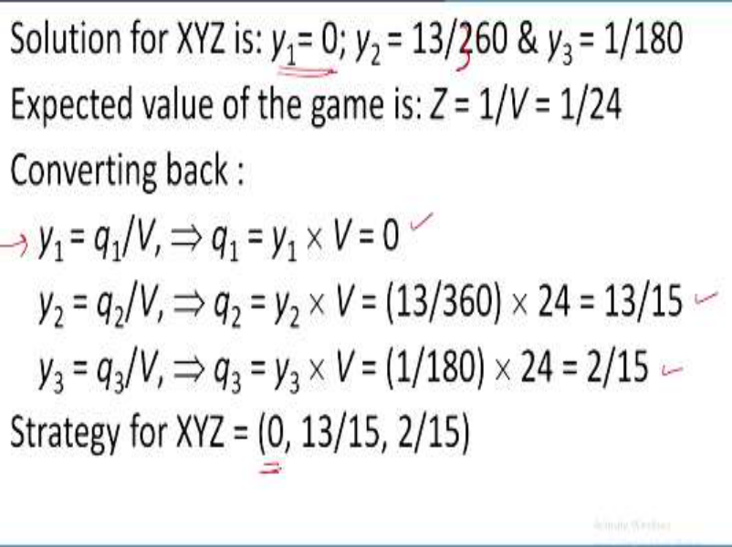

<mark>So, the solution of the XYZ problem</mark> _<mark>y</mark>_ 1 <mark>= 0;</mark> _<mark>y</mark>_ 2 <mark>= 13/360 &</mark> _<mark>y</mark>_ 3 <mark>= 1/180, I am sorry , this should be 13/360 that is a typing mistake and of course, the expected value of the game is Z which is given by 1/V= 1/24. Therefore we will convert this information back in to our terms of q</mark> 1 <mark>, q</mark> 2 <mark>because remember q</mark> 1 <mark>, q</mark> 2 <mark>, q</mark> 3 <mark>are our original variables, we have made this substitution y</mark> 1 <mark>= q</mark> 1 <mark>/V. So, this tells me that</mark> _<mark>q</mark>_ 1 <mark>=</mark> _<mark>y</mark>_ 1 <mark></mark> _<mark>V</mark>_ <mark>= 0  and similarly,</mark> _<mark>q</mark>_ 2 <mark>=</mark> _<mark>y</mark>_ 2 <mark></mark> _<mark>V</mark>_ <mark>= (13/360)  24 = 13/15 and</mark> _<mark>q</mark>_ 3 <mark>=</mark> _<mark>y</mark>_ 3 <mark></mark> _<mark>V</mark>_ <mark>= (1/180)  24 = 2/15 and the strategies for the XYZ store turn out to be (0, 13/15,  2/15), remember this 0 has come from y</mark> 1 <mark>= 0 over here, if we had used the rules of the dominance, then automatically this would have been removed. But anyway since we have not used the rules of the dominance because the rules of the dominance are optional, so that is why I have shown the working of this problem without applying the rules of the dominance.</mark> **(Refer Slide Time: 29:39)** 

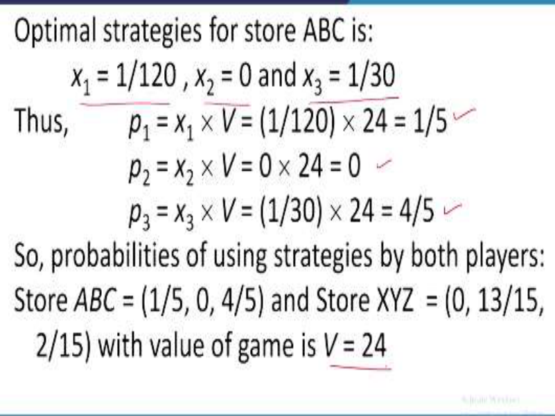

<mark>Now, coming to the optimum strategies for the store ABC, I mean we can observe the values of this problem from the optimum table of the simplex calculations that we have got. So, what do we find; we find from this last table. We have the optimum table as this one and we find that the solution for the dual is shown here,</mark> _<mark>x</mark>_ 1 <mark>= 1/120,</mark> _<mark>x</mark>_ 2 <mark>= 0 and</mark> _<mark>x</mark>_ 3 <mark>= 1/30, 1/120 and 1/130 and of course, x</mark> 2 <mark>is 0. So, now we will convert back to the original variables that is p</mark> 1 <mark>, p</mark> 2 <mark>, p</mark> 3 <mark>using the same conditions and we have</mark> _<mark>p</mark>_ 1 <mark>=</mark> _<mark>x</mark>_ 1 <mark></mark> _<mark>V</mark>_ <mark>= (1/120)  24 = 1/5 and similarly,</mark> _<mark>p</mark>_ 2 <mark>=</mark> _<mark>x</mark>_ 2 <mark></mark> _<mark>V</mark>_ <mark>= 0  24 = 0</mark> 

<mark>and</mark> _<mark>p</mark>_ 3 <mark>=</mark> _<mark>x</mark>_ 3 <mark></mark> _<mark>V</mark>_ <mark>= (1/30)  24 = 4/5. So, the probabilities of using strategies by both the players that is the stores ABC is (1/5, 0, 4/5) and the store XYZ = (0, 13/15 and 2/15) and the value of the game is 24.</mark> 

<mark>You can verify that this result is the same what we had got using the previous approach so, the same question I have solved using both the approaches.</mark> 

**(Refer Slide Time: 31:41)** 

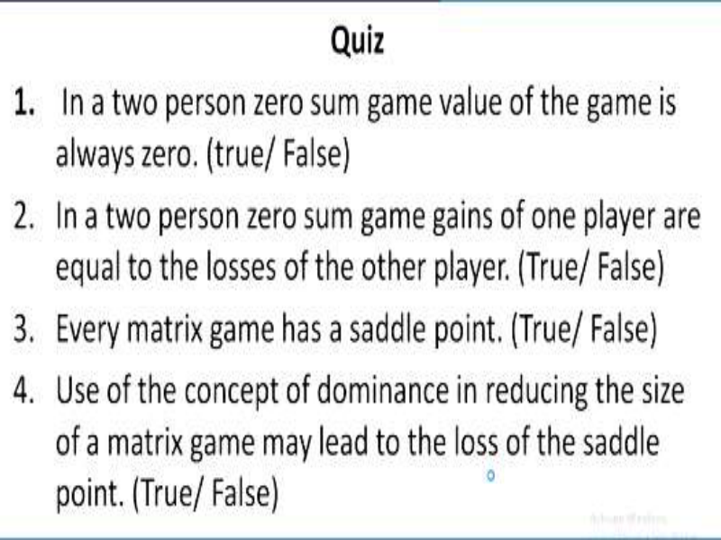

<mark>So, now is the time for the quiz, so please open your copies and write down the answers to these quiz questions and then later on I will give you the answers also. So, the first question is; in a two person zero sum game value of the game is always zero; true or false. Question number 2; in a two person zero sum game gains of one player are equal to the losses of the other player; true or false.</mark> 

<mark>Question number 3; every matrix game has a saddle point; true or false. Question number 4; use of the concept of dominance in reducing the size of a matrix game may lead to the loss of the saddle point; true or false?</mark> 

**(Refer Slide Time: 33:50)** 

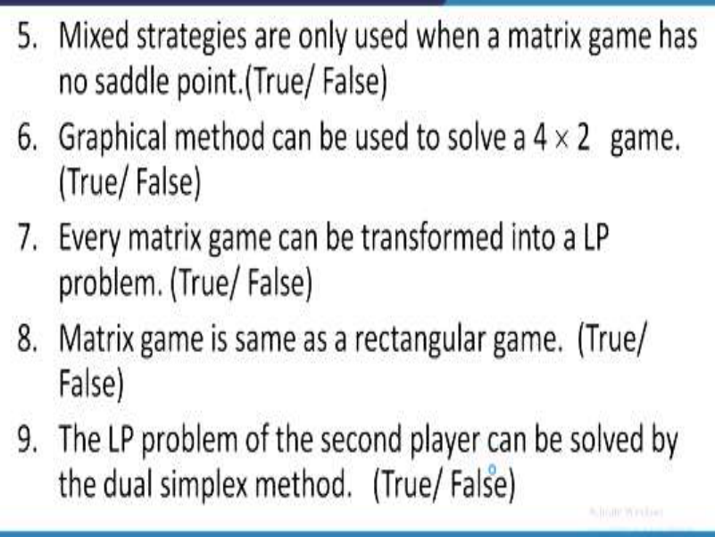

<mark>Question number 5; mixed strategies are only used when a matrix game has no saddle point; true or false. Question number 6; graphical method can be used to solve a 4 x 2 game; true or false. Question number 7; every matrix game can be transformed into a LP problem, true or false, question number 8; matrix game is the same as a rectangular game; true or false. Question number 9; the LP problem of the second player can be solved by the dual simplex method, true or false.</mark> 

**(Refer Slide Time: 35:50)** 

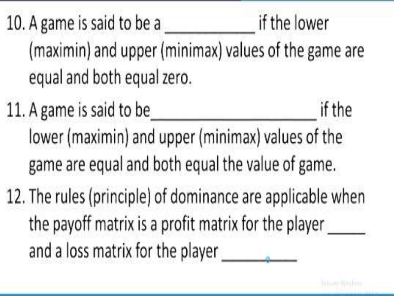

<mark>Question number 10; a game is said to be a _____, if the lower that is the maximum and the upper that is the minimum value use of the game are equal and both equal zero. Question number 11; a game is said to be a ____, if the lower (maxmin) and upper(minmax) values of the game are equal and both equal the value of the game. Question number 12; the principles of dominance are applicable when the payoff matrix is a profit matrix for the player ____ and a loss matrix for the player ___. The rules or principles of dominance are applicable when the payoff matrix is a profit matrix for the player dash and a loss matrix for the player dash.</mark> 

**(Refer Slide Time: 37:40)** 

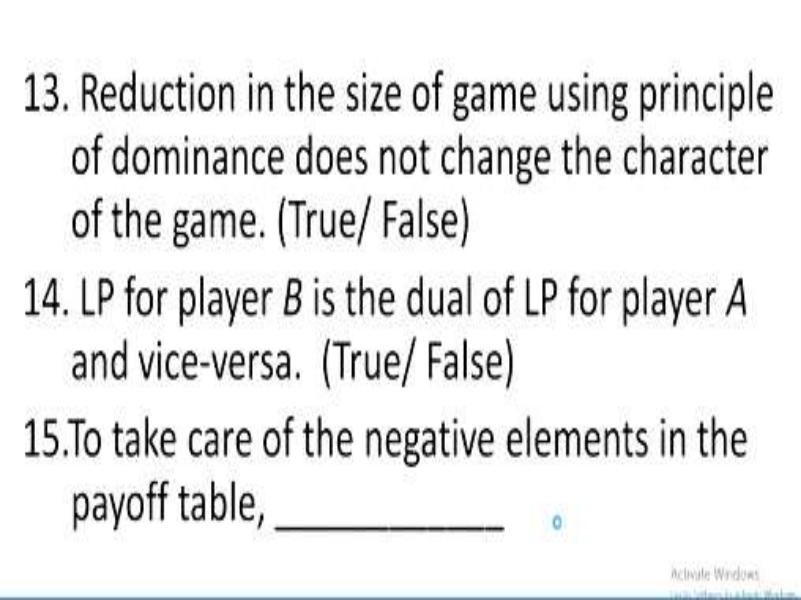

<mark>Question number 13; reduction in the size of the game using the principles of dominance does not change the character of the game; true or false. Question number 14; LP for player B is the dual of LP for the player A and vice versa; true or false. Question number 15; to take care of the negative elements in the payoff table, the procedure that has to be adopted is ____.</mark> 

**(Refer Slide Time: 39:01)** 

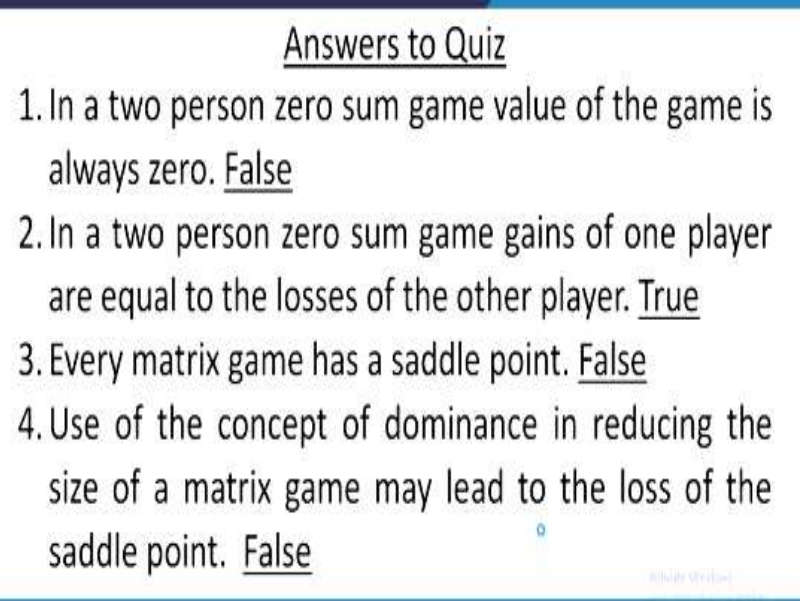

<mark>So, I hope you have written the answers in your notebooks now, let us look at the answers to these questions so, the question 1, the answer is false; in a two player zero sum game value of the game is always 0 is false. Question number 2; in a two person zero sum game gains of one player are equal to the losses of the other player that is answer is true. Question number 3; every matrix game has a saddle point; false.</mark> 

<mark>Question number 4; use of the concept of dominance in reducing the size of a matrix game may lead to the loss of the saddle point, false.</mark> 

**(Refer Slide Time: 39:52)** 

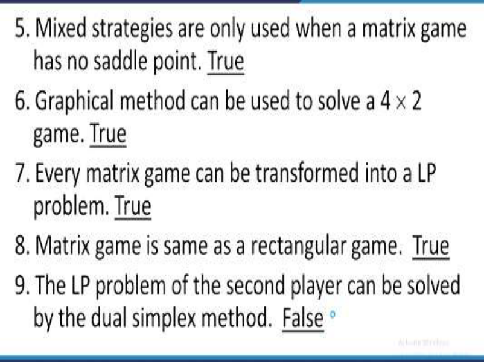

<mark>Question number 5; mixed strategies are only used when a matrix game has no saddle point; true. Question number 6; graphical method can be used to solve a 4 x 2 game; true. Question number 7; every matrix game can be transformed into a LP problem; true. Question number 8; matrix game is same as a rectangular game; true. Question number 9; the LP problem of second player can be solved by the dual simplex method; false.</mark> 

**(Refer Slide Time: 40:44)** 

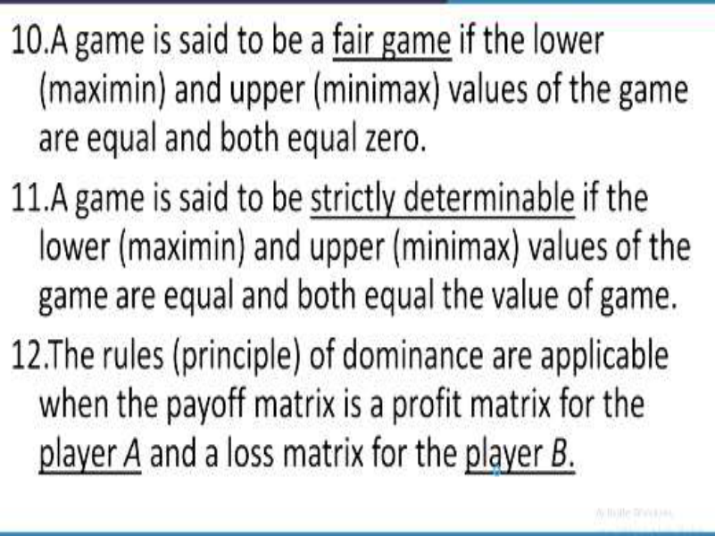

<mark>Question number 10; a game is said to be a fair game if the lower that is maximin and the upper that is minimax values of the game are equal and both equal to zero, a game is said to be strictly determinable if the lower that is max min and upper that is min max values of the game are equal and both equal to the value of the game. Question number 12; the rules or the principles of dominance are applicable when the payoff matrix is a profit matrix for the first player that is player A and has a loss matrix for the second player that is player B.</mark> 

**(Refer Slide Time: 41:36)** 

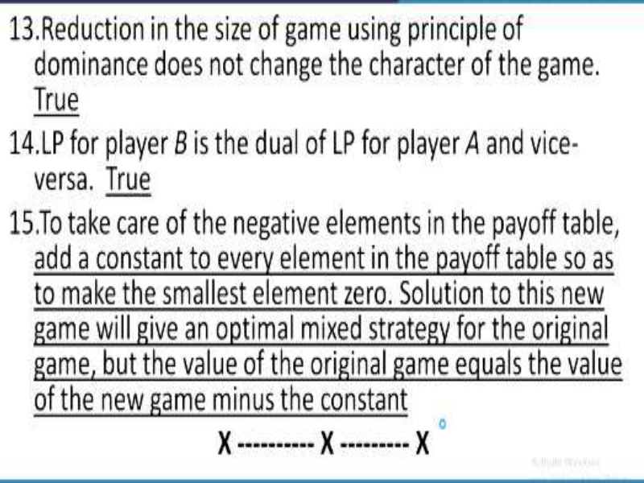

<mark>Question number 13; reduction in the size of the game using the principle of dominance does not change the character of the game; true. Question number 14; if the player B is the dual of LP for the player A and vice versa; true. Question number 15; to take care of the negative elements in the payoff table, add a constant to every element in the payoff table, so as to make the smallest element 0. The solution to this new game will give an optimal mixed strategy for the original game but the value of the original game equals to the value of the new game minus that constant.</mark> 

<mark>So, with this we come to an end of this lecture as well as this course, I hope you have enjoyed and benefitted from listening to this course, thank you very much.</mark> 

