# **Operations Research Prof. Kusum Deep Department of Mathematics Indian Institute of Technology - Roorkee** 

# **Lecture  – 09** 

# **Unbounded Solution for LLP** 

Good morning dear students, todays lecture is lecture number 9 and the title of todays lecture is the unbounded solution. 

**(Refer Slide Time: 00:38)** 

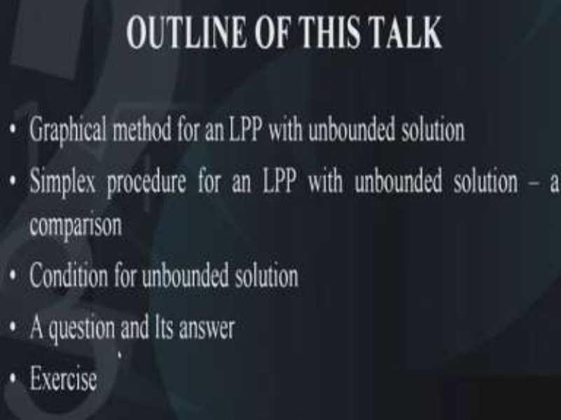

We will be talking about a linear programming problem which has a unbounded solution. The outline of todays talk is as follows, we will 1st study the graphical solution of a linear programming problem which is unbounded and then we will solve the same example with the help of the simplex method. The idea is to make a comparative analysis of the unbounded case with the help of both the methods, that is, the graphical solution and the simplex solution. The conclusion will be to find out those conditions under which we can identify that a problem has a unbounded solution during the simplex calculations. After that I will ask you a question and subsequently I will reply it to that question and finally I will give you an exercise. 

**(Refer Slide Time: 01:52)** 

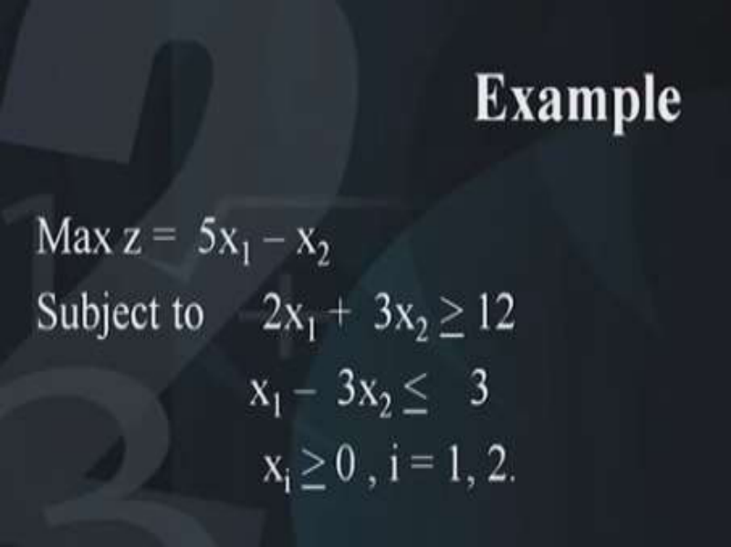

So let us begin now suppose we have this problem which is given to us it is maximization of 5x1 – x2 this is subject to two constraints of the type 2x1 +  3x2 <u>> 12, x1 –  3x2 <  3.</u> **(Refer Slide Time: 02:23)** 

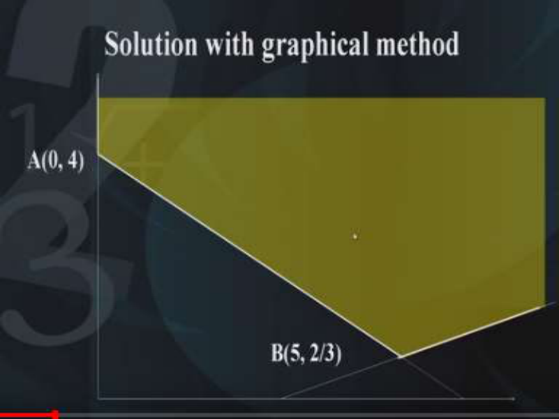

Now first of all, we will look at the solution with the help of the graphical method. So for this, we will need to plot the feasible domain. Now 1st of all, we will plot the constraints, so these are the two constraints this is the 1st constraint and this is the 2nd constraint and now we have to decide out of all these four regions which is the region that is the feasible domain corresponding to the problem. 

This is known by substituting the origin into the constraints and you can see that this region is of interest, this is highlighted by these bold lines. So these 3 lines enclose the feasible domain and the coordinates of these vertices are; we will call it as A(0, 4) similarly B(5,2/3) and this is the feasible region of the problem. 

Now as you will see that this feasible region is unbounded towards the right hand side and towards the upward direction.  Now the question is what is the solution? although the feasible domain indicates that the feasible domain is an unbounded region but we want to see what is the solution to the problem. So we will need to investigate the value of the objective function at these vertices and let us see what happens.  So the family of straight lines which represents the objective function is shown here and this can also tell or indicate that the problem has an unbounded solution. 

**(Refer Slide Time: 04:41)** 

So let us look at this table which indicates the value of the objective function at each of these points A,B etc. So the coordinates of A are (0,4) if you substituted in the objective function, that is, 5x1-x2 you get -4. Similarly, if you substitute B(5,2/3) then you get 73/3. Now since these are the only two points of the feasible region, we want to see what happens if we take a point P on the edge on a particular edge of the feasible region. 

So let us suppose you take a point P over here on this line on this edge of the vertex. Then this P has a value 29 if you substitute (6, 1) in the objective function and that is how the value of the objective function at the point P is 29. Now suppose, I take any point P on this line segment what will be its coordinates? since this point P is lying on this line segment its general form will be of the type (3+3y, y). This will be the general form of any point which is lying on this line segment and if you substitute this point P in the objective function 5x1-x2 what will you get? you will get 5(3+3y-y) and that comes out to be **<u>></u>** 29 and we see that as in how the value of y goes to infinity that is why the value of Z is increased as in how the value of y increases, the value of the objective function will also increase. This is an indication that the problem has an unbounded solution. So this particular problem has an unbounded feasible region and the solution is also unbounded. 

**(Refer Slide Time: 07:18)** 

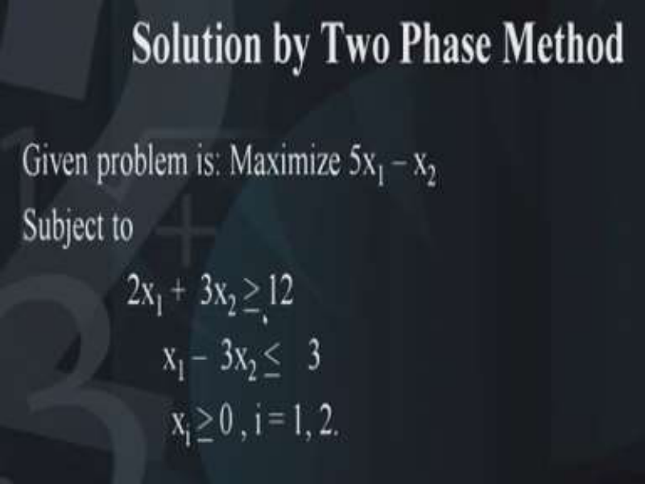

Now once we have done this, now let us look at the same problem with the help of the simplex method. Since there are one constraint is of the greater than type and the 2nd constraint is of the less than type, so now let us solve the problem with the simplex method. Now since the problem has two constraints, one constraint is of the greater than type and the 2nd constraint is of the less than type, therefore we will need to use artificial variables and we can use the two-phase method to solve this problem. So first of all let us convert this problem in the standard form. 

**(Refer Slide Time: 08:02)** 

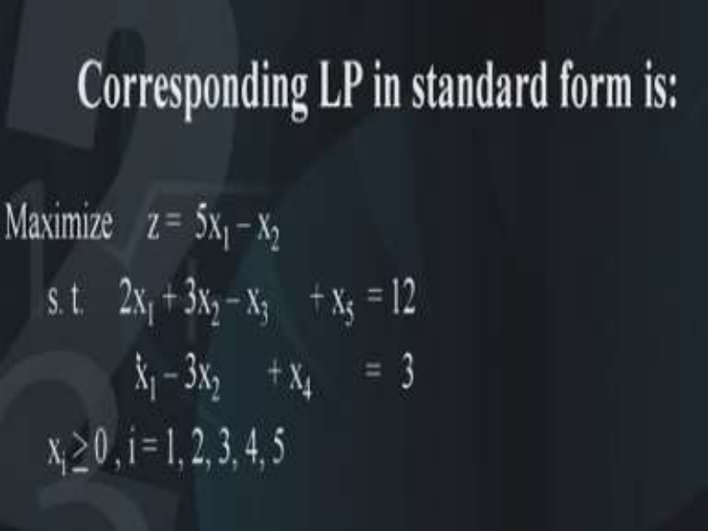

The problem in the standard form looks like this maximization of 5x1 – x2 subject to 2x1 + 3x2 – x3 + x5  = 12 and the 2nd constraint becomes x1 – 3x2 + x4 =3. Now this problem has been converted into the problem in the standard form. **(Refer Slide Time: 08:41)** 

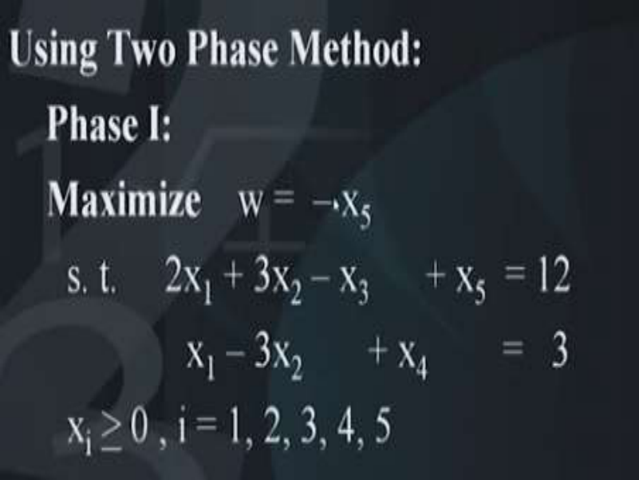

Since this artificial variable x5 has been introduced so we will use the two-phase method and in the first phase we are going to maximize -x5 because the phase 1 says minimization of some of the artificial variables or in other words maximization of -x5 or maximization of all the artificial variables. So the constraints are as before only thing is the original objective function has been set aside for the moment and it has been replaced by a temporary objective function that is maximization of -x5. 

**(Refer Slide Time: 09:32)** 

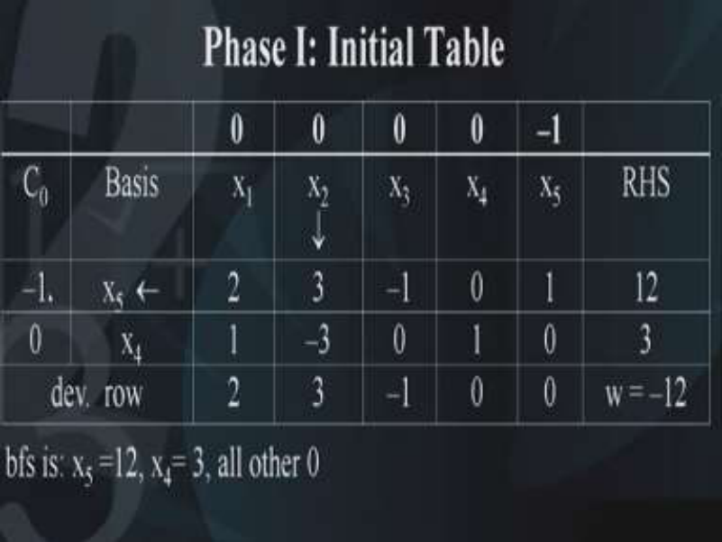

So let us write down the table, in the first phase, initial table looks like this, the basis are as follows, that is x5 and x4 and their corresponding values in the objective function are -1 and 0. x1 entries are 2, 1;  x2 entries are 3,-3;  x3 entries are -1, 0;  x4 entries are 0,1 and x5 entries are 1,0; and right-hand side is 12, 3. 

On the top row, we have the co-efficient of the objective function x1 has coefficient 0, x2 has coefficient 0, x3 has coefficient 0, x4 has coefficient 0. Only x5 has coefficient -1 in the phase 1. So 1st thing what we need to do is, we need to look at what is the BFS? In the initial table, the BFS is x5=12 and x4=3 and all other 0. So what will we do, first of all, we will calculate the deviation rows and how are they calculated? as you are very familiar now, the basic variables have entry 0. Since x4 variable is a basic variable therefore it has entry 0, similarly x5 is a basic variable so it has entry 0. The other three entries can be obtained as before 0 – (-1, 0) (2, 1) which comes out to be 2 and similarly 0 – (-1, 0) (3, -3) which comes out to be 3. So we need to take a decision which variable should enter the basis and for this we look at the entries in the deviation row and we find that 3 is the maximum value in the deviation rows. Therefore, this indicates that the variable x2 should enter into the basis. So the entering variable is x2 and then we need to perform the minimum ratio test by dividing the entries of the right-hand side with the pivot column, now you will observe that the pivot column has -3 as a negative entry so this has to be excluded while applying the minimum ratio test. It indicates that we have 

only one choice and that is x5 should leave the basis, therefore x5 should leave the basis. This indicates that our pivot is nothing but 3, and we have to make this 3 as 1 and the other entry as 0. So we have to apply the elementary row operations in such a way that 3, -3 becomes 1,0. So what we should do 1st of all we will divide the 1st row with 3. So here you are, R1 has to be replaced by R1/3 and the 2nd elementary row operation is R2 has to be replaced by R2+3R1 with these two elementary operations. We can now look at our next table. 

**(Refer Slide Time: 13:38)** 

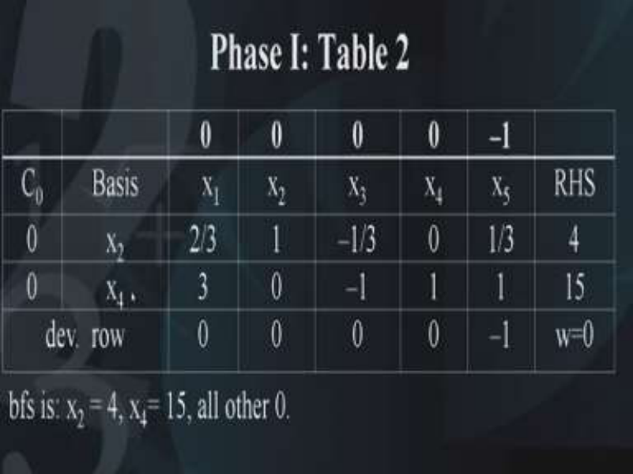

So phase 1 table 2 this is what it looks like, we have the two basic variables x2 and x4, and the entries are obtained like this 2/3,3,1,0,-1/3,-1,0,1,1/3,1; 4, 15 and the corresponding BFS turns out to be x2=4 and x4=15 and all others 0. Then we have to take a decision as to whether the stopping condition has been satisfied or not, we calculate the deviation entries and we find this turns out to be 0,0,0,0 and -1. This indicates that the stopping condition has been satisfied and therefore phase 1 is completed. So this tells us that the phase 1 has been completed and this corresponds to the point A in the graphical solution. Phase 1 is completed and it corresponds to the point A in the graphical solution. Let us look at the graphical solution this solution is telling us that it is (0, 4). So let me go back to the graphical solution yeah here it is. So this point A(0, 4) we have obtained at the end of phase 1 right. 

**(Refer Slide Time: 15:44)** 

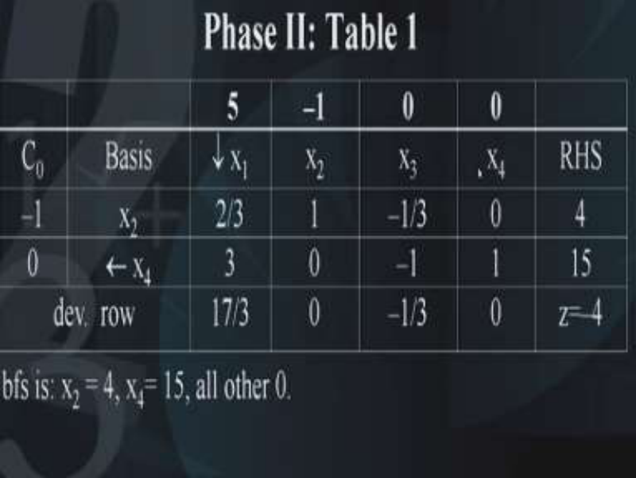

Next what we need to do is we need to look at the phase 2. So for phase 2 what we have to do is we have to bring back the original objective function into the problem and this will be incorporated by entering the top row in the table. So phase 2 table 1 will look like this 5,-1,0 and 0, these corresponds to x1 entry, x2 entry, x3 entry and x4 entry. You will notice that the x5 entry is not shown here in this table, the reason is that x5 was artificial variable. In the end of the previous phase 1 we have seen that x5 has become 0. At the end of the phase 1 table 2, we have seen that x5 has disappeared from the basis, so x5 is actually 0. Therefore, we can drop this x5 variable and move to the phase 2. So the phase 2 is having the same BFS as the end of the phase 1 and this is the basic feasible solution x5=4 and x4=15 and all others 0. 

So let us calculate the deviation rows. And we find that the deviation rows are as follows, 5 – (-1,0) (2/3,3)t which turns out to be 17/3 then -1 –(-1,0) (1,0)t which comes out to be 0, anyway this is a basic variable so its entry will be 0. Similarly x4 is a basic variable so its entry will also be 0. We need to calculate the entry corresponding to x3 which turns out to be 0-(-1, 0) (-1/3,-1)t which turns out to be -1/3. This indicates that only this entry corresponding to x1 is positive and this shows that x1 variable should be the entering variable. So our x1 should enter the basis and similarly we will perform the minimum ratio test 4/(2/3) and 15/1 and this tells us that our leaving variable is x4. So what is the pivot, yes the pivot is 3. 

So this 3 entry is the pivot. Now, we need to apply the elementary row operations in such a way that this column becomes 0 and 1. So what are the two elementary row operations that we should use, first of all we will make this entry 3 as 1 and this can be done by dividing the entire row by 3 therefore we will apply elementary row operation R2 has to be replaced by R2/3. Similarly we will apply another elementary row operation R1 should be replaced by 2/3 R2-R1.  So this means that this entry will become under x1 column will become 0 and 1. 

# **(Refer Slide Time: 19:37)** 

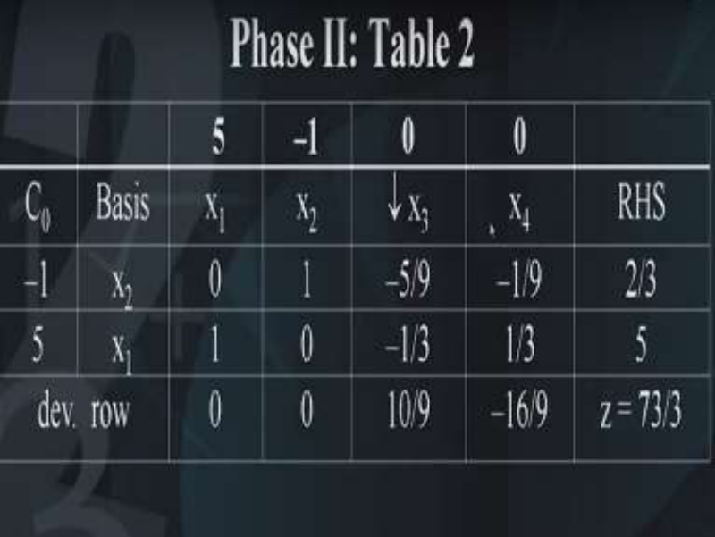

And this is the resulting table 2 for phase 2. Our entry under the x1 column has become 0 and 1 and similarly under x2 it has 1, 0; x3 is -5/9,-1/3 and under x4 -1/9, 1/3 and the right-hand side becomes 2/3 and 5. Now we need to calculate the deviation entries and we find that the deviation entries are 0, 0, 10/9 and -16/9. The BFS at this table at this stage is nothing but x2=2/3 and x1=5 and all others 0. 

Now you will observe that this particular point (5, 2/3) is nothing but the point corresponding to be in our graphical solution. So B(5, 2/3), this is the point in the graphical solution that we have seen. Let us just go back and see B (5, 2/3) in the graphical solution here it is B (5, 2/3). So in the 1st iteration we got A(0, 4) now we have got  B (5, 2/3). 

Therefore let us now look at what we have to do next we have to see which variable should be the entering variable. So the entering variable is nothing but the variable x3 because the entry corresponding to x3 variable in the deviation rows is positive only. Also the leaving variable has to be decided but what do you find? you find that all the entries in the pivot column that is under x3 they are negative. How do you see that? this is -5/9 this is negative, this is -1/3 this is negative, so you just cannot apply the minimum ratio test because as you know that the minimum ratio test has to be applied only for entries in the pivot column which are positive, but here we do not have any positive entries and therefore the minimum ratio test cannot be applied and therefore the leaving variable cannot be decided, so the minimum ratio test has failed and therefore this is an indication that the problem has a unbounded solution and in fact this is what we were looking for. So the condition to identify in the simplex calculations whether a given problem has a unbounded solution or not is this, that is, if the minimum ratio test fails due to all entries in the pivot column either 0 or negative, then this indicates that the problem has a unbounded solution. 

**(Refer Slide Time: 23:40)** 

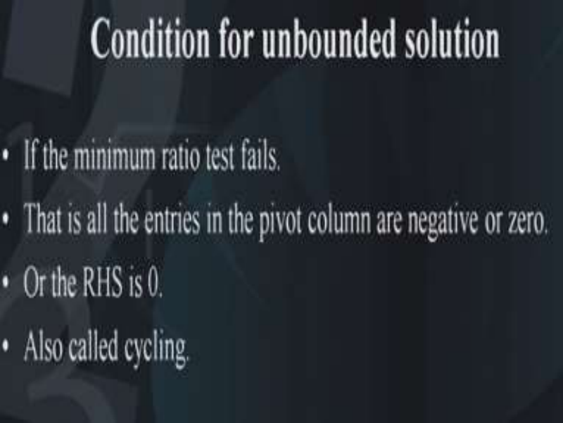

So we can conclude that if the minimum ratio test fails then it can be concluded that the problem has unbounded solution, that is all the entries in the pivot column are either 0 or 

negative. Also there could be a situation where the right-hand side is 0. This situation is called cycling which I have not included in this particular lecture. **(Refer Slide Time: 24:13)** 

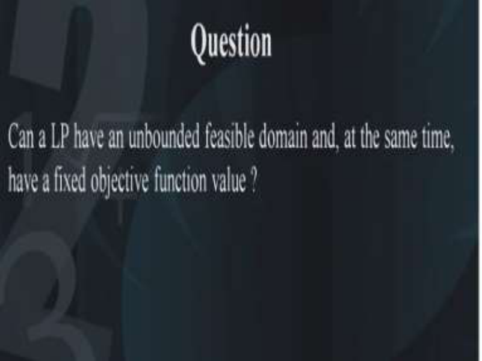

So with this condition now we have a question in front of us and the question is, is it possible for an LP to have an unbounded feasible domain and at the same time have a fixed objective function value or a finite objective function value? so you can just think about this whether it is possible or not because there are two things one is the feasible domain, the feasible domain is unbounded and the second thing is the objective function value goes on to infinity, as we have seen in the previous example but at this moment I am asking you is it possible that a LP has a unbounded feasible region and at the same time its objective function value is finite that is it does not go to infinity and in fact it becomes fixed. 

**(Refer Slide Time: 25:23)** 

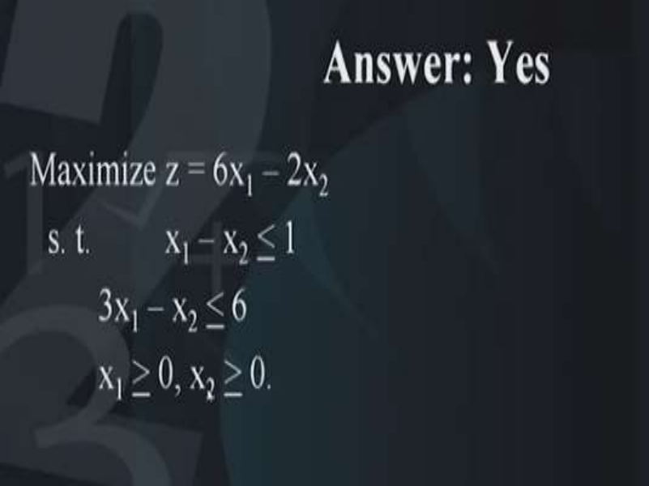

The answer to this is yes. This can be seen in this example maximization of 6x1 – 2x2 subject to x1 – x2 <u>< 1, 3x1 – x2 < 6 and x1 and x2 both > 0.</u> 

**(Refer Slide Time: 25:51)** 

Now what is the meaning of this problem let us look at it graphically. So first of all, we will try to draw the two constraints so that we can see what the feasible domain looks like. So first thing 1st constraint this is what it looks like and we have to decide whether the feasible domain is above the line or below the line and we find that the feasible domain is above the line which is indicated by the arrow. 

Then we plot the second line so here is the 2nd constraint and then we decide whether the feasible domain is above the line or below the line this we determine by substituting the origin into the constraint and we find that the feasible domain is above the line. Now this indicates that our feasible region is bounded by these line segments 1st of all this line segment 2nd line segment 3rd line segment and 4th line segment. So this is the feasible region of the problem and we can shade this feasible region to indicate that this is unbounded towards the vertical direction (upward vertical direction), also we need to look at the vertices of this feasible region the first vertex is O that is the origin then we have A then we have B and let us look at the family of straight lines which represents the objective function. 

Now we will evaluate the objective function at each of these points O,A,B. So here you see O is the origin so the objective function value is 0. The point A is (1, 0) and its value is 6, similarly at B the point is (5/2, 3/2) its value is 12. And in fact what do you find that suppose you take any point P on the line segment as indicated in the figure its value will also be 12 now how to determine this. This can be determined by looking at the general formula for a point P on this line segment because it satisfies this particular constraint therefore this point P has the coordinates (t, 3t-4) where t goes to infinity and if you substitute this point P into the objective function you will get a value 12 and this indicates that for all points lying on this edge. 

All points on this line segment BP will have a constant value 12, this indicates that the problem has a unbounded feasible region but the objective function value is not infinite it is finite and it is fixed equal to 12 and this is also indicated by the family of straight lines which represents the objective function in fact you can see that the problem has multiple solutions. Why it has multiple solutions? it has multiple solutions because the slope of the objective function is the same as the slope of the constraint. This you could have seen by looking at the problem itself, see 6x1-2x2 this the slope of this objective function is the same as the slope of 3x1- x2<=6 and this is an indication that the problem has multiple solutions, but it also has a feasible domain which is unbounded. 

So therefore this beautiful example illustrates that a problem may have unbounded feasible domain but the objective function value could be finite. 

# **(Refer Slide Time: 31:10)** 

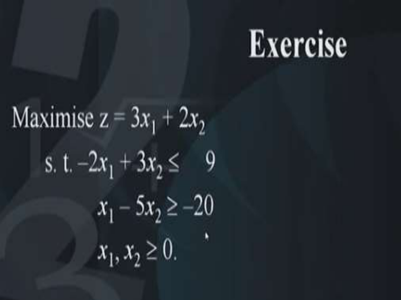

So now I will give you an example to solve, so please solve this example later on maximization of 3 _x_ 1 + 2 _x_ 2  subject to –2 _x_ 1 + 3 _x_ 2  9, _x_ 1 – 5 _x_ 2  –20. Now the hint for solving this problem is you have to take care of this negative sign. The right-hand side is negative and as you know that for solving an LP the right-hand side should be positive. So you have to convert it into the positive side by multiplying it with the negative sign. Thank you. 

